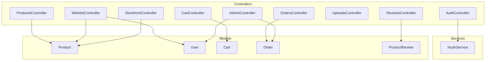
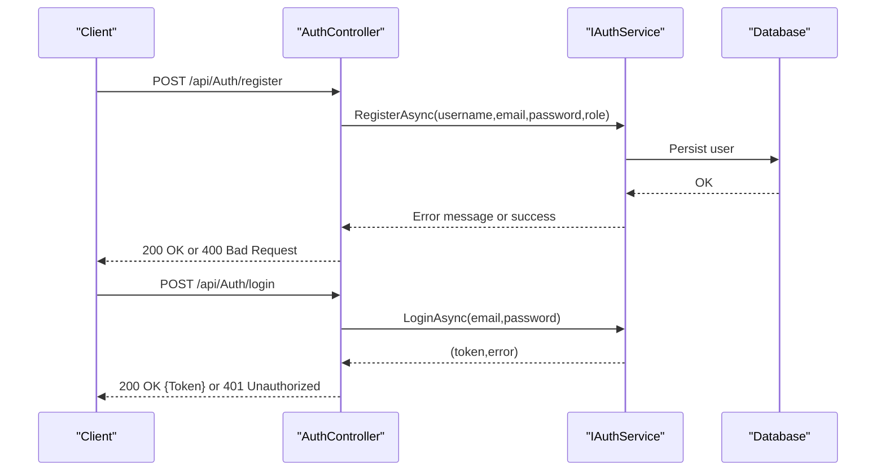
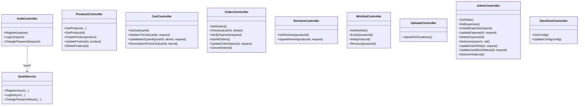

# API Reference Documentation

<cite>
**Referenced Files in This Document**
- [Program.cs](file://Program.cs)
- [appsettings.json](file://appsettings.json)
- [AuthController.cs](file://Controllers/AuthController.cs)
- [ProductsController.cs](file://Controllers/ProductsController.cs)
- [CartController.cs](file://Controllers/CartController.cs)
- [OrdersController.cs](file://Controllers/OrdersController.cs)
- [ReviewsController.cs](file://Controllers/ReviewsController.cs)
- [WishlistController.cs](file://Controllers/WishlistController.cs)
- [UploadsController.cs](file://Controllers/UploadsController.cs)
- [AdminController.cs](file://Controllers/AdminController.cs)
- [StorefrontController.cs](file://Controllers/StorefrontController.cs)
- [IAuthService.cs](file://Services/IAuthService.cs)
- [Product.cs](file://Models/Product.cs)
- [User.cs](file://Models/User.cs)
- [Cart.cs](file://Models/Cart.cs)
- [Order.cs](file://Models/Order.cs)
- [ProductReview.cs](file://Models/ProductReview.cs)
</cite>

## Table of Contents
1. [Introduction](#introduction)
2. [Project Structure](#project-structure)
3. [Core Components](#core-components)
4. [Architecture Overview](#architecture-overview)
5. [Detailed Component Analysis](#detailed-component-analysis)
6. [Dependency Analysis](#dependency-analysis)
7. [Performance Considerations](#performance-considerations)
8. [Troubleshooting Guide](#troubleshooting-guide)
9. [Conclusion](#conclusion)
10. [Appendices](#appendices)

## Introduction
This document provides a comprehensive API reference for Note.Backend’s RESTful endpoints. It covers HTTP methods, URL patterns, request/response schemas, authentication requirements, parameters, response codes, and error handling patterns. Practical curl examples, SDK integration guidance, and client implementation best practices are included. Endpoints are organized by functional areas: authentication, products, cart, orders, media, reviews, and wishlist. Additional topics include rate limiting, pagination, API versioning strategy, common integration scenarios, and troubleshooting.

## Project Structure
The API surface is implemented via ASP.NET Core controllers grouped by domain. Each controller exposes endpoints under the api/{controller} route template. Authentication is enforced via attributes and JWT tokens. Administrative endpoints require the Admin role. Data models define request/response shapes.

**Diagram sources**
- [AuthController.cs:1-76](file://Controllers/AuthController.cs#L1-L76)
- [ProductsController.cs:1-60](file://Controllers/ProductsController.cs#L1-L60)
- [CartController.cs:1-59](file://Controllers/CartController.cs#L1-L59)
- [OrdersController.cs:1-121](file://Controllers/OrdersController.cs#L1-L121)
- [ReviewsController.cs:1-94](file://Controllers/ReviewsController.cs#L1-L94)
- [WishlistController.cs:1-82](file://Controllers/WishlistController.cs#L1-L82)
- [UploadsController.cs:1-80](file://Controllers/UploadsController.cs#L1-L80)
- [AdminController.cs:1-306](file://Controllers/AdminController.cs#L1-L306)
- [StorefrontController.cs:1-78](file://Controllers/StorefrontController.cs#L1-L78)
- [IAuthService.cs:1-11](file://Services/IAuthService.cs#L1-L11)
- [Product.cs:1-21](file://Models/Product.cs#L1-L21)
- [User.cs:1-12](file://Models/User.cs#L1-L12)
- [Cart.cs:1-10](file://Models/Cart.cs#L1-L10)
- [Order.cs:1-62](file://Models/Order.cs#L1-L62)
- [ProductReview.cs:1-14](file://Models/ProductReview.cs#L1-L14)

**Section sources**
- [Program.cs](file://Program.cs)
- [appsettings.json](file://appsettings.json)

## Core Components
- Authentication and Authorization: JWT bearer tokens are used. Controllers enforce [Authorize] and role-based [Authorize(Roles = "Admin")] policies. Requests requiring authentication must include the Authorization header with a Bearer token.
- Rate Limiting: Not implemented in the current codebase. Clients should implement client-side throttling and retry with exponential backoff.
- Pagination: Not implemented. Responses return full collections; clients should page server-side in future versions.
- API Versioning: Not configured. The base path is api/{controller}. Future versions may adopt URL segment or header-based versioning.

**Section sources**
- [AuthController.cs:40-54](file://Controllers/AuthController.cs#L40-L54)
- [ProductsController.cs:34-58](file://Controllers/ProductsController.cs#L34-L58)
- [OrdersController.cs:11-106](file://Controllers/OrdersController.cs#L11-L106)
- [WishlistController.cs:12-80](file://Controllers/WishlistController.cs#L12-L80)
- [UploadsController.cs:9-78](file://Controllers/UploadsController.cs#L9-L78)
- [AdminController.cs:11-276](file://Controllers/AdminController.cs#L11-L276)

## Architecture Overview
The API follows a layered architecture:
- Controllers handle HTTP requests and responses, validate inputs, and orchestrate service/domain logic.
- Services encapsulate business logic (e.g., authentication, cart operations, order processing).
- Data models define request/response structures and relationships.
- Entity Framework-backed controllers manage persistence for admin and storefront features.

**Diagram sources**
- [AuthController.cs:18-38](file://Controllers/AuthController.cs#L18-L38)
- [IAuthService.cs:5-10](file://Services/IAuthService.cs#L5-L10)

## Detailed Component Analysis

### Authentication Endpoints
- Base Path: api/Auth
- Authentication: None for register/login; change-password requires a valid JWT.

Endpoints
- POST /api/Auth/register
  - Description: Registers a new user.
  - Authentication: None
  - Request Body: RegisterRequest
    - username: string, required
    - email: string, required
    - password: string, required
    - role: string, optional (defaults to "User")
  - Responses
    - 200 OK: Registration successful
    - 400 Bad Request: Validation or registration error
  - curl Example
    - curl -X POST https://host/api/Auth/register -H "Content-Type: application/json" -d '{"username":"john","email":"john@example.com","password":"Passw0rd!","role":"User"}'

- POST /api/Auth/login
  - Description: Logs in an existing user.
  - Authentication: None
  - Request Body: LoginRequest
    - email: string, required
    - password: string, required
  - Responses
    - 200 OK: { token }
    - 401 Unauthorized: Invalid credentials
  - curl Example
    - curl -X POST https://host/api/Auth/login -H "Content-Type: application/json" -d '{"email":"john@example.com","password":"Passw0rd!"}'

- POST /api/Auth/change-password
  - Description: Changes the authenticated user’s password.
  - Authentication: Bearer JWT
  - Request Body: ChangePasswordRequest
    - currentPassword: string, required
    - newPassword: string, required
  - Responses
    - 200 OK: Password changed successfully
    - 400 Bad Request: Failed to change password (e.g., invalid current password)
    - 401 Unauthorized: Missing/invalid token
  - curl Example
    - curl -X POST https://host/api/Auth/change-password -H "Authorization: Bearer YOUR_JWT" -H "Content-Type: application/json" -d '{"currentPassword":"OldPass1","newPassword":"NewPass2"}'

**Section sources**
- [AuthController.cs:18-54](file://Controllers/AuthController.cs#L18-L54)
- [IAuthService.cs:5-10](file://Services/IAuthService.cs#L5-L10)

### Products Endpoints
- Base Path: api/Products
- Authentication: GET public; Admin-only for create/update/delete.

Endpoints
- GET /api/Products
  - Description: Lists products with optional filters and sorting.
  - Authentication: None
  - Query Parameters
    - search: string, optional
    - category: string, optional
    - sort: string, optional
  - Responses
    - 200 OK: Array of Product
  - curl Example
    - curl "https://host/api/Products?category=Journals&sort=price_asc"

- GET /api/Products/{id}
  - Description: Retrieves a product by ID.
  - Authentication: None
  - Responses
    - 200 OK: Product
    - 404 Not Found: Product not found
  - curl Example
    - curl https://host/api/Products/PRODUCT_ID

- POST /api/Products (Admin)
  - Description: Creates a new product.
  - Authentication: Bearer JWT, Admin role
  - Request Body: Product
  - Responses
    - 201 Created: Product created; Location header points to GET /api/Products/{id}
    - 400 Bad Request: Validation error
    - 401 Unauthorized: Missing/invalid token
    - 403 Forbidden: Insufficient permissions
  - curl Example
    - curl -X POST https://host/api/Products -H "Authorization: Bearer ADMIN_JWT" -H "Content-Type: application/json" -d '{...Product JSON...}'

- PUT /api/Products/{id} (Admin)
  - Description: Updates an existing product.
  - Authentication: Bearer JWT, Admin role
  - Request Body: Product
  - Responses
    - 204 No Content: Updated
    - 400 Bad Request: Update failed
    - 401 Unauthorized: Missing/invalid token
    - 403 Forbidden: Insufficient permissions
    - 404 Not Found: Product not found
  - curl Example
    - curl -X PUT https://host/api/Products/PRODUCT_ID -H "Authorization: Bearer ADMIN_JWT" -H "Content-Type: application/json" -d '{...Product JSON...}'

- DELETE /api/Products/{id} (Admin)
  - Description: Deletes a product.
  - Authentication: Bearer JWT, Admin role
  - Responses
    - 204 No Content: Deleted
    - 401 Unauthorized: Missing/invalid token
    - 403 Forbidden: Insufficient permissions
    - 404 Not Found: Product not found
  - curl Example
    - curl -X DELETE https://host/api/Products/PRODUCT_ID -H "Authorization: Bearer ADMIN_JWT"

**Section sources**
- [ProductsController.cs:19-58](file://Controllers/ProductsController.cs#L19-L58)
- [Product.cs:3-20](file://Models/Product.cs#L3-L20)

### Cart Endpoints
- Base Path: api/Cart
- Authentication: All endpoints require a valid JWT.

Endpoints
- GET /api/Cart/{cartId}
  - Description: Retrieves a cart by cartId.
  - Authentication: Bearer JWT
  - Responses
    - 200 OK: Cart
    - 401 Unauthorized: Missing/invalid token
  - curl Example
    - curl https://host/api/Cart/CART_ID -H "Authorization: Bearer YOUR_JWT"

- POST /api/Cart/{cartId}/items
  - Description: Adds an item to the cart.
  - Authentication: Bearer JWT
  - Request Body: AddCartItemRequest
    - productId: string, required
    - quantity: integer, required
  - Responses
    - 200 OK: Cart
    - 400 Bad Request: Validation or service error
    - 401 Unauthorized: Missing/invalid token
  - curl Example
    - curl -X POST https://host/api/Cart/CART_ID/items -H "Authorization: Bearer YOUR_JWT" -H "Content-Type: application/json" -d '{"productId":"PRODUCT_ID","quantity":2}'

- PUT /api/Cart/{cartId}/items/{itemId}
  - Description: Updates an item’s quantity.
  - Authentication: Bearer JWT
  - Request Body: UpdateCartItemRequest
    - quantity: integer, required
  - Responses
    - 200 OK: Cart
    - 400 Bad Request: Validation or service error
    - 401 Unauthorized: Missing/invalid token
  - curl Example
    - curl -X PUT https://host/api/Cart/CART_ID/items/ITEM_ID -H "Authorization: Bearer YOUR_JWT" -H "Content-Type: application/json" -d '{"quantity":3}'

- DELETE /api/Cart/{cartId}/items/{itemId}
  - Description: Removes an item from the cart.
  - Authentication: Bearer JWT
  - Responses
    - 200 OK: Cart
    - 401 Unauthorized: Missing/invalid token
  - curl Example
    - curl -X DELETE https://host/api/Cart/CART_ID/items/ITEM_ID -H "Authorization: Bearer YOUR_JWT"

**Section sources**
- [CartController.cs:18-46](file://Controllers/CartController.cs#L18-L46)
- [Cart.cs:5-9](file://Models/Cart.cs#L5-L9)

### Orders Endpoints
- Base Path: api/Orders
- Authentication: All endpoints require a valid JWT except public storefront config.

Endpoints
- GET /api/Orders
  - Description: Lists the authenticated user’s orders.
  - Authentication: Bearer JWT
  - Responses
    - 200 OK: Array of Order
    - 401 Unauthorized: Missing/invalid token
  - curl Example
    - curl https://host/api/Orders -H "Authorization: Bearer YOUR_JWT"

- POST /api/Orders/checkout/{cartId}
  - Description: Places an order from a cart and prepares a Razorpay order.
  - Authentication: Bearer JWT
  - Request Body: ShippingDetails
    - fullName, phoneNumber, alternatePhoneNumber, addressLine1, addressLine2, city, state, deliveryAddress, landmark, pincode, couponCode: strings
  - Responses
    - 200 OK: { message, orderId, razorpayOrderId, amount, currency }
    - 400 Bad Request: Cart empty/not found or validation error
    - 401 Unauthorized: Missing/invalid token
  - curl Example
    - curl -X POST https://host/api/Orders/checkout/CART_ID -H "Authorization: Bearer YOUR_JWT" -H "Content-Type: application/json" -d '{...ShippingDetails JSON...}'

- POST /api/Orders/verify-payment
  - Description: Verifies a Razorpay payment signature.
  - Authentication: Bearer JWT
  - Request Body: VerifyPaymentRequest
    - orderId: integer, required
    - razorpayPaymentId: string, required
    - razorpayOrderId: string, required
    - razorpaySignature: string, required
  - Responses
    - 200 OK: Payment verified successfully
    - 400 Bad Request: Missing payment details or verification failure
  - curl Example
    - curl -X POST https://host/api/Orders/verify-payment -H "Authorization: Bearer YOUR_JWT" -H "Content-Type: application/json" -d '{"orderId":1,"razorpayPaymentId":"payment_xxx","razorpayOrderId":"order_xxx","razorpaySignature":"sig"}'

- GET /api/Orders/all (Admin)
  - Description: Lists all orders (Admin).
  - Authentication: Bearer JWT, Admin role
  - Responses
    - 200 OK: Array of Order
    - 401 Unauthorized: Missing/invalid token
    - 403 Forbidden: Insufficient permissions
  - curl Example
    - curl https://host/api/Orders/all -H "Authorization: Bearer ADMIN_JWT"

- PUT /api/Orders/{id}/status (Admin)
  - Description: Updates order status (Admin).
  - Authentication: Bearer JWT, Admin role
  - Request Body: UpdateOrderStatusRequest
    - status: string, required
  - Responses
    - 200 OK: { message }
    - 400 Bad Request: Not found
    - 401 Unauthorized: Missing/invalid token
    - 403 Forbidden: Insufficient permissions
  - curl Example
    - curl -X PUT https://host/api/Orders/1/status -H "Authorization: Bearer ADMIN_JWT" -H "Content-Type: application/json" -d '{"status":"Processing"}'

- PUT /api/Orders/{id}/cancel
  - Description: Cancels an order if eligible.
  - Authentication: Bearer JWT
  - Responses
    - 200 OK: { message }
    - 400 Bad Request: Only pending orders can be cancelled
    - 401 Unauthorized: Missing/invalid token
  - curl Example
    - curl -X PUT https://host/api/Orders/1/cancel -H "Authorization: Bearer YOUR_JWT"

**Section sources**
- [OrdersController.cs:21-106](file://Controllers/OrdersController.cs#L21-L106)
- [Order.cs:3-61](file://Models/Order.cs#L3-L61)

### Reviews Endpoints
- Base Path: api/products/{productId}/reviews
- Authentication: GET is public; POST/PUT require a valid JWT.

Endpoints
- GET /api/products/{productId}/reviews
  - Description: Lists reviews for a product with author usernames.
  - Authentication: None
  - Responses
    - 200 OK: Array of { id, rating, comment, createdAt, username }
  - curl Example
    - curl https://host/api/products/PRODUCT_ID/reviews

- POST /api/products/{productId}/reviews
  - Description: Upserts a review for a product (authenticated).
  - Authentication: Bearer JWT
  - Request Body: ReviewRequest
    - rating: integer, min 1, max 5, required
    - comment: string, required
  - Responses
    - 200 OK: { message }
    - 400 Bad Request: Rating out of range or validation error
    - 401 Unauthorized: Missing/invalid token
    - 404 Not Found: Product not found
  - curl Example
    - curl -X POST https://host/api/products/PRODUCT_ID/reviews -H "Authorization: Bearer YOUR_JWT" -H "Content-Type: application/json" -d '{"rating":5,"comment":"Great journal!"}'

**Section sources**
- [ReviewsController.cs:21-86](file://Controllers/ReviewsController.cs#L21-L86)
- [ProductReview.cs:3-13](file://Models/ProductReview.cs#L3-L13)

### Wishlist Endpoints
- Base Path: api/Wishlist
- Authentication: All endpoints require a valid JWT.

Endpoints
- GET /api/Wishlist
  - Description: Lists the authenticated user’s wishlist items with product details.
  - Authentication: Bearer JWT
  - Responses
    - 200 OK: Array of wishlist items with product info
    - 401 Unauthorized: Missing/invalid token
  - curl Example
    - curl https://host/api/Wishlist -H "Authorization: Bearer YOUR_JWT"

- GET /api/Wishlist/{productId}/exists
  - Description: Checks if a product is in the user’s wishlist.
  - Authentication: Bearer JWT
  - Responses
    - 200 OK: { exists: boolean }
    - 401 Unauthorized: Missing/invalid token
  - curl Example
    - curl https://host/api/Wishlist/PRODUCT_ID/exists -H "Authorization: Bearer YOUR_JWT"

- POST /api/Wishlist/{productId}
  - Description: Adds a product to the user’s wishlist.
  - Authentication: Bearer JWT
  - Responses
    - 200 OK: { message }
    - 401 Unauthorized: Missing/invalid token
    - 404 Not Found: Product not found
  - curl Example
    - curl -X POST https://host/api/Wishlist/PRODUCT_ID -H "Authorization: Bearer YOUR_JWT"

- DELETE /api/Wishlist/{productId}
  - Description: Removes a product from the user’s wishlist.
  - Authentication: Bearer JWT
  - Responses
    - 200 OK: { message }
    - 401 Unauthorized: Missing/invalid token
  - curl Example
    - curl -X DELETE https://host/api/Wishlist/PRODUCT_ID -H "Authorization: Bearer YOUR_JWT"

**Section sources**
- [WishlistController.cs:22-80](file://Controllers/WishlistController.cs#L22-L80)

### Media Uploads Endpoints
- Base Path: api/Uploads
- Authentication: Bearer JWT, Admin role required.

Endpoints
- POST /api/Uploads/cloudinary
  - Description: Uploads a file to Cloudinary via multipart/form-data.
  - Authentication: Bearer JWT, Admin role
  - Request
    - Content-Type: multipart/form-data
    - Form Fields:
      - file: required file
      - folder: optional target folder (defaults to note/products)
  - Responses
    - 200 OK: { url }
    - 400 Bad Request: Missing file, Cloudinary not configured, or upload failure
    - 401 Unauthorized: Missing/invalid token
    - 403 Forbidden: Insufficient permissions
  - curl Example
    - curl -X POST https://host/api/Uploads/cloudinary -H "Authorization: Bearer ADMIN_JWT" -F "file=@/path/to/image.jpg" -F "folder=products"

Notes
- Maximum request size is 100 MB.
- Requires Cloudinary configuration (CloudName, ApiKey, ApiSecret).

**Section sources**
- [UploadsController.cs:23-78](file://Controllers/UploadsController.cs#L23-L78)

### Admin Endpoints
- Base Path: api/Admin
- Authentication: Bearer JWT, Admin role required.

Endpoints
- GET /api/Admin/stats
  - Description: Returns dashboard statistics (revenue, orders, users, profit, sales chart).
  - Authentication: Bearer JWT, Admin role
  - Responses
    - 200 OK: Stats payload
  - curl Example
    - curl https://host/api/Admin/stats -H "Authorization: Bearer ADMIN_JWT"

- GET /api/Admin/expenses
  - Description: Lists business expenses with totals.
  - Authentication: Bearer JWT, Admin role
  - Responses
    - 200 OK: { items, totals }
  - curl Example
    - curl https://host/api/Admin/expenses -H "Authorization: Bearer ADMIN_JWT"

- POST /api/Admin/expenses
  - Description: Creates a new business expense.
  - Authentication: Bearer JWT, Admin role
  - Request Body: CreateExpenseRequest
    - title: string, required
    - category: string, default "Other"
    - amount: number, > 0
    - notes: string, optional
    - expenseDate: date-time, optional
  - Responses
    - 200 OK: Expense
    - 400 Bad Request: Validation error
    - 500 Internal Server Error: Persistence error
  - curl Example
    - curl -X POST https://host/api/Admin/expenses -H "Authorization: Bearer ADMIN_JWT" -H "Content-Type: application/json" -d '{"title":"Office Supplies","amount":1500.00,"category":"Stationery"}'

- PUT /api/Admin/expenses/{id}
  - Description: Updates an existing expense.
  - Authentication: Bearer JWT, Admin role
  - Request Body: UpdateExpenseRequest
  - Responses
    - 200 OK: Expense
    - 400 Bad Request: Validation error
    - 404 Not Found: Expense not found
    - 500 Internal Server Error: Persistence error
  - curl Example
    - curl -X PUT https://host/api/Admin/expenses/1 -H "Authorization: Bearer ADMIN_JWT" -H "Content-Type: application/json" -d '{"title":"Office Supplies","amount":1200.00}'

- DELETE /api/Admin/expenses/{id}
  - Description: Deletes an expense.
  - Authentication: Bearer JWT, Admin role
  - Responses
    - 200 OK: { message }
    - 404 Not Found: Expense not found
  - curl Example
    - curl -X DELETE https://host/api/Admin/expenses/1 -H "Authorization: Bearer ADMIN_JWT"

- GET /api/Admin/users
  - Description: Lists users with filtering and ordering.
  - Authentication: Bearer JWT, Admin role
  - Query Parameters
    - search: string, optional
    - role: string, optional ("All", "User", "Admin")
  - Responses
    - 200 OK: Array of user summary records
  - curl Example
    - curl "https://host/api/Admin/users?search=john&role=User" -H "Authorization: Bearer ADMIN_JWT"

- PUT /api/Admin/users/{id}/role
  - Description: Updates a user’s role.
  - Authentication: Bearer JWT, Admin role
  - Request Body: UpdateUserRoleRequest
    - role: string, "User" or "Admin"
  - Responses
    - 200 OK: { message }
    - 400 Bad Request: Invalid role
    - 404 Not Found: User not found
  - curl Example
    - curl -X PUT https://host/api/Admin/users/USER_ID/role -H "Authorization: Bearer ADMIN_JWT" -H "Content-Type: application/json" -d '{"role":"Admin"}'

- PUT /api/Admin/users/{id}/block
  - Description: Blocks or unblocks a user.
  - Authentication: Bearer JWT, Admin role
  - Request Body: UpdateUserBlockStatusRequest
    - isBlocked: boolean
  - Responses
    - 200 OK: { message }
    - 404 Not Found: User not found
  - curl Example
    - curl -X PUT https://host/api/Admin/users/USER_ID/block -H "Authorization: Bearer ADMIN_JWT" -H "Content-Type: application/json" -d '{"isBlocked":true}'

- GET /api/Admin/users/{id}/orders
  - Description: Lists a user’s orders with product details.
  - Authentication: Bearer JWT, Admin role
  - Responses
    - 200 OK: Array of orders
    - 404 Not Found: User not found
  - curl Example
    - curl https://host/api/Admin/users/USER_ID/orders -H "Authorization: Bearer ADMIN_JWT"

**Section sources**
- [AdminController.cs:21-276](file://Controllers/AdminController.cs#L21-L276)

### Storefront Endpoints
- Base Path: api/Storefront
- Authentication: GET is public; PUT requires Admin role.

Endpoints
- GET /api/Storefront
  - Description: Retrieves storefront configuration, returning defaults if none exists.
  - Authentication: None
  - Responses
    - 200 OK: StorefrontConfig
  - curl Example
    - curl https://host/api/Storefront

- PUT /api/Storefront (Admin)
  - Description: Updates storefront configuration.
  - Authentication: Bearer JWT, Admin role
  - Request Body: StorefrontConfig (fields include hero and category banners)
  - Responses
    - 200 OK: StorefrontConfig
    - 401 Unauthorized: Missing/invalid token
    - 403 Forbidden: Insufficient permissions
  - curl Example
    - curl -X PUT https://host/api/Storefront -H "Authorization: Bearer ADMIN_JWT" -H "Content-Type: application/json" -d '{...StorefrontConfig JSON...}'

**Section sources**
- [StorefrontController.cs:20-76](file://Controllers/StorefrontController.cs#L20-L76)

## Dependency Analysis
- Controllers depend on services/interfaces for business logic (e.g., IAuthService).
- Controllers also directly use EF contexts for admin/storefront features.
- Authentication middleware enforces policies; Admin endpoints gate on role claims.

**Diagram sources**
- [AuthController.cs:9-54](file://Controllers/AuthController.cs#L9-L54)
- [IAuthService.cs:5-10](file://Services/IAuthService.cs#L5-L10)
- [ProductsController.cs:10-58](file://Controllers/ProductsController.cs#L10-L58)
- [CartController.cs:9-46](file://Controllers/CartController.cs#L9-L46)
- [OrdersController.cs:12-106](file://Controllers/OrdersController.cs#L12-L106)
- [ReviewsController.cs:12-86](file://Controllers/ReviewsController.cs#L12-L86)
- [WishlistController.cs:13-80](file://Controllers/WishlistController.cs#L13-L80)
- [UploadsController.cs:10-78](file://Controllers/UploadsController.cs#L10-L78)
- [AdminController.cs:12-276](file://Controllers/AdminController.cs#L12-L276)
- [StorefrontController.cs:11-76](file://Controllers/StorefrontController.cs#L11-L76)

**Section sources**
- [AuthController.cs:11-16](file://Controllers/AuthController.cs#L11-L16)
- [ProductsController.cs:12-16](file://Controllers/ProductsController.cs#L12-L16)
- [CartController.cs:11-15](file://Controllers/CartController.cs#L11-L15)
- [OrdersController.cs:14-18](file://Controllers/OrdersController.cs#L14-L18)
- [ReviewsController.cs:14-18](file://Controllers/ReviewsController.cs#L14-L18)
- [WishlistController.cs:15-19](file://Controllers/WishlistController.cs#L15-L19)
- [UploadsController.cs:12-21](file://Controllers/UploadsController.cs#L12-L21)
- [AdminController.cs:14-18](file://Controllers/AdminController.cs#L14-L18)
- [StorefrontController.cs:13-17](file://Controllers/StorefrontController.cs#L13-L17)

## Performance Considerations
- Pagination: Not implemented. For large datasets, introduce query parameters (page, limit) and server-side paging.
- Filtering and Sorting: Products support query-based filters; consider indexing and query optimization.
- Caching: Intermittent caching for storefront config and product lists can reduce load.
- Concurrency: Use optimistic concurrency for updates (e.g., rows affected checks) to prevent lost updates.
- Request Size Limits: Uploads are capped at 100 MB; consider chunked uploads for very large assets.

[No sources needed since this section provides general guidance]

## Troubleshooting Guide
Common Issues and Resolutions
- Authentication Failures
  - Symptom: 401 Unauthorized on protected endpoints.
  - Cause: Missing Authorization header or invalid/expired token.
  - Resolution: Obtain a new token via login; ensure header format is Authorization: Bearer YOUR_TOKEN.

- Authorization Failures
  - Symptom: 403 Forbidden on Admin endpoints.
  - Cause: Missing Admin role claim.
  - Resolution: Use an Admin account or adjust role assignment.

- Cloudinary Upload Errors
  - Symptom: 400 Bad Request with configuration or upload failure messages.
  - Causes:
    - Missing Cloudinary environment variables (CloudName, ApiKey, ApiSecret).
    - No file in multipart request.
  - Resolution: Set required environment variables and ensure a file is attached.

- Product/Review Validation
  - Symptom: 400 Bad Request on reviews.
  - Cause: Rating outside 1–5 range.
  - Resolution: Ensure rating is within allowed bounds.

- Order Verification Failures
  - Symptom: 400 Bad Request on payment verification.
  - Cause: Missing required payment fields.
  - Resolution: Provide razorpayPaymentId, razorpayOrderId, razorpaySignature.

- Database Persistence Errors
  - Symptom: 500 Internal Server Error on expense creation/update.
  - Cause: Database update exceptions.
  - Resolution: Retry after verifying data validity and backend health.

**Section sources**
- [UploadsController.cs:44-77](file://Controllers/UploadsController.cs#L44-L77)
- [ReviewsController.cs:48-51](file://Controllers/ReviewsController.cs#L48-L51)
- [OrdersController.cs:56-68](file://Controllers/OrdersController.cs#L56-L68)
- [AdminController.cs:129-132](file://Controllers/AdminController.cs#L129-L132)
- [AdminController.cs:171-174](file://Controllers/AdminController.cs#L171-L174)

## Conclusion
This API reference documents all RESTful endpoints, their authentication requirements, parameters, and responses. Administrators can manage products, orders, users, and storefront configurations. End-users can browse products, manage carts, place orders, upload media (Admin), leave reviews, and manage wishlists. The current implementation lacks rate limiting, pagination, and explicit versioning—recommendations are provided for future enhancements.

[No sources needed since this section summarizes without analyzing specific files]

## Appendices

### Request and Response Schemas

- RegisterRequest
  - username: string
  - email: string
  - password: string
  - role: string (optional)

- LoginRequest
  - email: string
  - password: string

- ChangePasswordRequest
  - currentPassword: string
  - newPassword: string

- AddCartItemRequest
  - productId: string
  - quantity: integer

- UpdateCartItemRequest
  - quantity: integer

- VerifyPaymentRequest
  - orderId: integer
  - razorpayPaymentId: string
  - razorpayOrderId: string
  - razorpaySignature: string

- UpdateOrderStatusRequest
  - status: string

- ReviewRequest
  - rating: integer (1–5)
  - comment: string

- CreateExpenseRequest
  - title: string
  - category: string
  - amount: number (> 0)
  - notes: string
  - expenseDate: date-time

- UpdateExpenseRequest
  - title: string
  - category: string
  - amount: number (> 0)
  - notes: string
  - expenseDate: date-time

- UpdateUserRoleRequest
  - role: string ("User" or "Admin")

- UpdateUserBlockStatusRequest
  - isBlocked: boolean

- Product
  - id: string
  - name: string
  - price: number
  - image: string
  - image2..image5: string
  - videoUrl: string
  - category: string
  - isNew: boolean
  - description: string
  - stock: integer
  - averageRating: number
  - reviewCount: integer

- User
  - id: string
  - username: string
  - email: string
  - passwordHash: string
  - role: string ("User" or "Admin")
  - isBlocked: boolean

- Cart
  - id: string
  - items: array of CartItem

- Order
  - id: integer
  - userId: string
  - user: User
  - orderDate: date-time
  - totalAmount: number
  - subtotal: number
  - discountAmount: number
  - shippingFee: number
  - couponCode: string
  - status: string ("Pending", "Processing", "Shipped", "Delivered")
  - fullName..pincode: string (shipping details)
  - items: array of OrderItem
  - razorpayOrderId/razorpayPaymentId: string

- ProductReview
  - id: integer
  - productId: string
  - userId: string
  - rating: integer
  - comment: string
  - createdAt: date-time

**Section sources**
- [AuthController.cs:57-75](file://Controllers/AuthController.cs#L57-L75)
- [CartController.cs:49-58](file://Controllers/CartController.cs#L49-L58)
- [OrdersController.cs:109-120](file://Controllers/OrdersController.cs#L109-L120)
- [ReviewsController.cs:89-93](file://Controllers/ReviewsController.cs#L89-L93)
- [AdminController.cs:279-305](file://Controllers/AdminController.cs#L279-L305)
- [Product.cs:3-20](file://Models/Product.cs#L3-L20)
- [User.cs:3-11](file://Models/User.cs#L3-L11)
- [Cart.cs:5-9](file://Models/Cart.cs#L5-L9)
- [Order.cs:3-61](file://Models/Order.cs#L3-L61)
- [ProductReview.cs:3-13](file://Models/ProductReview.cs#L3-L13)

### SDK Integration Guide
- Authentication
  - Store the JWT returned by login/register.
  - Attach Authorization: Bearer YOUR_JWT to all protected requests.
- Error Handling
  - Parse JSON bodies for error messages on 4xx/5xx responses.
  - Implement retries with exponential backoff for transient failures.
- Payments
  - Use checkout to obtain a Razorpay order and amount.
  - After client-side payment, call verify-payment with required fields.
- Media
  - Admins can upload images to Cloudinary via multipart/form-data.
- Pagination and Filtering
  - Implement client-side pagination and filtering for large collections.
- Rate Limiting
  - Apply client-side throttling; monitor 429 responses if enabled later.

[No sources needed since this section provides general guidance]

### API Versioning Strategy
- Current State: No explicit versioning is configured.
- Recommended Approaches:
  - URL Segment: api/v1/Products
  - Header: Accept: application/vnd.company.v1+json
  - Query Parameter: api/Products?v=1
- Adopt one approach consistently across all endpoints.

[No sources needed since this section provides general guidance]

### Common Integration Scenarios
- New User Registration and Login
  - Register -> Login -> Store JWT -> Use for subsequent requests
- Shopping Workflow
  - Browse Products -> Add to Cart -> Checkout -> Verify Payment -> Track Order
- Admin Operations
  - Manage Products, Users, Expenses, Orders, and Storefront Configurations

[No sources needed since this section provides general guidance]