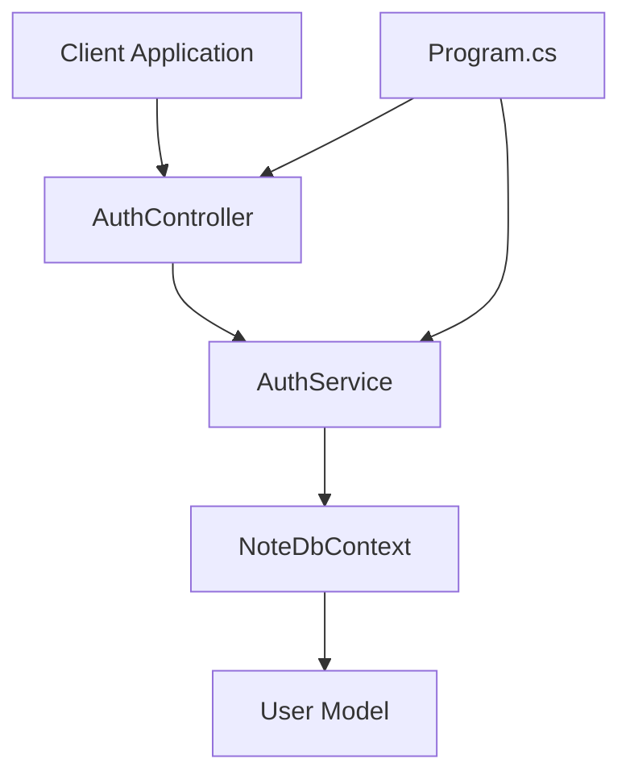
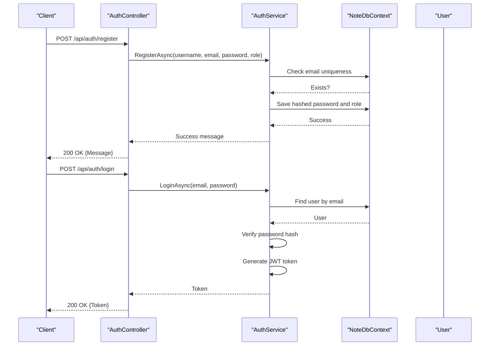
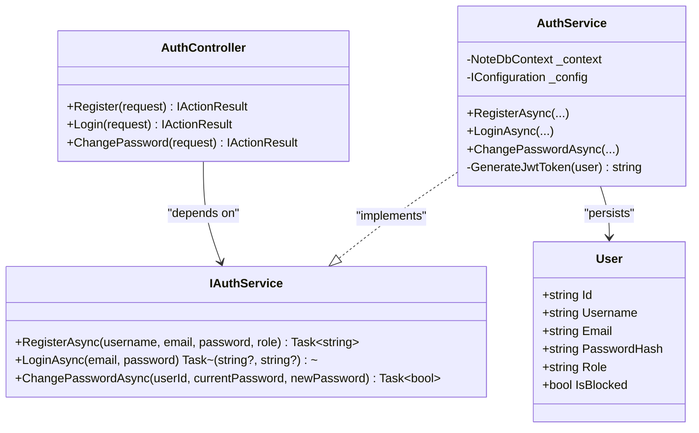
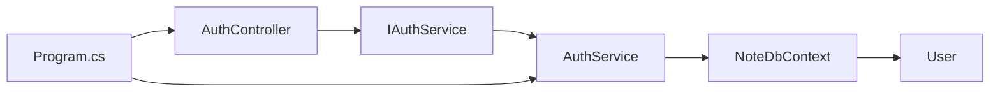

# Authentication API

<cite>
**Referenced Files in This Document**
- [AuthController.cs](file://Controllers/AuthController.cs)
- [AuthService.cs](file://Services/AuthService.cs)
- [IAuthService.cs](file://Services/IAuthService.cs)
- [User.cs](file://Models/User.cs)
- [Program.cs](file://Program.cs)
- [NoteDbContext.cs](file://Data/NoteDbContext.cs)
- [AdminController.cs](file://Controllers/AdminController.cs)
- [appsettings.json](file://appsettings.json)
</cite>

## Table of Contents
1. [Introduction](#introduction)
2. [Project Structure](#project-structure)
3. [Core Components](#core-components)
4. [Architecture Overview](#architecture-overview)
5. [Detailed Component Analysis](#detailed-component-analysis)
6. [Dependency Analysis](#dependency-analysis)
7. [Performance Considerations](#performance-considerations)
8. [Troubleshooting Guide](#troubleshooting-guide)
9. [Conclusion](#conclusion)
10. [Appendices](#appendices)

## Introduction
This document provides comprehensive API documentation for the authentication endpoints: registration, login, and password change. It covers HTTP methods, request/response schemas, JWT token generation, authentication header requirements, role-based access control, and security considerations. It also includes practical curl examples, error response formats, password validation rules, email verification status, session management, troubleshooting tips, and integration best practices.

## Project Structure
The authentication system is implemented using ASP.NET Core with a clean separation of concerns:
- Controllers handle HTTP requests and responses
- Services encapsulate business logic and persistence
- Models define data structures
- Program.cs configures authentication and middleware
- Data context manages database operations

**Diagram sources**
- [AuthController.cs:18-54](file://Controllers/AuthController.cs#L18-L54)
- [AuthService.cs:11-97](file://Services/AuthService.cs#L11-L97)
- [Program.cs:69-84](file://Program.cs#L69-L84)

**Section sources**
- [AuthController.cs:1-76](file://Controllers/AuthController.cs#L1-L76)
- [AuthService.cs:1-98](file://Services/AuthService.cs#L1-L98)
- [Program.cs:10-150](file://Program.cs#L10-L150)

## Core Components
- AuthController: Exposes endpoints for registration, login, and password change
- AuthService: Implements registration, login, JWT token generation, and password change logic
- IAuthService: Defines the service contract
- User model: Represents user entity with role and blocking status
- Program.cs: Configures JWT authentication and middleware pipeline

**Section sources**
- [AuthController.cs:18-54](file://Controllers/AuthController.cs#L18-L54)
- [AuthService.cs:22-96](file://Services/AuthService.cs#L22-L96)
- [IAuthService.cs:5-10](file://Services/IAuthService.cs#L5-L10)
- [User.cs:3-11](file://Models/User.cs#L3-L11)
- [Program.cs:69-84](file://Program.cs#L69-L84)

## Architecture Overview
The authentication flow integrates controller actions, service logic, and data persistence. JWT authentication is configured globally, enabling bearer tokens for protected endpoints.

**Diagram sources**
- [AuthController.cs:18-38](file://Controllers/AuthController.cs#L18-L38)
- [AuthService.cs:22-57](file://Services/AuthService.cs#L22-L57)
- [NoteDbContext.cs:14](file://Data/NoteDbContext.cs#L14)

## Detailed Component Analysis

### Authentication Endpoints

#### POST /api/auth/register
- Purpose: Registers a new user
- Request body: RegisterRequest
- Response: Success message or error

Request schema (RegisterRequest):
- username: string (required)
- email: string (required)
- password: string (required)
- role: string (optional; defaults to "User")

Response schema:
- Success: { Message: "Registration successful" }
- Error: { Message: "<error message>" }

curl example:
- curl -X POST http://localhost:5009/api/auth/register -H "Content-Type: application/json" -d '{"username":"john","email":"john@example.com","password":"SecurePass123!","role":"User"}'

Behavior:
- Validates email uniqueness
- Hashes password using bcrypt
- Assigns role if provided or defaults to "User"
- Returns error if email exists

**Section sources**
- [AuthController.cs:18-27](file://Controllers/AuthController.cs#L18-L27)
- [AuthService.cs:22-41](file://Services/AuthService.cs#L22-L41)
- [User.cs:9](file://Models/User.cs#L9)

#### POST /api/auth/login
- Purpose: Authenticates a user and returns a JWT token
- Request body: LoginRequest
- Response: JWT token or error

Request schema (LoginRequest):
- email: string (required)
- password: string (required)

Response schema:
- Success: { Token: "<jwt>" }
- Error: { Message: "<error message>" }

curl example:
- curl -X POST http://localhost:5009/api/auth/login -H "Content-Type: application/json" -d '{"email":"john@example.com","password":"SecurePass123!"}'

Behavior:
- Finds user by email
- Verifies password hash
- Checks if user is blocked
- Generates JWT token with claims for id, email, username, role

**Section sources**
- [AuthController.cs:29-38](file://Controllers/AuthController.cs#L29-L38)
- [AuthService.cs:43-57](file://Services/AuthService.cs#L43-L57)
- [AuthService.cs:59-81](file://Services/AuthService.cs#L59-L81)

#### POST /api/auth/change-password
- Purpose: Changes the authenticated user's password
- Request body: ChangePasswordRequest
- Response: Success message or error

Request schema (ChangePasswordRequest):
- currentPassword: string (required)
- newPassword: string (required)

Response schema:
- Success: { Message: "Password changed successfully" }
- Error: { Message: "Failed to change password. Current password may be incorrect." }

curl example:
- curl -X POST http://localhost:5009/api/auth/change-password -H "Content-Type: application/json" -H "Authorization: Bearer <jwt>" -d '{"currentPassword":"OldPass123!","newPassword":"NewPass456@"}'

Behavior:
- Requires Authorization header with a valid JWT
- Extracts user id from token claims
- Verifies current password hash
- Replaces with new hashed password

**Section sources**
- [AuthController.cs:40-54](file://Controllers/AuthController.cs#L40-L54)
- [AuthService.cs:83-96](file://Services/AuthService.cs#L83-L96)

### JWT Token Generation and Validation
- Token generation:
  - Claims include subject (user id), email, username, role, and a custom role claim
  - Expires in 7 days
  - Signed with HMAC SHA-256 using a symmetric key from configuration
- Token validation:
  - Enabled globally via JWT Bearer authentication
  - Validates issuer signing key
  - Does not validate issuer or audience by default

Configuration:
- Key: "Jwt:Key" in configuration
- Issuer and Audience: configurable via "Jwt:Issuer" and "Jwt:Audience"

**Section sources**
- [AuthService.cs:59-81](file://Services/AuthService.cs#L59-L81)
- [Program.cs:69-84](file://Program.cs#L69-L84)
- [appsettings.json:6-8](file://appsettings.json#L6-L8)

### Role-Based Access Control
- User roles:
  - "User" (default)
  - "Admin"
- Protected admin endpoints:
  - AdminController requires [Authorize(Roles = "Admin")]
- Example admin endpoint:
  - GET /api/admin/stats
  - Requires Authorization header with a valid JWT

**Section sources**
- [User.cs:9](file://Models/User.cs#L9)
- [AdminController.cs:11](file://Controllers/AdminController.cs#L11)

### Password Validation Rules
- Passwords are hashed using bcrypt before storage
- No explicit server-side validation rules are enforced in the provided code
- Clients should enforce strong password policies (length, character variety) prior to sending requests

**Section sources**
- [AuthService.cs:33](file://Services/AuthService.cs#L33)
- [AuthService.cs:88-93](file://Services/AuthService.cs#L88-L93)

### Email Verification Requirements
- No email verification logic is implemented in the provided code
- Registration does not require verified email
- Consider adding email verification workflow for production environments

**Section sources**
- [AuthService.cs:24-27](file://Services/AuthService.cs#L24-L27)

### Session Management
- Stateless JWT-based sessions
- No server-side session storage
- Token expiration: 7 days
- Clients must store and send the JWT in the Authorization header for protected routes

**Section sources**
- [AuthService.cs:77](file://Services/AuthService.cs#L77)
- [Program.cs:145-146](file://Program.cs#L145-L146)

### Request/Response Schemas

#### RegisterRequest
- username: string (required)
- email: string (required)
- password: string (required)
- role: string (optional)

#### LoginRequest
- email: string (required)
- password: string (required)

#### ChangePasswordRequest
- currentPassword: string (required)
- newPassword: string (required)

**Section sources**
- [AuthController.cs:63-75](file://Controllers/AuthController.cs#L63-L75)

## Architecture Overview

**Diagram sources**
- [AuthController.cs:9-54](file://Controllers/AuthController.cs#L9-L54)
- [IAuthService.cs:5-10](file://Services/IAuthService.cs#L5-L10)
- [AuthService.cs:11-97](file://Services/AuthService.cs#L11-L97)
- [User.cs:3-11](file://Models/User.cs#L3-L11)

## Detailed Component Analysis

### AuthController
- Exposes three endpoints under api/auth
- Delegates to IAuthService for business logic
- Returns standardized JSON responses

**Section sources**
- [AuthController.cs:18-54](file://Controllers/AuthController.cs#L18-L54)

### AuthService
- Handles registration, login, and password change
- Uses bcrypt for password hashing
- Generates JWT tokens with claims
- Validates credentials and checks user blocking status

**Section sources**
- [AuthService.cs:22-96](file://Services/AuthService.cs#L22-L96)

### Program.cs Authentication Setup
- Adds JWT Bearer authentication
- Configures token validation parameters
- Enables CORS for development

**Section sources**
- [Program.cs:69-84](file://Program.cs#L69-L84)

### User Model
- Contains identity, credentials, role, and blocking status
- Seeded with an admin user in the database context

**Section sources**
- [User.cs:3-11](file://Models/User.cs#L3-L11)
- [NoteDbContext.cs:27-37](file://Data/NoteDbContext.cs#L27-L37)

## Dependency Analysis

**Diagram sources**
- [AuthController.cs:11](file://Controllers/AuthController.cs#L11)
- [AuthService.cs:13-19](file://Services/AuthService.cs#L13-L19)
- [Program.cs:62](file://Program.cs#L62)

**Section sources**
- [AuthController.cs:11](file://Controllers/AuthController.cs#L11)
- [AuthService.cs:13-19](file://Services/AuthService.cs#L13-L19)
- [Program.cs:62](file://Program.cs#L62)

## Performance Considerations
- Password hashing is computationally intensive; consider batching operations if scaling registration volume
- JWT token size is small; keep claims minimal to reduce payload
- Database queries use async patterns; ensure proper indexing on email for fast lookups
- Consider rate limiting for login attempts to mitigate brute force attacks

## Troubleshooting Guide
Common issues and resolutions:
- Invalid credentials during login:
  - Ensure correct email and password
  - Verify account is not blocked
- Registration errors:
  - Email already exists: use a different email
- Password change failures:
  - Current password incorrect: re-enter the correct current password
- Authentication failures:
  - Missing or invalid Authorization header: obtain a new token via login
  - Token expired: regenerate token after 7-day expiration

**Section sources**
- [AuthService.cs:46-54](file://Services/AuthService.cs#L46-L54)
- [AuthService.cs:88-90](file://Services/AuthService.cs#L88-L90)
- [AuthController.cs:44-45](file://Controllers/AuthController.cs#L44-L45)

## Conclusion
The authentication API provides secure, stateless user registration, login, and password change capabilities using JWT tokens. It follows modern security practices with bcrypt hashing and role-based access control. Production deployments should consider adding email verification, stricter password validation, and enhanced security configurations.

## Appendices

### Authentication Header Requirements
- For protected endpoints (e.g., change-password), include:
  - Authorization: Bearer <jwt>
- Obtain the token via login endpoint and store it securely

**Section sources**
- [Program.cs:145-146](file://Program.cs#L145-L146)

### Security Considerations
- Use HTTPS in production
- Rotate JWT keys periodically
- Limit token lifetime and implement refresh token strategy if needed
- Enforce strong password policies on the client side
- Add rate limiting and monitoring for suspicious activities

### Integration Best Practices
- Store JWT tokens securely (e.g., HttpOnly cookies or secure storage)
- Refresh tokens on demand rather than extending JWT expiry
- Implement graceful fallbacks for blocked accounts
- Log authentication events for auditing