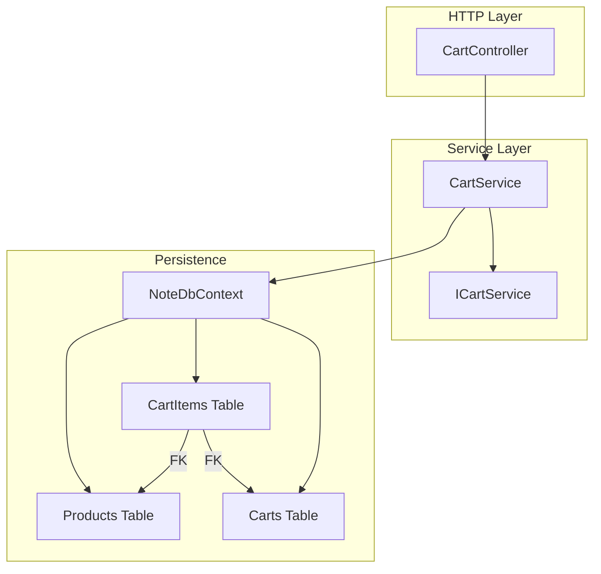
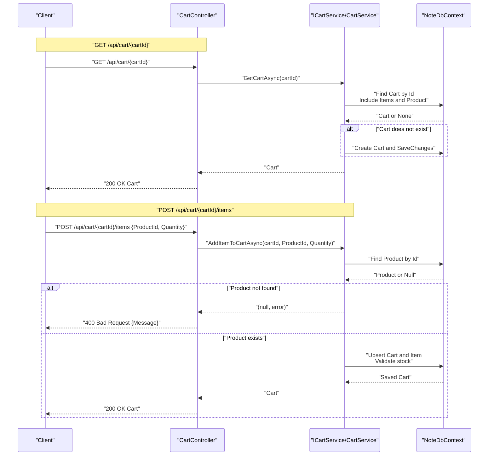
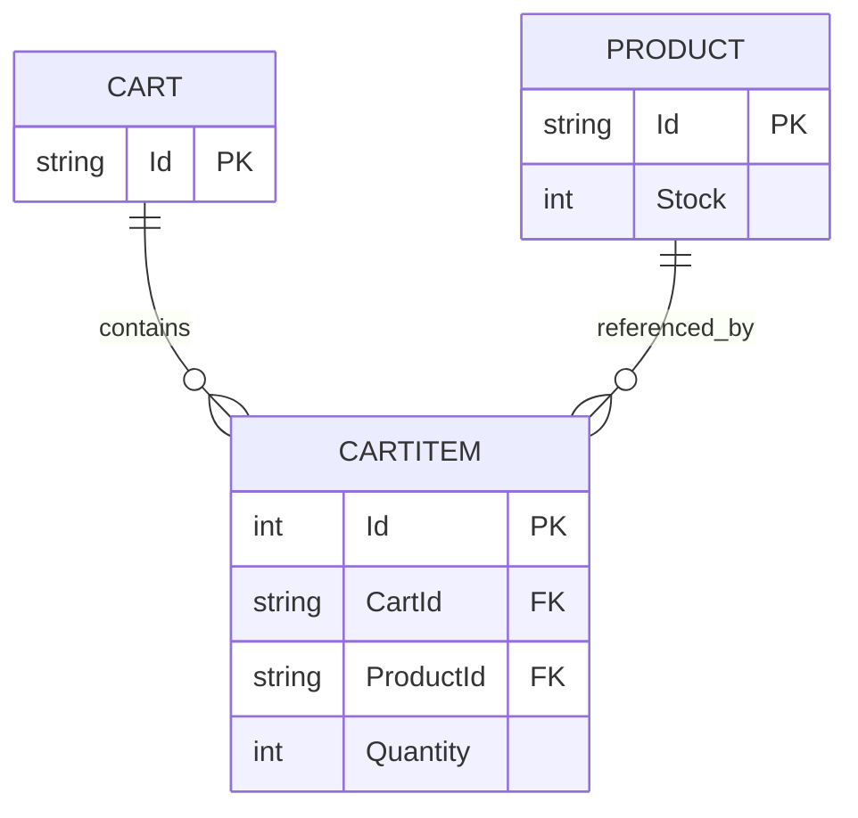
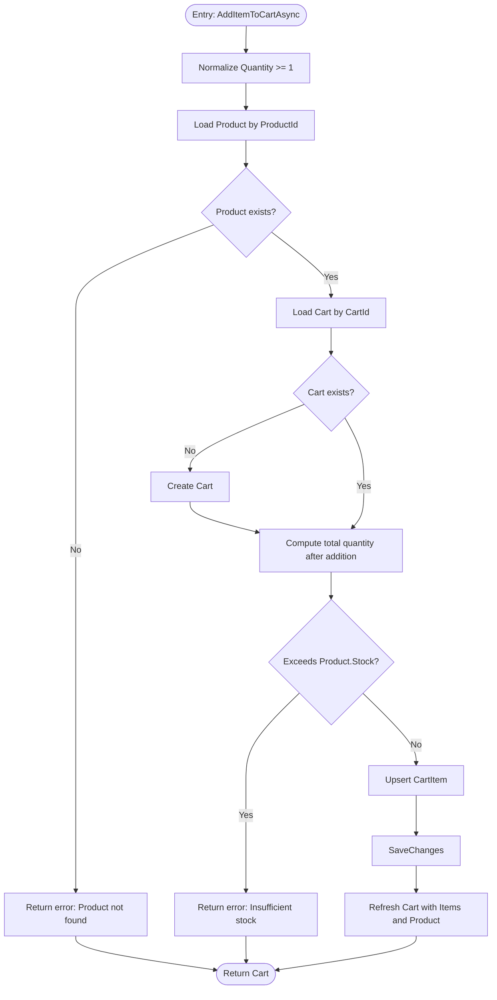
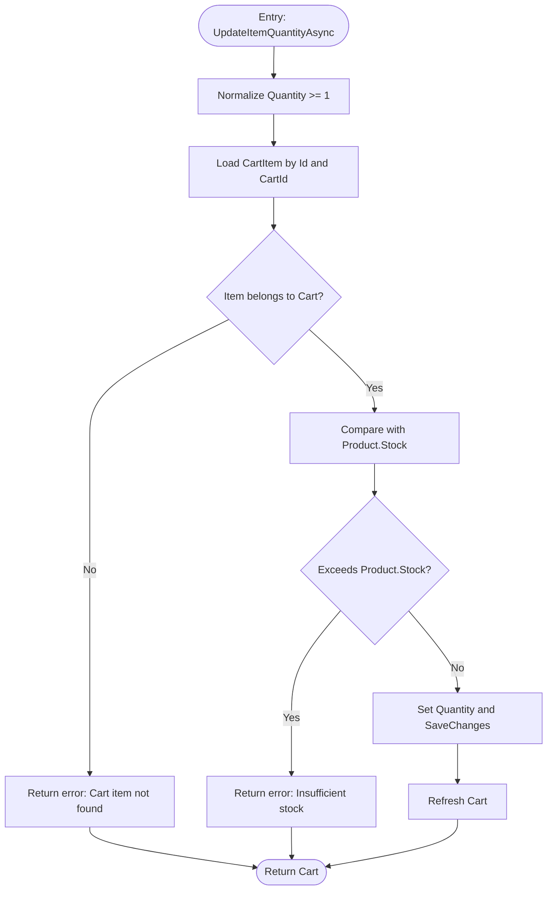
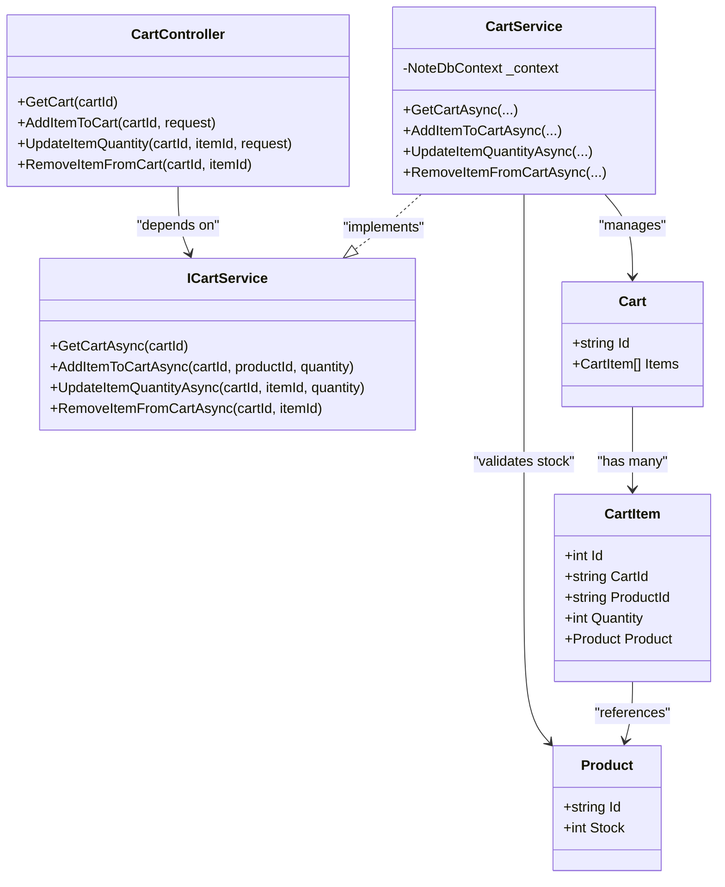

# Cart API

<cite>
**Referenced Files in This Document**
- [CartController.cs](file://Controllers/CartController.cs)
- [CartService.cs](file://Services/CartService.cs)
- [ICartService.cs](file://Services/ICartService.cs)
- [Cart.cs](file://Models/Cart.cs)
- [CartItem.cs](file://Models/CartItem.cs)
- [Product.cs](file://Models/Product.cs)
- [NoteDbContext.cs](file://Data/NoteDbContext.cs)
- [20260427184435_InitialCreate.cs](file://Migrations/20260427184435_InitialCreate.cs)
- [Program.cs](file://Program.cs)
</cite>

## Table of Contents
1. [Introduction](#introduction)
2. [Project Structure](#project-structure)
3. [Core Components](#core-components)
4. [Architecture Overview](#architecture-overview)
5. [Detailed Component Analysis](#detailed-component-analysis)
6. [Dependency Analysis](#dependency-analysis)
7. [Performance Considerations](#performance-considerations)
8. [Troubleshooting Guide](#troubleshooting-guide)
9. [Conclusion](#conclusion)
10. [Appendices](#appendices)

## Introduction
This document describes the shopping cart management API, including endpoints for retrieving a cart, adding items, updating quantities, and removing items. It also documents request schemas, cart persistence, session handling, user association, bulk operation patterns, cart validation, inventory checks, error responses, and integration patterns for cross-device cart synchronization.

## Project Structure
The cart feature spans a small set of cohesive components:
- Controller exposes HTTP endpoints for cart operations
- Service encapsulates business logic and persistence
- Models define cart, cart item, and product entities
- Entity Framework context and migrations manage persistence
- Program configures DI, authentication, and CORS

**Diagram sources**
- [CartController.cs:18-46](file://Controllers/CartController.cs#L18-L46)
- [CartService.cs:16-104](file://Services/CartService.cs#L16-L104)
- [ICartService.cs:5-11](file://Services/ICartService.cs#L5-L11)
- [NoteDbContext.cs:11-21](file://Data/NoteDbContext.cs#L11-L21)
- [20260427184435_InitialCreate.cs:36-125](file://Migrations/20260427184435_InitialCreate.cs#L36-L125)

**Section sources**
- [CartController.cs:18-46](file://Controllers/CartController.cs#L18-L46)
- [CartService.cs:16-104](file://Services/CartService.cs#L16-L104)
- [ICartService.cs:5-11](file://Services/ICartService.cs#L5-L11)
- [NoteDbContext.cs:11-21](file://Data/NoteDbContext.cs#L11-L21)
- [20260427184435_InitialCreate.cs:36-125](file://Migrations/20260427184435_InitialCreate.cs#L36-L125)

## Core Components
- CartController: Exposes GET /api/cart/{cartId}, POST /api/cart/{cartId}/items, PUT /api/cart/{cartId}/items/{itemId}, and DELETE /api/cart/{cartId}/items/{itemId}.
- CartService: Implements cart retrieval, item addition, quantity updates, and removal with validation against product stock.
- Models: Cart, CartItem, Product define the domain and persistence shape.
- Persistence: EF Core context and migrations define tables and foreign keys.

**Section sources**
- [CartController.cs:18-46](file://Controllers/CartController.cs#L18-L46)
- [CartService.cs:16-104](file://Services/CartService.cs#L16-L104)
- [Cart.cs:5-9](file://Models/Cart.cs#L5-L9)
- [CartItem.cs:3-11](file://Models/CartItem.cs#L3-L11)
- [Product.cs:3-20](file://Models/Product.cs#L3-L20)

## Architecture Overview
The cart API follows a clean architecture pattern:
- HTTP requests reach CartController
- Controller delegates to ICartService
- Service uses NoteDbContext to query and mutate Carts, CartItems, and Products
- Responses are serialized JSON

**Diagram sources**
- [CartController.cs:18-31](file://Controllers/CartController.cs#L18-L31)
- [CartService.cs:16-73](file://Services/CartService.cs#L16-L73)
- [NoteDbContext.cs:11-21](file://Data/NoteDbContext.cs#L11-L21)

## Detailed Component Analysis

### API Endpoints

- GET /api/cart/{cartId}
  - Purpose: Retrieve a cart by ID, creating it if it does not exist.
  - Response: 200 OK with Cart; includes Items populated with Product details.
  - Validation: Returns empty Items if cart is newly created.

- POST /api/cart/{cartId}/items
  - Purpose: Add or increase quantity of a product in the cart.
  - Request body: AddCartItemRequest { ProductId, Quantity }
  - Validation:
    - ProductId must reference an existing Product
    - Product must have stock > 0
    - New quantity must not exceed Product.Stock
  - Response: 200 OK with updated Cart; 400 Bad Request with error message on failure.

- PUT /api/cart/{cartId}/items/{itemId}
  - Purpose: Update the quantity of an existing cart item.
  - Request body: UpdateCartItemRequest { Quantity }
  - Validation:
    - Cart item must belong to the given cart (CartId match)
    - Quantity must not exceed Product.Stock
  - Response: 200 OK with updated Cart; 400 Bad Request with error message on failure.

- DELETE /api/cart/{cartId}/items/{itemId}
  - Purpose: Remove a cart item by ID.
  - Response: 200 OK with updated Cart.

**Section sources**
- [CartController.cs:18-46](file://Controllers/CartController.cs#L18-L46)
- [CartService.cs:16-104](file://Services/CartService.cs#L16-L104)

### Request Schemas

- AddCartItemRequest
  - ProductId: string (required)
  - Quantity: integer (required, validated >= 1)

- UpdateCartItemRequest
  - Quantity: integer (required, validated >= 1)

Notes:
- The service normalizes zero/negative quantities to minimum 1 before processing.
- ProductId must be a valid existing Product identifier.

**Section sources**
- [CartController.cs:49-58](file://Controllers/CartController.cs#L49-L58)
- [CartService.cs:35-35](file://Services/CartService.cs#L35-L35)
- [CartService.cs:77-77](file://Services/CartService.cs#L77-L77)

### Data Models

- Cart.Id is the cart identifier used in URLs.
- Cart.Items is a collection of CartItem entries.
- CartItem links a Cart to a Product and holds Quantity.
- Product.Stock constrains allowed quantities.

**Diagram sources**
- [Cart.cs:5-9](file://Models/Cart.cs#L5-L9)
- [CartItem.cs:3-11](file://Models/CartItem.cs#L3-L11)
- [Product.cs:3-20](file://Models/Product.cs#L3-L20)
- [20260427184435_InitialCreate.cs:101-125](file://Migrations/20260427184435_InitialCreate.cs#L101-L125)

**Section sources**
- [Cart.cs:5-9](file://Models/Cart.cs#L5-L9)
- [CartItem.cs:3-11](file://Models/CartItem.cs#L3-L11)
- [Product.cs:3-20](file://Models/Product.cs#L3-L20)
- [20260427184435_InitialCreate.cs:101-125](file://Migrations/20260427184435_InitialCreate.cs#L101-L125)

### Processing Logic

#### Add Item to Cart

**Diagram sources**
- [CartService.cs:33-73](file://Services/CartService.cs#L33-L73)

#### Update Item Quantity

**Diagram sources**
- [CartService.cs:75-92](file://Services/CartService.cs#L75-L92)

### Error Responses
Common HTTP statuses and messages:
- 400 Bad Request
  - "Product not found."
  - "This product is out of stock."
  - "Only N item(s) available."
  - "Cart item not found."

These errors originate from validation in the service layer and are returned as JSON with a Message field.

**Section sources**
- [CartService.cs:38-39](file://Services/CartService.cs#L38-L39)
- [CartService.cs:55](file://Services/CartService.cs#L55)
- [CartService.cs:82](file://Services/CartService.cs#L82)
- [CartService.cs:85](file://Services/CartService.cs#L85)

### Cart Persistence and Session Handling
- Persistence: Carts and CartItems are stored in relational tables with foreign keys linking to Products. Cart creation is implicit on first access.
- Session handling: The cart is identified by a client-provided cartId string. There is no server-side session cookie; carts are identified by this token and persisted per user’s choice.
- User association: No direct user-to-cart linkage is present in the current schema; user identity is handled via JWT elsewhere in the application.

**Section sources**
- [20260427184435_InitialCreate.cs:36-44](file://Migrations/20260427184435_InitialCreate.cs#L36-L44)
- [20260427184435_InitialCreate.cs:101-125](file://Migrations/20260427184435_InitialCreate.cs#L101-L125)
- [CartService.cs:16-31](file://Services/CartService.cs#L16-L31)
- [Program.cs:62-84](file://Program.cs#L62-L84)

### Integration Patterns for Cross-Device Synchronization
- Use a stable cartId per user/device or per session. The cartId is a string token; choose a value that persists across devices (e.g., a UUID stored in local storage or a device-specific token).
- On login or device pairing, resolve the cartId to the authenticated user’s preferred cart and merge if needed.
- For real-time synchronization, consider:
  - Polling GET /api/cart/{cartId} periodically
  - Server-sent events or WebSocket to receive updates
  - Client-side reconciliation: apply optimistic updates locally and reconcile on conflict

[No sources needed since this section provides general guidance]

### Bulk Operations and Validation Examples
- Bulk add: Issue multiple POST /api/cart/{cartId}/items requests with different ProductIds and quantities. Each request validates against Product.Stock independently.
- Validation steps:
  - Ensure ProductId exists and Product.Stock > 0
  - Compute total requested quantity vs. Product.Stock
  - Reject if insufficient stock
- Inventory checking: The service reads Product.Stock and compares against the desired quantity before saving.

**Section sources**
- [CartService.cs:37-39](file://Services/CartService.cs#L37-L39)
- [CartService.cs:53-56](file://Services/CartService.cs#L53-L56)
- [CartService.cs:83-86](file://Services/CartService.cs#L83-L86)

## Dependency Analysis

**Diagram sources**
- [CartController.cs:9-47](file://Controllers/CartController.cs#L9-L47)
- [ICartService.cs:5-11](file://Services/ICartService.cs#L5-L11)
- [CartService.cs:7-104](file://Services/CartService.cs#L7-L104)
- [Cart.cs:5-9](file://Models/Cart.cs#L5-L9)
- [CartItem.cs:3-11](file://Models/CartItem.cs#L3-L11)
- [Product.cs:3-20](file://Models/Product.cs#L3-L20)

**Section sources**
- [CartController.cs:9-47](file://Controllers/CartController.cs#L9-L47)
- [ICartService.cs:5-11](file://Services/ICartService.cs#L5-L11)
- [CartService.cs:7-104](file://Services/CartService.cs#L7-L104)

## Performance Considerations
- Eager loading: The service includes Items and Product when loading a cart to avoid N+1 queries.
- Single transaction: Add/update/remove operations are saved in a single SaveChanges call.
- Indexes: CartItems table has indexes on CartId and ProductId to speed up lookups.
- Recommendations:
  - Cache frequently accessed carts per cartId for high traffic
  - Paginate or limit cart size to control memory usage
  - Consider soft-deleting items and purging old carts periodically

**Section sources**
- [CartService.cs:18-21](file://Services/CartService.cs#L18-L21)
- [20260427184435_InitialCreate.cs:277-284](file://Migrations/20260427184435_InitialCreate.cs#L277-L284)

## Troubleshooting Guide
- Symptom: 400 Bad Request with "Product not found."
  - Cause: ProductId does not correspond to an existing Product.
  - Action: Verify Product exists and ProductId is correct.

- Symptom: 400 Bad Request with "This product is out of stock."
  - Cause: Product.Stock is zero or negative.
  - Action: Offer alternatives or notify user.

- Symptom: 400 Bad Request with "Only N item(s) available."
  - Cause: Requested quantity exceeds Product.Stock.
  - Action: Reduce quantity or inform user of remaining stock.

- Symptom: 400 Bad Request with "Cart item not found."
  - Cause: CartItem.Id does not belong to CartId.
  - Action: Ensure correct itemId and cartId pairing.

- Symptom: Empty cart after refresh
  - Cause: Cart was newly created; no prior items.
  - Action: Add items first, or confirm cartId continuity.

**Section sources**
- [CartService.cs:38-39](file://Services/CartService.cs#L38-L39)
- [CartService.cs:39](file://Services/CartService.cs#L39)
- [CartService.cs:55](file://Services/CartService.cs#L55)
- [CartService.cs:82](file://Services/CartService.cs#L82)
- [CartService.cs:85](file://Services/CartService.cs#L85)

## Conclusion
The cart API provides a compact, robust set of endpoints for managing shopping carts with strong validation against product inventory. Persistence is straightforward with explicit cart identifiers, enabling flexible session and user association strategies. The service layer centralizes validation and persistence, while the controller exposes simple, predictable endpoints.

## Appendices

### Endpoint Reference

- GET /api/cart/{cartId}
  - Description: Retrieve a cart by cartId, creating it if absent.
  - Success: 200 OK with Cart
  - Notes: Items include Product details.

- POST /api/cart/{cartId}/items
  - Description: Add or increase quantity of a product in the cart.
  - Request body: AddCartItemRequest { ProductId, Quantity }
  - Success: 200 OK with Cart
  - Errors: 400 Bad Request with Message

- PUT /api/cart/{cartId}/items/{itemId}
  - Description: Update quantity of an existing cart item.
  - Request body: UpdateCartItemRequest { Quantity }
  - Success: 200 OK with Cart
  - Errors: 400 Bad Request with Message

- DELETE /api/cart/{cartId}/items/{itemId}
  - Description: Remove a cart item by ID.
  - Success: 200 OK with Cart

**Section sources**
- [CartController.cs:18-46](file://Controllers/CartController.cs#L18-L46)