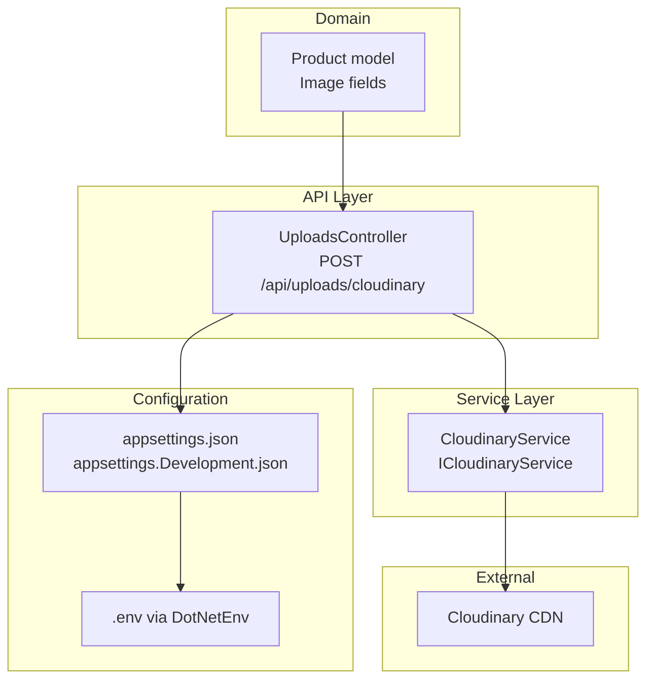
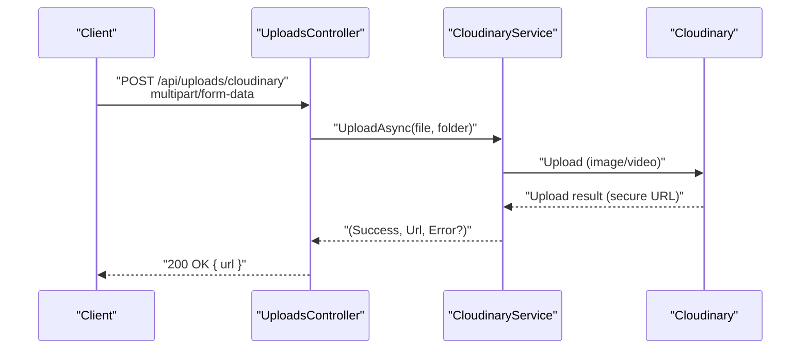
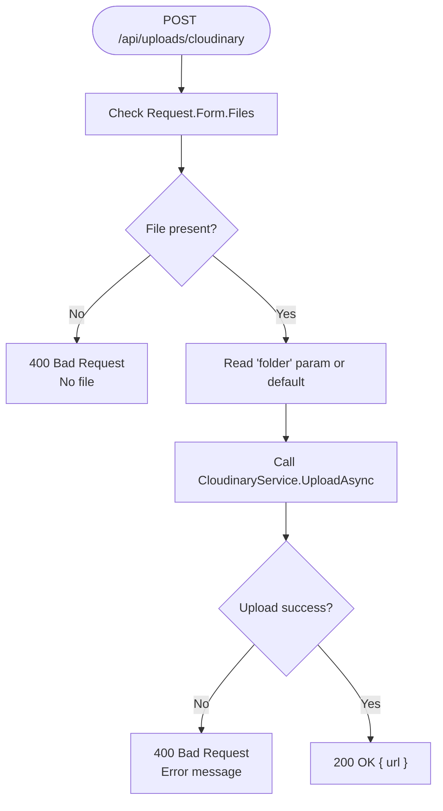
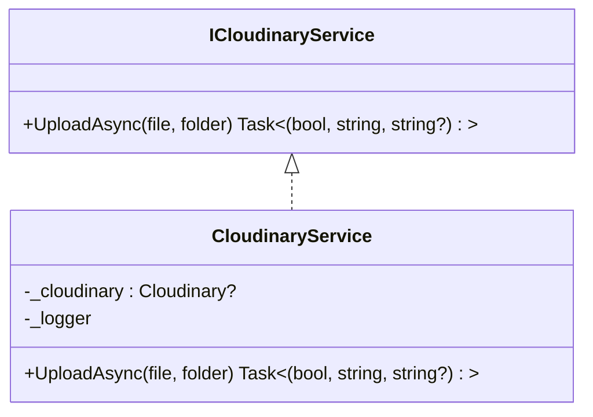

# Media Upload API

<cite>
**Referenced Files in This Document**
- [UploadsController.cs](file://Controllers/UploadsController.cs)
- [CloudinaryService.cs](file://Services/CloudinaryService.cs)
- [ICloudinaryService.cs](file://Services/ICloudinaryService.cs)
- [CloudinaryOptions.cs](file://Models/CloudinaryOptions.cs)
- [Program.cs](file://Program.cs)
- [appsettings.json](file://appsettings.json)
- [appsettings.Development.json](file://appsettings.Development.json)
- [Product.cs](file://Models/Product.cs)
- [ProductsController.cs](file://Controllers/ProductsController.cs)
- [ProductService.cs](file://Services/ProductService.cs)
- [Note.Backend.csproj](file://Note.Backend.csproj)
</cite>

## Table of Contents
1. [Introduction](#introduction)
2. [Project Structure](#project-structure)
3. [Core Components](#core-components)
4. [Architecture Overview](#architecture-overview)
5. [Detailed Component Analysis](#detailed-component-analysis)
6. [Dependency Analysis](#dependency-analysis)
7. [Performance Considerations](#performance-considerations)
8. [Troubleshooting Guide](#troubleshooting-guide)
9. [Conclusion](#conclusion)
10. [Appendices](#appendices)

## Introduction
This document describes the media upload API that integrates with Cloudinary for uploading images and videos. It covers endpoint behavior, request requirements, supported file types, size limits, configuration options, CDN delivery, and practical examples for product image uploads and gallery management. It also documents error handling and best practices for media optimization and responsive delivery.

## Project Structure
The upload functionality is implemented as a dedicated controller action that delegates to a Cloudinary service. Configuration is loaded from environment variables and appsettings files. Product models support storing media URLs returned by Cloudinary.

**Diagram sources**
- [UploadsController.cs:23-78](file://Controllers/UploadsController.cs#L23-L78)
- [CloudinaryService.cs:7-38](file://Services/CloudinaryService.cs#L7-L38)
- [Program.cs:12-13](file://Program.cs#L12-L13)
- [appsettings.json:9-13](file://appsettings.json#L9-L13)
- [appsettings.Development.json:2-6](file://appsettings.Development.json#L2-L6)
- [Product.cs:8-13](file://Models/Product.cs#L8-L13)

**Section sources**
- [UploadsController.cs:1-80](file://Controllers/UploadsController.cs#L1-L80)
- [CloudinaryService.cs:1-103](file://Services/CloudinaryService.cs#L1-L103)
- [Program.cs:12-13](file://Program.cs#L12-L13)
- [appsettings.json:9-13](file://appsettings.json#L9-L13)
- [appsettings.Development.json:2-6](file://appsettings.Development.json#L2-L6)
- [Product.cs:1-21](file://Models/Product.cs#L1-L21)

## Core Components
- Endpoint: POST /api/uploads/cloudinary
  - Consumes multipart/form-data
  - Request size limit: 100 MB
  - Authorization: Admin role required
  - Accepts a single file and optional folder parameter
- Cloudinary integration:
  - Reads credentials from environment variables
  - Supports both images and videos
  - Returns secure HTTPS URLs from Cloudinary CDN
- Product integration:
  - Product model includes multiple image fields and a video URL field
  - Admin endpoints allow updating product media URLs

**Section sources**
- [UploadsController.cs:23-78](file://Controllers/UploadsController.cs#L23-L78)
- [CloudinaryService.cs:40-102](file://Services/CloudinaryService.cs#L40-L102)
- [Product.cs:8-13](file://Models/Product.cs#L8-L13)

## Architecture Overview
The upload flow routes requests through the controller to the Cloudinary service, which performs the upload to Cloudinary and returns a secure URL. The controller responds with the URL for use by clients or product management.

**Diagram sources**
- [UploadsController.cs:26-77](file://Controllers/UploadsController.cs#L26-L77)
- [CloudinaryService.cs:40-95](file://Services/CloudinaryService.cs#L40-L95)

## Detailed Component Analysis

### UploadsController
- Role: Exposes POST /api/uploads/cloudinary
- Request handling:
  - Validates presence of a file in the request
  - Reads optional folder parameter (defaults to note/products)
  - Enforces 100 MB request size limit
- Configuration:
  - Reads Cloudinary settings from configuration or environment variables
- Response:
  - On success: returns JSON with the uploaded URL
  - On failure: returns appropriate error messages and debug info

**Diagram sources**
- [UploadsController.cs:44-77](file://Controllers/UploadsController.cs#L44-L77)

**Section sources**
- [UploadsController.cs:23-78](file://Controllers/UploadsController.cs#L23-L78)

### CloudinaryService
- Role: Performs actual upload to Cloudinary
- Initialization:
  - Reads CLOUDINARY_CLOUD_NAME, CLOUDINARY_API_KEY, CLOUDINARY_API_SECRET from environment
  - Creates Cloudinary client if all credentials are present
- Upload logic:
  - Determines whether the file is a video by MIME type
  - Uses appropriate upload parameters for images vs videos
  - Returns secure URL on success or error message on failure

**Diagram sources**
- [ICloudinaryService.cs:3-6](file://Services/ICloudinaryService.cs#L3-L6)
- [CloudinaryService.cs:7-38](file://Services/CloudinaryService.cs#L7-L38)

**Section sources**
- [CloudinaryService.cs:12-38](file://Services/CloudinaryService.cs#L12-L38)
- [CloudinaryService.cs:40-102](file://Services/CloudinaryService.cs#L40-L102)

### Configuration and Environment
- Settings:
  - appsettings.json defines Cloudinary section with placeholders
  - appsettings.Development.json provides example values
- Environment variables:
  - Program.cs loads environment variables via DotNetEnv
  - CloudinaryService reads CLOUDINARY_* variables directly
- Registration:
  - CloudinaryService registered as scoped service

**Section sources**
- [appsettings.json:9-13](file://appsettings.json#L9-L13)
- [appsettings.Development.json:2-6](file://appsettings.Development.json#L2-L6)
- [Program.cs:12-13](file://Program.cs#L12-L13)
- [Program.cs:66-67](file://Program.cs#L66-L67)
- [CloudinaryService.cs:17-19](file://Services/CloudinaryService.cs#L17-L19)

### Product Integration
- Product model supports multiple image fields and a video URL field
- Admin endpoints allow creating and updating products
- After uploading media via the API, update product entities with returned URLs

**Diagram sources**
- [Product.cs:3-20](file://Models/Product.cs#L3-L20)

**Section sources**
- [Product.cs:8-13](file://Models/Product.cs#L8-L13)
- [ProductsController.cs:34-58](file://Controllers/ProductsController.cs#L34-L58)
- [ProductService.cs:52-78](file://Services/ProductService.cs#L52-L78)

## Dependency Analysis
- External dependencies:
  - CloudinaryDotNet for Cloudinary integration
  - DotNetEnv for loading environment variables
- Internal dependencies:
  - UploadsController depends on ICloudinaryService
  - Program.cs registers ICloudinaryService with CloudinaryService implementation

**Diagram sources**
- [Program.cs:66-67](file://Program.cs#L66-L67)
- [UploadsController.cs:16-21](file://Controllers/UploadsController.cs#L16-L21)
- [ICloudinaryService.cs:3-6](file://Services/ICloudinaryService.cs#L3-L6)
- [CloudinaryService.cs:7-38](file://Services/CloudinaryService.cs#L7-L38)

**Section sources**
- [Note.Backend.csproj:11](file://Note.Backend.csproj#L11)
- [Program.cs:66-67](file://Program.cs#L66-L67)
- [UploadsController.cs:16-21](file://Controllers/UploadsController.cs#L16-L21)

## Performance Considerations
- Request size limit: 100 MB prevents excessive memory usage during upload
- Streaming: Uploads use streams to avoid loading entire files into memory
- CDN delivery: Secure URLs from Cloudinary reduce origin bandwidth and improve global delivery
- Recommendations:
  - Compress images before upload to reduce payload size
  - Prefer modern formats (WebP or AVIF) when supported by clients
  - Use Cloudinary transformations for on-the-fly resizing and quality tuning
  - Implement client-side fallbacks for unsupported formats

[No sources needed since this section provides general guidance]

## Troubleshooting Guide
Common errors and resolutions:
- Missing Cloudinary configuration:
  - Symptom: 400 response with configuration-related message
  - Cause: Missing environment variables or appsettings values
  - Resolution: Set CLOUDINARY_CLOUD_NAME, CLOUDINARY_API_KEY, CLOUDINARY_API_SECRET
- Empty file:
  - Symptom: 400 response indicating empty file
  - Cause: No content in the uploaded file
  - Resolution: Verify client sends a valid file
- Upload failure:
  - Symptom: 400 response with error message
  - Cause: Cloudinary error (network, quota, invalid content)
  - Resolution: Inspect logs and retry; check Cloudinary dashboard for quotas
- Unsupported format:
  - Symptom: Upload rejected by Cloudinary
  - Cause: Non-image/video content or blocked extension
  - Resolution: Validate file type and extension server-side before upload

Operational checks:
- Confirm environment variables are loaded by the app
- Verify Cloudinary credentials in development settings
- Monitor controller logs for detailed error context

**Section sources**
- [UploadsController.cs:44-77](file://Controllers/UploadsController.cs#L44-L77)
- [CloudinaryService.cs:42-52](file://Services/CloudinaryService.cs#L42-L52)
- [CloudinaryService.cs:68-91](file://Services/CloudinaryService.cs#L68-L91)

## Conclusion
The media upload API provides a straightforward mechanism to upload images and videos to Cloudinary via a single endpoint. It enforces sensible limits, integrates with Cloudinary’s CDN for optimized delivery, and returns secure URLs suitable for product galleries and media-rich pages. Administrators can manage media by updating product records with the returned URLs.

[No sources needed since this section summarizes without analyzing specific files]

## Appendices

### API Definition
- Endpoint: POST /api/uploads/cloudinary
- Authentication: JWT Bearer (Admin role required)
- Content-Type: multipart/form-data
- Request body fields:
  - file (required): Single binary file (image or video)
  - folder (optional): Target Cloudinary folder; defaults to note/products
- Response:
  - 200 OK: { url: "https://...secure.cloudinary.url..." }
  - 400 Bad Request: { message: "...", debug?: "...", requiredVars?: [...] }

**Section sources**
- [UploadsController.cs:23-78](file://Controllers/UploadsController.cs#L23-L78)

### Supported File Types and Size Limits
- Supported types:
  - Images: Uploaded as image assets
  - Videos: Uploaded as video assets
- Size limit: 100 MB
- Notes:
  - Cloudinary may impose additional platform-specific limits or quotas

**Section sources**
- [UploadsController.cs:25](file://Controllers/UploadsController.cs#L25)
- [CloudinaryService.cs:54](file://Services/CloudinaryService.cs#L54)

### Configuration Options
- Configuration sources:
  - appsettings.json Cloudinary section (placeholders)
  - appsettings.Development.json (example values)
  - Environment variables:
    - CLOUDINARY_CLOUD_NAME
    - CLOUDINARY_API_KEY
    - CLOUDINARY_API_SECRET
- Loading:
  - Program.cs loads environment variables via DotNetEnv
  - CloudinaryService reads environment variables directly

**Section sources**
- [appsettings.json:9-13](file://appsettings.json#L9-L13)
- [appsettings.Development.json:2-6](file://appsettings.Development.json#L2-L6)
- [Program.cs:12-13](file://Program.cs#L12-L13)
- [CloudinaryService.cs:17-19](file://Services/CloudinaryService.cs#L17-L19)

### CDN Delivery
- The service returns secure HTTPS URLs from Cloudinary
- These URLs leverage Cloudinary’s global CDN for fast delivery

**Section sources**
- [CloudinaryService.cs:76](file://Services/CloudinaryService.cs#L76)
- [CloudinaryService.cs:94](file://Services/CloudinaryService.cs#L94)

### Examples

#### Product Image Upload
- Steps:
  - Upload media via POST /api/uploads/cloudinary
  - Receive URL in response
  - Update product record with the returned URL
- Related endpoints:
  - Create product: POST /api/products
  - Update product: PUT /api/products/{id}

**Section sources**
- [UploadsController.cs:23-78](file://Controllers/UploadsController.cs#L23-L78)
- [ProductsController.cs:34-49](file://Controllers/ProductsController.cs#L34-L49)

#### Gallery Management
- Strategy:
  - Upload multiple images to the same folder
  - Store multiple image URLs in product fields
  - Serve responsive variants via Cloudinary transformations

**Section sources**
- [Product.cs:8-13](file://Models/Product.cs#L8-L13)

#### Media Optimization
- Compression:
  - Compress images before upload to reduce payload and cost
- Responsive delivery:
  - Use Cloudinary transformations for resizing and quality tuning
- Fallbacks:
  - Provide alternative formats or static fallbacks for unsupported clients

[No sources needed since this section provides general guidance]