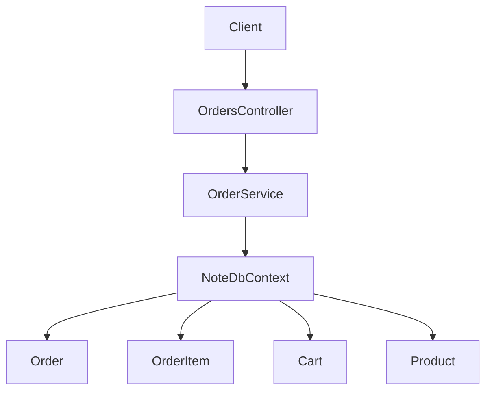
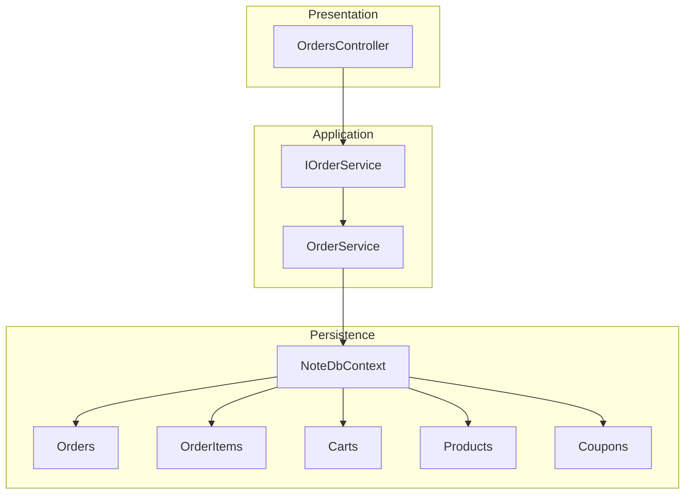
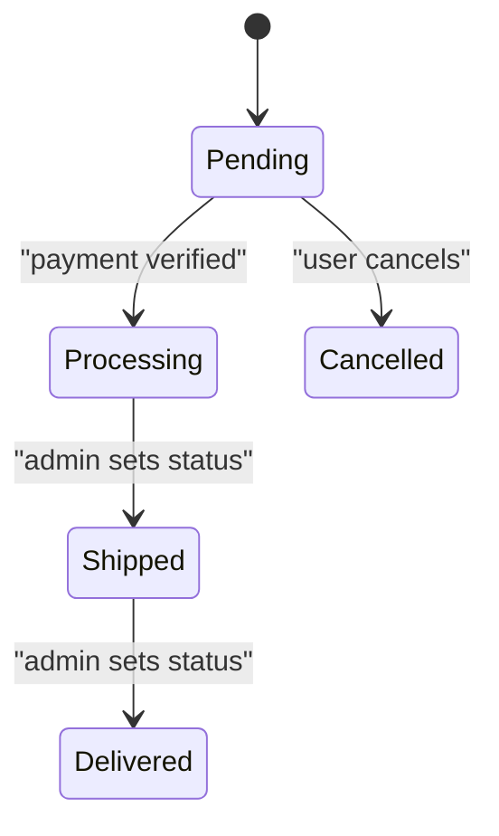
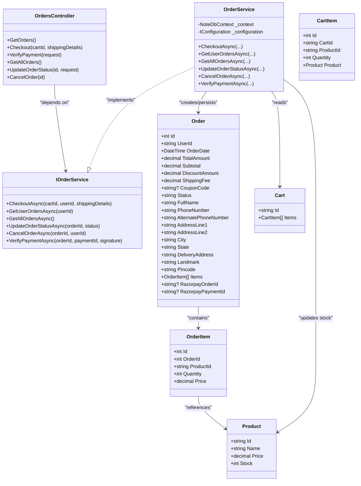
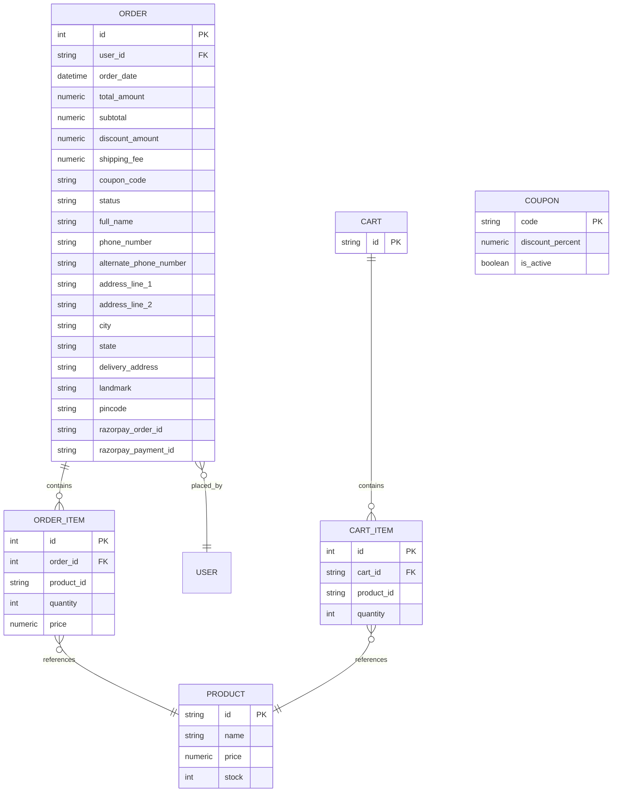
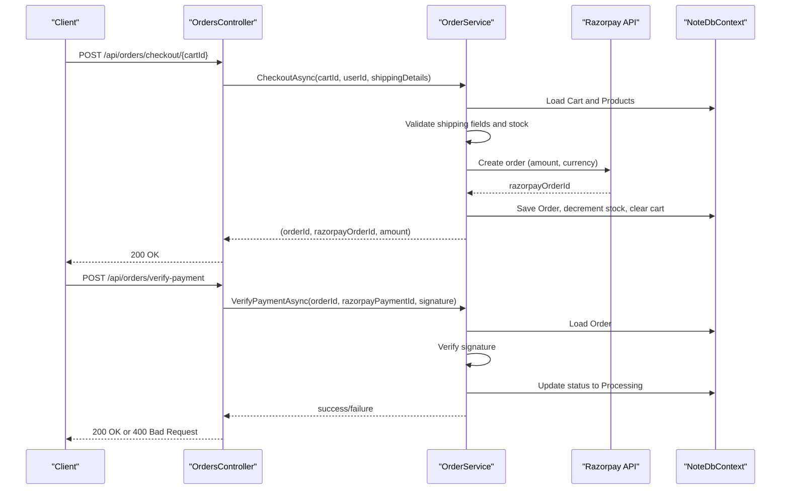
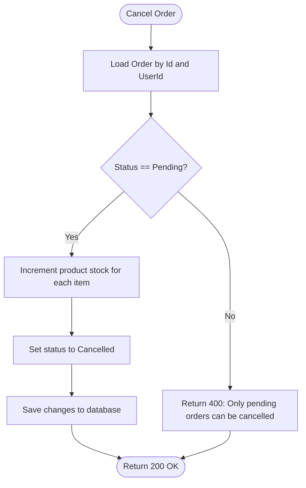
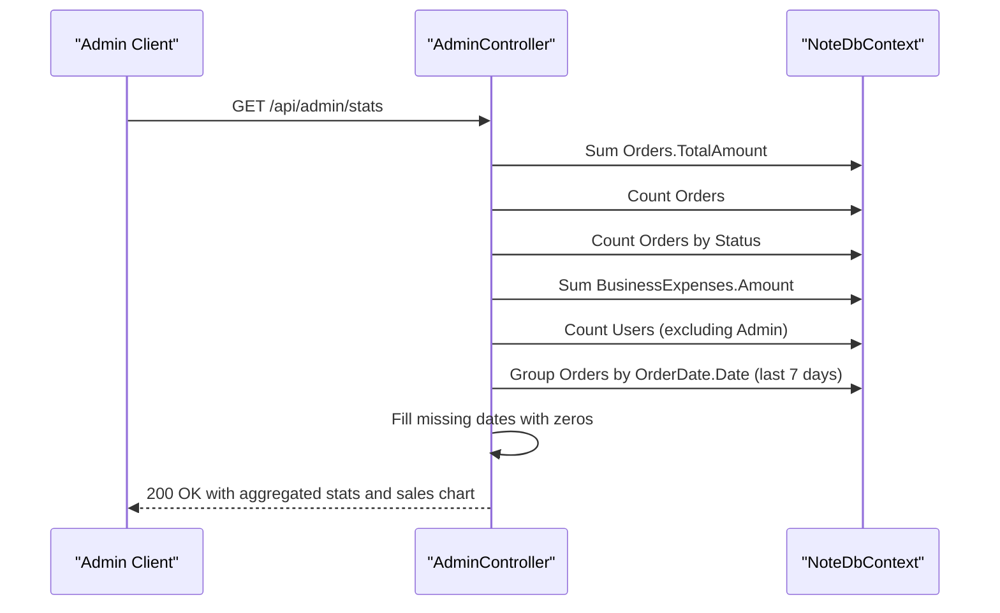

# Orders API

<cite>
**Referenced Files in This Document**
- [OrdersController.cs](file://Controllers/OrdersController.cs)
- [OrderService.cs](file://Services/OrderService.cs)
- [IOrderService.cs](file://Services/IOrderService.cs)
- [Order.cs](file://Models/Order.cs)
- [Cart.cs](file://Models/Cart.cs)
- [CartItem.cs](file://Models/CartItem.cs)
- [Product.cs](file://Models/Product.cs)
- [Coupon.cs](file://Models/Coupon.cs)
- [NoteDbContext.cs](file://Data/NoteDbContext.cs)
- [AdminController.cs](file://Controllers/AdminController.cs)
- [Program.cs](file://Program.cs)
- [appsettings.json](file://appsettings.json)
</cite>

## Table of Contents
1. [Introduction](#introduction)
2. [Project Structure](#project-structure)
3. [Core Components](#core-components)
4. [Architecture Overview](#architecture-overview)
5. [Detailed Component Analysis](#detailed-component-analysis)
6. [Dependency Analysis](#dependency-analysis)
7. [Performance Considerations](#performance-considerations)
8. [Troubleshooting Guide](#troubleshooting-guide)
9. [Conclusion](#conclusion)
10. [Appendices](#appendices)

## Introduction
This document describes the Orders API, covering order creation, status tracking, order history retrieval, and administrative order management. It documents endpoint specifications, request/response schemas, shipping address handling, payment integration with Razorpay, order states and fulfillment workflows, cancellation procedures, error handling, and analytics/reporting capabilities.

## Project Structure
The Orders API is implemented as a controller action layer backed by a service abstraction and a data context. The controller enforces authentication and role-based authorization for administrative endpoints. The service orchestrates checkout, payment verification, order status updates, and cancellations. Data models define the persisted order structure and relationships.

**Diagram sources**
- [OrdersController.cs:12-106](file://Controllers/OrdersController.cs#L12-L106)
- [OrderService.cs:11-269](file://Services/OrderService.cs#L11-L269)
- [NoteDbContext.cs:7-21](file://Data/NoteDbContext.cs#L7-L21)

**Section sources**
- [OrdersController.cs:12-106](file://Controllers/OrdersController.cs#L12-L106)
- [OrderService.cs:11-269](file://Services/OrderService.cs#L11-L269)
- [NoteDbContext.cs:7-21](file://Data/NoteDbContext.cs#L7-L21)

## Core Components
- OrdersController: Exposes endpoints for order checkout, payment verification, retrieving user/admin orders, updating order status, and canceling orders.
- OrderService: Implements business logic for checkout, payment verification, order retrieval, status updates, and cancellations.
- Order model: Defines order entity, items, shipping details, totals, and Razorpay identifiers.
- Cart and Product models: Provide shopping cart composition and product stock for inventory checks during checkout.
- Coupon model: Supports coupon-based discounts during checkout.
- NoteDbContext: Provides EF Core data access for orders, carts, products, coupons, and related entities.

**Section sources**
- [OrdersController.cs:12-106](file://Controllers/OrdersController.cs#L12-L106)
- [OrderService.cs:11-269](file://Services/OrderService.cs#L11-L269)
- [Order.cs:3-61](file://Models/Order.cs#L3-L61)
- [Cart.cs:5-9](file://Models/Cart.cs#L5-L9)
- [CartItem.cs:3-11](file://Models/CartItem.cs#L3-L11)
- [Product.cs:3-20](file://Models/Product.cs#L3-L20)
- [Coupon.cs:3-8](file://Models/Coupon.cs#L3-L8)
- [NoteDbContext.cs:7-21](file://Data/NoteDbContext.cs#L7-L21)

## Architecture Overview
The Orders API follows a layered architecture:
- Presentation: ASP.NET Core controller actions decorated with authorization attributes.
- Application: Service layer encapsulates domain logic and external integrations.
- Persistence: Entity Framework Core with PostgreSQL via Npgsql.

**Diagram sources**
- [OrdersController.cs:12-106](file://Controllers/OrdersController.cs#L12-L106)
- [IOrderService.cs:5-13](file://Services/IOrderService.cs#L5-L13)
- [OrderService.cs:11-269](file://Services/OrderService.cs#L11-L269)
- [NoteDbContext.cs:7-21](file://Data/NoteDbContext.cs#L7-L21)

## Detailed Component Analysis

### Endpoints

#### POST /api/orders/checkout/{cartId}
Purpose: Place an order from a cart, compute totals, apply coupon, reserve inventory, and create a Razorpay order.

- Authentication: Required (JWT bearer).
- Path parameters:
  - cartId: string
- Request body: ShippingDetails
- Responses:
  - 200 OK: { message, orderId, razorpayOrderId, amount, currency }
  - 400 Bad Request: { message } for validation errors or empty cart
  - 401 Unauthorized: if not authenticated

Request schema (ShippingDetails):
- fullName: string (required)
- phoneNumber: string (required, length 10–15)
- alternatePhoneNumber: string
- addressLine1: string (required)
- addressLine2: string
- city: string (required)
- state: string (required)
- deliveryAddress: string (optional; defaults to combined address)
- landmark: string
- pincode: string (required)
- couponCode: string (optional)

Response schema:
- message: string
- orderId: string
- razorpayOrderId: string
- amount: number
- currency: string

Notes:
- Validates shipping fields and phone length.
- Checks product availability against stock.
- Applies coupon if valid and active.
- Computes shipping fee ($0 if subtotal after discount ≥ 50, else $5).
- Creates order with items and shipping details.
- Calls Razorpay to create an order and stores Razorpay order ID.
- Deducts stock and clears the cart upon successful order creation.

**Section sources**
- [OrdersController.cs:31-51](file://Controllers/OrdersController.cs#L31-L51)
- [OrderService.cs:23-187](file://Services/OrderService.cs#L23-L187)
- [Order.cs:48-61](file://Models/Order.cs#L48-L61)

#### POST /api/orders/verify-payment
Purpose: Verify a Razorpay payment signature and mark the order as Processing.

- Authentication: Required (JWT bearer).
- Request body: VerifyPaymentRequest
  - orderId: integer
  - razorpayPaymentId: string
  - razorpayOrderId: string
  - razorpaySignature: string
- Responses:
  - 200 OK: { message }
  - 400 Bad Request: { message } for missing fields or verification failure
  - 401 Unauthorized: if not authenticated

Behavior:
- Validates presence of required fields.
- Recomputes signature using the stored key secret and compares with provided signature.
- On success, sets order status to Processing and persists payment ID.

**Section sources**
- [OrdersController.cs:53-71](file://Controllers/OrdersController.cs#L53-L71)
- [OrderService.cs:240-268](file://Services/OrderService.cs#L240-L268)

#### GET /api/orders
Purpose: Retrieve the authenticated user’s order history.

- Authentication: Required (JWT bearer).
- Responses:
  - 200 OK: Array of Order objects (ordered by newest first)
  - 401 Unauthorized: if not authenticated

Behavior:
- Filters orders by current user ID.
- Includes order items and product references.

**Section sources**
- [OrdersController.cs:21-29](file://Controllers/OrdersController.cs#L21-L29)
- [OrderService.cs:189-197](file://Services/OrderService.cs#L189-L197)

#### GET /api/orders/all
Purpose: Retrieve all orders (admin-only).

- Authentication: Required (JWT bearer), Role: Admin.
- Responses:
  - 200 OK: Array of Order objects (ordered by newest first)
  - 401 Unauthorized: if not authenticated
  - 403 Forbidden: if not admin

Behavior:
- Returns all orders with items and product references.

**Section sources**
- [OrdersController.cs:72-78](file://Controllers/OrdersController.cs#L72-L78)
- [OrderService.cs:199-206](file://Services/OrderService.cs#L199-L206)

#### PUT /api/orders/{id}/status
Purpose: Update order status (admin-only).

- Authentication: Required (JWT bearer), Role: Admin.
- Path parameters:
  - id: integer
- Request body: { status: string }
- Responses:
  - 200 OK: { message }
  - 404 Not Found: if order does not exist
  - 401 Unauthorized: if not authenticated
  - 403 Forbidden: if not admin

Behavior:
- Updates the order’s status field.

**Section sources**
- [OrdersController.cs:80-91](file://Controllers/OrdersController.cs#L80-L91)
- [OrderService.cs:208-216](file://Services/OrderService.cs#L208-L216)

#### PUT /api/orders/{id}/cancel
Purpose: Cancel a pending order (user-only).

- Authentication: Required (JWT bearer).
- Path parameters:
  - id: integer
- Responses:
  - 200 OK: { message }
  - 400 Bad Request: if order is not pending
  - 401 Unauthorized: if not authenticated

Behavior:
- Validates ownership and pending status.
- Increments product stock for each ordered item.
- Sets order status to Cancelled.

**Section sources**
- [OrdersController.cs:93-106](file://Controllers/OrdersController.cs#L93-L106)
- [OrderService.cs:218-238](file://Services/OrderService.cs#L218-L238)

### Order States and Fulfillment Workflow
- Initial state: Pending
- After payment verification: Processing
- Subsequent states managed by admin: Shipped, Delivered
- Cancellation allowed only when status is Pending

**Diagram sources**
- [Order.cs:14](file://Models/Order.cs#L14)
- [OrderService.cs:240-268](file://Services/OrderService.cs#L240-L268)
- [OrderService.cs:208-216](file://Services/OrderService.cs#L208-L216)
- [OrderService.cs:218-238](file://Services/OrderService.cs#L218-L238)

### Payment Integration (Razorpay)
- Checkout creates a Razorpay order via HTTPS call using configured credentials.
- Payment verification recomputes HMAC-SHA256 signature using the stored key secret and compares with provided signature.
- On successful verification, order status transitions to Processing.

Configuration:
- Requires RAZORPAY_KEY_ID and RAZORPAY_KEY_SECRET in environment or configuration.

**Section sources**
- [OrderService.cs:120-187](file://Services/OrderService.cs#L120-L187)
- [OrderService.cs:240-268](file://Services/OrderService.cs#L240-L268)
- [Program.cs:13](file://Program.cs#L13)
- [appsettings.json:1-23](file://appsettings.json#L1-L23)

### Shipping Address Handling
- Required fields: fullName, phoneNumber, addressLine1, city, state, pincode.
- Optional fields: alternatePhoneNumber, addressLine2, landmark, deliveryAddress.
- If deliveryAddress is not provided, it is auto-computed from addressLine1/2, city, state, and pincode.
- Phone number must be between 10 and 15 digits.

**Section sources**
- [OrderService.cs:25-48](file://Services/OrderService.cs#L25-L48)
- [Order.cs:48-61](file://Models/Order.cs#L48-L61)

### Inventory Management
- During checkout, each item’s quantity is compared against product stock.
- On successful order placement, stock is decremented per item.
- On cancellation, stock is incremented back.

**Section sources**
- [OrderService.cs:60-71](file://Services/OrderService.cs#L60-L71)
- [OrderService.cs:164-170](file://Services/OrderService.cs#L164-L170)
- [OrderService.cs:228-234](file://Services/OrderService.cs#L228-L234)
- [Product.cs:17](file://Models/Product.cs#L17)

### Coupons
- Coupon code is optional; if present, validated for existence and IsActive flag.
- Discount computed as subtotal × (discountPercent / 100), rounded to 2 decimals.
- Coupon code is persisted on the order.

**Section sources**
- [OrderService.cs:74-86](file://Services/OrderService.cs#L74-L86)
- [Coupon.cs:3-8](file://Models/Coupon.cs#L3-L8)

### Order History Retrieval
- Users can fetch their own orders; admins can fetch all orders.
- Both responses include order items and product references.

**Section sources**
- [OrdersController.cs:21-29](file://Controllers/OrdersController.cs#L21-L29)
- [OrdersController.cs:72-78](file://Controllers/OrdersController.cs#L72-L78)
- [OrderService.cs:189-197](file://Services/OrderService.cs#L189-L197)
- [OrderService.cs:199-206](file://Services/OrderService.cs#L199-L206)

### Analytics and Reporting
- Admin endpoint provides aggregated stats including total revenue, total orders, pending orders, total users, total admins, blocked users, and sales chart for the last 7 days.
- Sales chart groups orders by date and fills missing dates with zero values.

**Section sources**
- [AdminController.cs:21-69](file://Controllers/AdminController.cs#L21-L69)

## Dependency Analysis

**Diagram sources**
- [OrdersController.cs:12-106](file://Controllers/OrdersController.cs#L12-L106)
- [IOrderService.cs:5-13](file://Services/IOrderService.cs#L5-L13)
- [OrderService.cs:11-269](file://Services/OrderService.cs#L11-L269)
- [Order.cs:3-61](file://Models/Order.cs#L3-L61)
- [Cart.cs:5-9](file://Models/Cart.cs#L5-L9)
- [CartItem.cs:3-11](file://Models/CartItem.cs#L3-L11)
- [Product.cs:3-20](file://Models/Product.cs#L3-L20)

**Section sources**
- [OrdersController.cs:12-106](file://Controllers/OrdersController.cs#L12-L106)
- [IOrderService.cs:5-13](file://Services/IOrderService.cs#L5-L13)
- [OrderService.cs:11-269](file://Services/OrderService.cs#L11-L269)
- [Order.cs:3-61](file://Models/Order.cs#L3-L61)
- [Cart.cs:5-9](file://Models/Cart.cs#L5-L9)
- [CartItem.cs:3-11](file://Models/CartItem.cs#L3-L11)
- [Product.cs:3-20](file://Models/Product.cs#L3-L20)

## Performance Considerations
- Minimize database round-trips by batching reads/writes in checkout and cancellation.
- Use indexing on frequently queried fields (e.g., Orders.UserId, OrderItems.OrderId).
- Consider caching product prices and stock levels for high-volume periods.
- Validate input early to avoid unnecessary downstream work.

## Troubleshooting Guide
Common error scenarios and resolutions:
- Insufficient inventory: Checkout returns an error indicating available stock for the product.
  - Resolution: Inform customer and suggest alternatives or reduced quantities.
- Invalid shipping details: Missing required fields or invalid phone number triggers validation errors.
  - Resolution: Ensure fullName, addressLine1, city, state, pincode are provided and phone length is between 10 and 15.
- Empty or invalid cart: Checkout fails if cart is empty or not found.
  - Resolution: Rebuild cart or confirm items are still available.
- Payment gateway configuration missing: Missing RAZORPAY_KEY_ID or RAZORPAY_KEY_SECRET prevents order creation.
  - Resolution: Set environment variables or configuration keys.
- Payment verification failure: Signature mismatch leads to verification failure.
  - Resolution: Confirm server-side signature computation matches client-provided signature.
- Order not found: Updating status or canceling returns not found.
  - Resolution: Verify order ID and ownership/admin privileges.
- Only pending orders can be canceled: Attempting to cancel non-pending orders fails.
  - Resolution: Inform customer that cancellation is only allowed for pending orders.

**Section sources**
- [OrderService.cs:25-39](file://Services/OrderService.cs#L25-L39)
- [OrderService.cs:55-58](file://Services/OrderService.cs#L55-L58)
- [OrderService.cs:67-71](file://Services/OrderService.cs#L67-L71)
- [OrderService.cs:124-127](file://Services/OrderService.cs#L124-L127)
- [OrderService.cs:240-248](file://Services/OrderService.cs#L240-L248)
- [OrderService.cs:210-215](file://Services/OrderService.cs#L210-L215)
- [OrderService.cs:225](file://Services/OrderService.cs#L225)

## Conclusion
The Orders API provides a robust foundation for order processing with integrated payment verification, inventory management, and administrative controls. The design emphasizes clear separation of concerns, explicit validation, and extensibility for future enhancements such as refund processing, email notifications, and advanced analytics.

## Appendices

### Data Models Overview

**Diagram sources**
- [Order.cs:3-61](file://Models/Order.cs#L3-L61)
- [Order.cs:35-46](file://Models/Order.cs#L35-L46)
- [Cart.cs:5-9](file://Models/Cart.cs#L5-L9)
- [CartItem.cs:3-11](file://Models/CartItem.cs#L3-L11)
- [Product.cs:3-20](file://Models/Product.cs#L3-L20)
- [Coupon.cs:3-8](file://Models/Coupon.cs#L3-L8)
- [NoteDbContext.cs:7-21](file://Data/NoteDbContext.cs#L7-L21)

### Example Workflows

#### Checkout and Payment Verification Flow

**Diagram sources**
- [OrdersController.cs:31-71](file://Controllers/OrdersController.cs#L31-L71)
- [OrderService.cs:23-187](file://Services/OrderService.cs#L23-L187)
- [OrderService.cs:240-268](file://Services/OrderService.cs#L240-L268)

### Order Cancellation Flow

**Diagram sources**
- [OrderService.cs:218-238](file://Services/OrderService.cs#L218-L238)

### Administrative Analytics Flow

**Diagram sources**
- [AdminController.cs:21-69](file://Controllers/AdminController.cs#L21-L69)