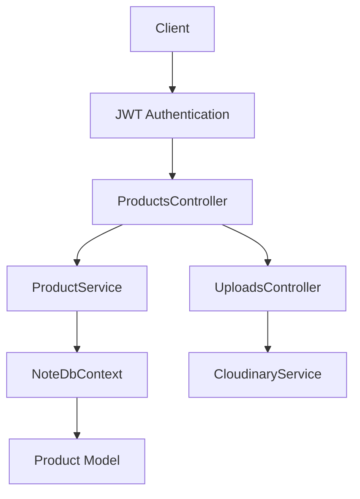
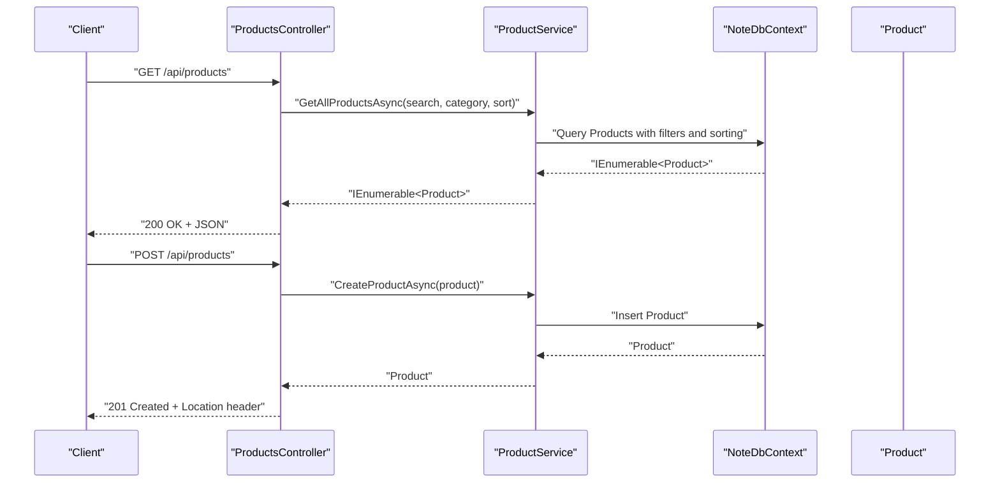
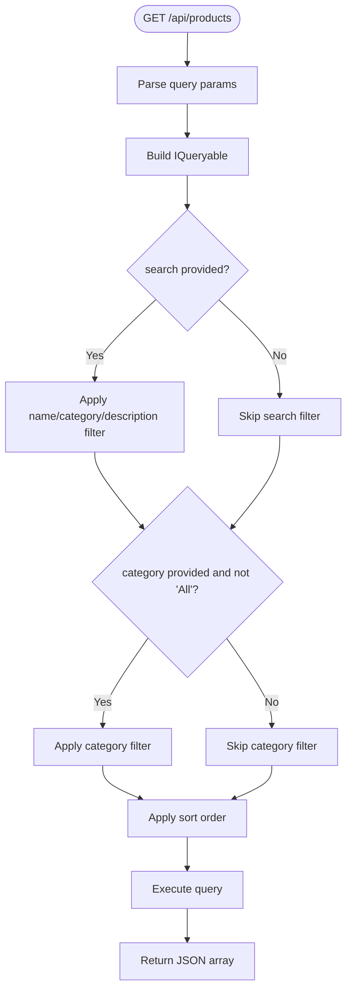
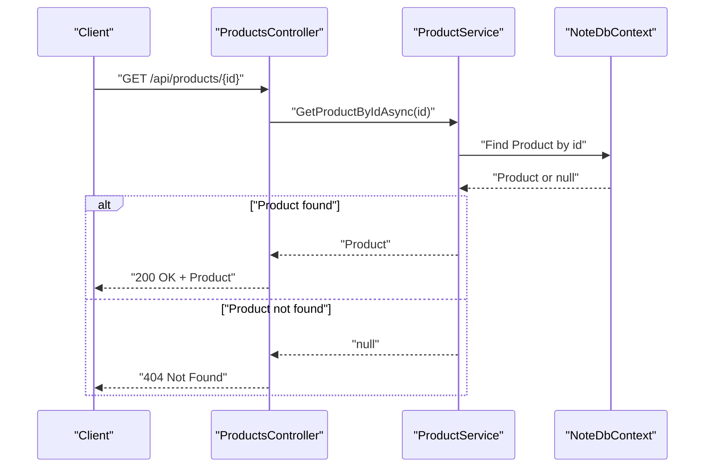
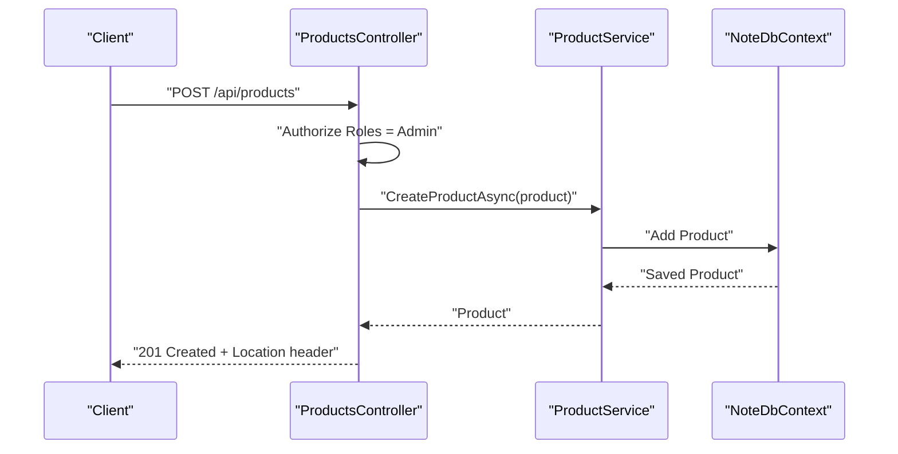
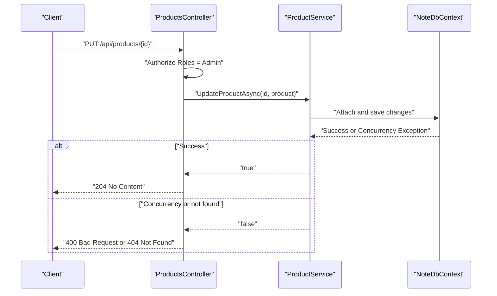
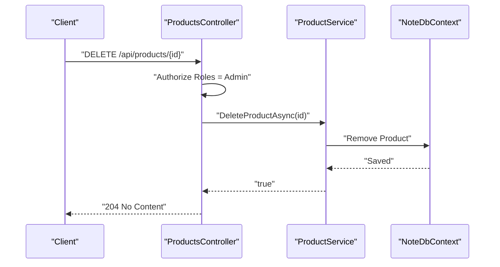
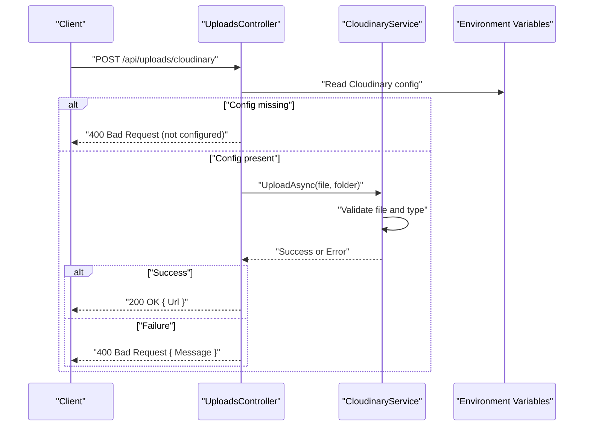
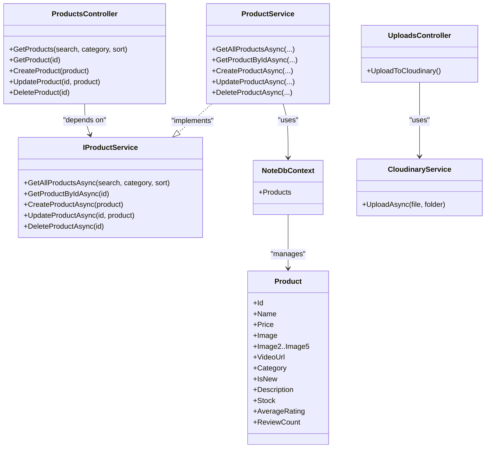

# Products API

<cite>
**Referenced Files in This Document**
- [ProductsController.cs](file://Controllers/ProductsController.cs)
- [ProductService.cs](file://Services/ProductService.cs)
- [IProductService.cs](file://Services/IProductService.cs)
- [Product.cs](file://Models/Product.cs)
- [NoteDbContext.cs](file://Data/NoteDbContext.cs)
- [Program.cs](file://Program.cs)
- [UploadsController.cs](file://Controllers/UploadsController.cs)
- [CloudinaryService.cs](file://Services/CloudinaryService.cs)
- [CloudinaryOptions.cs](file://Models/CloudinaryOptions.cs)
- [StorefrontController.cs](file://Controllers/StorefrontController.cs)
- [StorefrontConfig.cs](file://Models/StorefrontConfig.cs)
- [CartService.cs](file://Services/CartService.cs)
- [ProductReview.cs](file://Models/ProductReview.cs)
</cite>

## Table of Contents
1. [Introduction](#introduction)
2. [Project Structure](#project-structure)
3. [Core Components](#core-components)
4. [Architecture Overview](#architecture-overview)
5. [Detailed Component Analysis](#detailed-component-analysis)
6. [Dependency Analysis](#dependency-analysis)
7. [Performance Considerations](#performance-considerations)
8. [Troubleshooting Guide](#troubleshooting-guide)
9. [Conclusion](#conroduction)
10. [Appendices](#appendices)

## Introduction
This document provides comprehensive API documentation for product management endpoints. It covers product listing, search, filtering, and CRUD operations, along with image upload requirements, inventory management, and error handling. It also includes examples for product categories, pricing, stock levels, and metadata, and offers performance optimization tips for product listings and bulk operations.

## Project Structure
The product management API is implemented using ASP.NET Core with Entity Framework Core. The key components are:
- Controller layer: ProductsController exposes REST endpoints for product operations.
- Service layer: ProductService encapsulates business logic and data access.
- Data layer: NoteDbContext defines the Product entity and related configurations.
- Authentication and authorization: JWT bearer authentication and role-based authorization for admin-only endpoints.
- Image upload: Cloudinary integration via UploadsController and CloudinaryService.

**Diagram sources**
- [ProductsController.cs:10-59](file://Controllers/ProductsController.cs#L10-L59)
- [ProductService.cs:7-94](file://Services/ProductService.cs#L7-L94)
- [NoteDbContext.cs:7-67](file://Data/NoteDbContext.cs#L7-L67)
- [Product.cs:3-20](file://Models/Product.cs#L3-L20)
- [UploadsController.cs:10-79](file://Controllers/UploadsController.cs#L10-L79)
- [CloudinaryService.cs:7-103](file://Services/CloudinaryService.cs#L7-L103)

**Section sources**
- [Program.cs:61-67](file://Program.cs#L61-L67)
- [Program.cs:73-84](file://Program.cs#L73-L84)

## Core Components
- ProductsController: Exposes GET /api/products, GET /api/products/{id}, POST /api/products, PUT /api/products/{id}, and DELETE /api/products/{id}. Applies role-based authorization for admin-only operations.
- ProductService: Implements product listing, search, filtering, creation, update, and deletion with asynchronous operations.
- Product: Defines the product schema including identifiers, pricing, images, category, stock, ratings, and review counts.
- UploadsController and CloudinaryService: Provide image/video upload capabilities to Cloudinary with configurable limits and error handling.

**Section sources**
- [ProductsController.cs:19-58](file://Controllers/ProductsController.cs#L19-L58)
- [ProductService.cs:16-94](file://Services/ProductService.cs#L16-L94)
- [Product.cs:3-20](file://Models/Product.cs#L3-L20)
- [UploadsController.cs:23-78](file://Controllers/UploadsController.cs#L23-L78)
- [CloudinaryService.cs:40-102](file://Services/CloudinaryService.cs#L40-L102)

## Architecture Overview
The API follows a layered architecture:
- Presentation: ProductsController handles HTTP requests and responses.
- Application: ProductService orchestrates business logic and interacts with the database.
- Persistence: NoteDbContext manages Product entities and related configurations.
- Media: UploadsController integrates with CloudinaryService for media uploads.

**Diagram sources**
- [ProductsController.cs:19-40](file://Controllers/ProductsController.cs#L19-L40)
- [ProductService.cs:16-60](file://Services/ProductService.cs#L16-L60)
- [NoteDbContext.cs:11](file://Data/NoteDbContext.cs#L11)

## Detailed Component Analysis

### Product Endpoints

#### GET /api/products
- Purpose: Retrieve paginated product listings with optional search, category filtering, and sorting.
- Query Parameters:
  - search: Text to match against product name, category, or description.
  - category: Exact category filter; "All" is treated as no filter.
  - sort: Sorting criteria including price-asc, price-desc, name, rating, newest.
- Response: Array of Product objects.
- Notes:
  - Search is case-insensitive and trims whitespace.
  - Sorting defaults to name if unspecified.

**Diagram sources**
- [ProductsController.cs:20](file://Controllers/ProductsController.cs#L20)
- [ProductService.cs:16-45](file://Services/ProductService.cs#L16-L45)

**Section sources**
- [ProductsController.cs:19-24](file://Controllers/ProductsController.cs#L19-L24)
- [ProductService.cs:16-45](file://Services/ProductService.cs#L16-L45)

#### GET /api/products/{id}
- Purpose: Retrieve a single product by ID.
- Path Parameter:
  - id: Product identifier.
- Response: Product object.
- Error Handling:
  - Returns 404 Not Found if product does not exist.

**Diagram sources**
- [ProductsController.cs:26-32](file://Controllers/ProductsController.cs#L26-L32)
- [ProductService.cs:47-50](file://Services/ProductService.cs#L47-L50)

**Section sources**
- [ProductsController.cs:26-32](file://Controllers/ProductsController.cs#L26-L32)
- [ProductService.cs:47-50](file://Services/ProductService.cs#L47-L50)

#### POST /api/products
- Purpose: Create a new product.
- Authorization: Requires Admin role.
- Request Body: Product object (excluding generated fields).
- Response: Created Product with 201 Created and Location header pointing to GET /api/products/{id}.
- Notes:
  - ID is auto-generated.
  - AverageRating and ReviewCount are initialized to 0.

**Diagram sources**
- [ProductsController.cs:34-40](file://Controllers/ProductsController.cs#L34-L40)
- [ProductService.cs:52-60](file://Services/ProductService.cs#L52-L60)

**Section sources**
- [ProductsController.cs:34-40](file://Controllers/ProductsController.cs#L34-L40)
- [ProductService.cs:52-60](file://Services/ProductService.cs#L52-L60)

#### PUT /api/products/{id}
- Purpose: Update an existing product.
- Authorization: Requires Admin role.
- Path Parameter:
  - id: Product identifier.
- Request Body: Product object with matching ID.
- Response: 204 No Content on success; 400 Bad Request if ID mismatch or concurrency conflict; 404 Not Found if product does not exist.
- Notes:
  - Enforces ID equality between path and body.

**Diagram sources**
- [ProductsController.cs:42-49](file://Controllers/ProductsController.cs#L42-L49)
- [ProductService.cs:62-78](file://Services/ProductService.cs#L62-L78)

**Section sources**
- [ProductsController.cs:42-49](file://Controllers/ProductsController.cs#L42-L49)
- [ProductService.cs:62-78](file://Services/ProductService.cs#L62-L78)

#### DELETE /api/products/{id}
- Purpose: Remove a product.
- Authorization: Requires Admin role.
- Path Parameter:
  - id: Product identifier.
- Response: 204 No Content on success; 404 Not Found if product does not exist.

**Diagram sources**
- [ProductsController.cs:51-58](file://Controllers/ProductsController.cs#L51-L58)
- [ProductService.cs:80-88](file://Services/ProductService.cs#L80-L88)

**Section sources**
- [ProductsController.cs:51-58](file://Controllers/ProductsController.cs#L51-L58)
- [ProductService.cs:80-88](file://Services/ProductService.cs#L80-L88)

### Product Schema
- Fields:
  - Id: Unique identifier (string).
  - Name: Product name (string).
  - Price: Unit price (decimal).
  - Image: Primary image URL (string).
  - Image2–Image5: Additional image URLs (nullable strings).
  - VideoUrl: Optional video URL (nullable string).
  - Category: Product category (string).
  - IsNew: New product flag (boolean).
  - Description: Product description (nullable string).
  - Stock: Available quantity (integer).
  - AverageRating: Average rating (decimal).
  - ReviewCount: Number of reviews (integer).
- Defaults:
  - Stock defaults to 25.
  - AverageRating and ReviewCount default to 0.

**Section sources**
- [Product.cs:3-20](file://Models/Product.cs#L3-L20)

### Image Upload and Media
- Endpoint: POST /api/uploads/cloudinary
- Authorization: Requires Admin role.
- Request:
  - multipart/form-data with a file field.
  - Optional folder form field to specify Cloudinary folder; defaults to "note/products".
- Limits:
  - Maximum request size 100 MB.
- Response:
  - 200 OK with uploaded file URL on success.
  - 400 Bad Request with error message on failure (e.g., missing file, Cloudinary not configured).
- Cloudinary Configuration:
  - Uses environment variables: CLOUDINARY_CLOUD_NAME, CLOUDINARY_API_KEY, CLOUDINARY_API_SECRET.
  - Supports both images and videos.

**Diagram sources**
- [UploadsController.cs:23-78](file://Controllers/UploadsController.cs#L23-L78)
- [CloudinaryService.cs:40-102](file://Services/CloudinaryService.cs#L40-L102)

**Section sources**
- [UploadsController.cs:23-78](file://Controllers/UploadsController.cs#L23-L78)
- [CloudinaryService.cs:40-102](file://Services/CloudinaryService.cs#L40-L102)
- [CloudinaryOptions.cs:3-8](file://Models/CloudinaryOptions.cs#L3-L8)

### Inventory Management
- Stock Field:
  - Product.Stock controls availability.
  - Out-of-stock condition triggers errors in downstream operations (e.g., adding to cart).
- Recommendations:
  - Implement stock reservation during checkout.
  - Add stock adjustment endpoints for admin operations.
  - Consider optimistic concurrency for stock updates.

**Section sources**
- [Product.cs:17](file://Models/Product.cs#L17)
- [CartService.cs:33-39](file://Services/CartService.cs#L33-L39)

### Product Categories and Metadata
- Categories:
  - Example categories seeded in the database include "Journals", "Premium", "Planners", "Pocket", "Creative".
- Metadata:
  - IsNew flag indicates new arrivals.
  - AverageRating and ReviewCount support customer reviews.
  - StorefrontConfig provides marketing content for homepage display.

**Section sources**
- [NoteDbContext.cs:49-59](file://Data/NoteDbContext.cs#L49-L59)
- [StorefrontConfig.cs:3-22](file://Models/StorefrontConfig.cs#L3-L22)

### Error Handling
- Missing Product:
  - GET /api/products/{id} returns 404 Not Found if product does not exist.
- Permission Restrictions:
  - Admin-only endpoints return 401 Unauthorized or 403 Forbidden depending on authentication/authorization configuration.
- Validation Errors:
  - PUT /api/products/{id} returns 400 Bad Request on ID mismatch or concurrency conflicts.
  - POST /api/products returns 400 Bad Request if request body is invalid (handled by model binding).
- Upload Errors:
  - POST /api/uploads/cloudinary returns 400 Bad Request with detailed messages for missing files, configuration issues, or upload failures.

**Section sources**
- [ProductsController.cs:30](file://Controllers/ProductsController.cs#L30)
- [ProductsController.cs:47](file://Controllers/ProductsController.cs#L47)
- [ProductsController.cs:56](file://Controllers/ProductsController.cs#L56)
- [UploadsController.cs:45-77](file://Controllers/UploadsController.cs#L45-L77)

## Dependency Analysis
- Controller to Service:
  - ProductsController depends on IProductService for all product operations.
- Service to Data:
  - ProductService uses NoteDbContext to query and mutate Product entities.
- Authentication:
  - Program.cs configures JWT bearer authentication and authorization policies.
- Media:
  - UploadsController depends on ICloudinaryService for Cloudinary operations.

**Diagram sources**
- [ProductsController.cs:10-59](file://Controllers/ProductsController.cs#L10-L59)
- [IProductService.cs:5-12](file://Services/IProductService.cs#L5-L12)
- [ProductService.cs:7-94](file://Services/ProductService.cs#L7-L94)
- [NoteDbContext.cs:11](file://Data/NoteDbContext.cs#L11)
- [Product.cs:3-20](file://Models/Product.cs#L3-L20)
- [UploadsController.cs:10-79](file://Controllers/UploadsController.cs#L10-L79)
- [CloudinaryService.cs:7-103](file://Services/CloudinaryService.cs#L7-L103)

**Section sources**
- [Program.cs:61-67](file://Program.cs#L61-L67)
- [Program.cs:73-84](file://Program.cs#L73-L84)

## Performance Considerations
- Product Listing:
  - Use server-side filtering and sorting to minimize payload size.
  - Consider pagination for large datasets (current implementation returns all results).
  - Indexes on frequently filtered/sorted columns (e.g., Category, Price, Name) improve query performance.
- Bulk Operations:
  - Batch insert/update operations using EF Core batching or raw SQL for improved throughput.
  - Use AsNoTracking for read-only queries to reduce change tracking overhead.
- Caching:
  - Cache static product lists and popular product details to reduce database load.
- Media:
  - Compress images and videos before upload to reduce storage and bandwidth costs.
  - Use CDN delivery for media assets.

[No sources needed since this section provides general guidance]

## Troubleshooting Guide
- Authentication Issues:
  - Ensure JWT key is configured in appsettings.json or environment variables.
  - Verify that Admin role is assigned to authorized users.
- Database Connectivity:
  - Confirm DATABASE_URL or ConnectionStrings:DefaultConnection is set correctly.
  - Ensure migrations are applied at startup.
- Cloudinary Upload Failures:
  - Verify CLOUDINARY_CLOUD_NAME, CLOUDINARY_API_KEY, and CLOUDINARY_API_SECRET environment variables are set.
  - Check file size limits and content type support.
- Product Not Found:
  - Confirm product ID exists in the database.
  - Validate ID passed in request path matches the product ID in the request body for updates.

**Section sources**
- [Program.cs:30-33](file://Program.cs#L30-L33)
- [Program.cs:73-84](file://Program.cs#L73-L84)
- [UploadsController.cs:34-42](file://Controllers/UploadsController.cs#L34-L42)
- [CloudinaryService.cs:16-37](file://Services/CloudinaryService.cs#L16-L37)

## Conclusion
The Products API provides a robust foundation for product management with search, filtering, CRUD operations, and media upload capabilities. By following the documented schemas, query parameters, and error handling patterns, developers can integrate product features efficiently. For production deployments, consider implementing pagination, caching, and enhanced inventory controls to optimize performance and reliability.

[No sources needed since this section summarizes without analyzing specific files]

## Appendices

### API Definitions

- GET /api/products
  - Query Parameters:
    - search: string (optional)
    - category: string (optional)
    - sort: string (optional; one of price-asc, price-desc, name, rating, newest)
  - Response: 200 OK with array of Product

- GET /api/products/{id}
  - Path Parameter:
    - id: string
  - Response: 200 OK with Product; 404 Not Found if absent

- POST /api/products
  - Authorization: Admin
  - Request Body: Product (without generated fields)
  - Response: 201 Created with Location header; 400 Bad Request on validation errors

- PUT /api/products/{id}
  - Authorization: Admin
  - Path Parameter:
    - id: string
  - Request Body: Product with matching ID
  - Response: 204 No Content; 400 Bad Request on ID mismatch/concurrency; 404 Not Found if absent

- DELETE /api/products/{id}
  - Authorization: Admin
  - Path Parameter:
    - id: string
  - Response: 204 No Content; 404 Not Found if absent

- POST /api/uploads/cloudinary
  - Authorization: Admin
  - Request: multipart/form-data with file and optional folder
  - Response: 200 OK with { Url }; 400 Bad Request on errors

**Section sources**
- [ProductsController.cs:19-58](file://Controllers/ProductsController.cs#L19-L58)
- [UploadsController.cs:23-78](file://Controllers/UploadsController.cs#L23-L78)

### Product Schema Details
- Id: string (auto-generated)
- Name: string
- Price: decimal
- Image: string
- Image2–Image5: string (nullable)
- VideoUrl: string (nullable)
- Category: string
- IsNew: boolean
- Description: string (nullable)
- Stock: integer (default 25)
- AverageRating: decimal (default 0)
- ReviewCount: integer (default 0)

**Section sources**
- [Product.cs:3-20](file://Models/Product.cs#L3-L20)

### Example Categories and Pricing
- Categories: Journals, Premium, Planners, Pocket, Creative
- Pricing: Varies by product (seeded examples include $18.00–$85.00)
- Stock Levels: Varies by product (seeded examples include 8–30 units)

**Section sources**
- [NoteDbContext.cs:49-59](file://Data/NoteDbContext.cs#L49-L59)

### Storefront Integration
- StorefrontConfig provides hero and category banners for homepage display.
- StorefrontController exposes GET and PUT endpoints for configuration management.

**Section sources**
- [StorefrontController.cs:20-76](file://Controllers/StorefrontController.cs#L20-L76)
- [StorefrontConfig.cs:3-22](file://Models/StorefrontConfig.cs#L3-L22)