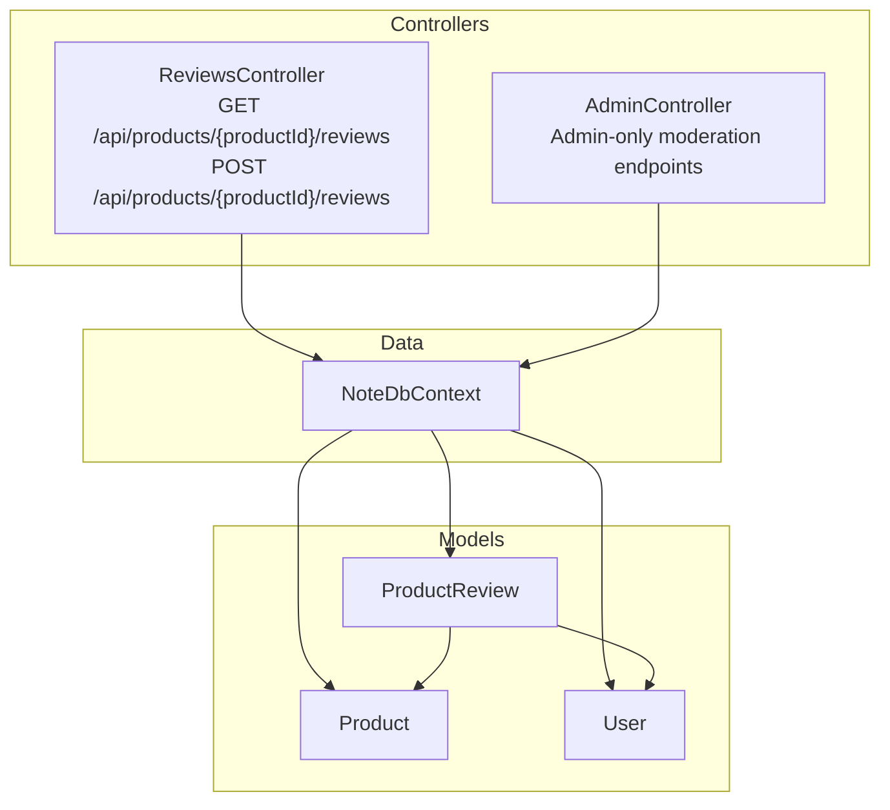
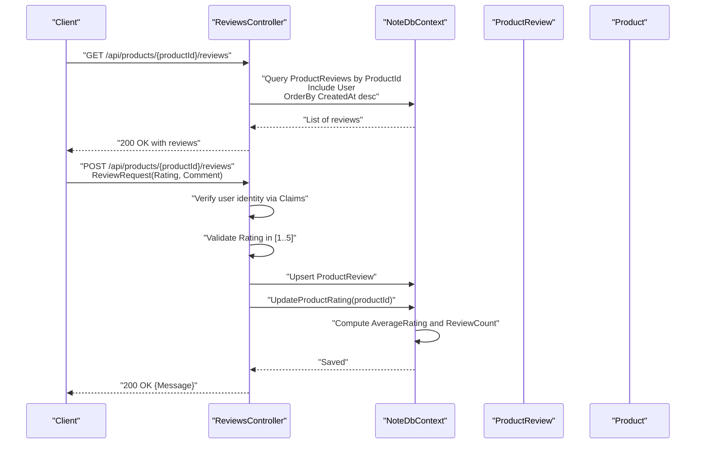
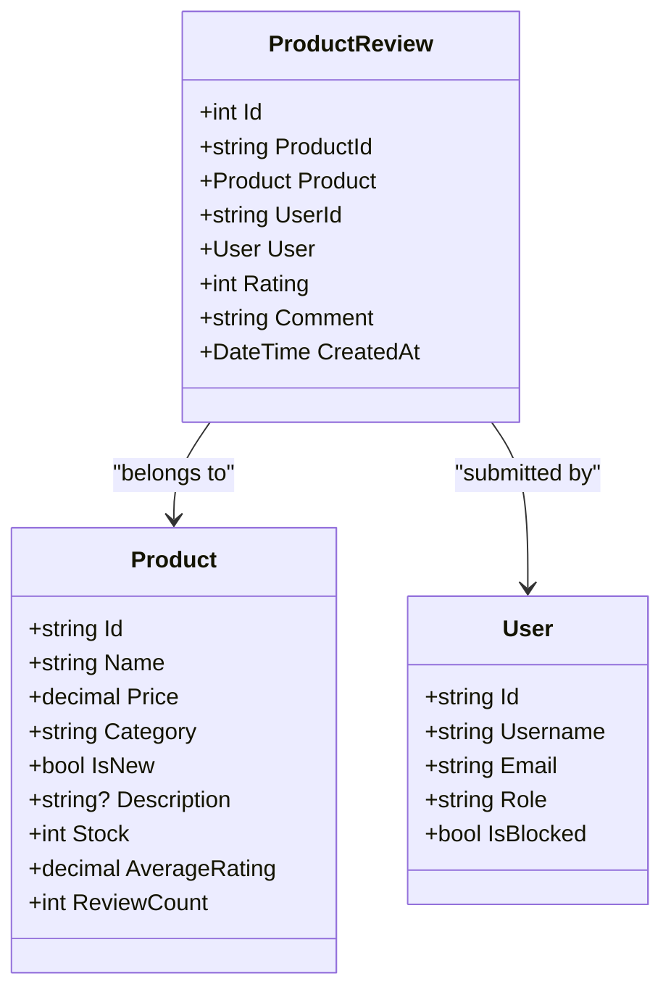
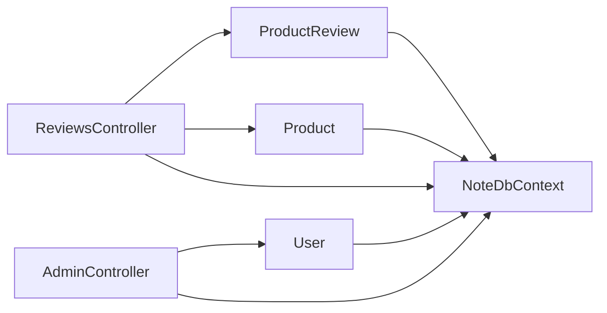

# Reviews & Ratings API

<cite>
**Referenced Files in This Document**
- [ReviewsController.cs](file://Controllers/ReviewsController.cs)
- [ProductReview.cs](file://Models/ProductReview.cs)
- [Product.cs](file://Models/Product.cs)
- [NoteDbContext.cs](file://Data/NoteDbContext.cs)
- [AdminController.cs](file://Controllers/AdminController.cs)
- [User.cs](file://Models/User.cs)
- [ProductService.cs](file://Services/ProductService.cs)
</cite>

## Table of Contents
1. [Introduction](#introduction)
2. [Project Structure](#project-structure)
3. [Core Components](#core-components)
4. [Architecture Overview](#architecture-overview)
5. [Detailed Component Analysis](#detailed-component-analysis)
6. [Dependency Analysis](#dependency-analysis)
7. [Performance Considerations](#performance-considerations)
8. [Troubleshooting Guide](#troubleshooting-guide)
9. [Conclusion](#conclusion)

## Introduction
This document describes the product review and rating management APIs implemented in the backend. It covers:
- Retrieving reviews for a product
- Submitting or editing a review
- Aggregate rating computation
- Review sorting behavior
- User verification and permissions
- Moderation and administrative controls
- Examples for filtering, helpfulness voting, and response management
- Spam prevention and approval workflows
- User reputation systems

## Project Structure
The review and rating features are primarily implemented in the ReviewsController and supported by the ProductReview and Product models, with database access via NoteDbContext. Administrative moderation is handled by AdminController, while product-level rating aggregation is computed by the controller’s internal method.

**Diagram sources**
- [ReviewsController.cs:10-87](file://Controllers/ReviewsController.cs#L10-L87)
- [ProductReview.cs:3-13](file://Models/ProductReview.cs#L3-L13)
- [Product.cs:3-20](file://Models/Product.cs#L3-L20)
- [NoteDbContext.cs:7-21](file://Data/NoteDbContext.cs#L7-L21)
- [AdminController.cs:12-276](file://Controllers/AdminController.cs#L12-L276)

**Section sources**
- [ReviewsController.cs:10-87](file://Controllers/ReviewsController.cs#L10-L87)
- [ProductReview.cs:3-13](file://Models/ProductReview.cs#L3-L13)
- [Product.cs:3-20](file://Models/Product.cs#L3-L20)
- [NoteDbContext.cs:7-21](file://Data/NoteDbContext.cs#L7-L21)

## Core Components
- ReviewsController: Exposes endpoints to fetch and submit reviews, validates ratings, and updates product aggregates.
- ProductReview: Domain entity representing a single review with rating, comment, timestamps, and user/product relations.
- Product: Domain entity storing average rating and review count for aggregation.
- NoteDbContext: Entity framework context registering ProductReview, Product, and User sets and seeding data.
- AdminController: Provides administrative capabilities that can be leveraged for moderation workflows.

Key behaviors:
- GET /api/products/{productId}/reviews returns reviews ordered by newest first.
- POST /api/products/{productId}/reviews accepts ReviewRequest and enforces 1–5 star rating.
- Internal UpdateProductRating computes AverageRating and ReviewCount per product.

**Section sources**
- [ReviewsController.cs:21-86](file://Controllers/ReviewsController.cs#L21-L86)
- [ProductReview.cs:3-13](file://Models/ProductReview.cs#L3-L13)
- [Product.cs:18-19](file://Models/Product.cs#L18-L19)
- [NoteDbContext.cs:11-21](file://Data/NoteDbContext.cs#L11-L21)

## Architecture Overview
The API follows a layered architecture:
- Controllers orchestrate requests and responses.
- Entity Framework handles persistence and relationships.
- Models define domain entities and their properties.
- Administrative endpoints support moderation workflows.

**Diagram sources**
- [ReviewsController.cs:21-86](file://Controllers/ReviewsController.cs#L21-L86)
- [NoteDbContext.cs:11-21](file://Data/NoteDbContext.cs#L11-L21)

## Detailed Component Analysis

### Endpoint: GET /api/products/{productId}/reviews
Purpose:
- Retrieve all reviews for a given product ID, sorted by newest first.

Behavior:
- Filters reviews by ProductId.
- Includes associated user information to display a username.
- Sorts by CreatedAt descending.

Response shape:
- Array of review objects with fields: id, rating, comment, createdAt, username.

Notes:
- Username fallback to “Customer” if user record is missing.

**Section sources**
- [ReviewsController.cs:21-39](file://Controllers/ReviewsController.cs#L21-L39)

### Endpoint: POST /api/products/{productId}/reviews
Purpose:
- Create or update a review for a product by an authenticated user.

Authentication:
- Requires [Authorize] attribute; extracts user identity from claims.

Request body (ReviewRequest):
- Rating: integer (validated to be between 1 and 5)
- Comment: string (trimmed before saving)

Processing:
- Validates rating range.
- Ensures product exists.
- Upserts a ProductReview for the user-product pair.
- Updates product-level aggregate rating and review count.

Response:
- Returns success message upon completion.

Validation and errors:
- 400 Bad Request if rating is out of range.
- 404 Not Found if product does not exist.
- 401 Unauthorized if user identity is missing.

Aggregate rating calculation:
- Computes AverageRating and ReviewCount for the product.
- Rounds average to 1 decimal place.

**Section sources**
- [ReviewsController.cs:41-86](file://Controllers/ReviewsController.cs#L41-L86)
- [ProductReview.cs:3-13](file://Models/ProductReview.cs#L3-L13)
- [Product.cs:18-19](file://Models/Product.cs#L18-L19)

### Endpoint: PUT /api/reviews/{reviewId}
Observation:
- No implementation currently exists for editing a review by ID.

Recommendation:
- Add a PUT endpoint under a suitable route (e.g., api/reviews/{reviewId}) to allow authorized users to edit their own reviews.
- Enforce ownership checks and rating validation similar to POST.

[No sources needed since this section proposes a missing endpoint]

### Data Models

**Diagram sources**
- [Product.cs:3-20](file://Models/Product.cs#L3-L20)
- [User.cs:3-11](file://Models/User.cs#L3-L11)
- [ProductReview.cs:3-13](file://Models/ProductReview.cs#L3-L13)

**Section sources**
- [Product.cs:3-20](file://Models/Product.cs#L3-L20)
- [User.cs:3-11](file://Models/User.cs#L3-L11)
- [ProductReview.cs:3-13](file://Models/ProductReview.cs#L3-L13)

### Review Sorting Options
Current behavior:
- Reviews are returned sorted by CreatedAt descending (newest first).

Future enhancement ideas:
- Add query parameters (e.g., sort=oldest, sort=rating-asc, sort=rating-desc) to support alternative ordering.
- Implement pagination for large review sets.

[No sources needed since this section proposes enhancements]

### Review Filtering Examples
Conceptual examples (no current server-side filters):
- Filter by minimum rating: query param min-rating=4
- Filter by date range: query params created-after and created-before
- Filter by reviewer identity: requires authenticated user context

[No sources needed since this section proposes enhancements]

### Helpfulness Voting and Response Management
Observation:
- No built-in helpfulness votes or review responses exist in the current codebase.

Recommendations:
- Add a ReviewHelpfulnessVote entity linking User and ProductReview.
- Add a ReviewResponse entity for seller/admin responses to reviews.
- Provide endpoints to submit votes and responses, gated by appropriate roles.

[No sources needed since this section proposes missing features]

### Spam Prevention Measures
Observation:
- No explicit spam detection or rate limiting is implemented.

Recommendations:
- Enforce per-user per-product review frequency limits.
- Apply content moderation checks (profanity filter, keyword blacklists).
- Require email verification or purchase history for review eligibility.

[No sources needed since this section proposes missing features]

### Review Approval Workflows
Observation:
- No moderation queue or approval steps exist.

Recommendations:
- Introduce a moderation status field on ProductReview.
- Admin endpoints to approve, reject, or flag reviews.
- Notify reviewers of moderation decisions.

[No sources needed since this section proposes missing features]

### User Reputation Systems
Observation:
- No user reputation metrics are exposed or used.

Recommendations:
- Track user review activity and helpfulness scores.
- Expose reputation indicators (e.g., “Top Contributor”) for display.
- Use reputation to influence review visibility or moderation thresholds.

[No sources needed since this section proposes missing features]

## Dependency Analysis
Relationships among core components:

**Diagram sources**
- [ReviewsController.cs:14-18](file://Controllers/ReviewsController.cs#L14-L18)
- [NoteDbContext.cs:11-21](file://Data/NoteDbContext.cs#L11-L21)
- [AdminController.cs:14-18](file://Controllers/AdminController.cs#L14-L18)

**Section sources**
- [ReviewsController.cs:14-18](file://Controllers/ReviewsController.cs#L14-L18)
- [NoteDbContext.cs:11-21](file://Data/NoteDbContext.cs#L11-L21)
- [AdminController.cs:14-18](file://Controllers/AdminController.cs#L14-L18)

## Performance Considerations
- Aggregation recalculation: UpdateProductRating iterates all reviews for a product. For high-volume products, consider:
  - Storing precomputed aggregates and updating incrementally.
  - Using background jobs to refresh aggregates periodically.
- Indexing: ProductReview.UserId+ProductId is unique; ensure efficient lookups for upsert logic.
- Sorting: Current sort by CreatedAt desc is efficient; adding filters/sorting may require additional indexes.

[No sources needed since this section provides general guidance]

## Troubleshooting Guide
Common issues and resolutions:
- Unauthorized access when posting reviews:
  - Ensure the client sends a valid authorization token; the controller extracts user identity from claims.
- Rating validation failures:
  - Only values 1–5 are accepted; adjust client submissions accordingly.
- Product not found:
  - Verify productId correctness; endpoint returns 404 if the product does not exist.
- Missing usernames:
  - If a user record is absent, the response falls back to “Customer”.

Operational tips:
- Use GET /api/products/{productId}/reviews to confirm review submission and ordering.
- Monitor product-level AverageRating and ReviewCount after submissions.

**Section sources**
- [ReviewsController.cs:41-86](file://Controllers/ReviewsController.cs#L41-L86)

## Conclusion
The current implementation provides a solid foundation for product reviews and ratings:
- Secure review submission with rating validation
- Automatic product-level aggregate updates
- Clear separation of concerns via controllers and EF context

Recommended next steps:
- Implement PUT /api/reviews/{reviewId} for editing reviews
- Add server-side filtering and sorting options
- Introduce helpfulness voting and review responses
- Build spam prevention and moderation workflows
- Develop user reputation mechanisms

[No sources needed since this section summarizes without analyzing specific files]