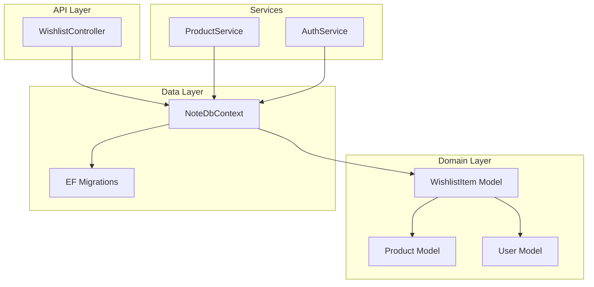
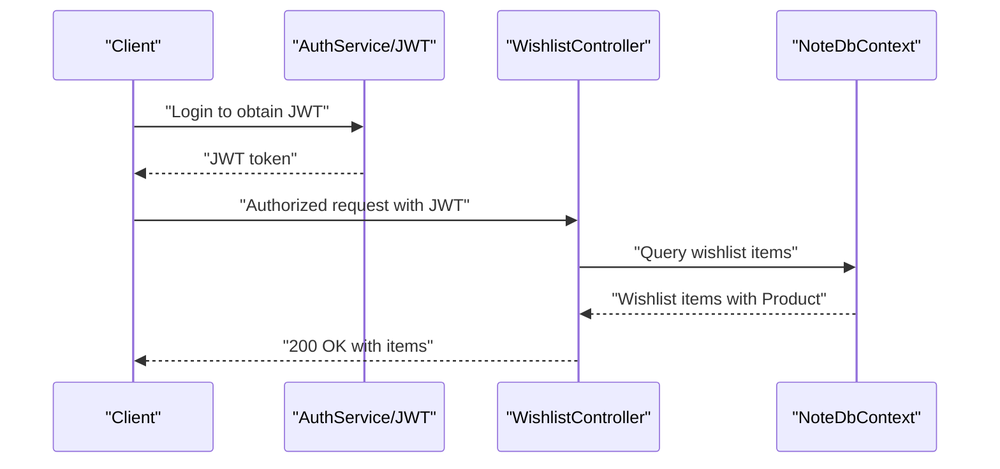
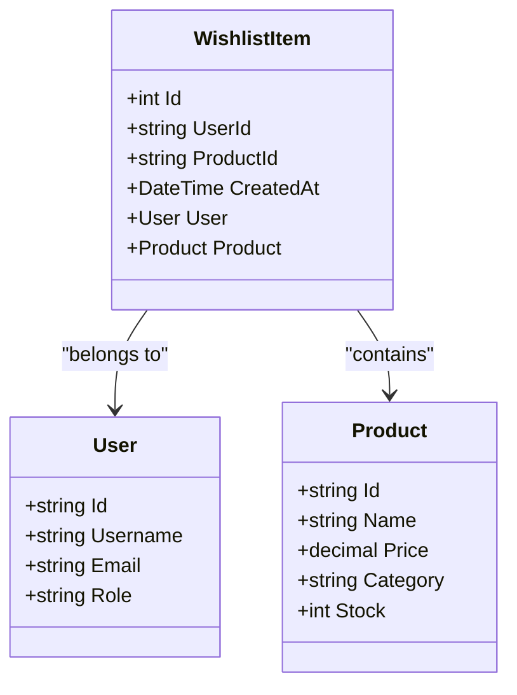
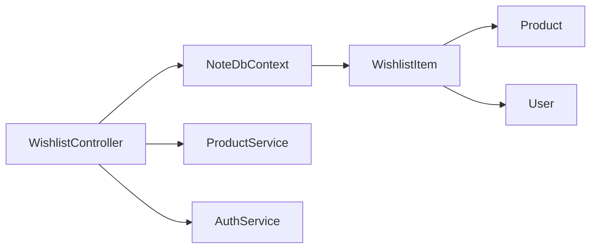

# Wishlist Management API

<cite>
**Referenced Files in This Document**
- [WishlistController.cs](file://Controllers/WishlistController.cs)
- [WishlistItem.cs](file://Models/WishlistItem.cs)
- [NoteDbContext.cs](file://Data/NoteDbContext.cs)
- [Product.cs](file://Models/Product.cs)
- [User.cs](file://Models/User.cs)
- [ProductService.cs](file://Services/ProductService.cs)
- [IProductService.cs](file://Services/IProductService.cs)
- [AuthService.cs](file://Services/AuthService.cs)
- [20260427184435_InitialCreate.cs](file://Migrations/20260427184435_InitialCreate.cs)
- [20260503221515_AddStorefrontConfig.Designer.cs](file://Migrations/20260503221515_AddStorefrontConfig.Designer.cs)
- [NoteDbContextModelSnapshot.cs](file://Migrations/NoteDbContextModelSnapshot.cs)
- [appsettings.json](file://appsettings.json)
</cite>

## Table of Contents
1. [Introduction](#introduction)
2. [Project Structure](#project-structure)
3. [Core Components](#core-components)
4. [Architecture Overview](#architecture-overview)
5. [Detailed Component Analysis](#detailed-component-analysis)
6. [Dependency Analysis](#dependency-analysis)
7. [Performance Considerations](#performance-considerations)
8. [Troubleshooting Guide](#troubleshooting-guide)
9. [Conclusion](#conclusion)

## Introduction
This document provides comprehensive API documentation for the wishlist management system. It covers the endpoints for retrieving a user's wishlist, adding items to the wishlist, removing items from the wishlist, and checking item existence. It also documents the wishlist item schema, duplicate prevention mechanisms, user association, persistence, and cross-device synchronization via JWT-based authentication. Integration with the product catalog and performance considerations for large wishlists are included.

## Project Structure
The wishlist system is implemented as part of a larger .NET backend application. Key components include:
- Controller: Exposes REST endpoints for wishlist operations
- Model: Defines the wishlist item entity and relationships
- Data Context: Provides Entity Framework configuration and database schema
- Services: Product catalog access and authentication services
- Migrations: Define the database schema for wishlist items and indexes

**Diagram sources**
- [WishlistController.cs:13-81](file://Controllers/WishlistController.cs#L13-L81)
- [WishlistItem.cs:3-11](file://Models/WishlistItem.cs#L3-L11)
- [Product.cs:3-20](file://Models/Product.cs#L3-L20)
- [User.cs:3-11](file://Models/User.cs#L3-L11)
- [NoteDbContext.cs:7-66](file://Data/NoteDbContext.cs#L7-L66)
- [ProductService.cs:7-94](file://Services/ProductService.cs#L7-L94)
- [AuthService.cs:11-97](file://Services/AuthService.cs#L11-L97)
- [20260427184435_InitialCreate.cs:193-217](file://Migrations/20260427184435_InitialCreate.cs#L193-L217)

**Section sources**
- [WishlistController.cs:13-81](file://Controllers/WishlistController.cs#L13-L81)
- [WishlistItem.cs:3-11](file://Models/WishlistItem.cs#L3-L11)
- [NoteDbContext.cs:7-66](file://Data/NoteDbContext.cs#L7-L66)

## Core Components
- WishlistController: Implements GET /api/wishlist, GET /api/wishlist/{productId}/exists, POST /api/wishlist/{productId}, and DELETE /api/wishlist/{productId}.
- WishlistItem model: Represents a wishlist entry with user and product associations and timestamps.
- NoteDbContext: Configures the WishlistItems entity, enforces uniqueness of (UserId, ProductId), and sets up cascade delete relationships.
- ProductService: Provides product catalog queries used by the wishlist controller to validate product existence.
- AuthService: Handles JWT generation and authentication, enabling cross-device session continuity.

**Section sources**
- [WishlistController.cs:22-80](file://Controllers/WishlistController.cs#L22-L80)
- [WishlistItem.cs:3-11](file://Models/WishlistItem.cs#L3-L11)
- [NoteDbContext.cs:41-47](file://Data/NoteDbContext.cs#L41-L47)
- [ProductService.cs:16-44](file://Services/ProductService.cs#L16-L44)
- [AuthService.cs:59-81](file://Services/AuthService.cs#L59-L81)

## Architecture Overview
The wishlist API is built on a layered architecture:
- Authentication: JWT tokens identify the current user across devices.
- Authorization: All wishlist endpoints are decorated with [Authorize], ensuring requests carry a valid token.
- Controller: Orchestrates business operations and interacts with the database context.
- Persistence: EF Core manages data access, with unique constraints preventing duplicates.

**Diagram sources**
- [AuthService.cs:43-57](file://Services/AuthService.cs#L43-L57)
- [WishlistController.cs:22-34](file://Controllers/WishlistController.cs#L22-L34)
- [NoteDbContext.cs:17-21](file://Data/NoteDbContext.cs#L17-L21)

## Detailed Component Analysis

### API Endpoints

#### GET /api/wishlist
- Purpose: Retrieve all wishlist items for the authenticated user, ordered by creation date descending.
- Authentication: Required (JWT).
- Response: Array of wishlist items with embedded product details.
- Behavior: Filters by current user ID extracted from JWT claims.

**Section sources**
- [WishlistController.cs:22-35](file://Controllers/WishlistController.cs#L22-L35)

#### GET /api/wishlist/{productId}/exists
- Purpose: Check if a specific product is already in the user's wishlist.
- Parameters: productId (path).
- Authentication: Required (JWT).
- Response: Boolean flag indicating existence.

**Section sources**
- [WishlistController.cs:37-45](file://Controllers/WishlistController.cs#L37-L45)

#### POST /api/wishlist/{productId}
- Purpose: Add a product to the user's wishlist.
- Parameters: productId (path).
- Authentication: Required (JWT).
- Validation:
  - Product existence verified against Products table.
  - Duplicate prevention via unique index on (UserId, ProductId).
- Response: Success message.

**Section sources**
- [WishlistController.cs:47-64](file://Controllers/WishlistController.cs#L47-L64)
- [NoteDbContext.cs:41-47](file://Data/NoteDbContext.cs#L41-L47)

#### DELETE /api/wishlist/{productId}
- Purpose: Remove a product from the user's wishlist.
- Parameters: productId (path).
- Authentication: Required (JWT).
- Behavior: Finds and deletes the matching wishlist item for the current user.

**Section sources**
- [WishlistController.cs:66-80](file://Controllers/WishlistController.cs#L66-L80)

### Wishlist Item Schema
- Fields:
  - Id: Integer identifier
  - UserId: String user identifier
  - User: Navigation property to User
  - ProductId: String product identifier
  - Product: Navigation property to Product
  - CreatedAt: Timestamp of creation (UTC)
- Relationships:
  - Many-to-one with User and Product.
  - Cascade delete configured on both relationships.

**Diagram sources**
- [WishlistItem.cs:3-11](file://Models/WishlistItem.cs#L3-L11)
- [User.cs:3-11](file://Models/User.cs#L3-L11)
- [Product.cs:3-20](file://Models/Product.cs#L3-L20)

**Section sources**
- [WishlistItem.cs:3-11](file://Models/WishlistItem.cs#L3-L11)
- [NoteDbContext.cs:610-624](file://Data/NoteDbContext.cs#L610-L624)

### Duplicate Prevention
- Database-level uniqueness enforced by composite unique index on (UserId, ProductId).
- Application-level guard checks for existing entries before insertion.

**Section sources**
- [NoteDbContext.cs:41-47](file://Data/NoteDbContext.cs#L41-L47)
- [WishlistController.cs:56-61](file://Controllers/WishlistController.cs#L56-L61)

### Cross-Device Synchronization
- JWT-based authentication ties requests to a specific user identity.
- All operations are scoped to the authenticated user, enabling seamless synchronization across devices.

**Section sources**
- [WishlistController.cs:25-26](file://Controllers/WishlistController.cs#L25-L26)
- [AuthService.cs:64-71](file://Services/AuthService.cs#L64-L71)

### Wishlist Sharing Capabilities
- Current implementation does not expose shared or public wishlist endpoints.
- No explicit sharing flags or visibility controls are present in the schema or controller.

**Section sources**
- [WishlistController.cs:12-13](file://Controllers/WishlistController.cs#L12-L13)
- [WishlistItem.cs:3-11](file://Models/WishlistItem.cs#L3-L11)

### Privacy Controls and Visibility Options
- All wishlist endpoints are protected by [Authorize], ensuring only authenticated users can access their own data.
- No visibility toggles or guest-access endpoints are implemented.

**Section sources**
- [WishlistController.cs:12-13](file://Controllers/WishlistController.cs#L12-L13)

### Integration with Product Catalog
- Product existence validated before adding to wishlist.
- Wishlist items include product details via eager loading.

**Section sources**
- [WishlistController.cs:53-54](file://Controllers/WishlistController.cs#L53-L54)
- [WishlistController.cs:30-31](file://Controllers/WishlistController.cs#L30-L31)
- [ProductService.cs:47-50](file://Services/ProductService.cs#L47-L50)

### Examples

#### Example: Add an Item to Wishlist
- Endpoint: POST /api/wishlist/{productId}
- Steps:
  - Authenticate with JWT.
  - Send POST request with productId in path.
  - Server validates product existence and prevents duplicates.

**Section sources**
- [WishlistController.cs:47-64](file://Controllers/WishlistController.cs#L47-L64)

#### Example: Remove an Item from Wishlist
- Endpoint: DELETE /api/wishlist/{productId}
- Steps:
  - Authenticate with JWT.
  - Send DELETE request with productId in path.
  - Server removes the item if found.

**Section sources**
- [WishlistController.cs:66-80](file://Controllers/WishlistController.cs#L66-L80)

#### Example: Check Item Existence
- Endpoint: GET /api/wishlist/{productId}/exists
- Steps:
  - Authenticate with JWT.
  - Send GET request with productId in path.
  - Server responds with existence flag.

**Section sources**
- [WishlistController.cs:37-45](file://Controllers/WishlistController.cs#L37-L45)

#### Example: Retrieve Wishlist
- Endpoint: GET /api/wishlist
- Steps:
  - Authenticate with JWT.
  - Send GET request.
  - Server returns all items for the user, ordered by creation date descending.

**Section sources**
- [WishlistController.cs:22-35](file://Controllers/WishlistController.cs#L22-L35)

### Wishlist Import/Export and Gift Sharing
- Import/Export: Not implemented in the current codebase.
- Gift Sharing: Not implemented in the current codebase.

**Section sources**
- [WishlistController.cs:12-13](file://Controllers/WishlistController.cs#L12-L13)

### Product Recommendations
- Recommendations are not exposed via the wishlist API; product listings and filtering are handled by ProductService.

**Section sources**
- [ProductService.cs:16-44](file://Services/ProductService.cs#L16-L44)

## Dependency Analysis
The wishlist module depends on:
- Authentication service for JWT generation and validation.
- Product catalog service for product existence checks.
- Database context for persistence and unique constraints.

**Diagram sources**
- [WishlistController.cs:15-20](file://Controllers/WishlistController.cs#L15-L20)
- [NoteDbContext.cs:17-21](file://Data/NoteDbContext.cs#L17-L21)
- [ProductService.cs:9-14](file://Services/ProductService.cs#L9-L14)
- [AuthService.cs:13-20](file://Services/AuthService.cs#L13-L20)

**Section sources**
- [WishlistController.cs:15-20](file://Controllers/WishlistController.cs#L15-L20)
- [NoteDbContext.cs:17-21](file://Data/NoteDbContext.cs#L17-L21)
- [ProductService.cs:9-14](file://Services/ProductService.cs#L9-L14)
- [AuthService.cs:13-20](file://Services/AuthService.cs#L13-L20)

## Performance Considerations
- Indexes:
  - Unique composite index on (UserId, ProductId) prevents duplicates and accelerates lookups.
  - Separate index on ProductId supports product-centric queries.
- Query Patterns:
  - Retrieval orders by CreatedAt descending; consider pagination for large wishlists.
  - Existence checks use AnyAsync for efficient boolean queries.
- Recommendations:
  - For very large wishlists, implement server-side pagination and optional filtering.
  - Consider caching frequently accessed product metadata for reduced database load.
  - Monitor query plans for ORDER BY and JOIN operations.

**Section sources**
- [NoteDbContext.cs:41-47](file://Data/NoteDbContext.cs#L41-L47)
- [WishlistController.cs:28-32](file://Controllers/WishlistController.cs#L28-L32)
- [WishlistController.cs:43-44](file://Controllers/WishlistController.cs#L43-L44)

## Troubleshooting Guide
- Unauthorized Access:
  - Symptom: 401 Unauthorized on wishlist endpoints.
  - Cause: Missing or invalid JWT.
  - Resolution: Ensure requests include a valid Authorization header with a JWT issued by the authentication service.

- Product Not Found:
  - Symptom: 404 Not Found when adding an item.
  - Cause: Product ID does not exist in Products table.
  - Resolution: Verify product ID and ensure the product exists in the catalog.

- Duplicate Addition:
  - Symptom: No error when adding an existing item.
  - Cause: Duplicate prevention via unique index and pre-check.
  - Resolution: This is expected behavior; the operation is idempotent.

- Cross-Device Sync Issues:
  - Symptom: Items missing on another device.
  - Cause: Different user sessions or expired tokens.
  - Resolution: Re-authenticate to obtain a valid JWT; ensure consistent user identity across devices.

**Section sources**
- [WishlistController.cs:25-26](file://Controllers/WishlistController.cs#L25-L26)
- [WishlistController.cs:53-54](file://Controllers/WishlistController.cs#L53-L54)
- [WishlistController.cs:56-61](file://Controllers/WishlistController.cs#L56-L61)
- [AuthService.cs:43-57](file://Services/AuthService.cs#L43-L57)

## Conclusion
The wishlist management API provides essential CRUD operations for user wishlists with strong user scoping, duplicate prevention, and integration with the product catalog. JWT-based authentication enables reliable cross-device synchronization. While sharing and advanced recommendation features are not currently implemented, the underlying schema and services offer a foundation for future enhancements.