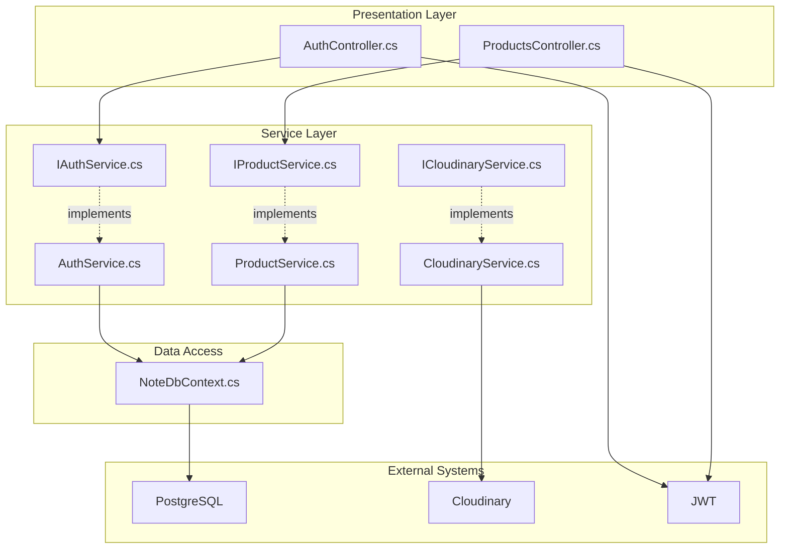
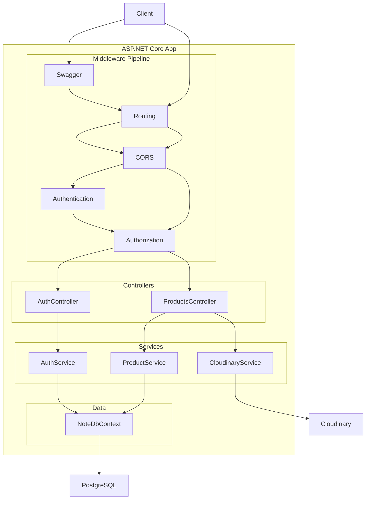
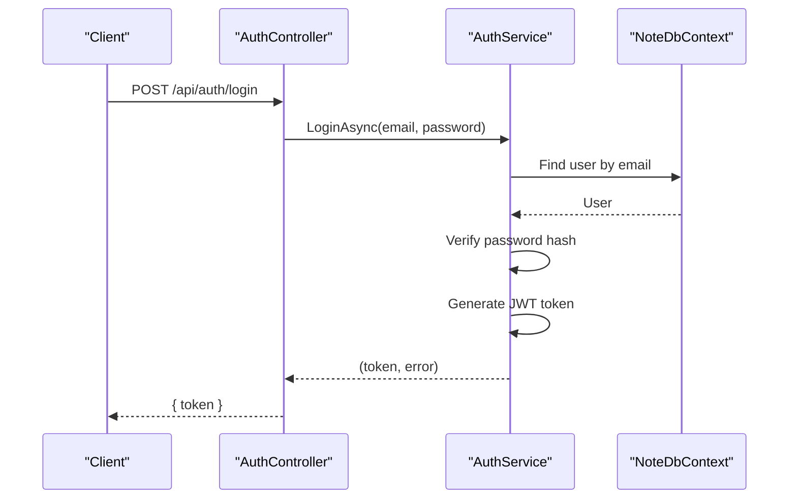
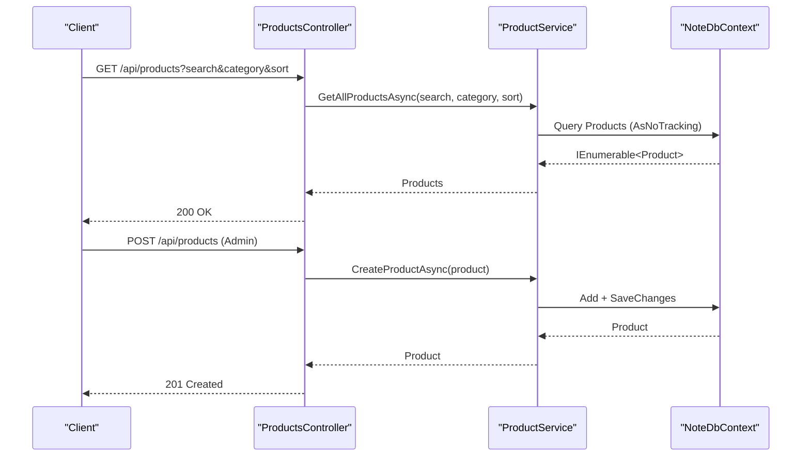
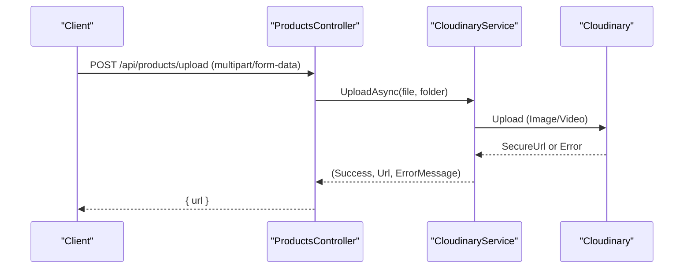
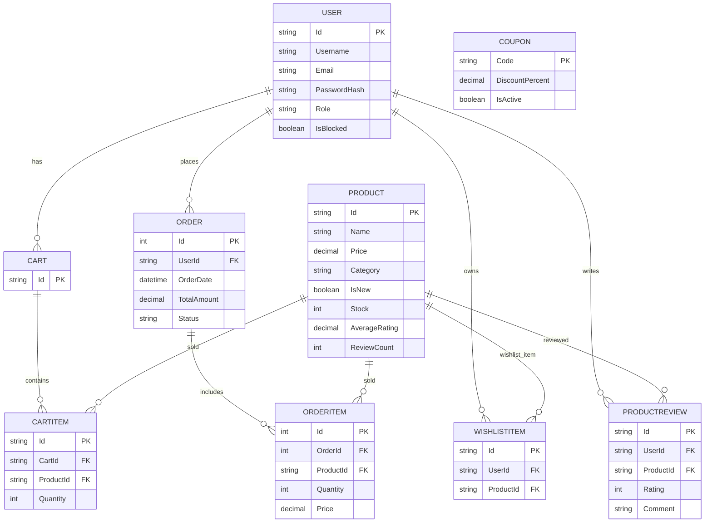
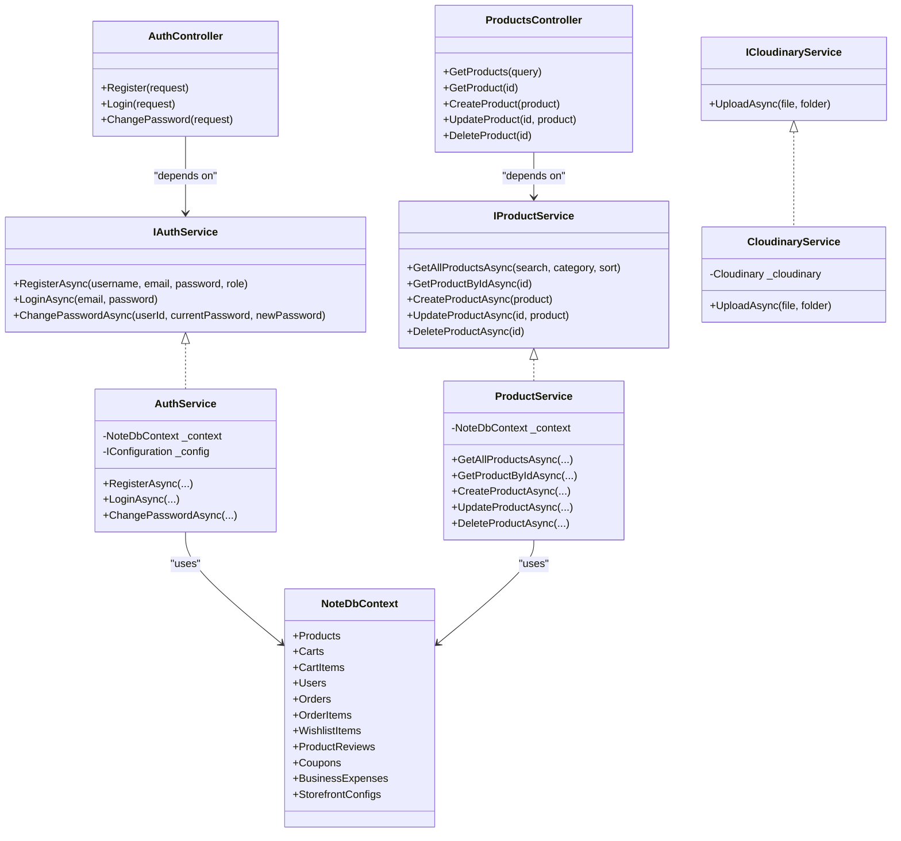
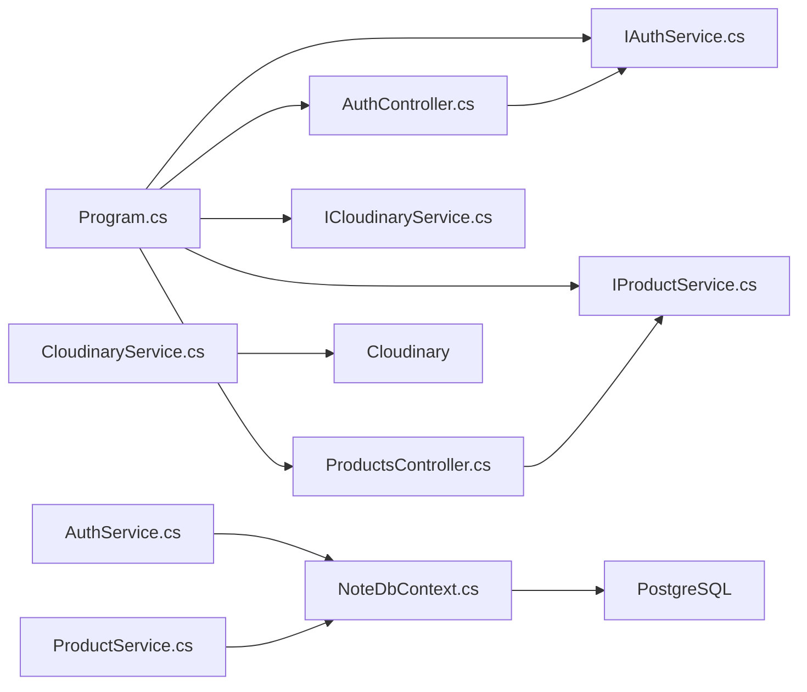

# Architecture Overview

<cite>
**Referenced Files in This Document**
- [Program.cs](file://Program.cs)
- [NoteDbContext.cs](file://Data/NoteDbContext.cs)
- [IAuthService.cs](file://Services/IAuthService.cs)
- [AuthService.cs](file://Services/AuthService.cs)
- [IProductService.cs](file://Services/IProductService.cs)
- [ProductService.cs](file://Services/ProductService.cs)
- [ICloudinaryService.cs](file://Services/ICloudinaryService.cs)
- [CloudinaryService.cs](file://Services/CloudinaryService.cs)
- [AuthController.cs](file://Controllers/AuthController.cs)
- [ProductsController.cs](file://Controllers/ProductsController.cs)
- [User.cs](file://Models/User.cs)
- [Product.cs](file://Models/Product.cs)
- [Order.cs](file://Models/Order.cs)
- [Cart.cs](file://Models/Cart.cs)
- [CloudinaryOptions.cs](file://Models/CloudinaryOptions.cs)
- [appsettings.json](file://appsettings.json)
</cite>

## Table of Contents
1. [Introduction](#introduction)
2. [Project Structure](#project-structure)
3. [Core Components](#core-components)
4. [Architecture Overview](#architecture-overview)
5. [Detailed Component Analysis](#detailed-component-analysis)
6. [Dependency Analysis](#dependency-analysis)
7. [Performance Considerations](#performance-considerations)
8. [Troubleshooting Guide](#troubleshooting-guide)
9. [Conclusion](#conclusion)
10. [Appendices](#appendices)

## Introduction
This document presents the architecture of Note.Backend, a layered ASP.NET Core application implementing an MVC pattern with a clear separation of concerns. The system emphasizes:
- Clean separation between controllers (presentation), services (business logic), and data access (Entity Framework).
- Dependency injection container for managing services and infrastructure.
- Authentication via JWT and authorization via roles.
- External integrations for media uploads (Cloudinary) and persistent storage (PostgreSQL).
- Scalability and security considerations aligned with the current implementation.

## Project Structure
The solution follows a conventional ASP.NET Core project layout:
- Controllers: HTTP entry points exposing REST endpoints.
- Services: Business logic interfaces and implementations.
- Data: Entity Framework DbContext and model configurations.
- Models: Domain entities and DTO-like request/response models.
- Root: Application startup, configuration, and environment variables.

**Diagram sources**
- [Program.cs:61-67](file://Program.cs#L61-L67)
- [AuthController.cs:13](file://Controllers/AuthController.cs#L13)
- [ProductsController.cs:14](file://Controllers/ProductsController.cs#L14)
- [AuthService.cs:16](file://Services/AuthService.cs#L16)
- [ProductService.cs:11](file://Services/ProductService.cs#L11)
- [CloudinaryService.cs:12](file://Services/CloudinaryService.cs#L12)
- [NoteDbContext.cs:7](file://Data/NoteDbContext.cs#L7)

**Section sources**
- [Program.cs:10-150](file://Program.cs#L10-L150)
- [appsettings.json:1-23](file://appsettings.json#L1-L23)

## Core Components
- Program and DI container: Registers controllers, services, JWT authentication, CORS, Swagger, and applies EF migrations at startup.
- DbContext: Centralized data access for domain entities and seeding.
- Controllers: Thin presentation layer delegating to services; enforcing authorization policies.
- Services: Encapsulate business logic, orchestrate data access, and integrate with external systems.
- Models: Define domain entities and request/response shapes.

**Section sources**
- [Program.cs:61-84](file://Program.cs#L61-L84)
- [NoteDbContext.cs:23-65](file://Data/NoteDbContext.cs#L23-L65)
- [AuthController.cs:18-54](file://Controllers/AuthController.cs#L18-L54)
- [AuthService.cs:22-96](file://Services/AuthService.cs#L22-L96)
- [ProductService.cs:16-93](file://Services/ProductService.cs#L16-L93)

## Architecture Overview
The system adheres to layered architecture:
- Presentation: Controllers expose endpoints and enforce authorization.
- Business: Services encapsulate domain logic and coordinate data access.
- Data: DbContext manages persistence and seeding.
- Infrastructure: JWT for authn/authz, Cloudinary for media, PostgreSQL for persistence.

**Diagram sources**
- [Program.cs:100-148](file://Program.cs#L100-L148)
- [AuthController.cs:18-54](file://Controllers/AuthController.cs#L18-L54)
- [ProductsController.cs:19-58](file://Controllers/ProductsController.cs#L19-L58)
- [AuthService.cs:16](file://Services/AuthService.cs#L16)
- [ProductService.cs:11](file://Services/ProductService.cs#L11)
- [CloudinaryService.cs:12](file://Services/CloudinaryService.cs#L12)
- [NoteDbContext.cs:7](file://Data/NoteDbContext.cs#L7)

## Detailed Component Analysis

### Authentication and Authorization Flow
The authentication flow integrates JWT-based identity and role-based authorization:
- Controllers require authorization for protected actions.
- AuthService validates credentials, checks block status, and generates JWT tokens.
- JWT configuration is registered in Program.cs with symmetric key signing.

**Diagram sources**
- [AuthController.cs:29-38](file://Controllers/AuthController.cs#L29-L38)
- [AuthService.cs:43-57](file://Services/AuthService.cs#L43-L57)
- [NoteDbContext.cs:14](file://Data/NoteDbContext.cs#L14)

**Section sources**
- [AuthController.cs:40-54](file://Controllers/AuthController.cs#L40-L54)
- [AuthService.cs:59-81](file://Services/AuthService.cs#L59-L81)
- [Program.cs:69-84](file://Program.cs#L69-L84)

### Product Management Workflow
ProductsController delegates CRUD operations to ProductService, which queries NoteDbContext. Filtering, sorting, and search are handled in-memory with EF queries.

**Diagram sources**
- [ProductsController.cs:19-40](file://Controllers/ProductsController.cs#L19-L40)
- [ProductService.cs:16-60](file://Services/ProductService.cs#L16-L60)
- [NoteDbContext.cs:11](file://Data/NoteDbContext.cs#L11)

**Section sources**
- [ProductsController.cs:34-58](file://Controllers/ProductsController.cs#L34-L58)
- [ProductService.cs:47-93](file://Services/ProductService.cs#L47-L93)
- [Product.cs:3-21](file://Models/Product.cs#L3-L21)

### Media Upload Workflow (Cloudinary)
CloudinaryService integrates with Cloudinary SDK using environment variables. It supports both images and videos, returning secure URLs upon success.

**Diagram sources**
- [ProductsController.cs:19](file://Controllers/ProductsController.cs#L19)
- [ICloudinaryService.cs:5](file://Services/ICloudinaryService.cs#L5)
- [CloudinaryService.cs:40-102](file://Services/CloudinaryService.cs#L40-L102)

**Section sources**
- [CloudinaryService.cs:16-38](file://Services/CloudinaryService.cs#L16-L38)
- [CloudinaryOptions.cs:3-8](file://Models/CloudinaryOptions.cs#L3-L8)

### Data Model Relationships
The domain model centers around Users, Products, Carts, Orders, and related entities. Relationships and keys are defined in the DbContext.

**Diagram sources**
- [NoteDbContext.cs:11-21](file://Data/NoteDbContext.cs#L11-L21)
- [User.cs:3-11](file://Models/User.cs#L3-L11)
- [Product.cs:3-21](file://Models/Product.cs#L3-L21)
- [Cart.cs:5-9](file://Models/Cart.cs#L5-L9)
- [Order.cs:3-33](file://Models/Order.cs#L3-L33)

**Section sources**
- [NoteDbContext.cs:23-65](file://Data/NoteDbContext.cs#L23-L65)
- [Order.cs:35-46](file://Models/Order.cs#L35-L46)

### Class Relationships

**Diagram sources**
- [AuthController.cs:9-16](file://Controllers/AuthController.cs#L9-L16)
- [ProductsController.cs:10-17](file://Controllers/ProductsController.cs#L10-L17)
- [IAuthService.cs:5-10](file://Services/IAuthService.cs#L5-L10)
- [AuthService.cs:11-20](file://Services/AuthService.cs#L11-L20)
- [IProductService.cs](file://Services/IProductService.cs)
- [ProductService.cs:7-14](file://Services/ProductService.cs#L7-L14)
- [ICloudinaryService.cs:3-6](file://Services/ICloudinaryService.cs#L3-L6)
- [CloudinaryService.cs:7-14](file://Services/CloudinaryService.cs#L7-L14)
- [NoteDbContext.cs:7-21](file://Data/NoteDbContext.cs#L7-L21)

## Dependency Analysis
- Controllers depend on service interfaces, promoting testability and inversion of control.
- Services depend on NoteDbContext for data operations and on external services (e.g., Cloudinary) for media.
- Program.cs registers services and middleware, wiring the application together.
- External dependencies include PostgreSQL (via Npgsql) and Cloudinary.

**Diagram sources**
- [Program.cs:61-67](file://Program.cs#L61-L67)
- [AuthController.cs:13](file://Controllers/AuthController.cs#L13)
- [ProductsController.cs:14](file://Controllers/ProductsController.cs#L14)
- [AuthService.cs:16](file://Services/AuthService.cs#L16)
- [ProductService.cs:11](file://Services/ProductService.cs#L11)
- [CloudinaryService.cs:12](file://Services/CloudinaryService.cs#L12)
- [NoteDbContext.cs:7](file://Data/NoteDbContext.cs#L7)

**Section sources**
- [Program.cs:61-84](file://Program.cs#L61-L84)
- [Program.cs:104-138](file://Program.cs#L104-L138)

## Performance Considerations
- AsNoTracking queries in ProductService reduce change-tracking overhead for read-heavy scenarios.
- Sorting and filtering are applied server-side; consider pagination and indexing for large datasets.
- JWT token generation occurs per login; caching tokens or optimizing signing parameters can reduce CPU load.
- Cloudinary uploads occur synchronously; consider asynchronous processing for large media workloads.
- CORS is permissive during development; tighten origins for production.

[No sources needed since this section provides general guidance]

## Troubleshooting Guide
- Database connectivity: Ensure the connection string is present in configuration or environment variables; Program.cs validates and converts URIs to Npgsql format.
- JWT configuration: Confirm the JWT key is set; otherwise, a default insecure key is used.
- Cloudinary configuration: Missing environment variables prevent initialization; logs indicate missing values.
- CORS: Permissive policy is enabled for development; adjust to trusted origins in production.
- Migrations: Automatic migration runs at startup; verify schema updates and seed data.

**Section sources**
- [Program.cs:25-59](file://Program.cs#L25-L59)
- [Program.cs:69-84](file://Program.cs#L69-L84)
- [Program.cs:104-138](file://Program.cs#L104-L138)
- [CloudinaryService.cs:16-38](file://Services/CloudinaryService.cs#L16-L38)

## Conclusion
Note.Backend employs a clean, layered architecture with explicit separation of concerns. Controllers remain thin, services encapsulate business logic, and the DbContext centralizes persistence. JWT and role-based authorization protect endpoints, while Cloudinary and PostgreSQL provide external integrations. The design supports scalability through DI, testability via interfaces, and maintainability through clear boundaries.

[No sources needed since this section summarizes without analyzing specific files]

## Appendices

### System Boundaries and External Integrations
- Internal boundary: Controllers, Services, and DbContext form the core application.
- External boundary: PostgreSQL for relational data and Cloudinary for media assets.
- Authentication boundary: JWT tokens issued by the application and validated by middleware.

**Section sources**
- [Program.cs:38-39](file://Program.cs#L38-L39)
- [CloudinaryService.cs:16-38](file://Services/CloudinaryService.cs#L16-L38)
- [Program.cs:69-84](file://Program.cs#L69-L84)

### Deployment Topology Notes
- Single-instance ASP.NET Core app with embedded middleware pipeline.
- PostgreSQL and Cloudinary accessed via environment variables and connection strings.
- Consider horizontal scaling behind a reverse proxy and stateless session design.

[No sources needed since this section provides general guidance]