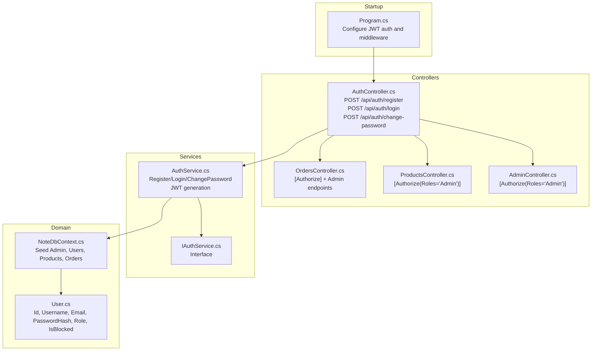
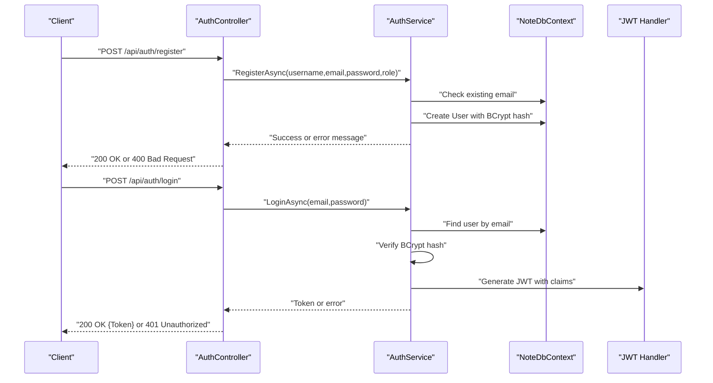
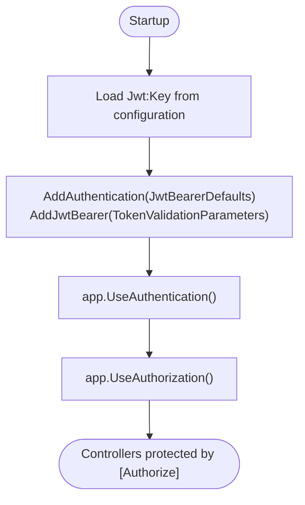
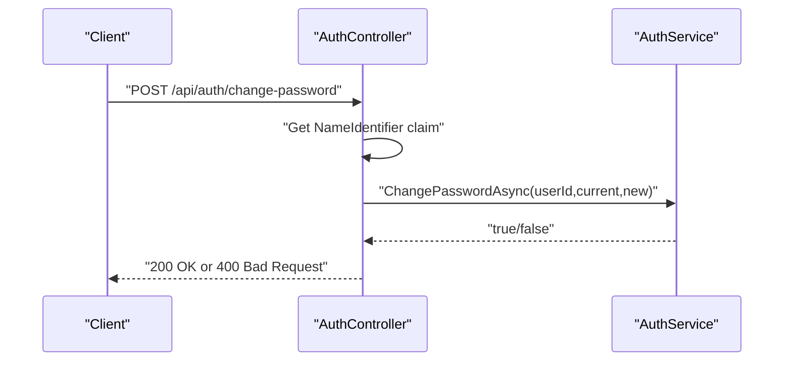
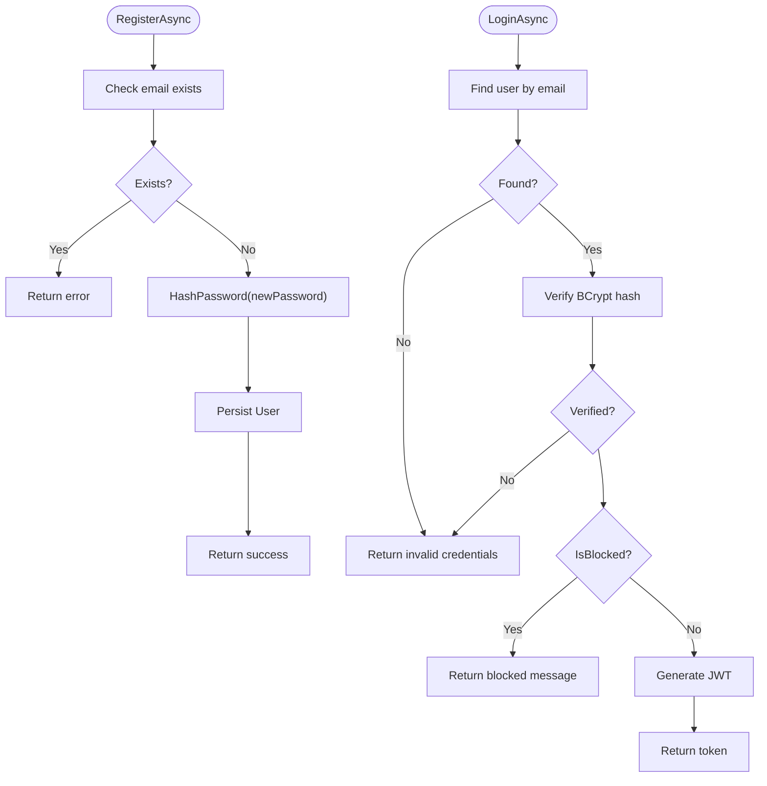
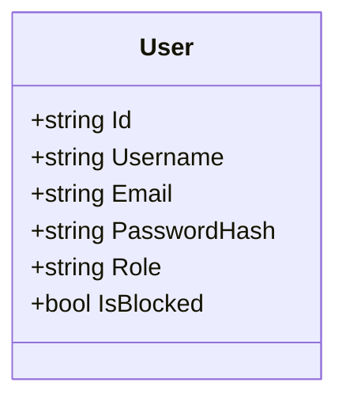
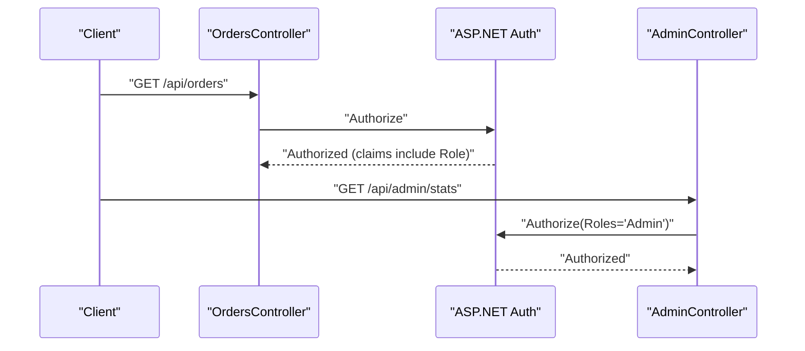
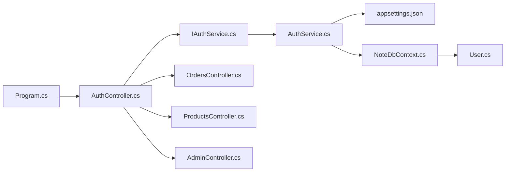

# Authentication & Authorization

<cite>
**Referenced Files in This Document**
- [Program.cs](file://Program.cs)
- [appsettings.json](file://appsettings.json)
- [Controllers/AuthController.cs](file://Controllers/AuthController.cs)
- [Services/IAuthService.cs](file://Services/IAuthService.cs)
- [Services/AuthService.cs](file://Services/AuthService.cs)
- [Models/User.cs](file://Models/User.cs)
- [Data/NoteDbContext.cs](file://Data/NoteDbContext.cs)
- [Controllers/OrdersController.cs](file://Controllers/OrdersController.cs)
- [Controllers/ProductsController.cs](file://Controllers/ProductsController.cs)
- [Controllers/AdminController.cs](file://Controllers/AdminController.cs)
</cite>

## Table of Contents
1. [Introduction](#introduction)
2. [Project Structure](#project-structure)
3. [Core Components](#core-components)
4. [Architecture Overview](#architecture-overview)
5. [Detailed Component Analysis](#detailed-component-analysis)
6. [Dependency Analysis](#dependency-analysis)
7. [Performance Considerations](#performance-considerations)
8. [Troubleshooting Guide](#troubleshooting-guide)
9. [Conclusion](#conclusion)
10. [Appendices](#appendices)

## Introduction
This document explains the authentication and authorization system in Note.Backend. It covers JWT-based authentication, password hashing with BCrypt, token generation and validation, role-based access control (RBAC), and the integration of authentication with the broader authorization model across controllers. It also documents the authentication endpoints, request/response schemas, security best practices, and common authentication scenarios such as login, registration, and password changes.

## Project Structure
Authentication and authorization are implemented across a small set of focused components:
- Program.cs configures JWT authentication and authorization middleware.
- Controllers/AuthController exposes registration, login, and password change endpoints.
- Services/AuthService encapsulates password hashing, user persistence, and JWT token generation.
- Models/User defines the user entity with roles and blocking state.
- Data/NoteDbContext seeds an admin user and manages database entities.
- Controllers/OrdersController, ProductsController, and AdminController demonstrate RBAC enforcement.

**Diagram sources**
- [Program.cs:69-84](file://Program.cs#L69-L84)
- [Controllers/AuthController.cs:18-54](file://Controllers/AuthController.cs#L18-L54)
- [Services/AuthService.cs:22-96](file://Services/AuthService.cs#L22-L96)
- [Models/User.cs:3-11](file://Models/User.cs#L3-L11)
- [Data/NoteDbContext.cs:27-37](file://Data/NoteDbContext.cs#L27-L37)
- [Controllers/OrdersController.cs:11-11](file://Controllers/OrdersController.cs#L11-L11)
- [Controllers/ProductsController.cs:34-51](file://Controllers/ProductsController.cs#L34-L51)
- [Controllers/AdminController.cs:11-11](file://Controllers/AdminController.cs#L11-L11)

**Section sources**
- [Program.cs:69-84](file://Program.cs#L69-L84)
- [Controllers/AuthController.cs:18-54](file://Controllers/AuthController.cs#L18-L54)
- [Services/AuthService.cs:22-96](file://Services/AuthService.cs#L22-L96)
- [Models/User.cs:3-11](file://Models/User.cs#L3-L11)
- [Data/NoteDbContext.cs:27-37](file://Data/NoteDbContext.cs#L27-L37)

## Core Components
- JWT Authentication and Authorization
  - JWT Bearer authentication is configured in Program.cs with symmetric key validation.
  - Authorization middleware is enabled globally.
- AuthController
  - Exposes register, login, and change-password endpoints.
  - Uses IAuthService for business logic.
- AuthService
  - Implements registration, login, and password change using BCrypt.
  - Generates JWT tokens with standard claims and a 7-day expiry.
- User Model
  - Contains Id, Username, Email, PasswordHash, Role, and IsBlocked.
- Database Context
  - Seeds an Admin user and initializes entities.

**Section sources**
- [Program.cs:69-84](file://Program.cs#L69-L84)
- [Controllers/AuthController.cs:18-54](file://Controllers/AuthController.cs#L18-L54)
- [Services/AuthService.cs:22-96](file://Services/AuthService.cs#L22-L96)
- [Models/User.cs:3-11](file://Models/User.cs#L3-L11)
- [Data/NoteDbContext.cs:27-37](file://Data/NoteDbContext.cs#L27-L37)

## Architecture Overview
The authentication flow integrates with ASP.NET Core’s authentication and authorization pipeline:
- Startup configures JWT Bearer authentication with symmetric key validation.
- Controllers apply authorization attributes for endpoint-level protection.
- AuthController delegates to AuthService for registration, login, and password changes.
- AuthService persists users, hashes passwords with BCrypt, and generates JWT tokens.

**Diagram sources**
- [Controllers/AuthController.cs:18-38](file://Controllers/AuthController.cs#L18-L38)
- [Services/AuthService.cs:22-57](file://Services/AuthService.cs#L22-L57)
- [Data/NoteDbContext.cs:27-37](file://Data/NoteDbContext.cs#L27-L37)

## Detailed Component Analysis

### JWT Configuration and Validation
- Symmetric key validation is configured in Program.cs using the Jwt:Key setting.
- Token validation parameters enforce issuer signing key validation.
- Authorization middleware is enabled globally to protect controllers.

**Diagram sources**
- [Program.cs:69-84](file://Program.cs#L69-L84)
- [Program.cs:145-146](file://Program.cs#L145-L146)

**Section sources**
- [Program.cs:69-84](file://Program.cs#L69-L84)
- [Program.cs:145-146](file://Program.cs#L145-L146)

### AuthController Endpoints and Schemas
- POST /api/auth/register
  - Request: RegisterRequest { username, email, password, role? }
  - Response: 200 OK on success, 400 Bad Request on duplicate email.
- POST /api/auth/login
  - Request: LoginRequest { email, password }
  - Response: 200 OK with { token } or 401 Unauthorized on invalid credentials.
- POST /api/auth/change-password
  - Request: ChangePasswordRequest { currentPassword, newPassword }
  - Response: 200 OK on success, 400 Bad Request on failure, 401 Unauthorized if not authenticated.

**Diagram sources**
- [Controllers/AuthController.cs:40-54](file://Controllers/AuthController.cs#L40-L54)
- [Services/AuthService.cs:83-96](file://Services/AuthService.cs#L83-L96)

**Section sources**
- [Controllers/AuthController.cs:18-54](file://Controllers/AuthController.cs#L18-L54)
- [Controllers/AuthController.cs:57-75](file://Controllers/AuthController.cs#L57-L75)

### AuthService Implementation
- Registration
  - Checks for existing email.
  - Creates a new User with BCrypt hashed password and default role "User".
- Login
  - Finds user by email, verifies password with BCrypt.
  - Blocks login if IsBlocked is true.
  - Generates JWT with standard claims and 7-day expiry.
- Change Password
  - Verifies current password with BCrypt.
  - Updates password hash and saves changes.

**Diagram sources**
- [Services/AuthService.cs:22-57](file://Services/AuthService.cs#L22-L57)
- [Services/AuthService.cs:83-96](file://Services/AuthService.cs#L83-L96)

**Section sources**
- [Services/AuthService.cs:22-57](file://Services/AuthService.cs#L22-L57)
- [Services/AuthService.cs:83-96](file://Services/AuthService.cs#L83-L96)

### User Model and Database Seeding
- User entity includes Id, Username, Email, PasswordHash, Role ("User" or "Admin"), and IsBlocked.
- Admin user is seeded with a predefined hash for initial admin access.

**Diagram sources**
- [Models/User.cs:3-11](file://Models/User.cs#L3-L11)
- [Data/NoteDbContext.cs:27-37](file://Data/NoteDbContext.cs#L27-L37)

**Section sources**
- [Models/User.cs:3-11](file://Models/User.cs#L3-L11)
- [Data/NoteDbContext.cs:27-37](file://Data/NoteDbContext.cs#L27-L37)

### Role-Based Access Control (RBAC)
- Controllers apply [Authorize] and [Authorize(Roles="Admin")] to restrict access.
- Claims-based roles are included in JWT tokens for downstream authorization checks.

Examples:
- OrdersController: [Authorize] protects user-specific operations; [Authorize(Roles="Admin")] for admin-only endpoints.
- ProductsController: [Authorize(Roles="Admin")] for create/update/delete.
- AdminController: [Authorize(Roles="Admin")] for administrative tasks.

**Diagram sources**
- [Controllers/OrdersController.cs:11-11](file://Controllers/OrdersController.cs#L11-L11)
- [Controllers/OrdersController.cs:72-78](file://Controllers/OrdersController.cs#L72-L78)
- [Controllers/ProductsController.cs:34-51](file://Controllers/ProductsController.cs#L34-L51)
- [Controllers/AdminController.cs:11-11](file://Controllers/AdminController.cs#L11-L11)

**Section sources**
- [Controllers/OrdersController.cs:11-11](file://Controllers/OrdersController.cs#L11-L11)
- [Controllers/OrdersController.cs:72-78](file://Controllers/OrdersController.cs#L72-L78)
- [Controllers/ProductsController.cs:34-51](file://Controllers/ProductsController.cs#L34-L51)
- [Controllers/AdminController.cs:11-11](file://Controllers/AdminController.cs#L11-L11)

## Dependency Analysis
- Program.cs depends on configuration for Jwt:Key and registers JWT Bearer authentication.
- AuthController depends on IAuthService for business logic.
- AuthService depends on NoteDbContext for persistence and IConfiguration for JWT settings.
- Controllers depend on authorization attributes to enforce RBAC.

**Diagram sources**
- [Program.cs:69-84](file://Program.cs#L69-L84)
- [Controllers/AuthController.cs:13-16](file://Controllers/AuthController.cs#L13-L16)
- [Services/IAuthService.cs:5-10](file://Services/IAuthService.cs#L5-L10)
- [Services/AuthService.cs:13-20](file://Services/AuthService.cs#L13-L20)
- [appsettings.json:6-8](file://appsettings.json#L6-L8)
- [Data/NoteDbContext.cs:14](file://Data/NoteDbContext.cs#L14)
- [Models/User.cs:5-10](file://Models/User.cs#L5-L10)
- [Controllers/OrdersController.cs:12](file://Controllers/OrdersController.cs#L12)
- [Controllers/ProductsController.cs:14](file://Controllers/ProductsController.cs#L14)
- [Controllers/AdminController.cs:12](file://Controllers/AdminController.cs#L12)

**Section sources**
- [Program.cs:69-84](file://Program.cs#L69-L84)
- [Controllers/AuthController.cs:13-16](file://Controllers/AuthController.cs#L13-L16)
- [Services/IAuthService.cs:5-10](file://Services/IAuthService.cs#L5-L10)
- [Services/AuthService.cs:13-20](file://Services/AuthService.cs#L13-L20)
- [appsettings.json:6-8](file://appsettings.json#L6-L8)
- [Data/NoteDbContext.cs:14](file://Data/NoteDbContext.cs#L14)
- [Models/User.cs:5-10](file://Models/User.cs#L5-L10)

## Performance Considerations
- Token lifetime: Tokens expire in 7 days. Consider shorter expirations for higher security and refresh mechanisms for long-lived sessions.
- Password hashing: BCrypt cost is managed by the library defaults; ensure consistent deployment-wide configuration.
- Database queries: Email uniqueness check and user lookup are O(1) with proper indexing; ensure indexes exist on Email and Id.
- Middleware overhead: JWT validation occurs per request; keep signing keys secure and avoid unnecessary reconfiguration.

[No sources needed since this section provides general guidance]

## Troubleshooting Guide
Common issues and resolutions:
- Invalid credentials during login
  - Cause: Incorrect email/password combination or blocked account.
  - Resolution: Verify credentials and ensure user is not blocked.
- Duplicate email on registration
  - Cause: Email already exists.
  - Resolution: Use a unique email address.
- Unauthorized access to protected endpoints
  - Cause: Missing or invalid JWT in Authorization header.
  - Resolution: Obtain a valid token via login and include it in requests.
- Role-based access denied
  - Cause: Missing Admin role claim.
  - Resolution: Ensure user has Role="Admin" and token includes role claims.

**Section sources**
- [Services/AuthService.cs:43-57](file://Services/AuthService.cs#L43-L57)
- [Services/AuthService.cs:22-41](file://Services/AuthService.cs#L22-L41)
- [Controllers/AuthController.cs:40-54](file://Controllers/AuthController.cs#L40-L54)
- [Controllers/ProductsController.cs:34-51](file://Controllers/ProductsController.cs#L34-L51)
- [Controllers/AdminController.cs:11-11](file://Controllers/AdminController.cs#L11-L11)

## Conclusion
Note.Backend implements a straightforward, secure authentication and authorization system:
- JWT Bearer authentication with symmetric key validation.
- BCrypt-based password hashing for secure credential storage.
- Role-based access control enforced via authorization attributes.
- Clear separation of concerns between controllers, services, and data.

[No sources needed since this section summarizes without analyzing specific files]

## Appendices

### Authentication Endpoints and Schemas
- POST /api/auth/register
  - Request: RegisterRequest { username, email, password, role? }
  - Response: 200 OK on success; 400 Bad Request on duplicate email.
- POST /api/auth/login
  - Request: LoginRequest { email, password }
  - Response: 200 OK with { token }; 401 Unauthorized on invalid credentials.
- POST /api/auth/change-password
  - Request: ChangePasswordRequest { currentPassword, newPassword }
  - Response: 200 OK on success; 400 Bad Request on failure; 401 Unauthorized if not authenticated.

**Section sources**
- [Controllers/AuthController.cs:18-54](file://Controllers/AuthController.cs#L18-L54)
- [Controllers/AuthController.cs:57-75](file://Controllers/AuthController.cs#L57-L75)

### JWT Claims and Token Management
- Claims included in tokens:
  - Subject (sub): User.Id
  - Email (email): User.Email
  - Name (name): User.Username
  - Role (role): User.Role
  - Role (Role): User.Role (additional claim for convenience)
- Token expiration: 7 days from issuance.
- Issuer and Audience: Loaded from configuration; currently disabled validation in development.

**Section sources**
- [Services/AuthService.cs:59-81](file://Services/AuthService.cs#L59-L81)
- [Program.cs:76-83](file://Program.cs#L76-L83)

### Security Best Practices
- Use HTTPS in production to protect tokens in transit.
- Rotate JWT signing keys periodically and manage them securely.
- Enforce short token lifetimes and implement refresh token strategies if needed.
- Validate issuer and audience in production environments.
- Enforce strong password policies at the application level (not currently implemented).
- Limit sensitive operations to Admin role and require two-factor authentication where applicable.

[No sources needed since this section provides general guidance]