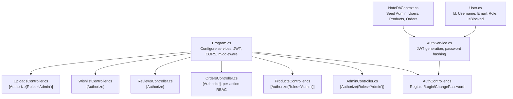
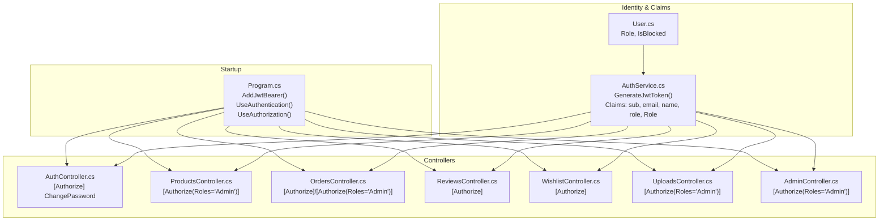
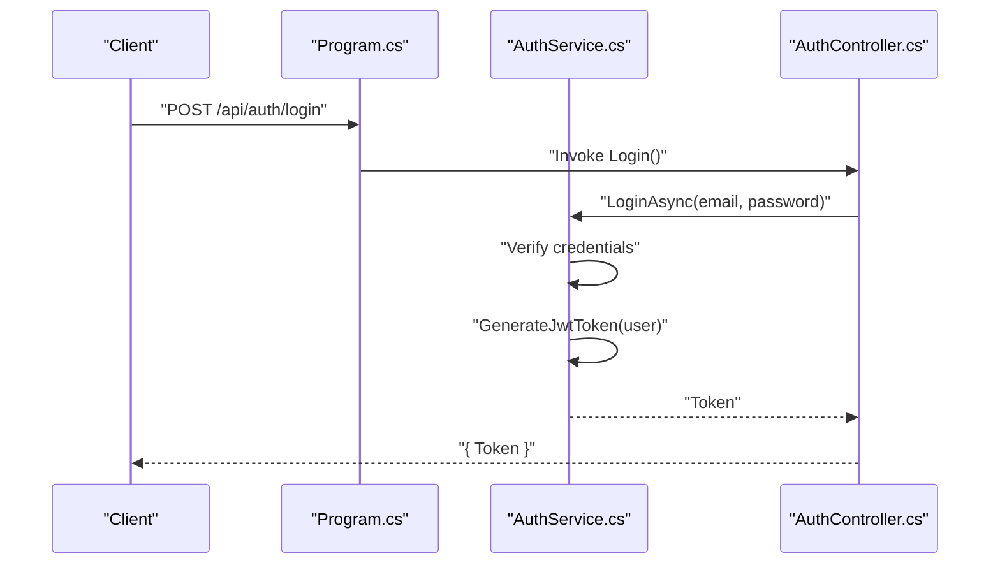
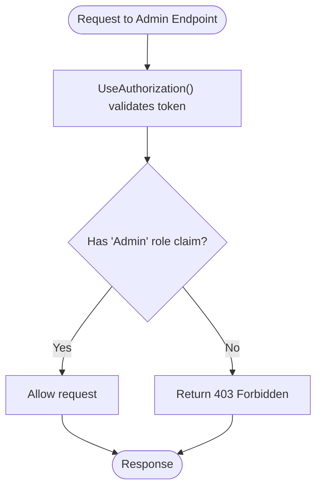
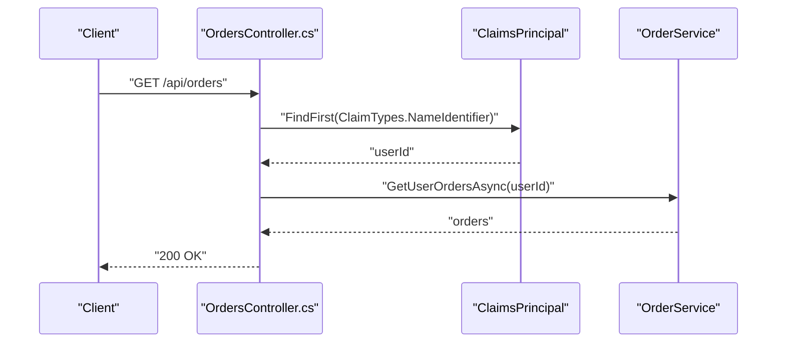
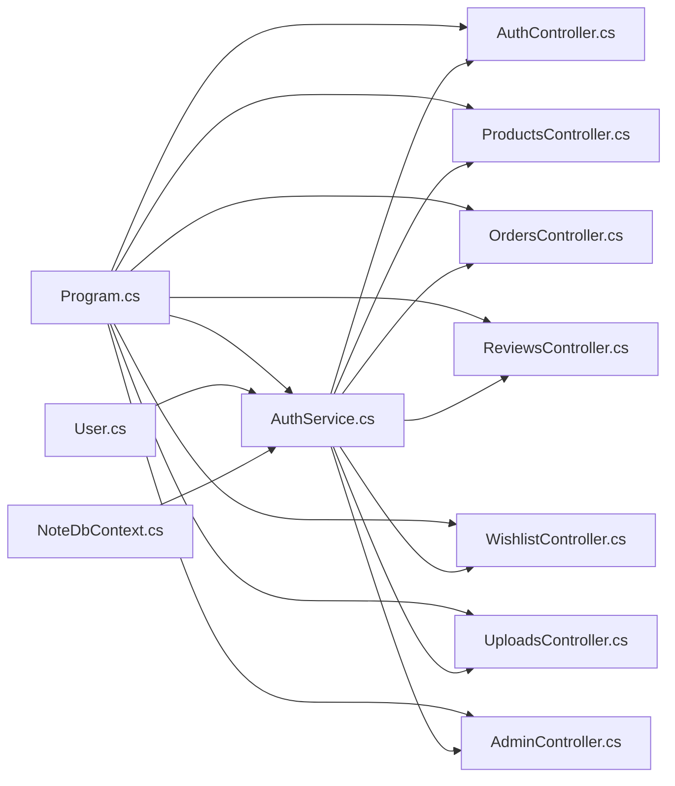

# Authorization Patterns & Security

<cite>
**Referenced Files in This Document**
- [Program.cs](file://Program.cs)
- [appsettings.json](file://appsettings.json)
- [User.cs](file://Models/User.cs)
- [AuthService.cs](file://Services/AuthService.cs)
- [IAuthService.cs](file://Services/IAuthService.cs)
- [AuthController.cs](file://Controllers/AuthController.cs)
- [AdminController.cs](file://Controllers/AdminController.cs)
- [ProductsController.cs](file://Controllers/ProductsController.cs)
- [OrdersController.cs](file://Controllers/OrdersController.cs)
- [ReviewsController.cs](file://Controllers/ReviewsController.cs)
- [WishlistController.cs](file://Controllers/WishlistController.cs)
- [UploadsController.cs](file://Controllers/UploadsController.cs)
- [NoteDbContext.cs](file://Data/NoteDbContext.cs)
</cite>

## Table of Contents
1. [Introduction](#introduction)
2. [Project Structure](#project-structure)
3. [Core Components](#core-components)
4. [Architecture Overview](#architecture-overview)
5. [Detailed Component Analysis](#detailed-component-analysis)
6. [Dependency Analysis](#dependency-analysis)
7. [Performance Considerations](#performance-considerations)
8. [Troubleshooting Guide](#troubleshooting-guide)
9. [Conclusion](#conclusion)

## Introduction
This document explains the authorization patterns and security implementation in the Note.Backend system. It covers role-based access control (RBAC), claim-based authorization, JWT token validation, and middleware configuration. It also documents how the Authorize attribute is used across controllers, how roles are validated, and how permissions are enforced. Practical examples of protected endpoints, role-based restrictions, and integration with ASP.NET Core authorization are included, along with security best practices and considerations for integrating with external authentication systems.

## Project Structure
The authorization model centers around:
- Authentication and JWT configuration in the application startup
- A user model with a Role property
- An authentication service that generates JWT tokens containing claims
- Controllers decorated with Authorize attributes for role-based protection
- Middleware pipeline enabling authentication and authorization

**Diagram sources**
- [Program.cs:69-84](file://Program.cs#L69-L84)
- [AuthController.cs:18-54](file://Controllers/AuthController.cs#L18-L54)
- [AdminController.cs:11](file://Controllers/AdminController.cs#L11)
- [ProductsController.cs:34-58](file://Controllers/ProductsController.cs#L34-L58)
- [OrdersController.cs:11,73,81](file://Controllers/OrdersController.cs#L11,L73,L81)
- [ReviewsController.cs:42](file://Controllers/ReviewsController.cs#L42)
- [WishlistController.cs:12](file://Controllers/WishlistController.cs#L12)
- [UploadsController.cs:9](file://Controllers/UploadsController.cs#L9)
- [AuthService.cs:59-81](file://Services/AuthService.cs#L59-L81)
- [User.cs:9](file://Models/User.cs#L9)
- [NoteDbContext.cs:27-37](file://Data/NoteDbContext.cs#L27-L37)

**Section sources**
- [Program.cs:69-84](file://Program.cs#L69-L84)
- [Program.cs:145-146](file://Program.cs#L145-L146)
- [appsettings.json:6-8](file://appsettings.json#L6-L8)

## Core Components
- JWT configuration and middleware pipeline
  - Authentication scheme configured with symmetric key validation
  - UseAuthentication and UseAuthorization applied in the pipeline
- User model with Role and IsBlocked fields
- Authentication service generating JWT tokens with standard and custom claims
- Controllers enforcing authorization via Authorize attribute and claims extraction

Key implementation references:
- JWT setup and middleware: [Program.cs:69-84](file://Program.cs#L69-L84), [Program.cs:145-146](file://Program.cs#L145-L146)
- User role field: [User.cs:9](file://Models/User.cs#L9)
- JWT token generation: [AuthService.cs:59-81](file://Services/AuthService.cs#L59-L81)
- Claims used in tokens: [AuthService.cs:64-71](file://Services/AuthService.cs#L64-L71)
- Authorization attribute usage across controllers: [AuthController.cs:40](file://Controllers/AuthController.cs#L40), [ProductsController.cs:34](file://Controllers/ProductsController.cs#L34), [ProductsController.cs:42](file://Controllers/ProductsController.cs#L42), [ProductsController.cs:51](file://Controllers/ProductsController.cs#L51), [OrdersController.cs:11](file://Controllers/OrdersController.cs#L11), [OrdersController.cs:73](file://Controllers/OrdersController.cs#L73), [OrdersController.cs:81](file://Controllers/OrdersController.cs#L81), [ReviewsController.cs:42](file://Controllers/ReviewsController.cs#L42), [WishlistController.cs:12](file://Controllers/WishlistController.cs#L12), [UploadsController.cs:9](file://Controllers/UploadsController.cs#L9), [AdminController.cs:11](file://Controllers/AdminController.cs#L11)

**Section sources**
- [Program.cs:69-84](file://Program.cs#L69-L84)
- [Program.cs:145-146](file://Program.cs#L145-L146)
- [User.cs:9](file://Models/User.cs#L9)
- [AuthService.cs:59-81](file://Services/AuthService.cs#L59-L81)
- [AuthController.cs:40](file://Controllers/AuthController.cs#L40)
- [ProductsController.cs:34-58](file://Controllers/ProductsController.cs#L34-L58)
- [OrdersController.cs:11,73,81](file://Controllers/OrdersController.cs#L11,L73,L81)
- [ReviewsController.cs:42](file://Controllers/ReviewsController.cs#L42)
- [WishlistController.cs:12](file://Controllers/WishlistController.cs#L12)
- [UploadsController.cs:9](file://Controllers/UploadsController.cs#L9)
- [AdminController.cs:11](file://Controllers/AdminController.cs#L11)

## Architecture Overview
The authorization architecture follows ASP.NET Core conventions:
- Startup configures JWT bearer authentication with symmetric key validation
- Middleware pipeline enforces authentication and authorization
- Controllers apply Authorize attribute at class or method level
- Services and repositories enforce business rules and data access

**Diagram sources**
- [Program.cs:69-84](file://Program.cs#L69-L84)
- [Program.cs:145-146](file://Program.cs#L145-L146)
- [User.cs:9](file://Models/User.cs#L9)
- [AuthService.cs:59-81](file://Services/AuthService.cs#L59-L81)
- [AuthController.cs:40](file://Controllers/AuthController.cs#L40)
- [ProductsController.cs:34-58](file://Controllers/ProductsController.cs#L34-L58)
- [OrdersController.cs:11,73,81](file://Controllers/OrdersController.cs#L11,L73,L81)
- [ReviewsController.cs:42](file://Controllers/ReviewsController.cs#L42)
- [WishlistController.cs:12](file://Controllers/WishlistController.cs#L12)
- [UploadsController.cs:9](file://Controllers/UploadsController.cs#L9)
- [AdminController.cs:11](file://Controllers/AdminController.cs#L11)

## Detailed Component Analysis

### JWT Authentication and Middleware Pipeline
- Symmetric key validation is enabled; issuer/audience are configurable
- Authentication and authorization middleware are registered in the pipeline
- CORS policy allows any origin, header, and method (temporary for development)

**Diagram sources**
- [Program.cs:69-84](file://Program.cs#L69-L84)
- [Program.cs:145-146](file://Program.cs#L145-L146)
- [AuthService.cs:43-57](file://Services/AuthService.cs#L43-L57)
- [AuthService.cs:59-81](file://Services/AuthService.cs#L59-L81)
- [AuthController.cs:29-38](file://Controllers/AuthController.cs#L29-L38)

**Section sources**
- [Program.cs:69-84](file://Program.cs#L69-L84)
- [Program.cs:145-146](file://Program.cs#L145-L146)
- [AuthService.cs:43-57](file://Services/AuthService.cs#L43-L57)
- [AuthService.cs:59-81](file://Services/AuthService.cs#L59-L81)
- [AuthController.cs:29-38](file://Controllers/AuthController.cs#L29-L38)

### Role-Based Access Control (RBAC)
- Roles are stored on the User entity and included as claims in JWT tokens
- Controllers restrict access using [Authorize(Roles="Admin")] at class or method level
- Admin-only endpoints include product management, order administration, expense management, and uploads

**Diagram sources**
- [Program.cs:145-146](file://Program.cs#L145-L146)
- [AuthService.cs:64-71](file://Services/AuthService.cs#L64-L71)
- [ProductsController.cs:34-58](file://Controllers/ProductsController.cs#L34-L58)
- [OrdersController.cs:73,81](file://Controllers/OrdersController.cs#L73,L81)
- [UploadsController.cs:9](file://Controllers/UploadsController.cs#L9)
- [AdminController.cs:11](file://Controllers/AdminController.cs#L11)

**Section sources**
- [User.cs:9](file://Models/User.cs#L9)
- [AuthService.cs:64-71](file://Services/AuthService.cs#L64-L71)
- [ProductsController.cs:34-58](file://Controllers/ProductsController.cs#L34-L58)
- [OrdersController.cs:73,81](file://Controllers/OrdersController.cs#L73,L81)
- [UploadsController.cs:9](file://Controllers/UploadsController.cs#L9)
- [AdminController.cs:11](file://Controllers/AdminController.cs#L11)

### Claim-Based Authorization and Per-Action Controls
- Controllers that require authentication but not admin privileges use [Authorize] at the class level
- Within those controllers, actions extract the authenticated user ID from claims to enforce ownership or eligibility
- Examples include retrieving orders, managing wishlist, and submitting reviews

**Diagram sources**
- [OrdersController.cs:21-29](file://Controllers/OrdersController.cs#L21-L29)
- [OrdersController.cs:94-106](file://Controllers/OrdersController.cs#L94-L106)
- [ReviewsController.cs:41-71](file://Controllers/ReviewsController.cs#L41-L71)
- [WishlistController.cs:22-35](file://Controllers/WishlistController.cs#L22-L35)

**Section sources**
- [OrdersController.cs:11,21-29,94-106](file://Controllers/OrdersController.cs#L11,L21-L29,L94-L106)
- [ReviewsController.cs:41-71](file://Controllers/ReviewsController.cs#L41-L71)
- [WishlistController.cs:12,22-35](file://Controllers/WishlistController.cs#L12,L22-L35)

### Protected Endpoints and Role Restrictions
- Public endpoints: register, login
- Authenticated user endpoints: change-password, orders, reviews, wishlist
- Admin-only endpoints: products CRUD, orders/all, order status update, expenses CRUD, uploads

Examples by controller:
- AuthController: [AuthController.cs:18-27](file://Controllers/AuthController.cs#L18-L27), [AuthController.cs:29-38](file://Controllers/AuthController.cs#L29-L38), [AuthController.cs:40-54](file://Controllers/AuthController.cs#L40-L54)
- ProductsController: [ProductsController.cs:34-58](file://Controllers/ProductsController.cs#L34-L58)
- OrdersController: [OrdersController.cs:11,73,81](file://Controllers/OrdersController.cs#L11,L73,L81)
- ReviewsController: [ReviewsController.cs:41-71](file://Controllers/ReviewsController.cs#L41-L71)
- WishlistController: [WishlistController.cs:22-80](file://Controllers/WishlistController.cs#L22-L80)
- UploadsController: [UploadsController.cs:23-78](file://Controllers/UploadsController.cs#L23-L78)
- AdminController: [AdminController.cs:21-260](file://Controllers/AdminController.cs#L21-L260)

**Section sources**
- [AuthController.cs:18-54](file://Controllers/AuthController.cs#L18-L54)
- [ProductsController.cs:34-58](file://Controllers/ProductsController.cs#L34-L58)
- [OrdersController.cs:11,73,81](file://Controllers/OrdersController.cs#L11,L73,L81)
- [ReviewsController.cs:41-71](file://Controllers/ReviewsController.cs#L41-L71)
- [WishlistController.cs:22-80](file://Controllers/WishlistController.cs#L22-L80)
- [UploadsController.cs:23-78](file://Controllers/UploadsController.cs#L23-L78)
- [AdminController.cs:21-260](file://Controllers/AdminController.cs#L21-L260)

### JWT Token Validation and Security Headers
- Token validation uses a symmetric key derived from configuration
- Issuer and audience are configurable; currently disabled validation in the setup
- Tokens include standard claims and a custom "Role" claim for convenience

References:
- [Program.cs:69-84](file://Program.cs#L69-L84)
- [appsettings.json:6-8](file://appsettings.json#L6-L8)
- [AuthService.cs:59-81](file://Services/AuthService.cs#L59-L81)
- [AuthService.cs:64-71](file://Services/AuthService.cs#L64-L71)

**Section sources**
- [Program.cs:69-84](file://Program.cs#L69-L84)
- [appsettings.json:6-8](file://appsettings.json#L6-L8)
- [AuthService.cs:59-81](file://Services/AuthService.cs#L59-L81)
- [AuthService.cs:64-71](file://Services/AuthService.cs#L64-L71)

### Integration with ASP.NET Core Authorization
- UseAuthentication and UseAuthorization are called in the pipeline
- Authorize attribute supports roles and policy-based checks
- Claims are extracted from the authenticated principal for per-request authorization decisions

References:
- [Program.cs:145-146](file://Program.cs#L145-L146)
- [AuthController.cs:40](file://Controllers/AuthController.cs#L40)
- [OrdersController.cs:24,96](file://Controllers/OrdersController.cs#L24,L96)
- [ReviewsController.cs:45](file://Controllers/ReviewsController.cs#L45)
- [WishlistController.cs:25,40,69](file://Controllers/WishlistController.cs#L25,L40,L69)

**Section sources**
- [Program.cs:145-146](file://Program.cs#L145-L146)
- [AuthController.cs:40](file://Controllers/AuthController.cs#L40)
- [OrdersController.cs:24,96](file://Controllers/OrdersController.cs#L24,L96)
- [ReviewsController.cs:45](file://Controllers/ReviewsController.cs#L45)
- [WishlistController.cs:25,40,69](file://Controllers/WishlistController.cs#L25,L40,L69)

### Practical Examples
- Login endpoint returns a signed JWT token for subsequent authenticated requests
- Change password requires a valid token and operates on the authenticated user ID
- Admin-only endpoints restrict access to users with the "Admin" role
- Ownership checks ensure users can only access their own orders, wishlist, and reviews

References:
- [AuthController.cs:29-38](file://Controllers/AuthController.cs#L29-L38)
- [AuthController.cs:40-54](file://Controllers/AuthController.cs#L40-L54)
- [ProductsController.cs:34-58](file://Controllers/ProductsController.cs#L34-L58)
- [OrdersController.cs:21-29,73,81,94-106](file://Controllers/OrdersController.cs#L21-L29,L73,L81,L94-L106)
- [ReviewsController.cs:41-71](file://Controllers/ReviewsController.cs#L41-L71)
- [WishlistController.cs:22-80](file://Controllers/WishlistController.cs#L22-L80)

**Section sources**
- [AuthController.cs:29-54](file://Controllers/AuthController.cs#L29-L54)
- [ProductsController.cs:34-58](file://Controllers/ProductsController.cs#L34-L58)
- [OrdersController.cs:21-29,73,81,94-106](file://Controllers/OrdersController.cs#L21-L29,L73,L81,L94-L106)
- [ReviewsController.cs:41-71](file://Controllers/ReviewsController.cs#L41-L71)
- [WishlistController.cs:22-80](file://Controllers/WishlistController.cs#L22-L80)

## Dependency Analysis
The authorization model depends on:
- JWT configuration and middleware pipeline
- User model and seeded Admin user
- Authentication service for token generation and validation
- Controllers applying authorization attributes and extracting claims

**Diagram sources**
- [Program.cs:69-84](file://Program.cs#L69-L84)
- [Program.cs:145-146](file://Program.cs#L145-L146)
- [AuthService.cs:59-81](file://Services/AuthService.cs#L59-L81)
- [AuthController.cs:40](file://Controllers/AuthController.cs#L40)
- [ProductsController.cs:34-58](file://Controllers/ProductsController.cs#L34-L58)
- [OrdersController.cs:11,73,81](file://Controllers/OrdersController.cs#L11,L73,L81)
- [ReviewsController.cs:42](file://Controllers/ReviewsController.cs#L42)
- [WishlistController.cs:12](file://Controllers/WishlistController.cs#L12)
- [UploadsController.cs:9](file://Controllers/UploadsController.cs#L9)
- [AdminController.cs:11](file://Controllers/AdminController.cs#L11)
- [User.cs:9](file://Models/User.cs#L9)
- [NoteDbContext.cs:27-37](file://Data/NoteDbContext.cs#L27-L37)

**Section sources**
- [Program.cs:69-84](file://Program.cs#L69-L84)
- [Program.cs:145-146](file://Program.cs#L145-L146)
- [AuthService.cs:59-81](file://Services/AuthService.cs#L59-L81)
- [AuthController.cs:40](file://Controllers/AuthController.cs#L40)
- [ProductsController.cs:34-58](file://Controllers/ProductsController.cs#L34-L58)
- [OrdersController.cs:11,73,81](file://Controllers/OrdersController.cs#L11,L73,L81)
- [ReviewsController.cs:42](file://Controllers/ReviewsController.cs#L42)
- [WishlistController.cs:12](file://Controllers/WishlistController.cs#L12)
- [UploadsController.cs:9](file://Controllers/UploadsController.cs#L9)
- [AdminController.cs:11](file://Controllers/AdminController.cs#L11)
- [User.cs:9](file://Models/User.cs#L9)
- [NoteDbContext.cs:27-37](file://Data/NoteDbContext.cs#L27-L37)

## Performance Considerations
- Token validation occurs on every request; keep the number of claims minimal
- Prefer short-lived tokens and refresh token mechanisms for long sessions
- Avoid heavy computations inside authorization filters; cache role/permission checks when appropriate
- Use asynchronous database calls in authorization-dependent actions to prevent blocking

[No sources needed since this section provides general guidance]

## Troubleshooting Guide
Common authorization issues and resolutions:
- 401 Unauthorized on authenticated endpoints
  - Ensure the client sends the Authorization header with a valid JWT token
  - Verify the token was issued by the same key and is not expired
  - References: [Program.cs:69-84](file://Program.cs#L69-L84), [AuthService.cs:59-81](file://Services/AuthService.cs#L59-L81)
- 403 Forbidden on admin endpoints
  - Confirm the user’s Role claim is "Admin"
  - Verify the token includes the role claim
  - References: [AuthService.cs:64-71](file://Services/AuthService.cs#L64-L71), [ProductsController.cs:34-58](file://Controllers/ProductsController.cs#L34-L58), [OrdersController.cs:73,81](file://Controllers/OrdersController.cs#L73,L81), [UploadsController.cs:9](file://Controllers/UploadsController.cs#L9), [AdminController.cs:11](file://Controllers/AdminController.cs#L11)
- Ownership validation failures
  - Ensure the authenticated user ID matches the resource owner
  - References: [OrdersController.cs:24,96](file://Controllers/OrdersController.cs#L24,L96), [ReviewsController.cs:45](file://Controllers/ReviewsController.cs#L45), [WishlistController.cs:25,40,69](file://Controllers/WishlistController.cs#L25,L40,L69)
- CORS preventing frontend requests
  - The CORS policy allows any origin, header, and method (development setting)
  - References: [Program.cs:87-96](file://Program.cs#L87-L96)

**Section sources**
- [Program.cs:69-84](file://Program.cs#L69-L84)
- [AuthService.cs:59-81](file://Services/AuthService.cs#L59-L81)
- [AuthService.cs:64-71](file://Services/AuthService.cs#L64-L71)
- [ProductsController.cs:34-58](file://Controllers/ProductsController.cs#L34-L58)
- [OrdersController.cs:24,73,81,96](file://Controllers/OrdersController.cs#L24,L73,L81,L96)
- [UploadsController.cs:9](file://Controllers/UploadsController.cs#L9)
- [AdminController.cs:11](file://Controllers/AdminController.cs#L11)
- [ReviewsController.cs:45](file://Controllers/ReviewsController.cs#L45)
- [WishlistController.cs:25,40,69](file://Controllers/WishlistController.cs#L25,L40,L69)
- [Program.cs:87-96](file://Program.cs#L87-L96)

## Conclusion
The Note.Backend system implements a clear, layered authorization model:
- JWT bearer authentication with symmetric key validation
- Role-based access control enforced via Authorize attributes
- Claim-based authorization for ownership and per-action controls
- A robust middleware pipeline ensuring authentication precedes authorization

Best practices observed:
- Centralized token generation in the authentication service
- Role claims embedded in tokens for efficient authorization checks
- Mixed authorization patterns: global [Authorize] plus role-specific restrictions

Recommendations for production:
- Use HTTPS in production to protect tokens and headers
- Rotate JWT keys regularly and configure issuer/audience validation
- Implement fine-grained permissions and custom authorization policies
- Add rate limiting and audit logs for sensitive endpoints

[No sources needed since this section summarizes without analyzing specific files]