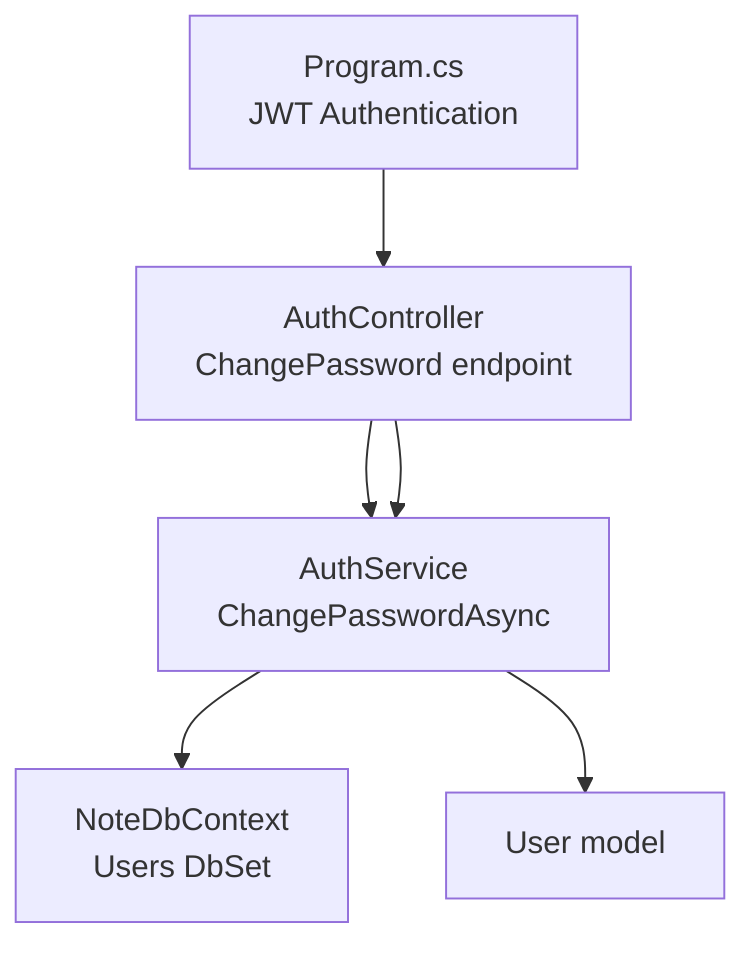
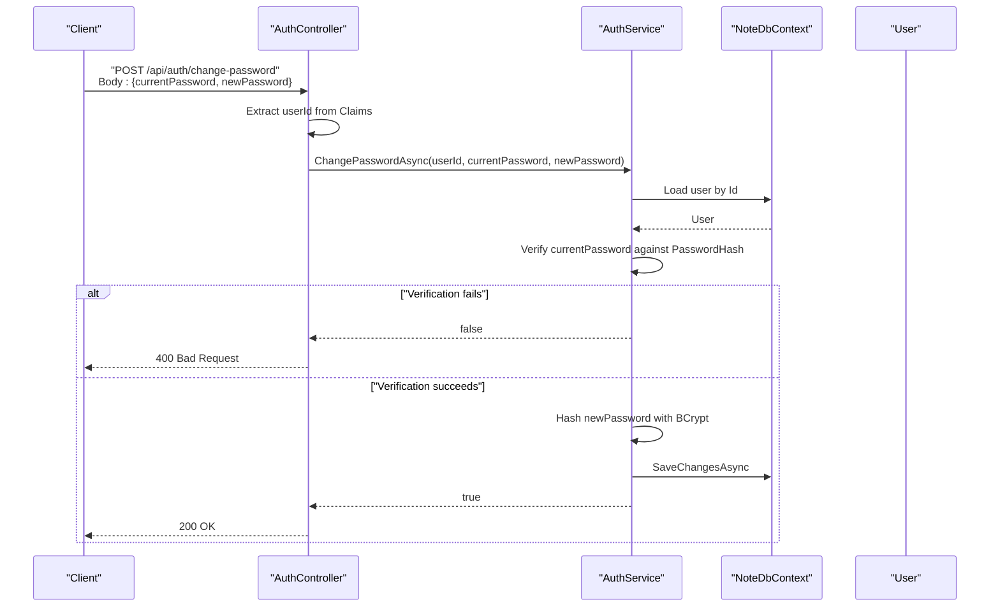
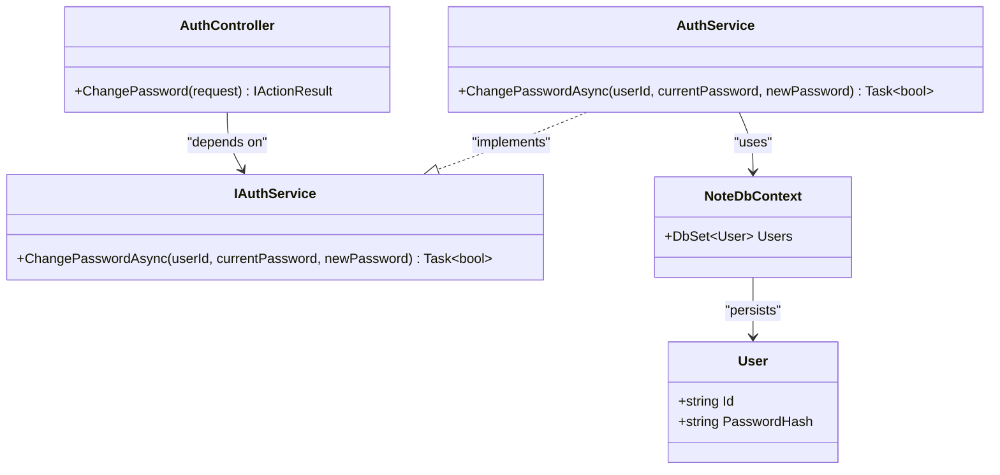

# Password Management

<cite>
**Referenced Files in This Document**
- [AuthController.cs](file://Controllers/AuthController.cs)
- [AuthService.cs](file://Services/AuthService.cs)
- [IAuthService.cs](file://Services/IAuthService.cs)
- [User.cs](file://Models/User.cs)
- [NoteDbContext.cs](file://Data/NoteDbContext.cs)
- [Program.cs](file://Program.cs)
- [appsettings.json](file://appsettings.json)
</cite>

## Table of Contents
1. [Introduction](#introduction)
2. [Project Structure](#project-structure)
3. [Core Components](#core-components)
4. [Architecture Overview](#architecture-overview)
5. [Detailed Component Analysis](#detailed-component-analysis)
6. [Dependency Analysis](#dependency-analysis)
7. [Performance Considerations](#performance-considerations)
8. [Troubleshooting Guide](#troubleshooting-guide)
9. [Conclusion](#conclusion)
10. [Appendices](#appendices)

## Introduction
This document explains the password management system, focusing on the password change functionality and associated security practices. It covers the ChangePasswordRequest DTO, current password verification, new password hashing, and integration with the authorization system. It also documents the BCrypt password hashing implementation, security considerations, and practical examples of password change requests, validation errors, and best practices for secure password handling.

## Project Structure
The password management system spans the controller, service, model, and data layers:
- Controller handles HTTP requests and integrates with the authorization system.
- Service encapsulates business logic for password change, verification, and hashing.
- Model defines the user entity and its properties.
- Data layer persists user records and seeds initial data.
- Application startup configures JWT authentication and authorization.

**Diagram sources**
- [AuthController.cs:40-54](file://Controllers/AuthController.cs#L40-L54)
- [AuthService.cs:83-96](file://Services/AuthService.cs#L83-L96)
- [NoteDbContext.cs:14](file://Data/NoteDbContext.cs#L14)
- [User.cs:3-11](file://Models/User.cs#L3-L11)
- [Program.cs:73-84](file://Program.cs#L73-L84)

**Section sources**
- [AuthController.cs:1-76](file://Controllers/AuthController.cs#L1-L76)
- [AuthService.cs:1-98](file://Services/AuthService.cs#L1-L98)
- [User.cs:1-12](file://Models/User.cs#L1-L12)
- [NoteDbContext.cs:1-67](file://Data/NoteDbContext.cs#L1-L67)
- [Program.cs:1-102](file://Program.cs#L1-L102)

## Core Components
- ChangePasswordRequest DTO: Defines the payload for changing a password, including the current and new passwords.
- AuthService.ChangePasswordAsync: Verifies the current password against the stored hash and updates the new password after hashing.
- AuthController.ChangePassword: Validates the authenticated user identity and delegates to the service.
- User model: Stores the hashed password and user identity attributes.
- JWT Authorization: Ensures only authenticated users can change their password.

Key implementation references:
- ChangePasswordRequest definition: [ChangePasswordRequest:57-61](file://Controllers/AuthController.cs#L57-L61)
- Controller action: [ChangePassword:40-54](file://Controllers/AuthController.cs#L40-L54)
- Service method: [ChangePasswordAsync:83-96](file://Services/AuthService.cs#L83-L96)
- User model: [User:3-11](file://Models/User.cs#L3-L11)

**Section sources**
- [AuthController.cs:40-61](file://Controllers/AuthController.cs#L40-L61)
- [AuthService.cs:83-96](file://Services/AuthService.cs#L83-L96)
- [User.cs:3-11](file://Models/User.cs#L3-L11)

## Architecture Overview
The password change flow integrates HTTP authorization, controller validation, and service-level verification and persistence.

**Diagram sources**
- [AuthController.cs:40-54](file://Controllers/AuthController.cs#L40-L54)
- [AuthService.cs:83-96](file://Services/AuthService.cs#L83-L96)
- [NoteDbContext.cs:14](file://Data/NoteDbContext.cs#L14)
- [User.cs:3-11](file://Models/User.cs#L3-L11)

## Detailed Component Analysis

### ChangePasswordRequest DTO
- Purpose: Encapsulates the request payload for changing a password.
- Fields:
  - CurrentPassword: String representing the user’s existing password.
  - NewPassword: String representing the desired new password.
- Usage: Received by the ChangePassword endpoint and passed to the service.

Implementation references:
- [ChangePasswordRequest:57-61](file://Controllers/AuthController.cs#L57-L61)

**Section sources**
- [AuthController.cs:57-61](file://Controllers/AuthController.cs#L57-L61)

### AuthController.ChangePassword
- Authorization: Requires an authenticated user via the Authorize attribute.
- Identity extraction: Retrieves the user identifier from the NameIdentifier claim.
- Validation: Returns 401 Unauthorized if the user identifier is missing.
- Delegation: Calls the service method to change the password.
- Responses:
  - 200 OK on success with a success message.
  - 400 Bad Request on failure with a descriptive message indicating the current password may be incorrect.

Implementation references:
- [ChangePassword:40-54](file://Controllers/AuthController.cs#L40-L54)

**Section sources**
- [AuthController.cs:40-54](file://Controllers/AuthController.cs#L40-L54)

### AuthService.ChangePasswordAsync
- User lookup: Loads the user by the provided identifier.
- Verification: Uses BCrypt to verify the current password against the stored hash.
- Update: Replaces the stored hash with a newly hashed new password.
- Persistence: Saves changes to the database.
- Return values:
  - true on successful update.
  - false when the user does not exist or the current password verification fails.

Implementation references:
- [ChangePasswordAsync:83-96](file://Services/AuthService.cs#L83-L96)

**Section sources**
- [AuthService.cs:83-96](file://Services/AuthService.cs#L83-L96)

### User Model
- Properties relevant to password management:
  - Id: Unique identifier used by the controller to target the correct user.
  - PasswordHash: Stores the BCrypt-hashed password.
  - Role and IsBlocked: Part of the broader user profile; IsBlocked is checked during login but not during password change.
- Seeding: The data context seeds an admin user with a pre-hashed password for demonstration.

Implementation references:
- [User:3-11](file://Models/User.cs#L3-L11)
- [Seed Admin user:27-37](file://Data/NoteDbContext.cs#L27-L37)

**Section sources**
- [User.cs:3-11](file://Models/User.cs#L3-L11)
- [NoteDbContext.cs:27-37](file://Data/NoteDbContext.cs#L27-L37)

### Authorization and JWT Integration
- Authentication scheme: JWT Bearer tokens configured in Program.cs.
- Validation parameters: Enforce issuer signing key validation.
- Controller integration: The Authorize attribute ensures only authenticated users can call ChangePassword.
- Token claims: The token includes user identity and role, enabling downstream authorization checks.

Implementation references:
- [JWT configuration:73-84](file://Program.cs#L73-84)
- [Authorize attribute usage](file://Controllers/AuthController.cs#L40)
- [Token generation:59-81](file://Services/AuthService.cs#L59-L81)

**Section sources**
- [Program.cs:73-84](file://Program.cs#L73-L84)
- [AuthController.cs:40](file://Controllers/AuthController.cs#L40)
- [AuthService.cs:59-81](file://Services/AuthService.cs#L59-L81)

### BCrypt Password Hashing Implementation
- Registration: Passwords are hashed using BCrypt during registration.
- Login: The provided password is verified against the stored hash.
- Change password: The new password is hashed using BCrypt before storage.
- Library: BCrypt.Net-Next package is referenced in the project.

Implementation references:
- [Register hashing](file://Services/AuthService.cs#L33)
- [Login verification](file://Services/AuthService.cs#L46)
- [Change password hashing](file://Services/AuthService.cs#L93)
- [Project dependencies](file://Note.Backend.csproj#L10)

**Section sources**
- [AuthService.cs:33](file://Services/AuthService.cs#L33)
- [AuthService.cs:46](file://Services/AuthService.cs#L46)
- [AuthService.cs:93](file://Services/AuthService.cs#L93)
- [Note.Backend.csproj:10](file://Note.Backend.csproj#L10)

### Password Strength Policies
- Current implementation: No explicit client-side or server-side password strength validation is enforced in the change flow.
- Recommendations: Consider adding server-side validation for minimum length, character variety, and common password checks to align with security best practices.

[No sources needed since this section provides general guidance]

### Practical Examples

#### Successful Password Change
- Request: POST to /api/auth/change-password with body containing currentPassword and newPassword.
- Controller behavior: Extracts userId from claims, calls service.
- Service behavior: Verifies current password, hashes new password, saves changes.
- Response: 200 OK with success message.

References:
- [ChangePassword:40-54](file://Controllers/AuthController.cs#L40-L54)
- [ChangePasswordAsync:83-96](file://Services/AuthService.cs#L83-L96)

#### Failed Password Change (Incorrect Current Password)
- Request: Same as above.
- Controller behavior: Calls service.
- Service behavior: Fails verification; returns false.
- Response: 400 Bad Request with message indicating the current password may be incorrect.

References:
- [ChangePassword:40-54](file://Controllers/AuthController.cs#L40-L54)
- [ChangePasswordAsync:83-96](file://Services/AuthService.cs#L83-L96)

#### Unauthorized Access Attempt
- Request: POST to /api/auth/change-password without a valid JWT.
- Controller behavior: Fails to extract userId; returns 401 Unauthorized.

References:
- [ChangePassword:40-54](file://Controllers/AuthController.cs#L40-L54)

### Security Considerations
- BCrypt usage: Consistent hashing and verification ensure secure password storage and verification.
- JWT scope: The endpoint requires authentication; ensure clients handle tokens securely and refresh tokens appropriately.
- Error messages: Avoid leaking sensitive details in error responses; the current message is generic and acceptable.
- Input sanitization: While not strictly required for password hashing, consider validating input lengths and rejecting overly long values to prevent resource exhaustion.

[No sources needed since this section provides general guidance]

## Dependency Analysis
The password change flow depends on the controller-service-model-data context and JWT configuration.

**Diagram sources**
- [AuthController.cs:40-54](file://Controllers/AuthController.cs#L40-L54)
- [IAuthService.cs:5-10](file://Services/IAuthService.cs#L5-L10)
- [AuthService.cs:83-96](file://Services/AuthService.cs#L83-L96)
- [User.cs:3-11](file://Models/User.cs#L3-L11)
- [NoteDbContext.cs:14](file://Data/NoteDbContext.cs#L14)

**Section sources**
- [AuthController.cs:40-54](file://Controllers/AuthController.cs#L40-L54)
- [IAuthService.cs:5-10](file://Services/IAuthService.cs#L5-L10)
- [AuthService.cs:83-96](file://Services/AuthService.cs#L83-L96)
- [User.cs:3-11](file://Models/User.cs#L3-L11)
- [NoteDbContext.cs:14](file://Data/NoteDbContext.cs#L14)

## Performance Considerations
- BCrypt cost factor: The library manages the cost factor internally; hashing is intentionally computationally expensive to deter brute-force attacks.
- Database round-trips: The change operation performs a single read and a single write, minimizing overhead.
- Token validation: JWT validation occurs at the framework level; ensure keys are strong and rotated periodically.

[No sources needed since this section provides general guidance]

## Troubleshooting Guide
Common issues and resolutions:
- 401 Unauthorized on password change:
  - Cause: Missing or invalid JWT token.
  - Resolution: Ensure the client includes a valid bearer token in the Authorization header.
  - References: [ChangePassword:40-54](file://Controllers/AuthController.cs#L40-L54), [JWT configuration:73-84](file://Program.cs#L73-84)

- 400 Bad Request on password change:
  - Cause: Current password verification failed.
  - Resolution: Confirm the current password matches the stored hash; ensure no typos.
  - References: [ChangePassword:40-54](file://Controllers/AuthController.cs#L40-L54), [ChangePasswordAsync:83-96](file://Services/AuthService.cs#L83-L96)

- Database connectivity errors:
  - Cause: Incorrect connection string or database unavailability.
  - Resolution: Verify the connection string in configuration and network settings.
  - References: [Program.cs:25-36](file://Program.cs#L25-L36), [appsettings.json:2-4](file://appsettings.json#L2-L4)

- JWT key misconfiguration:
  - Cause: Mismatched signing key or missing key.
  - Resolution: Ensure the Jwt:Key setting matches the issuer configuration.
  - References: [Program.cs:70-84](file://Program.cs#L70-L84), [appsettings.json:6-8](file://appsettings.json#L6-L8)

**Section sources**
- [AuthController.cs:40-54](file://Controllers/AuthController.cs#L40-L54)
- [AuthService.cs:83-96](file://Services/AuthService.cs#L83-L96)
- [Program.cs:25-36](file://Program.cs#L25-L36)
- [Program.cs:70-84](file://Program.cs#L70-L84)
- [appsettings.json:2-8](file://appsettings.json#L2-L8)

## Conclusion
The password management system implements secure password change functionality using BCrypt for hashing and verification, integrated with JWT-based authorization. The ChangePasswordRequest DTO provides a clean contract for the change operation, while the controller enforces authentication and delegates business logic to the service. The current implementation focuses on correctness and security; future enhancements could include explicit password strength validation and improved error handling for varied failure modes.

[No sources needed since this section summarizes without analyzing specific files]

## Appendices

### API Definition: Change Password
- Endpoint: POST /api/auth/change-password
- Authentication: Required (Authorization: Bearer <token>)
- Request body: ChangePasswordRequest
  - currentPassword: string
  - newPassword: string
- Responses:
  - 200 OK: Success message
  - 400 Bad Request: Failure message indicating current password may be incorrect
  - 401 Unauthorized: Missing or invalid token

References:
- [ChangePassword:40-54](file://Controllers/AuthController.cs#L40-L54)
- [ChangePasswordRequest:57-61](file://Controllers/AuthController.cs#L57-L61)

### Security Best Practices Checklist
- Enforce strong password policies (length, character variety, uniqueness).
- Log and monitor failed password change attempts.
- Rotate JWT signing keys periodically.
- Use HTTPS in production to protect tokens and payloads.
- Avoid exposing sensitive details in error messages.

[No sources needed since this section provides general guidance]