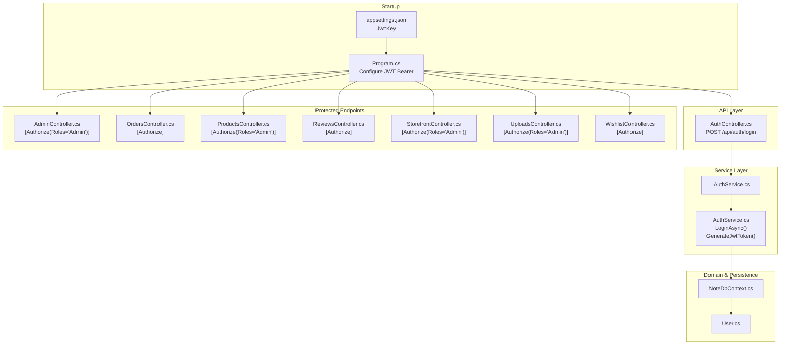
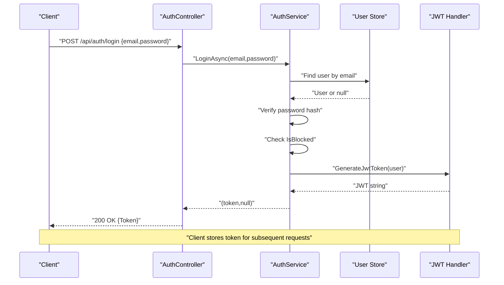
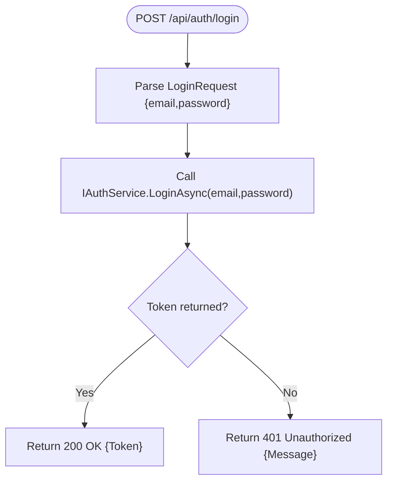
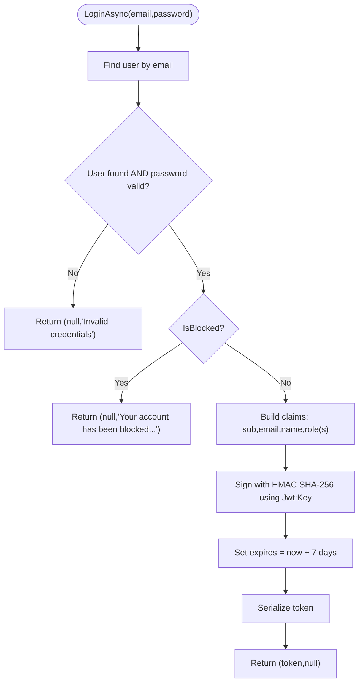
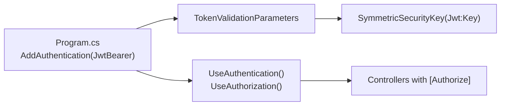
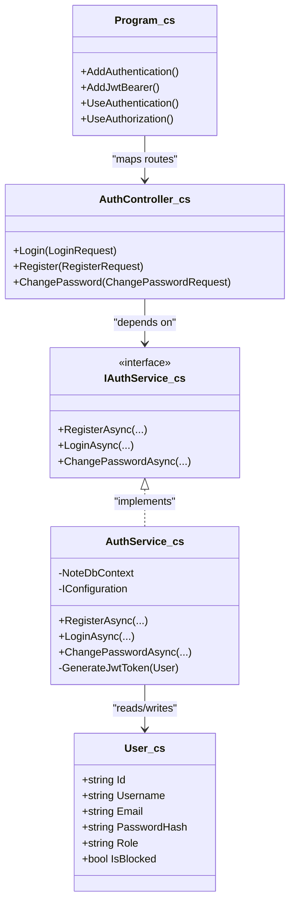

# User Login & JWT Authentication

<cite>
**Referenced Files in This Document**
- [Program.cs](file://Program.cs)
- [appsettings.json](file://appsettings.json)
- [AuthController.cs](file://Controllers/AuthController.cs)
- [IAuthService.cs](file://Services/IAuthService.cs)
- [AuthService.cs](file://Services/AuthService.cs)
- [User.cs](file://Models/User.cs)
- [NoteDbContext.cs](file://Data/NoteDbContext.cs)
- [AdminController.cs](file://Controllers/AdminController.cs)
- [OrdersController.cs](file://Controllers/OrdersController.cs)
- [ProductsController.cs](file://Controllers/ProductsController.cs)
- [ReviewsController.cs](file://Controllers/ReviewsController.cs)
- [StorefrontController.cs](file://Controllers/StorefrontController.cs)
- [UploadsController.cs](file://Controllers/UploadsController.cs)
- [WishlistController.cs](file://Controllers/WishlistController.cs)
</cite>

## Table of Contents
1. [Introduction](#introduction)
2. [Project Structure](#project-structure)
3. [Core Components](#core-components)
4. [Architecture Overview](#architecture-overview)
5. [Detailed Component Analysis](#detailed-component-analysis)
6. [Dependency Analysis](#dependency-analysis)
7. [Performance Considerations](#performance-considerations)
8. [Troubleshooting Guide](#troubleshooting-guide)
9. [Conclusion](#conclusion)
10. [Appendices](#appendices)

## Introduction
This document explains the user login and JWT authentication system implemented in the backend. It covers the login flow, credential validation, JWT token generation and structure, the LoginRequest DTO, authentication middleware integration, and token-based authorization patterns. It also documents token claims, expiration handling, security best practices, and how to integrate tokens with protected endpoints.

## Project Structure
The authentication system spans several layers:
- Startup and middleware configuration for JWT bearer authentication
- A dedicated controller for authentication operations
- An authentication service implementing registration, login, and password change
- A user model and persistence via Entity Framework
- Protected endpoints using role-based authorization

**Diagram sources**
- [Program.cs](file://Program.cs)
- [appsettings.json](file://appsettings.json)
- [AuthController.cs](file://Controllers/AuthController.cs)
- [IAuthService.cs](file://Services/IAuthService.cs)
- [AuthService.cs](file://Services/AuthService.cs)
- [User.cs](file://Models/User.cs)
- [NoteDbContext.cs](file://Data/NoteDbContext.cs)
- [AdminController.cs](file://Controllers/AdminController.cs)
- [OrdersController.cs](file://Controllers/OrdersController.cs)
- [ProductsController.cs](file://Controllers/ProductsController.cs)
- [ReviewsController.cs](file://Controllers/ReviewsController.cs)
- [StorefrontController.cs](file://Controllers/StorefrontController.cs)
- [UploadsController.cs](file://Controllers/UploadsController.cs)
- [WishlistController.cs](file://Controllers/WishlistController.cs)

**Section sources**
- [Program.cs](file://Program.cs)
- [AuthController.cs](file://Controllers/AuthController.cs)
- [AuthService.cs](file://Services/AuthService.cs)
- [User.cs](file://Models/User.cs)
- [NoteDbContext.cs](file://Data/NoteDbContext.cs)

## Core Components
- JWT configuration and middleware
  - JWT bearer authentication is configured in the startup pipeline with symmetric key validation.
  - Issuer and audience validation are disabled by default in the current setup.
- AuthController
  - Exposes POST /api/auth/login and POST /api/auth/register.
  - Returns a JSON response containing a Token field upon successful login.
- IAuthService and AuthService
  - Implement registration, login, and password change.
  - Login validates credentials, checks blocking status, and generates a JWT.
- User model and persistence
  - User entity includes Id, Username, Email, PasswordHash, Role, and IsBlocked.
  - EF seeding defines an admin user and roles.
- Protected endpoints
  - Several controllers apply authorization attributes for role-based access.

**Section sources**
- [Program.cs](file://Program.cs)
- [AuthController.cs](file://Controllers/AuthController.cs)
- [IAuthService.cs](file://Services/IAuthService.cs)
- [AuthService.cs](file://Services/AuthService.cs)
- [User.cs](file://Models/User.cs)
- [NoteDbContext.cs](file://Data/NoteDbContext.cs)
- [AdminController.cs](file://Controllers/AdminController.cs)
- [OrdersController.cs](file://Controllers/OrdersController.cs)
- [ProductsController.cs](file://Controllers/ProductsController.cs)
- [ReviewsController.cs](file://Controllers/ReviewsController.cs)
- [StorefrontController.cs](file://Controllers/StorefrontController.cs)
- [UploadsController.cs](file://Controllers/UploadsController.cs)
- [WishlistController.cs](file://Controllers/WishlistController.cs)

## Architecture Overview
The authentication flow integrates HTTP controllers, a service layer, and persistence. JWT bearer middleware validates tokens on protected endpoints.

**Diagram sources**
- [AuthController.cs](file://Controllers/AuthController.cs)
- [AuthService.cs](file://Services/AuthService.cs)
- [User.cs](file://Models/User.cs)
- [NoteDbContext.cs](file://Data/NoteDbContext.cs)

## Detailed Component Analysis

### Login Request DTO and Controller Flow
- LoginRequest DTO fields:
  - Email: string
  - Password: string
- Controller action:
  - POST /api/auth/login accepts LoginRequest.
  - Calls IAuthService.LoginAsync(email, password).
  - On success, returns 200 OK with a JSON body containing a Token field.
  - On failure, returns 401 Unauthorized with a message.

**Diagram sources**
- [AuthController.cs](file://Controllers/AuthController.cs)
- [IAuthService.cs](file://Services/IAuthService.cs)

**Section sources**
- [AuthController.cs](file://Controllers/AuthController.cs)
- [IAuthService.cs](file://Services/IAuthService.cs)

### Credential Validation and JWT Generation
- Validation steps:
  - Lookup user by email.
  - Verify password hash using bcrypt.
  - Ensure user is not blocked.
- JWT generation:
  - Claims include subject (user.Id), email, name (username), role (from ClaimTypes.Role and a custom "Role").
  - Signing with HMAC SHA-256 using a symmetric key from configuration.
  - Expiration set to 7 days from now.
  - Issuer and audience configurable via settings.

**Diagram sources**
- [AuthService.cs](file://Services/AuthService.cs)
- [User.cs](file://Models/User.cs)
- [appsettings.json](file://appsettings.json)

**Section sources**
- [AuthService.cs](file://Services/AuthService.cs)
- [User.cs](file://Models/User.cs)
- [appsettings.json](file://appsettings.json)

### Authentication Middleware Integration
- JWT bearer scheme is registered with:
  - ValidateIssuerSigningKey = true
  - IssuerSigningKey loaded from configuration (Jwt:Key)
  - Issuer and Audience validation disabled
- Middleware pipeline:
  - Authentication runs before Authorization.
  - Controllers use [Authorize] or role-specific attributes to enforce protection.

**Diagram sources**
- [Program.cs](file://Program.cs)

**Section sources**
- [Program.cs](file://Program.cs)

### Token-Based Authorization Patterns
- Endpoint-level authorization:
  - [Authorize] protects general user endpoints.
  - [Authorize(Roles="Admin")] protects administrative endpoints.
- Accessing identity in controllers:
  - Extract NameIdentifier claim to obtain the current user's Id.

Examples of protected endpoints:
- General authorization: OrdersController, ReviewsController, WishlistController
- Role-based authorization: AdminController, ProductsController, StorefrontController, UploadsController

**Section sources**
- [OrdersController.cs](file://Controllers/OrdersController.cs)
- [ReviewsController.cs](file://Controllers/ReviewsController.cs)
- [WishlistController.cs](file://Controllers/WishlistController.cs)
- [AdminController.cs](file://Controllers/AdminController.cs)
- [ProductsController.cs](file://Controllers/ProductsController.cs)
- [StorefrontController.cs](file://Controllers/StorefrontController.cs)
- [UploadsController.cs](file://Controllers/UploadsController.cs)

### Token Claims and Expiration
- Claims included during login:
  - Subject (sub): user.Id
  - Email (email): user.Email
  - Name: user.Username
  - Role (role): user.Role (via ClaimTypes.Role and a custom "Role")
- Expiration:
  - Token expires 7 days after issuance.
- Issuer and Audience:
  - Configurable via Jwt:Issuer and Jwt:Audience in configuration.

**Section sources**
- [AuthService.cs](file://Services/AuthService.cs)
- [appsettings.json](file://appsettings.json)

### Security Best Practices
- Use HTTPS in production to protect tokens in transit.
- Rotate the Jwt:Key regularly and manage it securely (e.g., environment variables).
- Consider enabling Issuer and Audience validation in production.
- Implement short-lived tokens with a secure refresh mechanism if needed.
- Enforce strong password policies and monitor failed login attempts.
- Limit sensitive operations behind role-based authorization.

[No sources needed since this section provides general guidance]

### Practical Examples

- Login request payload
  - POST /api/auth/login
  - Body: { "email": "...", "password": "..." }

- Successful login response
  - Status: 200 OK
  - Body: { "token": "..." }

- Authentication header usage
  - Include Authorization: Bearer <token> on protected requests.

- Protected endpoint examples
  - GET /api/orders (requires [Authorize])
  - PUT /api/products/{id} (requires [Authorize(Roles="Admin")])

[No sources needed since this section provides general guidance]

## Dependency Analysis
The system exhibits clear separation of concerns:
- Program.cs configures JWT and middleware.
- AuthController depends on IAuthService.
- AuthService depends on NoteDbContext and configuration.
- Controllers depend on authorization attributes for enforcement.

**Diagram sources**
- [Program.cs](file://Program.cs)
- [AuthController.cs](file://Controllers/AuthController.cs)
- [IAuthService.cs](file://Services/IAuthService.cs)
- [AuthService.cs](file://Services/AuthService.cs)
- [User.cs](file://Models/User.cs)

**Section sources**
- [Program.cs](file://Program.cs)
- [AuthController.cs](file://Controllers/AuthController.cs)
- [IAuthService.cs](file://Services/IAuthService.cs)
- [AuthService.cs](file://Services/AuthService.cs)
- [User.cs](file://Models/User.cs)

## Performance Considerations
- Token generation is lightweight; avoid unnecessary claims to reduce payload size.
- Consider caching frequently accessed user roles if needed.
- Keep token lifetime reasonable; shorter lifetimes increase security but may increase refresh frequency.

[No sources needed since this section provides general guidance]

## Troubleshooting Guide
- Invalid credentials
  - Cause: User not found or password mismatch.
  - Behavior: 401 Unauthorized with a message.
- Account blocked
  - Cause: IsBlocked is true.
  - Behavior: 401 Unauthorized with a message instructing to contact support.
- Missing or invalid JWT key
  - Cause: Jwt:Key missing or incorrect.
  - Behavior: Validation errors on protected endpoints.
- Authorization failures
  - Cause: Missing or expired token; insufficient roles.
  - Behavior: 401 Unauthorized or 403 Forbidden depending on endpoint.

**Section sources**
- [AuthService.cs](file://Services/AuthService.cs)
- [Program.cs](file://Program.cs)
- [AuthController.cs](file://Controllers/AuthController.cs)

## Conclusion
The authentication system provides a straightforward login flow with robust credential validation and JWT token issuance. The middleware configuration enables seamless token-based authorization across controllers. By adhering to security best practices and leveraging role-based authorization, the system supports secure and scalable user management and protected endpoint access.

[No sources needed since this section summarizes without analyzing specific files]

## Appendices

### Configuration Options
- Jwt:Key
  - Purpose: Symmetric key for signing JWTs.
  - Location: appsettings.json under Jwt section.
- Jwt:Issuer and Jwt:Audience
  - Purpose: Optional issuer/audience values for token validation.
  - Location: appsettings.json under Jwt section.

**Section sources**
- [appsettings.json](file://appsettings.json)
- [Program.cs](file://Program.cs)