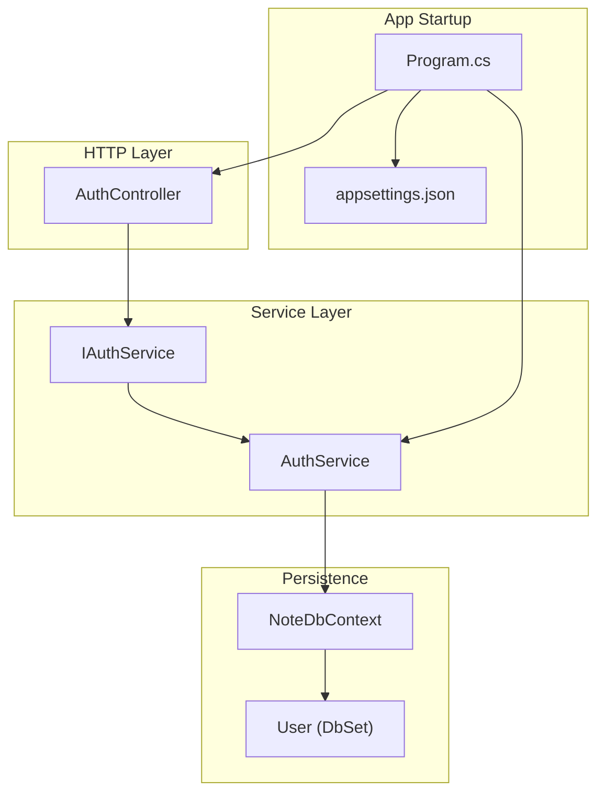
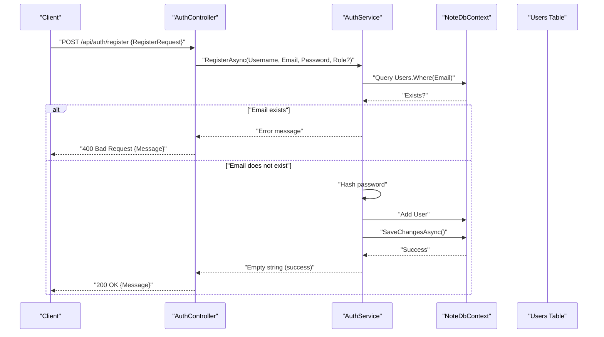
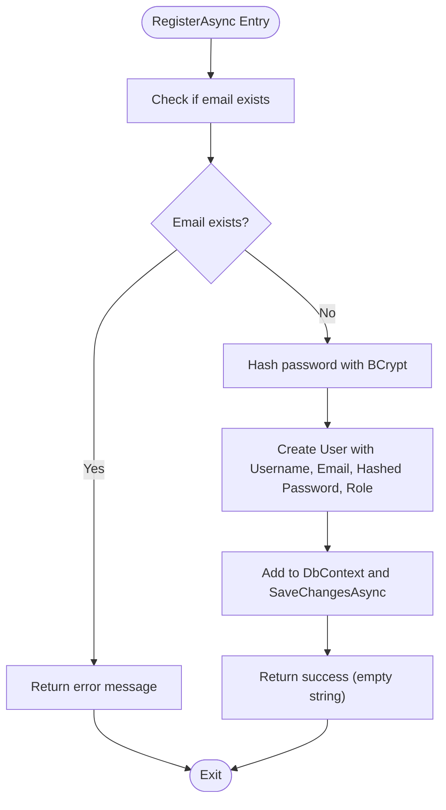
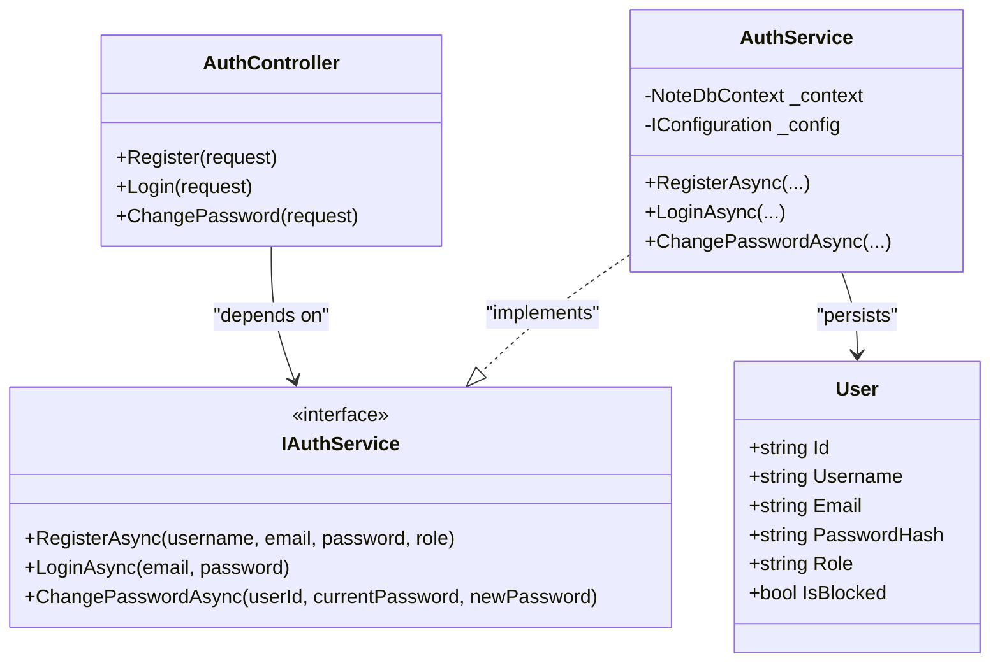

# User Registration

<cite>
**Referenced Files in This Document**
- [User.cs](file://Models/User.cs)
- [AuthService.cs](file://Services/AuthService.cs)
- [IAuthService.cs](file://Services/IAuthService.cs)
- [AuthController.cs](file://Controllers/AuthController.cs)
- [NoteDbContext.cs](file://Data/NoteDbContext.cs)
- [Program.cs](file://Program.cs)
- [appsettings.json](file://appsettings.json)
- [Note.Backend.csproj](file://Note.Backend.csproj)
</cite>

## Table of Contents
1. [Introduction](#introduction)
2. [Project Structure](#project-structure)
3. [Core Components](#core-components)
4. [Architecture Overview](#architecture-overview)
5. [Detailed Component Analysis](#detailed-component-analysis)
6. [Dependency Analysis](#dependency-analysis)
7. [Performance Considerations](#performance-considerations)
8. [Troubleshooting Guide](#troubleshooting-guide)
9. [Conclusion](#conclusion)
10. [Appendices](#appendices)

## Introduction
This document explains the user registration system in the backend. It covers the registration flow, validation requirements for username, email, and password, the RegisterRequest DTO structure, role assignment logic, error handling patterns, duplicate user detection, and security considerations during onboarding. Practical examples and integration guidance with the authentication service are included.

## Project Structure
The registration system spans a small set of cohesive components:
- Controller: exposes the registration endpoint and binds the RegisterRequest DTO
- Service: orchestrates registration, hashing, persistence, and role assignment
- Model: defines the persisted user entity
- Context: provides the database abstraction and seeds an admin user
- Application startup: configures JWT authentication and dependency injection

**Diagram sources**
- [AuthController.cs:18-27](file://Controllers/AuthController.cs#L18-L27)
- [IAuthService.cs:5-10](file://Services/IAuthService.cs#L5-L10)
- [AuthService.cs:11-41](file://Services/AuthService.cs#L11-L41)
- [NoteDbContext.cs:14](file://Data/NoteDbContext.cs#L14)
- [Program.cs:62-84](file://Program.cs#L62-L84)
- [appsettings.json:6-8](file://appsettings.json#L6-L8)

**Section sources**
- [AuthController.cs:18-27](file://Controllers/AuthController.cs#L18-L27)
- [AuthService.cs:11-41](file://Services/AuthService.cs#L11-L41)
- [User.cs:3-11](file://Models/User.cs#L3-L11)
- [NoteDbContext.cs:14](file://Data/NoteDbContext.cs#L14)
- [Program.cs:62-84](file://Program.cs#L62-L84)
- [appsettings.json:6-8](file://appsettings.json#L6-L8)

## Core Components
- RegisterRequest DTO: carries username, email, password, and optional role for registration
- AuthService: performs duplicate detection, password hashing, persistence, and role assignment
- AuthController: exposes the POST /api/auth/register endpoint and returns standardized responses
- User model: persists identity, role, and blocking state
- Program.cs: registers IAuthService with AuthService, configures JWT, and wires DI

Key behaviors:
- Duplicate detection: checks for existing email before creating a new user
- Role assignment: defaults to "User" unless explicitly provided
- Password hashing: uses BCrypt for secure storage
- Response: returns success message or error message on failure

**Section sources**
- [AuthController.cs:63-69](file://Controllers/AuthController.cs#L63-L69)
- [AuthService.cs:22-41](file://Services/AuthService.cs#L22-L41)
- [User.cs:3-11](file://Models/User.cs#L3-L11)
- [Program.cs:62](file://Program.cs#L62)

## Architecture Overview
The registration flow is a straightforward request-response pipeline:
- Client sends RegisterRequest to AuthController
- Controller delegates to IAuthService.RegisterAsync
- Service validates uniqueness, hashes password, assigns role, persists user
- Service returns error message or success indicator
- Controller maps result to HTTP response

**Diagram sources**
- [AuthController.cs:18-27](file://Controllers/AuthController.cs#L18-L27)
- [AuthService.cs:22-41](file://Services/AuthService.cs#L22-L41)
- [NoteDbContext.cs:14](file://Data/NoteDbContext.cs#L14)

## Detailed Component Analysis

### RegisterRequest DTO
- Fields:
  - Username: required string
  - Email: required string
  - Password: required string
  - Role: optional string; defaults to "User" in controller
- Binding: bound from request body in AuthController.Register

Validation rules observed in code:
- No explicit server-side validation for username length, email format, or password strength is present in the controller or service. The service only enforces uniqueness by email.

Common scenarios:
- Successful registration: send all required fields with Role omitted (defaults to "User")
- Duplicate email: sending an existing email returns an error message
- Role override: pass Role to register as Admin (see Security Considerations)

**Section sources**
- [AuthController.cs:63-69](file://Controllers/AuthController.cs#L63-L69)
- [AuthController.cs:18-27](file://Controllers/AuthController.cs#L18-L27)

### AuthService Registration Logic
Responsibilities:
- Duplicate detection: checks Users for existing email
- Password hashing: uses BCrypt to hash plaintext password
- Role assignment: accepts role parameter; defaults to "User"
- Persistence: adds user to context and saves changes
- Error reporting: returns error message string on failure; empty string indicates success

**Diagram sources**
- [AuthService.cs:22-41](file://Services/AuthService.cs#L22-L41)

**Section sources**
- [AuthService.cs:22-41](file://Services/AuthService.cs#L22-L41)

### AuthController Registration Endpoint
Behavior:
- Accepts RegisterRequest from body
- Calls IAuthService.RegisterAsync with Role defaulting to "User" if null
- Maps non-empty error to 400 Bad Request with message
- Maps success to 200 OK with success message

Integration with authentication service:
- Uses injected IAuthService
- No additional middleware validation is applied at the controller level

**Section sources**
- [AuthController.cs:18-27](file://Controllers/AuthController.cs#L18-L27)

### User Model and Role Assignment
- User.Id: auto-generated
- User.Username: stored as provided
- User.Email: used for uniqueness checks
- User.PasswordHash: hashed value stored
- User.Role: defaults to "User"; can be "Admin"
- User.IsBlocked: allows account blocking

Role assignment logic:
- Controller passes Role from RegisterRequest to service
- Service sets User.Role to provided value or "User" default
- Admin seeding demonstrates Role = "Admin" in database

**Section sources**
- [User.cs:3-11](file://Models/User.cs#L3-L11)
- [AuthController.cs:21](file://Controllers/AuthController.cs#L21)
- [AuthService.cs:34](file://Services/AuthService.cs#L34)
- [NoteDbContext.cs:27-37](file://Data/NoteDbContext.cs#L27-L37)

### Duplicate User Detection
Mechanism:
- Service queries Users by Email before creating a new user
- Returns error message if match found

Implications:
- Prevents duplicate registrations for the same email
- Does not enforce uniqueness on Username at the persistence level in the provided code

**Section sources**
- [AuthService.cs:24-27](file://Services/AuthService.cs#L24-L27)

### Email Verification Processes
Observed behavior:
- No email verification logic is implemented in the registration flow
- No email dispatch, verification tokens, or pending-state handling is present

Recommendations:
- Introduce a verification token, email dispatch, and a verified flag on User
- Add a separate verification endpoint and update user state upon success

[No sources needed since this section provides recommendations without analyzing specific files]

### Security Considerations During Onboarding
- Password hashing: BCrypt is used for secure storage
- Role assignment: Admin role can be assigned via RegisterRequest; ensure strict controls and least privilege
- JWT configuration: symmetric key is configured; ensure strong key management and rotation
- CORS and HTTPS: CORS is enabled broadly; consider tightening origins and enabling HTTPS in production

**Section sources**
- [AuthService.cs:33](file://Services/AuthService.cs#L33)
- [Program.cs:73-84](file://Program.cs#L73-L84)
- [appsettings.json:6-8](file://appsettings.json#L6-L8)

### Practical Examples

- Example 1: Successful registration
  - Request: POST /api/auth/register with JSON body containing Username, Email, Password, optional Role
  - Outcome: 200 OK with success message

- Example 2: Duplicate email
  - Request: POST /api/auth/register with an Email already in Users
  - Outcome: 400 Bad Request with error message indicating email already exists

- Example 3: Role override
  - Request: POST /api/auth/register with Role set to "Admin"
  - Outcome: User registered with Admin role; ensure this is restricted to trusted flows

Note: These examples describe expected outcomes based on the current implementation. They do not include request/response bodies because the repository does not define ASP.NET model validation attributes.

**Section sources**
- [AuthController.cs:18-27](file://Controllers/AuthController.cs#L18-L27)
- [AuthService.cs:24-27](file://Services/AuthService.cs#L24-L27)

## Dependency Analysis
- AuthController depends on IAuthService
- AuthService depends on NoteDbContext and IConfiguration
- Program.cs registers IAuthService with AuthService and configures JWT
- appsettings.json provides JWT key and database connection

**Diagram sources**
- [AuthController.cs:13-16](file://Controllers/AuthController.cs#L13-L16)
- [IAuthService.cs:5-10](file://Services/IAuthService.cs#L5-L10)
- [AuthService.cs:11-20](file://Services/AuthService.cs#L11-L20)
- [User.cs:3-11](file://Models/User.cs#L3-L11)

**Section sources**
- [AuthController.cs:13-16](file://Controllers/AuthController.cs#L13-L16)
- [IAuthService.cs:5-10](file://Services/IAuthService.cs#L5-L10)
- [AuthService.cs:11-20](file://Services/AuthService.cs#L11-L20)
- [User.cs:3-11](file://Models/User.cs#L3-L11)

## Performance Considerations
- Database query: single existence check by email is O(1) with an index on Email (recommended)
- Password hashing: BCrypt cost factor is managed by library defaults; consider tuning for your environment
- Persistence: single insert plus save; minimal overhead
- JWT generation: lightweight operation; ensure key length and rotation policies

[No sources needed since this section provides general guidance]

## Troubleshooting Guide
Common issues and resolutions:
- Duplicate email error: occurs when attempting to register with an already-existing email
  - Resolution: use a different email or reset password flow if applicable
- Missing database connection: application fails to start if no connection string is provided
  - Resolution: set ConnectionStrings:DefaultConnection or DATABASE_URL environment variable
- JWT configuration errors: missing or weak JWT key leads to authentication failures
  - Resolution: configure Jwt:Key in appsettings.json or environment variables

**Section sources**
- [AuthService.cs:24-27](file://Services/AuthService.cs#L24-L27)
- [Program.cs:30-33](file://Program.cs#L30-L33)
- [Program.cs:73-84](file://Program.cs#L73-L84)
- [appsettings.json:6-8](file://appsettings.json#L6-L8)

## Conclusion
The registration system provides a minimal, secure baseline:
- Strong password hashing with BCrypt
- Unique email enforcement
- Role assignment with defaults
- Clear separation of concerns via controller, service, and model

Areas for enhancement include:
- Adding server-side validation for username/email/password
- Implementing email verification
- Enforcing stricter role assignment controls
- Improving CORS and HTTPS configuration for production

[No sources needed since this section summarizes without analyzing specific files]

## Appendices

### API Definition: Registration
- Method: POST
- Path: /api/auth/register
- Request body: RegisterRequest
  - Username: string
  - Email: string
  - Password: string
  - Role: string (optional; defaults to "User")

Response:
- 200 OK: { Message: "Registration successful" }
- 400 Bad Request: { Message: "<error message>" }

Mapping:
- Controller action: [AuthController.cs:18-27](file://Controllers/AuthController.cs#L18-L27)
- Service logic: [AuthService.cs:22-41](file://Services/AuthService.cs#L22-L41)

**Section sources**
- [AuthController.cs:18-27](file://Controllers/AuthController.cs#L18-L27)
- [AuthService.cs:22-41](file://Services/AuthService.cs#L22-L41)

### Data Model: User
- Fields: Id, Username, Email, PasswordHash, Role, IsBlocked
- Defaults: Role = "User"

**Section sources**
- [User.cs:3-11](file://Models/User.cs#L3-L11)

### Authentication Integration
- JWT configuration: issuer, audience, signing key
- Bearer token scheme enabled

**Section sources**
- [Program.cs:73-84](file://Program.cs#L73-L84)
- [appsettings.json:6-8](file://appsettings.json#L6-L8)