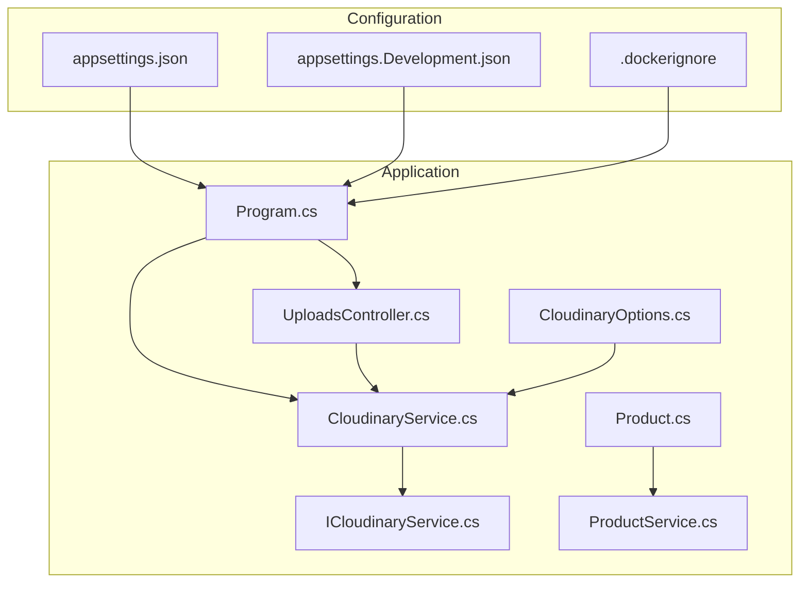
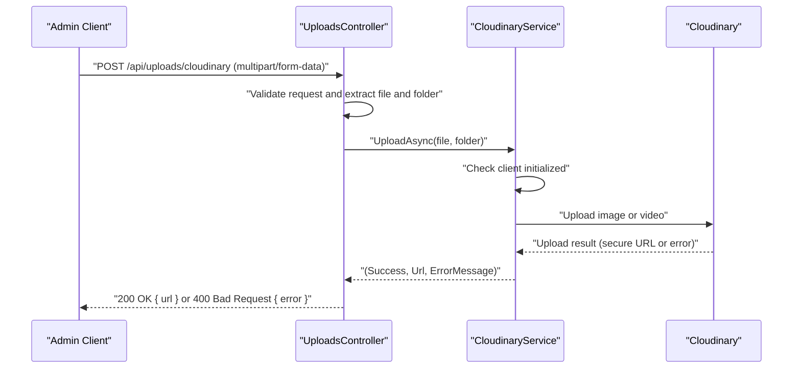
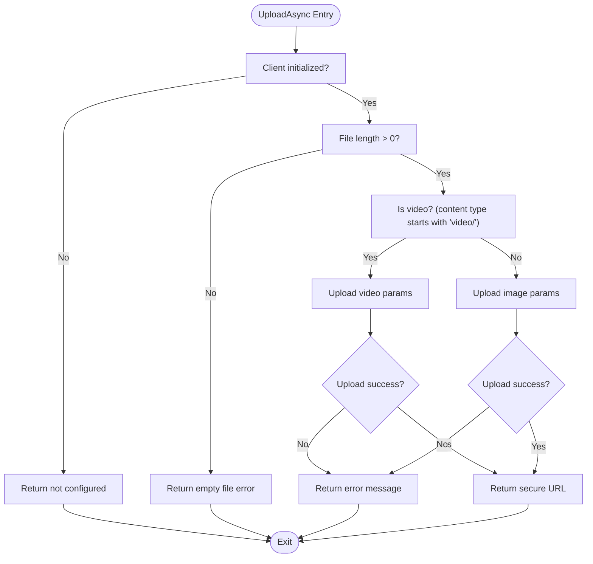
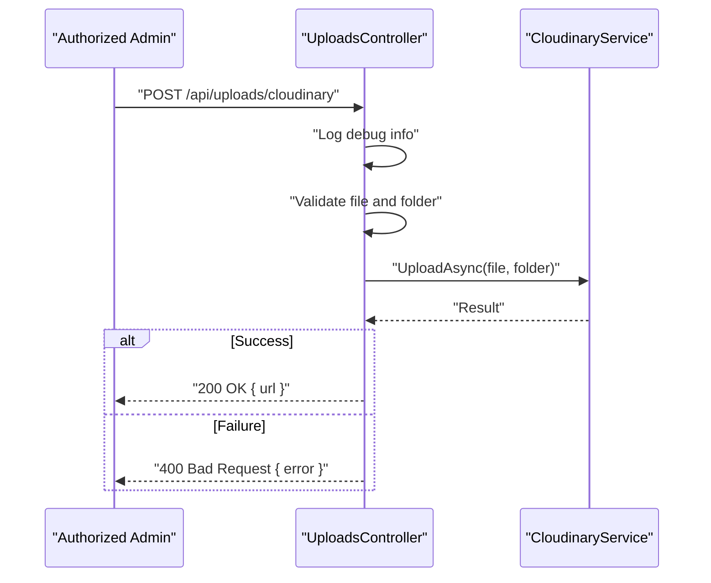
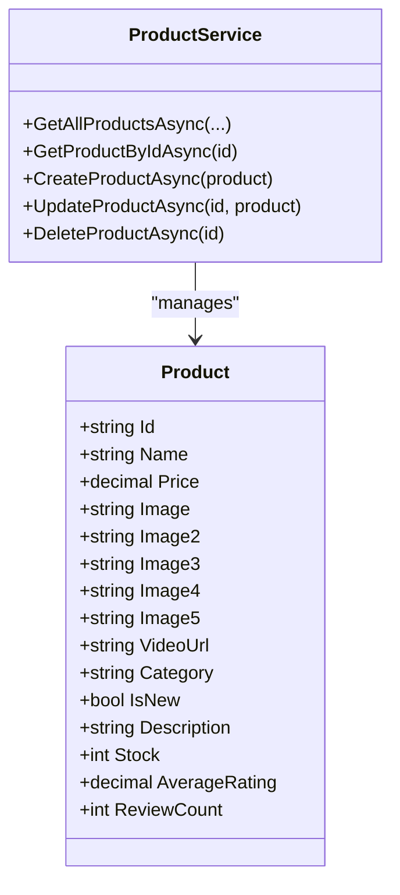
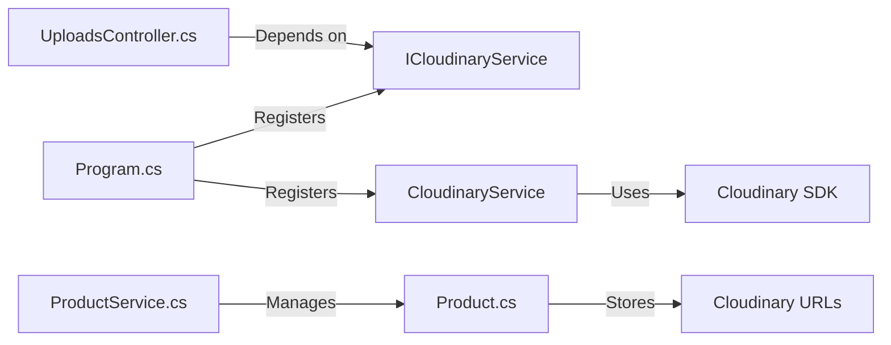

# Cloudinary Integration

<cite>
**Referenced Files in This Document**
- [Program.cs](file://Program.cs)
- [appsettings.json](file://appsettings.json)
- [appsettings.Development.json](file://appsettings.Development.json)
- [.dockerignore](file://.dockerignore)
- [CloudinaryOptions.cs](file://Models/CloudinaryOptions.cs)
- [ICloudinaryService.cs](file://Services/ICloudinaryService.cs)
- [CloudinaryService.cs](file://Services/CloudinaryService.cs)
- [UploadsController.cs](file://Controllers/UploadsController.cs)
- [Product.cs](file://Models/Product.cs)
- [ProductService.cs](file://Services/ProductService.cs)
</cite>

## Table of Contents
1. [Introduction](#introduction)
2. [Project Structure](#project-structure)
3. [Core Components](#core-components)
4. [Architecture Overview](#architecture-overview)
5. [Detailed Component Analysis](#detailed-component-analysis)
6. [Dependency Analysis](#dependency-analysis)
7. [Performance Considerations](#performance-considerations)
8. [Troubleshooting Guide](#troubleshooting-guide)
9. [Conclusion](#conclusion)
10. [Appendices](#appendices)

## Introduction
This document explains the Cloudinary integration in Note.Backend, covering configuration, API key management, upload pipeline setup, and how uploaded media is represented in the product catalog. It also documents the CloudinaryOptions model, service registration, error handling, security considerations, performance tips, and troubleshooting steps for common upload issues.

## Project Structure
Cloudinary is integrated via a dedicated service and controller:
- Configuration is provided via appsettings and environment variables.
- The Cloudinary service encapsulates the Cloudinary SDK client initialization and upload logic.
- The uploads controller exposes an endpoint for authenticated admin users to upload images or videos to Cloudinary.
- Product models support storing media URLs returned by Cloudinary.

**Diagram sources**
- [Program.cs:66-67](file://Program.cs#L66-L67)
- [UploadsController.cs:16-21](file://Controllers/UploadsController.cs#L16-L21)
- [CloudinaryService.cs:12-38](file://Services/CloudinaryService.cs#L12-L38)
- [CloudinaryOptions.cs:3-8](file://Models/CloudinaryOptions.cs#L3-L8)
- [Product.cs:3-20](file://Models/Product.cs#L3-L20)
- [ProductService.cs:7-14](file://Services/ProductService.cs#L7-L14)

**Section sources**
- [Program.cs:66-67](file://Program.cs#L66-L67)
- [appsettings.json:9-13](file://appsettings.json#L9-L13)
- [appsettings.Development.json:2-6](file://appsettings.Development.json#L2-L6)
- [.dockerignore:1-27](file://.dockerignore#L1-L27)

## Core Components
- CloudinaryOptions: Defines configuration properties for Cloudinary (cloud name, API key, API secret).
- ICloudinaryService: Interface for uploading files to Cloudinary and returning a URL.
- CloudinaryService: Implements the interface, initializes the Cloudinary client from environment variables, and performs image/video uploads.
- UploadsController: Exposes an authenticated endpoint to upload files and returns the Cloudinary secure URL.
- Product model: Stores primary and secondary media URLs and optional video URL for catalog items.

Key responsibilities:
- Configuration resolution: Environment variables are read directly; appsettings values are present but not used by the service.
- Initialization: The Cloudinary client is constructed only when all required environment variables are present.
- Upload: Supports images and videos; returns a secure URL or an error message.
- Catalog integration: Product model fields accept Cloudinary URLs for images and optional video.

**Section sources**
- [CloudinaryOptions.cs:3-8](file://Models/CloudinaryOptions.cs#L3-L8)
- [ICloudinaryService.cs:3-6](file://Services/ICloudinaryService.cs#L3-L6)
- [CloudinaryService.cs:12-38](file://Services/CloudinaryService.cs#L12-L38)
- [CloudinaryService.cs:40-102](file://Services/CloudinaryService.cs#L40-L102)
- [UploadsController.cs:16-21](file://Controllers/UploadsController.cs#L16-L21)
- [UploadsController.cs:26-78](file://Controllers/UploadsController.cs#L26-L78)
- [Product.cs:3-20](file://Models/Product.cs#L3-L20)

## Architecture Overview
The upload flow is role-restricted and uses a dedicated service to handle Cloudinary operations. The controller validates the request, delegates to the service, and returns the generated URL.

**Diagram sources**
- [UploadsController.cs:26-78](file://Controllers/UploadsController.cs#L26-L78)
- [CloudinaryService.cs:40-102](file://Services/CloudinaryService.cs#L40-L102)

## Detailed Component Analysis

### CloudinaryOptions Model
- Purpose: Defines strongly-typed configuration properties for Cloudinary.
- Fields: CloudName, ApiKey, ApiSecret.
- Usage: Present in the project; however, the service reads environment variables directly rather than binding to this model.

**Section sources**
- [CloudinaryOptions.cs:3-8](file://Models/CloudinaryOptions.cs#L3-L8)

### ICloudinaryService Interface
- Purpose: Abstraction for Cloudinary uploads.
- Method: UploadAsync(IFormFile file, string folder) returning a tuple with success flag, URL, and optional error message.

**Section sources**
- [ICloudinaryService.cs:3-6](file://Services/ICloudinaryService.cs#L3-L6)

### CloudinaryService Implementation
- Initialization:
  - Reads environment variables for cloud name, API key, and API secret.
  - Logs presence checks and errors if any are missing.
  - Constructs the Cloudinary client only when all are present.
- Upload logic:
  - Detects video vs. image by MIME type prefix.
  - Uses appropriate upload parameters and returns a secure URL on success.
  - Returns structured error messages for downstream handling.
- Error handling:
  - Null client, empty file, upload errors, and exceptions are handled with logs and clear messages.

**Diagram sources**
- [CloudinaryService.cs:40-102](file://Services/CloudinaryService.cs#L40-L102)

**Section sources**
- [CloudinaryService.cs:12-38](file://Services/CloudinaryService.cs#L12-L38)
- [CloudinaryService.cs:40-102](file://Services/CloudinaryService.cs#L40-L102)

### UploadsController Endpoint
- Authentication: Requires Admin role.
- Request handling:
  - Logs request metadata for debugging.
  - Validates presence of a file in multipart form data.
  - Extracts optional folder parameter; defaults to a product-specific folder.
  - Delegates upload to CloudinaryService and returns either the URL or a structured error.
- Security: Role-based authorization prevents unauthorized uploads.

**Diagram sources**
- [UploadsController.cs:26-78](file://Controllers/UploadsController.cs#L26-L78)
- [CloudinaryService.cs:40-102](file://Services/CloudinaryService.cs#L40-L102)

**Section sources**
- [UploadsController.cs:9-21](file://Controllers/UploadsController.cs#L9-L21)
- [UploadsController.cs:26-78](file://Controllers/UploadsController.cs#L26-L78)

### Product Catalog Integration
- Product model supports multiple image fields and an optional video URL.
- After a successful upload, the returned Cloudinary secure URL can be stored in these fields.
- ProductService manages persistence and retrieval of products; media URLs are part of product records.

**Diagram sources**
- [Product.cs:3-20](file://Models/Product.cs#L3-L20)
- [ProductService.cs:7-14](file://Services/ProductService.cs#L7-L14)

**Section sources**
- [Product.cs:3-20](file://Models/Product.cs#L3-L20)
- [ProductService.cs:16-94](file://Services/ProductService.cs#L16-L94)

## Dependency Analysis
- Program registers the Cloudinary service as a scoped dependency.
- UploadsController depends on ICloudinaryService and IConfiguration for optional configuration checks.
- CloudinaryService depends on the Cloudinary SDK and uses environment variables for credentials.
- Product model and ProductService integrate media URLs into the catalog.

**Diagram sources**
- [Program.cs:66-67](file://Program.cs#L66-L67)
- [UploadsController.cs:16-21](file://Controllers/UploadsController.cs#L16-L21)
- [CloudinaryService.cs:12-38](file://Services/CloudinaryService.cs#L12-L38)
- [Product.cs:3-20](file://Models/Product.cs#L3-L20)
- [ProductService.cs:7-14](file://Services/ProductService.cs#L7-L14)

**Section sources**
- [Program.cs:66-67](file://Program.cs#L66-L67)
- [UploadsController.cs:16-21](file://Controllers/UploadsController.cs#L16-L21)
- [CloudinaryService.cs:12-38](file://Services/CloudinaryService.cs#L12-L38)
- [Product.cs:3-20](file://Models/Product.cs#L3-L20)
- [ProductService.cs:7-14](file://Services/ProductService.cs#L7-L14)

## Performance Considerations
- Prefer smaller, appropriately sized images for product catalogs to reduce bandwidth and improve page load times.
- Use Cloudinary transformations (e.g., resize, quality, format) when generating URLs for display to optimize delivery.
- Limit multipart upload size as configured on the controller to prevent large payloads; adjust limits based on deployment needs.
- Consider CDN caching and browser caching headers for static assets served via Cloudinary.

[No sources needed since this section provides general guidance]

## Troubleshooting Guide
Common issues and resolutions:
- Missing environment variables:
  - Symptoms: Service logs indicate missing variables; upload returns “not configured.”
  - Resolution: Set CLOUDINARY_CLOUD_NAME, CLOUDINARY_API_KEY, and CLOUDINARY_API_SECRET.
- Empty file upload:
  - Symptoms: Controller warns and returns bad request with “File is empty.”
  - Resolution: Ensure the multipart form includes a valid file.
- Upload failures:
  - Symptoms: Errors logged from Cloudinary; response includes error message.
  - Resolution: Verify file type, size limits, and Cloudinary plan quotas.
- Role-based access:
  - Symptoms: Unauthorized responses when uploading.
  - Resolution: Ensure the caller has the Admin role.

Operational checks:
- Confirm environment variables are loaded by the runtime and not overridden by appsettings during initialization.
- Use controller logs to inspect request metadata and upload outcomes.

**Section sources**
- [CloudinaryService.cs:26-32](file://Services/CloudinaryService.cs#L26-L32)
- [CloudinaryService.cs:48-52](file://Services/CloudinaryService.cs#L48-L52)
- [CloudinaryService.cs:70-74](file://Services/CloudinaryService.cs#L70-L74)
- [UploadsController.cs:45-49](file://Controllers/UploadsController.cs#L45-L49)
- [UploadsController.cs:64-73](file://Controllers/UploadsController.cs#L64-L73)

## Conclusion
The Cloudinary integration in Note.Backend is cleanly separated into a service and controller, with environment-based configuration and robust error handling. The product catalog model supports storing Cloudinary URLs for images and videos, enabling seamless media-driven product presentation. Following the security and performance recommendations in this guide will help maintain a reliable and scalable media pipeline.

[No sources needed since this section summarizes without analyzing specific files]

## Appendices

### Configuration Reference
- Environment variables used by the service:
  - CLOUDINARY_CLOUD_NAME
  - CLOUDINARY_API_KEY
  - CLOUDINARY_API_SECRET
- Optional configuration keys checked by the controller:
  - Cloudinary:CloudName
  - Cloudinary:ApiKey
  - Cloudinary:ApiSecret
- Notes:
  - The service reads environment variables directly.
  - appsettings values are present but not bound to the service initialization.

**Section sources**
- [CloudinaryService.cs:17-19](file://Services/CloudinaryService.cs#L17-L19)
- [UploadsController.cs:35-37](file://Controllers/UploadsController.cs#L35-L37)
- [appsettings.json:9-13](file://appsettings.json#L9-L13)
- [appsettings.Development.json:2-6](file://appsettings.Development.json#L2-L6)

### Upload Workflow Examples
- Typical image upload:
  - Endpoint: POST /api/uploads/cloudinary
  - Payload: multipart/form-data with file and optional folder
  - Response: { url: "https://.../your-image.jpg" }
- Typical video upload:
  - Same endpoint and payload; returns a secure video URL
- Product catalog integration:
  - Store the returned URL in Product.Image or additional image fields
  - Optionally store a video URL in Product.VideoUrl

**Section sources**
- [UploadsController.cs:26-78](file://Controllers/UploadsController.cs#L26-L78)
- [CloudinaryService.cs:60-95](file://Services/CloudinaryService.cs#L60-L95)
- [Product.cs:8-13](file://Models/Product.cs#L8-L13)

### Security Best Practices
- Keep API secrets out of source control; rely on environment variables.
- Restrict upload endpoints to authorized roles.
- Validate and sanitize filenames and content types at ingress.
- Monitor logs for repeated upload failures and misconfigured environments.

**Section sources**
- [CloudinaryService.cs:17-19](file://Services/CloudinaryService.cs#L17-L19)
- [UploadsController.cs:9](file://Controllers/UploadsController.cs#L9)
- [UploadsController.cs:35-42](file://Controllers/UploadsController.cs#L35-L42)