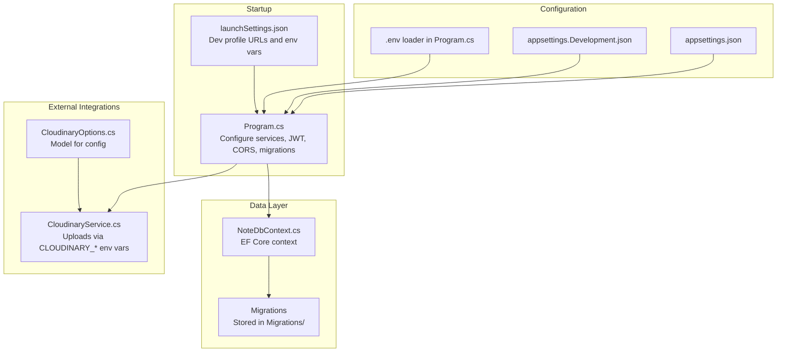
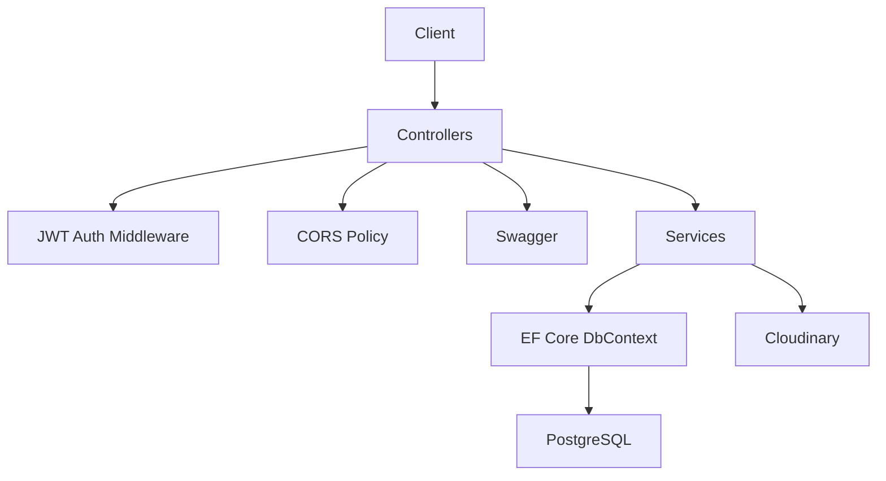
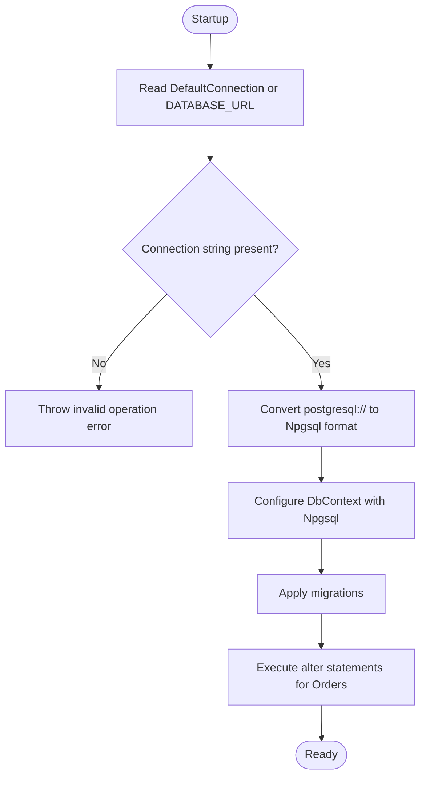
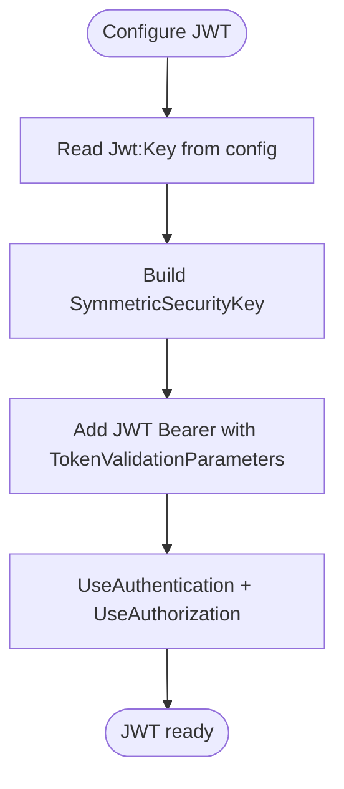
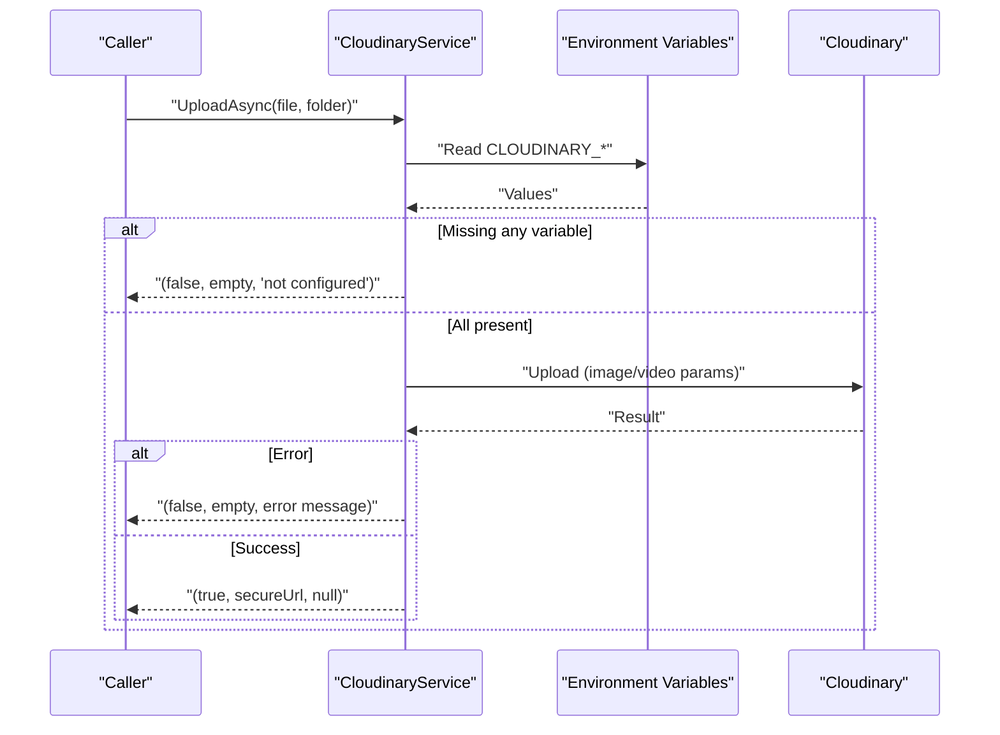
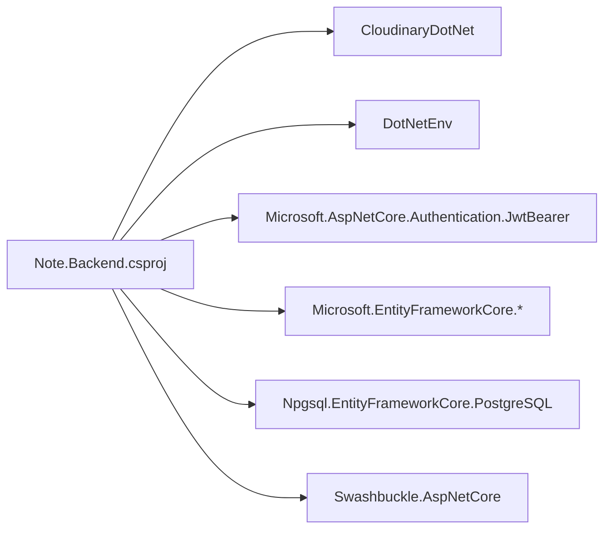

# Configuration & Deployment

<cite>
**Referenced Files in This Document**
- [appsettings.json](file://appsettings.json)
- [appsettings.Development.json](file://appsettings.Development.json)
- [Program.cs](file://Program.cs)
- [Properties/launchSettings.json](file://Properties/launchSettings.json)
- [Services/CloudinaryService.cs](file://Services/CloudinaryService.cs)
- [Models/CloudinaryOptions.cs](file://Models/CloudinaryOptions.cs)
- [Data/NoteDbContext.cs](file://Data/NoteDbContext.cs)
- [Note.Backend.csproj](file://Note.Backend.csproj)
- [.dockerignore](file://.dockerignore)
</cite>

## Table of Contents
1. [Introduction](#introduction)
2. [Project Structure](#project-structure)
3. [Core Components](#core-components)
4. [Architecture Overview](#architecture-overview)
5. [Detailed Component Analysis](#detailed-component-analysis)
6. [Dependency Analysis](#dependency-analysis)
7. [Performance Considerations](#performance-considerations)
8. [Troubleshooting Guide](#troubleshooting-guide)
9. [Conclusion](#conclusion)
10. [Appendices](#appendices)

## Introduction
This document provides comprehensive configuration and deployment guidance for Note.Backend. It covers environment-specific configuration, database connection setup, Cloudinary integration, JWT security settings, deployment strategies across development, staging, and production environments, containerization with Docker, CI/CD considerations, secrets handling, scaling, monitoring, backups, disaster recovery, troubleshooting, and performance optimization recommendations.

## Project Structure
The backend is a .NET 10 web application using Entity Framework Core with PostgreSQL via Npgsql. Configuration is managed through appsettings files and environment variables. The application initializes database migrations at startup and exposes Swagger for API exploration. Cloudinary integration is handled via environment variables, and JWT authentication is configured with a symmetric key.

**Diagram sources**
- [Program.cs:10-150](file://Program.cs#L10-L150)
- [appsettings.json:1-23](file://appsettings.json#L1-L23)
- [appsettings.Development.json:1-14](file://appsettings.Development.json#L1-L14)
- [Data/NoteDbContext.cs:1-67](file://Data/NoteDbContext.cs#L1-L67)
- [Services/CloudinaryService.cs:1-103](file://Services/CloudinaryService.cs#L1-L103)
- [Models/CloudinaryOptions.cs:1-9](file://Models/CloudinaryOptions.cs#L1-L9)
- [Properties/launchSettings.json:1-25](file://Properties/launchSettings.json#L1-L25)

**Section sources**
- [Program.cs:10-150](file://Program.cs#L10-L150)
- [appsettings.json:1-23](file://appsettings.json#L1-L23)
- [appsettings.Development.json:1-14](file://appsettings.Development.json#L1-L14)
- [Properties/launchSettings.json:1-25](file://Properties/launchSettings.json#L1-L25)
- [Data/NoteDbContext.cs:1-67](file://Data/NoteDbContext.cs#L1-L67)
- [Services/CloudinaryService.cs:1-103](file://Services/CloudinaryService.cs#L1-L103)
- [Models/CloudinaryOptions.cs:1-9](file://Models/CloudinaryOptions.cs#L1-L9)

## Core Components
- Configuration hierarchy: appsettings.json defines defaults; environment-specific overrides in appsettings.Development.json; runtime environment variables and .env loading in Program.cs.
- Database: PostgreSQL connection string resolution supports both key-value and URI formats; automatic migrations on startup; additional column alterations applied during migration phase.
- Authentication: JWT bearer authentication with a configurable symmetric key; permissive CORS policy for development.
- Cloudinary: service reads CLOUDINARY_* environment variables; uploads support images and videos; logs initialization and errors.
- Startup pipeline: Swagger enabled; routing and CORS configured; authentication and authorization middleware applied; controllers mapped.

**Section sources**
- [Program.cs:10-150](file://Program.cs#L10-L150)
- [appsettings.json:1-23](file://appsettings.json#L1-L23)
- [appsettings.Development.json:1-14](file://appsettings.Development.json#L1-L14)
- [Services/CloudinaryService.cs:1-103](file://Services/CloudinaryService.cs#L1-L103)
- [Data/NoteDbContext.cs:1-67](file://Data/NoteDbContext.cs#L1-L67)

## Architecture Overview
The application follows a layered architecture:
- Presentation: ASP.NET Core controllers.
- Application: Services implementing domain logic.
- Infrastructure: EF Core context and migrations.
- External integrations: Cloudinary SDK for media uploads.

**Diagram sources**
- [Program.cs:10-150](file://Program.cs#L10-L150)
- [Data/NoteDbContext.cs:1-67](file://Data/NoteDbContext.cs#L1-L67)
- [Services/CloudinaryService.cs:1-103](file://Services/CloudinaryService.cs#L1-L103)

## Detailed Component Analysis

### Database Configuration and Migration Flow
- Connection string resolution:
  - Reads ConnectionStrings:DefaultConnection from configuration.
  - Falls back to DATABASE_URL from configuration or environment variable.
  - Throws if none found.
  - Converts postgresql:// URI to Npgsql key-value format.
- Migration and schema adjustments:
  - Applies pending migrations.
  - Executes additional SQL to add columns to the Orders table if missing.

**Diagram sources**
- [Program.cs:25-59](file://Program.cs#L25-L59)
- [Program.cs:104-138](file://Program.cs#L104-L138)

**Section sources**
- [Program.cs:25-59](file://Program.cs#L25-L59)
- [Program.cs:104-138](file://Program.cs#L104-L138)

### JWT Security Configuration
- Key retrieval:
  - Reads Jwt:Key from configuration.
  - Uses a default key if not provided.
- Validation parameters:
  - Validates issuer signing key.
  - Disables issuer and audience validation.
- Authentication scheme:
  - Adds JWT Bearer authentication and applies middleware.

**Diagram sources**
- [Program.cs:69-84](file://Program.cs#L69-L84)

**Section sources**
- [Program.cs:69-84](file://Program.cs#L69-L84)

### Cloudinary Integration
- Environment variables:
  - Reads CLOUDINARY_CLOUD_NAME, CLOUDINARY_API_KEY, CLOUDINARY_API_SECRET.
- Initialization:
  - Creates Cloudinary account and client if all variables are present.
  - Logs initialization status and errors.
- Upload logic:
  - Supports images and videos.
  - Returns success flag, secure URL, or error message.
  - Handles empty files and exceptions.

**Diagram sources**
- [Services/CloudinaryService.cs:12-38](file://Services/CloudinaryService.cs#L12-L38)
- [Services/CloudinaryService.cs:40-102](file://Services/CloudinaryService.cs#L40-L102)

**Section sources**
- [Services/CloudinaryService.cs:1-103](file://Services/CloudinaryService.cs#L1-L103)
- [Models/CloudinaryOptions.cs:1-9](file://Models/CloudinaryOptions.cs#L1-L9)

### CORS and HTTPS Behavior
- CORS:
  - Adds a policy allowing any origin/header/method for development convenience.
- HTTPS redirection:
  - Commented out; HTTP is used in development.

**Section sources**
- [Program.cs:86-96](file://Program.cs#L86-L96)
- [Program.cs:143-146](file://Program.cs#L143-L146)

### Environment-Specific Configuration
- Production defaults:
  - ConnectionStrings:DefaultConnection holds a local Postgres connection string.
  - Jwt:Key provides a default key.
  - Cloudinary fields are empty placeholders.
- Development overrides:
  - Cloudinary credentials are filled.
  - Logging level configured.
- Runtime overrides:
  - DATABASE_URL environment variable is supported.
  - DotNetEnv loads .env variables at startup.

**Section sources**
- [appsettings.json:1-23](file://appsettings.json#L1-L23)
- [appsettings.Development.json:1-14](file://appsettings.Development.json#L1-L14)
- [Program.cs:12-13](file://Program.cs#L12-L13)
- [Program.cs:26-28](file://Program.cs#L26-L28)

### Startup Pipeline and Swagger
- Pipeline:
  - Enables Swagger and SwaggerUI.
  - Routes requests, applies CORS, authentication, and authorization.
  - Maps controllers.
- Dev profile:
  - Launch settings define HTTP/HTTPS URLs and set ASPNETCORE_ENVIRONMENT to Development.

**Section sources**
- [Program.cs:100-148](file://Program.cs#L100-L148)
- [Properties/launchSettings.json:1-25](file://Properties/launchSettings.json#L1-L25)

## Dependency Analysis
- NuGet packages:
  - CloudinaryDotNet for media uploads.
  - DotNetEnv for .env loading.
  - Microsoft.AspNetCore.Authentication.JwtBearer for JWT.
  - Entity Framework Core with Npgsql provider for PostgreSQL.
  - Swashbuckle.AspNetCore for API documentation.

**Diagram sources**
- [Note.Backend.csproj:9-26](file://Note.Backend.csproj#L9-L26)

**Section sources**
- [Note.Backend.csproj:1-29](file://Note.Backend.csproj#L1-L29)

## Performance Considerations
- Connection string normalization:
  - Convert postgresql:// URIs to Npgsql format to avoid parsing overhead.
- CORS policy:
  - Restrict origins in production to reduce preflight overhead.
- Logging:
  - Adjust log levels per environment to minimize I/O.
- Authentication:
  - Consider rotating JWT keys and enabling issuer/audience validation in production.
- Media uploads:
  - Validate file sizes and types upstream to reduce Cloudinary failures.
- Database:
  - Ensure proper indexing on frequently queried columns; review existing indexes in model configuration.

[No sources needed since this section provides general guidance]

## Troubleshooting Guide
- No database connection string found:
  - Ensure ConnectionStrings:DefaultConnection or DATABASE_URL is set in configuration or environment.
  - Verify .env file is loaded if using DotNetEnv.
- PostgreSQL URI format:
  - If using a postgresql:// URI, confirm it is properly formatted; the app converts it to Npgsql format.
- JWT errors:
  - Confirm Jwt:Key is set; otherwise, the default key is used.
  - Ensure clients send Authorization: Bearer tokens.
- CORS issues:
  - Verify AllowAnyOrigin policy is sufficient for development; tighten in production.
- Cloudinary not configured:
  - Ensure CLOUDINARY_CLOUD_NAME, CLOUDINARY_API_KEY, and CLOUDINARY_API_SECRET are set.
  - Check service logs for initialization and upload errors.
- Swagger not visible:
  - Confirm Swagger and SwaggerUI are enabled in the pipeline.
- HTTPS redirection:
  - Uncomment and configure HTTPS redirection for production behind load balancers.

**Section sources**
- [Program.cs:25-33](file://Program.cs#L25-L33)
- [Program.cs:35-59](file://Program.cs#L35-L59)
- [Program.cs:69-84](file://Program.cs#L69-L84)
- [Program.cs:86-96](file://Program.cs#L86-L96)
- [Services/CloudinaryService.cs:16-38](file://Services/CloudinaryService.cs#L16-L38)
- [Program.cs:100-102](file://Program.cs#L100-L102)

## Conclusion
Note.Backend’s configuration and deployment rely on a flexible appsettings hierarchy, environment variables, and .env loading. The application initializes the database with migrations and schema adjustments, configures JWT authentication, and integrates Cloudinary for media uploads. For production, tighten CORS, enable HTTPS redirection, rotate JWT keys, and manage secrets securely. Containerization and CI/CD can be introduced to streamline deployments.

[No sources needed since this section summarizes without analyzing specific files]

## Appendices

### Environment Variable Reference
- Database
  - ConnectionStrings:DefaultConnection (key-value format)
  - DATABASE_URL (alternative; supports postgresql:// URI)
- JWT
  - Jwt:Key (symmetric key)
- Cloudinary
  - CLOUDINARY_CLOUD_NAME
  - CLOUDINARY_API_KEY
  - CLOUDINARY_API_SECRET
- Environment
  - ASPNETCORE_ENVIRONMENT (e.g., Development)

**Section sources**
- [Program.cs:26-28](file://Program.cs#L26-L28)
- [Program.cs:70-71](file://Program.cs#L70-L71)
- [Services/CloudinaryService.cs:16-19](file://Services/CloudinaryService.cs#L16-L19)
- [Properties/launchSettings.json:10-22](file://Properties/launchSettings.json#L10-L22)

### Secrets and Configuration Management
- Keep secrets out of source control:
  - Use environment variables or secret managers.
  - Avoid committing sensitive values to appsettings.json.
- Use .env for local development:
  - Ensure .env is listed in .gitignore.
- Validate configuration at startup:
  - The app throws if no database connection string is found.

**Section sources**
- [.dockerignore:1-27](file://.dockerignore#L1-L27)
- [Program.cs:30-33](file://Program.cs#L30-L33)

### Deployment Strategies
- Development
  - Use launchSettings.json profiles.
  - Enable Swagger and permissive CORS.
  - Set ASPNETCORE_ENVIRONMENT to Development.
- Staging and Production
  - Provide DATABASE_URL and CLOUDINARY_* via environment variables.
  - Set Jwt:Key to a strong, rotated value.
  - Disable permissive CORS and enable HTTPS redirection.
  - Use a reverse proxy/load balancer for HTTPS termination.

**Section sources**
- [Properties/launchSettings.json:1-25](file://Properties/launchSettings.json#L1-L25)
- [Program.cs:86-96](file://Program.cs#L86-L96)
- [Program.cs:143-146](file://Program.cs#L143-L146)

### Containerization with Docker
- Base image and target framework:
  - The project targets net10.0.
- Build outputs and IDE artifacts are excluded via .dockerignore.
- Recommended steps:
  - Create a Dockerfile that restores, builds, and runs the app.
  - Expose the appropriate port(s).
  - Mount volumes for logs and persistent data if needed.
  - Set environment variables for database and Cloudinary.

**Section sources**
- [Note.Backend.csproj:3-7](file://Note.Backend.csproj#L3-L7)
- [.dockerignore:1-27](file://.dockerignore#L1-L27)

### CI/CD Pipeline Configuration
- Suggested stages:
  - Build: Restore dependencies and publish artifacts.
  - Test: Run unit tests.
  - Package: Produce container image.
  - Deploy: Push image to registry and deploy to target environment.
- Secrets injection:
  - Inject DATABASE_URL, CLOUDINARY_* and Jwt:Key via CI/CD variables.
- Rollback:
  - Maintain tagged images and blue/green or rolling updates.

[No sources needed since this section provides general guidance]

### Scaling Considerations
- Horizontal scaling:
  - Stateless design allows multiple replicas.
  - Use a shared PostgreSQL instance or managed service.
- Caching:
  - Introduce response caching for read-heavy endpoints.
- Background jobs:
  - Offload long-running tasks (e.g., media processing) to background services.

[No sources needed since this section provides general guidance]

### Monitoring, Backups, and Disaster Recovery
- Monitoring:
  - Enable structured logging and export logs to a centralized system.
  - Track health checks and metrics endpoints.
- Backups:
  - Schedule regular PostgreSQL logical backups.
  - Maintain offsite copies of backups.
- Disaster recovery:
  - Define RPO/RTO targets.
  - Practice restoring from backups and failover testing.

[No sources needed since this section provides general guidance]