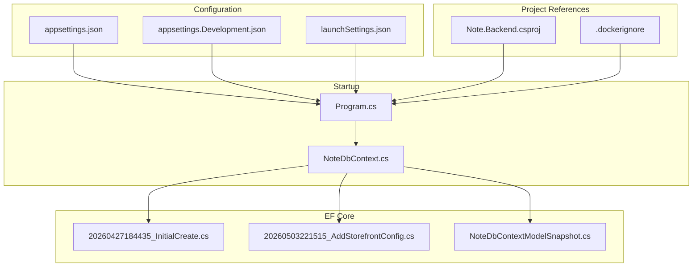
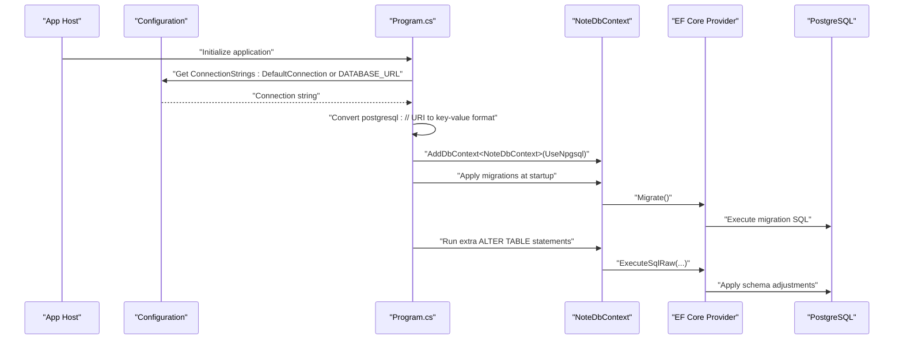
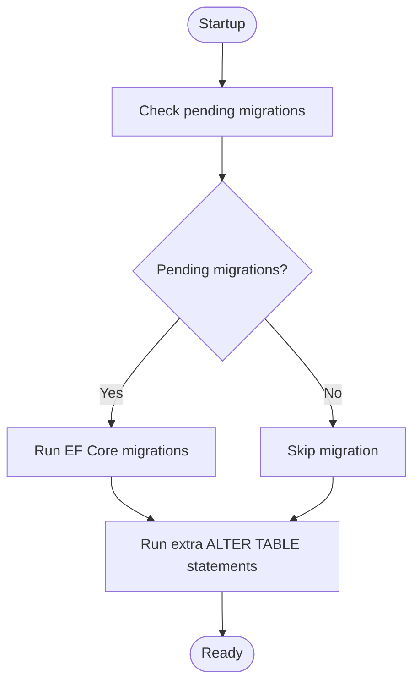
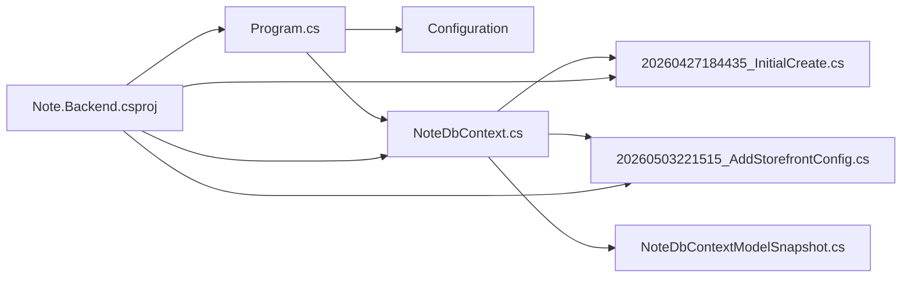

# Database Configuration

<cite>
**Referenced Files in This Document**
- [Program.cs](file://Program.cs)
- [appsettings.json](file://appsettings.json)
- [appsettings.Development.json](file://appsettings.Development.json)
- [NoteDbContext.cs](file://Data/NoteDbContext.cs)
- [20260427184435_InitialCreate.cs](file://Migrations/20260427184435_InitialCreate.cs)
- [20260503221515_AddStorefrontConfig.cs](file://Migrations/20260503221515_AddStorefrontConfig.cs)
- [NoteDbContextModelSnapshot.cs](file://Migrations/NoteDbContextModelSnapshot.cs)
- [Note.Backend.csproj](file://Note.Backend.csproj)
- [.dockerignore](file://.dockerignore)
- [launchSettings.json](file://Properties/launchSettings.json)
</cite>

## Table of Contents
1. [Introduction](#introduction)
2. [Project Structure](#project-structure)
3. [Core Components](#core-components)
4. [Architecture Overview](#architecture-overview)
5. [Detailed Component Analysis](#detailed-component-analysis)
6. [Dependency Analysis](#dependency-analysis)
7. [Performance Considerations](#performance-considerations)
8. [Troubleshooting Guide](#troubleshooting-guide)
9. [Conclusion](#conclusion)
10. [Appendices](#appendices)

## Introduction
This document explains how the Note.Backend application configures and manages its PostgreSQL database using Entity Framework Core. It covers connection string setup, runtime conversion of PostgreSQL URIs, automatic migrations, database initialization, and practical guidance for development, testing, and production deployment. It also outlines migration lifecycle, seeding, connection troubleshooting, and containerization considerations.

## Project Structure
The database configuration spans several key areas:
- Application configuration files define connection strings and logging.
- The application startup initializes the Entity Framework Core context and applies migrations.
- Migrations define the evolving schema and seed initial data.
- The project references Entity Framework Core and the PostgreSQL provider.

**Diagram sources**
- [Program.cs](file://Program.cs)
- [appsettings.json](file://appsettings.json)
- [appsettings.Development.json](file://appsettings.Development.json)
- [launchSettings.json](file://Properties/launchSettings.json)
- [NoteDbContext.cs](file://Data/NoteDbContext.cs)
- [20260427184435_InitialCreate.cs](file://Migrations/20260427184435_InitialCreate.cs)
- [20260503221515_AddStorefrontConfig.cs](file://Migrations/20260503221515_AddStorefrontConfig.cs)
- [NoteDbContextModelSnapshot.cs](file://Migrations/NoteDbContextModelSnapshot.cs)
- [Note.Backend.csproj](file://Note.Backend.csproj)
- [.dockerignore](file://.dockerignore)

**Section sources**
- [Program.cs](file://Program.cs)
- [appsettings.json](file://appsettings.json)
- [appsettings.Development.json](file://appsettings.Development.json)
- [launchSettings.json](file://Properties/launchSettings.json)
- [NoteDbContext.cs](file://Data/NoteDbContext.cs)
- [20260427184435_InitialCreate.cs](file://Migrations/20260427184435_InitialCreate.cs)
- [20260503221515_AddStorefrontConfig.cs](file://Migrations/20260503221515_AddStorefrontConfig.cs)
- [NoteDbContextModelSnapshot.cs](file://Migrations/NoteDbContextModelSnapshot.cs)
- [Note.Backend.csproj](file://Note.Backend.csproj)
- [.dockerignore](file://.dockerignore)

## Core Components
- Connection string sources and resolution:
  - The application reads the connection string from configuration keys or environment variables and validates that one is present.
  - A helper converts PostgreSQL URIs into the key-value format expected by the PostgreSQL provider.
- Entity Framework Core configuration:
  - The application registers the database context and configures the PostgreSQL provider.
- Automatic migrations:
  - At startup, the application applies pending migrations and executes additional SQL to add columns to an existing table.
- Seeding:
  - Initial data is seeded during model configuration and via migration insert statements.

Practical configuration references:
- Connection string retrieval and validation: [Program.cs](file://Program.cs)
- PostgreSQL URI conversion: [Program.cs](file://Program.cs)
- EF Core registration: [Program.cs](file://Program.cs)
- Automatic migration execution and extra DDL: [Program.cs](file://Program.cs)
- Model configuration and seeding: [NoteDbContext.cs](file://Data/NoteDbContext.cs)
- Migration inserts and indices: [20260427184435_InitialCreate.cs](file://Migrations/20260427184435_InitialCreate.cs)

**Section sources**
- [Program.cs](file://Program.cs)
- [NoteDbContext.cs](file://Data/NoteDbContext.cs)
- [20260427184435_InitialCreate.cs](file://Migrations/20260427184435_InitialCreate.cs)

## Architecture Overview
The runtime database flow integrates configuration, context initialization, and migration execution.

**Diagram sources**
- [Program.cs](file://Program.cs)
- [NoteDbContext.cs](file://Data/NoteDbContext.cs)

## Detailed Component Analysis

### Connection String Setup
- Sources:
  - ConnectionStrings:DefaultConnection in configuration.
  - DATABASE_URL environment variable fallback.
  - Validation ensures at least one is present.
- URI conversion:
  - If the connection string is a postgresql:// URI, it is converted to a key-value format suitable for the provider.
- Example references:
  - Retrieval and validation: [Program.cs](file://Program.cs)
  - URI conversion logic: [Program.cs](file://Program.cs)

Operational notes:
- Use DATABASE_URL for platform-provided connection strings (e.g., container platforms).
- For local development, configure ConnectionStrings:DefaultConnection in settings.

**Section sources**
- [Program.cs](file://Program.cs)
- [appsettings.json](file://appsettings.json)

### Entity Framework Core Configuration
- Registration:
  - The application registers NoteDbContext with the PostgreSQL provider using the resolved connection string.
- Provider:
  - Uses Npgsql.EntityFrameworkCore.PostgreSQL package.
- Example references:
  - Context registration: [Program.cs](file://Program.cs)
  - Package reference: [Note.Backend.csproj](file://Note.Backend.csproj)

**Section sources**
- [Program.cs](file://Program.cs)
- [Note.Backend.csproj](file://Note.Backend.csproj)

### Database Context Initialization
- Context definition:
  - Declares DbSet properties for all domain entities.
- Seeding:
  - Seeds an admin user and initial coupons/products in model configuration.
- Indexes:
  - Adds unique composite indexes for wishlist and product review uniqueness.
- Example references:
  - Context definition and seeding: [NoteDbContext.cs](file://Data/NoteDbContext.cs)

**Section sources**
- [NoteDbContext.cs](file://Data/NoteDbContext.cs)

### Migration Management
- Automatic migrations at startup:
  - Applies pending migrations and runs additional DDL to add order address and payment columns.
- Migration history:
  - InitialCreate defines the baseline schema and seeds data.
  - AddStorefrontConfig introduces storefront configuration table.
- Example references:
  - Startup migration execution: [Program.cs](file://Program.cs)
  - Initial schema and seeds: [20260427184435_InitialCreate.cs](file://Migrations/20260427184435_InitialCreate.cs)
  - New table migration: [20260503221515_AddStorefrontConfig.cs](file://Migrations/20260503221515_AddStorefrontConfig.cs)

**Diagram sources**
- [Program.cs](file://Program.cs)
- [20260427184435_InitialCreate.cs](file://Migrations/20260427184435_InitialCreate.cs)
- [20260503221515_AddStorefrontConfig.cs](file://Migrations/20260503221515_AddStorefrontConfig.cs)

**Section sources**
- [Program.cs](file://Program.cs)
- [20260427184435_InitialCreate.cs](file://Migrations/20260427184435_InitialCreate.cs)
- [20260503221515_AddStorefrontConfig.cs](file://Migrations/20260503221515_AddStorefrontConfig.cs)

### Database Schema and Seeding
- Entities and relationships:
  - Products, Users, Carts, CartItems, Orders, OrderItems, WishlistItems, ProductReviews, Coupons, BusinessExpenses, StorefrontConfigs.
- Seeding:
  - Admin user and initial coupons/products inserted via model configuration and migration insert statements.
- Indices:
  - Unique composite indexes on WishlistItems and ProductReviews.
- Example references:
  - Context entity sets: [NoteDbContext.cs](file://Data/NoteDbContext.cs)
  - Migration inserts and indices: [20260427184435_InitialCreate.cs](file://Migrations/20260427184435_InitialCreate.cs)

**Section sources**
- [NoteDbContext.cs](file://Data/NoteDbContext.cs)
- [20260427184435_InitialCreate.cs](file://Migrations/20260427184435_InitialCreate.cs)

## Dependency Analysis
- EF Core and PostgreSQL provider:
  - The project references EF Core, EF Core Design, EF Core Tools, Relational, and Npgsql.EntityFrameworkCore.PostgreSQL.
- Startup dependencies:
  - Program.cs depends on configuration, environment variables, and EF Core to initialize the context and apply migrations.
- Migration snapshot:
  - ModelSnapshot tracks model changes to generate incremental migrations.

**Diagram sources**
- [Program.cs](file://Program.cs)
- [NoteDbContext.cs](file://Data/NoteDbContext.cs)
- [20260427184435_InitialCreate.cs](file://Migrations/20260427184435_InitialCreate.cs)
- [20260503221515_AddStorefrontConfig.cs](file://Migrations/20260503221515_AddStorefrontConfig.cs)
- [NoteDbContextModelSnapshot.cs](file://Migrations/NoteDbContextModelSnapshot.cs)
- [Note.Backend.csproj](file://Note.Backend.csproj)

**Section sources**
- [Note.Backend.csproj](file://Note.Backend.csproj)
- [Program.cs](file://Program.cs)
- [NoteDbContext.cs](file://Data/NoteDbContext.cs)
- [20260427184435_InitialCreate.cs](file://Migrations/20260427184435_InitialCreate.cs)
- [20260503221515_AddStorefrontConfig.cs](file://Migrations/20260503221515_AddStorefrontConfig.cs)
- [NoteDbContextModelSnapshot.cs](file://Migrations/NoteDbContextModelSnapshot.cs)

## Performance Considerations
- Connection pooling:
  - The PostgreSQL provider uses connection pooling by default. Tune pool size and lifetime via connection string parameters when needed.
- Logging:
  - Adjust logging levels for EF Core and Npgsql to monitor queries and performance in non-development environments.
- Indexes:
  - Composite unique indexes on frequently filtered joins improve query performance.
- Recommendations:
  - Use environment-specific settings for logging and connection tuning.
  - Monitor slow queries and add indexes as needed based on usage patterns.

[No sources needed since this section provides general guidance]

## Troubleshooting Guide
Common issues and resolutions:
- No connection string found:
  - Ensure ConnectionStrings:DefaultConnection is configured or DATABASE_URL is set in the environment.
  - Reference: [Program.cs](file://Program.cs)
- Invalid connection string format:
  - If using a postgresql:// URI, confirm it is converted to key-value format.
  - Reference: [Program.cs](file://Program.cs)
- Migration errors at startup:
  - Verify that migrations applied successfully and that extra DDL executed without conflicts.
  - Reference: [Program.cs](file://Program.cs)
- Seeding inconsistencies:
  - Confirm that model configuration and migration inserts align with expected seed data.
  - Reference: [NoteDbContext.cs](file://Data/NoteDbContext.cs), [20260427184435_InitialCreate.cs](file://Migrations/20260427184435_InitialCreate.cs)
- CORS and connectivity:
  - Development profile allows broad CORS for easier testing; tighten in production.
  - Reference: [launchSettings.json](file://Properties/launchSettings.json)

**Section sources**
- [Program.cs](file://Program.cs)
- [NoteDbContext.cs](file://Data/NoteDbContext.cs)
- [20260427184435_InitialCreate.cs](file://Migrations/20260427184435_InitialCreate.cs)
- [launchSettings.json](file://Properties/launchSettings.json)

## Conclusion
The Note.Backend application integrates PostgreSQL with Entity Framework Core through a straightforward configuration model. It supports flexible connection string sources, automatic migrations at startup, and practical seeding. For production, ensure secure secrets management, robust logging, and environment-specific tuning while maintaining migration discipline.

[No sources needed since this section summarizes without analyzing specific files]

## Appendices

### A. Connection String Formats
- Key-value format:
  - Use ConnectionStrings:DefaultConnection with Host, Port, Database, Username, Password.
  - Reference: [appsettings.json](file://appsettings.json)
- PostgreSQL URI format:
  - The application converts postgresql://... to key-value format.
  - Reference: [Program.cs](file://Program.cs)

### B. Migration Lifecycle
- Creation:
  - Scaffold new migrations using EF Core tools; review generated Up/Down methods.
  - Reference: [20260503221515_AddStorefrontConfig.cs](file://Migrations/20260503221515_AddStorefrontConfig.cs)
- Applying:
  - Migrations run at startup; ensure database is reachable and credentials are valid.
  - Reference: [Program.cs](file://Program.cs)
- Rollback:
  - Down methods remove tables and data; use cautiously in development.
  - Reference: [20260427184435_InitialCreate.cs](file://Migrations/20260427184435_InitialCreate.cs)

### C. Database Seeding Examples
- Admin user and initial coupons/products:
  - Seeded via model configuration and migration insert statements.
  - Reference: [NoteDbContext.cs](file://Data/NoteDbContext.cs), [20260427184435_InitialCreate.cs](file://Migrations/20260427184435_InitialCreate.cs)

### D. Containerization Notes
- Build artifacts and IDE files are excluded from container images.
- Reference: [.dockerignore](file://.dockerignore)

**Section sources**
- [appsettings.json](file://appsettings.json)
- [Program.cs](file://Program.cs)
- [20260427184435_InitialCreate.cs](file://Migrations/20260427184435_InitialCreate.cs)
- [20260503221515_AddStorefrontConfig.cs](file://Migrations/20260503221515_AddStorefrontConfig.cs)
- [.dockerignore](file://.dockerignore)