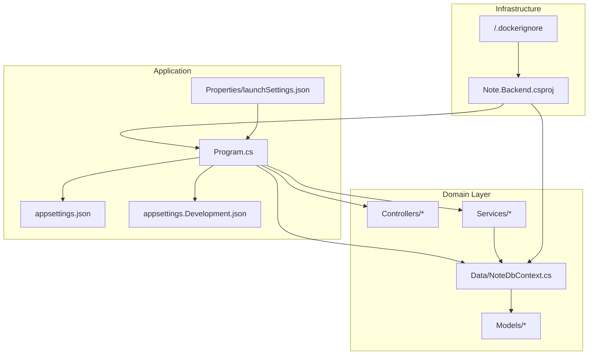
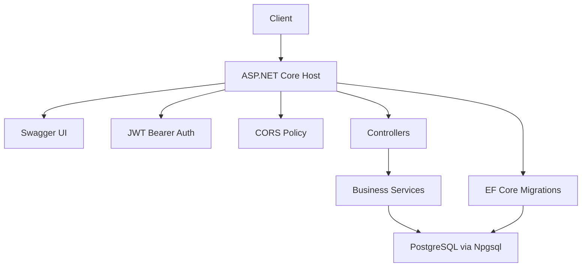
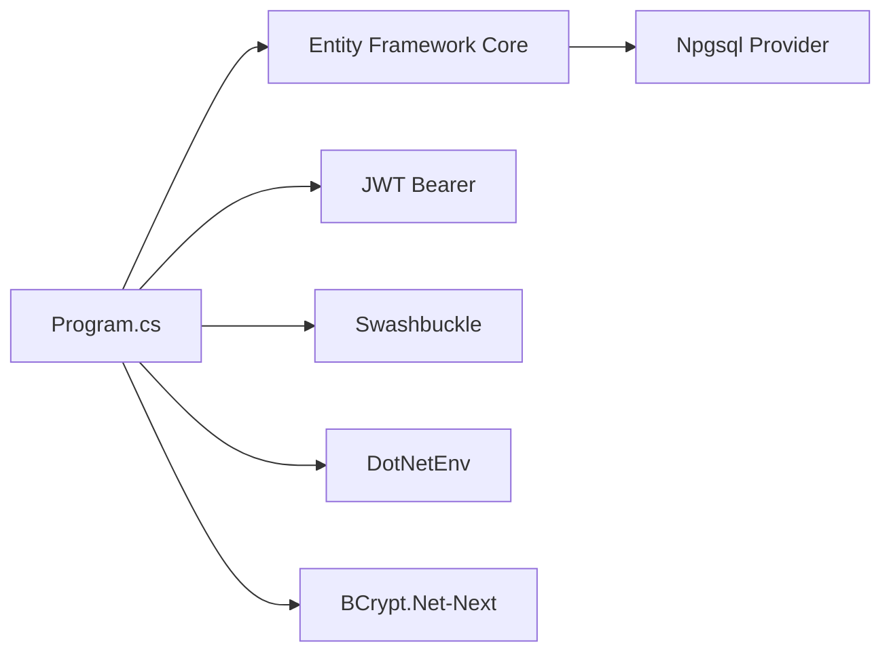
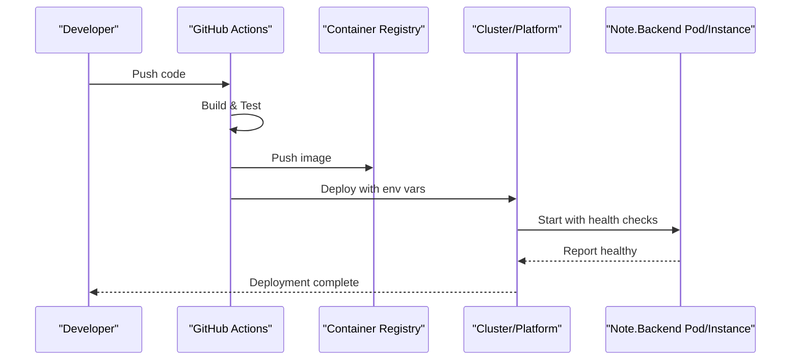
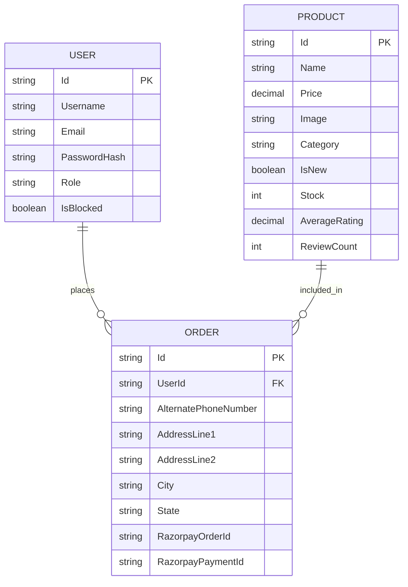

# Deployment Strategies

<cite>
**Referenced Files in This Document**
- [Note.Backend.csproj](file://Note.Backend.csproj)
- [Program.cs](file://Program.cs)
- [appsettings.json](file://appsettings.json)
- [appsettings.Development.json](file://appsettings.Development.json)
- [Properties/launchSettings.json](file://Properties/launchSettings.json)
- [.dockerignore](file://.dockerignore)
- [Controllers/AuthController.cs](file://Controllers/AuthController.cs)
- [Services/AuthService.cs](file://Services/AuthService.cs)
- [Data/NoteDbContext.cs](file://Data/NoteDbContext.cs)
- [Models/User.cs](file://Models/User.cs)
- [Models/Product.cs](file://Models/Product.cs)
</cite>

## Table of Contents
1. [Introduction](#introduction)
2. [Project Structure](#project-structure)
3. [Core Components](#core-components)
4. [Architecture Overview](#architecture-overview)
5. [Detailed Component Analysis](#detailed-component-analysis)
6. [Dependency Analysis](#dependency-analysis)
7. [Performance Considerations](#performance-considerations)
8. [Troubleshooting Guide](#troubleshooting-guide)
9. [Conclusion](#conclusion)
10. [Appendices](#appendices)

## Introduction
This document provides a comprehensive deployment strategy for Note.Backend, covering containerization with Docker, CI/CD pipeline configuration using GitHub Actions, and multi-environment deployment approaches. It documents the build process, dependency management, runtime configuration, and operational practices for cloud providers, container orchestration systems, and traditional servers. Practical examples of deployment artifacts, environment variable injection, health checks, rollback procedures, monitoring, logging, and performance optimization are included to guide production deployments.

## Project Structure
Note.Backend is a .NET 10 web application using ASP.NET Core. It includes:
- Application entrypoint and service configuration
- Entity Framework Core with PostgreSQL via Npgsql
- JWT authentication and CORS policies
- Swagger/OpenAPI documentation
- Controllers and services for business logic
- Data models and seeded data for development
- Configuration files for development and production

**Diagram sources**
- [Program.cs:10-150](file://Program.cs#L10-L150)
- [appsettings.json:1-23](file://appsettings.json#L1-L23)
- [appsettings.Development.json:1-14](file://appsettings.Development.json#L1-L14)
- [Properties/launchSettings.json:1-25](file://Properties/launchSettings.json#L1-L25)
- [Note.Backend.csproj:1-29](file://Note.Backend.csproj#L1-L29)
- [.dockerignore:1-27](file://.dockerignore#L1-L27)
- [Controllers/AuthController.cs:1-76](file://Controllers/AuthController.cs#L1-L76)
- [Services/AuthService.cs:1-98](file://Services/AuthService.cs#L1-L98)
- [Data/NoteDbContext.cs:1-67](file://Data/NoteDbContext.cs#L1-L67)
- [Models/User.cs:1-12](file://Models/User.cs#L1-L12)
- [Models/Product.cs:1-21](file://Models/Product.cs#L1-L21)

**Section sources**
- [Program.cs:10-150](file://Program.cs#L10-L150)
- [Note.Backend.csproj:1-29](file://Note.Backend.csproj#L1-L29)
- [appsettings.json:1-23](file://appsettings.json#L1-L23)
- [appsettings.Development.json:1-14](file://appsettings.Development.json#L1-L14)
- [Properties/launchSettings.json:1-25](file://Properties/launchSettings.json#L1-L25)
- [.dockerignore:1-27](file://.dockerignore#L1-L27)

## Core Components
- Application entrypoint and configuration:
  - Loads environment variables from a .env file
  - Configures controllers, JSON options, Swagger, JWT authentication, CORS, and database context
  - Applies EF Core migrations at startup and performs targeted schema adjustments
- Database:
  - PostgreSQL via Npgsql with automatic migration and schema adjustments
  - Connection string resolution from multiple sources with URI conversion support
- Authentication:
  - JWT bearer authentication with symmetric key validation
  - Password hashing using bcrypt
- Controllers and services:
  - Example AuthController exposes register, login, and change-password endpoints
  - AuthService encapsulates registration, login, token generation, and password changes
- Models and seeding:
  - Domain models for users, products, orders, reviews, coupons, and storefront configuration
  - Seeded admin user and sample products for development

**Section sources**
- [Program.cs:12-150](file://Program.cs#L12-L150)
- [Controllers/AuthController.cs:18-54](file://Controllers/AuthController.cs#L18-L54)
- [Services/AuthService.cs:22-96](file://Services/AuthService.cs#L22-L96)
- [Data/NoteDbContext.cs:23-65](file://Data/NoteDbContext.cs#L23-L65)
- [Models/User.cs:3-11](file://Models/User.cs#L3-L11)
- [Models/Product.cs:3-21](file://Models/Product.cs#L3-L21)

## Architecture Overview
The runtime architecture integrates configuration-driven service registration, middleware pipeline, and database initialization. The application supports environment-specific configuration and externalized secrets via environment variables and .env loading.

**Diagram sources**
- [Program.cs:100-150](file://Program.cs#L100-L150)
- [Controllers/AuthController.cs:1-76](file://Controllers/AuthController.cs#L1-L76)
- [Services/AuthService.cs:1-98](file://Services/AuthService.cs#L1-L98)
- [Data/NoteDbContext.cs:1-67](file://Data/NoteDbContext.cs#L1-L67)

## Detailed Component Analysis

### Containerization with Docker
- Build context and ignore rules:
  - Exclude build outputs, IDE files, and OS artifacts from the image
- Runtime configuration:
  - Environment variables for database connection and JWT key
  - Optional .env loading at startup
- Health checks:
  - Implement a lightweight GET endpoint for readiness/liveness probes
- Multi-stage builds:
  - Use a .NET SDK image for building and a runtime image for the final artifact
- Port exposure:
  - Expose the HTTP port configured by the host (e.g., 8080)
- Secrets management:
  - Inject sensitive values via environment variables or secret volumes

Practical guidance:
- Create a Dockerfile that restores packages, builds the application, and copies outputs to a runtime image
- Mount a volume for logs or configure stdout/stderr redirection
- Use docker-compose for local development and orchestration

**Section sources**
- [.dockerignore:1-27](file://.dockerignore#L1-L27)
- [Program.cs:12-39](file://Program.cs#L12-L39)
- [Program.cs:69-84](file://Program.cs#L69-L84)
- [appsettings.json:2-8](file://appsettings.json#L2-L8)

### CI/CD Pipeline with GitHub Actions
Recommended workflow stages:
- Build:
  - Restore dependencies and publish artifacts
- Test:
  - Run unit tests targeting test projects
- Package:
  - Produce a container image with a versioned tag
- Deploy:
  - Push to a container registry
  - Apply environment-specific configuration via secrets and variables
- Rollback:
  - Tag previous working images and redeploy on failure

Example workflow outline:
- Trigger on push to main and pull requests
- Cache NuGet packages
- Publish test results and coverage
- Build and push image tagged with commit SHA and semantic version
- Deploy to target environment with environment variables injected via secrets

**Section sources**
- [Note.Backend.csproj:9-26](file://Note.Backend.csproj#L9-L26)
- [Program.cs:12-13](file://Program.cs#L12-L13)

### Multi-Environment Deployment Approaches
- Development:
  - Localhost with HTTPS/HTTP profiles and Swagger enabled
  - Cloudinary credentials and logging configured per environment
- Staging:
  - Separate database connection string and JWT key
  - CORS restricted to staging origins
- Production:
  - Environment variables for database, JWT, and Cloudinary
  - HTTPS enforcement and minimal CORS policy
  - Health checks and observability enabled

Environment variable injection:
- DATABASE_URL or ConnectionStrings:DefaultConnection
- Jwt:Key
- Cloudinary:* values
- ASPNETCORE_ENVIRONMENT

**Section sources**
- [Properties/launchSettings.json:4-23](file://Properties/launchSettings.json#L4-L23)
- [appsettings.Development.json:2-13](file://appsettings.Development.json#L2-L13)
- [appsettings.json:2-13](file://appsettings.json#L2-L13)
- [Program.cs:25-39](file://Program.cs#L25-L39)
- [Program.cs:69-84](file://Program.cs#L69-L84)

### Build Process and Dependency Management
- Target framework and package references:
  - .NET 10 with Entity Framework Core, Npgsql provider, JWT bearer, Swashbuckle, and DotNetEnv
- Build steps:
  - Restore packages, compile, and publish
- Migration and schema adjustments:
  - Automatic migrations at startup
  - Additional column additions for Orders table during initialization

**Section sources**
- [Note.Backend.csproj:1-29](file://Note.Backend.csproj#L1-L29)
- [Program.cs:104-138](file://Program.cs#L104-L138)

### Runtime Configuration
- Database connection:
  - Supports key-value and postgresql:// URIs; converts URIs to Npgsql format
- JWT:
  - Symmetric key validation with configurable issuer and audience
- CORS:
  - Allow-all policy for development; tighten in production
- Logging:
  - Default log level and ASP.NET Core warnings

**Section sources**
- [Program.cs:41-59](file://Program.cs#L41-L59)
- [Program.cs:69-96](file://Program.cs#L69-L96)
- [appsettings.json:15-20](file://appsettings.json#L15-L20)

### Deployment Manifests and Examples
- Kubernetes:
  - Deployment with resource limits, liveness/readiness probes, and environment variables
  - Service exposing HTTP port
  - Secret and ConfigMap for database credentials and JWT key
- Docker Compose:
  - Services for app and PostgreSQL
  - Volumes for persistent storage and logs
- Platform-as-a-Service:
  - Environment variables for DATABASE_URL and Jwt:Key
  - Health check endpoint configuration

Health checks:
- Implement GET /health for readiness and liveness
- Use database connectivity verification as part of readiness

Rollback procedures:
- Record current release tag and image digest
- Re-deploy previous tag on failure
- Use blue/green or canary strategies for zero-downtime updates

**Section sources**
- [Program.cs:101-102](file://Program.cs#L101-L102)
- [Program.cs:140-148](file://Program.cs#L140-L148)

### Monitoring, Logging, and Observability
- Logging:
  - Configure log levels per category
  - Redirect logs to stdout/stderr for container orchestration platforms
- Metrics:
  - Expose Prometheus metrics endpoint
  - Track request duration, rate, and error rates
- Tracing:
  - Integrate distributed tracing (e.g., OpenTelemetry)
- Alerts:
  - Monitor health probe failures, error rates, and latency thresholds

**Section sources**
- [appsettings.json:15-20](file://appsettings.json#L15-L20)

### Performance Optimization
- Database:
  - Use connection pooling and keep-alive settings
  - Optimize queries and add appropriate indexes
- Application:
  - Enable response caching for static assets
  - Use asynchronous controllers and services
- Infrastructure:
  - Scale horizontally with multiple replicas
  - Use CDN for media assets (Cloudinary integration)

**Section sources**
- [Program.cs:38-39](file://Program.cs#L38-L39)
- [Services/AuthService.cs:22-96](file://Services/AuthService.cs#L22-L96)

## Dependency Analysis
The application’s runtime dependencies and their roles:
- Entity Framework Core and Npgsql: database access and migrations
- JWT bearer: authentication and authorization
- Swashbuckle: API documentation
- DotNetEnv: environment variable loading
- BCrypt.Net-Next: password hashing

**Diagram sources**
- [Program.cs:10-26](file://Program.cs#L10-L26)
- [Note.Backend.csproj:9-26](file://Note.Backend.csproj#L9-L26)

**Section sources**
- [Program.cs:10-26](file://Program.cs#L10-L26)
- [Note.Backend.csproj:9-26](file://Note.Backend.csproj#L9-L26)

## Performance Considerations
- Startup and migrations:
  - Keep migrations minimal and idempotent
  - Consider offline migrations in CI/CD for large schema changes
- Database:
  - Use connection pooling and tune pool size
  - Add indexes for frequent joins and filters
- Authentication:
  - Use efficient hashing and avoid excessive re-hashing
- Caching:
  - Cache frequently accessed product and storefront configurations
- Network:
  - Minimize cross-region calls; colocate app and database
- Observability:
  - Instrument slow endpoints and track error budgets

[No sources needed since this section provides general guidance]

## Troubleshooting Guide
Common deployment issues and resolutions:
- Database connection errors:
  - Verify DATABASE_URL or ConnectionStrings:DefaultConnection
  - Ensure URI format is supported and converted correctly
- JWT validation failures:
  - Confirm Jwt:Key matches across environments
  - Check issuer and audience configuration
- CORS errors:
  - Restrict AllowAnyOrigin to production origins
- Migration failures:
  - Run migrations manually in staging before production
  - Use offline migrations for destructive changes
- Health probe failures:
  - Implement /health endpoint and verify database connectivity
- Logs:
  - Ensure logs are emitted to stdout/stderr for container platforms

**Section sources**
- [Program.cs:25-39](file://Program.cs#L25-L39)
- [Program.cs:69-84](file://Program.cs#L69-L84)
- [Program.cs:104-138](file://Program.cs#L104-L138)

## Conclusion
This deployment strategy leverages environment-driven configuration, containerization, and CI/CD automation to enable reliable deployments across cloud providers, container orchestration systems, and traditional servers. By externalizing secrets, enforcing HTTPS, implementing health checks, and adopting observability practices, Note.Backend can achieve secure, scalable, and maintainable operations in production.

[No sources needed since this section summarizes without analyzing specific files]

## Appendices

### A. End-to-End Deployment Flow

[No sources needed since this diagram shows conceptual workflow, not actual code structure]

### B. Data Model Overview

**Diagram sources**
- [Models/User.cs:3-11](file://Models/User.cs#L3-L11)
- [Models/Product.cs:3-21](file://Models/Product.cs#L3-L21)
- [Data/NoteDbContext.cs:11-21](file://Data/NoteDbContext.cs#L11-L21)