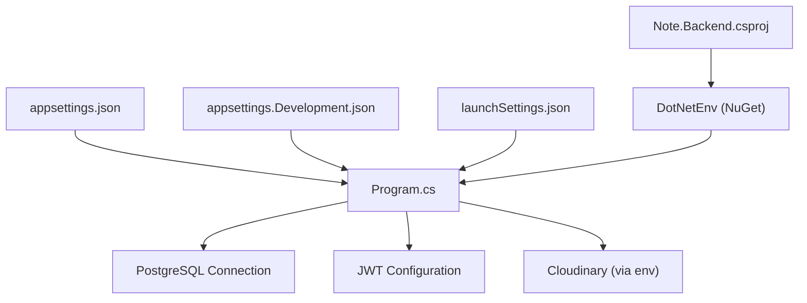
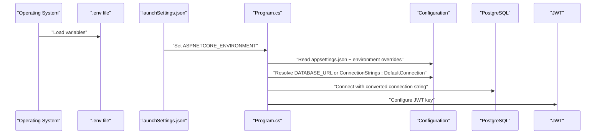
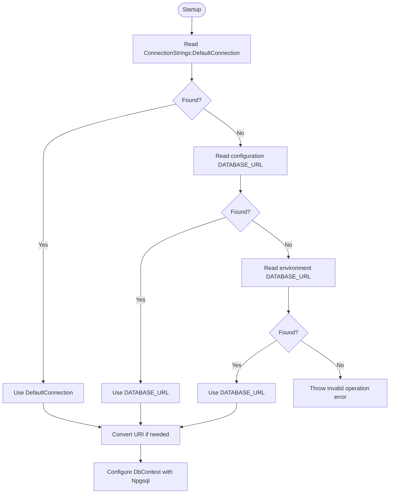
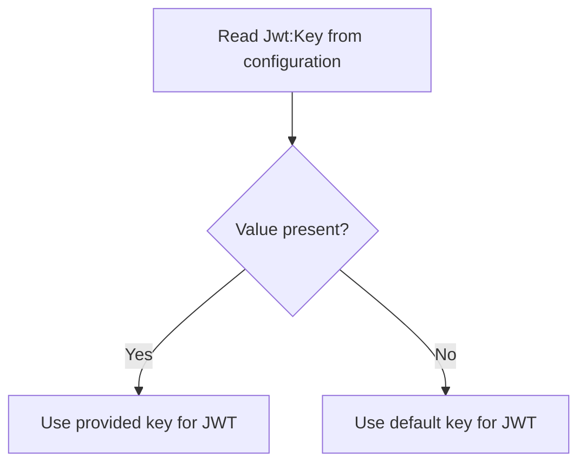
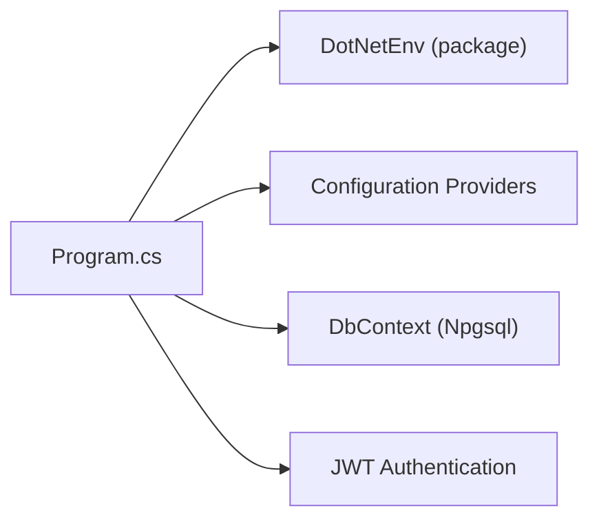

# Environment Setup

<cite>
**Referenced Files in This Document**
- [Program.cs](file://Program.cs)
- [appsettings.json](file://appsettings.json)
- [appsettings.Development.json](file://appsettings.Development.json)
- [launchSettings.json](file://Properties/launchSettings.json)
- [Note.Backend.csproj](file://Note.Backend.csproj)
- [AuthService.cs](file://Services/AuthService.cs)
- [OrderService.cs](file://Services/OrderService.cs)
- [CloudinaryService.cs](file://Services/CloudinaryService.cs)
</cite>

## Table of Contents
1. [Introduction](#introduction)
2. [Project Structure](#project-structure)
3. [Core Components](#core-components)
4. [Architecture Overview](#architecture-overview)
5. [Detailed Component Analysis](#detailed-component-analysis)
6. [Dependency Analysis](#dependency-analysis)
7. [Performance Considerations](#performance-considerations)
8. [Troubleshooting Guide](#troubleshooting-guide)
9. [Conclusion](#conclusion)

## Introduction
This document explains how to configure and manage environments for Note.Backend, covering development and production setups, environment variable management via DotNetEnv, PostgreSQL connection configuration, JWT security keys, and the differences between appsettings.json and appsettings.Development.json. It also provides step-by-step instructions for local development, secrets management, environment-specific overrides, naming conventions, validation, and troubleshooting.

## Project Structure
The environment-related configuration spans several files:
- appsettings.json: Base configuration for all environments
- appsettings.Development.json: Overrides for local development
- Program.cs: Loads .env variables, reads configuration, sets up database and JWT
- launchSettings.json: ASP.NET Core environment profile defaults
- Note.Backend.csproj: Declares DotNetEnv and other runtime dependencies

**Diagram sources**
- [Program.cs:12-13](file://Program.cs#L12-L13)
- [appsettings.json:1-23](file://appsettings.json#L1-L23)
- [appsettings.Development.json:1-14](file://appsettings.Development.json#L1-L14)
- [launchSettings.json:10-11](file://Properties/launchSettings.json#L10-L11)
- [Note.Backend.csproj:12](file://Note.Backend.csproj#L12)

**Section sources**
- [Program.cs:12-13](file://Program.cs#L12-L13)
- [appsettings.json:1-23](file://appsettings.json#L1-L23)
- [appsettings.Development.json:1-14](file://appsettings.Development.json#L1-L14)
- [launchSettings.json:10-11](file://Properties/launchSettings.json#L10-L11)
- [Note.Backend.csproj:12](file://Note.Backend.csproj#L12)

## Core Components
- DotNetEnv loading: The application loads environment variables from a .env file at startup.
- Configuration hierarchy: appsettings.json provides base values; appsettings.Development.json overrides them during Development.
- Database connection: Reads ConnectionStrings:DefaultConnection, DATABASE_URL, or environment variable DATABASE_URL, with support for PostgreSQL URI format conversion.
- JWT: Uses a configurable key from configuration or falls back to a default value.
- Cloudinary: Uses environment variables for credentials in production-like deployments.
- Razorpay: Payment gateway configuration is read from environment variables or configuration.

**Section sources**
- [Program.cs:12-13](file://Program.cs#L12-L13)
- [Program.cs:25-39](file://Program.cs#L25-L39)
- [Program.cs:41-59](file://Program.cs#L41-L59)
- [Program.cs:69-84](file://Program.cs#L69-L84)
- [AuthService.cs:59-81](file://Services/AuthService.cs#L59-L81)
- [CloudinaryService.cs:16-34](file://Services/CloudinaryService.cs#L16-L34)
- [OrderService.cs:120-127](file://Services/OrderService.cs#L120-L127)

## Architecture Overview
The environment configuration pipeline:

**Diagram sources**
- [Program.cs:12-13](file://Program.cs#L12-L13)
- [launchSettings.json:10-11](file://Properties/launchSettings.json#L10-L11)
- [Program.cs:25-39](file://Program.cs#L25-L39)
- [Program.cs:69-84](file://Program.cs#L69-L84)

## Detailed Component Analysis

### Environment Variable Management with DotNetEnv
- Purpose: Load variables from a .env file into the process environment so they can be consumed by configuration providers.
- Behavior: Loaded early in Program.cs before configuration is fully built.
- Impact: Allows overriding appsettings values with .env variables.

Practical notes:
- Place a .env file at the project root with key=value pairs.
- Values in .env are merged into the environment and can override appsettings.json entries.

**Section sources**
- [Program.cs:12-13](file://Program.cs#L12-L13)
- [Note.Backend.csproj:12](file://Note.Backend.csproj#L12)

### Connection String Configuration for PostgreSQL
- Sources and precedence:
  1) ConnectionStrings:DefaultConnection
  2) DATABASE_URL from configuration
  3) DATABASE_URL from environment variables
- Validation: If none are present, the application throws an invalid operation exception.
- URI conversion: If DATABASE_URL starts with a PostgreSQL URI scheme, it is converted to the Npgsql key-value format.

**Diagram sources**
- [Program.cs:25-39](file://Program.cs#L25-L39)
- [Program.cs:41-59](file://Program.cs#L41-L59)

**Section sources**
- [Program.cs:25-39](file://Program.cs#L25-L39)
- [Program.cs:41-59](file://Program.cs#L41-L59)

### JWT Security Key Setup
- Source: Jwt:Key in configuration.
- Fallback: A default key is used if not provided.
- Usage: Configures symmetric key authentication for JWT bearer tokens.

**Diagram sources**
- [Program.cs:69-71](file://Program.cs#L69-L71)
- [AuthService.cs:59-81](file://Services/AuthService.cs#L59-L81)

**Section sources**
- [Program.cs:69-71](file://Program.cs#L69-L71)
- [AuthService.cs:59-81](file://Services/AuthService.cs#L59-L81)

### Differences Between appsettings.json and appsettings.Development.json
- appsettings.json: Base configuration shared across environments (e.g., default connection string, default JWT key, logging levels).
- appsettings.Development.json: Overrides applied when ASPNETCORE_ENVIRONMENT is set to Development (e.g., Cloudinary credentials, logging levels).

Typical override pattern:
- appsettings.json defines a default Cloudinary empty configuration.
- appsettings.Development.json supplies real Cloudinary credentials for local development.

**Section sources**
- [appsettings.json:1-23](file://appsettings.json#L1-L23)
- [appsettings.Development.json:1-14](file://appsettings.Development.json#L1-L14)

### Environment-Specific Overrides and launchSettings.json
- launchSettings.json sets ASPNETCORE_ENVIRONMENT to Development for local profiles.
- This ensures appsettings.Development.json overrides are applied during local runs.

**Section sources**
- [launchSettings.json:10-11](file://Properties/launchSettings.json#L10-L11)

### Secrets Management and Production Considerations
- Cloudinary credentials: Read from environment variables directly in production-like scenarios.
- Razorpay credentials: Read from environment variables or configuration for payment processing.
- Recommendation: Store sensitive values in environment variables or secure secret stores in production; avoid committing secrets to source control.

**Section sources**
- [CloudinaryService.cs:16-34](file://Services/CloudinaryService.cs#L16-L34)
- [OrderService.cs:120-127](file://Services/OrderService.cs#L120-L127)

## Dependency Analysis
DotNetEnv is declared as a NuGet package and is loaded at startup to populate environment variables consumed by configuration providers.

**Diagram sources**
- [Note.Backend.csproj:12](file://Note.Backend.csproj#L12)
- [Program.cs:12-13](file://Program.cs#L12-L13)

**Section sources**
- [Note.Backend.csproj:12](file://Note.Backend.csproj#L12)
- [Program.cs:12-13](file://Program.cs#L12-L13)

## Performance Considerations
- Keep environment variable resolution minimal and centralized (as currently done in Program.cs).
- Avoid excessive configuration reads in hot paths; rely on injected IConfiguration instances.
- Ensure database connection strings are validated early to fail fast rather than during runtime operations.

## Troubleshooting Guide
Common environment setup issues and resolutions:

- No database connection string found
  - Cause: Missing ConnectionStrings:DefaultConnection, DATABASE_URL in configuration, and DATABASE_URL environment variable.
  - Resolution: Set one of these sources. If using a PostgreSQL URI, ensure it is valid and supported by the conversion logic.

- PostgreSQL URI not recognized
  - Cause: Non-standard URI format or missing userinfo/host/port/database.
  - Resolution: Ensure DATABASE_URL follows the supported PostgreSQL URI scheme and includes userinfo, host, port, and database.

- JWT key not configured
  - Cause: Jwt:Key missing from configuration.
  - Resolution: Provide Jwt:Key in configuration or rely on the fallback key (not recommended for production).

- Cloudinary credentials missing in production
  - Cause: Missing CLOUDINARY_CLOUD_NAME, CLOUDINARY_API_KEY, or CLOUDINARY_API_SECRET environment variables.
  - Resolution: Set the three Cloudinary environment variables or supply them via your hosting platform’s secret store.

- Razorpay configuration missing
  - Cause: Missing RAZORPAY_KEY_ID or RAZORPAY_KEY_SECRET.
  - Resolution: Set both environment variables or configuration values for payment processing.

- .env variables not taking effect
  - Cause: .env file not present at the expected location or not loaded before configuration is accessed.
  - Resolution: Confirm .env exists at project root and is loaded early in Program.cs.

**Section sources**
- [Program.cs:30-33](file://Program.cs#L30-L33)
- [Program.cs:41-59](file://Program.cs#L41-L59)
- [Program.cs:69-71](file://Program.cs#L69-L71)
- [CloudinaryService.cs:26-32](file://Services/CloudinaryService.cs#L26-L32)
- [OrderService.cs:120-127](file://Services/OrderService.cs#L120-L127)
- [Program.cs:12-13](file://Program.cs#L12-L13)

## Conclusion
Note.Backend’s environment setup relies on a layered configuration model: appsettings.json for base values, appsettings.Development.json for local overrides, and DotNetEnv for environment variable injection. PostgreSQL connections and JWT keys are resolved from configuration with clear fallbacks and validations. For production, prefer environment variables for secrets and ensure proper overrides are applied through configuration and environment profiles.