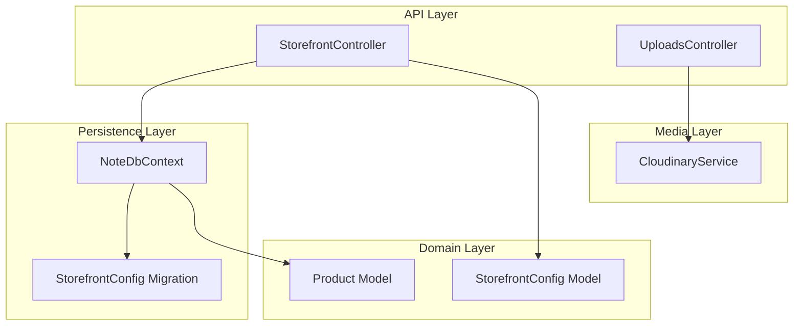
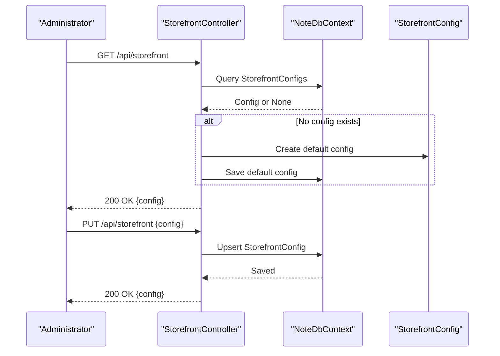
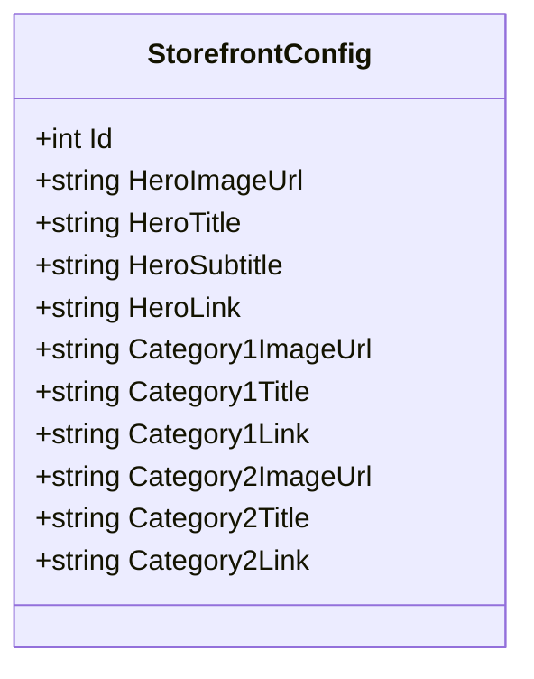
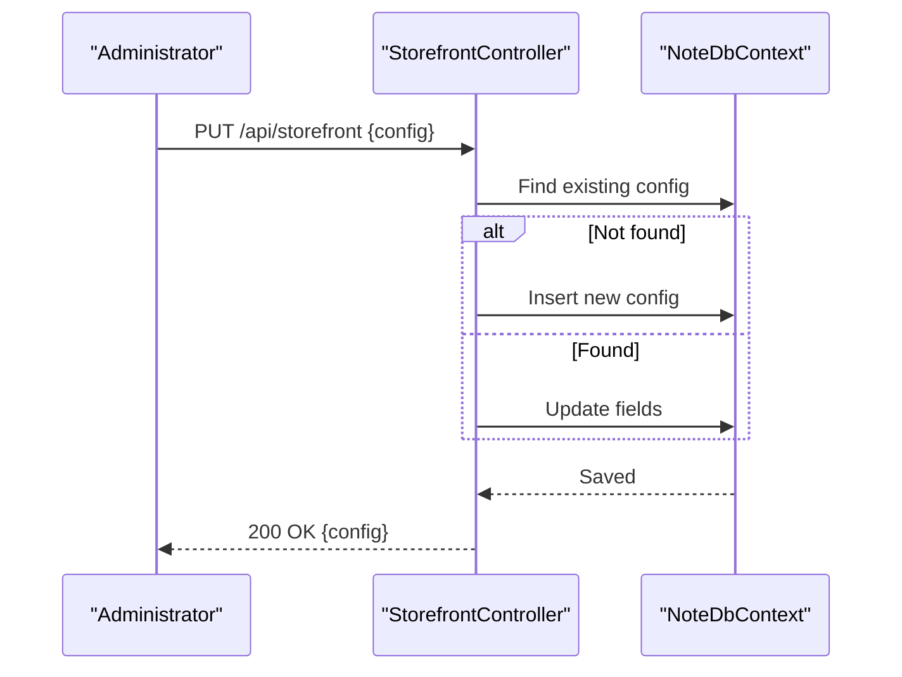
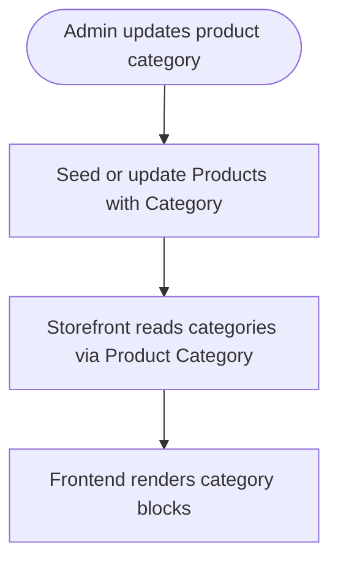
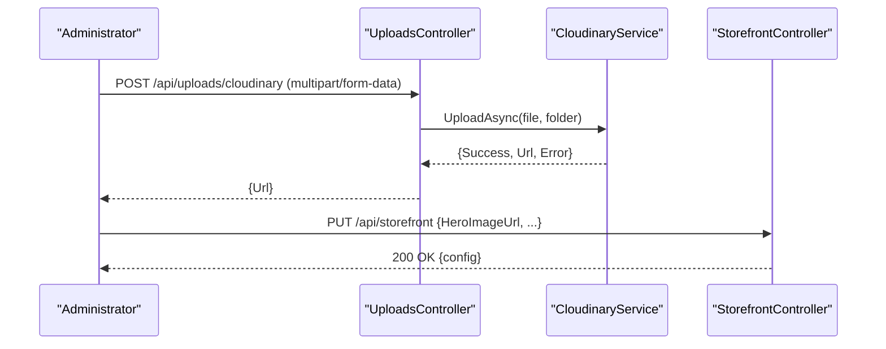
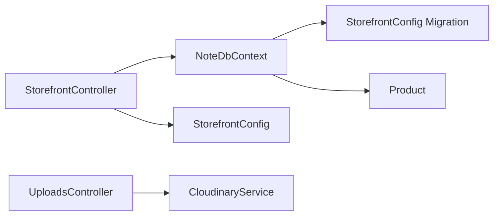

# Content Management System

<cite>
**Referenced Files in This Document**
- [StorefrontConfig.cs](file://Models/StorefrontConfig.cs)
- [StorefrontController.cs](file://Controllers/StorefrontController.cs)
- [NoteDbContext.cs](file://Data/NoteDbContext.cs)
- [20260503221515_AddStorefrontConfig.cs](file://Migrations/20260503221515_AddStorefrontConfig.cs)
- [Program.cs](file://Program.cs)
- [CloudinaryService.cs](file://Services/CloudinaryService.cs)
- [UploadsController.cs](file://Controllers/UploadsController.cs)
- [Product.cs](file://Models/Product.cs)
</cite>

## Table of Contents
1. [Introduction](#introduction)
2. [Project Structure](#project-structure)
3. [Core Components](#core-components)
4. [Architecture Overview](#architecture-overview)
5. [Detailed Component Analysis](#detailed-component-analysis)
6. [Dependency Analysis](#dependency-analysis)
7. [Performance Considerations](#performance-considerations)
8. [Troubleshooting Guide](#troubleshooting-guide)
9. [Conclusion](#conclusion)
10. [Appendices](#appendices)

## Introduction
This document describes the storefront configuration system that enables administrators to manage storefront appearance, promotional content, and marketing campaigns. It covers the StorefrontConfig model, endpoints for retrieving and updating configuration, category management via product categories, and integration with Cloudinary for media uploads. It also outlines content validation, caching strategies, content versioning, A/B testing capabilities, and frontend integration.

## Project Structure
The storefront configuration system spans models, controller, database context, migrations, and services. The primary configuration entity is stored in a dedicated table and exposed via a single controller endpoint. Media assets are uploaded through a separate controller integrated with Cloudinary.

**Diagram sources**
- [StorefrontController.cs:11-77](file://Controllers/StorefrontController.cs#L11-L77)
- [UploadsController.cs:10-79](file://Controllers/UploadsController.cs#L10-L79)
- [StorefrontConfig.cs:3-22](file://Models/StorefrontConfig.cs#L3-L22)
- [Product.cs:3-21](file://Models/Product.cs#L3-L21)
- [NoteDbContext.cs:7-21](file://Data/NoteDbContext.cs#L7-L21)
- [20260503221515_AddStorefrontConfig.cs:14-34](file://Migrations/20260503221515_AddStorefrontConfig.cs#L14-L34)
- [CloudinaryService.cs:7-103](file://Services/CloudinaryService.cs#L7-L103)

**Section sources**
- [StorefrontController.cs:11-77](file://Controllers/StorefrontController.cs#L11-L77)
- [StorefrontConfig.cs:3-22](file://Models/StorefrontConfig.cs#L3-L22)
- [NoteDbContext.cs:7-21](file://Data/NoteDbContext.cs#L7-L21)
- [20260503221515_AddStorefrontConfig.cs:14-34](file://Migrations/20260503221515_AddStorefrontConfig.cs#L14-L34)
- [CloudinaryService.cs:7-103](file://Services/CloudinaryService.cs#L7-L103)
- [UploadsController.cs:10-79](file://Controllers/UploadsController.cs#L10-L79)

## Core Components
- StorefrontConfig model: Defines the storefront’s hero section and two category blocks, including image URLs, titles, subtitles/links, and category links.
- StorefrontController: Provides GET and PUT endpoints for storefront configuration, with admin-only write access.
- NoteDbContext: Exposes StorefrontConfigs and Products, seeds initial data, and applies migrations.
- CloudinaryService and UploadsController: Enable administrators to upload images/videos to Cloudinary and receive secure URLs for configuration fields.

**Section sources**
- [StorefrontConfig.cs:3-22](file://Models/StorefrontConfig.cs#L3-L22)
- [StorefrontController.cs:20-76](file://Controllers/StorefrontController.cs#L20-L76)
- [NoteDbContext.cs:21-65](file://Data/NoteDbContext.cs#L21-L65)
- [CloudinaryService.cs:40-102](file://Services/CloudinaryService.cs#L40-L102)
- [UploadsController.cs:23-78](file://Controllers/UploadsController.cs#L23-L78)

## Architecture Overview
The storefront configuration system follows a layered architecture:
- API layer: StorefrontController exposes configuration endpoints; UploadsController handles media uploads.
- Domain layer: StorefrontConfig and Product models define storefront content and category metadata.
- Persistence layer: EF Core stores configuration in a dedicated table and seeds product/category data.
- Media layer: CloudinaryService integrates with Cloudinary for asset storage and delivery.

**Diagram sources**
- [StorefrontController.cs:20-76](file://Controllers/StorefrontController.cs#L20-L76)
- [NoteDbContext.cs:21-21](file://Data/NoteDbContext.cs#L21-L21)
- [StorefrontConfig.cs:3-22](file://Models/StorefrontConfig.cs#L3-L22)

## Detailed Component Analysis

### StorefrontConfig Model
The model encapsulates:
- Hero section: image URL, title, subtitle, and link.
- Category 1: image URL, title, and link.
- Category 2: image URL, title, and link.

**Diagram sources**
- [StorefrontConfig.cs:3-22](file://Models/StorefrontConfig.cs#L3-L22)

**Section sources**
- [StorefrontConfig.cs:3-22](file://Models/StorefrontConfig.cs#L3-L22)

### StorefrontController Endpoints
- GET /api/storefront
  - Retrieves the current configuration.
  - If none exists, creates and persists a default configuration.
  - Returns the configuration object.
- PUT /api/storefront (Admin-only)
  - Updates the existing configuration or inserts a new one.
  - Requires role “Admin”.
  - Returns the updated configuration.

**Diagram sources**
- [StorefrontController.cs:48-76](file://Controllers/StorefrontController.cs#L48-L76)
- [NoteDbContext.cs:21-21](file://Data/NoteDbContext.cs#L21-L21)

**Section sources**
- [StorefrontController.cs:20-76](file://Controllers/StorefrontController.cs#L20-L76)

### Category Management via Product Categories
Categories displayed in the storefront configuration are derived from the Product model’s Category field. Administrators can influence which categories appear by adding or updating products with desired categories.

**Diagram sources**
- [Product.cs:14](file://Models/Product.cs#L14)
- [NoteDbContext.cs:49-64](file://Data/NoteDbContext.cs#L49-L64)

**Section sources**
- [Product.cs:14](file://Models/Product.cs#L14)
- [NoteDbContext.cs:49-64](file://Data/NoteDbContext.cs#L49-L64)

### Marketing Content Management and Promotional Banners
- Promotional banners and hero content are managed through the StorefrontConfig fields for hero image, title, subtitle, and link.
- Administrators can upload media assets using the UploadsController and CloudinaryService, then paste the resulting URLs into the configuration.

**Diagram sources**
- [UploadsController.cs:23-78](file://Controllers/UploadsController.cs#L23-L78)
- [CloudinaryService.cs:40-102](file://Services/CloudinaryService.cs#L40-L102)
- [StorefrontController.cs:48-76](file://Controllers/StorefrontController.cs#L48-L76)

**Section sources**
- [UploadsController.cs:23-78](file://Controllers/UploadsController.cs#L23-L78)
- [CloudinaryService.cs:40-102](file://Services/CloudinaryService.cs#L40-L102)
- [StorefrontController.cs:48-76](file://Controllers/StorefrontController.cs#L48-L76)

### Content Validation
- Input validation occurs at the HTTP layer via model binding. The PUT endpoint expects a JSON body matching StorefrontConfig.
- Authorization: PUT requires role “Admin”.
- Media validation: UploadsController validates presence of Cloudinary credentials and file content type, returning explicit errors for misconfiguration or invalid uploads.

**Section sources**
- [StorefrontController.cs:48-76](file://Controllers/StorefrontController.cs#L48-L76)
- [UploadsController.cs:23-78](file://Controllers/UploadsController.cs#L23-L78)
- [CloudinaryService.cs:40-102](file://Services/CloudinaryService.cs#L40-L102)

### Caching Strategies
- Current implementation does not include explicit caching for storefront configuration.
- Recommended strategies:
  - HTTP caching: Add ETag/Last-Modified headers on GET /api/storefront.
  - Application caching: Cache configuration in-memory with periodic refresh or change notifications.
  - CDN caching: Serve static assets via Cloudinary URLs with cache-control headers.

[No sources needed since this section provides general guidance]

### Content Versioning and A/B Testing
- Versioning: Introduce a Version field on StorefrontConfig to track changes and enable rollback.
- A/B testing: Extend configuration with variants (e.g., VariantA/B) and expose variant selection via a query parameter or header. Frontend can switch content sets based on variant assignment.

[No sources needed since this section provides general guidance]

### Frontend Integration
- Frontend consumes GET /api/storefront to render hero and category blocks.
- Frontend can trigger PUT /api/storefront to update content after administrator actions.
- Media URLs returned by CloudinaryService are used for hero and category images.

[No sources needed since this section provides general guidance]

## Dependency Analysis
- StorefrontController depends on NoteDbContext for persistence and StorefrontConfig for data transfer.
- UploadsController depends on ICloudinaryService and CloudinaryService for media uploads.
- NoteDbContext exposes StorefrontConfigs and Products, seeding initial data and applying migrations.

**Diagram sources**
- [StorefrontController.cs:13-18](file://Controllers/StorefrontController.cs#L13-L18)
- [UploadsController.cs:12-21](file://Controllers/UploadsController.cs#L12-L21)
- [NoteDbContext.cs:21-21](file://Data/NoteDbContext.cs#L21-L21)
- [20260503221515_AddStorefrontConfig.cs:14-34](file://Migrations/20260503221515_AddStorefrontConfig.cs#L14-L34)
- [Product.cs:3-21](file://Models/Product.cs#L3-L21)

**Section sources**
- [StorefrontController.cs:13-18](file://Controllers/StorefrontController.cs#L13-L18)
- [UploadsController.cs:12-21](file://Controllers/UploadsController.cs#L12-L21)
- [NoteDbContext.cs:21-21](file://Data/NoteDbContext.cs#L21-L21)
- [20260503221515_AddStorefrontConfig.cs:14-34](file://Migrations/20260503221515_AddStorefrontConfig.cs#L14-L34)
- [Product.cs:3-21](file://Models/Product.cs#L3-L21)

## Performance Considerations
- Minimize database round-trips by caching configuration in memory with invalidation on updates.
- Use CDN for media assets to reduce latency and bandwidth.
- Batch updates for configuration changes to avoid frequent writes.

[No sources needed since this section provides general guidance]

## Troubleshooting Guide
- Cloudinary not configured:
  - Symptoms: UploadsController returns 400 with a message indicating missing Cloudinary configuration.
  - Resolution: Set environment variables CLOUDINARY_CLOUD_NAME, CLOUDINARY_API_KEY, CLOUDINARY_API_SECRET.
- Unauthorized access to PUT /api/storefront:
  - Symptoms: 401/403 responses when role “Admin” is missing.
  - Resolution: Ensure the caller has the Admin role and valid JWT bearer token.
- Default configuration not returned:
  - Symptoms: GET /api/storefront returns null or unexpected state.
  - Resolution: Verify migrations are applied and StorefrontConfigs table exists.

**Section sources**
- [UploadsController.cs:61-77](file://Controllers/UploadsController.cs#L61-L77)
- [StorefrontController.cs:48-76](file://Controllers/StorefrontController.cs#L48-L76)
- [20260503221515_AddStorefrontConfig.cs:14-34](file://Migrations/20260503221515_AddStorefrontConfig.cs#L14-L34)

## Conclusion
The storefront configuration system provides a straightforward mechanism for administrators to manage hero content and category blocks. By leveraging Cloudinary for media uploads and extending the model with versioning and A/B testing, the system can evolve to support advanced content management scenarios while remaining easy to operate and integrate with the frontend.

## Appendices

### API Definitions
- GET /api/storefront
  - Description: Retrieve storefront configuration. Creates default configuration if none exists.
  - Response: 200 OK with StorefrontConfig object.
- PUT /api/storefront
  - Description: Update storefront configuration (Admin-only).
  - Authentication: Bearer token with Admin role.
  - Request body: StorefrontConfig object.
  - Response: 200 OK with updated StorefrontConfig object.

**Section sources**
- [StorefrontController.cs:20-76](file://Controllers/StorefrontController.cs#L20-L76)

### Database Schema
- StorefrontConfigs table columns:
  - Id (PK), HeroImageUrl, HeroTitle, HeroSubtitle, HeroLink, Category1ImageUrl, Category1Title, Category1Link, Category2ImageUrl, Category2Title, Category2Link.

**Section sources**
- [20260503221515_AddStorefrontConfig.cs:14-34](file://Migrations/20260503221515_AddStorefrontConfig.cs#L14-L34)
- [NoteDbContext.cs:21](file://Data/NoteDbContext.cs#L21-L21)

### Practical Examples
- Updating storefront content:
  - Call PUT /api/storefront with a JSON payload containing hero and category fields.
- Managing promotional banners:
  - Upload an image/video via POST /api/uploads/cloudinary and use the returned URL in HeroImageUrl.
- Configuring category displays:
  - Ensure products exist with the desired Category values; storefront reads categories from Product entries.

**Section sources**
- [StorefrontController.cs:48-76](file://Controllers/StorefrontController.cs#L48-L76)
- [UploadsController.cs:23-78](file://Controllers/UploadsController.cs#L23-L78)
- [Product.cs:14](file://Models/Product.cs#L14)