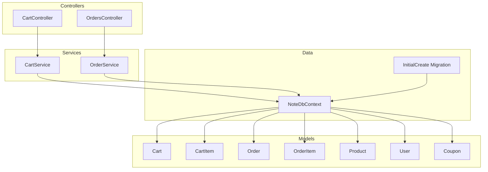
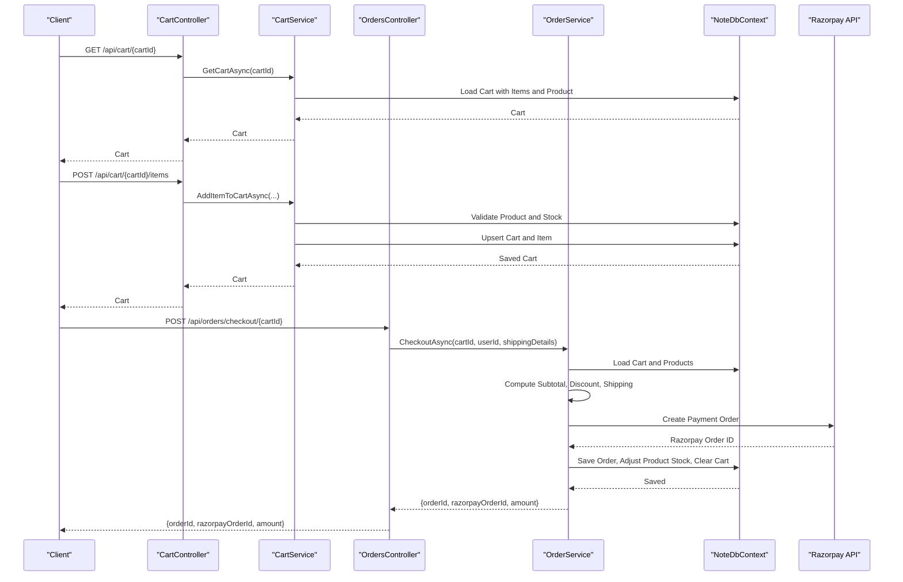
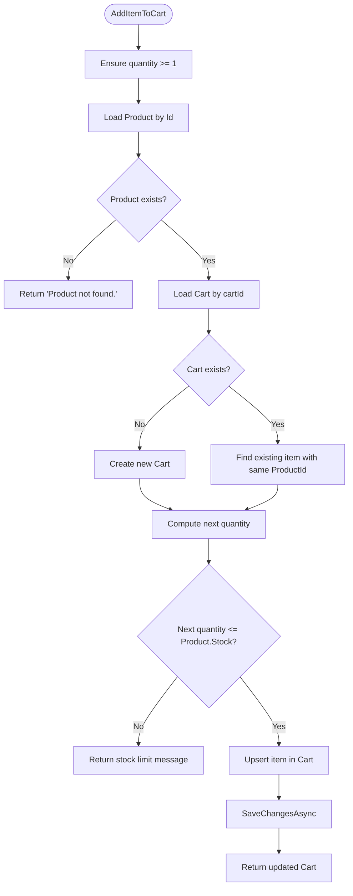
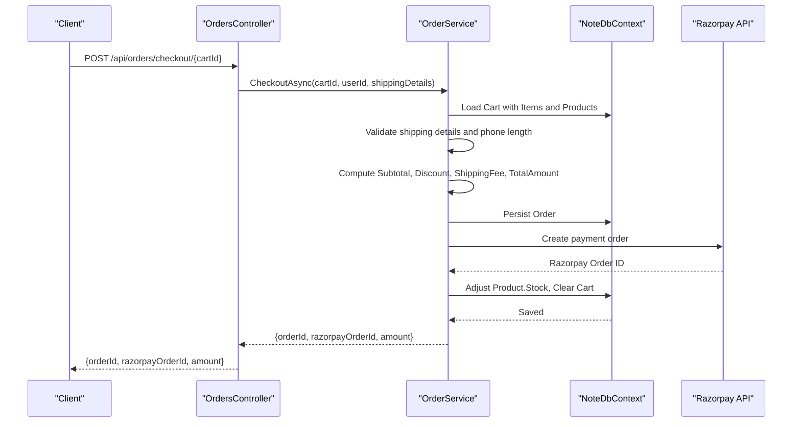
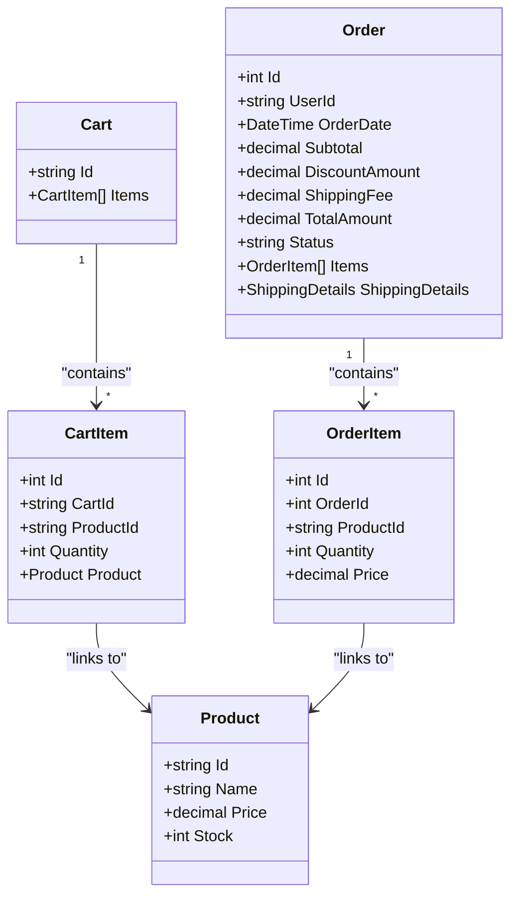
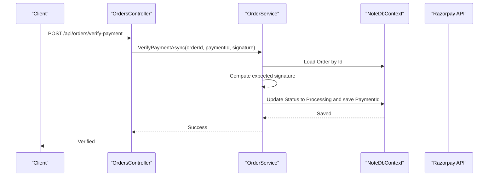
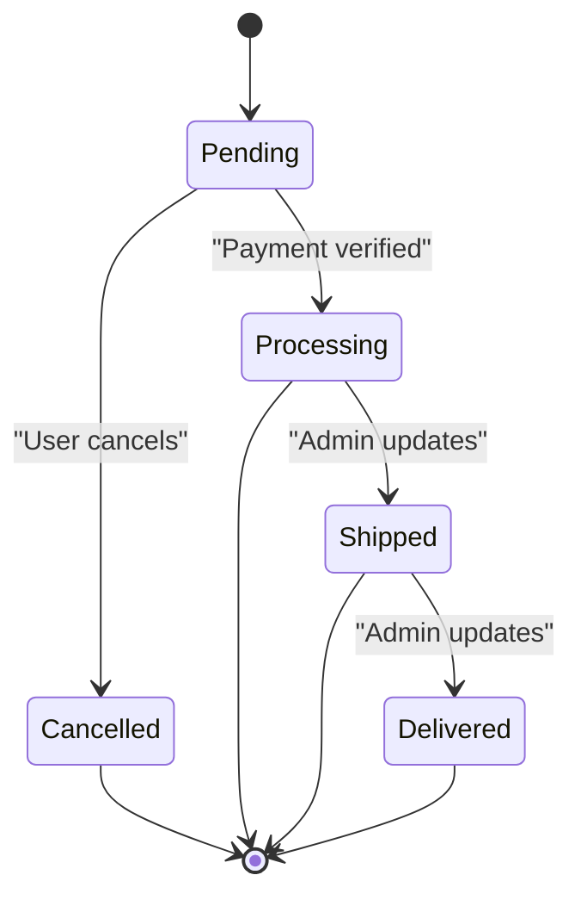
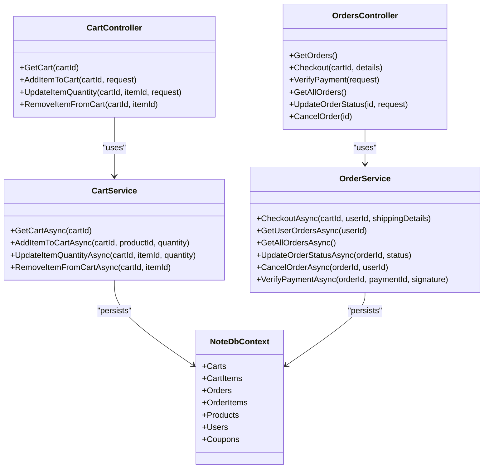

# Cart and Order Entities

<cite>
**Referenced Files in This Document**
- [Cart.cs](file://Models/Cart.cs)
- [CartItem.cs](file://Models/CartItem.cs)
- [Order.cs](file://Models/Order.cs)
- [Product.cs](file://Models/Product.cs)
- [User.cs](file://Models/User.cs)
- [Coupon.cs](file://Models/Coupon.cs)
- [CartService.cs](file://Services/CartService.cs)
- [OrderService.cs](file://Services/OrderService.cs)
- [ICartService.cs](file://Services/ICartService.cs)
- [IOrderService.cs](file://Services/IOrderService.cs)
- [CartController.cs](file://Controllers/CartController.cs)
- [OrdersController.cs](file://Controllers/OrdersController.cs)
- [NoteDbContext.cs](file://Data/NoteDbContext.cs)
- [20260427184435_InitialCreate.cs](file://Migrations/20260427184435_InitialCreate.cs)
</cite>

## Table of Contents
1. [Introduction](#introduction)
2. [Project Structure](#project-structure)
3. [Core Components](#core-components)
4. [Architecture Overview](#architecture-overview)
5. [Detailed Component Analysis](#detailed-component-analysis)
6. [Dependency Analysis](#dependency-analysis)
7. [Performance Considerations](#performance-considerations)
8. [Troubleshooting Guide](#troubleshooting-guide)
9. [Conclusion](#conclusion)

## Introduction
This document provides comprehensive documentation for the Cart and Order entities and their associated items in the Note.Backend system. It explains the structure of the Cart and Order models, their relationships with Products and Users, and the business logic governing cart management and order processing. It also covers quantity management, pricing calculations, shipping details, payment integration via Razorpay, order state transitions, and inventory adjustments.

## Project Structure
The system follows a layered architecture:
- Models define the domain entities and value objects.
- Services encapsulate business logic for cart and order operations.
- Controllers expose REST endpoints for client interaction.
- Data context manages persistence and relationships.
- Migrations define the database schema.

**Diagram sources**
- [CartController.cs:1-59](file://Controllers/CartController.cs#L1-L59)
- [OrdersController.cs:1-121](file://Controllers/OrdersController.cs#L1-L121)
- [CartService.cs:1-106](file://Services/CartService.cs#L1-L106)
- [OrderService.cs:1-270](file://Services/OrderService.cs#L1-L270)
- [NoteDbContext.cs:1-67](file://Data/NoteDbContext.cs#L1-L67)
- [20260427184435_InitialCreate.cs:1-359](file://Migrations/20260427184435_InitialCreate.cs#L1-L359)

**Section sources**
- [CartController.cs:1-59](file://Controllers/CartController.cs#L1-L59)
- [OrdersController.cs:1-121](file://Controllers/OrdersController.cs#L1-L121)
- [CartService.cs:1-106](file://Services/CartService.cs#L1-L106)
- [OrderService.cs:1-270](file://Services/OrderService.cs#L1-L270)
- [NoteDbContext.cs:1-67](file://Data/NoteDbContext.cs#L1-L67)
- [20260427184435_InitialCreate.cs:1-359](file://Migrations/20260427184435_InitialCreate.cs#L1-L359)

## Core Components
- Cart: Represents a user’s shopping cart identified by a cartId. Contains a collection of CartItem entries.
- CartItem: Links a Product to a Cart with a specific quantity.
- Order: Represents a finalized purchase by a User, including shipping details, totals, and items.
- OrderItem: Represents a Product included in an Order with quantity and the price at the time of purchase.
- Product: Product catalog with pricing and stock levels.
- User: Customer identity used to associate Orders.
- Coupon: Discount codes applied during checkout.

Key relationships:
- Cart belongs to a cartId and contains many CartItem entries.
- CartItem links to Product and Cart.
- Order belongs to a User and contains many OrderItem entries.
- OrderItem links to Product and Order.
- Coupon is referenced by Order via CouponCode.

**Section sources**
- [Cart.cs:1-10](file://Models/Cart.cs#L1-L10)
- [CartItem.cs:1-12](file://Models/CartItem.cs#L1-L12)
- [Order.cs:1-62](file://Models/Order.cs#L1-L62)
- [Product.cs:1-21](file://Models/Product.cs#L1-L21)
- [User.cs:1-12](file://Models/User.cs#L1-L12)
- [Coupon.cs:1-9](file://Models/Coupon.cs#L1-L9)

## Architecture Overview
The system integrates cart and order operations through service layers and controllers. Cart operations manage item quantities and persistence, while order operations validate cart contents, compute totals, integrate with a payment provider, and adjust inventory.

**Diagram sources**
- [CartController.cs:1-59](file://Controllers/CartController.cs#L1-L59)
- [CartService.cs:1-106](file://Services/CartService.cs#L1-L106)
- [OrdersController.cs:1-121](file://Controllers/OrdersController.cs#L1-L121)
- [OrderService.cs:1-270](file://Services/OrderService.cs#L1-L270)
- [NoteDbContext.cs:1-67](file://Data/NoteDbContext.cs#L1-L67)

## Detailed Component Analysis

### Cart Entity and Management
The Cart entity stores a collection of CartItem entries. CartService provides operations to:
- Retrieve a cart by cartId, creating it if it does not exist.
- Add items to the cart, validating product existence and stock availability.
- Update item quantities with stock checks.
- Remove items from the cart.

Business rules:
- Minimum quantity is enforced at 1.
- Adding an item increases the quantity if the product is already in the cart.
- Stock availability is validated before adding or updating items.
- Out-of-stock products cannot be added to the cart.

**Diagram sources**
- [CartService.cs:33-73](file://Services/CartService.cs#L33-L73)

**Section sources**
- [Cart.cs:1-10](file://Models/Cart.cs#L1-L10)
- [CartItem.cs:1-12](file://Models/CartItem.cs#L1-L12)
- [CartService.cs:1-106](file://Services/CartService.cs#L1-L106)
- [ICartService.cs:1-12](file://Services/ICartService.cs#L1-L12)

### Order Entity and Processing Workflow
The Order entity captures:
- User association and order date.
- Totals: Subtotal, DiscountAmount, ShippingFee, TotalAmount.
- Shipping details including address components and landmark.
- Items as OrderItem entries with ProductId, Quantity, and Price at purchase time.
- Payment integration via Razorpay with OrderId and PaymentId.

OrderService orchestrates checkout:
- Validates shipping details and phone number length.
- Loads the cart and validates each item’s product availability and stock.
- Computes Subtotal, applies Coupon discounts, determines ShippingFee, and calculates TotalAmount.
- Calls Razorpay to create a payment order and persists the Order.
- Adjusts Product stock for each ordered item.
- Clears the Cart upon successful order placement.

Order state transitions:
- Payment verification sets Status to Processing.
- Admin can update Status to Shipped/Delivered.
- Users can cancel Pending orders, which restores stock.

**Diagram sources**
- [OrdersController.cs:31-51](file://Controllers/OrdersController.cs#L31-L51)
- [OrderService.cs:23-187](file://Services/OrderService.cs#L23-L187)
- [NoteDbContext.cs:1-67](file://Data/NoteDbContext.cs#L1-L67)

**Section sources**
- [Order.cs:1-62](file://Models/Order.cs#L1-L62)
- [OrderService.cs:1-270](file://Services/OrderService.cs#L1-L270)
- [IOrderService.cs:1-14](file://Services/IOrderService.cs#L1-L14)

### Relationship Between CartItem and OrderItem
- CartItem contains ProductId and Quantity and links to Product.
- During checkout, CartItem entries are transformed into OrderItem entries with the same ProductId and Quantity, and the Price captured at the time of purchase is stored in OrderItem.Price.
- After checkout, the Cart is cleared, and Product stock is decremented accordingly.

**Diagram sources**
- [Cart.cs:1-10](file://Models/Cart.cs#L1-L10)
- [CartItem.cs:1-12](file://Models/CartItem.cs#L1-L12)
- [Order.cs:1-62](file://Models/Order.cs#L1-L62)
- [Product.cs:1-21](file://Models/Product.cs#L1-L21)

**Section sources**
- [CartService.cs:33-73](file://Services/CartService.cs#L33-L73)
- [OrderService.cs:112-118](file://Services/OrderService.cs#L112-L118)

### Pricing and Quantity Management
- Subtotal is computed as the sum of (CartItem.Quantity × Product.Price) for all items in the cart.
- Coupon discounts are applied as a percentage of Subtotal if valid and active.
- ShippingFee is free if Subtotal minus DiscountAmount is greater than or equal to a threshold; otherwise a fixed fee applies.
- TotalAmount equals Subtotal minus DiscountAmount plus ShippingFee.
- Quantities are validated against Product.Stock during add/update operations and during checkout.

Examples of business rules:
- Minimum quantity enforced at 1.
- Out-of-stock items cannot be added to the cart.
- During checkout, if any item’s quantity exceeds Product.Stock, the operation fails with a specific message.
- After successful checkout, Product.Stock is decremented by the ordered quantity.

**Section sources**
- [OrderService.cs:73-89](file://Services/OrderService.cs#L73-L89)
- [CartService.cs:35-56](file://Services/CartService.cs#L35-L56)
- [Product.cs:17-17](file://Models/Product.cs#L17-L17)

### Payment Integration and Verification
- Checkout creates a Razorpay order with amount in paise and receipt.
- The Order is persisted with the Razorpay OrderId.
- Payment verification uses HMAC-SHA256 with the configured key secret to validate signatures.
- On successful verification, the Order Status transitions to Processing and the PaymentId is recorded.

**Diagram sources**
- [OrdersController.cs:53-71](file://Controllers/OrdersController.cs#L53-L71)
- [OrderService.cs:240-268](file://Services/OrderService.cs#L240-L268)

**Section sources**
- [OrderService.cs:120-187](file://Services/OrderService.cs#L120-L187)
- [OrderService.cs:240-268](file://Services/OrderService.cs#L240-L268)

### Fulfillment Tracking and Order State Transitions
- Order Status starts as Pending.
- Payment verification sets Status to Processing.
- Admin can update Status to Shipped or Delivered.
- Users can cancel Pending orders, which restores Product stock.

**Diagram sources**
- [Order.cs:14-14](file://Models/Order.cs#L14-L14)
- [OrderService.cs:208-238](file://Services/OrderService.cs#L208-L238)

**Section sources**
- [Order.cs:14-14](file://Models/Order.cs#L14-L14)
- [OrderService.cs:208-238](file://Services/OrderService.cs#L208-L238)

## Dependency Analysis
The following diagram shows the relationships among models, services, controllers, and the data context.

**Diagram sources**
- [CartController.cs:1-59](file://Controllers/CartController.cs#L1-L59)
- [OrdersController.cs:1-121](file://Controllers/OrdersController.cs#L1-L121)
- [CartService.cs:1-106](file://Services/CartService.cs#L1-L106)
- [OrderService.cs:1-270](file://Services/OrderService.cs#L1-L270)
- [NoteDbContext.cs:1-67](file://Data/NoteDbContext.cs#L1-L67)

**Section sources**
- [CartController.cs:1-59](file://Controllers/CartController.cs#L1-L59)
- [OrdersController.cs:1-121](file://Controllers/OrdersController.cs#L1-L121)
- [CartService.cs:1-106](file://Services/CartService.cs#L1-L106)
- [OrderService.cs:1-270](file://Services/OrderService.cs#L1-L270)
- [NoteDbContext.cs:1-67](file://Data/NoteDbContext.cs#L1-L67)

## Performance Considerations
- Lazy loading and eager loading: Services use Include and ThenInclude to load related entities efficiently, reducing N+1 queries.
- Validation early exits: Services validate inputs and product availability before heavy operations to minimize unnecessary database calls.
- Single transaction boundary: Checkout performs all operations in a single transaction-like flow, saving changes once at the end.
- Indexes: Database migrations create indexes on foreign keys and composite unique indexes for performance.

[No sources needed since this section provides general guidance]

## Troubleshooting Guide
Common issues and resolutions:
- Product not found: Occurs when attempting to add a non-existent product to the cart. Ensure ProductId is valid.
- Out of stock: Adding or updating an item quantity exceeding Product.Stock triggers an error. Reduce quantity or wait for restock.
- Empty cart or not found: Checkout requires a non-empty cart. Add items before checking out.
- Invalid shipping details: All required shipping fields must be present and phone number must be within acceptable length. Correct the shipping details.
- Coupon invalid: Only active coupons are accepted. Verify coupon code and status.
- Payment gateway configuration missing: Ensure Razorpay credentials are configured. Otherwise, payment order creation will fail.
- Payment verification failure: Signature mismatch indicates tampering or incorrect configuration. Verify key secret and payload.

**Section sources**
- [CartService.cs:37-56](file://Services/CartService.cs#L37-L56)
- [OrderService.cs:55-86](file://Services/OrderService.cs#L55-L86)
- [OrderService.cs:124-133](file://Services/OrderService.cs#L124-L133)
- [OrderService.cs:246-248](file://Services/OrderService.cs#L246-L248)

## Conclusion
The Cart and Order subsystems in Note.Backend provide a robust foundation for managing customer shopping experiences. CartService ensures cart integrity with stock validations and persistence, while OrderService handles checkout, payment integration, inventory adjustments, and order lifecycle management. The clear separation of concerns across models, services, controllers, and data context enables maintainability and extensibility.