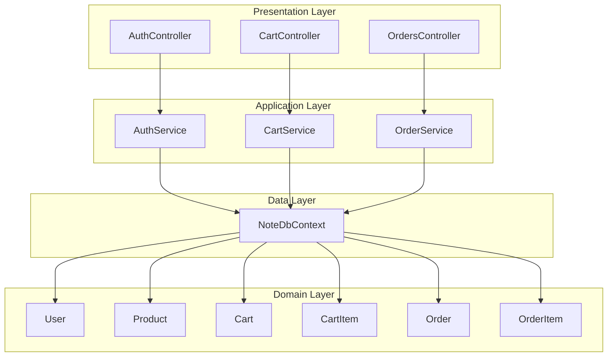
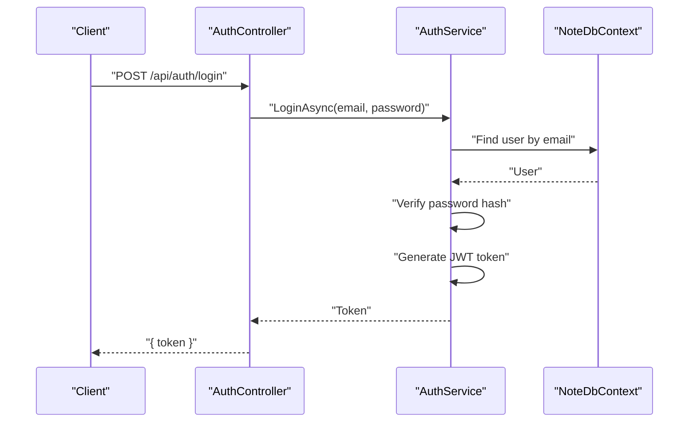
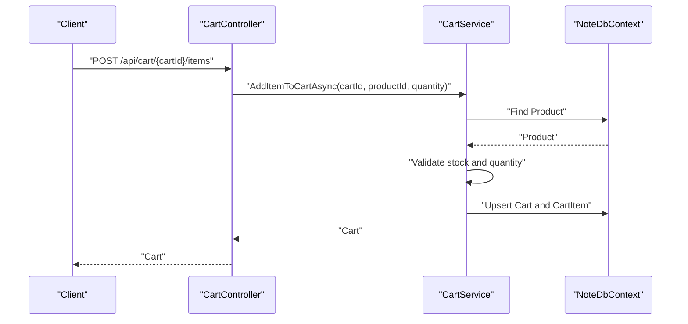
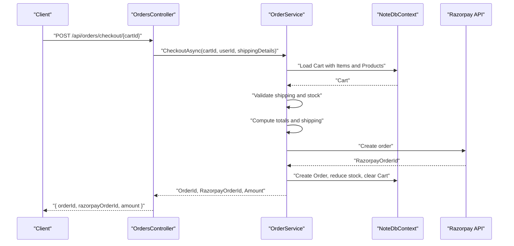
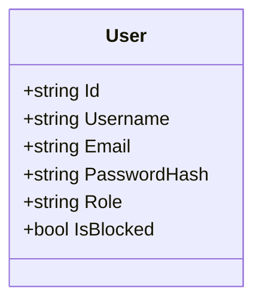
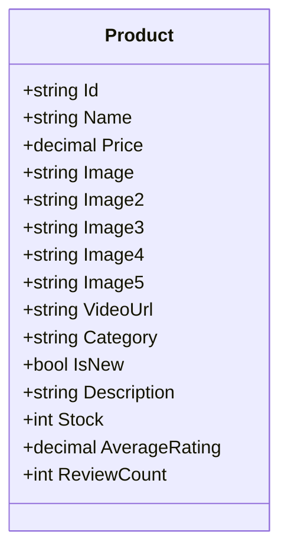
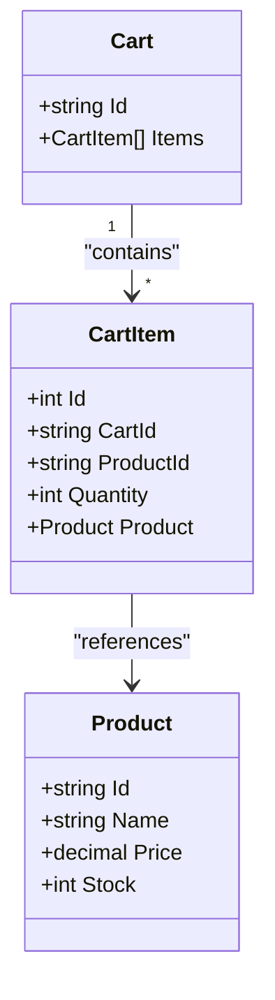
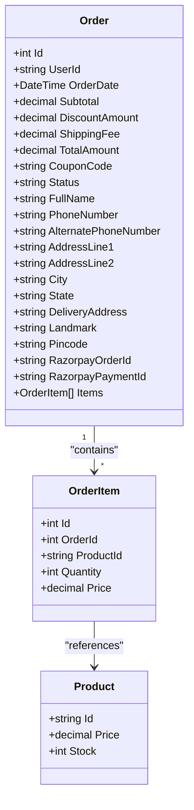
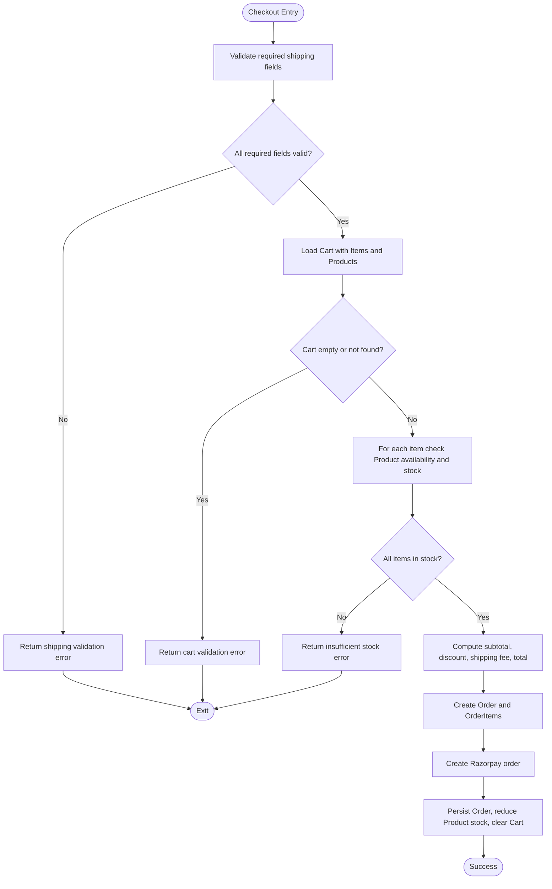
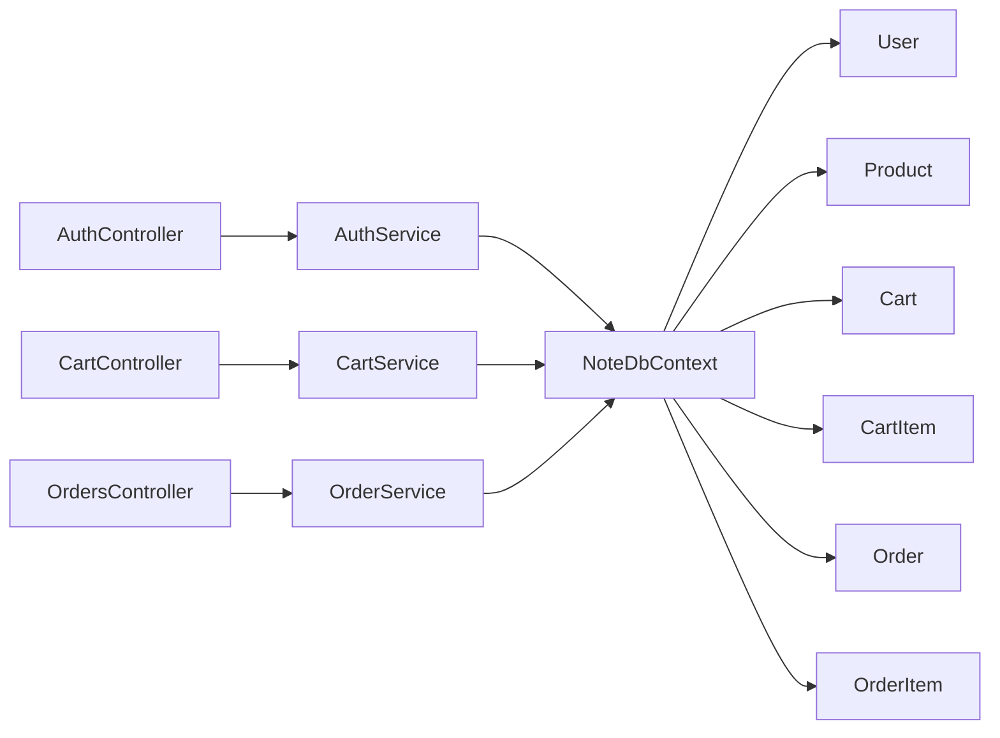

# Core Business Entities

<cite>
**Referenced Files in This Document**
- [User.cs](file://Models/User.cs)
- [Product.cs](file://Models/Product.cs)
- [Cart.cs](file://Models/Cart.cs)
- [CartItem.cs](file://Models/CartItem.cs)
- [Order.cs](file://Models/Order.cs)
- [NoteDbContext.cs](file://Data/NoteDbContext.cs)
- [AuthService.cs](file://Services/AuthService.cs)
- [CartService.cs](file://Services/CartService.cs)
- [OrderService.cs](file://Services/OrderService.cs)
- [AuthController.cs](file://Controllers/AuthController.cs)
- [CartController.cs](file://Controllers/CartController.cs)
- [OrdersController.cs](file://Controllers/OrdersController.cs)
- [Program.cs](file://Program.cs)
</cite>

## Table of Contents
1. [Introduction](#introduction)
2. [Project Structure](#project-structure)
3. [Core Components](#core-components)
4. [Architecture Overview](#architecture-overview)
5. [Detailed Component Analysis](#detailed-component-analysis)
6. [Dependency Analysis](#dependency-analysis)
7. [Performance Considerations](#performance-considerations)
8. [Troubleshooting Guide](#troubleshooting-guide)
9. [Conclusion](#conclusion)

## Introduction
This document provides comprehensive documentation for the core business entities in the Note.Backend system. It focuses on the User, Product, Cart, CartItem, Order, and OrderItem entities, detailing their fields, data types, validation rules, business constraints, and relationships. It also explains how these entities integrate with services and controllers to implement authentication, shopping cart management, and order processing workflows.

## Project Structure
The backend follows a layered architecture:
- Models define domain entities and DTOs.
- Data layer manages persistence via Entity Framework Core.
- Services encapsulate business logic for authentication, cart, and order operations.
- Controllers expose REST endpoints and coordinate between services and models.

**Diagram sources**
- [AuthController.cs:1-76](file://Controllers/AuthController.cs#L1-L76)
- [CartController.cs:1-59](file://Controllers/CartController.cs#L1-L59)
- [OrdersController.cs:1-121](file://Controllers/OrdersController.cs#L1-L121)
- [AuthService.cs:1-98](file://Services/AuthService.cs#L1-L98)
- [CartService.cs:1-106](file://Services/CartService.cs#L1-L106)
- [OrderService.cs:1-270](file://Services/OrderService.cs#L1-L270)
- [NoteDbContext.cs:1-67](file://Data/NoteDbContext.cs#L1-L67)

**Section sources**
- [Program.cs:100-150](file://Program.cs#L100-L150)
- [NoteDbContext.cs:7-22](file://Data/NoteDbContext.cs#L7-L22)

## Core Components
This section documents each core entity with its fields, data types, constraints, and business rules.

### User
- Purpose: Represents an authenticated user with roles and authentication state.
- Fields and constraints:
  - Id: string, generated by the system; serves as primary key.
  - Username: string, required.
  - Email: string, required; used for login and uniqueness enforced by the application logic.
  - PasswordHash: string, required; securely hashed.
  - Role: string, allowed values include "User" and "Admin"; defaults to "User".
  - IsBlocked: boolean; prevents login if true.
- Validation and business rules:
  - Registration checks for duplicate email.
  - Login verifies password hash and blocks blocked accounts.
  - JWT claims include sub, email, name, role, and a custom role claim.
- Usage patterns:
  - Authenticated endpoints use the authenticated user’s Id for operations (e.g., retrieving orders, changing passwords).
  - Admin-only endpoints require the Role claim to be "Admin".

**Section sources**
- [User.cs:1-12](file://Models/User.cs#L1-L12)
- [AuthService.cs:22-57](file://Services/AuthService.cs#L22-L57)
- [AuthService.cs:83-96](file://Services/AuthService.cs#L83-L96)
- [AuthController.cs:18-54](file://Controllers/AuthController.cs#L18-L54)
- [Program.cs:69-84](file://Program.cs#L69-L84)

### Product
- Purpose: Represents items available for purchase, including pricing, inventory, media, and ratings.
- Fields and constraints:
  - Id: string, primary key.
  - Name: string, required.
  - Price: decimal, required; non-negative.
  - Image and optional images: strings representing media URLs.
  - VideoUrl: optional string.
  - Category: string, required.
  - IsNew: boolean flag.
  - Description: optional string.
  - Stock: integer, default 25; non-negative.
  - AverageRating: decimal; reflects product rating metrics.
  - ReviewCount: integer; reflects review volume.
- Validation and business rules:
  - Stock determines availability for cart and checkout.
  - Initial seed data includes multiple products with default stock and category.
- Usage patterns:
  - Cart and order item collections reference Product to compute totals and enforce stock limits.

**Section sources**
- [Product.cs:1-21](file://Models/Product.cs#L1-L21)
- [NoteDbContext.cs:49-59](file://Data/NoteDbContext.cs#L49-L59)

### Cart
- Purpose: Holds temporary selections of products before checkout.
- Fields and constraints:
  - Id: string, primary key.
  - Items: List of CartItem; represents selected products and quantities.
- Validation and business rules:
  - Cart is lazily created if not found.
  - Items are linked to Product to enforce stock limits during add/update.
- Usage patterns:
  - CartController exposes endpoints to fetch, add, update, and remove items.
  - CartService orchestrates cart operations and enforces business rules.

**Section sources**
- [Cart.cs:1-10](file://Models/Cart.cs#L1-L10)
- [CartController.cs:18-46](file://Controllers/CartController.cs#L18-L46)
- [CartService.cs:16-31](file://Services/CartService.cs#L16-L31)

### CartItem
- Purpose: Represents a single product entry in a Cart with quantity.
- Fields and constraints:
  - Id: integer, primary key.
  - CartId: string, foreign key to Cart.
  - ProductId: string, foreign key to Product.
  - Quantity: integer, required; minimum 1.
  - Product: navigation property to Product.
- Validation and business rules:
  - Quantity must be at least 1.
  - When adding/updating, combined quantity cannot exceed Product.Stock.
- Usage patterns:
  - CartService validates stock and updates Cart.Items accordingly.

**Section sources**
- [CartItem.cs:1-12](file://Models/CartItem.cs#L1-L12)
- [CartService.cs:33-73](file://Services/CartService.cs#L33-L73)
- [CartService.cs:75-92](file://Services/CartService.cs#L75-L92)

### Order
- Purpose: Represents a finalized purchase with shipping details, totals, and status.
- Fields and constraints:
  - Id: integer, primary key.
  - UserId: string, foreign key to User.
  - User: navigation property to User.
  - OrderDate: DateTime; defaults to UTC now.
  - Totals:
    - Subtotal: decimal.
    - DiscountAmount: decimal.
    - ShippingFee: decimal.
    - TotalAmount: decimal.
  - CouponCode: optional string.
  - Status: string, allowed values include "Pending", "Processing", "Shipped", "Delivered"; defaults to "Pending".
  - ShippingDetails: fields for FullName, PhoneNumber, AlternatePhoneNumber, AddressLine1, AddressLine2, City, State, DeliveryAddress, Landmark, Pincode.
  - Items: List of OrderItem.
  - Payment Integration:
    - RazorpayOrderId: optional string.
    - RazorpayPaymentId: optional string.
- Validation and business rules:
  - Required shipping fields must be present and validated (phone length).
  - Cart must not be empty and all items must reference valid Products with sufficient stock.
  - Coupon code must be active and valid; discount computed as percentage of subtotal.
  - Shipping fee is free if subtotal after discount is at least 50; otherwise 5.
  - Order creation triggers stock reduction and cart clearing.
- Usage patterns:
  - OrdersController exposes checkout, payment verification, retrieval, cancellation, and admin status updates.

**Section sources**
- [Order.cs:1-62](file://Models/Order.cs#L1-L62)
- [OrdersController.cs:31-71](file://Controllers/OrdersController.cs#L31-L71)
- [OrderService.cs:23-187](file://Services/OrderService.cs#L23-L187)

### OrderItem
- Purpose: Represents a single product entry in an Order with quantity and price at time of purchase.
- Fields and constraints:
  - Id: integer, primary key.
  - OrderId: integer, foreign key to Order.
  - Order: navigation property to Order.
  - ProductId: string, foreign key to Product.
  - Product: navigation property to Product.
  - Quantity: integer.
  - Price: decimal; captured at time of purchase.
- Validation and business rules:
  - Quantity must be positive.
  - Price is copied from Product at the time of order placement.
- Usage patterns:
  - Cart items are transformed into OrderItems during checkout.

**Section sources**
- [Order.cs:35-46](file://Models/Order.cs#L35-L46)
- [OrderService.cs:112-118](file://Services/OrderService.cs#L112-L118)

## Architecture Overview
The system integrates controllers, services, and the data context to manage users, products, carts, and orders. Authentication is handled via JWT, while payment processing integrates with Razorpay.

**Diagram sources**
- [AuthController.cs:29-38](file://Controllers/AuthController.cs#L29-L38)
- [AuthService.cs:43-57](file://Services/AuthService.cs#L43-L57)
- [NoteDbContext.cs:11-16](file://Data/NoteDbContext.cs#L11-L16)

**Diagram sources**
- [CartController.cs:25-31](file://Controllers/CartController.cs#L25-L31)
- [CartService.cs:33-73](file://Services/CartService.cs#L33-L73)
- [NoteDbContext.cs:11-16](file://Data/NoteDbContext.cs#L11-L16)

**Diagram sources**
- [OrdersController.cs:31-51](file://Controllers/OrdersController.cs#L31-L51)
- [OrderService.cs:23-187](file://Services/OrderService.cs#L23-L187)
- [NoteDbContext.cs:11-16](file://Data/NoteDbContext.cs#L11-L16)

## Detailed Component Analysis

### User Entity Analysis
- Identity and roles:
  - Id is system-generated; Email is used for authentication.
  - Role supports "User" and "Admin" with explicit authorization in controllers.
- Authentication flow:
  - PasswordHash is verified against provided password.
  - JWT token includes claims for identity and role.
- Profile management:
  - Username and Email are editable via registration; password changes are supported.

**Diagram sources**
- [User.cs:3-11](file://Models/User.cs#L3-L11)

**Section sources**
- [User.cs:1-12](file://Models/User.cs#L1-L12)
- [AuthService.cs:22-57](file://Services/AuthService.cs#L22-L57)
- [AuthService.cs:83-96](file://Services/AuthService.cs#L83-L96)
- [AuthController.cs:18-54](file://Controllers/AuthController.cs#L18-L54)

### Product Entity Analysis
- Pricing and inventory:
  - Price and Stock are central to cart and order validation.
- Media references:
  - Multiple image slots and optional video URL support rich presentation.
- Ratings:
  - AverageRating and ReviewCount maintain product metrics.

**Diagram sources**
- [Product.cs:3-21](file://Models/Product.cs#L3-L21)

**Section sources**
- [Product.cs:1-21](file://Models/Product.cs#L1-L21)
- [NoteDbContext.cs:49-59](file://Data/NoteDbContext.cs#L49-L59)

### Cart and CartItem Entities Analysis
- Cart holds a collection of CartItem entries.
- CartItem links to Product and enforces quantity constraints based on Product.Stock.
- Business logic ensures:
  - Minimum quantity is 1.
  - Combined quantity does not exceed available stock.
  - Cart is created if missing.

**Diagram sources**
- [Cart.cs:5-9](file://Models/Cart.cs#L5-L9)
- [CartItem.cs:3-11](file://Models/CartItem.cs#L3-L11)
- [Product.cs:3-21](file://Models/Product.cs#L3-L21)

**Section sources**
- [Cart.cs:1-10](file://Models/Cart.cs#L1-L10)
- [CartItem.cs:1-12](file://Models/CartItem.cs#L1-L12)
- [CartService.cs:16-31](file://Services/CartService.cs#L16-L31)
- [CartService.cs:33-73](file://Services/CartService.cs#L33-L73)
- [CartService.cs:75-92](file://Services/CartService.cs#L75-L92)

### Order and OrderItem Entities Analysis
- Order aggregates:
  - Totals computed from Cart items.
  - Coupon discount applied if valid.
  - Shipping fee logic based on subtotal thresholds.
- Payment integration:
  - Razorpay order creation and payment verification.
- Status tracking:
  - Supported statuses include Pending, Processing, Shipped, Delivered.
- Cancellation:
  - Only Pending orders can be cancelled; stock is restored.

**Diagram sources**
- [Order.cs:3-34](file://Models/Order.cs#L3-L34)
- [Order.cs:35-46](file://Models/Order.cs#L35-L46)
- [Order.cs:48-62](file://Models/Order.cs#L48-L62)
- [Product.cs:3-21](file://Models/Product.cs#L3-L21)

**Section sources**
- [Order.cs:1-62](file://Models/Order.cs#L1-L62)
- [OrderService.cs:23-187](file://Services/OrderService.cs#L23-L187)
- [OrdersController.cs:31-106](file://Controllers/OrdersController.cs#L31-L106)

### Validation and Business Constraints Flow
The following flowchart summarizes key validation steps during checkout:

**Diagram sources**
- [OrderService.cs:23-187](file://Services/OrderService.cs#L23-L187)

## Dependency Analysis
- Controllers depend on services for business logic.
- Services depend on NoteDbContext for data access.
- NoteDbContext defines DbSet mappings and seeds initial data.
- Program.cs configures authentication, CORS, and applies database migrations.

**Diagram sources**
- [AuthController.cs:1-76](file://Controllers/AuthController.cs#L1-L76)
- [CartController.cs:1-59](file://Controllers/CartController.cs#L1-L59)
- [OrdersController.cs:1-121](file://Controllers/OrdersController.cs#L1-L121)
- [AuthService.cs:1-98](file://Services/AuthService.cs#L1-L98)
- [CartService.cs:1-106](file://Services/CartService.cs#L1-L106)
- [OrderService.cs:1-270](file://Services/OrderService.cs#L1-L270)
- [NoteDbContext.cs:1-67](file://Data/NoteDbContext.cs#L1-L67)

**Section sources**
- [Program.cs:61-67](file://Program.cs#L61-L67)
- [NoteDbContext.cs:11-21](file://Data/NoteDbContext.cs#L11-L21)

## Performance Considerations
- Eager loading: Services use Include and ThenInclude to minimize N+1 queries when loading Cart and Order with related items and products.
- Indexes: Composite unique indexes on WishlistItem and ProductReview prevent duplicates and improve lookup performance.
- Stock updates: Immediate stock reduction upon order placement avoids race conditions.
- Payment gateway: Razorpay API calls are synchronous; consider asynchronous processing for high throughput scenarios.

[No sources needed since this section provides general guidance]

## Troubleshooting Guide
- Authentication failures:
  - Invalid credentials or blocked account errors are returned by AuthService.LoginAsync.
  - Ensure JWT configuration keys are present in environment variables.
- Cart operations:
  - Adding items fails if product not found or stock exhausted; quantity must be at least 1.
  - Updating quantity enforces stock limits per item.
- Checkout issues:
  - Empty or invalid cart returns an error.
  - Missing or invalid shipping details cause validation failure.
  - Coupon code must be active and valid; otherwise discount is rejected.
  - Payment gateway configuration must be set; otherwise order creation fails.
- Order cancellation:
  - Only Pending orders can be cancelled; otherwise operation fails.

**Section sources**
- [AuthService.cs:43-57](file://Services/AuthService.cs#L43-L57)
- [CartService.cs:33-73](file://Services/CartService.cs#L33-L73)
- [CartService.cs:75-92](file://Services/CartService.cs#L75-L92)
- [OrderService.cs:23-187](file://Services/OrderService.cs#L23-L187)
- [OrdersController.cs:93-106](file://Controllers/OrdersController.cs#L93-L106)

## Conclusion
The Note.Backend system models core business entities with clear relationships and robust validation rules. Authentication relies on JWT, cart management enforces stock constraints, and order processing integrates with Razorpay for payments. Controllers delegate to services, which interact with the data context to persist state. The documented fields, constraints, and workflows provide a solid foundation for extending functionality and maintaining data integrity.