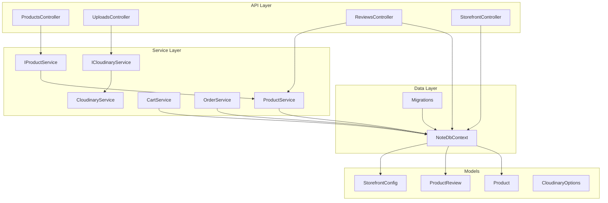
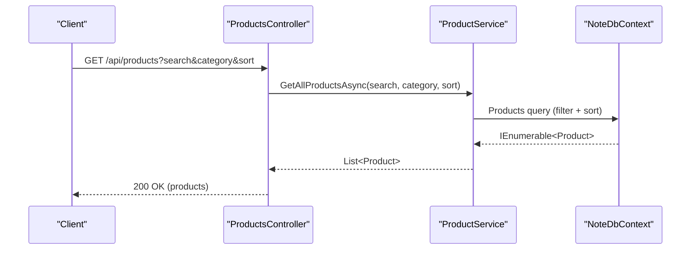
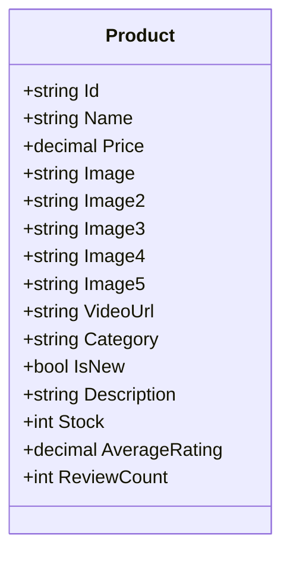
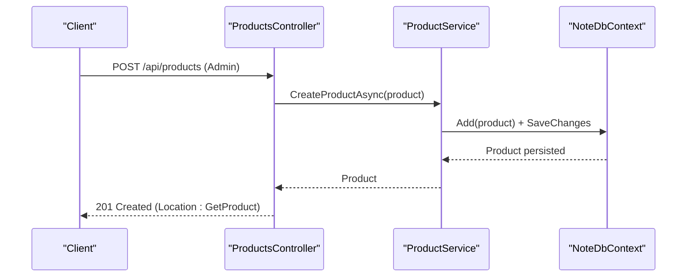
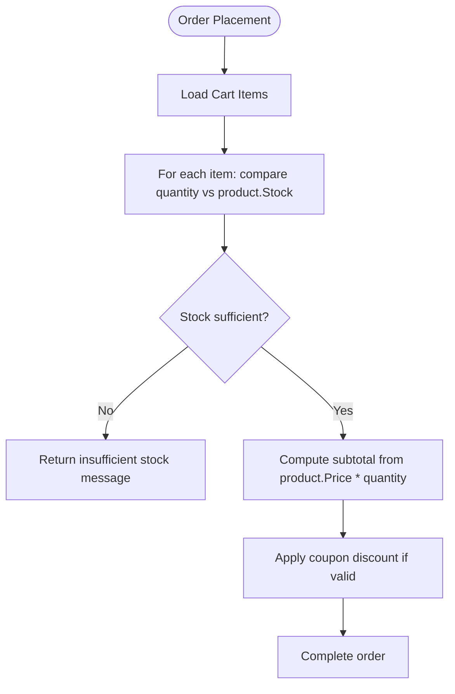
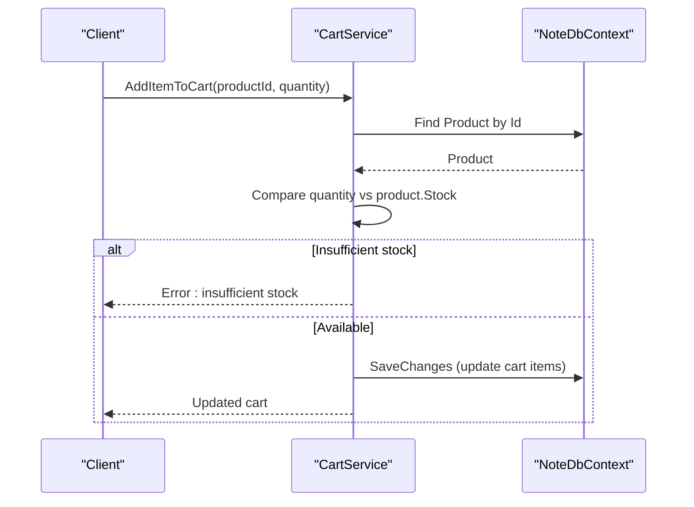
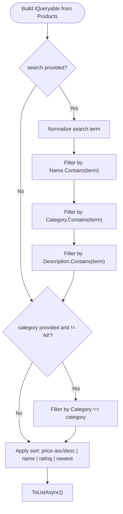
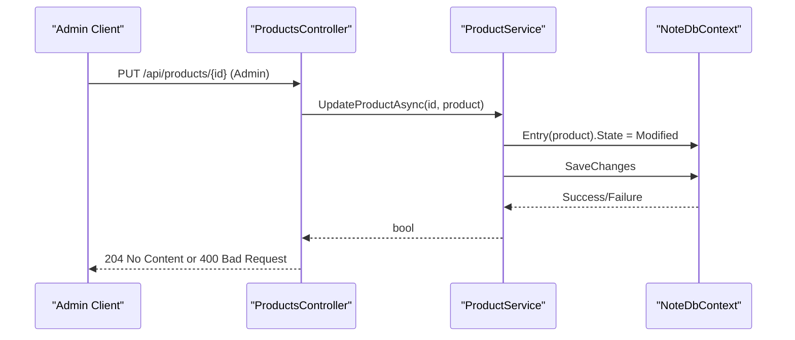
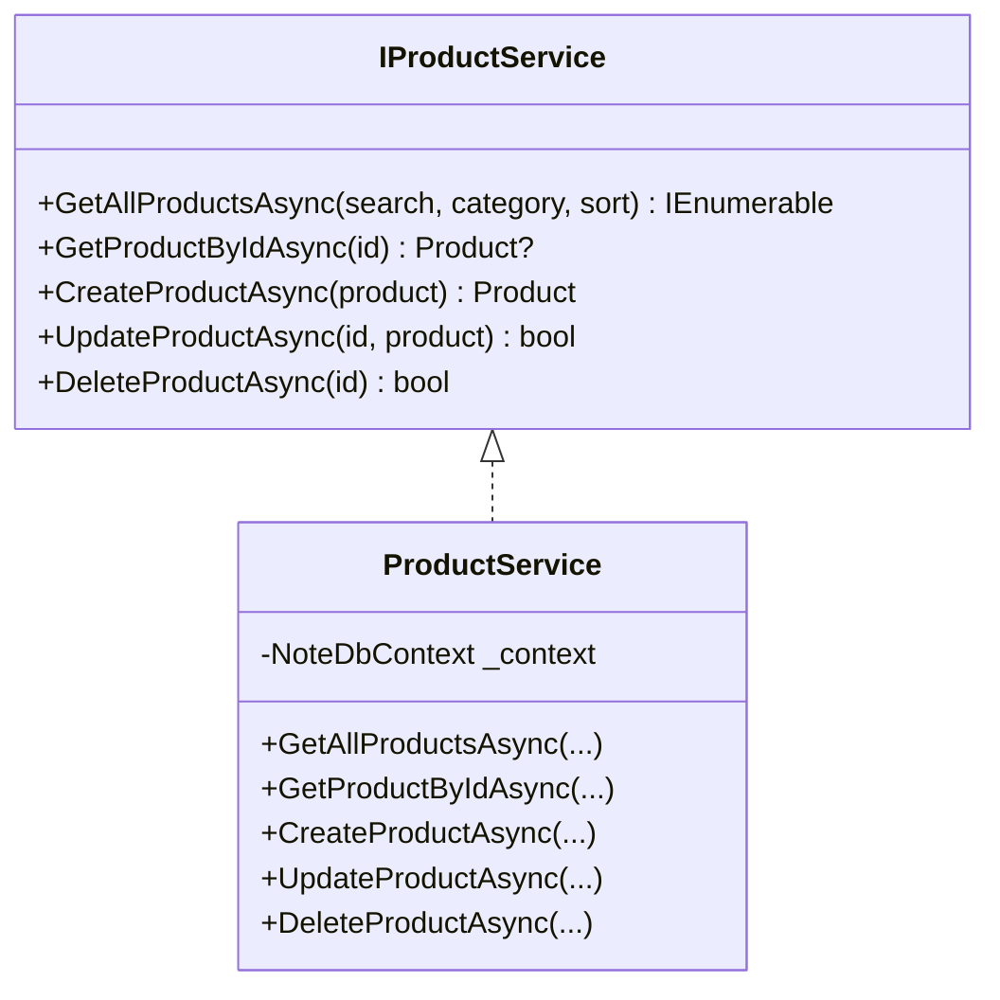
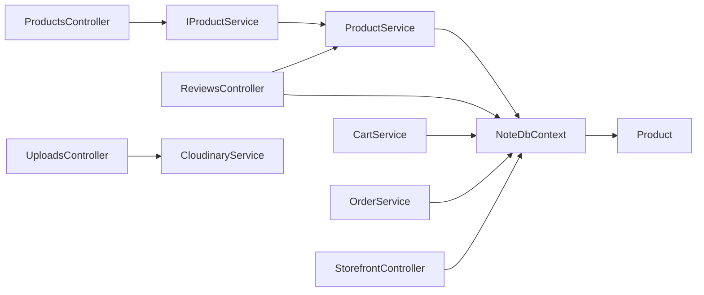

# Product Entity

<cite>
**Referenced Files in This Document**
- [Product.cs](file://Models/Product.cs)
- [ProductService.cs](file://Services/ProductService.cs)
- [IProductService.cs](file://Services/IProductService.cs)
- [ProductsController.cs](file://Controllers/ProductsController.cs)
- [NoteDbContext.cs](file://Data/NoteDbContext.cs)
- [20260427184435_InitialCreate.cs](file://Migrations/20260427184435_InitialCreate.cs)
- [20260427184435_InitialCreate.Designer.cs](file://Migrations/20260427184435_InitialCreate.Designer.cs)
- [NoteDbContextModelSnapshot.cs](file://Migrations/NoteDbContextModelSnapshot.cs)
- [ProductReview.cs](file://Models/ProductReview.cs)
- [ReviewsController.cs](file://Controllers/ReviewsController.cs)
- [CartService.cs](file://Services/CartService.cs)
- [OrderService.cs](file://Services/OrderService.cs)
- [UploadsController.cs](file://Controllers/UploadsController.cs)
- [CloudinaryService.cs](file://Services/CloudinaryService.cs)
- [ICloudinaryService.cs](file://Services/ICloudinaryService.cs)
- [CloudinaryOptions.cs](file://Models/CloudinaryOptions.cs)
- [StorefrontController.cs](file://Controllers/StorefrontController.cs)
- [StorefrontConfig.cs](file://Models/StorefrontConfig.cs)
</cite>

## Table of Contents
1. [Introduction](#introduction)
2. [Project Structure](#project-structure)
3. [Core Components](#core-components)
4. [Architecture Overview](#architecture-overview)
5. [Detailed Component Analysis](#detailed-component-analysis)
6. [Dependency Analysis](#dependency-analysis)
7. [Performance Considerations](#performance-considerations)
8. [Troubleshooting Guide](#troubleshooting-guide)
9. [Conclusion](#conclusion)

## Introduction
This document provides comprehensive documentation for the Product entity within the Note.Backend system. It covers the Product model definition, catalog management via the product service and controller, search and filtering capabilities, inventory tracking, pricing strategies, and media/image handling through Cloudinary. It also explains how the Product integrates with related services such as CartService and OrderService, and how ratings and reviews influence product metadata.

## Project Structure
The Product domain spans several layers:
- Model: Product entity and related entities (ProductReview)
- Data Access: EF Core DbContext and migrations
- Service Layer: Product service implementing CRUD and catalog operations
- API Layer: ProductsController exposing REST endpoints
- Media Handling: CloudinaryService and UploadsController for images/videos
- Ratings and Reviews: ReviewsController updating product rating metrics
- Storefront: StorefrontController and StorefrontConfig for marketing content



**Diagram sources**
- [ProductsController.cs:1-60](file://Controllers/ProductsController.cs#L1-L60)
- [UploadsController.cs:1-79](file://Controllers/UploadsController.cs#L1-L79)
- [ReviewsController.cs:53-93](file://Controllers/ReviewsController.cs#L53-L93)
- [StorefrontController.cs:1-78](file://Controllers/StorefrontController.cs#L1-L78)
- [IProductService.cs:1-13](file://Services/IProductService.cs#L1-L13)
- [ProductService.cs:1-95](file://Services/ProductService.cs#L1-L95)
- [CartService.cs:1-106](file://Services/CartService.cs#L1-L106)
- [OrderService.cs:35-75](file://Services/OrderService.cs#L35-L75)
- [ICloudinaryService.cs:1-6](file://Services/ICloudinaryService.cs#L1-L6)
- [CloudinaryService.cs:1-103](file://Services/CloudinaryService.cs#L1-L103)
- [NoteDbContext.cs:1-67](file://Data/NoteDbContext.cs#L1-L67)
- [20260427184435_InitialCreate.cs:1-359](file://Migrations/20260427184435_InitialCreate.cs#L1-L359)
- [Product.cs:1-21](file://Models/Product.cs#L1-L21)
- [ProductReview.cs:1-14](file://Models/ProductReview.cs#L1-L14)
- [StorefrontConfig.cs:1-23](file://Models/StorefrontConfig.cs#L1-L23)
- [CloudinaryOptions.cs:1-8](file://Models/CloudinaryOptions.cs#L1-L8)

**Section sources**
- [Product.cs:1-21](file://Models/Product.cs#L1-L21)
- [NoteDbContext.cs:11-21](file://Data/NoteDbContext.cs#L11-L21)
- [20260427184435_InitialCreate.cs:60-82](file://Migrations/20260427184435_InitialCreate.cs#L60-L82)

## Core Components
- Product model: Defines identity, branding, pricing, inventory, categorization, media references, and review metrics.
- Product service: Implements catalog queries (search, filter, sort), CRUD operations, and concurrency-safe updates.
- Products controller: Exposes REST endpoints for catalog browsing and admin operations.
- DbContext and migrations: Persist Product and related entities with seed data and indexes.
- Reviews controller: Updates product AverageRating and ReviewCount after user submissions.
- CartService and OrderService: Enforce stock availability during shopping operations.
- Cloudinary integration: Uploads images and videos for product media.

**Section sources**
- [Product.cs:1-21](file://Models/Product.cs#L1-L21)
- [IProductService.cs:1-13](file://Services/IProductService.cs#L1-L13)
- [ProductService.cs:16-94](file://Services/ProductService.cs#L16-L94)
- [ProductsController.cs:19-58](file://Controllers/ProductsController.cs#L19-L58)
- [NoteDbContext.cs:23-65](file://Data/NoteDbContext.cs#L23-L65)
- [ReviewsController.cs:73-86](file://Controllers/ReviewsController.cs#L73-L86)
- [CartService.cs:33-73](file://Services/CartService.cs#L33-L73)
- [OrderService.cs:60-71](file://Services/OrderService.cs#L60-L71)
- [CloudinaryService.cs:40-102](file://Services/CloudinaryService.cs#L40-L102)

## Architecture Overview
The Product subsystem follows a layered architecture:
- API layer handles HTTP requests and delegates to services.
- Service layer encapsulates business logic for product catalog, stock checks, and media uploads.
- Data layer persists entities and seeds initial data.
- Media layer integrates with Cloudinary for scalable asset storage.



**Diagram sources**
- [ProductsController.cs:19-24](file://Controllers/ProductsController.cs#L19-L24)
- [ProductService.cs:16-45](file://Services/ProductService.cs#L16-L45)
- [NoteDbContext.cs:11](file://Data/NoteDbContext.cs#L11)

## Detailed Component Analysis

### Product Model
The Product entity defines the core attributes used across the catalog:
- Identity: Id
- Branding: Name, Category, IsNew
- Pricing: Price
- Inventory: Stock
- Media: Image, Image2-Image5, VideoUrl
- Content: Description
- Reviews: AverageRating, ReviewCount

Constraints and defaults observed in migrations and seeding:
- Name, Price, Image, Category are persisted as non-null.
- Stock defaults to a positive integer value.
- AverageRating and ReviewCount are initialized to zero for seeded records.



**Diagram sources**
- [Product.cs:3-20](file://Models/Product.cs#L3-L20)
- [20260427184435_InitialCreate.cs:64-77](file://Migrations/20260427184435_InitialCreate.cs#L64-L77)

**Section sources**
- [Product.cs:1-21](file://Models/Product.cs#L1-L21)
- [20260427184435_InitialCreate.cs:64-77](file://Migrations/20260427184435_InitialCreate.cs#L64-L77)
- [NoteDbContext.cs:49-59](file://Data/NoteDbContext.cs#L49-L59)

### Product Catalog Management
The product catalog supports:
- Search across Name, Category, and Description.
- Category filtering (excluding "All").
- Sorting by price ascending/descending, name, rating, newest.
- CRUD operations (Get, Create, Update, Delete) with concurrency handling.



**Diagram sources**
- [ProductsController.cs:34-40](file://Controllers/ProductsController.cs#L34-L40)
- [ProductService.cs:52-60](file://Services/ProductService.cs#L52-L60)

**Section sources**
- [ProductService.cs:16-45](file://Services/ProductService.cs#L16-L45)
- [ProductsController.cs:19-58](file://Controllers/ProductsController.cs#L19-L58)
- [ProductService.cs:52-94](file://Services/ProductService.cs#L52-L94)

### Pricing Strategies
- Price is stored as a decimal and used for order calculations.
- Orders validate per-item stock against product.Stock before checkout.
- Coupons apply percentage discounts to order totals; product price influences subtotal.



**Diagram sources**
- [OrderService.cs:50-75](file://Services/OrderService.cs#L50-L75)
- [CartService.cs:33-73](file://Services/CartService.cs#L33-L73)

**Section sources**
- [OrderService.cs:60-71](file://Services/OrderService.cs#L60-L71)
- [CartService.cs:37-39](file://Services/CartService.cs#L37-L39)

### Inventory Tracking Mechanisms
- Stock is decremented implicitly during checkout via order placement logic.
- Real-time stock checks occur in CartService and OrderService to prevent overselling.
- Product.Stock is the authoritative source for availability.



**Diagram sources**
- [CartService.cs:33-73](file://Services/CartService.cs#L33-L73)
- [OrderService.cs:67-71](file://Services/OrderService.cs#L67-L71)

**Section sources**
- [CartService.cs:33-73](file://Services/CartService.cs#L33-L73)
- [OrderService.cs:60-71](file://Services/OrderService.cs#L60-L71)

### Product Search, Filtering, and Category Organization
- Search normalizes input and matches Name, Category, and Description.
- Category filter excludes "All" and applies equality matching.
- Sorting options include price asc/desc, name, rating, newest.



**Diagram sources**
- [ProductService.cs:16-45](file://Services/ProductService.cs#L16-L45)

**Section sources**
- [ProductService.cs:16-45](file://Services/ProductService.cs#L16-L45)

### Product Creation, Price Updates, Stock Management, and Catalog Operations
- Creation: Generates a new Id, initializes rating metrics, persists product.
- Price updates: Uses UpdateProductAsync with concurrency handling.
- Stock management: Enforced by CartService and OrderService; product.Stock governs availability.
- Catalog operations: CRUD endpoints guarded by Admin role.



**Diagram sources**
- [ProductsController.cs:42-49](file://Controllers/ProductsController.cs#L42-L49)
- [ProductService.cs:62-78](file://Services/ProductService.cs#L62-L78)

**Section sources**
- [ProductService.cs:52-94](file://Services/ProductService.cs#L52-L94)
- [ProductsController.cs:34-58](file://Controllers/ProductsController.cs#L34-L58)

### Product Validation Rules
- Name is required (non-null).
- Price is numeric and required.
- Image is required.
- Category is required.
- Stock is required and non-negative in practice (default positive).
- VideoUrl is optional.
- Image2–Image5 are optional.

These constraints are enforced by EF Core migrations and seeding.

**Section sources**
- [20260427184435_InitialCreate.cs:64-77](file://Migrations/20260427184435_InitialCreate.cs#L64-L77)
- [20260427184435_InitialCreate.Designer.cs:275-289](file://Migrations/20260427184435_InitialCreate.Designer.cs#L275-L289)
- [NoteDbContextModelSnapshot.cs:272-286](file://Migrations/NoteDbContextModelSnapshot.cs#L272-L286)

### Image and Media Handling
- Upload endpoint accepts multipart/form-data and routes to CloudinaryService.
- Supports images and videos; returns secure URLs upon success.
- Requires Cloudinary environment variables for initialization.
- Product model stores media references via Image, Image2–Image5, and VideoUrl.

```mermaid
sequenceDiagram
participant Client as "Client"
participant UploadCtrl as "UploadsController"
participant CloudSvc as "CloudinaryService"
participant Product as "Product"
Client->>UploadCtrl : POST /api/uploads/cloudinary (multipart)
UploadCtrl->>CloudSvc : UploadAsync(file, folder)
CloudSvc-->>UploadCtrl : (Success, Url, Error)
UploadCtrl-->>Client : { Url } or error
Note : Product.Image/Image2..5/VideoUrl can be set to returned Url
```

**Diagram sources**
- [UploadsController.cs:23-78](file://Controllers/UploadsController.cs#L23-L78)
- [CloudinaryService.cs:40-102](file://Services/CloudinaryService.cs#L40-L102)
- [Product.cs:8-13](file://Models/Product.cs#L8-L13)

**Section sources**
- [UploadsController.cs:23-78](file://Controllers/UploadsController.cs#L23-L78)
- [CloudinaryService.cs:12-38](file://Services/CloudinaryService.cs#L12-L38)
- [Product.cs:8-13](file://Models/Product.cs#L8-L13)

### Integration with Product Service Layer
- ProductsController depends on IProductService for all catalog operations.
- ProductService encapsulates EF Core queries, concurrency handling, and persistence.



**Diagram sources**
- [IProductService.cs:5-12](file://Services/IProductService.cs#L5-L12)
- [ProductService.cs:7-14](file://Services/ProductService.cs#L7-L14)

**Section sources**
- [IProductService.cs:1-13](file://Services/IProductService.cs#L1-L13)
- [ProductService.cs:1-95](file://Services/ProductService.cs#L1-L95)

## Dependency Analysis
- ProductsController depends on IProductService.
- ProductService depends on NoteDbContext and operates on Product entities.
- ReviewsController updates Product AverageRating and ReviewCount.
- CartService and OrderService depend on Product.Stock for availability checks.
- UploadsController depends on CloudinaryService for media uploads.
- StorefrontController manages StorefrontConfig, separate from Product.



**Diagram sources**
- [ProductsController.cs:12-17](file://Controllers/ProductsController.cs#L12-L17)
- [IProductService.cs:5-12](file://Services/IProductService.cs#L5-L12)
- [ProductService.cs:9-14](file://Services/ProductService.cs#L9-L14)
- [ReviewsController.cs:53-86](file://Controllers/ReviewsController.cs#L53-L86)
- [CartService.cs:9-14](file://Services/CartService.cs#L9-L14)
- [OrderService.cs:35-75](file://Services/OrderService.cs#L35-L75)
- [UploadsController.cs:12-21](file://Controllers/UploadsController.cs#L12-L21)
- [StorefrontController.cs:13-18](file://Controllers/StorefrontController.cs#L13-L18)

**Section sources**
- [ProductsController.cs:1-60](file://Controllers/ProductsController.cs#L1-L60)
- [ProductService.cs:1-95](file://Services/ProductService.cs#L1-L95)
- [ReviewsController.cs:53-86](file://Controllers/ReviewsController.cs#L53-L86)
- [CartService.cs:1-106](file://Services/CartService.cs#L1-L106)
- [OrderService.cs:35-75](file://Services/OrderService.cs#L35-L75)
- [UploadsController.cs:1-79](file://Controllers/UploadsController.cs#L1-L79)
- [StorefrontController.cs:1-78](file://Controllers/StorefrontController.cs#L1-L78)

## Performance Considerations
- AsNoTracking is used in catalog queries to improve read performance.
- Indexes exist for unique combinations on ProductReview and WishlistItem to optimize lookups.
- Sorting and filtering are applied server-side; consider pagination for large catalogs.
- Cloudinary uploads are asynchronous; ensure appropriate timeouts and error handling.

[No sources needed since this section provides general guidance]

## Troubleshooting Guide
- Cloudinary not configured: Uploads fail if environment variables are missing; verify CLOUDINARY_CLOUD_NAME, CLOUDINARY_API_KEY, CLOUDINARY_API_SECRET.
- Concurrency update failures: UpdateProductAsync catches concurrency exceptions and validates existence.
- Out-of-stock scenarios: CartService and OrderService return explicit messages when stock is insufficient.
- Missing product: ProductsController returns NotFound for GetProduct when Id does not exist.

**Section sources**
- [UploadsController.cs:34-78](file://Controllers/UploadsController.cs#L34-L78)
- [CloudinaryService.cs:26-38](file://Services/CloudinaryService.cs#L26-L38)
- [ProductService.cs:73-78](file://Services/ProductService.cs#L73-L78)
- [CartService.cs:37-56](file://Services/CartService.cs#L37-L56)
- [OrderService.cs:67-71](file://Services/OrderService.cs#L67-L71)
- [ProductsController.cs:29-31](file://Controllers/ProductsController.cs#L29-L31)

## Conclusion
The Product entity in Note.Backend is a central domain object with robust support for catalog management, search, filtering, pricing, inventory control, and media handling. Its integration with CartService, OrderService, ReviewsController, and CloudinaryService ensures a cohesive shopping experience. The layered architecture with clear separation of concerns enables maintainability and scalability.