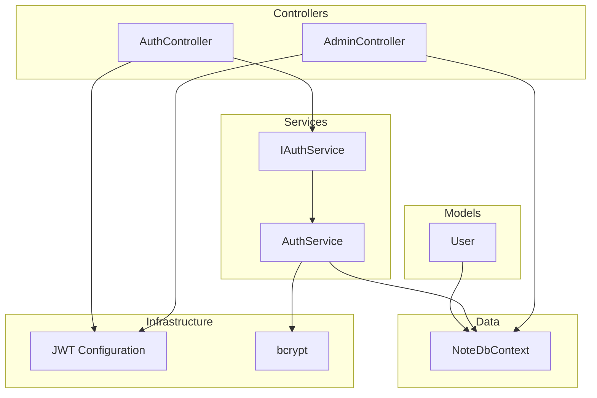
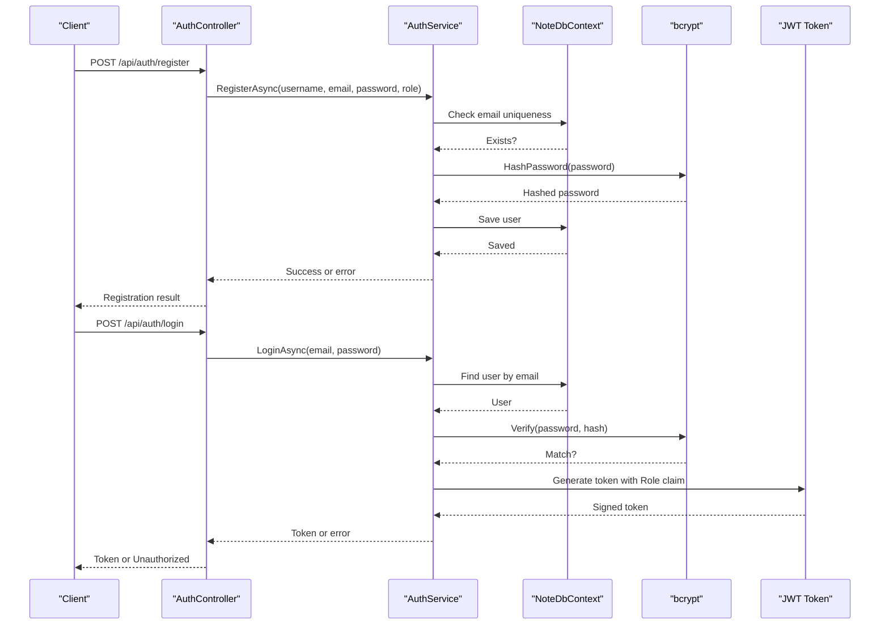
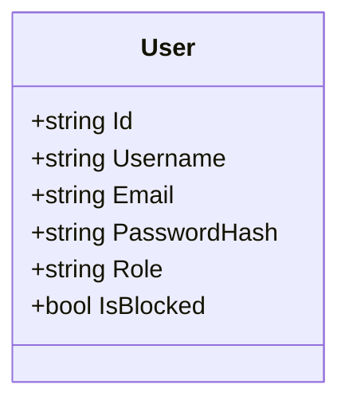
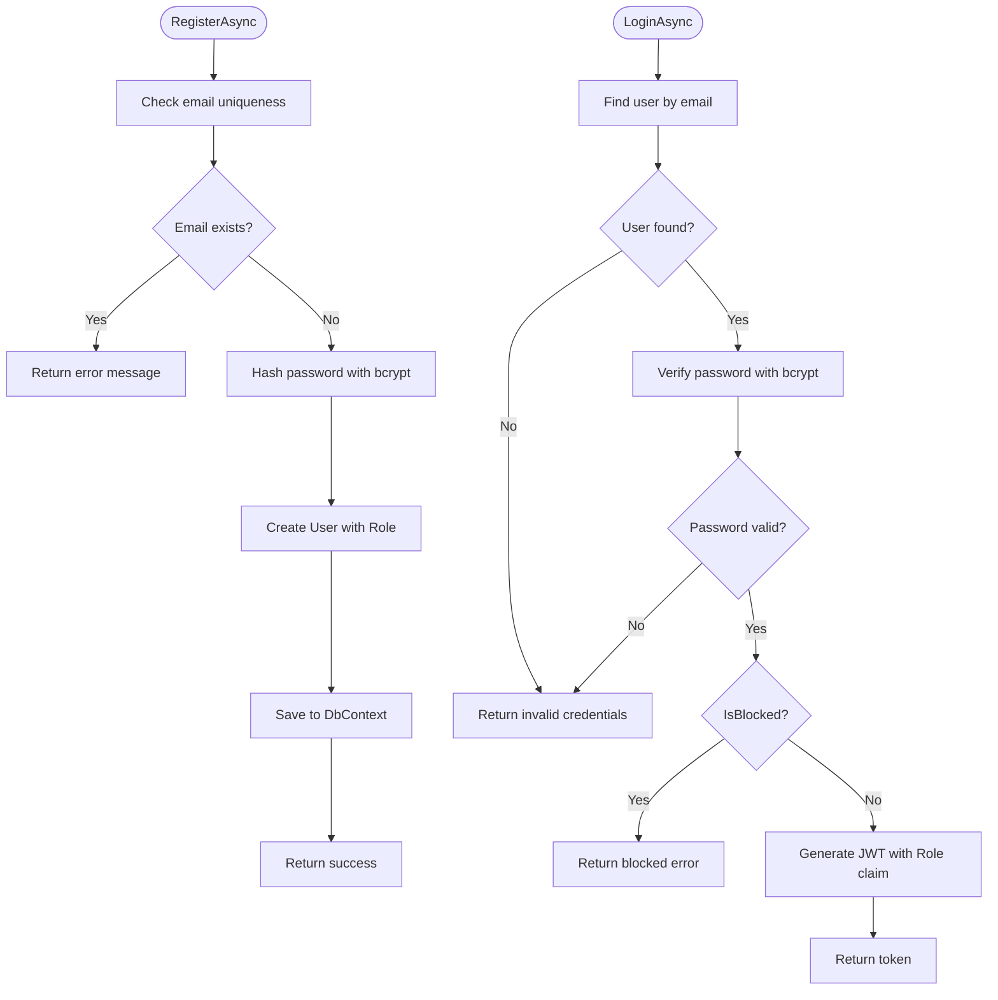
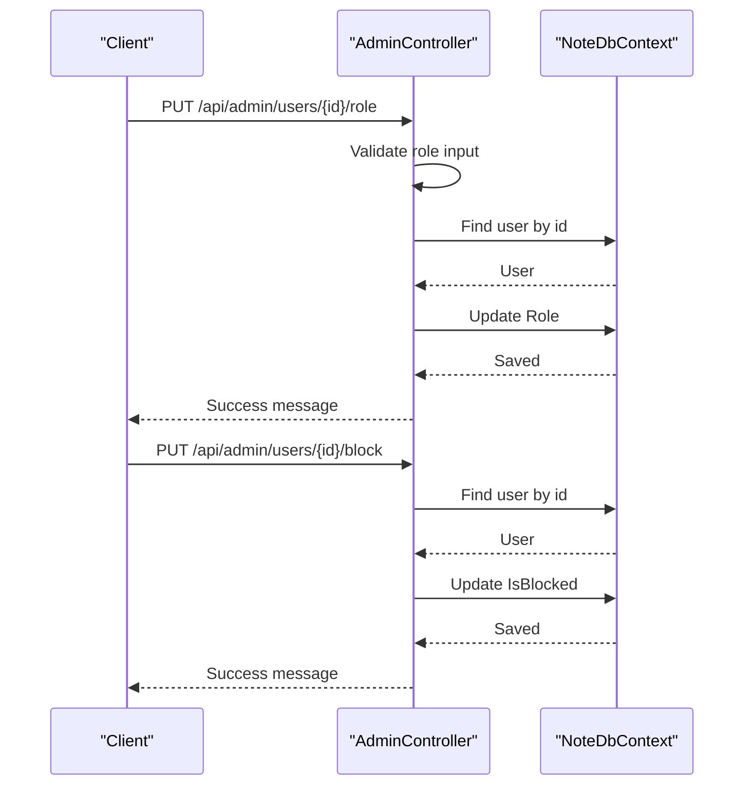
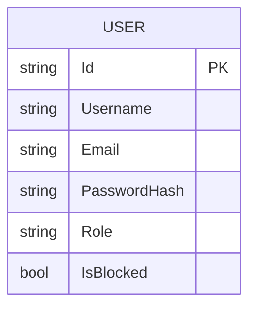
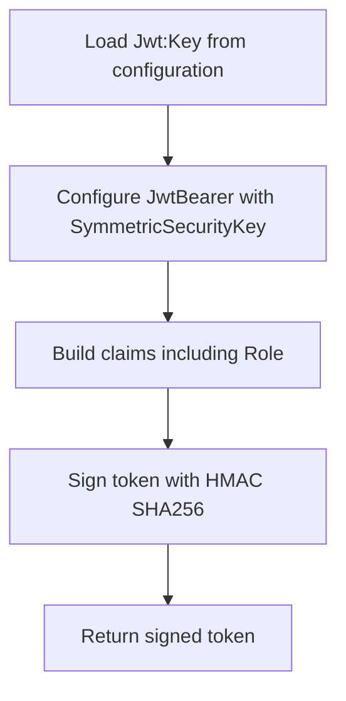
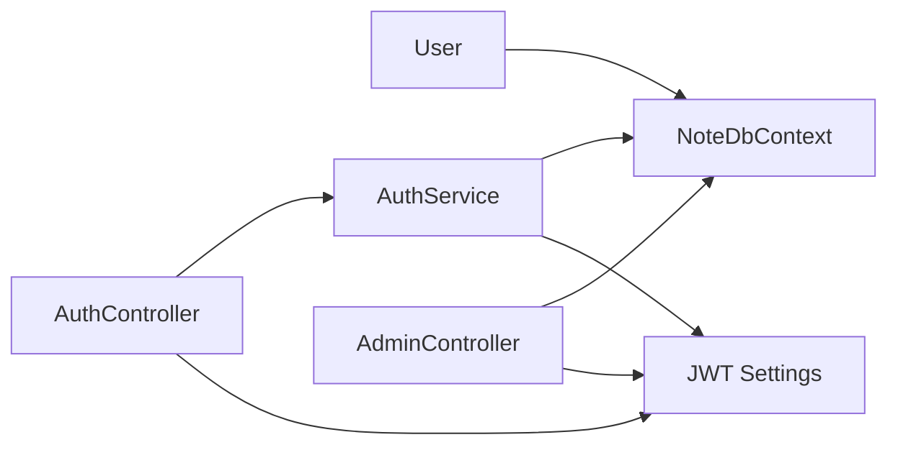

# User Entity

<cite>
**Referenced Files in This Document**
- [User.cs](file://Models/User.cs)
- [NoteDbContext.cs](file://Data/NoteDbContext.cs)
- [AuthService.cs](file://Services/AuthService.cs)
- [IAuthService.cs](file://Services/IAuthService.cs)
- [AuthController.cs](file://Controllers/AuthController.cs)
- [AdminController.cs](file://Controllers/AdminController.cs)
- [Program.cs](file://Program.cs)
- [appsettings.json](file://appsettings.json)
</cite>

## Table of Contents
1. [Introduction](#introduction)
2. [Project Structure](#project-structure)
3. [Core Components](#core-components)
4. [Architecture Overview](#architecture-overview)
5. [Detailed Component Analysis](#detailed-component-analysis)
6. [Dependency Analysis](#dependency-analysis)
7. [Performance Considerations](#performance-considerations)
8. [Troubleshooting Guide](#troubleshooting-guide)
9. [Conclusion](#conclusion)

## Introduction
This document provides comprehensive documentation for the User entity in the Note.Backend system. It covers the User model structure, role-based access control (RBAC) with User and Admin roles, authentication requirements, password hashing implementation, user registration and validation processes, and integration with the authentication service. It also includes practical examples of user creation, role assignment, and account management scenarios, along with security considerations and data validation rules.

## Project Structure
The User entity is part of the Models namespace and integrates with the Data layer (Entity Framework), Services (authentication), and Controllers (HTTP endpoints). The system uses JWT for authentication and bcrypt for password hashing.

**Diagram sources**
- [User.cs:3-11](file://Models/User.cs#L3-L11)
- [NoteDbContext.cs:14](file://Data/NoteDbContext.cs#L14)
- [IAuthService.cs:5-10](file://Services/IAuthService.cs#L5-L10)
- [AuthService.cs:11-97](file://Services/AuthService.cs#L11-L97)
- [AuthController.cs:9-55](file://Controllers/AuthController.cs#L9-L55)
- [AdminController.cs:12-277](file://Controllers/AdminController.cs#L12-L277)
- [Program.cs:69-84](file://Program.cs#L69-L84)

**Section sources**
- [User.cs:3-11](file://Models/User.cs#L3-L11)
- [NoteDbContext.cs:14](file://Data/NoteDbContext.cs#L14)
- [IAuthService.cs:5-10](file://Services/IAuthService.cs#L5-L10)
- [AuthService.cs:11-97](file://Services/AuthService.cs#L11-L97)
- [AuthController.cs:9-55](file://Controllers/AuthController.cs#L9-L55)
- [AdminController.cs:12-277](file://Controllers/AdminController.cs#L12-L277)
- [Program.cs:69-84](file://Program.cs#L69-L84)

## Core Components
- User Model: Defines identity, credentials, role, and account state.
- Authentication Service: Handles registration, login, password changes, and JWT token generation.
- Authorization Controllers: Expose endpoints for user registration, login, password change, and admin-managed user operations.
- Database Context: Provides the Users DbSet and seeds an initial Admin user.
- JWT Configuration: Validates tokens and enforces role-based authorization.

Key responsibilities:
- User model encapsulates Id, Username, Email, PasswordHash, Role, and IsBlocked.
- AuthService performs email uniqueness checks, bcrypt hashing, login verification, and JWT issuance.
- AuthController exposes register, login, and change-password endpoints.
- AdminController manages user roles and blocking via admin-only endpoints.

**Section sources**
- [User.cs:3-11](file://Models/User.cs#L3-L11)
- [AuthService.cs:22-41](file://Services/AuthService.cs#L22-L41)
- [AuthService.cs:43-57](file://Services/AuthService.cs#L43-L57)
- [AuthService.cs:83-96](file://Services/AuthService.cs#L83-L96)
- [AuthController.cs:18-38](file://Controllers/AuthController.cs#L18-L38)
- [AuthController.cs:40-54](file://Controllers/AuthController.cs#L40-L54)
- [NoteDbContext.cs:27-37](file://Data/NoteDbContext.cs#L27-L37)
- [Program.cs:69-84](file://Program.cs#L69-L84)

## Architecture Overview
The User entity participates in a layered architecture:
- Presentation: AuthController and AdminController expose HTTP endpoints.
- Application: AuthService orchestrates business logic for authentication and user management.
- Persistence: NoteDbContext manages the Users table and seeds an Admin user.
- Security: JWT bearer authentication validates tokens and enforces roles.

**Diagram sources**
- [AuthController.cs:18-38](file://Controllers/AuthController.cs#L18-L38)
- [AuthService.cs:22-41](file://Services/AuthService.cs#L22-L41)
- [AuthService.cs:43-57](file://Services/AuthService.cs#L43-L57)
- [AuthService.cs:59-81](file://Services/AuthService.cs#L59-L81)
- [NoteDbContext.cs:14](file://Data/NoteDbContext.cs#L14)

## Detailed Component Analysis

### User Model
The User entity defines the core attributes used across authentication and authorization:
- Id: Unique identifier generated as a stringified GUID.
- Username: Display name for the user.
- Email: Unique identifier used for login and account identification.
- PasswordHash: Bcrypt-hashed password for secure storage.
- Role: "User" or "Admin". Defaults to "User".
- IsBlocked: Boolean flag to disable an account.

**Diagram sources**
- [User.cs:3-11](file://Models/User.cs#L3-L11)

**Section sources**
- [User.cs:3-11](file://Models/User.cs#L3-L11)

### Authentication Service
The AuthService implements:
- Registration: Checks email uniqueness, hashes the password, assigns role, and persists the user.
- Login: Retrieves user by email, verifies password using bcrypt, checks IsBlocked, and generates a JWT token containing Role and other claims.
- Password Change: Verifies current password, then replaces with a new bcrypt-hashed password.

**Diagram sources**
- [AuthService.cs:22-41](file://Services/AuthService.cs#L22-L41)
- [AuthService.cs:43-57](file://Services/AuthService.cs#L43-L57)
- [AuthService.cs:59-81](file://Services/AuthService.cs#L59-L81)

**Section sources**
- [AuthService.cs:22-41](file://Services/AuthService.cs#L22-L41)
- [AuthService.cs:43-57](file://Services/AuthService.cs#L43-L57)
- [AuthService.cs:83-96](file://Services/AuthService.cs#L83-L96)

### Authorization Controllers
- AuthController:
  - POST /api/auth/register: Registers a new user with optional role.
  - POST /api/auth/login: Authenticates and returns a JWT token.
  - POST /api/auth/change-password: Changes the authenticated user's password.
- AdminController:
  - GET /api/admin/users: Lists users with filtering by search and role.
  - PUT /api/admin/users/{id}/role: Updates a user's role to Admin or User.
  - PUT /api/admin/users/{id}/block: Blocks or unblocks a user.
  - GET /api/admin/users/{id}/orders: Retrieves a user's orders.

**Diagram sources**
- [AdminController.cs:233-248](file://Controllers/AdminController.cs#L233-L248)
- [AdminController.cs:250-260](file://Controllers/AdminController.cs#L250-L260)

**Section sources**
- [AuthController.cs:18-38](file://Controllers/AuthController.cs#L18-L38)
- [AuthController.cs:40-54](file://Controllers/AuthController.cs#L40-L54)
- [AdminController.cs:192-231](file://Controllers/AdminController.cs#L192-L231)
- [AdminController.cs:233-248](file://Controllers/AdminController.cs#L233-L248)
- [AdminController.cs:250-260](file://Controllers/AdminController.cs#L250-L260)
- [AdminController.cs:262-276](file://Controllers/AdminController.cs#L262-L276)

### Database Context and Seeding
- NoteDbContext exposes a Users DbSet.
- Seeds an Admin user with a predefined hashed password and role.

**Diagram sources**
- [NoteDbContext.cs:14](file://Data/NoteDbContext.cs#L14)
- [NoteDbContext.cs:27-37](file://Data/NoteDbContext.cs#L27-L37)

**Section sources**
- [NoteDbContext.cs:14](file://Data/NoteDbContext.cs#L14)
- [NoteDbContext.cs:27-37](file://Data/NoteDbContext.cs#L27-L37)

### JWT Configuration and Security
- JWT key is loaded from configuration and used to sign tokens.
- Token includes Role claim for authorization enforcement.
- Authentication middleware validates tokens and enables [Authorize] attributes.

**Diagram sources**
- [Program.cs:69-84](file://Program.cs#L69-L84)
- [AuthService.cs:59-81](file://Services/AuthService.cs#L59-L81)
- [appsettings.json:6-8](file://appsettings.json#L6-L8)

**Section sources**
- [Program.cs:69-84](file://Program.cs#L69-L84)
- [AuthService.cs:59-81](file://Services/AuthService.cs#L59-L81)
- [appsettings.json:6-8](file://appsettings.json#L6-L8)

## Dependency Analysis
- User depends on NoteDbContext for persistence.
- AuthService depends on NoteDbContext and IConfiguration for JWT configuration.
- AuthController depends on IAuthService for business operations.
- AdminController depends on NoteDbContext for user management and [Authorize(Roles = "Admin")] for RBAC.
- JWT configuration is centralized in Program.cs and consumed by AuthService and controllers.

**Diagram sources**
- [User.cs:3-11](file://Models/User.cs#L3-L11)
- [NoteDbContext.cs:14](file://Data/NoteDbContext.cs#L14)
- [AuthService.cs:11-20](file://Services/AuthService.cs#L11-L20)
- [AuthController.cs:11](file://Controllers/AuthController.cs#L11)
- [AdminController.cs:14](file://Controllers/AdminController.cs#L14)
- [Program.cs:69-84](file://Program.cs#L69-L84)

**Section sources**
- [User.cs:3-11](file://Models/User.cs#L3-L11)
- [NoteDbContext.cs:14](file://Data/NoteDbContext.cs#L14)
- [AuthService.cs:11-20](file://Services/AuthService.cs#L11-L20)
- [AuthController.cs:11](file://Controllers/AuthController.cs#L11)
- [AdminController.cs:14](file://Controllers/AdminController.cs#L14)
- [Program.cs:69-84](file://Program.cs#L69-L84)

## Performance Considerations
- Password hashing uses bcrypt, which is computationally intensive. Consider batching operations and avoiding repeated hashing in tight loops.
- Email uniqueness checks use a single database query; ensure indexing on Email for scalability.
- JWT token generation occurs per login; keep token lifetime reasonable to reduce overhead.
- Admin endpoints perform joins and aggregations; consider pagination and caching for large datasets.

[No sources needed since this section provides general guidance]

## Troubleshooting Guide
Common issues and resolutions:
- Registration fails with "Email already exists": Ensure the email is unique before attempting registration.
- Login returns "Invalid credentials": Verify the email and password match stored records; confirm bcrypt verification succeeds.
- Login returns "Your account has been blocked": Check IsBlocked flag and unblock the user via AdminController.
- Change password fails: Confirm the current password matches the stored hash; ensure the new password meets security expectations.
- Unauthorized on admin endpoints: Ensure the token includes the Role claim and the user has Admin role.

**Section sources**
- [AuthService.cs:24-27](file://Services/AuthService.cs#L24-L27)
- [AuthService.cs:45-49](file://Services/AuthService.cs#L45-L49)
- [AuthService.cs:51-54](file://Services/AuthService.cs#L51-L54)
- [AuthService.cs:87-91](file://Services/AuthService.cs#L87-L91)
- [AdminController.cs:11](file://Controllers/AdminController.cs#L11)

## Conclusion
The User entity in Note.Backend is designed with clear separation of concerns, robust authentication via JWT, and secure password handling using bcrypt. Role-based access control is enforced through claims and controller attributes, enabling safe administration of users. The system provides straightforward APIs for user creation, login, password updates, and admin-managed user operations, while maintaining security and performance best practices.