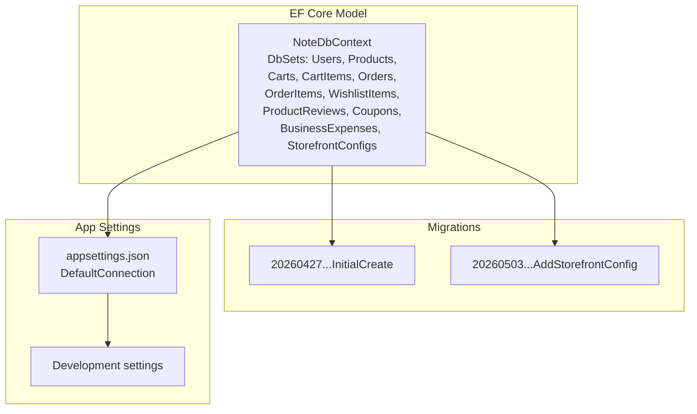
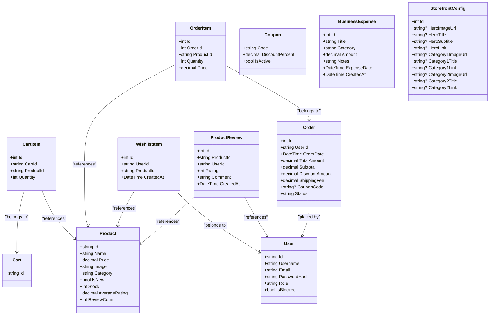
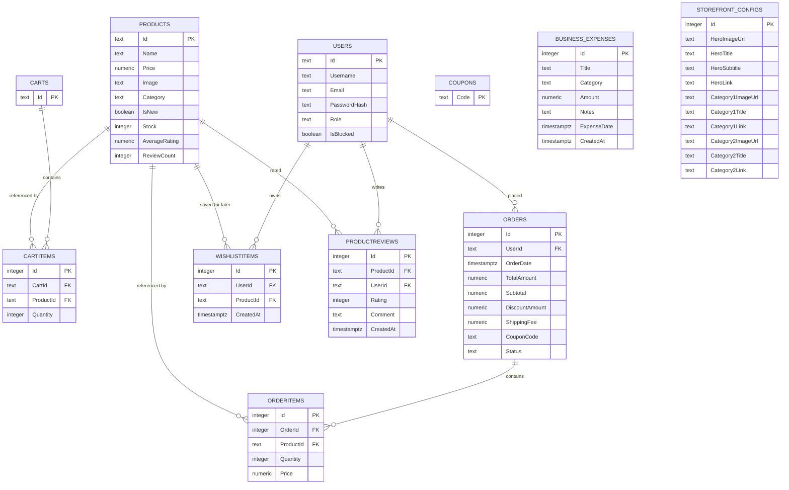
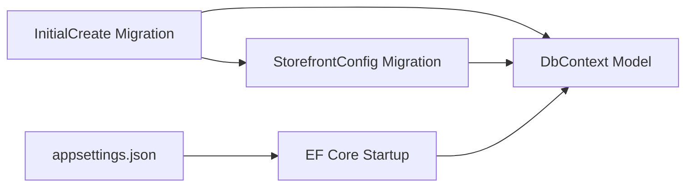

# Data Models & Database Design

<cite>
**Referenced Files in This Document**
- [NoteDbContext.cs](file://Data/NoteDbContext.cs)
- [User.cs](file://Models/User.cs)
- [Product.cs](file://Models/Product.cs)
- [Cart.cs](file://Models/Cart.cs)
- [CartItem.cs](file://Models/CartItem.cs)
- [Order.cs](file://Models/Order.cs)
- [ProductReview.cs](file://Models/ProductReview.cs)
- [Coupon.cs](file://Models/Coupon.cs)
- [BusinessExpense.cs](file://Models/BusinessExpense.cs)
- [StorefrontConfig.cs](file://Models/StorefrontConfig.cs)
- [20260427184435_InitialCreate.cs](file://Migrations/20260427184435_InitialCreate.cs)
- [20260503221515_AddStorefrontConfig.cs](file://Migrations/20260503221515_AddStorefrontConfig.cs)
- [Note.Backend.csproj](file://Note.Backend.csproj)
- [appsettings.json](file://appsettings.json)
- [appsettings.Development.json](file://appsettings.Development.json)
</cite>

## Table of Contents
1. [Introduction](#introduction)
2. [Project Structure](#project-structure)
3. [Core Components](#core-components)
4. [Architecture Overview](#architecture-overview)
5. [Detailed Component Analysis](#detailed-component-analysis)
6. [Dependency Analysis](#dependency-analysis)
7. [Performance Considerations](#performance-considerations)
8. [Troubleshooting Guide](#troubleshooting-guide)
9. [Conclusion](#conclusion)
10. [Appendices](#appendices)

## Introduction
This document describes the Note.Backend database schema and Entity Framework Core (EF Core) implementation. It covers entity definitions, relationships, indexes, constraints, migrations, and data access patterns. It also includes diagrams, sample data seeds, validation rules, and operational guidance for performance and troubleshooting.

## Project Structure
The database layer centers around a single EF Core DbContext that exposes DbSets for domain entities. Migrations define the evolving schema, and appsettings configure the PostgreSQL connection string.

**Diagram sources**
- [NoteDbContext.cs:11-21](file://Data/NoteDbContext.cs#L11-L21)
- [20260427184435_InitialCreate.cs:15-358](file://Migrations/20260427184435_InitialCreate.cs#L15-L358)
- [20260503221515_AddStorefrontConfig.cs:12-44](file://Migrations/20260503221515_AddStorefrontConfig.cs#L12-L44)
- [appsettings.json:2-4](file://appsettings.json#L2-L4)

**Section sources**
- [NoteDbContext.cs:11-21](file://Data/NoteDbContext.cs#L11-L21)
- [Note.Backend.csproj:14-24](file://Note.Backend.csproj#L14-L24)
- [appsettings.json:2-4](file://appsettings.json#L2-L4)

## Core Components
This section documents the primary entities used in product catalog, user management, shopping cart, order processing, and reviews.

- Users
  - Purpose: Authentication and authorization for the application.
  - Fields: Id, Username, Email, PasswordHash, Role, IsBlocked.
  - Constraints: Primary key on Id; default role is "User".
- Products
  - Purpose: Catalog items for sale.
  - Fields: Id, Name, Price, Image(s), VideoUrl, Category, IsNew, Description, Stock, AverageRating, ReviewCount.
  - Constraints: Primary key on Id; default Stock is 25.
- Carts
  - Purpose: Shopping cart container per user session or identity.
  - Fields: Id, Items (collection).
  - Constraints: Primary key on Id.
- CartItems
  - Purpose: Line items inside a cart.
  - Fields: Id, CartId, ProductId, Quantity; navigation Product.
  - Constraints: Primary key on Id; foreign keys to Carts and Products with cascade delete.
- Orders
  - Purpose: Purchase records with shipping and payment metadata.
  - Fields: Id, UserId, OrderDate, TotalAmount, Subtotal, DiscountAmount, ShippingFee, CouponCode, Status, FullName, PhoneNumber, AlternatePhoneNumber, AddressLine1, AddressLine2, City, State, DeliveryAddress, Landmark, Pincode, Items (collection); navigation User.
  - Constraints: Primary key on Id; foreign key to Users with cascade delete; default Status is "Pending".
- OrderItems
  - Purpose: Line items inside an order snapshot.
  - Fields: Id, OrderId, ProductId, Quantity, Price; navigations to Order and Product.
  - Constraints: Primary key on Id; foreign keys to Orders and Products with cascade delete.
- WishlistItems
  - Purpose: Saved-for-later items per user.
  - Fields: Id, UserId, ProductId, CreatedAt; navigations to User and Product.
  - Constraints: Primary key on Id; foreign keys to Users and Products with cascade delete; unique composite index on (UserId, ProductId).
- ProductReviews
  - Purpose: Customer feedback with rating and comment.
  - Fields: Id, ProductId, UserId, Rating, Comment, CreatedAt; navigations to Product and User.
  - Constraints: Primary key on Id; foreign keys to Products and Users with cascade delete; unique composite index on (UserId, ProductId).
- Coupons
  - Purpose: Discount codes applied during checkout.
  - Fields: Code (primary key), DiscountPercent, IsActive.
- BusinessExpense
  - Purpose: Administrative expense tracking.
  - Fields: Id, Title, Category, Amount, Notes, ExpenseDate, CreatedAt.
- StorefrontConfig
  - Purpose: CMS-like configuration for storefront hero and categories.
  - Fields: Id, HeroImageUrl/Title/Subtitle/Link, Category1ImageUrl/Title/Link, Category2ImageUrl/Title/Link.

**Section sources**
- [User.cs:3-11](file://Models/User.cs#L3-L11)
- [Product.cs:3-20](file://Models/Product.cs#L3-L20)
- [Cart.cs:5-9](file://Models/Cart.cs#L5-L9)
- [CartItem.cs:3-11](file://Models/CartItem.cs#L3-L11)
- [Order.cs:3-62](file://Models/Order.cs#L3-L62)
- [ProductReview.cs:3-13](file://Models/ProductReview.cs#L3-L13)
- [Coupon.cs:3-8](file://Models/Coupon.cs#L3-L8)
- [BusinessExpense.cs:3-12](file://Models/BusinessExpense.cs#L3-L12)
- [StorefrontConfig.cs:3-22](file://Models/StorefrontConfig.cs#L3-L22)

## Architecture Overview
The database architecture is centered on a single DbContext exposing strongly-typed DbSets. EF Core model configuration applies:
- Composite unique indexes on WishlistItems and ProductReviews.
- Primary key overrides for Coupon (non-integer Code).
- Seed data for Users, Products, and Coupons.

**Diagram sources**
- [NoteDbContext.cs:11-21](file://Data/NoteDbContext.cs#L11-L21)
- [User.cs:3-11](file://Models/User.cs#L3-L11)
- [Product.cs:3-20](file://Models/Product.cs#L3-L20)
- [Cart.cs:5-9](file://Models/Cart.cs#L5-L9)
- [CartItem.cs:3-11](file://Models/CartItem.cs#L3-L11)
- [Order.cs:3-62](file://Models/Order.cs#L3-L62)
- [ProductReview.cs:3-13](file://Models/ProductReview.cs#L3-L13)
- [Coupon.cs:3-8](file://Models/Coupon.cs#L3-L8)
- [BusinessExpense.cs:3-12](file://Models/BusinessExpense.cs#L3-L12)
- [StorefrontConfig.cs:3-22](file://Models/StorefrontConfig.cs#L3-L22)

## Detailed Component Analysis

### Entity Relationship Diagram
The ER view highlights primary keys, foreign keys, and unique constraints.

**Diagram sources**
- [20260427184435_InitialCreate.cs:17-358](file://Migrations/20260427184435_InitialCreate.cs#L17-L358)
- [20260503221515_AddStorefrontConfig.cs:14-34](file://Migrations/20260503221515_AddStorefrontConfig.cs#L14-L34)
- [NoteDbContext.cs:39-47](file://Data/NoteDbContext.cs#L39-L47)

### Data Seeding and Validation Rules
- Seeding
  - Admin User: seeded via model configuration with predefined hash and role.
  - Products: multiple sample products inserted via migration.
  - Coupons: two discount codes inserted via migration.
- Validation Rules
  - Non-empty fields enforced by model definitions (e.g., string fields initialized to empty).
  - Numeric fields constrained by decimal/integer types.
  - Unique constraints:
    - WishlistItems: unique (UserId, ProductId).
    - ProductReviews: unique (UserId, ProductId).
    - Coupons: primary key on Code.
  - Defaults:
    - User.Role defaults to "User".
    - Product.Stock defaults to 25.
    - Order.Status defaults to "Pending".
    - Order.OrderDate defaults to UTC now.

**Section sources**
- [NoteDbContext.cs:27-64](file://Data/NoteDbContext.cs#L27-L64)
- [20260427184435_InitialCreate.cs:247-274](file://Migrations/20260427184435_InitialCreate.cs#L247-L274)
- [User.cs:9](file://Models/User.cs#L9)
- [Product.cs:17](file://Models/Product.cs#L17)
- [Order.cs:14](file://Models/Order.cs#L14)
- [NoteDbContext.cs:39-47](file://Data/NoteDbContext.cs#L39-L47)

### Indexes and Constraints
- Composite Unique Indexes
  - WishlistItems: (UserId, ProductId)
  - ProductReviews: (UserId, ProductId)
- Primary Keys
  - Users, Products, Carts, CartItems, Orders, OrderItems, WishlistItems, ProductReviews, BusinessExpenses, StorefrontConfigs.
  - Coupons: Code as primary key.
- Foreign Keys
  - CartItems: CartId -> Carts.Id (Cascade), ProductId -> Products.Id (Cascade)
  - OrderItems: OrderId -> Orders.Id (Cascade), ProductId -> Products.Id (Cascade)
  - Orders: UserId -> Users.Id (Cascade)
  - WishlistItems: UserId -> Users.Id (Cascade), ProductId -> Products.Id (Cascade)
  - ProductReviews: UserId -> Users.Id (Cascade), ProductId -> Products.Id (Cascade)

**Section sources**
- [NoteDbContext.cs:41-47](file://Data/NoteDbContext.cs#L41-L47)
- [20260427184435_InitialCreate.cs:113-244](file://Migrations/20260427184435_InitialCreate.cs#L113-L244)

### Sample Data Examples
- Admin User
  - Id: "admin-user-id"
  - Username: "Admin"
  - Email: "admin@note.com"
  - Role: "Admin"
  - PasswordHash: bcrypt hash present
- Products (seeded)
  - Example entries include Ids "1" through "8" with varying Categories, Prices, Stock, and IsNew flags.
- Coupons (seeded)
  - Codes: "WELCOME10", "PAPER15" with respective DiscountPercent values and IsActive true.

**Section sources**
- [NoteDbContext.cs:28-64](file://Data/NoteDbContext.cs#L28-L64)
- [20260427184435_InitialCreate.cs:247-274](file://Migrations/20260427184435_InitialCreate.cs#L247-L274)

### Data Access Patterns and EF Core Implementation
- DbContext
  - Exposes DbSets for all entities.
  - Applies composite unique indexes and primary key overrides in OnModelCreating.
  - Seeds Users, Products, and Coupons programmatically.
- Provider and Tools
  - Uses Npgsql.EntityFrameworkCore.PostgreSQL provider.
  - Includes EF Core design, tools, and relational packages.
- Connection String
  - Default connection configured for PostgreSQL.

**Section sources**
- [NoteDbContext.cs:11-65](file://Data/NoteDbContext.cs#L11-L65)
- [Note.Backend.csproj:14-24](file://Note.Backend.csproj#L14-L24)
- [appsettings.json:2-4](file://appsettings.json#L2-L4)

## Dependency Analysis
The following diagram shows how migrations evolve the schema and how the DbContext aligns with the generated model.

**Diagram sources**
- [20260427184435_InitialCreate.cs:15-358](file://Migrations/20260427184435_InitialCreate.cs#L15-L358)
- [20260503221515_AddStorefrontConfig.cs:12-44](file://Migrations/20260503221515_AddStorefrontConfig.cs#L12-L44)
- [NoteDbContext.cs:23-65](file://Data/NoteDbContext.cs#L23-L65)
- [appsettings.json:2-4](file://appsettings.json#L2-L4)

**Section sources**
- [20260427184435_InitialCreate.cs:15-358](file://Migrations/20260427184435_InitialCreate.cs#L15-L358)
- [20260503221515_AddStorefrontConfig.cs:12-44](file://Migrations/20260503221515_AddStorefrontConfig.cs#L12-L44)
- [NoteDbContext.cs:23-65](file://Data/NoteDbContext.cs#L23-L65)
- [appsettings.json:2-4](file://appsettings.json#L2-L4)

## Performance Considerations
- Indexes
  - Composite unique indexes on (UserId, ProductId) for WishlistItems and ProductReviews prevent duplicates and speed up lookups.
  - Single-column indexes exist on foreign keys (CartItems.ProductId, CartItems.CartId, OrderItems.OrderId, OrderItems.ProductId, Orders.UserId) to optimize joins and filtering.
- Data Types
  - Numeric types (decimal) used for currency fields to avoid floating-point precision errors.
  - Timestamps with time zone support for temporal data consistency.
- Cascade Deletes
  - Applied on foreign keys to maintain referential integrity and simplify cleanup of related records.
- Seeding
  - Initial seed reduces cold-start overhead for demo/admin data.
- Recommendations
  - Consider adding filtered indexes for frequently queried subsets (e.g., Product.Category).
  - Monitor slow queries and add indexes for common filters (e.g., Product.IsNew, Product.Stock).
  - Batch insertions for large product catalogs to reduce round trips.
  - Use projection queries to limit selected columns in read-heavy scenarios.

[No sources needed since this section provides general guidance]

## Troubleshooting Guide
- Connection Issues
  - Verify the PostgreSQL connection string in appsettings matches the target environment.
  - Confirm the database server is reachable and credentials are correct.
- Migration Failures
  - Re-run migrations after ensuring the target database exists and is accessible.
  - Check for conflicting indexes or missing provider packages.
- Data Integrity Errors
  - Unique constraint violations on (UserId, ProductId) for WishlistItems and ProductReviews indicate duplicate entries; deduplicate before retry.
  - Ensure foreign keys are valid when inserting CartItems, OrderItems, WishlistItems, or ProductReviews.
- Seeding Problems
  - If seeding fails, confirm the seed data does not conflict with existing rows and that the migration order is correct.

**Section sources**
- [appsettings.json:2-4](file://appsettings.json#L2-L4)
- [20260427184435_InitialCreate.cs:276-321](file://Migrations/20260427184435_InitialCreate.cs#L276-L321)
- [NoteDbContext.cs:27-64](file://Data/NoteDbContext.cs#L27-L64)

## Conclusion
The Note.Backend database design leverages a clean EF Core model with explicit constraints, composite unique indexes, and seed data to bootstrap the application. The migrations define a robust schema evolution path, while the configuration supports PostgreSQL connectivity. Following the outlined performance and troubleshooting guidance will help maintain reliability and scalability.

[No sources needed since this section summarizes without analyzing specific files]

## Appendices

### Appendix A: Migration Lifecycle
- InitialCreate: Creates Users, Products, Carts, CartItems, Orders, OrderItems, WishlistItems, ProductReviews, Coupons, BusinessExpenses, and inserts seed data.
- AddStorefrontConfig: Adds StorefrontConfigs table.

**Section sources**
- [20260427184435_InitialCreate.cs:15-358](file://Migrations/20260427184435_InitialCreate.cs#L15-L358)
- [20260503221515_AddStorefrontConfig.cs:12-44](file://Migrations/20260503221515_AddStorefrontConfig.cs#L12-L44)

### Appendix B: Configuration References
- ConnectionStrings.DefaultConnection: PostgreSQL connection string.
- JWT Key: Used for authentication (not part of database schema but affects user sessions).
- Cloudinary settings: Environment-specific media configuration.

**Section sources**
- [appsettings.json:2-4](file://appsettings.json#L2-L4)
- [appsettings.json:6-8](file://appsettings.json#L6-L8)
- [appsettings.Development.json:2-6](file://appsettings.Development.json#L2-L6)