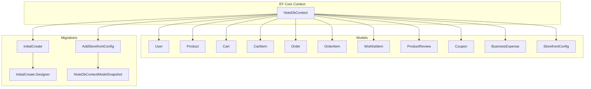
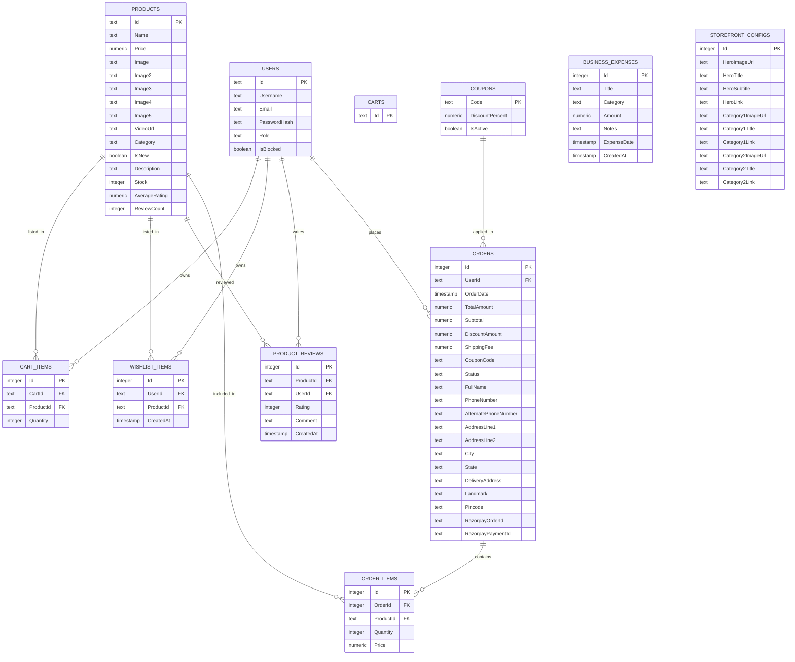
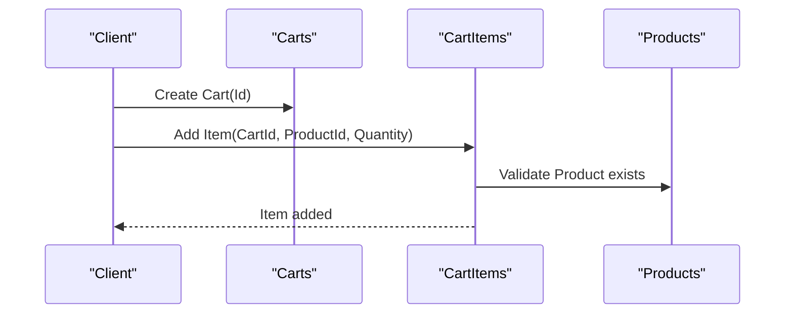
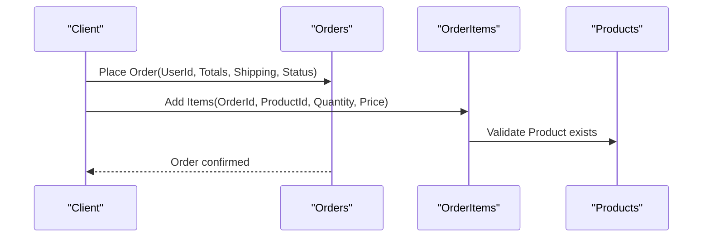
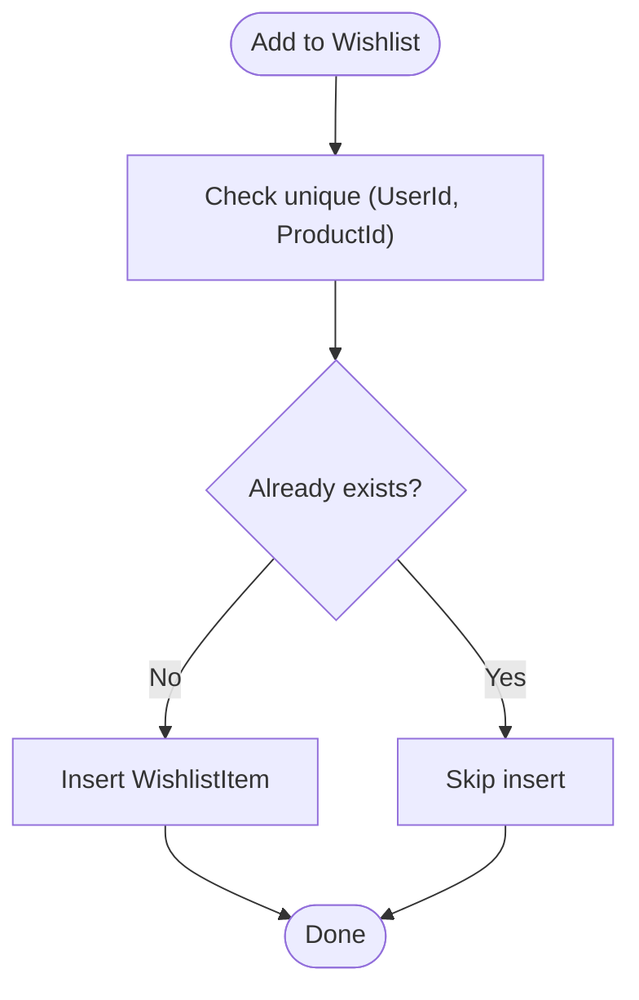
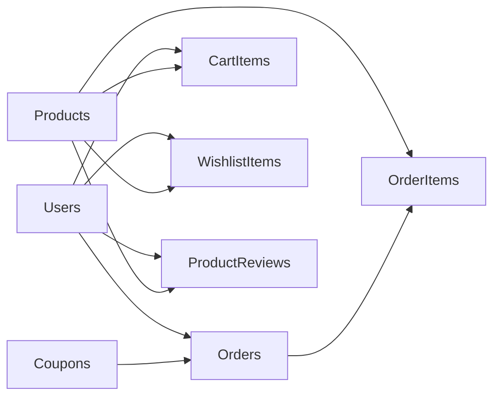

# Database Schema & Entity Relationships

<cite>
**Referenced Files in This Document**
- [NoteDbContext.cs](file://Data/NoteDbContext.cs)
- [20260427184435_InitialCreate.cs](file://Migrations/20260427184435_InitialCreate.cs)
- [20260503221515_AddStorefrontConfig.cs](file://Migrations/20260503221515_AddStorefrontConfig.cs)
- [InitialCreate.Designer.cs](file://Migrations/20260427184435_InitialCreate.Designer.cs)
- [NoteDbContextModelSnapshot.cs](file://Migrations/NoteDbContextModelSnapshot.cs)
- [Program.cs](file://Program.cs)
- [User.cs](file://Models/User.cs)
- [Product.cs](file://Models/Product.cs)
- [Cart.cs](file://Models/Cart.cs)
- [CartItem.cs](file://Models/CartItem.cs)
- [Order.cs](file://Models/Order.cs)
- [OrderItem.cs](file://Models/OrderItem.cs)
- [WishlistItem.cs](file://Models/WishlistItem.cs)
- [ProductReview.cs](file://Models/ProductReview.cs)
- [Coupon.cs](file://Models/Coupon.cs)
- [BusinessExpense.cs](file://Models/BusinessExpense.cs)
- [StorefrontConfig.cs](file://Models/StorefrontConfig.cs)
</cite>

## Table of Contents
1. [Introduction](#introduction)
2. [Project Structure](#project-structure)
3. [Core Components](#core-components)
4. [Architecture Overview](#architecture-overview)
5. [Detailed Component Analysis](#detailed-component-analysis)
6. [Dependency Analysis](#dependency-analysis)
7. [Performance Considerations](#performance-considerations)
8. [Troubleshooting Guide](#troubleshooting-guide)
9. [Conclusion](#conclusion)
10. [Appendices](#appendices)

## Introduction
This document provides comprehensive database schema documentation for the Note.Backend application. It details the entity relationship diagram, primary and foreign keys, indexes, constraints, and referential integrity rules. It also documents the migration history, seed data configuration, and table creation scripts. Indexing strategies and performance optimizations are addressed to support efficient queries and maintain data integrity.

## Project Structure
The database schema is defined via Entity Framework Core models and migrations. The context registers all entities and seeds initial data. Migrations define the physical schema and indexes. The application bootstraps the database and applies migrations at startup.

**Diagram sources**
- [NoteDbContext.cs:11-21](file://Data/NoteDbContext.cs#L11-L21)
- [20260427184435_InitialCreate.cs:15-359](file://Migrations/20260427184435_InitialCreate.cs#L15-L359)
- [20260503221515_AddStorefrontConfig.cs:12-45](file://Migrations/20260503221515_AddStorefrontConfig.cs#L12-L45)
- [InitialCreate.Designer.cs:19-598](file://Migrations/20260427184435_InitialCreate.Designer.cs#L19-L598)
- [NoteDbContextModelSnapshot.cs:16-638](file://Migrations/NoteDbContextModelSnapshot.cs#L16-L638)

**Section sources**
- [NoteDbContext.cs:11-21](file://Data/NoteDbContext.cs#L11-L21)
- [Program.cs:38-109](file://Program.cs#L38-L109)

## Core Components
This section summarizes each table’s schema, primary keys, foreign keys, indexes, and constraints as defined by migrations and model configurations.

- Users
  - Primary key: Id (text)
  - Columns: Id, Username, Email, PasswordHash, Role, IsBlocked
  - Constraints: Not null for required fields
  - Indexes: None
  - Notes: Seeded admin user exists

- Products
  - Primary key: Id (text)
  - Columns: Id, Name, Price, Image, Image2–Image5, VideoUrl, Category, IsNew, Description, Stock, AverageRating, ReviewCount
  - Constraints: Not null for required fields
  - Indexes: None
  - Notes: Seeded product catalog exists

- Carts
  - Primary key: Id (text)
  - Columns: Id
  - Constraints: Not null for Id
  - Indexes: None

- CartItems
  - Primary key: Id (integer, identity)
  - Foreign keys: CartId → Carts(Id), ProductId → Products(Id)
  - Columns: Id, CartId, ProductId, Quantity
  - Constraints: Not null for required fields; cascade delete on FKs
  - Indexes: IX_CartItems_CartId, IX_CartItems_ProductId

- Orders
  - Primary key: Id (integer, identity)
  - Foreign key: UserId → Users(Id)
  - Columns: Id, UserId, OrderDate, TotalAmount, Subtotal, DiscountAmount, ShippingFee, CouponCode, Status, FullName, PhoneNumber, AlternatePhoneNumber, AddressLine1, AddressLine2, City, State, DeliveryAddress, Landmark, Pincode, RazorpayOrderId, RazorpayPaymentId
  - Constraints: Not null for required fields; cascade delete on FK
  - Indexes: IX_Orders_UserId
  - Notes: Additional columns are added at runtime via raw SQL during startup

- OrderItems
  - Primary key: Id (integer, identity)
  - Foreign keys: OrderId → Orders(Id), ProductId → Products(Id)
  - Columns: Id, OrderId, ProductId, Quantity, Price
  - Constraints: Not null for required fields; cascade delete on FKs
  - Indexes: IX_OrderItems_OrderId, IX_OrderItems_ProductId

- WishlistItems
  - Primary key: Id (integer, identity)
  - Foreign keys: UserId → Users(Id), ProductId → Products(Id)
  - Columns: Id, UserId, ProductId, CreatedAt
  - Constraints: Not null for required fields; cascade delete on FKs
  - Indexes: IX_WishlistItems_ProductId; unique composite index IX_WishlistItems_UserId_ProductId

- ProductReviews
  - Primary key: Id (integer, identity)
  - Foreign keys: ProductId → Products(Id), UserId → Users(Id)
  - Columns: Id, ProductId, UserId, Rating, Comment, CreatedAt
  - Constraints: Not null for required fields; cascade delete on FKs
  - Indexes: IX_ProductReviews_ProductId; unique composite index IX_ProductReviews_UserId_ProductId

- Coupons
  - Primary key: Code (text)
  - Columns: Code, DiscountPercent, IsActive
  - Constraints: Not null for required fields
  - Indexes: None
  - Notes: Seeded coupon codes exist

- BusinessExpenses
  - Primary key: Id (integer, identity)
  - Columns: Id, Title, Category, Amount, Notes, ExpenseDate, CreatedAt
  - Constraints: Not null for required fields
  - Indexes: None

- StorefrontConfigs
  - Primary key: Id (integer, identity)
  - Columns: Id, HeroImageUrl, HeroTitle, HeroSubtitle, HeroLink, Category1ImageUrl, Category1Title, Category1Link, Category2ImageUrl, Category2Title, Category2Link
  - Constraints: Not null for required fields
  - Indexes: None

**Section sources**
- [20260427184435_InitialCreate.cs:17-359](file://Migrations/20260427184435_InitialCreate.cs#L17-L359)
- [20260503221515_AddStorefrontConfig.cs:14-34](file://Migrations/20260503221515_AddStorefrontConfig.cs#L14-L34)
- [InitialCreate.Designer.cs:28-598](file://Migrations/20260427184435_InitialCreate.Designer.cs#L28-L598)
- [NoteDbContextModelSnapshot.cs:25-638](file://Migrations/NoteDbContextModelSnapshot.cs#L25-L638)
- [NoteDbContext.cs:27-65](file://Data/NoteDbContext.cs#L27-L65)

## Architecture Overview
The database architecture follows a normalized e-commerce schema with explicit linking tables for cart, orders, wishlists, and reviews. Referential integrity is enforced via foreign keys with cascade deletes. Indexes are strategically placed to optimize joins and uniqueness checks.

**Diagram sources**
- [20260427184435_InitialCreate.cs:17-359](file://Migrations/20260427184435_InitialCreate.cs#L17-L359)
- [20260503221515_AddStorefrontConfig.cs:14-34](file://Migrations/20260503221515_AddStorefrontConfig.cs#L14-L34)
- [InitialCreate.Designer.cs:28-598](file://Migrations/20260427184435_InitialCreate.Designer.cs#L28-L598)
- [NoteDbContextModelSnapshot.cs:25-638](file://Migrations/NoteDbContextModelSnapshot.cs#L25-L638)

## Detailed Component Analysis

### Users
- Purpose: Authentication and role management.
- Schema highlights: Id as PK; Role defaults to “User”; seeded Admin.
- Referential integrity: Used by Orders, CartItems, WishlistItems, ProductReviews.

**Section sources**
- [User.cs:3-11](file://Models/User.cs#L3-L11)
- [20260427184435_InitialCreate.cs:84-98](file://Migrations/20260427184435_InitialCreate.cs#L84-L98)
- [InitialCreate.Designer.cs:431-469](file://Migrations/20260427184435_InitialCreate.Designer.cs#L431-L469)
- [NoteDbContext.cs:28-37](file://Data/NoteDbContext.cs#L28-L37)

### Products
- Purpose: Catalog items with inventory and ratings.
- Schema highlights: Id as PK; stock and rating metadata; multiple images and optional video.
- Referential integrity: Used by CartItems, OrderItems, WishlistItems, ProductReviews.

**Section sources**
- [Product.cs:3-20](file://Models/Product.cs#L3-L20)
- [20260427184435_InitialCreate.cs:59-82](file://Migrations/20260427184435_InitialCreate.cs#L59-L82)
- [InitialCreate.Designer.cs:241-294](file://Migrations/20260427184435_InitialCreate.Designer.cs#L241-L294)
- [NoteDbContext.cs:49-59](file://Data/NoteDbContext.cs#L49-L59)

### Carts and CartItems
- Purpose: Shopping cart persistence.
- Schema highlights: Carts.Id as PK; CartItems.Id as PK with FKs to Carts and Products; cascade delete.
- Indexes: IX_CartItems_CartId, IX_CartItems_ProductId.

**Diagram sources**
- [20260427184435_InitialCreate.cs:100-125](file://Migrations/20260427184435_InitialCreate.cs#L100-L125)
- [InitialCreate.Designer.cs:72-98](file://Migrations/20260427184435_InitialCreate.Designer.cs#L72-L98)

**Section sources**
- [Cart.cs:5-9](file://Models/Cart.cs#L5-L9)
- [CartItem.cs:3-11](file://Models/CartItem.cs#L3-L11)
- [20260427184435_InitialCreate.cs:100-125](file://Migrations/20260427184435_InitialCreate.cs#L100-L125)
- [InitialCreate.Designer.cs:72-98](file://Migrations/20260427184435_InitialCreate.Designer.cs#L72-L98)

### Orders and OrderItems
- Purpose: Purchase records and ordered items.
- Schema highlights: Orders.Id as PK with FK to Users; OrderItems.Id as PK with FKs to Orders and Products; cascade delete.
- Indexes: IX_Orders_UserId, IX_OrderItems_OrderId, IX_OrderItems_ProductId.
- Runtime additions: Additional shipping/payment fields added via raw SQL at startup.

**Diagram sources**
- [20260427184435_InitialCreate.cs:127-161](file://Migrations/20260427184435_InitialCreate.cs#L127-L161)
- [20260427184435_InitialCreate.cs:219-245](file://Migrations/20260427184435_InitialCreate.cs#L219-L245)
- [Program.cs:110-138](file://Program.cs#L110-L138)

**Section sources**
- [Order.cs:3-33](file://Models/Order.cs#L3-L33)
- [OrderItem.cs:35-46](file://Models/Order.cs#L35-L46)
- [20260427184435_InitialCreate.cs:127-161](file://Migrations/20260427184435_InitialCreate.cs#L127-L161)
- [20260427184435_InitialCreate.cs:219-245](file://Migrations/20260427184435_InitialCreate.cs#L219-L245)
- [Program.cs:110-138](file://Program.cs#L110-L138)

### WishlistItems
- Purpose: User favorites.
- Schema highlights: Composite unique index on (UserId, ProductId); cascade delete.

**Diagram sources**
- [20260427184435_InitialCreate.cs:192-217](file://Migrations/20260427184435_InitialCreate.cs#L192-L217)
- [NoteDbContext.cs:41-47](file://Data/NoteDbContext.cs#L41-L47)

**Section sources**
- [WishlistItem.cs:3-11](file://Models/WishlistItem.cs#L3-L11)
- [20260427184435_InitialCreate.cs:192-217](file://Migrations/20260427184435_InitialCreate.cs#L192-L217)
- [NoteDbContext.cs:41-47](file://Data/NoteDbContext.cs#L41-L47)

### ProductReviews
- Purpose: Customer feedback.
- Schema highlights: Composite unique index on (UserId, ProductId); cascade delete.

**Section sources**
- [ProductReview.cs:3-13](file://Models/ProductReview.cs#L3-L13)
- [20260427184435_InitialCreate.cs:163-190](file://Migrations/20260427184435_InitialCreate.cs#L163-L190)
- [NoteDbContext.cs:45-47](file://Data/NoteDbContext.cs#L45-L47)

### Coupons
- Purpose: Discount codes.
- Schema highlights: Code as PK; IsActive flag; DiscountPercent stored as percentage.

**Section sources**
- [Coupon.cs:3-8](file://Models/Coupon.cs#L3-L8)
- [20260427184435_InitialCreate.cs:46-57](file://Migrations/20260427184435_InitialCreate.cs#L46-L57)
- [NoteDbContext.cs:39](file://Data/NoteDbContext.cs#L39)
- [NoteDbContext.cs:61-64](file://Data/NoteDbContext.cs#L61-L64)

### BusinessExpenses
- Purpose: Operational expense tracking.
- Schema highlights: Identity PK; categorized expenses; date and timestamps.

**Section sources**
- [BusinessExpense.cs:3-12](file://Models/BusinessExpense.cs#L3-L12)
- [20260427184435_InitialCreate.cs:17-33](file://Migrations/20260427184435_InitialCreate.cs#L17-L33)

### StorefrontConfigs
- Purpose: CMS-like storefront configuration.
- Schema highlights: Identity PK; hero and category sections.

**Section sources**
- [StorefrontConfig.cs:3-22](file://Models/StorefrontConfig.cs#L3-L22)
- [20260503221515_AddStorefrontConfig.cs:14-34](file://Migrations/20260503221515_AddStorefrontConfig.cs#L14-L34)

## Dependency Analysis
- Referential integrity: Enforced via foreign keys with cascade deletes for cart, wishlist, review, order-item, and order-user relationships.
- Indexes: Exist for join columns and unique constraints to improve query performance.
- Runtime schema adjustments: Startup adds shipping/payment fields to Orders via raw SQL.

**Diagram sources**
- [20260427184435_InitialCreate.cs:113-124](file://Migrations/20260427184435_InitialCreate.cs#L113-L124)
- [20260427184435_InitialCreate.cs:155-160](file://Migrations/20260427184435_InitialCreate.cs#L155-L160)
- [20260427184435_InitialCreate.cs:233-244](file://Migrations/20260427184435_InitialCreate.cs#L233-L244)
- [20260427184435_InitialCreate.cs:205-217](file://Migrations/20260427184435_InitialCreate.cs#L205-L217)
- [20260427184435_InitialCreate.cs:178-189](file://Migrations/20260427184435_InitialCreate.cs#L178-L189)

**Section sources**
- [Program.cs:104-138](file://Program.cs#L104-L138)

## Performance Considerations
- Indexes
  - CartItems: IX_CartItems_CartId, IX_CartItems_ProductId
  - OrderItems: IX_OrderItems_OrderId, IX_OrderItems_ProductId
  - Orders: IX_Orders_UserId
  - WishlistItems: IX_WishlistItems_ProductId and unique composite index IX_WishlistItems_UserId_ProductId
  - ProductReviews: IX_ProductReviews_ProductId and unique composite index IX_ProductReviews_UserId_ProductId
- Recommendations
  - Consider adding indexes on frequently filtered/sorted columns (e.g., Products.Category, Orders.Status, Orders.OrderDate).
  - Monitor slow queries and add selective indexes for common filters.
  - Normalize further if needed (e.g., separate shipping address table) to reduce duplication.

[No sources needed since this section provides general guidance]

## Troubleshooting Guide
- Migration errors
  - Ensure the connection string is configured via ConnectionStrings:DefaultConnection or DATABASE_URL environment variable.
  - Verify PostgreSQL connectivity and credentials.
- Seed data issues
  - Admin user and initial products/coupons are seeded via model configuration and migrations; confirm migrations applied successfully.
- Runtime schema changes
  - Startup applies raw SQL to Orders for additional fields; ensure permissions allow altering tables.

**Section sources**
- [Program.cs:25-39](file://Program.cs#L25-L39)
- [Program.cs:104-138](file://Program.cs#L104-L138)
- [NoteDbContext.cs:27-65](file://Data/NoteDbContext.cs#L27-L65)

## Conclusion
The Note.Backend database schema is designed around a clean e-commerce model with strong referential integrity and targeted indexes. Migrations define the baseline schema, while model seeding ensures immediate usability. Runtime adjustments enhance order handling capabilities. The documented relationships and constraints provide a solid foundation for application development and maintenance.

[No sources needed since this section summarizes without analyzing specific files]

## Appendices

### Migration History
- InitialCreate
  - Creates Users, Products, Carts, CartItems, Orders, OrderItems, WishlistItems, ProductReviews, Coupons, BusinessExpenses.
  - Adds indexes for join and uniqueness.
  - Seeds Users, Products, and Coupons.
- AddStorefrontConfig
  - Adds StorefrontConfigs table.

**Section sources**
- [20260427184435_InitialCreate.cs:15-359](file://Migrations/20260427184435_InitialCreate.cs#L15-L359)
- [20260503221515_AddStorefrontConfig.cs:12-45](file://Migrations/20260503221515_AddStorefrontConfig.cs#L12-L45)

### Seed Data Configuration
- Admin user
  - Id, Username, Email, PasswordHash, Role
- Products
  - Multiple entries with Id, Name, Price, Category, Stock, and metadata
- Coupons
  - Code, DiscountPercent, IsActive

**Section sources**
- [NoteDbContext.cs:27-65](file://Data/NoteDbContext.cs#L27-L65)

### Table Creation Scripts
- Users: Primary key Id (text)
- Products: Primary key Id (text)
- Carts: Primary key Id (text)
- CartItems: Primary key Id (integer), foreign keys CartId → Carts, ProductId → Products; indexes on CartId and ProductId
- Orders: Primary key Id (integer), foreign key UserId → Users; indexes on UserId
- OrderItems: Primary key Id (integer), foreign keys OrderId → Orders, ProductId → Products; indexes on OrderId and ProductId
- WishlistItems: Primary key Id (integer), foreign keys UserId → Users, ProductId → Products; unique composite index (UserId, ProductId)
- ProductReviews: Primary key Id (integer), foreign keys ProductId → Products, UserId → Users; unique composite index (UserId, ProductId)
- Coupons: Primary key Code (text)
- BusinessExpenses: Primary key Id (integer)
- StorefrontConfigs: Primary key Id (integer)

**Section sources**
- [20260427184435_InitialCreate.cs:17-359](file://Migrations/20260427184435_InitialCreate.cs#L17-L359)
- [20260503221515_AddStorefrontConfig.cs:14-34](file://Migrations/20260503221515_AddStorefrontConfig.cs#L14-L34)