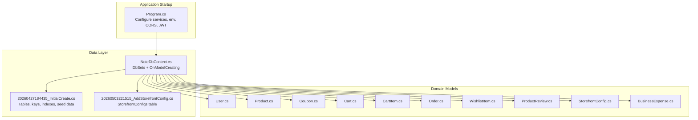
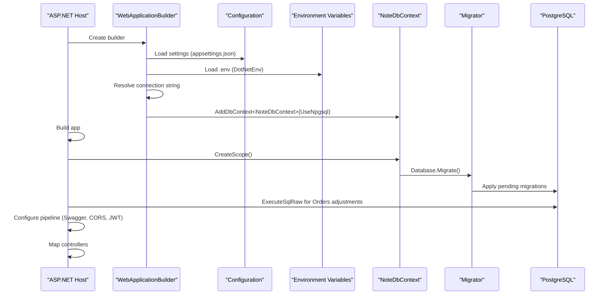
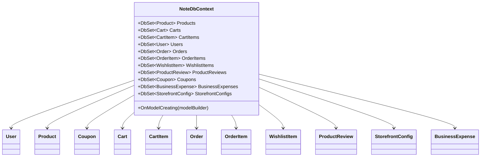
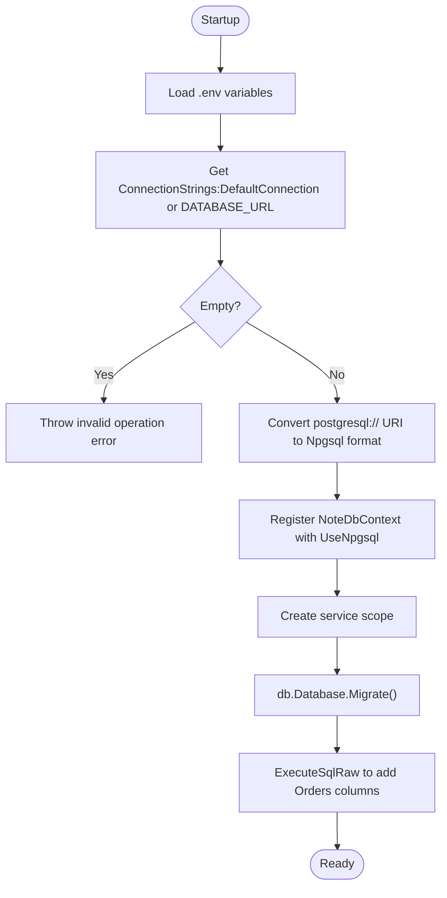
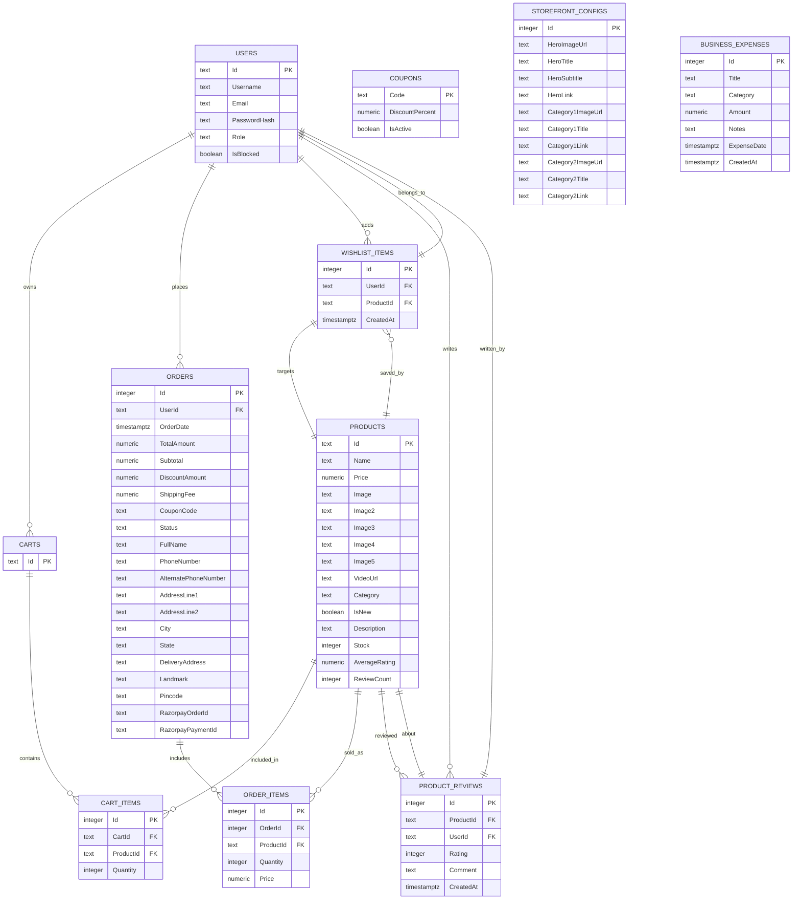
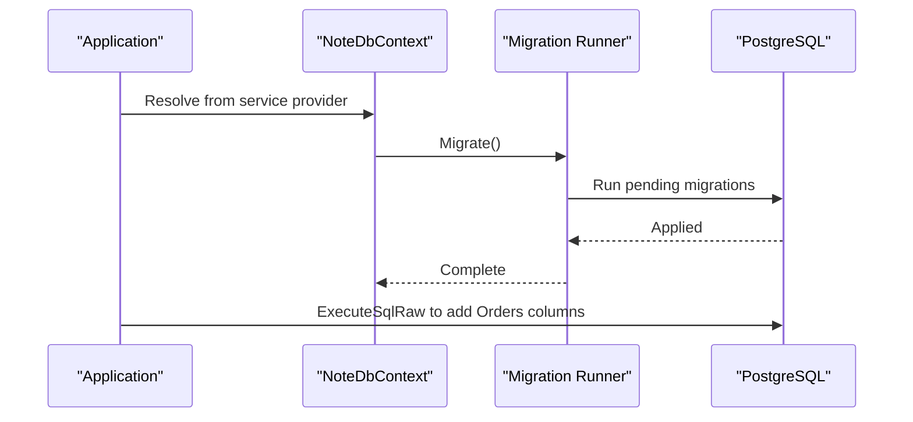
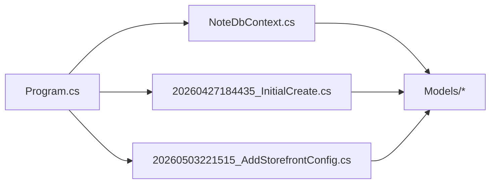

# Entity Framework Implementation

<cite>
**Referenced Files in This Document**
- [NoteDbContext.cs](file://Data/NoteDbContext.cs)
- [Program.cs](file://Program.cs)
- [appsettings.json](file://appsettings.json)
- [20260427184435_InitialCreate.cs](file://Migrations/20260427184435_InitialCreate.cs)
- [20260503221515_AddStorefrontConfig.cs](file://Migrations/20260503221515_AddStorefrontConfig.cs)
- [User.cs](file://Models/User.cs)
- [Product.cs](file://Models/Product.cs)
- [Coupon.cs](file://Models/Coupon.cs)
- [Cart.cs](file://Models/Cart.cs)
- [CartItem.cs](file://Models/CartItem.cs)
- [Order.cs](file://Models/Order.cs)
- [WishlistItem.cs](file://Models/WishlistItem.cs)
- [ProductReview.cs](file://Models/ProductReview.cs)
- [StorefrontConfig.cs](file://Models/StorefrontConfig.cs)
- [BusinessExpense.cs](file://Models/BusinessExpense.cs)
</cite>

## Table of Contents
1. [Introduction](#introduction)
2. [Project Structure](#project-structure)
3. [Core Components](#core-components)
4. [Architecture Overview](#architecture-overview)
5. [Detailed Component Analysis](#detailed-component-analysis)
6. [Dependency Analysis](#dependency-analysis)
7. [Performance Considerations](#performance-considerations)
8. [Troubleshooting Guide](#troubleshooting-guide)
9. [Conclusion](#conclusion)
10. [Appendices](#appendices)

## Introduction
This document explains the Entity Framework Core implementation in Note.Backend. It covers the database context configuration, connection string management, service registration, model configuration, migration system, seeding strategy, performance considerations, and troubleshooting guidance. The backend uses PostgreSQL via Npgsql and applies automatic migrations at startup, along with manual schema adjustments for evolving requirements.

## Project Structure
The data access layer centers around a single DbContext and a set of domain models. Migrations define the evolving schema, while the application bootstraps the database and applies migrations during startup.

**Diagram sources**
- [Program.cs](file://Program.cs)
- [NoteDbContext.cs](file://Data/NoteDbContext.cs)
- [20260427184435_InitialCreate.cs](file://Migrations/20260427184435_InitialCreate.cs)
- [20260503221515_AddStorefrontConfig.cs](file://Migrations/20260503221515_AddStorefrontConfig.cs)
- [User.cs](file://Models/User.cs)
- [Product.cs](file://Models/Product.cs)
- [Coupon.cs](file://Models/Coupon.cs)
- [Cart.cs](file://Models/Cart.cs)
- [CartItem.cs](file://Models/CartItem.cs)
- [Order.cs](file://Models/Order.cs)
- [WishlistItem.cs](file://Models/WishlistItem.cs)
- [ProductReview.cs](file://Models/ProductReview.cs)
- [StorefrontConfig.cs](file://Models/StorefrontConfig.cs)
- [BusinessExpense.cs](file://Models/BusinessExpense.cs)

**Section sources**
- [Program.cs](file://Program.cs)
- [NoteDbContext.cs](file://Data/NoteDbContext.cs)
- [20260427184435_InitialCreate.cs](file://Migrations/20260427184435_InitialCreate.cs)
- [20260503221515_AddStorefrontConfig.cs](file://Migrations/20260503221515_AddStorefrontConfig.cs)

## Core Components
- NoteDbContext: Declares DbSets for all entities and configures model-level settings, including unique indexes, primary keys, and seed data for Users, Products, and Coupons.
- Program.cs: Loads environment variables, resolves the connection string, registers the DbContext with Npgsql provider, and applies migrations at startup. It also performs targeted schema adjustments for the Orders table.
- appsettings.json: Provides default connection string and JWT key for local development.

Key responsibilities:
- Connection string resolution and conversion for PostgreSQL URIs.
- Automatic migration application at startup.
- Seeding of admin user, initial products, and coupons.
- Manual schema adjustments for evolving requirements.

**Section sources**
- [NoteDbContext.cs](file://Data/NoteDbContext.cs)
- [Program.cs](file://Program.cs)
- [appsettings.json](file://appsettings.json)

## Architecture Overview
The application initializes the EF Core pipeline, connects to PostgreSQL, ensures the database is up-to-date, and exposes controllers that operate on strongly typed models.

**Diagram sources**
- [Program.cs](file://Program.cs)
- [NoteDbContext.cs](file://Data/NoteDbContext.cs)

## Detailed Component Analysis

### NoteDbContext Configuration
- DbContextOptions injection: Receives options to configure EF Core runtime.
- DbSet declarations: Expose all domain entities for querying and change tracking.
- OnModelCreating:
  - Seeds an admin User with predefined identity attributes.
  - Defines Coupon.Code as the primary key.
  - Creates a unique composite index on WishlistItem(UserId, ProductId).
  - Creates a unique composite index on ProductReview(UserId, ProductId).
  - Seeds initial Products and Coupons.

**Diagram sources**
- [NoteDbContext.cs](file://Data/NoteDbContext.cs)
- [User.cs](file://Models/User.cs)
- [Product.cs](file://Models/Product.cs)
- [Coupon.cs](file://Models/Coupon.cs)
- [Cart.cs](file://Models/Cart.cs)
- [CartItem.cs](file://Models/CartItem.cs)
- [Order.cs](file://Models/Order.cs)
- [WishlistItem.cs](file://Models/WishlistItem.cs)
- [ProductReview.cs](file://Models/ProductReview.cs)
- [StorefrontConfig.cs](file://Models/StorefrontConfig.cs)
- [BusinessExpense.cs](file://Models/BusinessExpense.cs)

**Section sources**
- [NoteDbContext.cs](file://Data/NoteDbContext.cs)

### Connection String Management and Service Registration
- Environment loading: DotNetEnv.Env.Load() reads environment variables from a .env file.
- Connection string resolution:
  - Reads ConnectionStrings:DefaultConnection from configuration.
  - Falls back to DATABASE_URL from configuration or environment variable.
  - Validates presence and throws if missing.
- URI conversion:
  - Converts postgresql://... URIs to Npgsql key-value format.
- DbContext registration:
  - Adds NoteDbContext with UseNpgsql(connectionString).
- Automatic migrations:
  - At startup, creates a service scope, resolves NoteDbContext, and calls Database.Migrate().
- Manual adjustments:
  - Executes SQL to add new columns to Orders for shipping and payment metadata.

**Diagram sources**
- [Program.cs](file://Program.cs)

**Section sources**
- [Program.cs](file://Program.cs)
- [appsettings.json](file://appsettings.json)

### Model Configuration and Relationships
- Primary Keys:
  - Coupon.Code is configured as the primary key in the model configuration.
  - StorefrontConfig.Id is the primary key.
- Unique Constraints:
  - WishlistItem: unique (UserId, ProductId).
  - ProductReview: unique (UserId, ProductId).
- Foreign Keys:
  - CartItem.CartId -> Carts.Id (Cascade delete).
  - CartItem.ProductId -> Products.Id (Cascade delete).
  - Order.UserId -> Users.Id (Cascade delete).
  - OrderItem.OrderId -> Orders.Id (Cascade delete).
  - OrderItem.ProductId -> Products.Id (Cascade delete).
  - WishlistItem.UserId -> Users.Id (Cascade delete).
  - WishlistItem.ProductId -> Products.Id (Cascade delete).
  - ProductReview.ProductId -> Products.Id (Cascade delete).
  - ProductReview.UserId -> Users.Id (Cascade delete).
- Indexes:
  - CartItems: separate indexes on CartId and ProductId.
  - OrderItems: separate indexes on OrderId and ProductId.
  - Orders: index on UserId.
  - ProductReviews: index on ProductId and unique composite index on (UserId, ProductId).
  - WishlistItems: index on ProductId and unique composite index on (UserId, ProductId).

**Diagram sources**
- [NoteDbContext.cs](file://Data/NoteDbContext.cs)
- [20260427184435_InitialCreate.cs](file://Migrations/20260427184435_InitialCreate.cs)
- [20260503221515_AddStorefrontConfig.cs](file://Migrations/20260503221515_AddStorefrontConfig.cs)
- [User.cs](file://Models/User.cs)
- [Product.cs](file://Models/Product.cs)
- [Coupon.cs](file://Models/Coupon.cs)
- [Cart.cs](file://Models/Cart.cs)
- [CartItem.cs](file://Models/CartItem.cs)
- [Order.cs](file://Models/Order.cs)
- [WishlistItem.cs](file://Models/WishlistItem.cs)
- [ProductReview.cs](file://Models/ProductReview.cs)
- [StorefrontConfig.cs](file://Models/StorefrontConfig.cs)
- [BusinessExpense.cs](file://Models/BusinessExpense.cs)

**Section sources**
- [NoteDbContext.cs](file://Data/NoteDbContext.cs)
- [20260427184435_InitialCreate.cs](file://Migrations/20260427184435_InitialCreate.cs)
- [20260503221515_AddStorefrontConfig.cs](file://Migrations/20260503221515_AddStorefrontConfig.cs)

### Migration System
- InitialCreate migration:
  - Creates tables for all entities.
  - Defines primary keys, foreign keys, and indexes.
  - Seeds initial data for Coupons, Products, and Users.
- AddStorefrontConfig migration:
  - Adds the StorefrontConfigs table for storefront content management.
- Automatic application:
  - Program.cs applies migrations at startup using Database.Migrate().
- Manual adjustments:
  - Program.cs executes SQL to add new columns to Orders for shipping and payment metadata.

**Diagram sources**
- [Program.cs](file://Program.cs)
- [20260427184435_InitialCreate.cs](file://Migrations/20260427184435_InitialCreate.cs)
- [20260503221515_AddStorefrontConfig.cs](file://Migrations/20260503221515_AddStorefrontConfig.cs)

**Section sources**
- [Program.cs](file://Program.cs)
- [20260427184435_InitialCreate.cs](file://Migrations/20260427184435_InitialCreate.cs)
- [20260503221515_AddStorefrontConfig.cs](file://Migrations/20260503221515_AddStorefrontConfig.cs)

### Seeding Strategy
- Admin User:
  - Seeded in OnModelCreating with a predefined Id, username, email, password hash, and role.
- Products:
  - Seeded in OnModelCreating with multiple entries covering various categories and stock levels.
- Coupons:
  - Seeded in OnModelCreating with discount codes and active status.
- Notes:
  - Additional seed data is also present in the InitialCreate migration for consistency.

**Section sources**
- [NoteDbContext.cs](file://Data/NoteDbContext.cs)
- [20260427184435_InitialCreate.cs](file://Migrations/20260427184435_InitialCreate.cs)

## Dependency Analysis
- Program.cs depends on:
  - Configuration and environment variables for connection string resolution.
  - NoteDbContext registration and migration execution.
- NoteDbContext depends on:
  - All model types for DbSet exposure.
  - Model configuration for keys, indexes, and seeds.
- Migrations depend on:
  - Npgsql provider and PostgreSQL schema definitions.
  - Consistency with model definitions and indexes.

**Diagram sources**
- [Program.cs](file://Program.cs)
- [NoteDbContext.cs](file://Data/NoteDbContext.cs)
- [20260427184435_InitialCreate.cs](file://Migrations/20260427184435_InitialCreate.cs)
- [20260503221515_AddStorefrontConfig.cs](file://Migrations/20260503221515_AddStorefrontConfig.cs)

**Section sources**
- [Program.cs](file://Program.cs)
- [NoteDbContext.cs](file://Data/NoteDbContext.cs)
- [20260427184435_InitialCreate.cs](file://Migrations/20260427184435_InitialCreate.cs)
- [20260503221515_AddStorefrontConfig.cs](file://Migrations/20260503221515_AddStorefrontConfig.cs)

## Performance Considerations
- Indexes:
  - Separate indexes on foreign keys improve join performance for CartItems, OrderItems, and Orders.
  - Unique composite indexes on WishlistItem and ProductReview prevent duplicates and speed up lookups.
- Queries:
  - Prefer projection to DTOs to reduce payload size.
  - Use Include only when necessary; consider split queries for complex navigations.
- Transactions:
  - Batch related writes within a single transaction to minimize round trips.
- Concurrency:
  - Use optimistic concurrency with row version columns where applicable.
- Migrations:
  - Keep migrations small and incremental; avoid long-running migrations in production.
- Connection:
  - Ensure connection pooling is enabled via the provider defaults; avoid opening connections manually outside of DbContext scopes.

## Troubleshooting Guide
Common Entity Framework issues and resolutions:
- Missing connection string:
  - Symptom: Startup fails with an invalid operation error indicating no database connection string.
  - Resolution: Set ConnectionStrings:DefaultConnection or DATABASE_URL in configuration or environment variables.
- PostgreSQL URI format:
  - Symptom: Provider errors due to postgresql:// URI format.
  - Resolution: The application converts postgresql:// URIs to Npgsql key-value format automatically.
- Migration failures:
  - Symptom: Errors applying migrations.
  - Resolution: Verify schema matches model configuration; check for conflicting indexes or constraints; re-run migration after correcting model definitions.
- Unique constraint violations:
  - Symptom: Errors inserting WishlistItem or ProductReview with duplicate (UserId, ProductId).
  - Resolution: Ensure uniqueness constraints are respected; validate client-side checks before insert.
- Orders schema drift:
  - Symptom: Missing shipping/payment fields in Orders.
  - Resolution: The application applies migrations and executes SQL to add new columns; confirm execution succeeded.

**Section sources**
- [Program.cs](file://Program.cs)
- [NoteDbContext.cs](file://Data/NoteDbContext.cs)
- [20260427184435_InitialCreate.cs](file://Migrations/20260427184435_InitialCreate.cs)

## Conclusion
Note.Backend’s Entity Framework implementation centers on a clean, explicit DbContext with comprehensive model configuration, robust connection string management, and a pragmatic migration strategy. Automatic migrations at startup ensure schema consistency, while targeted manual adjustments support evolving business needs. Seeding provides immediate operational readiness for admin users, products, and coupons. Following the performance and troubleshooting guidance will help maintain reliability and scalability.

## Appendices
- Best practices summary:
  - Keep migrations minimal and versioned.
  - Use unique indexes for high-cardinality lookup pairs.
  - Avoid N+1 queries; leverage eager loading judiciously.
  - Centralize connection string resolution and validation.
  - Monitor migration logs and test schema changes in staging.