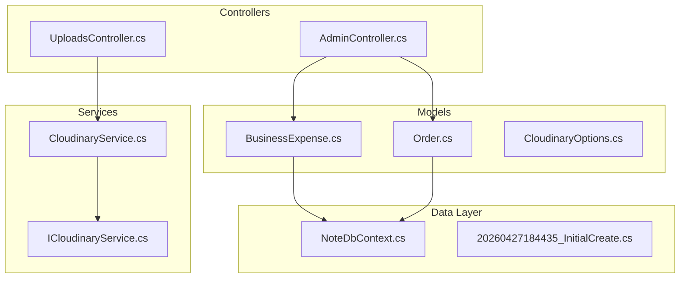
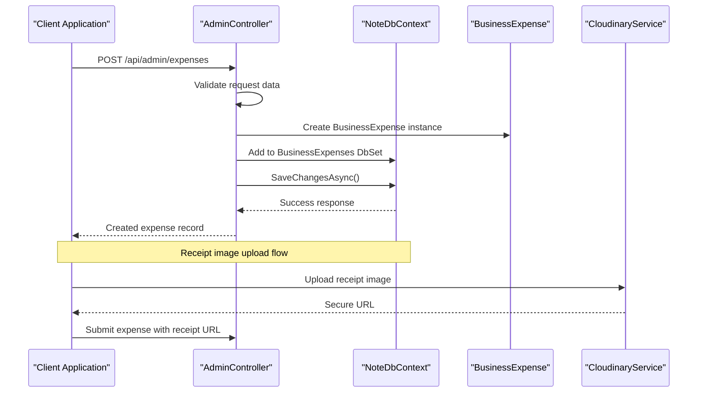
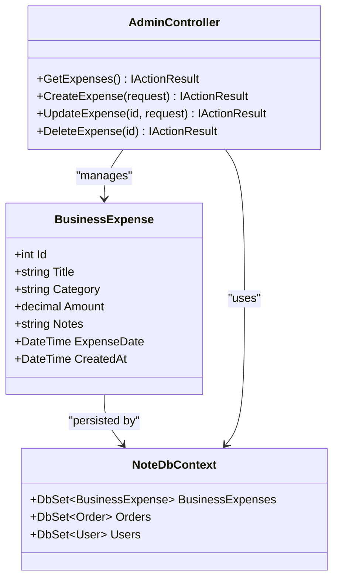
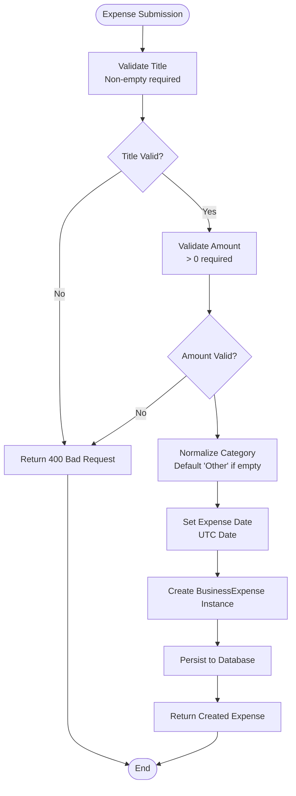
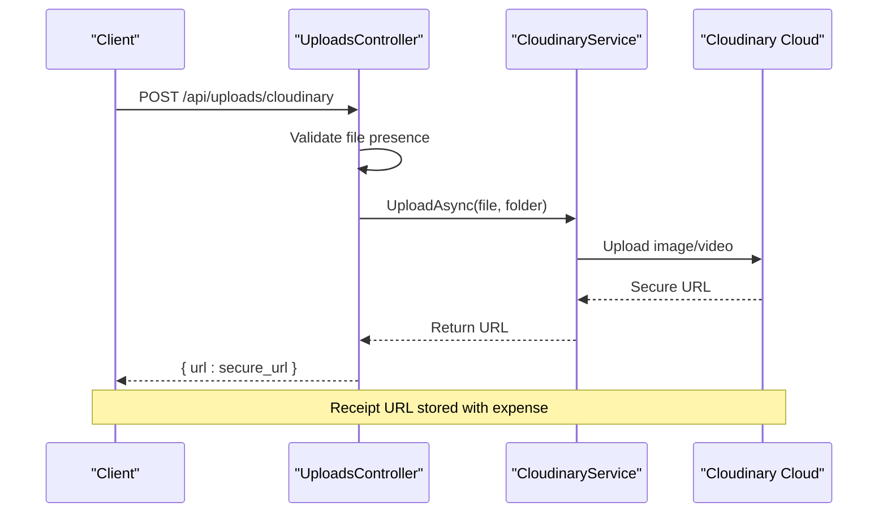
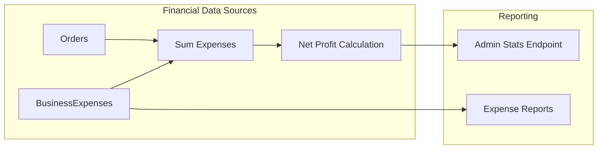
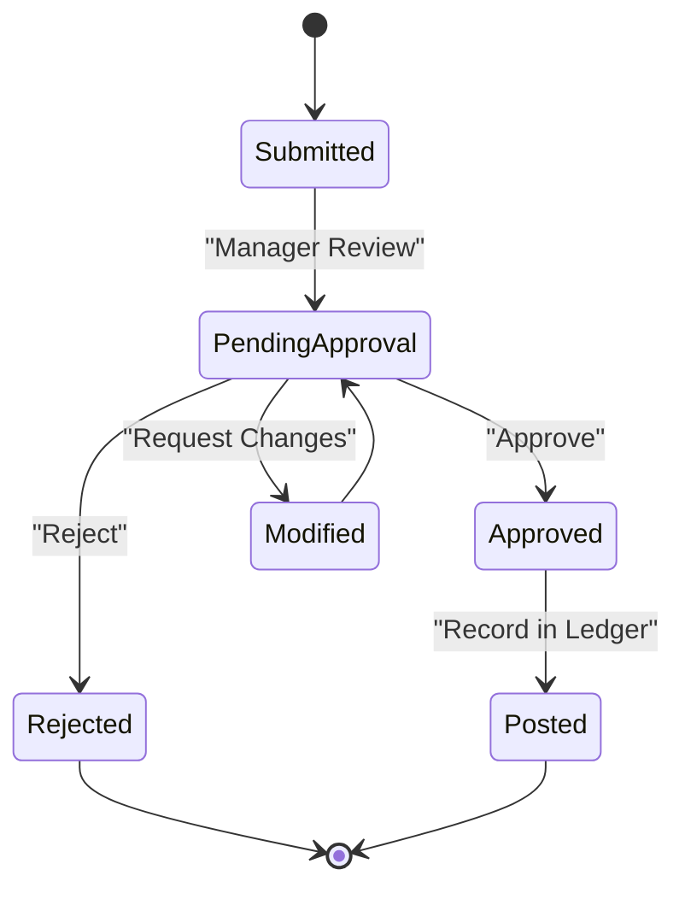
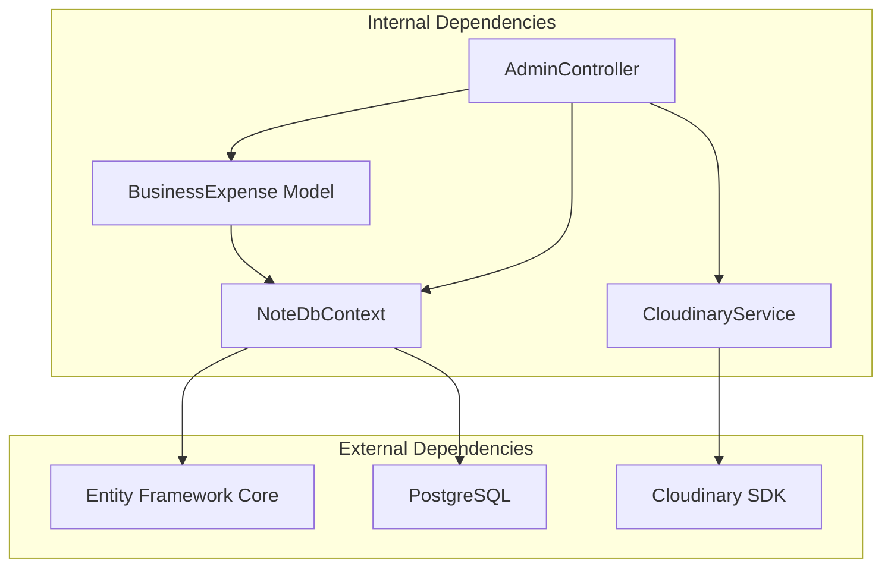

# Business Expense Entity

<cite>
**Referenced Files in This Document**
- [BusinessExpense.cs](file://Models/BusinessExpense.cs)
- [AdminController.cs](file://Controllers/AdminController.cs)
- [NoteDbContext.cs](file://Data/NoteDbContext.cs)
- [20260427184435_InitialCreate.cs](file://Migrations/20260427184435_InitialCreate.cs)
- [Order.cs](file://Models/Order.cs)
- [CloudinaryService.cs](file://Services/CloudinaryService.cs)
- [ICloudinaryService.cs](file://Services/ICloudinaryService.cs)
- [UploadsController.cs](file://Controllers/UploadsController.cs)
- [CloudinaryOptions.cs](file://Models/CloudinaryOptions.cs)
</cite>

## Table of Contents
1. [Introduction](#introduction)
2. [Project Structure](#project-structure)
3. [Core Components](#core-components)
4. [Architecture Overview](#architecture-overview)
5. [Detailed Component Analysis](#detailed-component-analysis)
6. [Dependency Analysis](#dependency-analysis)
7. [Performance Considerations](#performance-considerations)
8. [Troubleshooting Guide](#troubleshooting-guide)
9. [Conclusion](#conclusion)
10. [Appendices](#appendices)

## Introduction
This document provides comprehensive documentation for the BusinessExpense entity that powers financial tracking and accounting for business operations. It covers the entity structure, validation rules, categorization options, receipt image handling capabilities, approval workflow status tracking, integration with accounting systems and reporting, reconciliation workflows, and business metrics tracking. The documentation is designed to be accessible to both technical and non-technical stakeholders.

## Project Structure
The BusinessExpense entity is part of a larger e-commerce platform with separate concerns for models, data access, controllers, and services. The expense tracking functionality is integrated with administrative controls and reporting dashboards.

**Diagram sources**
- [BusinessExpense.cs:1-12](file://Models/BusinessExpense.cs#L1-L12)
- [NoteDbContext.cs:11-21](file://Data/NoteDbContext.cs#L11-L21)
- [AdminController.cs:12-190](file://Controllers/AdminController.cs#L12-L190)
- [CloudinaryService.cs:7-103](file://Services/CloudinaryService.cs#L7-L103)

**Section sources**
- [BusinessExpense.cs:1-12](file://Models/BusinessExpense.cs#L1-L12)
- [NoteDbContext.cs:7-21](file://Data/NoteDbContext.cs#L7-L21)
- [AdminController.cs:12-190](file://Controllers/AdminController.cs#L12-L190)

## Core Components
The BusinessExpense entity serves as the central data structure for tracking business expenditures. It maintains essential financial metadata and temporal information for accounting and reporting purposes.

### Entity Structure
The BusinessExpense entity consists of the following core fields:

- **Id**: Auto-generated integer identifier for expense records
- **Title**: Descriptive title or description of the expense
- **Category**: Expense classification (default: "Other")
- **Amount**: Monetary value as decimal precision
- **Notes**: Additional explanatory information
- **ExpenseDate**: Date when the expense occurred (defaults to UTC date)
- **CreatedAt**: Timestamp when the record was created (defaults to UTC)

### Validation Rules
The system enforces several validation rules to ensure data integrity:

- Title validation: Non-empty string required
- Amount validation: Must be greater than zero
- Category normalization: Defaults to "Other" when empty
- Date handling: Converts to UTC timezone for consistency

### Expense Categories
The current implementation supports flexible categorization with "Other" as the default fallback. Categories enable grouping and reporting across different expense types such as travel, supplies, services, and operational costs.

**Section sources**
- [BusinessExpense.cs:5-12](file://Models/BusinessExpense.cs#L5-L12)
- [AdminController.cs:94-133](file://Controllers/AdminController.cs#L94-L133)
- [AdminController.cs:135-175](file://Controllers/AdminController.cs#L135-L175)

## Architecture Overview
The BusinessExpense system integrates multiple architectural layers to provide comprehensive financial tracking capabilities.

**Diagram sources**
- [AdminController.cs:94-133](file://Controllers/AdminController.cs#L94-L133)
- [NoteDbContext.cs:20](file://Data/NoteDbContext.cs#L20)
- [CloudinaryService.cs:40-103](file://Services/CloudinaryService.cs#L40-L103)

The architecture follows a layered approach with clear separation between presentation, business logic, data access, and external service integration.

## Detailed Component Analysis

### BusinessExpense Entity
The BusinessExpense entity represents individual financial transactions within the business system.

**Diagram sources**
- [BusinessExpense.cs:3-12](file://Models/BusinessExpense.cs#L3-L12)
- [NoteDbContext.cs:19-21](file://Data/NoteDbContext.cs#L19-L21)
- [AdminController.cs:71-190](file://Controllers/AdminController.cs#L71-L190)

### Administrative Management Interface
The AdminController provides comprehensive CRUD operations for expense management with built-in validation and error handling.

#### Expense Submission Workflow
The expense creation process involves several validation steps and data normalization procedures:

**Diagram sources**
- [AdminController.cs:94-133](file://Controllers/AdminController.cs#L94-L133)

#### Expense Update and Deletion
The update process maintains referential integrity while allowing selective field updates, and deletion removes records with appropriate error handling.

**Section sources**
- [AdminController.cs:94-190](file://Controllers/AdminController.cs#L94-L190)

### Receipt Image Handling
The system supports optional receipt image uploads through Cloudinary integration, enabling visual verification and audit trails.

**Diagram sources**
- [UploadsController.cs:23-79](file://Controllers/UploadsController.cs#L23-L79)
- [CloudinaryService.cs:40-103](file://Services/CloudinaryService.cs#L40-L103)

### Accounting Integration and Reporting
The system integrates with accounting workflows through expense tracking and revenue correlation for profit calculations.

**Diagram sources**
- [AdminController.cs:21-69](file://Controllers/AdminController.cs#L21-L69)
- [AdminController.cs:71-92](file://Controllers/AdminController.cs#L71-L92)

**Section sources**
- [AdminController.cs:21-69](file://Controllers/AdminController.cs#L21-L69)
- [AdminController.cs:71-92](file://Controllers/AdminController.cs#L71-L92)

### Approval Workflow Status Tracking
While the current implementation focuses on basic expense recording, the framework supports extension for approval workflows through status tracking mechanisms.

[No sources needed since this diagram shows conceptual workflow, not actual code structure]

## Dependency Analysis
The BusinessExpense system exhibits clear dependency relationships across architectural layers.

**Diagram sources**
- [NoteDbContext.cs:7-9](file://Data/NoteDbContext.cs#L7-L9)
- [BusinessExpense.cs:3-12](file://Models/BusinessExpense.cs#L3-L12)
- [CloudinaryService.cs:1-103](file://Services/CloudinaryService.cs#L1-L103)

### Data Model Relationships
The expense system maintains relationships with other business entities for comprehensive financial tracking.

**Section sources**
- [NoteDbContext.cs:19-21](file://Data/NoteDbContext.cs#L19-L21)
- [BusinessExpense.cs:3-12](file://Models/BusinessExpense.cs#L3-L12)

## Performance Considerations
The BusinessExpense system incorporates several performance optimizations:

- **Database Indexing**: Efficient querying through primary key indexing on expense identifiers
- **Asynchronous Operations**: Non-blocking database operations using async/await patterns
- **Minimal Payloads**: Optimized DTOs for expense requests and responses
- **UTC Consistency**: Standardized timestamp handling for global deployments

[No sources needed since this section provides general guidance]

## Troubleshooting Guide

### Common Issues and Resolutions

#### Expense Creation Failures
- **Validation Errors**: Ensure title is provided and amount > 0
- **Database Connectivity**: Verify connection string and migration status
- **Duplicate Categories**: Use standardized category names to avoid normalization conflicts

#### Receipt Upload Problems
- **Cloudinary Configuration**: Verify environment variables are set correctly
- **File Size Limits**: Respect the 100MB upload limit for Cloudinary
- **Content Type Issues**: Ensure proper MIME type detection for images/videos

#### Reporting Inaccuracies
- **Timezone Consistency**: Confirm all timestamps are handled in UTC
- **Category Normalization**: Verify category values match expected formats
- **Data Synchronization**: Check for proper transaction handling in batch operations

**Section sources**
- [AdminController.cs:94-133](file://Controllers/AdminController.cs#L94-L133)
- [UploadsController.cs:23-79](file://Controllers/UploadsController.cs#L23-L79)

## Conclusion
The BusinessExpense entity provides a robust foundation for business financial tracking with clear validation rules, flexible categorization, and extensible receipt handling capabilities. Its integration with administrative controls and reporting systems enables comprehensive financial oversight while maintaining performance and scalability. The modular architecture supports future enhancements for advanced approval workflows, tax reporting requirements, and accounting period management.

## Appendices

### API Reference

#### Expense Management Endpoints
- **GET** `/api/admin/expenses` - Retrieve all expenses with totals
- **POST** `/api/admin/expenses` - Create new expense
- **PUT** `/api/admin/expenses/{id}` - Update existing expense
- **DELETE** `/api/admin/expenses/{id}` - Remove expense

#### Receipt Upload Endpoint
- **POST** `/api/uploads/cloudinary` - Upload receipt images/videos

### Data Schema Specifications
- **BusinessExpense Fields**: Id, Title, Category, Amount, Notes, ExpenseDate, CreatedAt
- **Order Integration**: Revenue correlation for profit calculations
- **Cloudinary Options**: CloudName, ApiKey, ApiSecret for media storage

### Best Practices
- Maintain consistent category naming conventions
- Use UTC timestamps for global compliance
- Implement proper error handling for external service failures
- Regular database maintenance and backup procedures
- Monitor expense submission patterns for fraud detection