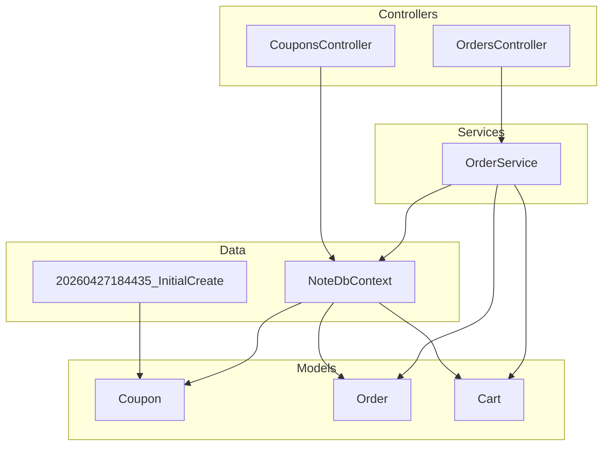
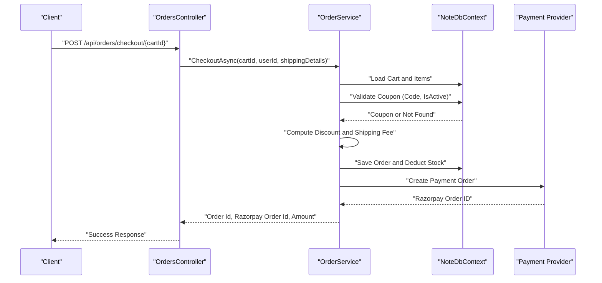
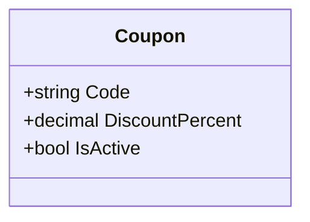
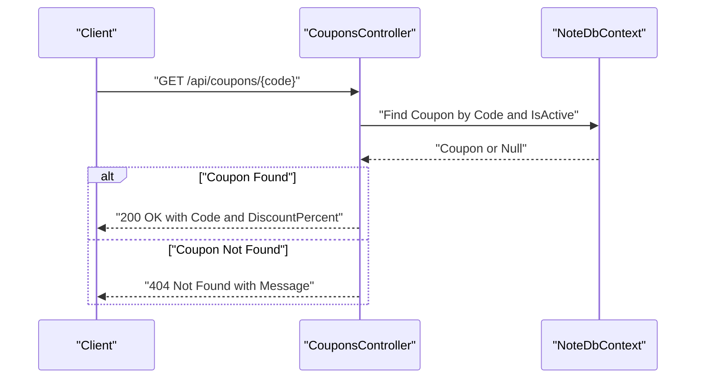
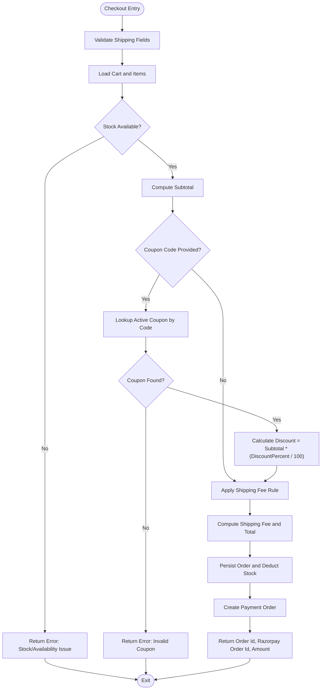
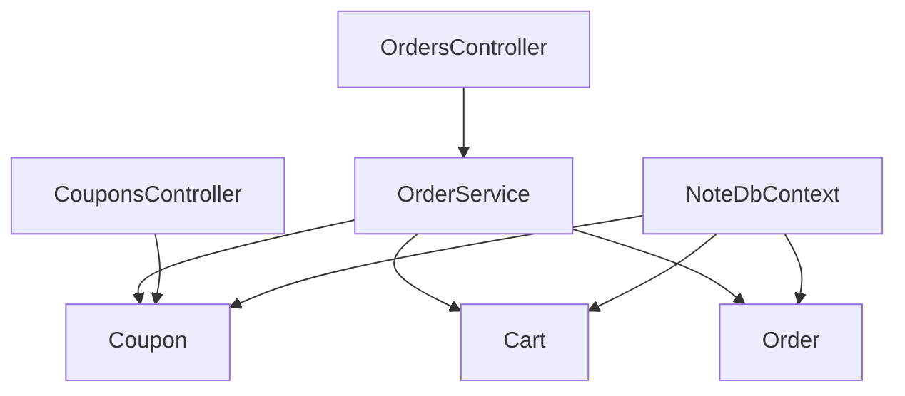

# Coupon Entity

<cite>
**Referenced Files in This Document**
- [Coupon.cs](file://Models/Coupon.cs)
- [Order.cs](file://Models/Order.cs)
- [Cart.cs](file://Models/Cart.cs)
- [CouponsController.cs](file://Controllers/CouponsController.cs)
- [OrdersController.cs](file://Controllers/OrdersController.cs)
- [OrderService.cs](file://Services/OrderService.cs)
- [NoteDbContext.cs](file://Data/NoteDbContext.cs)
- [20260427184435_InitialCreate.cs](file://Migrations/20260427184435_InitialCreate.cs)
</cite>

## Table of Contents
1. [Introduction](#introduction)
2. [Project Structure](#project-structure)
3. [Core Components](#core-components)
4. [Architecture Overview](#architecture-overview)
5. [Detailed Component Analysis](#detailed-component-analysis)
6. [Dependency Analysis](#dependency-analysis)
7. [Performance Considerations](#performance-considerations)
8. [Troubleshooting Guide](#troubleshooting-guide)
9. [Conclusion](#conclusion)

## Introduction
This document provides comprehensive documentation for the Coupon entity that manages discount codes and promotional campaigns. It explains the entity structure, validation rules, usage tracking, and integration with the checkout workflow. It also covers business rules such as coupon activation/deactivation, discount calculation, and shipping fee conditions tied to the coupon application.

## Project Structure
The Coupon entity is part of the Models namespace and integrates with the OrdersController and OrderService for checkout validation and discount application. The database context defines the Coupon entity schema and seeds initial promotional codes.

**Diagram sources**
- [Coupon.cs:1-9](file://Models/Coupon.cs#L1-L9)
- [Order.cs:1-62](file://Models/Order.cs#L1-L62)
- [Cart.cs:1-10](file://Models/Cart.cs#L1-L10)
- [CouponsController.cs:1-32](file://Controllers/CouponsController.cs#L1-L32)
- [OrdersController.cs:1-121](file://Controllers/OrdersController.cs#L1-L121)
- [OrderService.cs:1-270](file://Services/OrderService.cs#L1-L270)
- [NoteDbContext.cs:1-67](file://Data/NoteDbContext.cs#L1-L67)
- [20260427184435_InitialCreate.cs:1-200](file://Migrations/20260427184435_InitialCreate.cs#L1-L200)

**Section sources**
- [Coupon.cs:1-9](file://Models/Coupon.cs#L1-L9)
- [Order.cs:1-62](file://Models/Order.cs#L1-L62)
- [Cart.cs:1-10](file://Models/Cart.cs#L1-L10)
- [CouponsController.cs:1-32](file://Controllers/CouponsController.cs#L1-L32)
- [OrdersController.cs:1-121](file://Controllers/OrdersController.cs#L1-L121)
- [OrderService.cs:1-270](file://Services/OrderService.cs#L1-L270)
- [NoteDbContext.cs:1-67](file://Data/NoteDbContext.cs#L1-L67)
- [20260427184435_InitialCreate.cs:1-200](file://Migrations/20260427184435_InitialCreate.cs#L1-L200)

## Core Components
- Coupon entity: Defines the coupon code, discount percentage, and active status used during checkout.
- Order entity: Stores the applied coupon code, calculated discount amount, and final total for billing.
- Cart entity: Provides the shopping cart context for calculating the subtotal before applying discounts.
- CouponsController: Exposes a GET endpoint to validate a coupon by code and confirm it is active.
- OrdersController: Orchestrates checkout and delegates discount validation and calculation to OrderService.
- OrderService: Implements the checkout workflow, validates coupon presence and activity, computes discount and shipping fee, and persists the order.
- NoteDbContext: Declares the Coupon DbSet and seeds initial promotional coupons.
- Migration: Creates the Coupons table with Code as the primary key and defines DiscountPercent and IsActive columns.

Key Coupon fields:
- Code: Unique identifier for the coupon (primary key).
- DiscountPercent: Percentage discount applied to the cart subtotal.
- IsActive: Boolean flag controlling whether the coupon can be used.

Integration points:
- Coupon validation occurs during checkout via OrderService.
- Coupon data is persisted in the database and seeded for initial use.

**Section sources**
- [Coupon.cs:1-9](file://Models/Coupon.cs#L1-L9)
- [Order.cs:1-62](file://Models/Order.cs#L1-L62)
- [Cart.cs:1-10](file://Models/Cart.cs#L1-L10)
- [CouponsController.cs:1-32](file://Controllers/CouponsController.cs#L1-L32)
- [OrdersController.cs:1-121](file://Controllers/OrdersController.cs#L1-L121)
- [OrderService.cs:1-270](file://Services/OrderService.cs#L1-L270)
- [NoteDbContext.cs:1-67](file://Data/NoteDbContext.cs#L1-L67)
- [20260427184435_InitialCreate.cs:47-57](file://Migrations/20260427184435_InitialCreate.cs#L47-L57)

## Architecture Overview
The coupon lifecycle integrates with the checkout flow. The client submits shipping details including an optional coupon code. The OrdersController invokes OrderService.CheckoutAsync, which:
- Validates shipping details and cart stock availability.
- Normalizes and validates the coupon code against the database.
- Computes discount based on subtotal and discount percentage.
- Applies shipping fee rules dependent on the discounted subtotal.
- Persists the order and prepares payment via the payment provider.

**Diagram sources**
- [OrdersController.cs:31-51](file://Controllers/OrdersController.cs#L31-L51)
- [OrderService.cs:23-187](file://Services/OrderService.cs#L23-L187)
- [NoteDbContext.cs:19-19](file://Data/NoteDbContext.cs#L19-L19)

## Detailed Component Analysis

### Coupon Entity
The Coupon entity encapsulates the essential attributes for promotional discount codes:
- Code: Unique coupon identifier used for lookup and display.
- DiscountPercent: Percentage value applied to the cart subtotal to compute discount.
- IsActive: Controls whether the coupon is currently usable.

**Diagram sources**
- [Coupon.cs:3-8](file://Models/Coupon.cs#L3-L8)

**Section sources**
- [Coupon.cs:1-9](file://Models/Coupon.cs#L1-L9)
- [NoteDbContext.cs:39-39](file://Data/NoteDbContext.cs#L39-L39)
- [20260427184435_InitialCreate.cs:47-57](file://Migrations/20260427184435_InitialCreate.cs#L47-L57)

### Coupon Validation Endpoint
The CouponsController exposes a GET endpoint to validate a coupon by code and confirm it is active. It normalizes the input to uppercase and trims whitespace before querying the database.

**Diagram sources**
- [CouponsController.cs:18-30](file://Controllers/CouponsController.cs#L18-L30)
- [NoteDbContext.cs:19-19](file://Data/NoteDbContext.cs#L19-L19)

**Section sources**
- [CouponsController.cs:1-32](file://Controllers/CouponsController.cs#L1-L32)
- [NoteDbContext.cs:39-39](file://Data/NoteDbContext.cs#L39-L39)

### Checkout Workflow and Coupon Application
The checkout process performs the following steps:
- Validates shipping details and phone number length.
- Loads the cart and ensures items are available and in stock.
- Computes subtotal from cart items.
- If a coupon code is present:
  - Normalizes and queries the coupon by code and IsActive flag.
  - Calculates discount as subtotal multiplied by (DiscountPercent / 100), rounded to two decimal places.
- Applies shipping fee rules: free shipping if (subtotal - discount) is greater than or equal to 50, otherwise a fixed 5 INR fee.
- Constructs the order with computed totals and persists it to the database.
- Initiates payment order creation via the payment provider.

**Diagram sources**
- [OrderService.cs:23-187](file://Services/OrderService.cs#L23-L187)
- [Order.cs:3-33](file://Models/Order.cs#L3-L33)
- [Cart.cs:5-9](file://Models/Cart.cs#L5-L9)

**Section sources**
- [OrderService.cs:23-187](file://Services/OrderService.cs#L23-L187)
- [Order.cs:1-62](file://Models/Order.cs#L1-L62)
- [Cart.cs:1-10](file://Models/Cart.cs#L1-L10)

### Business Rules and Constraints
- Coupon Activation/Deactivation:
  - A coupon is considered valid only when IsActive is true.
  - Deactivating a coupon prevents it from being used in checkout.
- Discount Calculation:
  - Discount is computed as subtotal multiplied by (DiscountPercent / 100) and rounded to two decimal places.
- Shipping Fee Conditions:
  - Free shipping applies if (subtotal - discount) is greater than or equal to 50; otherwise a fixed 5 INR fee is added.
- Coupon Presence:
  - If a coupon code is provided but not found or inactive, checkout fails with an appropriate error message.
- Order Persistence:
  - The order captures the applied coupon code, discount amount, and final total for audit and reporting.

**Section sources**
- [OrderService.cs:74-89](file://Services/OrderService.cs#L74-L89)
- [Order.cs:10-13](file://Models/Order.cs#L10-L13)
- [NoteDbContext.cs:39-39](file://Data/NoteDbContext.cs#L39-L39)

### Usage Reporting
- The Order entity stores the applied coupon code, discount amount, and total amount, enabling usage reporting by aggregating orders filtered by CouponCode.
- Reporting can be implemented by querying the Orders table grouped by CouponCode and summing DiscountAmount and Count of Orders.

**Section sources**
- [Order.cs:10-13](file://Models/Order.cs#L10-L13)
- [OrderService.cs:91-118](file://Services/OrderService.cs#L91-L118)

## Dependency Analysis
The Coupon entity participates in the following relationships:
- Database context: Coupon is declared as a DbSet and seeded with initial promotional codes.
- OrderService: Uses Coupon data during checkout to compute discounts.
- OrdersController: Triggers checkout flow that depends on coupon validation.
- CouponsController: Provides external validation of coupon codes.

**Diagram sources**
- [OrderService.cs:1-270](file://Services/OrderService.cs#L1-L270)
- [OrdersController.cs:1-121](file://Controllers/OrdersController.cs#L1-L121)
- [CouponsController.cs:1-32](file://Controllers/CouponsController.cs#L1-L32)
- [NoteDbContext.cs:1-67](file://Data/NoteDbContext.cs#L1-L67)

**Section sources**
- [OrderService.cs:1-270](file://Services/OrderService.cs#L1-L270)
- [OrdersController.cs:1-121](file://Controllers/OrdersController.cs#L1-L121)
- [CouponsController.cs:1-32](file://Controllers/CouponsController.cs#L1-L32)
- [NoteDbContext.cs:1-67](file://Data/NoteDbContext.cs#L1-L67)

## Performance Considerations
- Indexing: Consider adding an index on Coupon.Code for frequent lookups during checkout.
- Rounding: Discount calculations are rounded to two decimal places to avoid floating-point precision issues.
- Shipping Fee Computation: The shipping fee rule is constant-time and does not require additional lookups.
- Payment Provider Calls: Payment order creation is an external HTTP call; ensure timeout and retry policies are configured appropriately.

## Troubleshooting Guide
Common issues and resolutions:
- Invalid Coupon Code:
  - Symptom: Checkout returns an error indicating the coupon is invalid.
  - Cause: Coupon not found or inactive.
  - Resolution: Verify the coupon exists and IsActive is true.
- Stock/Availability Errors:
  - Symptom: Checkout fails due to unavailable products or insufficient stock.
  - Cause: Product removed or quantity exceeds available stock.
  - Resolution: Update cart or remove out-of-stock items.
- Phone Number Validation:
  - Symptom: Checkout fails due to invalid phone number length.
  - Cause: Phone number outside acceptable range.
  - Resolution: Ensure phone number is between 10 and 15 digits.
- Payment Gateway Configuration:
  - Symptom: Payment order creation fails due to missing configuration.
  - Cause: Missing payment gateway credentials.
  - Resolution: Set required environment variables or configuration keys.

**Section sources**
- [OrderService.cs:25-39](file://Services/OrderService.cs#L25-L39)
- [OrderService.cs:60-71](file://Services/OrderService.cs#L60-L71)
- [OrderService.cs:121-127](file://Services/OrderService.cs#L121-L127)
- [OrderService.cs:130-133](file://Services/OrderService.cs#L130-L133)

## Conclusion
The Coupon entity provides a straightforward mechanism for managing promotional discount codes. Its integration with the checkout workflow ensures that coupons are validated, discounts are calculated accurately, and shipping fees are applied according to business rules. The current implementation supports activation/deactivation via the IsActive flag and reports usage through the Order entity’s stored coupon metadata.