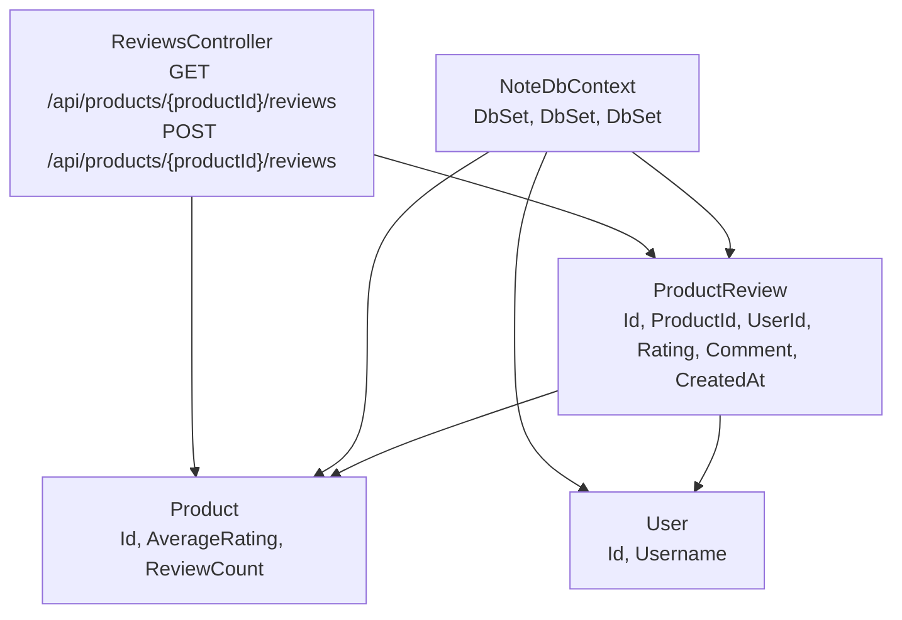
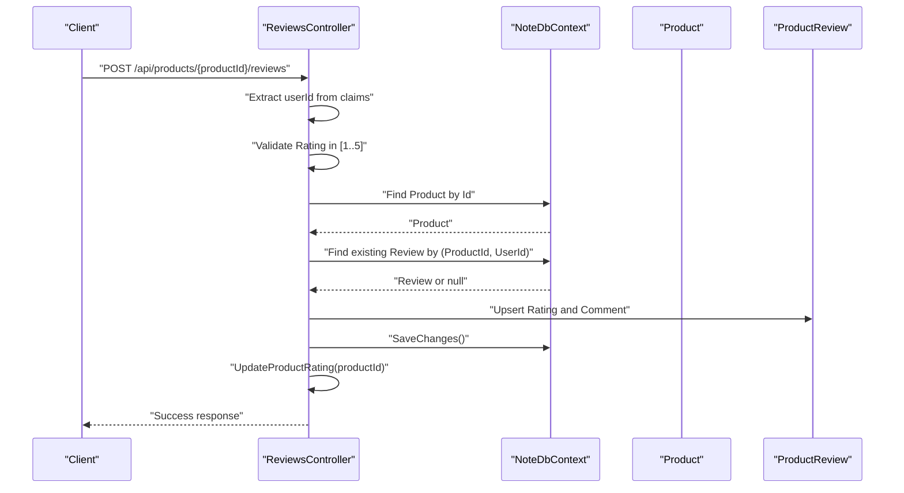
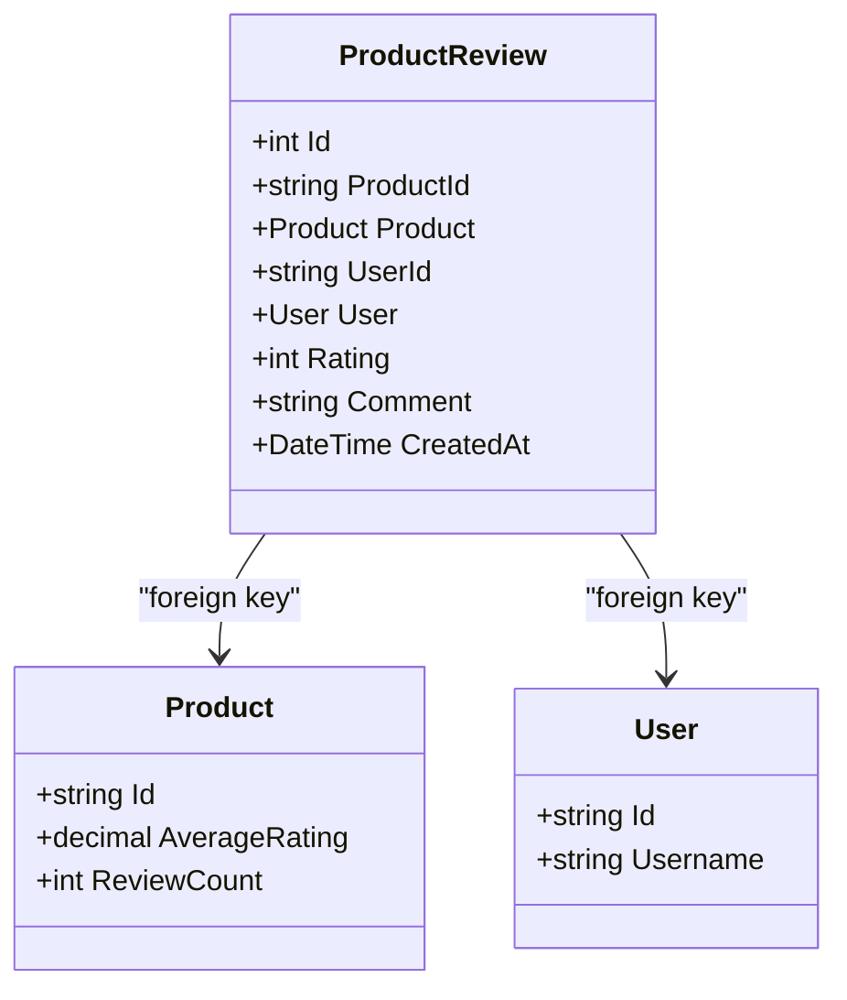
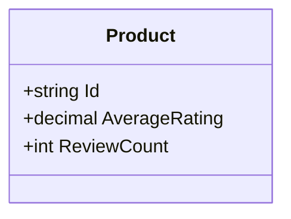
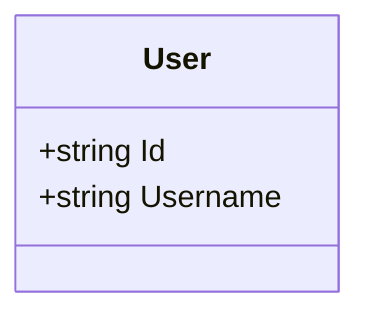
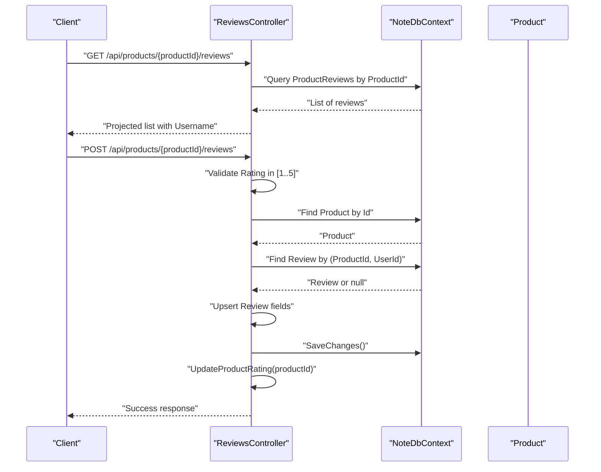
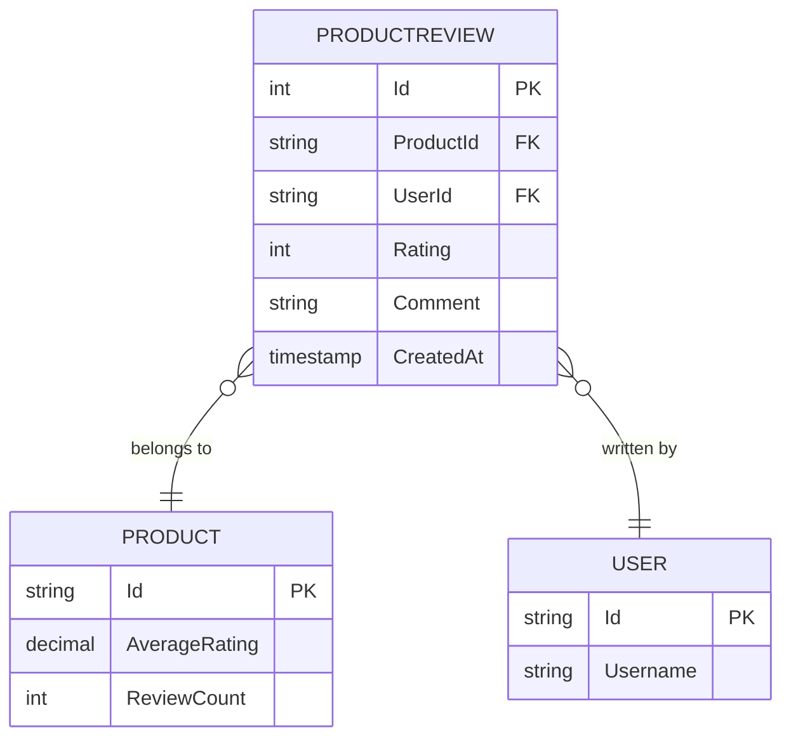
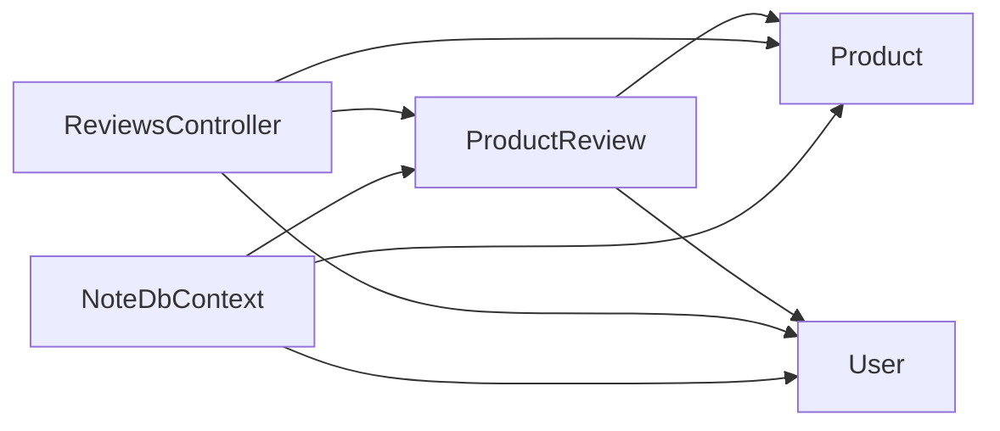

# Product Review Entity

<cite>
**Referenced Files in This Document**
- [ProductReview.cs](file://Models/ProductReview.cs)
- [Product.cs](file://Models/Product.cs)
- [User.cs](file://Models/User.cs)
- [ReviewsController.cs](file://Controllers/ReviewsController.cs)
- [NoteDbContext.cs](file://Data/NoteDbContext.cs)
- [20260427184435_InitialCreate.cs](file://Migrations/20260427184435_InitialCreate.cs)
</cite>

## Table of Contents
1. [Introduction](#introduction)
2. [Project Structure](#project-structure)
3. [Core Components](#core-components)
4. [Architecture Overview](#architecture-overview)
5. [Detailed Component Analysis](#detailed-component-analysis)
6. [Dependency Analysis](#dependency-analysis)
7. [Performance Considerations](#performance-considerations)
8. [Troubleshooting Guide](#troubleshooting-guide)
9. [Conclusion](#conclusion)

## Introduction
This document provides comprehensive documentation for the ProductReview entity that powers the customer feedback and rating system. It explains the entity structure, relationships with Product and User, the review creation workflow, validation rules, and how reviews integrate with the ReviewsController for CRUD operations. It also covers how reviews contribute to product analytics and average rating calculations.

## Project Structure
The ProductReview entity is part of the Models namespace and integrates with the data context and controller layer. The database schema defines foreign keys and indexes to enforce referential integrity and uniqueness constraints.

**Diagram sources**
- [ProductReview.cs:3-13](file://Models/ProductReview.cs#L3-L13)
- [Product.cs:3-20](file://Models/Product.cs#L3-L20)
- [User.cs:3-11](file://Models/User.cs#L3-L11)
- [NoteDbContext.cs:7-21](file://Data/NoteDbContext.cs#L7-L21)
- [ReviewsController.cs:10-87](file://Controllers/ReviewsController.cs#L10-L87)

**Section sources**
- [ProductReview.cs:3-13](file://Models/ProductReview.cs#L3-L13)
- [Product.cs:3-20](file://Models/Product.cs#L3-L20)
- [User.cs:3-11](file://Models/User.cs#L3-L11)
- [NoteDbContext.cs:7-21](file://Data/NoteDbContext.cs#L7-L21)
- [ReviewsController.cs:10-87](file://Controllers/ReviewsController.cs#L10-L87)

## Core Components
- ProductReview: Represents a single customer review with fields for identity, product association, user association, rating, comment, and timestamp.
- Product: Contains aggregated metrics for reviews, including AverageRating and ReviewCount.
- User: Provides the reviewer identity used for uniqueness and display.
- ReviewsController: Exposes endpoints to retrieve and upsert reviews, validates ratings, and updates product analytics.
- NoteDbContext: Declares entity sets and enforces uniqueness constraints for review ownership.

Key entity fields:
- ProductReview.Id: Primary key for the review record.
- ProductReview.ProductId: Foreign key to Product.Id.
- ProductReview.UserId: Foreign key to User.Id.
- ProductReview.Rating: Integer rating validated to be within 1–5.
- ProductReview.Comment: Text comment submitted by the user.
- ProductReview.CreatedAt: Timestamp of creation/update.

Relationships:
- ProductReview.Product: Navigation property to the associated Product.
- ProductReview.User: Navigation property to the associated User.
- ProductReview belongs to one Product and one User.

**Section sources**
- [ProductReview.cs:5-12](file://Models/ProductReview.cs#L5-L12)
- [Product.cs:18-19](file://Models/Product.cs#L18-L19)
- [User.cs:5-6](file://Models/User.cs#L5-L6)
- [ReviewsController.cs:21-71](file://Controllers/ReviewsController.cs#L21-L71)
- [NoteDbContext.cs:11-18](file://Data/NoteDbContext.cs#L11-L18)

## Architecture Overview
The system follows a layered architecture:
- Model layer: Defines ProductReview, Product, and User entities.
- Data layer: NoteDbContext exposes entity sets and applies uniqueness constraints.
- Controller layer: ReviewsController handles HTTP requests, performs validation, and updates product analytics.

**Diagram sources**
- [ReviewsController.cs:41-86](file://Controllers/ReviewsController.cs#L41-L86)
- [NoteDbContext.cs:11-18](file://Data/NoteDbContext.cs#L11-L18)

## Detailed Component Analysis

### ProductReview Entity
- Purpose: Stores individual customer feedback with rating and timestamp.
- Fields:
  - Id: Primary key.
  - ProductId: Foreign key to Product.Id.
  - Product: Navigation property to Product.
  - UserId: Foreign key to User.Id.
  - User: Navigation property to User.
  - Rating: Integer in range 1–5.
  - Comment: Free-form text.
  - CreatedAt: UTC timestamp.

Constraints and indexes:
- Unique composite index on (UserId, ProductId) ensures a user can submit at most one review per product.
- Foreign keys to Product and User enforce referential integrity.

**Diagram sources**
- [ProductReview.cs:3-13](file://Models/ProductReview.cs#L3-L13)
- [Product.cs:3-20](file://Models/Product.cs#L3-L20)
- [User.cs:3-11](file://Models/User.cs#L3-L11)

**Section sources**
- [ProductReview.cs:3-13](file://Models/ProductReview.cs#L3-L13)
- [NoteDbContext.cs:45-47](file://Data/NoteDbContext.cs#L45-L47)
- [20260427184435_InitialCreate.cs:164-190](file://Migrations/20260427184435_InitialCreate.cs#L164-L190)

### Product Entity
- Purpose: Aggregates review statistics for display and analytics.
- Fields:
  - AverageRating: Rounded average of all ratings for the product.
  - ReviewCount: Total number of reviews for the product.

**Diagram sources**
- [Product.cs:3-20](file://Models/Product.cs#L3-L20)

**Section sources**
- [Product.cs:18-19](file://Models/Product.cs#L18-L19)

### User Entity
- Purpose: Identifies the reviewer and enables uniqueness checks.
- Fields:
  - Id: Primary key.
  - Username: Display name used in review listings.

**Diagram sources**
- [User.cs:3-11](file://Models/User.cs#L3-L11)

**Section sources**
- [User.cs:5-6](file://Models/User.cs#L5-L6)

### ReviewsController
- GET /api/products/{productId}/reviews
  - Retrieves reviews for a product, ordered by CreatedAt descending.
  - Includes the reviewer’s Username if available; otherwise defaults to a placeholder.
- POST /api/products/{productId}/reviews
  - Requires authorization; extracts userId from claims.
  - Validates Rating to be within 1–5.
  - Upserts a review for the given ProductId and UserId.
  - Trims the Comment and updates CreatedAt.
  - Saves changes and recalculates product analytics.

**Diagram sources**
- [ReviewsController.cs:21-86](file://Controllers/ReviewsController.cs#L21-L86)

**Section sources**
- [ReviewsController.cs:21-71](file://Controllers/ReviewsController.cs#L21-L71)
- [ReviewsController.cs:73-86](file://Controllers/ReviewsController.cs#L73-L86)

### Database Schema and Constraints
- ProductReviews table:
  - Primary key: Id
  - Columns: ProductId, UserId, Rating, Comment, CreatedAt
  - Foreign keys: ProductId -> Products.Id, UserId -> Users.Id
  - Unique index: (UserId, ProductId)
- Products table:
  - Columns: AverageRating, ReviewCount
- Users table:
  - Columns: Id, Username

**Diagram sources**
- [20260427184435_InitialCreate.cs:164-190](file://Migrations/20260427184435_InitialCreate.cs#L164-L190)
- [NoteDbContext.cs:45-47](file://Data/NoteDbContext.cs#L45-L47)

**Section sources**
- [20260427184435_InitialCreate.cs:164-190](file://Migrations/20260427184435_InitialCreate.cs#L164-L190)
- [NoteDbContext.cs:45-47](file://Data/NoteDbContext.cs#L45-L47)

## Dependency Analysis
- ProductReview depends on Product and User via foreign keys and navigation properties.
- ReviewsController depends on NoteDbContext for data access and on ProductReview/User/Product entities for business logic.
- NoteDbContext declares ProductReview, Product, and User sets and applies uniqueness constraints.

**Diagram sources**
- [ProductReview.cs:7-9](file://Models/ProductReview.cs#L7-L9)
- [ReviewsController.cs:14](file://Controllers/ReviewsController.cs#L14)
- [NoteDbContext.cs:11-18](file://Data/NoteDbContext.cs#L11-L18)

**Section sources**
- [ProductReview.cs:7-9](file://Models/ProductReview.cs#L7-L9)
- [ReviewsController.cs:14](file://Controllers/ReviewsController.cs#L14)
- [NoteDbContext.cs:11-18](file://Data/NoteDbContext.cs#L11-L18)

## Performance Considerations
- Indexes:
  - ProductReviews.ProductId: Efficient filtering by product.
  - ProductReviews.UserId + ProductId: Unique composite index prevents duplicate reviews per user-product pair.
- Aggregation:
  - UpdateProductRating computes AverageRating and ReviewCount by scanning all reviews for a product. For large datasets, consider caching or periodic batch updates to reduce load.
- Projection:
  - GET endpoint projects only necessary fields and includes the User navigation to avoid loading full user records.

[No sources needed since this section provides general guidance]

## Troubleshooting Guide
Common issues and resolutions:
- Unauthorized access:
  - Ensure the request includes a valid bearer token; the controller requires authorization for review submission.
- Rating out of range:
  - The controller rejects ratings below 1 or above 5. Adjust client-side validation to prevent invalid submissions.
- Product not found:
  - Verify the productId exists before submitting a review.
- Duplicate review per user-product:
  - The unique index prevents multiple reviews from the same user for the same product. The controller upserts existing reviews instead of creating duplicates.

**Section sources**
- [ReviewsController.cs:41-54](file://Controllers/ReviewsController.cs#L41-L54)
- [NoteDbContext.cs:45-47](file://Data/NoteDbContext.cs#L45-L47)

## Conclusion
The ProductReview entity provides a robust foundation for managing customer feedback and ratings. Its design enforces referential integrity, uniqueness constraints, and efficient querying. The ReviewsController implements a streamlined workflow for review creation and updates product analytics automatically. Together, these components support accurate product insights and a reliable user experience.