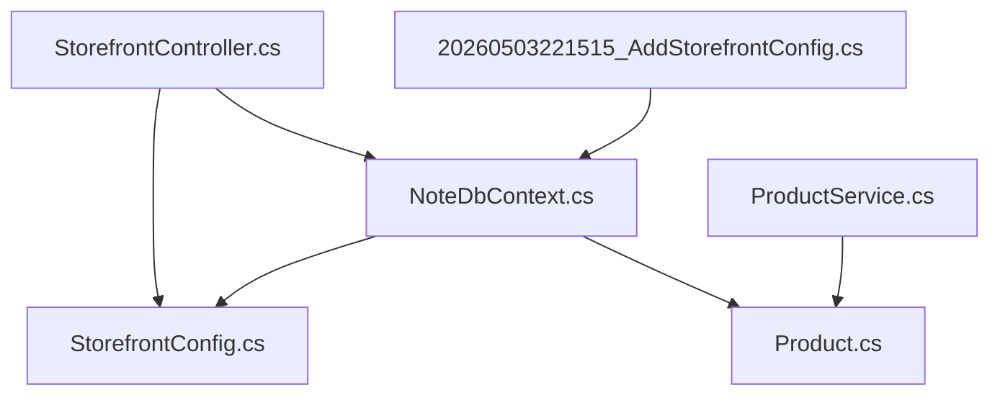
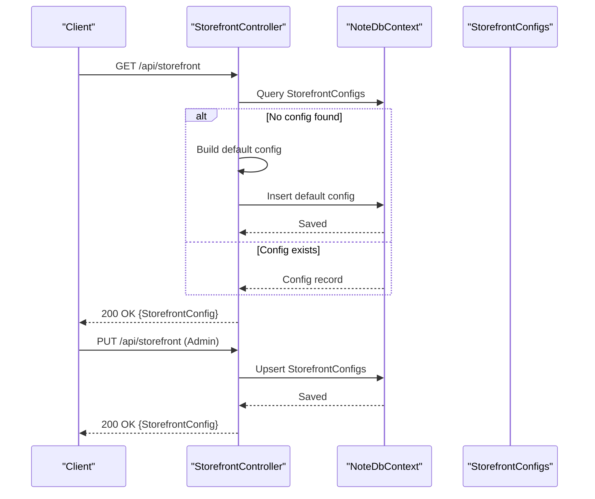
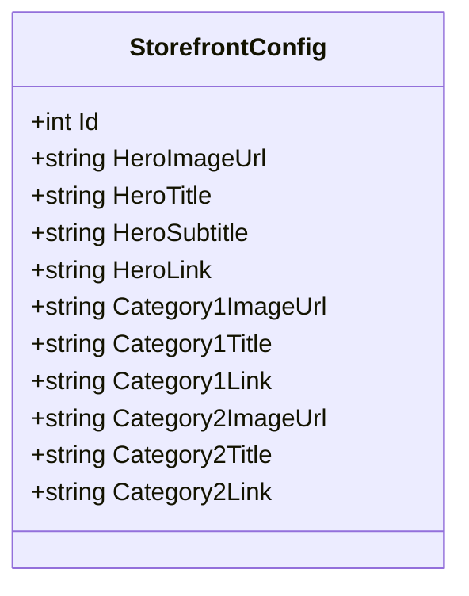
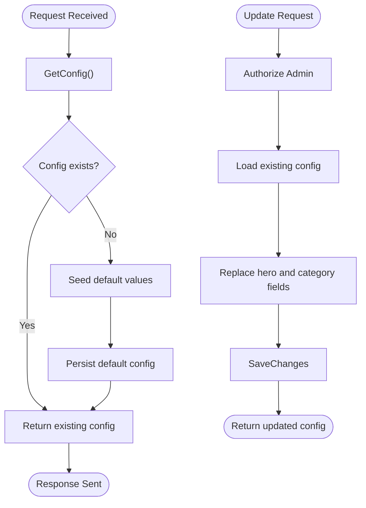
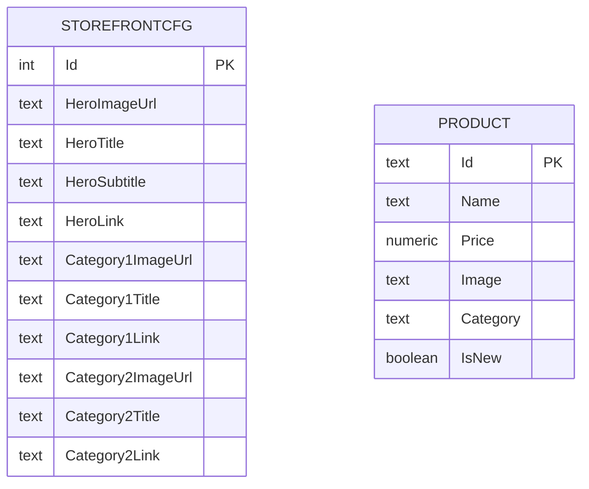
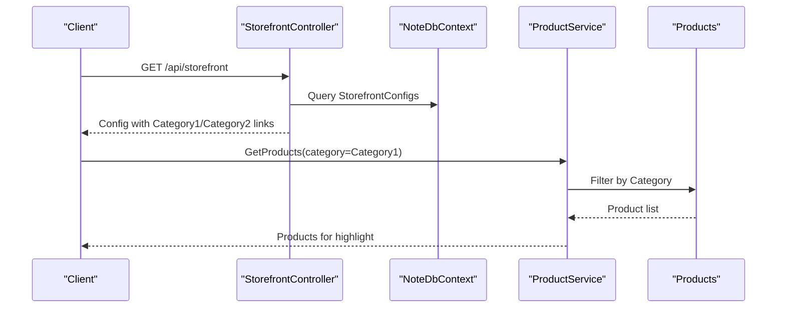
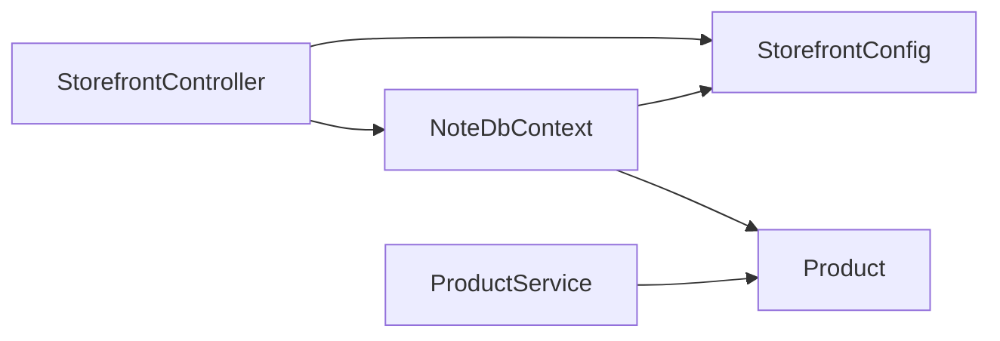

# Storefront Configuration Entity

<cite>
**Referenced Files in This Document**
- [StorefrontConfig.cs](file://Models/StorefrontConfig.cs)
- [StorefrontController.cs](file://Controllers/StorefrontController.cs)
- [NoteDbContext.cs](file://Data/NoteDbContext.cs)
- [20260503221515_AddStorefrontConfig.cs](file://Migrations/20260503221515_AddStorefrontConfig.cs)
- [Product.cs](file://Models/Product.cs)
- [ProductService.cs](file://Services/ProductService.cs)
</cite>

## Table of Contents
1. [Introduction](#introduction)
2. [Project Structure](#project-structure)
3. [Core Components](#core-components)
4. [Architecture Overview](#architecture-overview)
5. [Detailed Component Analysis](#detailed-component-analysis)
6. [Dependency Analysis](#dependency-analysis)
7. [Performance Considerations](#performance-considerations)
8. [Troubleshooting Guide](#troubleshooting-guide)
9. [Conclusion](#conclusion)

## Introduction
This document describes the StorefrontConfig entity and its ecosystem for managing marketing content and storefront customization. It covers the entity structure (hero sections, featured categories), configuration update workflows, and integration with the StorefrontController for content delivery. It also outlines relationships with Product and Category entities, and discusses dynamic content management, content versioning, A/B testing, caching, and performance optimization strategies.

## Project Structure
The storefront configuration is implemented as a single entity with a dedicated controller and persistence via Entity Framework Core migrations. The Product entity provides the backing data for category-based content highlights.

**Diagram sources**
- [StorefrontConfig.cs:1-23](file://Models/StorefrontConfig.cs#L1-L23)
- [StorefrontController.cs:1-78](file://Controllers/StorefrontController.cs#L1-L78)
- [NoteDbContext.cs:1-67](file://Data/NoteDbContext.cs#L1-L67)
- [20260503221515_AddStorefrontConfig.cs:1-45](file://Migrations/20260503221515_AddStorefrontConfig.cs#L1-L45)
- [Product.cs:1-21](file://Models/Product.cs#L1-L21)
- [ProductService.cs:1-95](file://Services/ProductService.cs#L1-L95)

**Section sources**
- [StorefrontConfig.cs:1-23](file://Models/StorefrontConfig.cs#L1-L23)
- [StorefrontController.cs:1-78](file://Controllers/StorefrontController.cs#L1-L78)
- [NoteDbContext.cs:1-67](file://Data/NoteDbContext.cs#L1-L67)
- [20260503221515_AddStorefrontConfig.cs:1-45](file://Migrations/20260503221515_AddStorefrontConfig.cs#L1-L45)
- [Product.cs:1-21](file://Models/Product.cs#L1-L21)
- [ProductService.cs:1-95](file://Services/ProductService.cs#L1-L95)

## Core Components
- StorefrontConfig: Holds storefront-wide marketing content and homepage highlights.
- StorefrontController: Provides GET and PUT endpoints for retrieving and updating the configuration.
- NoteDbContext: Exposes StorefrontConfigs and Products, seeds initial data, and defines relationships.
- Product: Supplies product data used for category-based content highlights.
- ProductService: Implements product queries used to power category highlights.

Key responsibilities:
- StorefrontConfig encapsulates hero imagery and text, plus two highlighted categories.
- StorefrontController ensures a default configuration exists on first access and allows authorized updates.
- Product and ProductService support category-based content by enabling filtering and sorting.

**Section sources**
- [StorefrontConfig.cs:1-23](file://Models/StorefrontConfig.cs#L1-L23)
- [StorefrontController.cs:20-76](file://Controllers/StorefrontController.cs#L20-L76)
- [NoteDbContext.cs:11-21](file://Data/NoteDbContext.cs#L11-L21)
- [Product.cs:1-21](file://Models/Product.cs#L1-L21)
- [ProductService.cs:16-45](file://Services/ProductService.cs#L16-L45)

## Architecture Overview
The storefront configuration is persisted in a dedicated table and served by a single controller endpoint. The configuration is designed for simplicity and fast retrieval, with optional caching at the application layer.

**Diagram sources**
- [StorefrontController.cs:20-76](file://Controllers/StorefrontController.cs#L20-L76)
- [NoteDbContext.cs:21](file://Data/NoteDbContext.cs#L21)
- [20260503221515_AddStorefrontConfig.cs:14-34](file://Migrations/20260503221515_AddStorefrontConfig.cs#L14-L34)

## Detailed Component Analysis

### StorefrontConfig Entity
Structure and semantics:
- Hero section: image URL, title, subtitle, and link.
- Featured categories: category highlight 1 and 2, each with image, title, and link.
- Single-row configuration: the controller retrieves or creates a single record.

Constraints and defaults:
- All string fields are nullable, allowing partial configuration.
- Default values are injected on first access if none exists.

**Diagram sources**
- [StorefrontConfig.cs:3-22](file://Models/StorefrontConfig.cs#L3-L22)

**Section sources**
- [StorefrontConfig.cs:1-23](file://Models/StorefrontConfig.cs#L1-L23)
- [20260503221515_AddStorefrontConfig.cs:14-34](file://Migrations/20260503221515_AddStorefrontConfig.cs#L14-L34)

### StorefrontController: Retrieval and Updates
Behavior:
- GET returns the current configuration; if none exists, it seeds a default configuration and persists it.
- PUT requires Admin role and replaces the stored configuration with the provided payload.

Operational flow:
- Retrieve the single configuration record.
- If null, hydrate with default values and insert.
- If present, replace all hero and category fields.
- Save changes and return the updated configuration.

**Diagram sources**
- [StorefrontController.cs:20-76](file://Controllers/StorefrontController.cs#L20-L76)

**Section sources**
- [StorefrontController.cs:20-76](file://Controllers/StorefrontController.cs#L20-L76)

### Persistence and Schema
- StorefrontConfigs table created with identity primary key and nullable text fields for all content.
- Product seeding includes Category field used for category-based content highlights.

**Diagram sources**
- [20260503221515_AddStorefrontConfig.cs:14-34](file://Migrations/20260503221515_AddStorefrontConfig.cs#L14-L34)
- [NoteDbContext.cs:11](file://Data/NoteDbContext.cs#L11)
- [Product.cs:14](file://Models/Product.cs#L14)

**Section sources**
- [20260503221515_AddStorefrontConfig.cs:12-34](file://Migrations/20260503221515_AddStorefrontConfig.cs#L12-L34)
- [NoteDbContext.cs:49-59](file://Data/NoteDbContext.cs#L49-L59)
- [Product.cs:14](file://Models/Product.cs#L14)

### Relationship with Product and Category Highlights
- Category highlights are represented by Category1 and Category2 fields in StorefrontConfig.
- Product seeding assigns Category values to products, enabling category-based filtering.
- ProductService supports category filtering and sorting, which can be used to populate category highlights dynamically.

**Diagram sources**
- [StorefrontController.cs:20-46](file://Controllers/StorefrontController.cs#L20-L46)
- [ProductService.cs:16-32](file://Services/ProductService.cs#L16-L32)
- [Product.cs:14](file://Models/Product.cs#L14)

**Section sources**
- [ProductService.cs:16-32](file://Services/ProductService.cs#L16-L32)
- [NoteDbContext.cs:50-59](file://Data/NoteDbContext.cs#L50-L59)

### Dynamic Content Management and Scheduling
Current implementation:
- StorefrontConfig supports static content fields for hero and category highlights.
- There is no built-in date-based scheduling or campaign targeting in the entity or controller.

Recommended extensions (conceptual):
- Add campaign start/end dates and status flags to the entity.
- Introduce a separate Campaign entity linked to StorefrontConfig for seasonal promotions.
- Implement content selection logic based on current date and campaign status.

[No sources needed since this section provides conceptual guidance]

### Content Versioning and A/B Testing
Current implementation:
- Single-storefront configuration with no explicit versioning or variant fields.

Recommended extensions (conceptual):
- Add a version field and timestamps to track changes.
- Introduce variant groups for A/B tests (e.g., VariantA/VariantB) and random assignment logic.
- Support rollout percentages and experiment metadata.

[No sources needed since this section provides conceptual guidance]

### Examples: Managing Hero Sections, Category Highlights, and Promotional Scheduling
- Hero section management:
  - Update hero image, title, subtitle, and link via PUT to the storefront endpoint.
  - On first access, the controller seeds default hero content if none exists.
- Category highlighting:
  - Set Category1 and Category2 fields to drive category-specific highlights.
  - Use ProductService to filter products by Category for dynamic content generation.
- Promotional content scheduling:
  - Extend the entity with campaign fields and implement date-based selection logic.

**Section sources**
- [StorefrontController.cs:20-76](file://Controllers/StorefrontController.cs#L20-L76)
- [ProductService.cs:16-32](file://Services/ProductService.cs#L16-L32)

## Dependency Analysis
StorefrontConfig depends on:
- Entity Framework Core for persistence.
- StorefrontController for content delivery and updates.
- Product and ProductService for category-based content highlights.

**Diagram sources**
- [StorefrontController.cs:13-18](file://Controllers/StorefrontController.cs#L13-L18)
- [NoteDbContext.cs:21](file://Data/NoteDbContext.cs#L21)

**Section sources**
- [StorefrontController.cs:13-18](file://Controllers/StorefrontController.cs#L13-L18)
- [NoteDbContext.cs:21](file://Data/NoteDbContext.cs#L21)

## Performance Considerations
- Single-row configuration: Fast retrieval with minimal overhead.
- AsNoTracking in ProductService reduces change tracking overhead for read-heavy scenarios.
- Recommendations:
  - Add caching (e.g., in-memory cache) around StorefrontConfig reads to reduce database load.
  - Use cache invalidation on successful PUT requests.
  - Consider ETags or Last-Modified headers for conditional GET requests.
  - For high traffic, offload storefront content to CDN-backed URLs.

[No sources needed since this section provides general guidance]

## Troubleshooting Guide
Common issues and resolutions:
- Unauthorized updates:
  - PUT requires Admin role; ensure proper authentication and roles.
- Missing configuration on first access:
  - GET seeds defaults automatically; verify database connectivity and migrations.
- Validation errors:
  - PUT replaces all hero and category fields; ensure all required fields are provided if enforced by client-side validation.

**Section sources**
- [StorefrontController.cs:48-76](file://Controllers/StorefrontController.cs#L48-L76)

## Conclusion
StorefrontConfig provides a concise mechanism for managing storefront marketing content and homepage highlights. Its simple structure and controller-driven workflow enable quick setup and updates. Extending the model with scheduling, versioning, and A/B testing would unlock advanced dynamic content management while maintaining straightforward integration with Product and ProductService for category-based highlights.