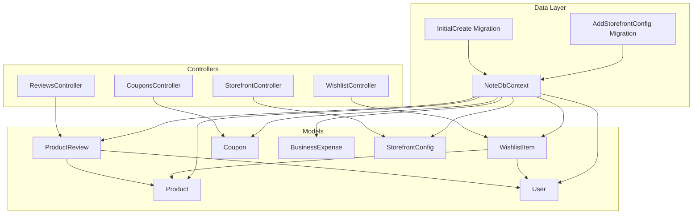
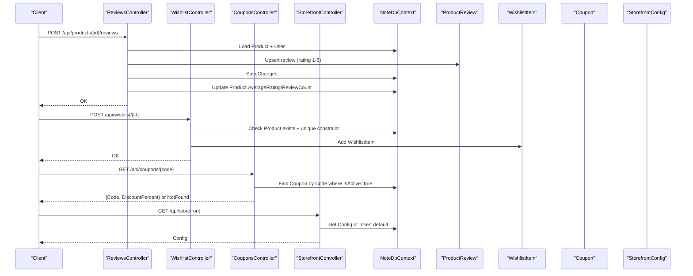
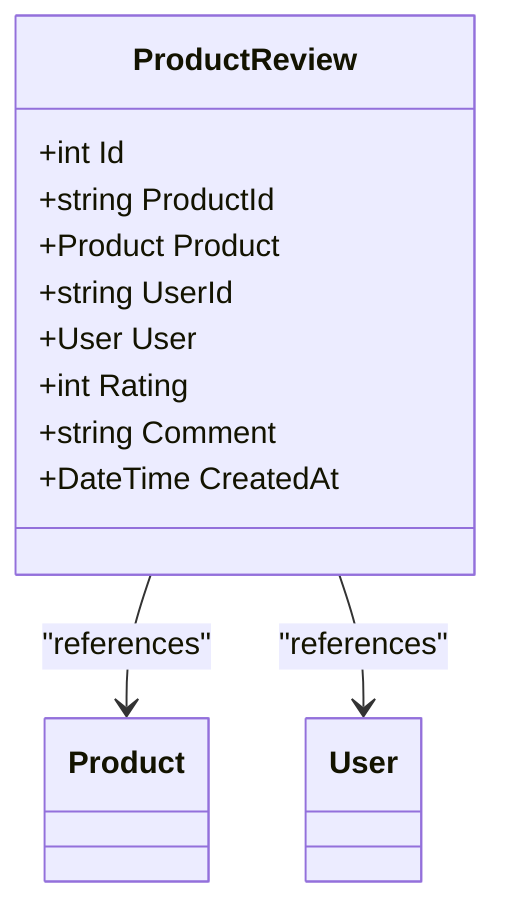
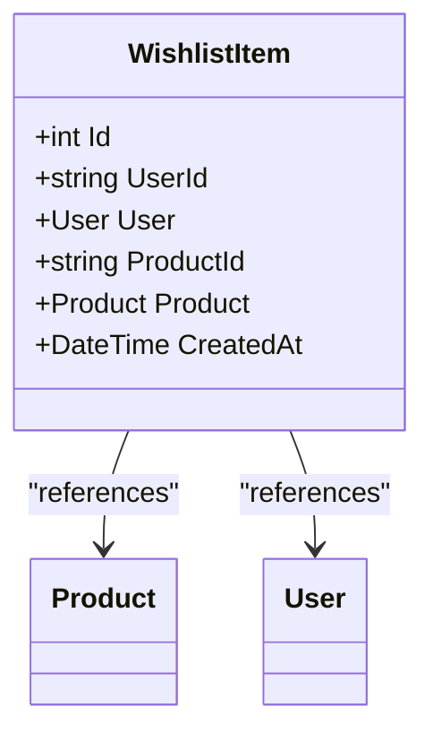
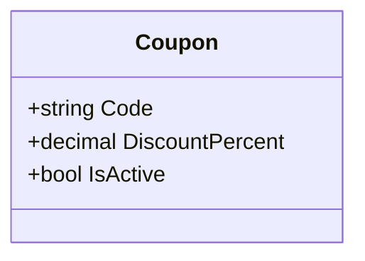
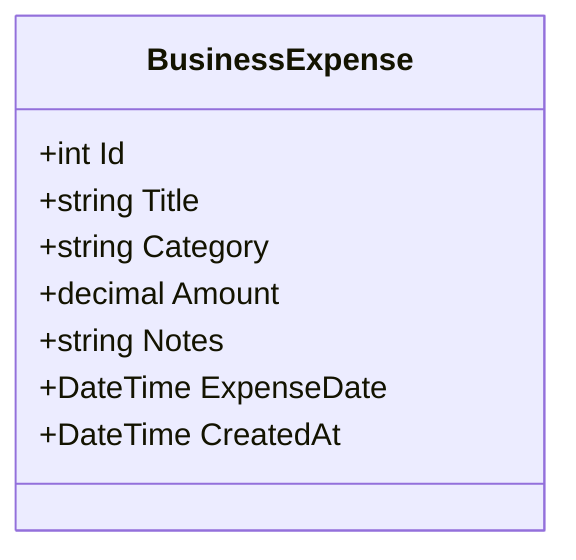
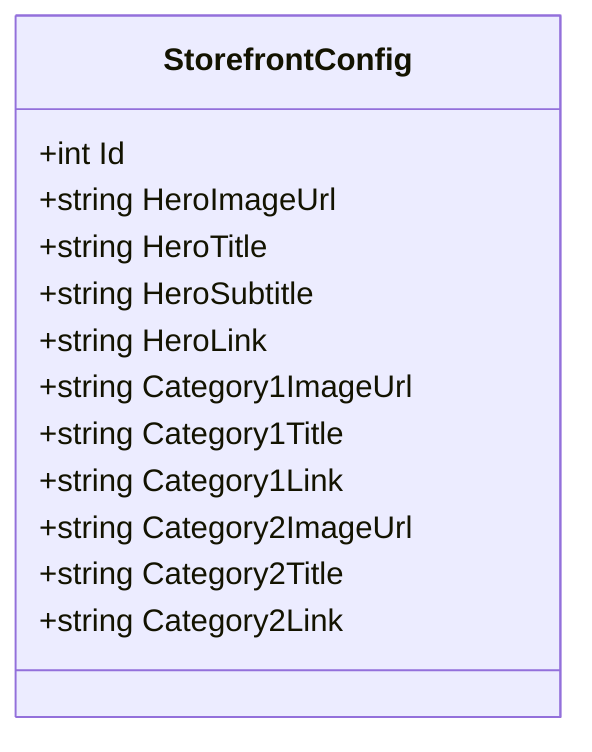
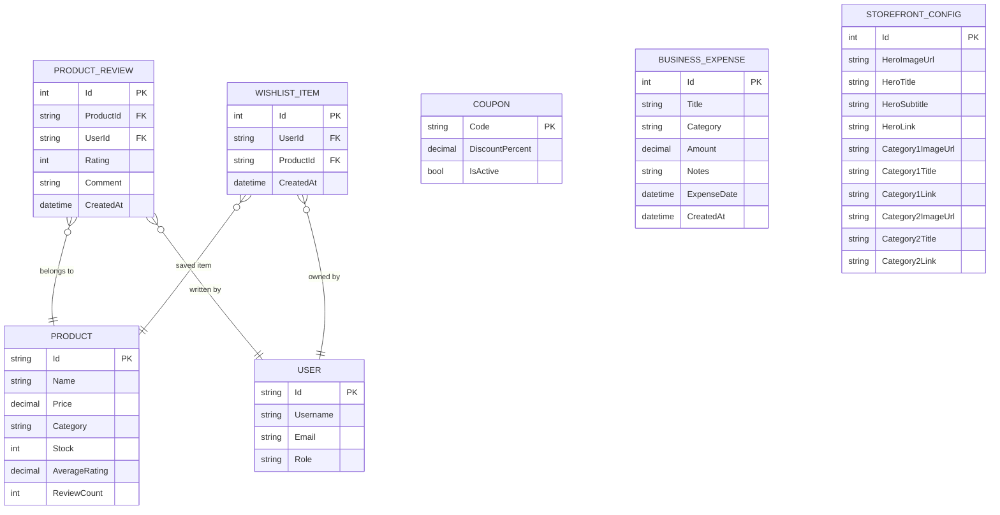

# Supporting Entities

<cite>
**Referenced Files in This Document**
- [ProductReview.cs](file://Models/ProductReview.cs)
- [WishlistItem.cs](file://Models/WishlistItem.cs)
- [Coupon.cs](file://Models/Coupon.cs)
- [BusinessExpense.cs](file://Models/BusinessExpense.cs)
- [StorefrontConfig.cs](file://Models/StorefrontConfig.cs)
- [Product.cs](file://Models/Product.cs)
- [User.cs](file://Models/User.cs)
- [ReviewsController.cs](file://Controllers/ReviewsController.cs)
- [WishlistController.cs](file://Controllers/WishlistController.cs)
- [CouponsController.cs](file://Controllers/CouponsController.cs)
- [StorefrontController.cs](file://Controllers/StorefrontController.cs)
- [NoteDbContext.cs](file://Data/NoteDbContext.cs)
- [20260427184435_InitialCreate.cs](file://Migrations/20260427184435_InitialCreate.cs)
- [20260503221515_AddStorefrontConfig.cs](file://Migrations/20260503221515_AddStorefrontConfig.cs)
- [OrderService.cs](file://Services/OrderService.cs)
</cite>

## Table of Contents
1. [Introduction](#introduction)
2. [Project Structure](#project-structure)
3. [Core Components](#core-components)
4. [Architecture Overview](#architecture-overview)
5. [Detailed Component Analysis](#detailed-component-analysis)
6. [Dependency Analysis](#dependency-analysis)
7. [Performance Considerations](#performance-considerations)
8. [Troubleshooting Guide](#troubleshooting-guide)
9. [Conclusion](#conclusion)

## Introduction
This document explains the supporting entities that enhance the core Note.Backend system:
- ProductReview: captures customer feedback and ratings for products
- WishlistItem: tracks user preferences and saved items
- Coupon: manages discount codes and promotional campaigns
- BusinessExpense: records expenses for financial tracking and accounting
- StorefrontConfig: powers marketing content and storefront customization

It covers field specifications, business rules, and integration patterns with core entities such as Product and User.

## Project Structure
The supporting entities are defined under Models and integrated via controllers and the database context. Migrations define the database schema and seed initial data.

**Diagram sources**
- [ProductReview.cs:1-14](file://Models/ProductReview.cs#L1-L14)
- [WishlistItem.cs:1-12](file://Models/WishlistItem.cs#L1-L12)
- [Coupon.cs:1-9](file://Models/Coupon.cs#L1-L9)
- [BusinessExpense.cs:1-13](file://Models/BusinessExpense.cs#L1-L13)
- [StorefrontConfig.cs:1-23](file://Models/StorefrontConfig.cs#L1-L23)
- [Product.cs:1-21](file://Models/Product.cs#L1-L21)
- [User.cs:1-12](file://Models/User.cs#L1-L12)
- [ReviewsController.cs:1-94](file://Controllers/ReviewsController.cs#L1-L94)
- [WishlistController.cs:1-82](file://Controllers/WishlistController.cs#L1-L82)
- [CouponsController.cs:1-32](file://Controllers/CouponsController.cs#L1-L32)
- [StorefrontController.cs:1-78](file://Controllers/StorefrontController.cs#L1-L78)
- [NoteDbContext.cs:1-67](file://Data/NoteDbContext.cs#L1-L67)
- [20260427184435_InitialCreate.cs:1-359](file://Migrations/20260427184435_InitialCreate.cs#L1-L359)
- [20260503221515_AddStorefrontConfig.cs:1-45](file://Migrations/20260503221515_AddStorefrontConfig.cs#L1-L45)

**Section sources**
- [NoteDbContext.cs:11-21](file://Data/NoteDbContext.cs#L11-L21)
- [20260427184435_InitialCreate.cs:164-245](file://Migrations/20260427184435_InitialCreate.cs#L164-L245)
- [20260503221515_AddStorefrontConfig.cs:14-34](file://Migrations/20260503221515_AddStorefrontConfig.cs#L14-L34)

## Core Components
This section documents each supporting entity’s fields, relationships, and business rules.

- ProductReview
  - Purpose: Per-user rating and comment for a product
  - Fields: Id, ProductId, Product (navigation), UserId, User (navigation), Rating, Comment, CreatedAt
  - Business rules:
    - Unique per user-product combination enforced by index
    - Rating constrained to 1–5 during upsert
    - On upsert, product average rating and review count are recalculated
  - Integration: Related to Product and User; used by ReviewsController

- WishlistItem
  - Purpose: User preference tracking for products
  - Fields: Id, UserId, User (navigation), ProductId, Product (navigation), CreatedAt
  - Business rules:
    - Unique per user-product combination enforced by index
    - CRUD endpoints support add, remove, list, and existence checks
  - Integration: Related to Product and User; used by WishlistController

- Coupon
  - Purpose: Discount management and promotional campaigns
  - Fields: Code (PK), DiscountPercent, IsActive
  - Business rules:
    - Code uniqueness enforced by primary key
    - Validation requires IsActive=true
    - Seeded with sample codes
  - Integration: Used by order processing logic

- BusinessExpense
  - Purpose: Financial tracking and accounting
  - Fields: Id, Title, Category, Amount, Notes, ExpenseDate, CreatedAt
  - Business rules:
    - Category defaults to a safe value
    - ExpenseDate normalized to date-only
  - Integration: Standalone entity for expense recording

- StorefrontConfig
  - Purpose: Marketing content and storefront customization
  - Fields: Id, HeroImageUrl, HeroTitle, HeroSubtitle, HeroLink, Category1ImageUrl, Category1Title, Category1Link, Category2ImageUrl, Category2Title, Category2Link
  - Business rules:
    - Single-row configuration with default fallback
    - Admin-only updates
  - Integration: Managed by StorefrontController

**Section sources**
- [ProductReview.cs:5-12](file://Models/ProductReview.cs#L5-L12)
- [WishlistItem.cs:5-10](file://Models/WishlistItem.cs#L5-L10)
- [Coupon.cs:5-7](file://Models/Coupon.cs#L5-L7)
- [BusinessExpense.cs:5-11](file://Models/BusinessExpense.cs#L5-L11)
- [StorefrontConfig.cs:5-22](file://Models/StorefrontConfig.cs#L5-L22)
- [NoteDbContext.cs:39-47](file://Data/NoteDbContext.cs#L39-L47)
- [20260427184435_InitialCreate.cs:306-321](file://Migrations/20260427184435_InitialCreate.cs#L306-L321)

## Architecture Overview
The controllers orchestrate requests and persist changes through the database context. Entity indices and foreign keys ensure referential integrity and efficient queries.

**Diagram sources**
- [ReviewsController.cs:41-86](file://Controllers/ReviewsController.cs#L41-L86)
- [WishlistController.cs:47-80](file://Controllers/WishlistController.cs#L47-L80)
- [CouponsController.cs:18-30](file://Controllers/CouponsController.cs#L18-L30)
- [StorefrontController.cs:20-46](file://Controllers/StorefrontController.cs#L20-L46)
- [NoteDbContext.cs:17-21](file://Data/NoteDbContext.cs#L17-L21)

## Detailed Component Analysis

### ProductReview
- Data model
  - Composite unique index on UserId + ProductId prevents duplicate reviews per user-product pair
  - Navigation properties link to Product and User
- Business logic
  - Rating range validated (1–5)
  - On save, product metrics are recalculated and persisted
- API integration
  - Endpoint: api/products/{productId}/reviews
  - Supports listing and upserting reviews for authenticated users

**Diagram sources**
- [ProductReview.cs:3-13](file://Models/ProductReview.cs#L3-L13)
- [Product.cs:3-20](file://Models/Product.cs#L3-L20)
- [User.cs:3-11](file://Models/User.cs#L3-L11)

**Section sources**
- [ProductReview.cs:5-12](file://Models/ProductReview.cs#L5-L12)
- [ReviewsController.cs:41-86](file://Controllers/ReviewsController.cs#L41-L86)
- [NoteDbContext.cs:45-47](file://Data/NoteDbContext.cs#L45-L47)
- [20260427184435_InitialCreate.cs:164-190](file://Migrations/20260427184435_InitialCreate.cs#L164-L190)

### WishlistItem
- Data model
  - Composite unique index on UserId + ProductId ensures one wishlist entry per user-product
  - Navigation properties link to Product and User
- Business logic
  - CRUD operations: list, add, remove, and existence check
  - Product existence validated before adding
- API integration
  - Endpoint: api/wishlist
  - Supports listing, checking existence, adding, and removing items

**Diagram sources**
- [WishlistItem.cs:3-11](file://Models/WishlistItem.cs#L3-L11)
- [Product.cs:3-20](file://Models/Product.cs#L3-L20)
- [User.cs:3-11](file://Models/User.cs#L3-L11)

**Section sources**
- [WishlistItem.cs:5-10](file://Models/WishlistItem.cs#L5-L10)
- [WishlistController.cs:22-80](file://Controllers/WishlistController.cs#L22-L80)
- [NoteDbContext.cs:41-43](file://Data/NoteDbContext.cs#L41-L43)
- [20260427184435_InitialCreate.cs:193-217](file://Migrations/20260427184435_InitialCreate.cs#L193-L217)

### Coupon
- Data model
  - Code is the primary key; IsActive flag controls validity
  - DiscountPercent stored as percentage
- Business logic
  - Validation filters by IsActive=true
  - Seeded with sample codes for testing
- API integration
  - Endpoint: api/coupons/{code}
  - Returns coupon details if valid

**Diagram sources**
- [Coupon.cs:3-8](file://Models/Coupon.cs#L3-L8)

**Section sources**
- [Coupon.cs:5-7](file://Models/Coupon.cs#L5-L7)
- [CouponsController.cs:18-30](file://Controllers/CouponsController.cs#L18-L30)
- [NoteDbContext.cs:39](file://Data/NoteDbContext.cs#L39)
- [20260427184435_InitialCreate.cs:47-57](file://Migrations/20260427184435_InitialCreate.cs#L47-L57)
- [20260427184435_InitialCreate.cs:247-254](file://Migrations/20260427184435_InitialCreate.cs#L247-L254)

### BusinessExpense
- Data model
  - Represents a single business expense with category, amount, notes, and date
  - Defaults applied for Category and ExpenseDate normalization
- Business logic
  - No external validations in model; defaults ensure minimal configuration
- API integration
  - Not exposed via a dedicated controller in the current codebase; designed for internal use

**Diagram sources**
- [BusinessExpense.cs:3-12](file://Models/BusinessExpense.cs#L3-L12)

**Section sources**
- [BusinessExpense.cs:5-11](file://Models/BusinessExpense.cs#L5-L11)
- [20260427184435_InitialCreate.cs:17-33](file://Migrations/20260427184435_InitialCreate.cs#L17-L33)

### StorefrontConfig
- Data model
  - Contains hero section and two category section fields for marketing content
  - Single-row configuration managed by the controller
- Business logic
  - On retrieval, returns existing config or seeds default values
  - Updates require Admin role
- API integration
  - Endpoint: api/storefront
  - Supports GET and PUT

**Diagram sources**
- [StorefrontConfig.cs:3-22](file://Models/StorefrontConfig.cs#L3-L22)

**Section sources**
- [StorefrontConfig.cs:5-22](file://Models/StorefrontConfig.cs#L5-L22)
- [StorefrontController.cs:20-76](file://Controllers/StorefrontController.cs#L20-L76)
- [20260503221515_AddStorefrontConfig.cs:14-34](file://Migrations/20260503221515_AddStorefrontConfig.cs#L14-L34)

## Dependency Analysis
Entity relationships and constraints are defined in the database context and migrations.

**Diagram sources**
- [NoteDbContext.cs:11-21](file://Data/NoteDbContext.cs#L11-L21)
- [20260427184435_InitialCreate.cs:164-217](file://Migrations/20260427184435_InitialCreate.cs#L164-L217)
- [20260503221515_AddStorefrontConfig.cs:14-34](file://Migrations/20260503221515_AddStorefrontConfig.cs#L14-L34)

**Section sources**
- [NoteDbContext.cs:39-47](file://Data/NoteDbContext.cs#L39-L47)
- [20260427184435_InitialCreate.cs:306-321](file://Migrations/20260427184435_InitialCreate.cs#L306-L321)

## Performance Considerations
- Indexes
  - Composite unique indexes on ProductReview(UserId, ProductId) and WishlistItem(UserId, ProductId) prevent duplicates and speed up lookups
- Queries
  - Controllers filter by user ID and product ID to minimize result sets
- Denormalized product metrics
  - Product.AverageRating and Product.ReviewCount are updated after review upsert to avoid expensive aggregations on reads

[No sources needed since this section provides general guidance]

## Troubleshooting Guide
- ProductReview
  - Symptom: Upsert fails with “Rating must be between 1 and 5”
  - Cause: Rating out of range
  - Resolution: Adjust rating to 1–5

- WishlistItem
  - Symptom: Adding non-existent product returns not found
  - Cause: Product does not exist
  - Resolution: Verify productId or create the product first

  - Symptom: Duplicate wishlist item
  - Cause: Missing unique constraint behavior
  - Resolution: Ensure composite index is active; backend enforces uniqueness

- Coupon
  - Symptom: Coupon code invalid
  - Cause: Code not found or IsActive=false
  - Resolution: Use a valid, active coupon code

- StorefrontConfig
  - Symptom: Unauthorized to update
  - Cause: Missing Admin role
  - Resolution: Authenticate as Admin

**Section sources**
- [ReviewsController.cs:48-51](file://Controllers/ReviewsController.cs#L48-L51)
- [WishlistController.cs:53-54](file://Controllers/WishlistController.cs#L53-L54)
- [CouponsController.cs:24-27](file://Controllers/CouponsController.cs#L24-L27)
- [StorefrontController.cs:49](file://Controllers/StorefrontController.cs#L49)

## Conclusion
These supporting entities extend core functionality across customer feedback, personalization, promotions, finance, and storefront presentation. Their design emphasizes referential integrity, efficient indexing, and clear API boundaries, enabling scalable and maintainable operations.