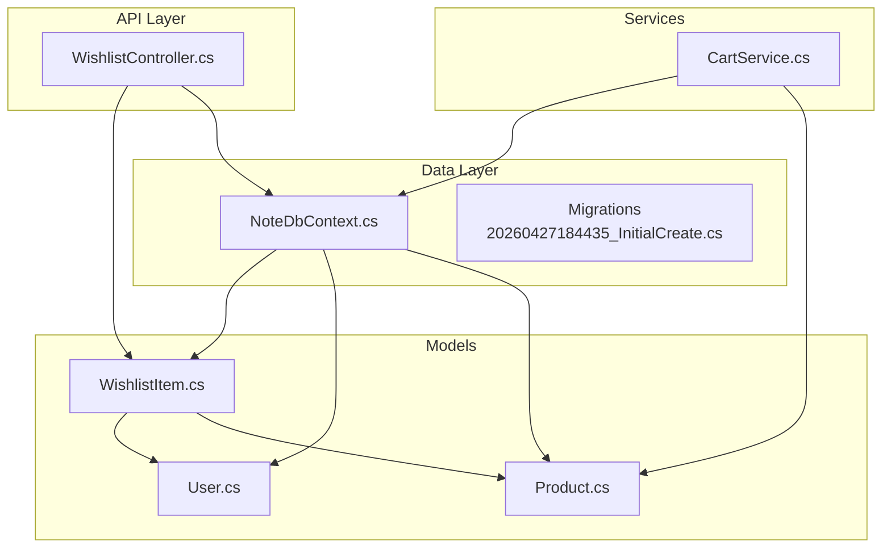
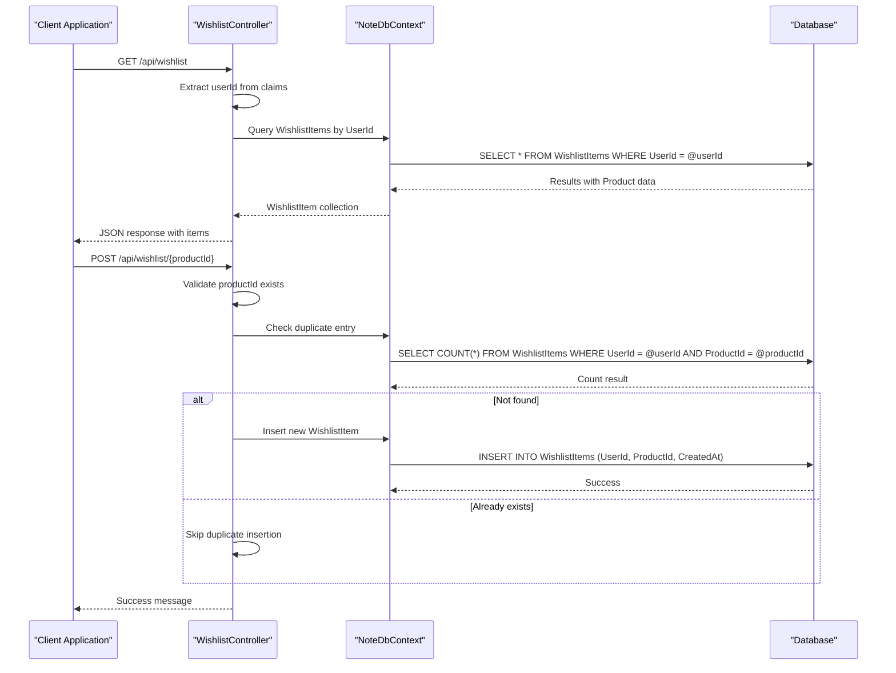
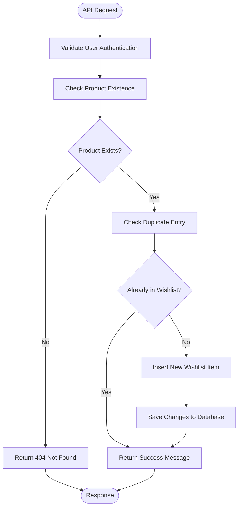
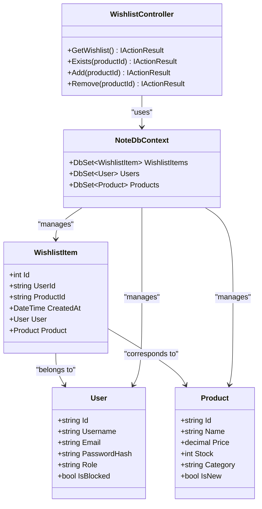

# Wishlist Item Entity

<cite>
**Referenced Files in This Document**
- [WishlistItem.cs](file://Models/WishlistItem.cs)
- [WishlistController.cs](file://Controllers/WishlistController.cs)
- [NoteDbContext.cs](file://Data/NoteDbContext.cs)
- [20260427184435_InitialCreate.cs](file://Migrations/20260427184435_InitialCreate.cs)
- [CartService.cs](file://Services/CartService.cs)
- [User.cs](file://Models/User.cs)
- [Product.cs](file://Models/Product.cs)
- [Program.cs](file://Program.cs)
</cite>

## Table of Contents
1. [Introduction](#introduction)
2. [Project Structure](#project-structure)
3. [Core Components](#core-components)
4. [Architecture Overview](#architecture-overview)
5. [Detailed Component Analysis](#detailed-component-analysis)
6. [Dependency Analysis](#dependency-analysis)
7. [Performance Considerations](#performance-considerations)
8. [Troubleshooting Guide](#troubleshooting-guide)
9. [Conclusion](#conclusion)

## Introduction
This document provides comprehensive documentation for the WishlistItem entity and its associated functionality within the Note.Backend system. It covers the entity structure, relationships with User and Product entities, controller operations for wishlist management, business rules enforcement, and integration points with the shopping cart system. The documentation is designed to be accessible to both technical and non-technical readers while maintaining precision and completeness.

## Project Structure
The wishlist functionality spans several key areas of the backend:
- Model definition for WishlistItem
- Database context configuration and migrations
- Controller for wishlist operations
- Supporting models for User and Product
- Shopping cart service integration

**Diagram sources**
- [WishlistItem.cs:1-12](file://Models/WishlistItem.cs#L1-L12)
- [NoteDbContext.cs:1-67](file://Data/NoteDbContext.cs#L1-L67)
- [20260427184435_InitialCreate.cs:192-217](file://Migrations/20260427184435_InitialCreate.cs#L192-L217)

**Section sources**
- [WishlistItem.cs:1-12](file://Models/WishlistItem.cs#L1-L12)
- [NoteDbContext.cs:1-67](file://Data/NoteDbContext.cs#L1-L67)
- [20260427184435_InitialCreate.cs:192-217](file://Migrations/20260427184435_InitialCreate.cs#L192-L217)

## Core Components
The WishlistItem entity serves as the central model for user preference management and wishlist functionality. It encapsulates the relationship between users and products they wish to purchase later.

### Entity Structure
The WishlistItem model defines four primary fields:
- **Id**: Auto-generated integer identifier for each wishlist entry
- **UserId**: String identifier linking the wishlist item to a specific user
- **ProductId**: String identifier linking the wishlist item to a specific product
- **CreatedAt**: Timestamp indicating when the item was added to the wishlist

The entity maintains navigation properties to both User and Product models, enabling eager loading of related data during wishlist queries.

### Relationship Definitions
The entity establishes two many-to-one relationships:
- **User relationship**: Each wishlist item belongs to exactly one user
- **Product relationship**: Each wishlist item corresponds to exactly one product

These relationships are enforced through foreign key constraints in the database schema.

**Section sources**
- [WishlistItem.cs:3-11](file://Models/WishlistItem.cs#L3-L11)
- [20260427184435_InitialCreate.cs:204-217](file://Migrations/20260427184435_InitialCreate.cs#L204-L217)

## Architecture Overview
The wishlist system follows a layered architecture with clear separation of concerns:

**Diagram sources**
- [WishlistController.cs:22-81](file://Controllers/WishlistController.cs#L22-L81)
- [NoteDbContext.cs:17](file://Data/NoteDbContext.cs#L17)

The architecture ensures:
- Authentication enforcement through JWT claims
- Data consistency via database constraints
- Efficient queries with proper indexing
- Clear separation between business logic and data access

**Section sources**
- [WishlistController.cs:13-81](file://Controllers/WishlistController.cs#L13-L81)
- [Program.cs:69-84](file://Program.cs#L69-L84)

## Detailed Component Analysis

### WishlistController Operations
The WishlistController provides four primary endpoints for wishlist management:

#### GET /api/wishlist
Retrieves all wishlist items for the authenticated user, ordered by creation date (newest first). The endpoint:
- Extracts the user ID from JWT claims
- Filters wishlist items by the authenticated user
- Includes product details for each wishlist item
- Returns items in descending order by creation timestamp

#### GET /api/wishlist/{productId}/exists
Checks whether a specific product is already in the user's wishlist. The endpoint:
- Validates product existence before checking wishlist status
- Returns a boolean flag indicating presence

#### POST /api/wishlist/{productId}
Adds a product to the user's wishlist. The endpoint:
- Verifies product existence
- Prevents duplicate entries through database constraints
- Creates a new wishlist item with current timestamp

#### DELETE /api/wishlist/{productId}
Removes a product from the user's wishlist. The endpoint:
- Locates the specific wishlist item
- Removes it if found
- Provides appropriate feedback

**Diagram sources**
- [WishlistController.cs:47-64](file://Controllers/WishlistController.cs#L47-L64)

**Section sources**
- [WishlistController.cs:22-81](file://Controllers/WishlistController.cs#L22-L81)

### Database Schema and Constraints
The wishlist system relies on a robust database schema with multiple integrity constraints:

#### Primary Keys and Indexes
- **Primary Key**: Auto-generated integer ID for each wishlist item
- **Product Index**: Separate index on ProductId for efficient lookups
- **Composite Unique Index**: Combined UserId and ProductId to prevent duplicates

#### Foreign Key Relationships
- **User Relationship**: Cascade delete ensures cleanup when users are removed
- **Product Relationship**: Cascade delete maintains referential integrity

#### Migration Implementation
The initial migration creates the WishlistItems table with all necessary constraints and relationships, establishing the foundation for wishlist functionality.

**Section sources**
- [20260427184435_InitialCreate.cs:192-217](file://Migrations/20260427184435_InitialCreate.cs#L192-L217)
- [NoteDbContext.cs:41-43](file://Data/NoteDbContext.cs#L41-L43)

### Shopping Cart Integration
The wishlist system integrates seamlessly with the shopping cart functionality:

#### Product Availability Validation
Both systems validate product availability:
- **Wishlist**: Checks product existence before adding
- **Shopping Cart**: Validates product existence and stock levels before adding

#### Shared Product Model
Both systems reference the same Product model, ensuring consistency in product information and availability status.

#### Workflow Coordination
Users can move items from wishlist to cart when ready to purchase, leveraging the shared product model and validation logic.

**Section sources**
- [CartService.cs:33-73](file://Services/CartService.cs#L33-L73)
- [WishlistController.cs:53-54](file://Controllers/WishlistController.cs#L53-L54)

## Dependency Analysis
The wishlist system exhibits clear dependency relationships:

**Diagram sources**
- [WishlistItem.cs:3-11](file://Models/WishlistItem.cs#L3-L11)
- [WishlistController.cs:15](file://Controllers/WishlistController.cs#L15)
- [NoteDbContext.cs:17](file://Data/NoteDbContext.cs#L17)

### Coupling and Cohesion
- **High Cohesion**: WishlistItem focuses solely on wishlist functionality
- **Moderate Coupling**: Controlled through explicit foreign key relationships
- **Clear Interfaces**: Well-defined relationships between models and controller

### External Dependencies
- **Entity Framework Core**: ORM for database operations
- **JWT Authentication**: Security framework for user validation
- **PostgreSQL**: Database backend with Npgsql provider

**Section sources**
- [NoteDbContext.cs:1-67](file://Data/NoteDbContext.cs#L1-L67)
- [Program.cs:38-39](file://Program.cs#L38-L39)

## Performance Considerations
The wishlist system incorporates several performance optimizations:

### Database Indexing Strategy
- **Composite Index**: UserId + ProductId prevents duplicate entries efficiently
- **Product Index**: Optimizes product-based queries
- **Unique Constraint**: Enforces business rules at the database level

### Query Optimization
- **Eager Loading**: Product details loaded in single query
- **Ordered Retrieval**: Creation timestamp ordering for intuitive display
- **Filtered Queries**: User-specific filtering prevents unnecessary data transfer

### Memory Management
- **Asynchronous Operations**: Non-blocking database operations
- **Efficient Model Binding**: Minimal data transfer for API responses

## Troubleshooting Guide

### Common Issues and Solutions

#### Authentication Failures
**Problem**: Users receive unauthorized responses when accessing wishlist endpoints
**Cause**: Missing or invalid JWT token
**Solution**: Ensure proper authentication middleware is configured and tokens are included in requests

#### Duplicate Entry Prevention
**Problem**: Attempting to add the same product twice
**Cause**: No duplicate prevention mechanism
**Solution**: The composite unique index automatically prevents duplicates at the database level

#### Product Not Found Errors
**Problem**: Adding non-existent products to wishlist
**Cause**: Product ID validation failure
**Solution**: Verify product exists before attempting to add to wishlist

#### Performance Issues
**Problem**: Slow wishlist loading for users with many items
**Cause**: Missing indexes or inefficient queries
**Solution**: Database indexes are already configured; consider pagination for large lists

**Section sources**
- [WishlistController.cs:25-26](file://Controllers/WishlistController.cs#L25-L26)
- [NoteDbContext.cs:41-43](file://Data/NoteDbContext.cs#L41-L43)

## Conclusion
The WishlistItem entity provides a robust foundation for user preference management within the Note.Backend system. Its design emphasizes data integrity through database constraints, efficient querying through strategic indexing, and seamless integration with the broader shopping ecosystem. The implementation demonstrates clean separation of concerns, clear business rule enforcement, and thoughtful consideration of user experience through intuitive ordering and validation mechanisms.

The system successfully balances simplicity with functionality, providing essential wishlist capabilities while maintaining scalability and maintainability. Future enhancements could include wishlist size limits, bulk operations, and enhanced notification systems for product availability changes.