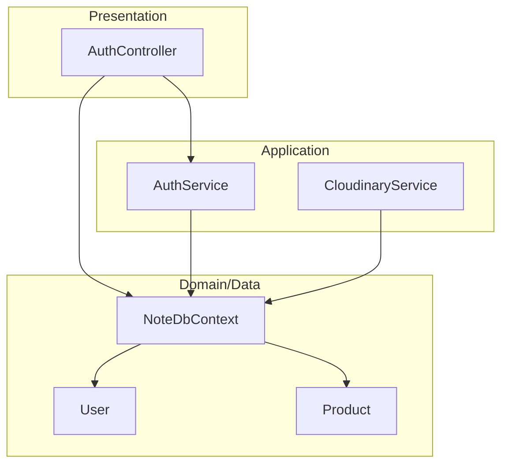
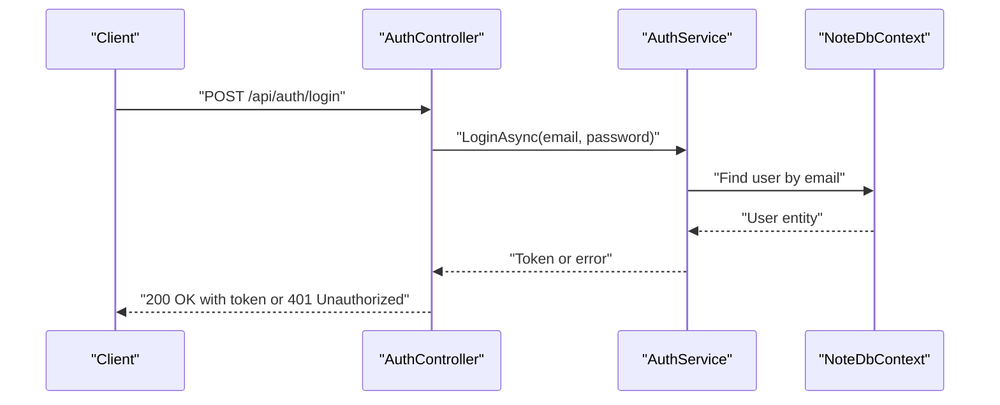
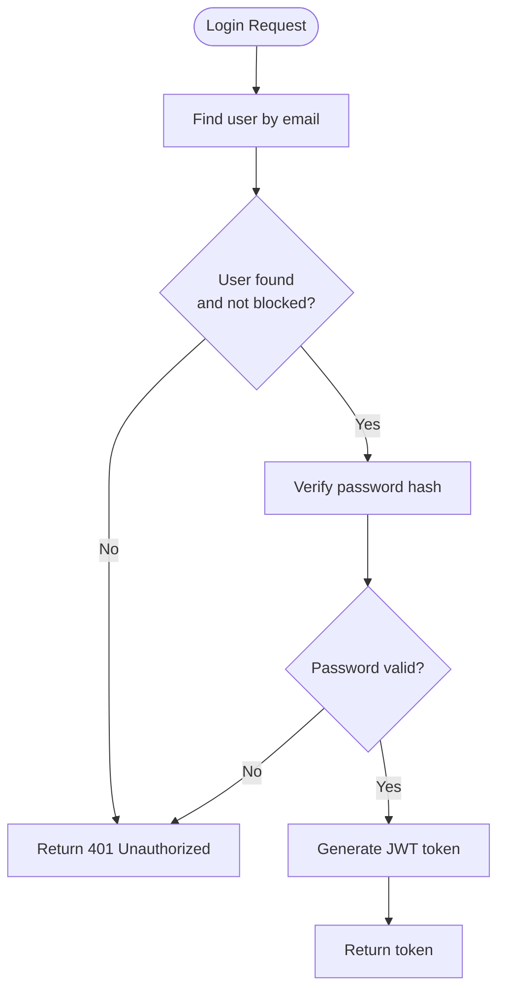
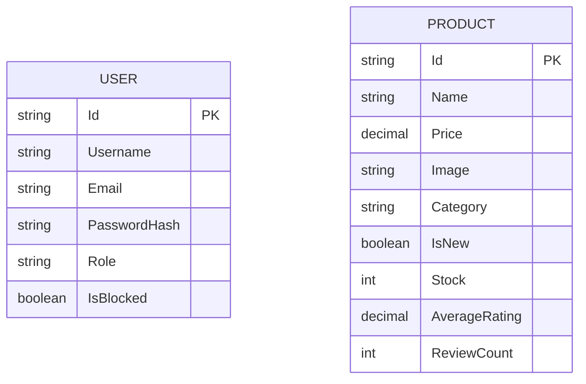
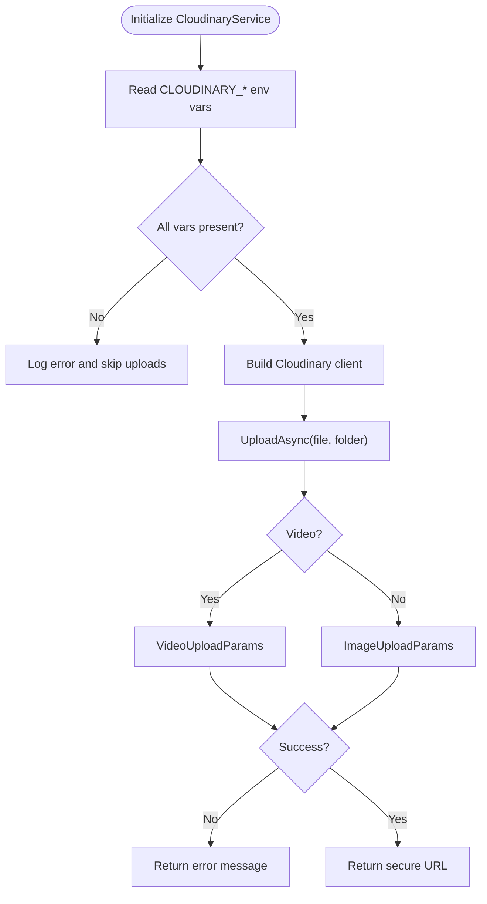
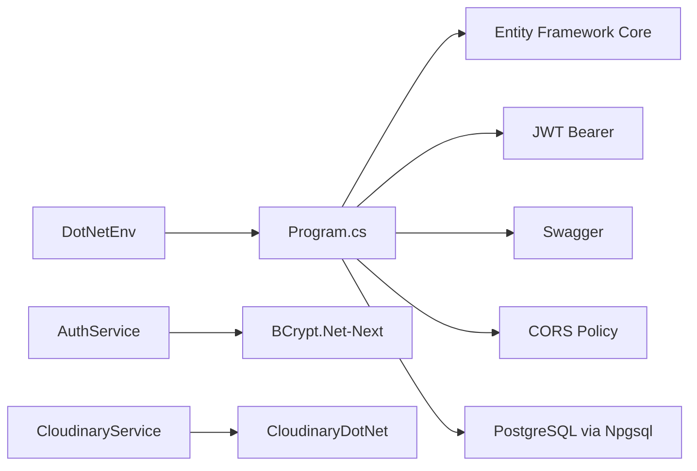

# Getting Started

<cite>
**Referenced Files in This Document**
- [Program.cs](file://Program.cs)
- [appsettings.json](file://appsettings.json)
- [appsettings.Development.json](file://appsettings.Development.json)
- [Note.Backend.csproj](file://Note.Backend.csproj)
- [Properties/launchSettings.json](file://Properties/launchSettings.json)
- [Data/NoteDbContext.cs](file://Data/NoteDbContext.cs)
- [Services/AuthService.cs](file://Services/AuthService.cs)
- [Controllers/AuthController.cs](file://Controllers/AuthController.cs)
- [Models/User.cs](file://Models/User.cs)
- [Models/Product.cs](file://Models/Product.cs)
- [Services/CloudinaryService.cs](file://Services/CloudinaryService.cs)
- [Models/CloudinaryOptions.cs](file://Models/CloudinaryOptions.cs)
- [Note.Backend.http](file://Note.Backend.http)
</cite>

## Table of Contents
1. [Introduction](#introduction)
2. [Project Structure](#project-structure)
3. [Core Components](#core-components)
4. [Architecture Overview](#architecture-overview)
5. [Detailed Component Analysis](#detailed-component-analysis)
6. [Dependency Analysis](#dependency-analysis)
7. [Performance Considerations](#performance-considerations)
8. [Troubleshooting Guide](#troubleshooting-guide)
9. [Conclusion](#conclusion)
10. [Appendices](#appendices)

## Introduction
Note.Backend is a .NET 10-based e-commerce platform backend focused on stationery and journals. It provides APIs for user authentication, product browsing, shopping cart management, orders, reviews, coupons, and media uploads via Cloudinary. The backend is built as an ASP.NET Core Web API with Entity Framework Core for data access and PostgreSQL as the primary database. It includes JWT-based authentication, Swagger/OpenAPI documentation, and seed data for quick local development.

## Project Structure
The project follows a layered architecture:
- Presentation: Controllers expose REST endpoints
- Application: Services encapsulate business logic
- Domain/Data: Models define domain entities; DbContext manages persistence
- Configuration: appsettings files and Program.cs bootstrap the runtime

**Diagram sources**
- [Controllers/AuthController.cs:1-76](file://Controllers/AuthController.cs#L1-L76)
- [Services/AuthService.cs:1-98](file://Services/AuthService.cs#L1-L98)
- [Services/CloudinaryService.cs:1-103](file://Services/CloudinaryService.cs#L1-L103)
- [Data/NoteDbContext.cs:1-67](file://Data/NoteDbContext.cs#L1-L67)
- [Models/User.cs:1-12](file://Models/User.cs#L1-L12)
- [Models/Product.cs:1-21](file://Models/Product.cs#L1-L21)

**Section sources**
- [Program.cs:10-150](file://Program.cs#L10-L150)
- [Note.Backend.csproj:1-29](file://Note.Backend.csproj#L1-L29)

## Core Components
- Authentication: Registration, login, password change with JWT tokens
- Media Uploads: Cloudinary integration for images and videos
- Data Access: Entity Framework Core with PostgreSQL
- API Documentation: Swagger UI enabled for interactive docs
- Seeding: Initial admin user and sample products for local testing

**Section sources**
- [Controllers/AuthController.cs:1-76](file://Controllers/AuthController.cs#L1-L76)
- [Services/AuthService.cs:1-98](file://Services/AuthService.cs#L1-L98)
- [Services/CloudinaryService.cs:1-103](file://Services/CloudinaryService.cs#L1-L103)
- [Data/NoteDbContext.cs:23-67](file://Data/NoteDbContext.cs#L23-L67)

## Architecture Overview
High-level runtime flow:
- Startup configures services, middleware, and database migrations
- Requests hit controllers, which delegate to services
- Services interact with DbContext for data operations
- CloudinaryService handles media uploads
- Responses are returned to clients with JWT tokens for authenticated flows

**Diagram sources**
- [Controllers/AuthController.cs:29-38](file://Controllers/AuthController.cs#L29-L38)
- [Services/AuthService.cs:43-57](file://Services/AuthService.cs#L43-L57)
- [Data/NoteDbContext.cs:45-49](file://Data/NoteDbContext.cs#L45-L49)

## Detailed Component Analysis

### Authentication Flow
- Registration endpoint accepts username, email, and password; stores a hashed password
- Login validates credentials and issues a signed JWT token
- Change password requires authenticated requests and verifies the current password

**Diagram sources**
- [Services/AuthService.cs:43-57](file://Services/AuthService.cs#L43-L57)
- [Controllers/AuthController.cs:29-38](file://Controllers/AuthController.cs#L29-L38)

**Section sources**
- [Controllers/AuthController.cs:18-54](file://Controllers/AuthController.cs#L18-L54)
- [Services/AuthService.cs:22-96](file://Services/AuthService.cs#L22-L96)
- [Models/User.cs:1-12](file://Models/User.cs#L1-L12)

### Data Model Overview
Core entities include User and Product, with relationships managed by EF Core.

**Diagram sources**
- [Models/User.cs:1-12](file://Models/User.cs#L1-L12)
- [Models/Product.cs:1-21](file://Models/Product.cs#L1-L21)

**Section sources**
- [Data/NoteDbContext.cs:11-21](file://Data/NoteDbContext.cs#L11-L21)
- [Models/User.cs:1-12](file://Models/User.cs#L1-L12)
- [Models/Product.cs:1-21](file://Models/Product.cs#L1-L21)

### Media Uploads with Cloudinary
- Reads environment variables for Cloudinary credentials
- Supports image and video uploads
- Returns secure URLs upon successful upload

**Diagram sources**
- [Services/CloudinaryService.cs:16-102](file://Services/CloudinaryService.cs#L16-L102)
- [Models/CloudinaryOptions.cs:1-9](file://Models/CloudinaryOptions.cs#L1-L9)

**Section sources**
- [Services/CloudinaryService.cs:1-103](file://Services/CloudinaryService.cs#L1-L103)
- [Models/CloudinaryOptions.cs:1-9](file://Models/CloudinaryOptions.cs#L1-L9)

## Dependency Analysis
External libraries and their roles:
- Entity Framework Core: ORM and migrations
- Npgsql.EntityFrameworkCore.PostgreSQL: PostgreSQL provider
- Microsoft.AspNetCore.Authentication.JwtBearer: JWT bearer authentication
- Swashbuckle.AspNetCore: OpenAPI/Swagger
- CloudinaryDotNet: Cloudinary integration
- DotNetEnv: Load environment variables from .env

**Diagram sources**
- [Program.cs:1-150](file://Program.cs#L1-L150)
- [Note.Backend.csproj:9-26](file://Note.Backend.csproj#L9-L26)

**Section sources**
- [Note.Backend.csproj:1-29](file://Note.Backend.csproj#L1-L29)
- [Program.cs:1-150](file://Program.cs#L1-L150)

## Performance Considerations
- Keep JWT expiration reasonable to balance security and UX
- Use streaming for large media uploads to reduce memory pressure
- Index frequently queried fields (e.g., user email, product category) in the database
- Monitor Cloudinary upload errors and retry strategies if needed
- Use connection pooling and appropriate EF Core caching for read-heavy scenarios

## Troubleshooting Guide
Common issues and resolutions:
- Database connection failures
  - Ensure DATABASE_URL or ConnectionStrings:DefaultConnection is set
  - Confirm PostgreSQL server is reachable and credentials are correct
  - The app auto-applies migrations on startup; verify migration logs
- JWT authentication errors
  - Verify Jwt:Key matches between configuration and client
  - Ensure Authorization header is included for protected endpoints
- Cloudinary upload failures
  - Confirm CLOUDINARY_CLOUD_NAME, CLOUDINARY_API_KEY, and CLOUDINARY_API_SECRET environment variables are set
  - Check logs for explicit error messages during upload attempts
- CORS issues
  - The AllowFrontend policy allows any origin for development; adjust for production
- Swagger not accessible
  - Ensure Swagger is enabled in the pipeline and launch settings open swagger by default

**Section sources**
- [Program.cs:25-84](file://Program.cs#L25-L84)
- [Program.cs:101-148](file://Program.cs#L101-L148)
- [Properties/launchSettings.json:7-12](file://Properties/launchSettings.json#L7-L12)
- [Services/CloudinaryService.cs:16-38](file://Services/CloudinaryService.cs#L16-L38)

## Conclusion
You now have the essentials to install, configure, and run Note.Backend locally. Use the provided configuration files and environment variables to connect to PostgreSQL, enable JWT authentication, and integrate Cloudinary. Explore the Swagger UI for API discovery and leverage the seeded data to test functionality quickly.

## Appendices

### Installation and Setup
- Prerequisites
  - .NET 10 SDK
  - PostgreSQL server
  - Optional: Cloudinary account and credentials
- Steps
  1. Clone the repository
  2. Restore packages
  3. Set up environment variables for database and Cloudinary
  4. Run the application; migrations apply automatically
  5. Open Swagger at the launch URL configured in launch settings

**Section sources**
- [Note.Backend.csproj:1-29](file://Note.Backend.csproj#L1-L29)
- [Program.cs:25-84](file://Program.cs#L25-L84)
- [Properties/launchSettings.json:7-12](file://Properties/launchSettings.json#L7-L12)

### Environment Variables
- Database
  - ConnectionStrings:DefaultConnection or DATABASE_URL
- JWT
  - Jwt:Key
- Cloudinary
  - CLOUDINARY_CLOUD_NAME, CLOUDINARY_API_KEY, CLOUDINARY_API_SECRET
- Logging
  - Logging:LogLevel entries

**Section sources**
- [appsettings.json:2-13](file://appsettings.json#L2-L13)
- [appsettings.Development.json:2-13](file://appsettings.Development.json#L2-L13)
- [Program.cs:70-84](file://Program.cs#L70-L84)
- [Services/CloudinaryService.cs:16-38](file://Services/CloudinaryService.cs#L16-L38)

### Running Locally and Accessing Swagger
- Launch profiles open Swagger by default
- Use the HTTP profile or HTTPS profile as preferred
- The Note.Backend.http file defines a sample request template

**Section sources**
- [Properties/launchSettings.json:1-25](file://Properties/launchSettings.json#L1-L25)
- [Note.Backend.http:1-7](file://Note.Backend.http#L1-L7)

### Basic API Usage Examples
- Authentication
  - POST /api/auth/register with username, email, password
  - POST /api/auth/login with email and password
  - POST /api/auth/change-password (requires Authorization header)
- Explore other endpoints via Swagger UI

**Section sources**
- [Controllers/AuthController.cs:18-54](file://Controllers/AuthController.cs#L18-L54)
- [Program.cs:101-148](file://Program.cs#L101-L148)

### Understanding Core Architectural Patterns
- Clean Architecture layers
  - Controllers: HTTP entry points
  - Services: Business logic
  - DbContext: Data persistence
- Dependency Injection
  - Services registered in Program.cs
- Middleware Pipeline
  - Swagger, routing, CORS, authentication, authorization, controller mapping

**Section sources**
- [Program.cs:61-96](file://Program.cs#L61-L96)
- [Program.cs:140-148](file://Program.cs#L140-L148)