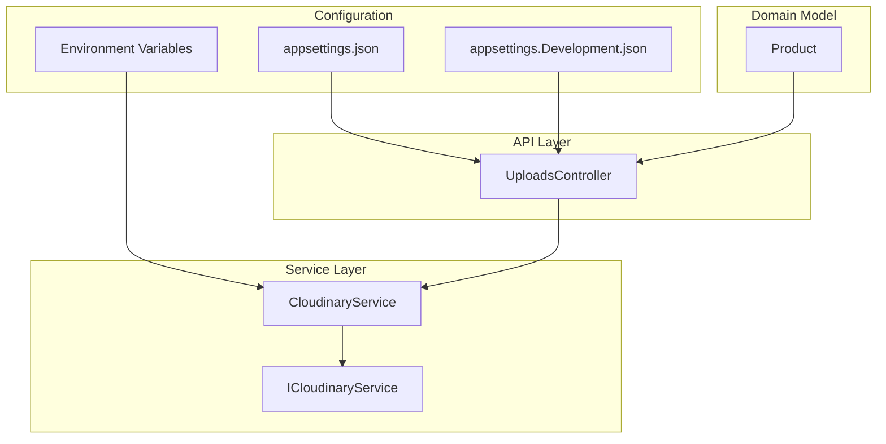
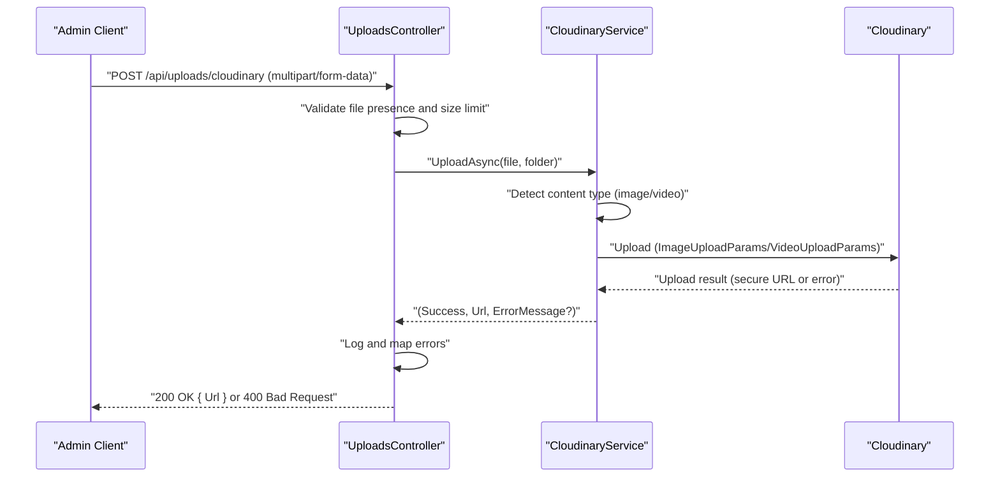
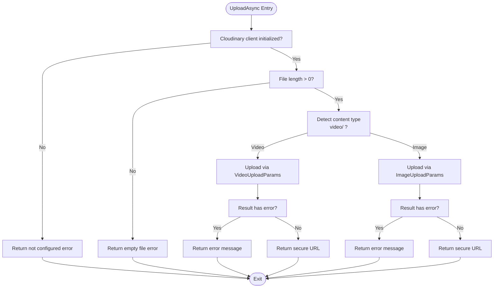
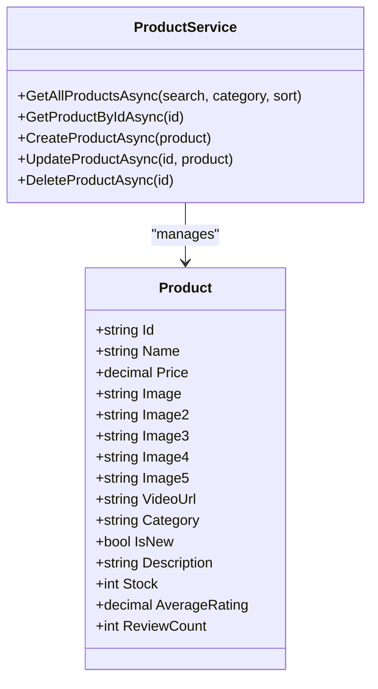
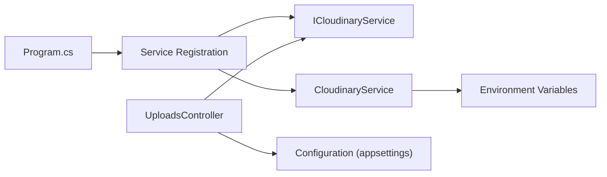

# Media Management System

<cite>
**Referenced Files in This Document**
- [CloudinaryOptions.cs](file://Models/CloudinaryOptions.cs)
- [CloudinaryService.cs](file://Services/CloudinaryService.cs)
- [ICloudinaryService.cs](file://Services/ICloudinaryService.cs)
- [UploadsController.cs](file://Controllers/UploadsController.cs)
- [Product.cs](file://Models/Product.cs)
- [ProductService.cs](file://Services/ProductService.cs)
- [appsettings.json](file://appsettings.json)
- [appsettings.Development.json](file://appsettings.Development.json)
- [Program.cs](file://Program.cs)
</cite>

## Table of Contents
1. [Introduction](#introduction)
2. [Project Structure](#project-structure)
3. [Core Components](#core-components)
4. [Architecture Overview](#architecture-overview)
5. [Detailed Component Analysis](#detailed-component-analysis)
6. [Dependency Analysis](#dependency-analysis)
7. [Performance Considerations](#performance-considerations)
8. [Troubleshooting Guide](#troubleshooting-guide)
9. [Conclusion](#conclusion)

## Introduction
This document describes the media management system built around Cloudinary integration in Note.Backend. It covers the file upload process, handling of images and videos, media storage configuration, the Cloudinary service implementation, upload endpoints, and how media URLs are managed within the product catalog. It also addresses security considerations, performance optimization, error handling, file validation, and integration with the product catalog system.

## Project Structure
The media management system spans three primary areas:
- Configuration: Cloudinary credentials and environment variables
- Service Layer: Cloudinary integration and upload orchestration
- API Layer: Upload endpoint for administrators

**Diagram sources**
- [UploadsController.cs:1-80](file://Controllers/UploadsController.cs#L1-L80)
- [CloudinaryService.cs:1-103](file://Services/CloudinaryService.cs#L1-L103)
- [ICloudinaryService.cs:1-7](file://Services/ICloudinaryService.cs#L1-L7)
- [Product.cs:1-21](file://Models/Product.cs#L1-L21)
- [appsettings.json:1-23](file://appsettings.json#L1-L23)
- [appsettings.Development.json:1-14](file://appsettings.Development.json#L1-L14)

**Section sources**
- [UploadsController.cs:1-80](file://Controllers/UploadsController.cs#L1-L80)
- [CloudinaryService.cs:1-103](file://Services/CloudinaryService.cs#L1-L103)
- [ICloudinaryService.cs:1-7](file://Services/ICloudinaryService.cs#L1-L7)
- [Product.cs:1-21](file://Models/Product.cs#L1-L21)
- [appsettings.json:1-23](file://appsettings.json#L1-L23)
- [appsettings.Development.json:1-14](file://appsettings.Development.json#L1-L14)

## Core Components
- CloudinaryOptions: Defines the configuration shape for Cloudinary credentials.
- ICloudinaryService: Contract for media uploads.
- CloudinaryService: Implements upload logic for images and videos, including error handling and logging.
- UploadsController: Exposes an admin-only endpoint to upload files to Cloudinary and return secure URLs.
- Product model: Stores media URLs for product images and optional video.

Key responsibilities:
- Validate and route uploads based on content type.
- Persist media URLs in product records.
- Enforce administrative access and safe request limits.

**Section sources**
- [CloudinaryOptions.cs:1-9](file://Models/CloudinaryOptions.cs#L1-L9)
- [ICloudinaryService.cs:1-7](file://Services/ICloudinaryService.cs#L1-L7)
- [CloudinaryService.cs:40-103](file://Services/CloudinaryService.cs#L40-L103)
- [UploadsController.cs:23-78](file://Controllers/UploadsController.cs#L23-L78)
- [Product.cs:8-13](file://Models/Product.cs#L8-L13)

## Architecture Overview
The upload flow is role-restricted and delegates Cloudinary operations to a dedicated service. The controller validates requests, selects a destination folder, and returns a secure Cloudinary URL.

**Diagram sources**
- [UploadsController.cs:23-78](file://Controllers/UploadsController.cs#L23-L78)
- [CloudinaryService.cs:40-103](file://Services/CloudinaryService.cs#L40-L103)

## Detailed Component Analysis

### Cloudinary Options and Configuration
- CloudinaryOptions defines the credential fields used by the service initialization.
- Configuration sources:
  - appsettings.json: Default placeholder values for Cloudinary credentials.
  - appsettings.Development.json: Example development credentials.
  - Environment variables: Used by the service constructor for runtime initialization.

Operational behavior:
- The service reads environment variables directly during construction.
- If any credential is missing, initialization fails and subsequent uploads return a configuration error.

**Section sources**
- [CloudinaryOptions.cs:3-8](file://Models/CloudinaryOptions.cs#L3-L8)
- [appsettings.json:9-13](file://appsettings.json#L9-L13)
- [appsettings.Development.json:2-6](file://appsettings.Development.json#L2-L6)
- [CloudinaryService.cs:12-38](file://Services/CloudinaryService.cs#L12-L38)

### Cloudinary Service Implementation
Responsibilities:
- Initialize Cloudinary client using environment variables.
- Validate incoming files (non-empty).
- Detect content type and choose appropriate upload parameters (image vs video).
- Return a tuple indicating success, the secure URL, and an optional error message.
- Log warnings and errors for diagnostics.

Processing logic highlights:
- Content-type detection uses a case-insensitive prefix check for "video/".
- Uses CloudinaryDotNet actions for image and video uploads.
- Returns structured error messages for downstream handling.

**Diagram sources**
- [CloudinaryService.cs:40-103](file://Services/CloudinaryService.cs#L40-L103)

**Section sources**
- [CloudinaryService.cs:40-103](file://Services/CloudinaryService.cs#L40-L103)

### Upload Endpoint (UploadsController)
- Route: POST /api/uploads/cloudinary
- Authentication: Requires Admin role.
- Request constraints:
  - Consumes multipart/form-data.
  - Request size limit of 100 MB.
- Behavior:
  - Logs request metadata for debugging.
  - Reads Cloudinary configuration from configuration and environment variables.
  - Extracts the file and optional folder parameter (defaults to note/products).
  - Delegates upload to CloudinaryService and returns either the URL or a structured error.

Error handling:
- Detects missing configuration and returns a 400 with required environment variables.
- General upload failures return a 400 with the error message.

**Section sources**
- [UploadsController.cs:23-78](file://Controllers/UploadsController.cs#L23-L78)

### Product Catalog Integration
- Product model supports multiple image URLs and a single video URL field.
- After successful upload, the application stores the returned Cloudinary secure URL in the product record.
- The ProductService manages CRUD operations for products.

**Diagram sources**
- [Product.cs:3-20](file://Models/Product.cs#L3-L20)
- [ProductService.cs:7-95](file://Services/ProductService.cs#L7-L95)

**Section sources**
- [Product.cs:8-13](file://Models/Product.cs#L8-L13)
- [ProductService.cs:52-78](file://Services/ProductService.cs#L52-L78)

## Dependency Analysis
- UploadsController depends on ICloudinaryService and IConfiguration for configuration checks.
- CloudinaryService depends on CloudinaryDotNet and uses environment variables for initialization.
- Program.cs registers ICloudinaryService with CloudinaryService and loads environment variables via DotNetEnv.

**Diagram sources**
- [Program.cs:66-67](file://Program.cs#L66-L67)
- [UploadsController.cs:16-21](file://Controllers/UploadsController.cs#L16-L21)
- [CloudinaryService.cs:12-38](file://Services/CloudinaryService.cs#L12-L38)

**Section sources**
- [Program.cs:66-67](file://Program.cs#L66-L67)
- [UploadsController.cs:16-21](file://Controllers/UploadsController.cs#L16-L21)
- [CloudinaryService.cs:12-38](file://Services/CloudinaryService.cs#L12-L38)

## Performance Considerations
- Request size limit: The endpoint enforces a 100 MB limit to prevent resource exhaustion.
- Logging: Extensive logging aids in diagnosing slow uploads or misconfigured environments.
- Secure URLs: Cloudinary returns secure URLs, enabling HTTPS delivery and CDN acceleration.
- Folder organization: Target folder selection allows logical separation of assets (e.g., note/products).

Recommendations:
- Monitor upload latency and error rates via logs.
- Consider implementing retry logic on the client side for transient failures.
- Use Cloudinary’s built-in transformations for on-the-fly resizing and compression when serving media.

**Section sources**
- [UploadsController.cs:25](file://Controllers/UploadsController.cs#L25)
- [CloudinaryService.cs:76](file://Services/CloudinaryService.cs#L76)
- [CloudinaryService.cs:94](file://Services/CloudinaryService.cs#L94)

## Troubleshooting Guide
Common issues and resolutions:
- Missing Cloudinary configuration:
  - Symptoms: Controller returns 400 with a message indicating missing configuration and lists required environment variables.
  - Resolution: Set CLOUDINARY_CLOUD_NAME, CLOUDINARY_API_KEY, and CLOUDINARY_API_SECRET.
- Empty file upload:
  - Symptoms: Warning logged and 400 response with "File is empty."
  - Resolution: Ensure the multipart form includes a valid file.
- Upload errors from Cloudinary:
  - Symptoms: Error logged and 400 response with the underlying error message.
  - Resolution: Verify file type compatibility and network connectivity.
- Role restrictions:
  - Symptoms: Unauthorized access attempts are blocked.
  - Resolution: Ensure the caller has the Admin role.

Debugging tips:
- Inspect controller logs for request metadata and configuration checks.
- Confirm environment variables are loaded by the service initialization logs.

**Section sources**
- [UploadsController.cs:44-49](file://Controllers/UploadsController.cs#L44-L49)
- [UploadsController.cs:64-73](file://Controllers/UploadsController.cs#L64-L73)
- [CloudinaryService.cs:48-52](file://Services/CloudinaryService.cs#L48-L52)
- [CloudinaryService.cs:97-101](file://Services/CloudinaryService.cs#L97-L101)

## Conclusion
The media management system integrates Cloudinary securely and efficiently. Administrators can upload images and videos via a protected endpoint, with the service handling content-type detection, error reporting, and returning secure URLs suitable for product catalogs. Configuration is flexible across environment variables and appsettings, while logging and request limits support robust operation. Extending the system to include Cloudinary transformations or advanced validation would further enhance performance and flexibility.