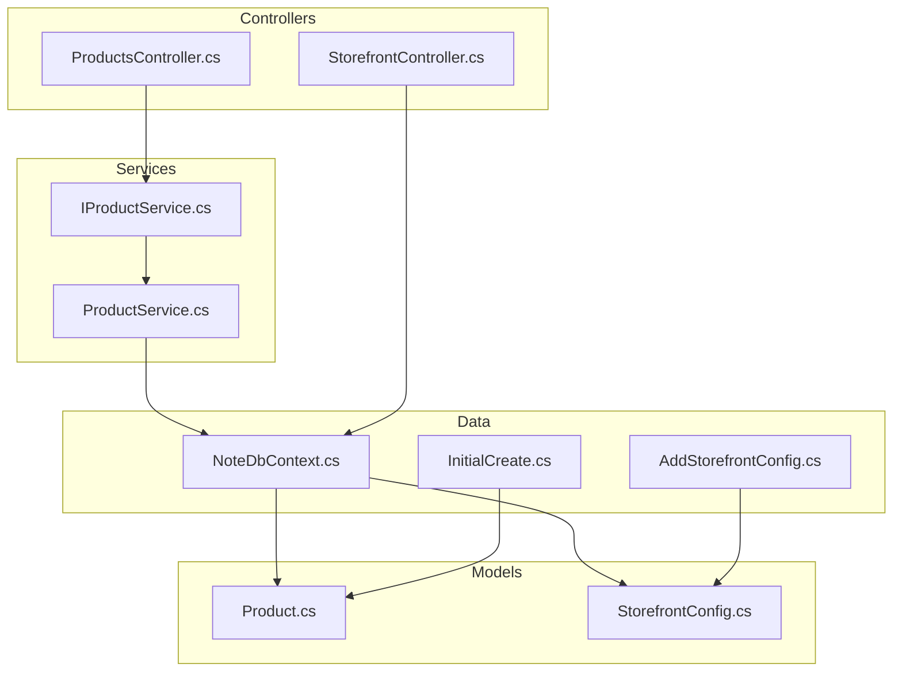
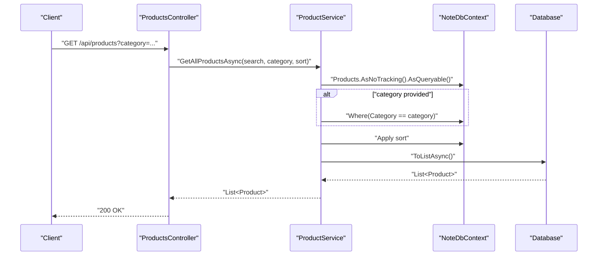
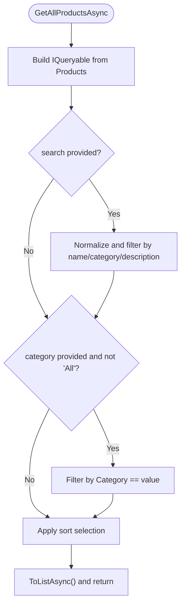
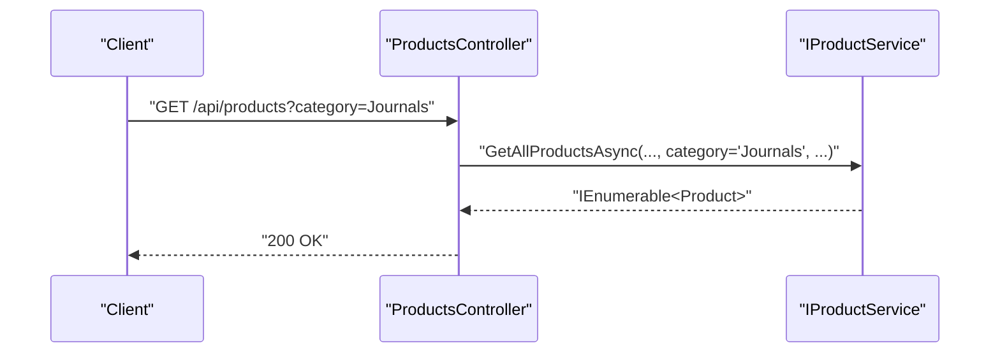
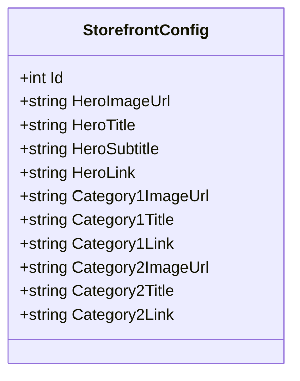
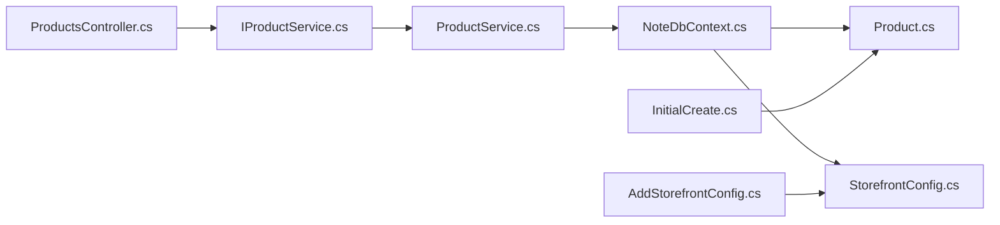

# Category Management

<cite>
**Referenced Files in This Document**
- [Product.cs](file://Models/Product.cs)
- [StorefrontConfig.cs](file://Models/StorefrontConfig.cs)
- [NoteDbContext.cs](file://Data/NoteDbContext.cs)
- [IProductService.cs](file://Services/IProductService.cs)
- [ProductService.cs](file://Services/ProductService.cs)
- [ProductsController.cs](file://Controllers/ProductsController.cs)
- [StorefrontController.cs](file://Controllers/StorefrontController.cs)
- [InitialCreate.cs](file://Migrations/20260427184435_InitialCreate.cs)
- [AddStorefrontConfig.cs](file://Migrations/20260503221515_AddStorefrontConfig.cs)
</cite>

## Table of Contents
1. [Introduction](#introduction)
2. [Project Structure](#project-structure)
3. [Core Components](#core-components)
4. [Architecture Overview](#architecture-overview)
5. [Detailed Component Analysis](#detailed-component-analysis)
6. [Dependency Analysis](#dependency-analysis)
7. [Performance Considerations](#performance-considerations)
8. [Troubleshooting Guide](#troubleshooting-guide)
9. [Conclusion](#conclusion)
10. [Appendices](#appendices)

## Introduction
This document explains the current category management implementation in the backend. The system currently supports:
- A flat category field on products for filtering and display
- Category-aware product listing and search
- Storefront configuration that references top-level categories for marketing
- Basic CRUD operations for products (categories are part of product data)

It does not implement hierarchical categories, category inheritance, SEO slugs, or category analytics. The following sections describe what is present, how it works, and how to extend it safely.

## Project Structure
The category-related functionality spans models, data context, migrations, services, and controllers.

**Diagram sources**
- [Product.cs:1-21](file://Models/Product.cs#L1-L21)
- [StorefrontConfig.cs:1-23](file://Models/StorefrontConfig.cs#L1-L23)
- [NoteDbContext.cs:1-67](file://Data/NoteDbContext.cs#L1-L67)
- [IProductService.cs:1-13](file://Services/IProductService.cs#L1-L13)
- [ProductService.cs:1-95](file://Services/ProductService.cs#L1-L95)
- [ProductsController.cs:1-60](file://Controllers/ProductsController.cs#L1-L60)
- [StorefrontController.cs:1-78](file://Controllers/StorefrontController.cs#L1-L78)
- [InitialCreate.cs:1-359](file://Migrations/20260427184435_InitialCreate.cs#L1-L359)
- [AddStorefrontConfig.cs:1-45](file://Migrations/20260503221515_AddStorefrontConfig.cs#L1-L45)

**Section sources**
- [Product.cs:1-21](file://Models/Product.cs#L1-L21)
- [StorefrontConfig.cs:1-23](file://Models/StorefrontConfig.cs#L1-L23)
- [NoteDbContext.cs:1-67](file://Data/NoteDbContext.cs#L1-L67)
- [IProductService.cs:1-13](file://Services/IProductService.cs#L1-L13)
- [ProductService.cs:1-95](file://Services/ProductService.cs#L1-L95)
- [ProductsController.cs:1-60](file://Controllers/ProductsController.cs#L1-L60)
- [StorefrontController.cs:1-78](file://Controllers/StorefrontController.cs#L1-L78)
- [InitialCreate.cs:1-359](file://Migrations/20260427184435_InitialCreate.cs#L1-L359)
- [AddStorefrontConfig.cs:1-45](file://Migrations/20260503221515_AddStorefrontConfig.cs#L1-L45)

## Core Components
- Product model includes a Category field used for filtering and display.
- ProductService exposes GetAllProductsAsync with category filtering and sorting.
- ProductsController exposes GET /api/products with category and search parameters.
- StorefrontConfig stores marketing links to categories for homepage navigation.
- StorefrontController manages storefront configuration updates.

Key behaviors:
- Category filtering is exact-match equality on the Category field.
- Sorting supports price, name, rating, and newest.
- Search scans product name, category, and description.
- StorefrontConfig provides category-level hero and links for navigation.

**Section sources**
- [Product.cs:14](file://Models/Product.cs#L14)
- [ProductService.cs:16-45](file://Services/ProductService.cs#L16-L45)
- [ProductsController.cs:19-24](file://Controllers/ProductsController.cs#L19-L24)
- [StorefrontConfig.cs:1-23](file://Models/StorefrontConfig.cs#L1-L23)
- [StorefrontController.cs:20-76](file://Controllers/StorefrontController.cs#L20-L76)

## Architecture Overview
The category feature is implemented as a flat taxonomy on Product. Filtering and search operate directly against the Category field. StorefrontConfig references top-level categories for marketing.

**Diagram sources**
- [ProductsController.cs:19-24](file://Controllers/ProductsController.cs#L19-L24)
- [ProductService.cs:16-45](file://Services/ProductService.cs#L16-L45)
- [NoteDbContext.cs:11](file://Data/NoteDbContext.cs#L11)

## Detailed Component Analysis

### Product Model and Category Field
- Category is a string property on Product.
- It is populated during seeding and used for filtering and search.
- There is no dedicated Category entity or hierarchy.

Validation and constraints:
- Category is stored as text in the database.
- No explicit validation rules exist in code for category values.

**Section sources**
- [Product.cs:14](file://Models/Product.cs#L14)
- [InitialCreate.cs:72](file://Migrations/20260427184435_InitialCreate.cs#L72)
- [NoteDbContext.cs:50-59](file://Data/NoteDbContext.cs#L50-L59)

### ProductService: Filtering and Sorting
- Filters by category equality when category is provided and not "All".
- Applies search across name, category, and description.
- Supports multiple sort orders: price asc/desc, name, rating, newest.

**Diagram sources**
- [ProductService.cs:16-45](file://Services/ProductService.cs#L16-L45)

**Section sources**
- [ProductService.cs:16-45](file://Services/ProductService.cs#L16-L45)

### ProductsController: Category-Based API
- GET /api/products supports category and search parameters.
- Admin-only endpoints for create, update, delete.

**Diagram sources**
- [ProductsController.cs:19-24](file://Controllers/ProductsController.cs#L19-L24)
- [IProductService.cs:7](file://Services/IProductService.cs#L7)

**Section sources**
- [ProductsController.cs:19-24](file://Controllers/ProductsController.cs#L19-L24)
- [IProductService.cs:7](file://Services/IProductService.cs#L7)

### StorefrontConfig and Navigation
- StorefrontConfig holds optional image, title, and link fields for hero and two categories.
- StorefrontController returns a default configuration if none exists and allows admin updates.

**Diagram sources**
- [StorefrontConfig.cs:1-23](file://Models/StorefrontConfig.cs#L1-L23)

**Section sources**
- [StorefrontConfig.cs:1-23](file://Models/StorefrontConfig.cs#L1-L23)
- [StorefrontController.cs:20-76](file://Controllers/StorefrontController.cs#L20-L76)

### Category CRUD Operations
- Create: POST /api/products (Admin-only)
- Read: GET /api/products (with category and search), GET /api/products/{id}
- Update: PUT /api/products/{id} (Admin-only)
- Delete: DELETE /api/products/{id} (Admin-only)

Bulk updates are not implemented; each product update is handled individually via the existing UpdateProduct endpoint.

**Section sources**
- [ProductsController.cs:34-58](file://Controllers/ProductsController.cs#L34-L58)
- [ProductService.cs:52-88](file://Services/ProductService.cs#L52-L88)

### Category Analytics
- No built-in category analytics endpoints or aggregations exist.
- StorefrontController returns configuration data but does not compute metrics.

**Section sources**
- [StorefrontController.cs:20-76](file://Controllers/StorefrontController.cs#L20-L76)

### Category SEO and Slugs
- No slug generation or SEO-specific fields are implemented.
- Category strings are used directly for filtering and navigation.

**Section sources**
- [Product.cs:14](file://Models/Product.cs#L14)
- [StorefrontConfig.cs:13-21](file://Models/StorefrontConfig.cs#L13-L21)

## Dependency Analysis
- ProductsController depends on IProductService.
- IProductService is implemented by ProductService.
- ProductService uses NoteDbContext to query Products.
- NoteDbContext defines Products and StorefrontConfigs entity sets.
- Migrations define Products table schema and StorefrontConfigs table schema.

**Diagram sources**
- [ProductsController.cs:14](file://Controllers/ProductsController.cs#L14)
- [IProductService.cs:5](file://Services/IProductService.cs#L5)
- [ProductService.cs:9-14](file://Services/ProductService.cs#L9-L14)
- [NoteDbContext.cs:11-21](file://Data/NoteDbContext.cs#L11-L21)
- [Product.cs:3-20](file://Models/Product.cs#L3-L20)
- [StorefrontConfig.cs:3-22](file://Models/StorefrontConfig.cs#L3-L22)
- [InitialCreate.cs:60-82](file://Migrations/20260427184435_InitialCreate.cs#L60-L82)
- [AddStorefrontConfig.cs:14-34](file://Migrations/20260503221515_AddStorefrontConfig.cs#L14-L34)

**Section sources**
- [ProductsController.cs:14](file://Controllers/ProductsController.cs#L14)
- [IProductService.cs:5](file://Services/IProductService.cs#L5)
- [ProductService.cs:9-14](file://Services/ProductService.cs#L9-L14)
- [NoteDbContext.cs:11-21](file://Data/NoteDbContext.cs#L11-L21)
- [Product.cs:3-20](file://Models/Product.cs#L3-L20)
- [StorefrontConfig.cs:3-22](file://Models/StorefrontConfig.cs#L3-L22)
- [InitialCreate.cs:60-82](file://Migrations/20260427184435_InitialCreate.cs#L60-L82)
- [AddStorefrontConfig.cs:14-34](file://Migrations/20260503221515_AddStorefrontConfig.cs#L14-L34)

## Performance Considerations
- Current filtering uses equality on Category and string.Contains on name/description. These are O(n) per query without indexes on Category.
- Recommendations:
  - Add an index on Product.Category to speed up equality filtering.
  - Consider adding a composite index on (Category, Price) or (Category, AverageRating) if frequently queried.
  - For large datasets, consider pagination and server-side filtering to limit result sizes.
  - Avoid LIKE queries with leading wildcards for search; current Contains-based search is acceptable for small-to-medium datasets.

[No sources needed since this section provides general guidance]

## Troubleshooting Guide
- Category filter not working:
  - Ensure category parameter matches the exact Category value stored in the database.
  - Verify the category is not "All" (the service ignores "All").
- Unexpected empty results:
  - Confirm the Category field is populated for products.
  - Check that search terms match the normalized lowercase comparison.
- Admin endpoints failing:
  - Ensure requests are sent with proper Authorization header and Admin role.

**Section sources**
- [ProductService.cs:29-32](file://Services/ProductService.cs#L29-L32)
- [ProductsController.cs:34-58](file://Controllers/ProductsController.cs#L34-L58)

## Conclusion
The current implementation provides a simple, flat category model integrated with product filtering and storefront navigation. It supports basic CRUD and search/filtering but lacks hierarchical categories, SEO slugs, and analytics. Extending to hierarchical categories, slugs, and analytics requires careful schema and service changes while preserving existing APIs.

[No sources needed since this section summarizes without analyzing specific files]

## Appendices

### How to Extend: Hierarchical Categories
Proposed approach:
- Introduce a Category entity with Id, Name, Slug, ParentId, and optional SEO fields.
- Add a junction table or nested set fields if needed.
- Modify Product to reference Category by Id.
- Update ProductService and ProductsController to support hierarchical filters and breadcrumbs.
- Add validation to prevent cycles and enforce parent-child rules.
- Implement slug generation and uniqueness checks.

[No sources needed since this section provides general guidance]

### How to Extend: Category Analytics
Proposed approach:
- Add endpoints to compute counts and revenue by Category.
- Use grouping and aggregation on Orders and OrderItems.
- Cache periodic aggregates to reduce query cost.

[No sources needed since this section provides general guidance]

### How to Extend: SEO and Slugs
Proposed approach:
- Add Slug and optional MetaTitle/MetaDescription to Category.
- Generate slugs from names with hyphenation and uniqueness enforcement.
- Update navigation and storefront endpoints to use slugs.

[No sources needed since this section provides general guidance]