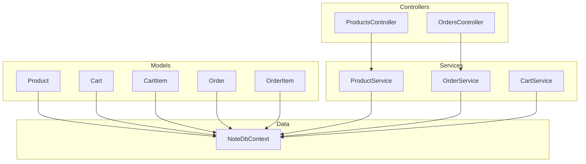
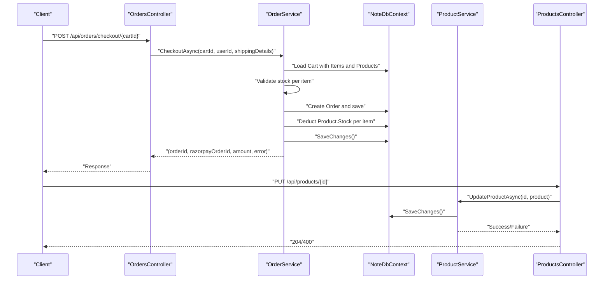
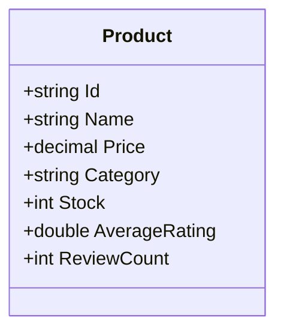
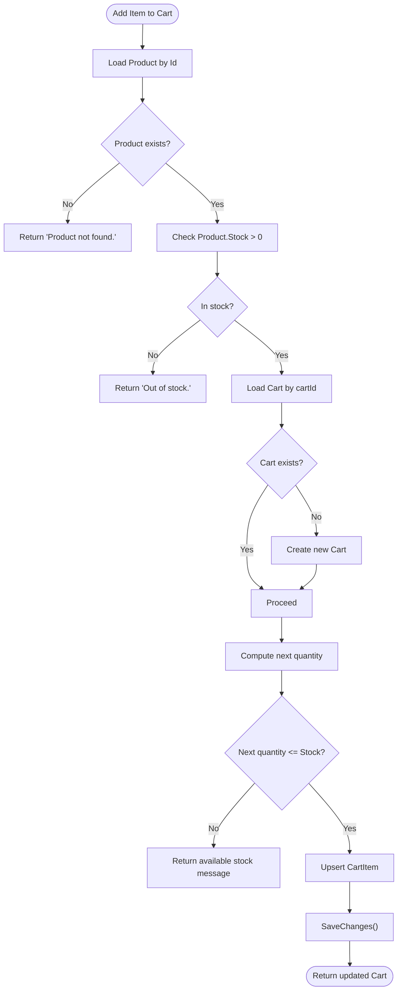
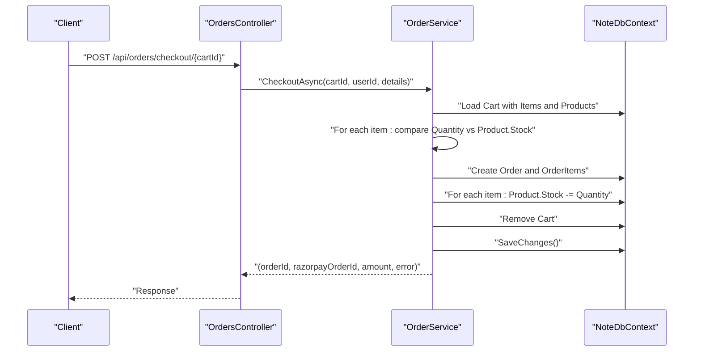
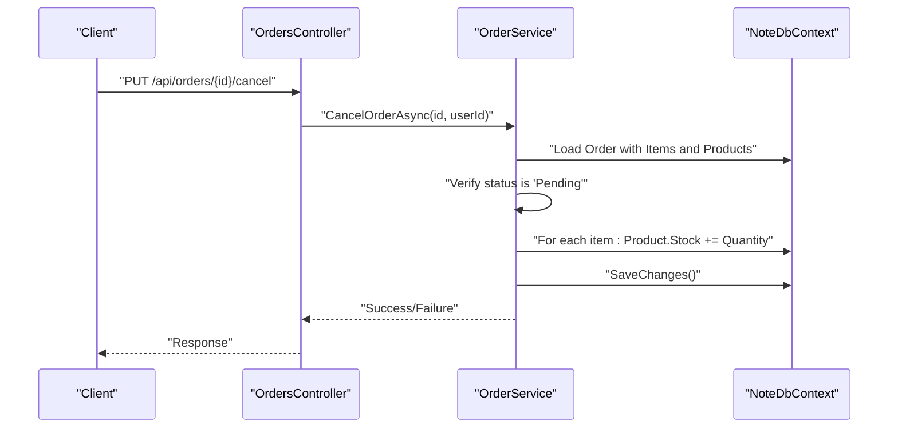
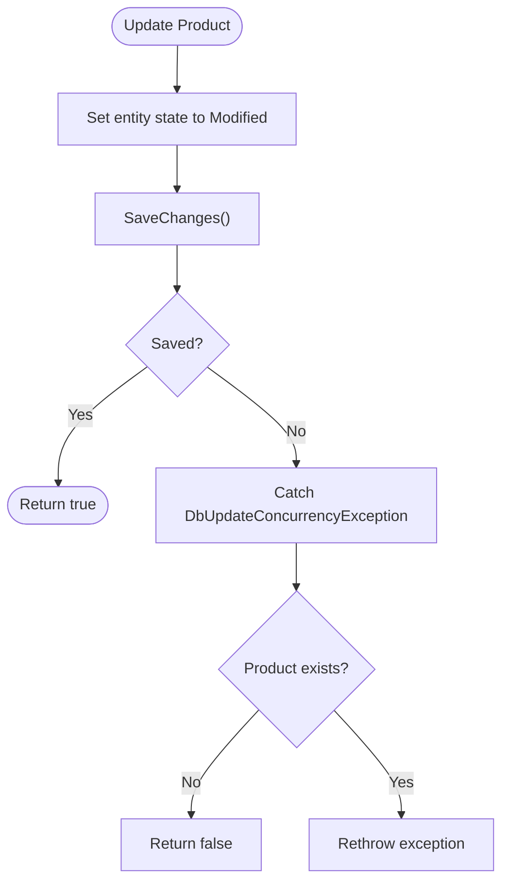
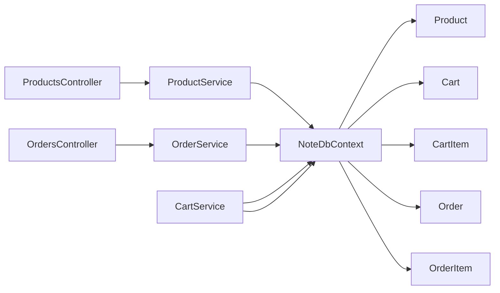

# Inventory Tracking

<cite>
**Referenced Files in This Document**
- [Product.cs](file://Models/Product.cs)
- [Order.cs](file://Models/Order.cs)
- [Cart.cs](file://Models/Cart.cs)
- [CartItem.cs](file://Models/CartItem.cs)
- [NoteDbContext.cs](file://Data/NoteDbContext.cs)
- [ProductsController.cs](file://Controllers/ProductsController.cs)
- [OrdersController.cs](file://Controllers/OrdersController.cs)
- [ProductsController.cs](file://Controllers/ProductsController.cs)
- [ProductService.cs](file://Services/ProductService.cs)
- [OrderService.cs](file://Services/OrderService.cs)
- [CartService.cs](file://Services/CartService.cs)
</cite>

## Table of Contents
1. [Introduction](#introduction)
2. [Project Structure](#project-structure)
3. [Core Components](#core-components)
4. [Architecture Overview](#architecture-overview)
5. [Detailed Component Analysis](#detailed-component-analysis)
6. [Dependency Analysis](#dependency-analysis)
7. [Performance Considerations](#performance-considerations)
8. [Troubleshooting Guide](#troubleshooting-guide)
9. [Conclusion](#conclusion)
10. [Appendices](#appendices)

## Introduction
This document describes the product inventory tracking system implemented in the backend. It focuses on stock level management, inventory updates during sales, low stock handling, and cancellation workflows. It also covers inventory validation during product updates, bulk operations, audit processes, adjustments, reconciliation, reporting, optimization strategies, reorder points, supplier integration patterns, performance considerations, concurrent access handling, and cross-channel consistency.

## Project Structure
The inventory system spans models, database context, services, and controllers:
- Models define the Product entity with a Stock property and related entities (Cart, CartItem, Order, OrderItem).
- Data context manages persistence and seeds initial product inventory.
- Services encapsulate business logic for checkout, cart operations, and product management.
- Controllers expose endpoints for clients and administrative tasks.

**Diagram sources**
- [Product.cs:1-21](file://Models/Product.cs#L1-L21)
- [Cart.cs:1-10](file://Models/Cart.cs#L1-L10)
- [CartItem.cs:1-12](file://Models/CartItem.cs#L1-L12)
- [Order.cs:1-62](file://Models/Order.cs#L1-L62)
- [NoteDbContext.cs:1-67](file://Data/NoteDbContext.cs#L1-L67)
- [ProductService.cs:1-95](file://Services/ProductService.cs#L1-L95)
- [OrderService.cs:1-270](file://Services/OrderService.cs#L1-L270)
- [CartService.cs:1-106](file://Services/CartService.cs#L1-L106)
- [ProductsController.cs:1-60](file://Controllers/ProductsController.cs#L1-L60)
- [OrdersController.cs:1-121](file://Controllers/OrdersController.cs#L1-L121)

**Section sources**
- [Product.cs:1-21](file://Models/Product.cs#L1-L21)
- [Order.cs:1-62](file://Models/Order.cs#L1-L62)
- [Cart.cs:1-10](file://Models/Cart.cs#L1-L10)
- [CartItem.cs:1-12](file://Models/CartItem.cs#L1-L12)
- [NoteDbContext.cs:1-67](file://Data/NoteDbContext.cs#L1-L67)
- [ProductService.cs:1-95](file://Services/ProductService.cs#L1-L95)
- [OrderService.cs:1-270](file://Services/OrderService.cs#L1-L270)
- [CartService.cs:1-106](file://Services/CartService.cs#L1-L106)
- [ProductsController.cs:1-60](file://Controllers/ProductsController.cs#L1-L60)
- [OrdersController.cs:1-121](file://Controllers/OrdersController.cs#L1-L121)

## Core Components
- Product: Holds product metadata and Stock level.
- Cart and CartItem: Temporary shopping basket with per-item quantities linked to Product.
- Order and OrderItem: Persistent purchase records capturing items and quantities at time of sale.
- NoteDbContext: Entity framework context with Products seeded and indices for uniqueness.
- ProductService: CRUD operations for products; includes concurrency handling via DbUpdateConcurrencyException.
- OrderService: Checkout validates stock availability, deducts stock upon successful order creation, and restores stock on cancellation.
- CartService: Validates stock before adding/updating items and prevents adding out-of-stock items.

Key inventory behaviors:
- Stock deduction occurs after payment authorization and before saving the order.
- Stock restoration occurs on cancellation of Pending orders.
- Low stock checks occur during add-to-cart and checkout.

**Section sources**
- [Product.cs:17-17](file://Models/Product.cs#L17-L17)
- [OrderService.cs:60-71](file://Services/OrderService.cs#L60-L71)
- [OrderService.cs:164-170](file://Services/OrderService.cs#L164-L170)
- [OrderService.cs:218-238](file://Services/OrderService.cs#L218-L238)
- [CartService.cs:33-73](file://Services/CartService.cs#L33-L73)
- [NoteDbContext.cs:49-59](file://Data/NoteDbContext.cs#L49-L59)
- [ProductService.cs:62-78](file://Services/ProductService.cs#L62-L78)

## Architecture Overview
The inventory system integrates with the storefront via controllers and services:
- ProductsController delegates product operations to ProductService.
- OrdersController orchestrates checkout via OrderService.
- CartService validates stock before modifying carts.
- OrderService enforces stock checks and updates inventory during checkout and cancellation.

**Diagram sources**
- [OrdersController.cs:31-51](file://Controllers/OrdersController.cs#L31-L51)
- [OrderService.cs:23-187](file://Services/OrderService.cs#L23-L187)
- [ProductsController.cs:42-49](file://Controllers/ProductsController.cs#L42-L49)
- [ProductService.cs:62-78](file://Services/ProductService.cs#L62-L78)

## Detailed Component Analysis

### Product Model and Stock Management
- Product defines Id, Name, Price, Category, Stock, Ratings, and other attributes.
- Stock is initialized to a default value during seeding.

**Diagram sources**
- [Product.cs:3-20](file://Models/Product.cs#L3-L20)

**Section sources**
- [Product.cs:17-17](file://Models/Product.cs#L17-L17)
- [NoteDbContext.cs:49-59](file://Data/NoteDbContext.cs#L49-L59)

### Cart and Add-to-Cart Validation
- CartService retrieves or creates a cart, validates product existence and stock, and enforces quantity limits.
- Prevents adding out-of-stock items and enforces per-item stock constraints.

**Diagram sources**
- [CartService.cs:33-73](file://Services/CartService.cs#L33-L73)

**Section sources**
- [CartService.cs:33-73](file://Services/CartService.cs#L33-L73)
- [CartItem.cs:1-12](file://Models/CartItem.cs#L1-L12)

### Checkout and Stock Deduction
- OrderService validates shipping details, loads the cart, and checks each item’s stock against Product.Stock.
- On success, it constructs an Order, calls the payment provider, and persists the order and deductions.
- Deductions are applied immediately before clearing the cart.

**Diagram sources**
- [OrdersController.cs:31-51](file://Controllers/OrdersController.cs#L31-L51)
- [OrderService.cs:23-187](file://Services/OrderService.cs#L23-L187)

**Section sources**
- [OrderService.cs:60-71](file://Services/OrderService.cs#L60-L71)
- [OrderService.cs:164-170](file://Services/OrderService.cs#L164-L170)

### Cancellation and Stock Restoration
- Only Pending orders can be cancelled.
- On cancellation, OrderService restores Product.Stock for each ordered item.

**Diagram sources**
- [OrdersController.cs:93-106](file://Controllers/OrdersController.cs#L93-L106)
- [OrderService.cs:218-238](file://Services/OrderService.cs#L218-L238)

**Section sources**
- [OrderService.cs:218-238](file://Services/OrderService.cs#L218-L238)

### Product Updates and Concurrency
- ProductService.UpdateProductAsync updates a Product and handles concurrency via DbUpdateConcurrencyException.
- If the record does not exist, it returns false; otherwise rethrows to surface the conflict.

**Diagram sources**
- [ProductService.cs:62-78](file://Services/ProductService.cs#L62-L78)

**Section sources**
- [ProductService.cs:62-78](file://Services/ProductService.cs#L62-L78)

### Inventory Validation During Product Updates
- ProductService.UpdateProductAsync sets the entity state to Modified and saves changes.
- Concurrency conflicts are handled centrally; no explicit stock validation is performed in this method.

**Section sources**
- [ProductService.cs:62-78](file://Services/ProductService.cs#L62-L78)

### Bulk Inventory Operations
- There is no dedicated bulk inventory endpoint in the current codebase.
- Stock adjustments are performed per-item during checkout and cancellation.

**Section sources**
- [OrderService.cs:164-170](file://Services/OrderService.cs#L164-L170)
- [OrderService.cs:228-234](file://Services/OrderService.cs#L228-L234)

### Inventory Audit Processes
- The codebase does not include a formal audit trail for inventory changes.
- Auditing could be implemented by logging stock deltas with timestamps and actor context.

**Section sources**
- [OrderService.cs:164-170](file://Services/OrderService.cs#L164-L170)
- [OrderService.cs:228-234](file://Services/OrderService.cs#L228-L234)

### Examples of Inventory Adjustment Workflows
- Checkout adjustment: For each ordered item, Product.Stock is decremented by the purchased quantity.
- Cancellation adjustment: For each ordered item, Product.Stock is incremented by the cancelled quantity.

**Section sources**
- [OrderService.cs:164-170](file://Services/OrderService.cs#L164-L170)
- [OrderService.cs:228-234](file://Services/OrderService.cs#L228-L234)

### Stock Reconciliation Procedures
- Reconciliation can be performed by comparing OrderItem quantities against Product.Stock across the persisted order history.
- The current code does not implement a reconciliation endpoint; this would require a report endpoint and order aggregation logic.

**Section sources**
- [Order.cs:35-46](file://Models/Order.cs#L35-L46)

### Inventory Reporting
- The codebase does not include a dedicated inventory report endpoint.
- Reporting can be derived from order history and product stock levels, but no specific endpoint is present.

**Section sources**
- [OrderService.cs:189-206](file://Services/OrderService.cs#L189-L206)

### Inventory Optimization Strategies
- Reorder Point Calculation: Maintain safety stock and lead time demand; trigger reorder when Stock <= (LeadTime × DemandRate) + SafetyStock.
- ABC Analysis: Classify SKUs by turnover and value to optimize allocation and service levels.
- Seasonal Adjustments: Increase safety stock for seasonal peaks.
- Supplier Integration Patterns: Integrate with supplier APIs to fetch lead times and update reorder parameters dynamically.

[No sources needed since this section provides general guidance]

### Supplier Integration Patterns
- Integrate supplier endpoints to fetch lead times, batch sizes, and pricing.
- Synchronize reorder parameters and forecast demand to reduce stockouts.

[No sources needed since this section provides general guidance]

## Dependency Analysis
- Controllers depend on services for business logic.
- Services depend on NoteDbContext for persistence.
- Models define the domain and relationships used by the context.

**Diagram sources**
- [ProductsController.cs:1-60](file://Controllers/ProductsController.cs#L1-L60)
- [OrdersController.cs:1-121](file://Controllers/OrdersController.cs#L1-L121)
- [ProductService.cs:1-95](file://Services/ProductService.cs#L1-L95)
- [OrderService.cs:1-270](file://Services/OrderService.cs#L1-L270)
- [CartService.cs:1-106](file://Services/CartService.cs#L1-L106)
- [NoteDbContext.cs:1-67](file://Data/NoteDbContext.cs#L1-L67)
- [Product.cs:1-21](file://Models/Product.cs#L1-L21)
- [Cart.cs:1-10](file://Models/Cart.cs#L1-L10)
- [CartItem.cs:1-12](file://Models/CartItem.cs#L1-L12)
- [Order.cs:1-62](file://Models/Order.cs#L1-L62)

**Section sources**
- [ProductsController.cs:1-60](file://Controllers/ProductsController.cs#L1-L60)
- [OrdersController.cs:1-121](file://Controllers/OrdersController.cs#L1-L121)
- [ProductService.cs:1-95](file://Services/ProductService.cs#L1-L95)
- [OrderService.cs:1-270](file://Services/OrderService.cs#L1-L270)
- [CartService.cs:1-106](file://Services/CartService.cs#L1-L106)
- [NoteDbContext.cs:1-67](file://Data/NoteDbContext.cs#L1-L67)

## Performance Considerations
- Concurrency: ProductService.UpdateProductAsync uses optimistic concurrency via DbUpdateConcurrencyException to avoid write conflicts.
- Asynchronous I/O: Services use async/await for database operations to improve throughput.
- Indexes: Unique composite indexes on WishlistItem and ProductReview reduce duplicate insert overhead.
- Stock checks: Early validation in CartService and OrderService prevents unnecessary writes.

**Section sources**
- [ProductService.cs:62-78](file://Services/ProductService.cs#L62-L78)
- [CartService.cs:33-73](file://Services/CartService.cs#L33-L73)
- [OrderService.cs:60-71](file://Services/OrderService.cs#L60-L71)
- [NoteDbContext.cs:41-47](file://Data/NoteDbContext.cs#L41-L47)

## Troubleshooting Guide
Common issues and resolutions:
- Out-of-stock errors during add-to-cart or checkout: Ensure client displays remaining stock and prevents selection exceeding Product.Stock.
- Payment initialization failures: Verify payment gateway credentials and amount thresholds before invoking checkout.
- Concurrency update failures: Retry or inform the user to refresh and retry the operation.
- Cancellation restrictions: Only Pending orders can be cancelled; verify order status before attempting cancellation.

**Section sources**
- [CartService.cs:38-39](file://Services/CartService.cs#L38-L39)
- [CartService.cs:53-56](file://Services/CartService.cs#L53-L56)
- [OrderService.cs:67-71](file://Services/OrderService.cs#L67-L71)
- [OrderService.cs:225-226](file://Services/OrderService.cs#L225-L226)
- [OrderService.cs:124-133](file://Services/OrderService.cs#L124-L133)

## Conclusion
The inventory system currently supports essential stock validation, deduction during checkout, and restoration on cancellation. It leverages optimistic concurrency for product updates and maintains early validation in cart and checkout flows. To enhance the system, consider adding a dedicated inventory audit log, reconciliation and reporting endpoints, bulk operations, and supplier integration for dynamic reorder parameters.

## Appendices

### Inventory Adjustment Workflow (Checkout)
- Validate shipping details and cart contents.
- For each item, compare requested quantity to Product.Stock.
- Create Order and persist.
- Deduct Product.Stock per item.
- Clear the cart.
- Save changes.

**Section sources**
- [OrderService.cs:23-187](file://Services/OrderService.cs#L23-L187)

### Inventory Adjustment Workflow (Cancellation)
- Load order and verify status is Pending.
- For each item, increment Product.Stock by the ordered quantity.
- Save changes.

**Section sources**
- [OrderService.cs:218-238](file://Services/OrderService.cs#L218-L238)

### Low Stock Handling
- Add-to-cart prevents adding out-of-stock items.
- Checkout rejects orders where requested quantity exceeds Product.Stock.

**Section sources**
- [CartService.cs:38-39](file://Services/CartService.cs#L38-L39)
- [CartService.cs:53-56](file://Services/CartService.cs#L53-L56)
- [OrderService.cs:67-71](file://Services/OrderService.cs#L67-L71)