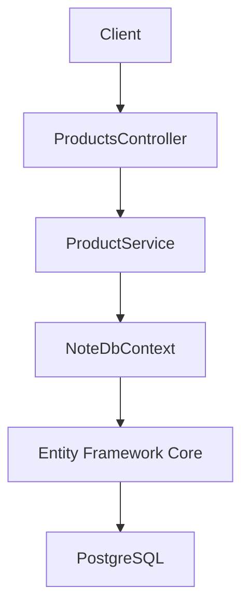
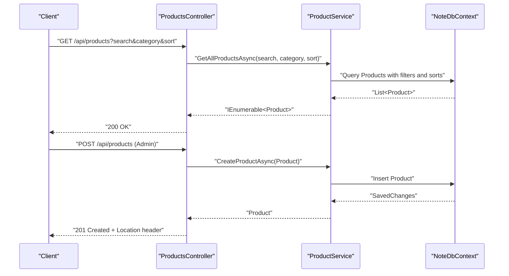
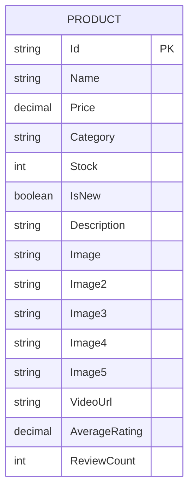
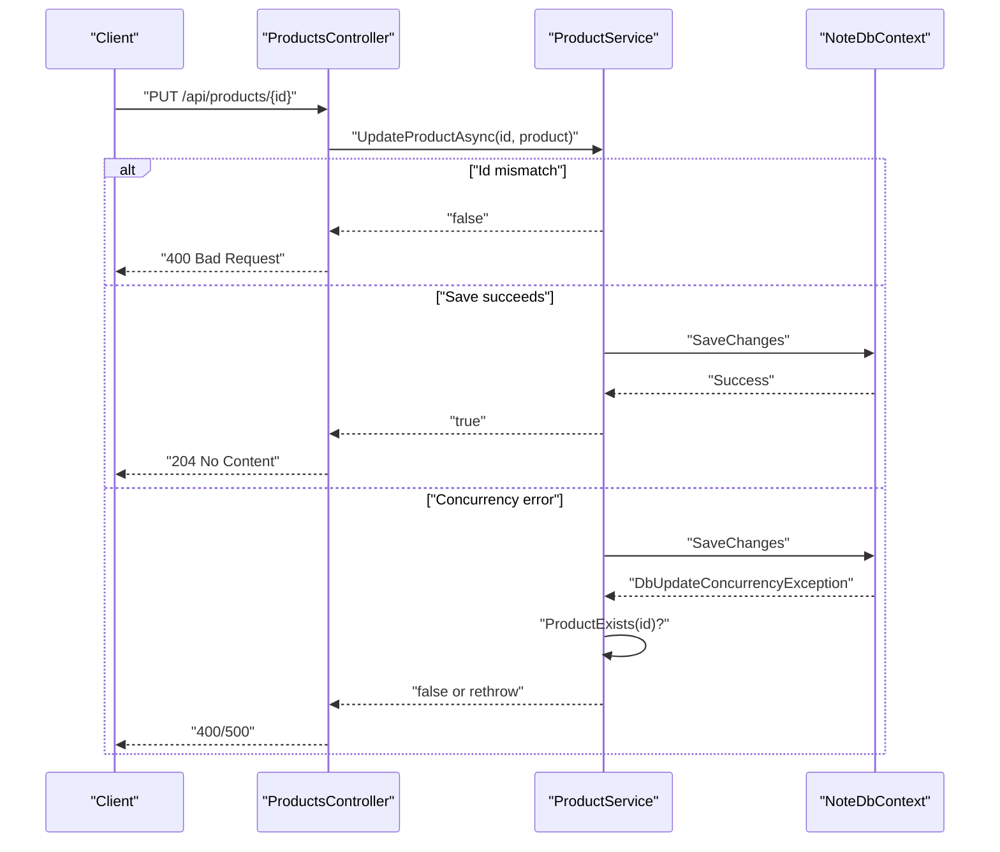
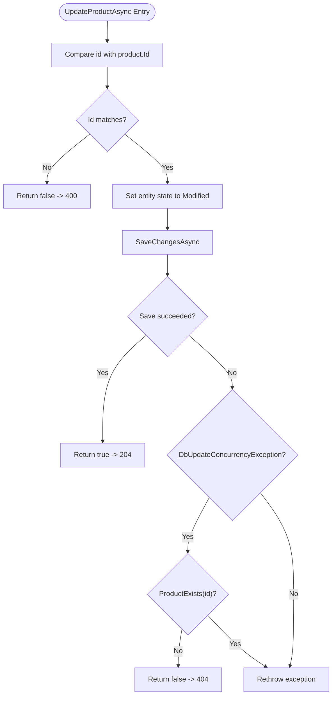
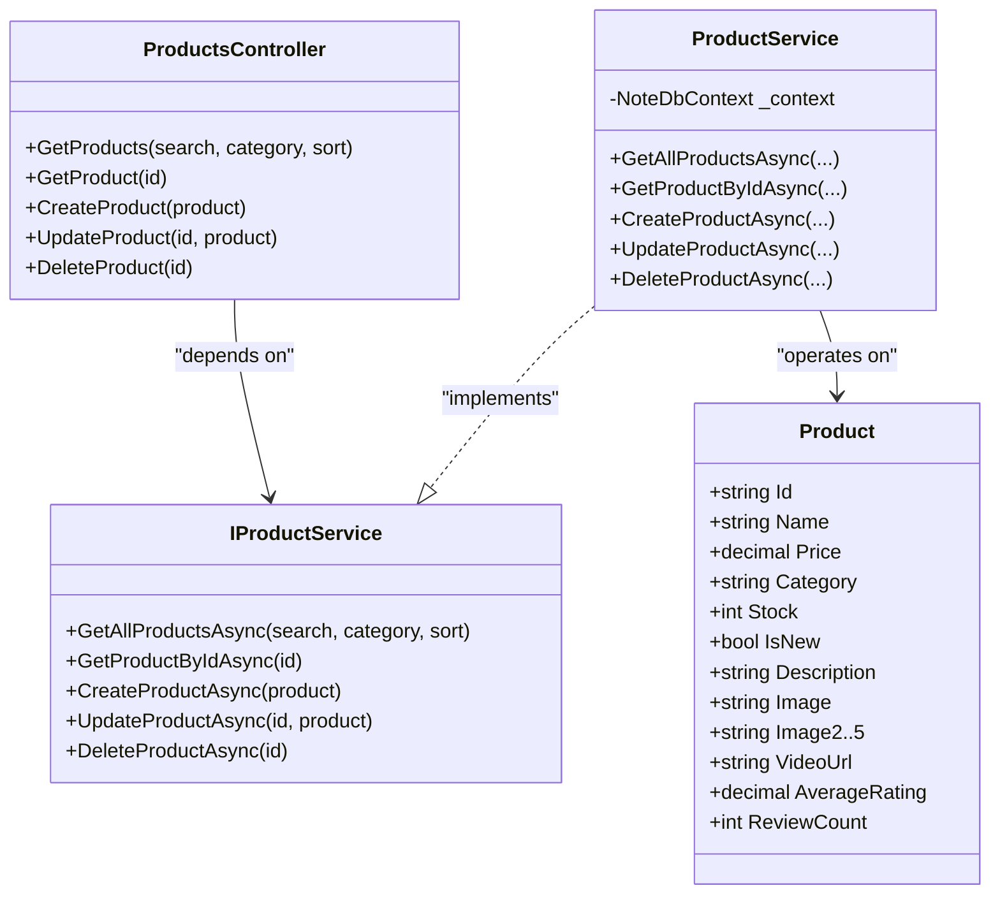

# Product CRUD Operations

<cite>
**Referenced Files in This Document**
- [ProductsController.cs](file://Controllers/ProductsController.cs)
- [ProductService.cs](file://Services/ProductService.cs)
- [IProductService.cs](file://Services/IProductService.cs)
- [Product.cs](file://Models/Product.cs)
- [NoteDbContext.cs](file://Data/NoteDbContext.cs)
- [Program.cs](file://Program.cs)
- [20260427184435_InitialCreate.Designer.cs](file://Migrations/20260427184435_InitialCreate.Designer.cs)
- [ReviewsController.cs](file://Controllers/ReviewsController.cs)
- [CartService.cs](file://Services/CartService.cs)
</cite>

## Table of Contents
1. [Introduction](#introduction)
2. [Project Structure](#project-structure)
3. [Core Components](#core-components)
4. [Architecture Overview](#architecture-overview)
5. [Detailed Component Analysis](#detailed-component-analysis)
6. [Dependency Analysis](#dependency-analysis)
7. [Performance Considerations](#performance-considerations)
8. [Troubleshooting Guide](#troubleshooting-guide)
9. [Conclusion](#conclusion)

## Introduction
This document explains the complete product Create, Read, Update, and Delete (CRUD) lifecycle in the Note.Backend system. It covers HTTP endpoints, request/response schemas, authorization requirements, business logic, validation rules, and error handling. It also details product uniqueness constraints, image associations, inventory validation during operations, and soft deletion strategies.

## Project Structure
The product CRUD functionality spans the controller, service, data model, and persistence layer:
- Controller: ProductsController exposes REST endpoints for product operations.
- Service: ProductService encapsulates business logic and interacts with the database via Entity Framework.
- Model: Product defines the shape of product records stored in the database.
- Persistence: NoteDbContext manages the Products entity and seed data.
- Authorization: JWT authentication and role-based authorization are configured in Program.cs.

**Diagram sources**
- [ProductsController.cs:10-59](file://Controllers/ProductsController.cs#L10-L59)
- [ProductService.cs:7-94](file://Services/ProductService.cs#L7-L94)
- [NoteDbContext.cs:7-67](file://Data/NoteDbContext.cs#L7-L67)
- [Program.cs:62-84](file://Program.cs#L62-L84)

**Section sources**
- [ProductsController.cs:10-59](file://Controllers/ProductsController.cs#L10-L59)
- [ProductService.cs:7-94](file://Services/ProductService.cs#L7-L94)
- [Product.cs:3-20](file://Models/Product.cs#L3-L20)
- [NoteDbContext.cs:11-21](file://Data/NoteDbContext.cs#L11-L21)
- [Program.cs:62-84](file://Program.cs#L62-L84)

## Core Components
- ProductsController: Exposes GET /api/products, GET /api/products/{id}, POST /api/products, PUT /api/products/{id}, and DELETE /api/products/{id}. Admin authorization is enforced for create, update, and delete.
- ProductService: Implements GetAllProductsAsync, GetProductByIdAsync, CreateProductAsync, UpdateProductAsync, and DeleteProductAsync. Includes filtering, sorting, concurrency handling, and existence checks.
- Product model: Defines fields such as Id, Name, Price, Category, Stock, Images, VideoUrl, IsNew, Description, AverageRating, and ReviewCount.
- NoteDbContext: Declares Products DbSet and seeds initial product data. Migration snapshots show Name, Price, Stock, and other columns are mapped.

HTTP endpoints and roles:
- GET /api/products: Public search and filter by category/sort.
- GET /api/products/{id}: Public retrieval by ID.
- POST /api/products: Admin-only creation.
- PUT /api/products/{id}: Admin-only update.
- DELETE /api/products/{id}: Admin-only deletion.

Authorization and JWT:
- Authentication scheme is JWT bearer with symmetric key validation.
- Admin-only endpoints require the Admin role.

**Section sources**
- [ProductsController.cs:19-58](file://Controllers/ProductsController.cs#L19-L58)
- [ProductService.cs:16-93](file://Services/ProductService.cs#L16-L93)
- [Product.cs:5-19](file://Models/Product.cs#L5-L19)
- [NoteDbContext.cs:49-59](file://Data/NoteDbContext.cs#L49-L59)
- [Program.cs:69-84](file://Program.cs#L69-L84)

## Architecture Overview
The product CRUD flow follows a clean architecture pattern: controllers handle HTTP, services encapsulate business logic, and the database context persists data.

**Diagram sources**
- [ProductsController.cs:19-40](file://Controllers/ProductsController.cs#L19-L40)
- [ProductService.cs:16-60](file://Services/ProductService.cs#L16-L60)
- [NoteDbContext.cs:11](file://Data/NoteDbContext.cs#L11)

## Detailed Component Analysis

### Product Model and Constraints
- Fields: Id, Name, Price, Category, Stock, IsNew, Description, Image, Image2–Image5, VideoUrl, AverageRating, ReviewCount.
- Defaults: Stock defaults to 25; AverageRating and ReviewCount initialized to 0 on creation.
- Uniqueness constraints: Product.Id is the primary key; migrations enforce Name as required and define columns for images and numeric fields.

**Diagram sources**
- [Product.cs:5-19](file://Models/Product.cs#L5-L19)
- [20260427184435_InitialCreate.Designer.cs:275-286](file://Migrations/20260427184435_InitialCreate.Designer.cs#L275-L286)

**Section sources**
- [Product.cs:5-19](file://Models/Product.cs#L5-L19)
- [20260427184435_InitialCreate.Designer.cs:275-286](file://Migrations/20260427184435_InitialCreate.Designer.cs#L275-L286)

### Controller Methods and Authorization
- GET /api/products: Filters by search term (Name, Category, Description), category, and sort options (price-asc, price-desc, name, rating, newest).
- GET /api/products/{id}: Returns a single product by Id; 404 if not found.
- POST /api/products: Admin-only endpoint that creates a new product and returns 201 with Location header.
- PUT /api/products/{id}: Admin-only update; returns 400 if Id mismatch or concurrency conflict; otherwise 204.
- DELETE /api/products/{id}: Admin-only deletion; returns 404 if not found, else 204.

**Diagram sources**
- [ProductsController.cs:42-49](file://Controllers/ProductsController.cs#L42-L49)
- [ProductService.cs:62-78](file://Services/ProductService.cs#L62-L78)

**Section sources**
- [ProductsController.cs:19-58](file://Controllers/ProductsController.cs#L19-L58)
- [ProductService.cs:62-78](file://Services/ProductService.cs#L62-L78)

### Business Logic Implementation
- Filtering and Sorting: Search normalization trims and lowercases; category filter excludes "All"; sort supports price/name/rating/newest.
- Creation: Generates a new Id, initializes AverageRating and ReviewCount, adds to context, saves, and returns the created product.
- Update: Validates Id matches; marks entity modified; handles concurrency exceptions and existence checks.
- Deletion: Finds product, removes it, saves changes, returns success if found.

**Diagram sources**
- [ProductService.cs:62-78](file://Services/ProductService.cs#L62-L78)

**Section sources**
- [ProductService.cs:16-45](file://Services/ProductService.cs#L16-L45)
- [ProductService.cs:52-60](file://Services/ProductService.cs#L52-L60)
- [ProductService.cs:62-88](file://Services/ProductService.cs#L62-L88)

### Data Validation Rules
- Name is required (as per migration snapshot).
- Price is numeric; Stock is integer with default 25.
- Category is text; IsNew is boolean; Description is optional.
- Image fields support up to five images plus an optional video URL.
- Inventory validation during related operations:
  - ReviewsController updates AverageRating and ReviewCount after a review is submitted.
  - CartService prevents adding out-of-stock items and validates product availability.

Note: The Product model itself does not declare data annotations. Validation is enforced by:
- Database constraints (required fields, numeric types).
- Runtime checks in related services (e.g., stock availability).

**Section sources**
- [20260427184435_InitialCreate.Designer.cs:275-286](file://Migrations/20260427184435_InitialCreate.Designer.cs#L275-L286)
- [ReviewsController.cs:73-86](file://Controllers/ReviewsController.cs#L73-L86)
- [CartService.cs:33-49](file://Services/CartService.cs#L33-L49)

### Soft Deletion Strategy
- The current implementation deletes products from the database on DELETE requests. There is no soft-delete flag present in the Product model or migrations.
- Recommendation: Introduce a DeletedAt or IsActive flag on Product to enable soft deletion. This would require:
  - Adding the property to Product.cs and migrations.
  - Updating ProductService.DeleteProductAsync to mark as deleted instead of removing.
  - Adjusting GetAllProductsAsync and GetProductByIdAsync to exclude deleted items by default.

**Section sources**
- [ProductService.cs:80-88](file://Services/ProductService.cs#L80-L88)
- [Product.cs:5-19](file://Models/Product.cs#L5-L19)

### Practical Examples

- Create a product (Admin):
  - Endpoint: POST /api/products
  - Authorization: Admin role required.
  - Request body: Product object (Id omitted; server generates).
  - Response: 201 Created with Location header pointing to GET /api/products/{id}.
  - Example path: [ProductsController.cs:34-40](file://Controllers/ProductsController.cs#L34-L40), [ProductService.cs:52-60](file://Services/ProductService.cs#L52-L60)

- Retrieve a product by ID:
  - Endpoint: GET /api/products/{id}
  - Response: 200 OK with Product; 404 Not Found if absent.
  - Example path: [ProductsController.cs:26-32](file://Controllers/ProductsController.cs#L26-L32), [ProductService.cs:47-50](file://Services/ProductService.cs#L47-L50)

- Bulk retrieval with filters and sorting:
  - Endpoint: GET /api/products?search={term}&category={cat}&sort={price-asc|price-desc|name|rating|newest}
  - Response: 200 OK with array of Product.
  - Example path: [ProductsController.cs:19-24](file://Controllers/ProductsController.cs#L19-L24), [ProductService.cs:16-45](file://Services/ProductService.cs#L16-L45)

- Update a product (Admin):
  - Endpoint: PUT /api/products/{id}
  - Authorization: Admin role required.
  - Request body: Product object with matching Id.
  - Responses: 204 No Content on success; 400 Bad Request on mismatch or concurrency errors.
  - Example path: [ProductsController.cs:42-49](file://Controllers/ProductsController.cs#L42-L49), [ProductService.cs:62-78](file://Services/ProductService.cs#L62-L78)

- Delete a product (Admin):
  - Endpoint: DELETE /api/products/{id}
  - Authorization: Admin role required.
  - Responses: 204 No Content on success; 404 Not Found if absent.
  - Example path: [ProductsController.cs:51-58](file://Controllers/ProductsController.cs#L51-L58), [ProductService.cs:80-88](file://Services/ProductService.cs#L80-L88)

- Image association:
  - Product supports Image, Image2–Image5, and VideoUrl fields.
  - Example path: [Product.cs:8-13](file://Models/Product.cs#L8-L13)

- Inventory validation during related operations:
  - Reviews update AverageRating and ReviewCount.
  - CartService prevents adding out-of-stock items.
  - Example paths: [ReviewsController.cs:73-86](file://Controllers/ReviewsController.cs#L73-L86), [CartService.cs:33-49](file://Services/CartService.cs#L33-L49)

**Section sources**
- [ProductsController.cs:19-58](file://Controllers/ProductsController.cs#L19-L58)
- [ProductService.cs:16-88](file://Services/ProductService.cs#L16-L88)
- [Product.cs:8-19](file://Models/Product.cs#L8-L19)
- [ReviewsController.cs:73-86](file://Controllers/ReviewsController.cs#L73-L86)
- [CartService.cs:33-49](file://Services/CartService.cs#L33-L49)

## Dependency Analysis
- ProductsController depends on IProductService.
- ProductService depends on NoteDbContext and operates on Products DbSet.
- Program.cs configures JWT authentication and authorization policies.
- Migrations define database schema and constraints for Product.

**Diagram sources**
- [ProductsController.cs:10-59](file://Controllers/ProductsController.cs#L10-L59)
- [IProductService.cs:5-12](file://Services/IProductService.cs#L5-L12)
- [ProductService.cs:7-94](file://Services/ProductService.cs#L7-L94)
- [Product.cs:3-20](file://Models/Product.cs#L3-L20)

**Section sources**
- [ProductsController.cs:10-17](file://Controllers/ProductsController.cs#L10-L17)
- [IProductService.cs:5-12](file://Services/IProductService.cs#L5-L12)
- [ProductService.cs:9-14](file://Services/ProductService.cs#L9-L14)
- [Product.cs:5-19](file://Models/Product.cs#L5-L19)

## Performance Considerations
- AsNoTracking queries in GetAllProductsAsync reduce change tracking overhead for read-heavy scenarios.
- Sorting and filtering are applied server-side; consider indexing Name, Category, and composite indexes for frequent queries.
- Minimize payload size by avoiding unnecessary fields in projections where appropriate.

**Section sources**
- [ProductService.cs:18](file://Services/ProductService.cs#L18)
- [20260427184435_InitialCreate.Designer.cs:275-286](file://Migrations/20260427184435_InitialCreate.Designer.cs#L275-L286)

## Troubleshooting Guide
- 401 Unauthorized: Missing or invalid JWT token; ensure Authorization header with Bearer token is sent.
- 403 Forbidden: Admin role required; verify the token belongs to an Admin user.
- 404 Not Found: Product not found by Id; verify the Id exists.
- 400 Bad Request: Id mismatch in update; or concurrency conflict; retry or refresh entity.
- 500 Internal Server Error: Unexpected database or runtime errors; check logs and retry.

Relevant implementation paths:
- Authorization and JWT setup: [Program.cs:69-84](file://Program.cs#L69-L84)
- Admin-only endpoints: [ProductsController.cs:34-58](file://Controllers/ProductsController.cs#L34-L58)
- Concurrency handling: [ProductService.cs:73-77](file://Services/ProductService.cs#L73-L77)

**Section sources**
- [Program.cs:69-84](file://Program.cs#L69-L84)
- [ProductsController.cs:34-58](file://Controllers/ProductsController.cs#L34-L58)
- [ProductService.cs:73-77](file://Services/ProductService.cs#L73-L77)

## Conclusion
The product CRUD implementation provides a clear separation of concerns with explicit admin-only write operations, robust filtering and sorting, and straightforward validation via database constraints. To enhance maintainability and operational safety, consider adopting soft deletion and enriching validation rules with model annotations or service-level validators. The current design supports efficient reads and admin-driven product management with minimal coupling and strong authorization enforcement.