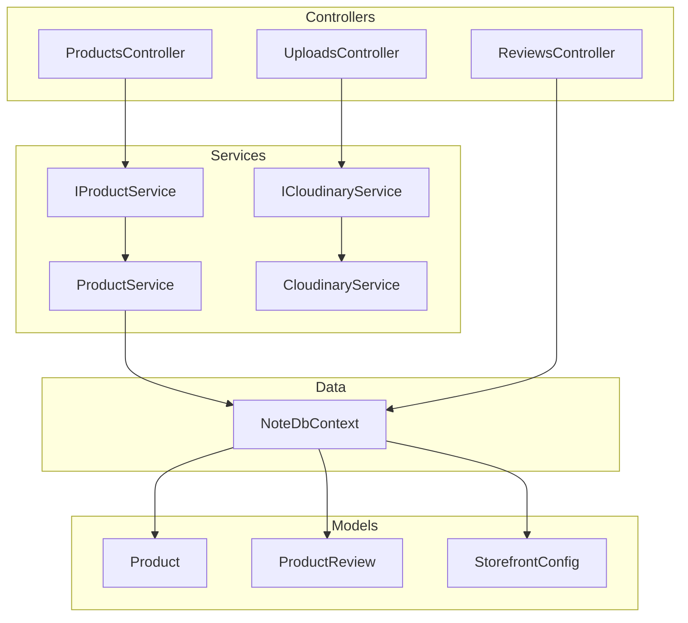
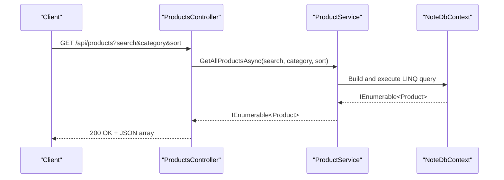
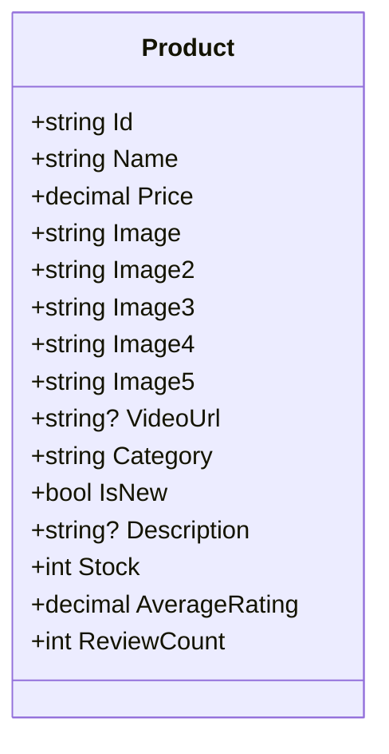
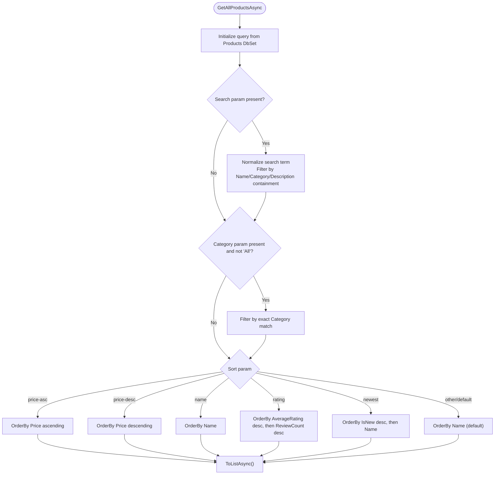
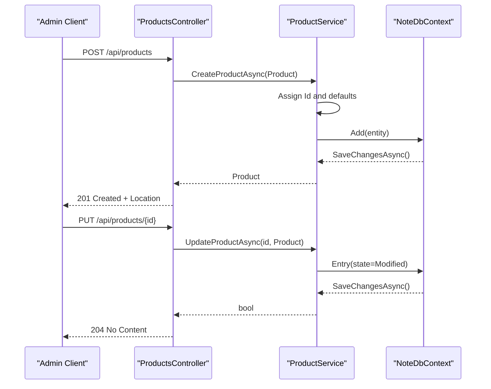
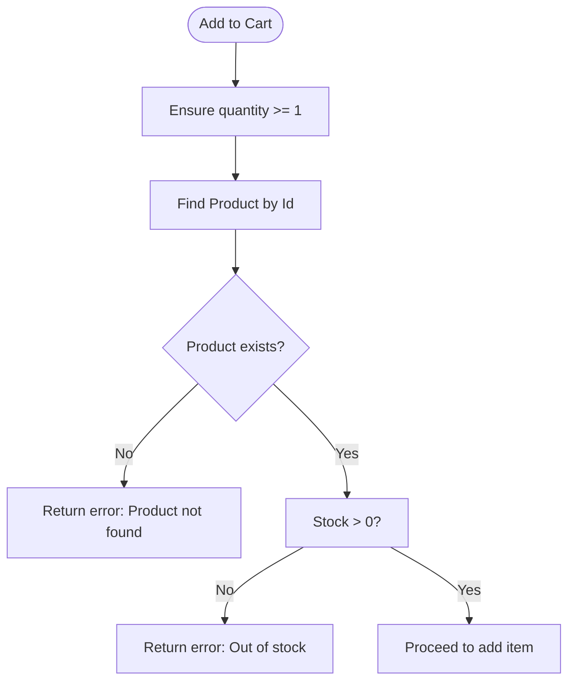
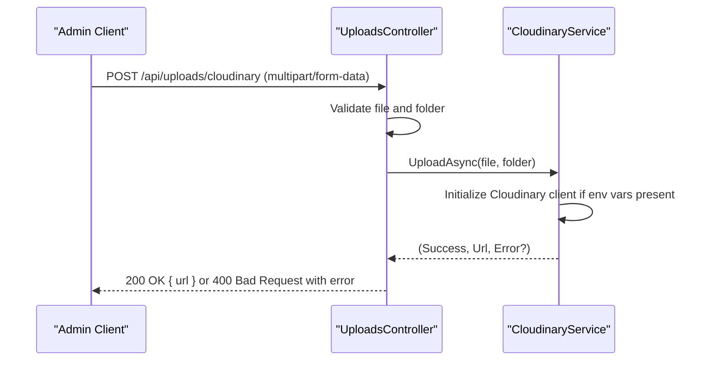
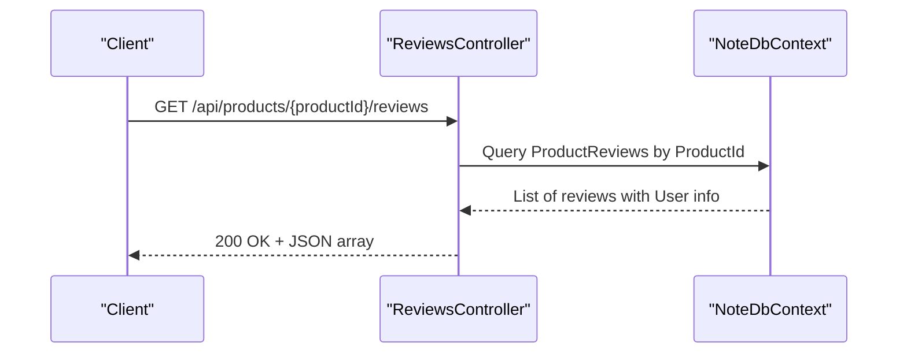
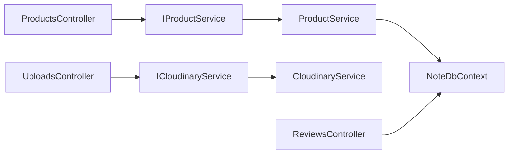

# Product Management System

<cite>
**Referenced Files in This Document**
- [ProductsController.cs](file://Controllers/ProductsController.cs)
- [ProductService.cs](file://Services/ProductService.cs)
- [IProductService.cs](file://Services/IProductService.cs)
- [Product.cs](file://Models/Product.cs)
- [NoteDbContext.cs](file://Data/NoteDbContext.cs)
- [Program.cs](file://Program.cs)
- [UploadsController.cs](file://Controllers/UploadsController.cs)
- [CloudinaryService.cs](file://Services/CloudinaryService.cs)
- [ICloudinaryService.cs](file://Services/ICloudinaryService.cs)
- [ProductReview.cs](file://Models/ProductReview.cs)
- [ReviewsController.cs](file://Controllers/ReviewsController.cs)
- [StorefrontConfig.cs](file://Models/StorefrontConfig.cs)
- [CartService.cs](file://Services/CartService.cs)
- [OrderService.cs](file://Services/OrderService.cs)
- [appsettings.json](file://appsettings.json)
</cite>

## Table of Contents
1. [Introduction](#introduction)
2. [Project Structure](#project-structure)
3. [Core Components](#core-components)
4. [Architecture Overview](#architecture-overview)
5. [Detailed Component Analysis](#detailed-component-analysis)
6. [Dependency Analysis](#dependency-analysis)
7. [Performance Considerations](#performance-considerations)
8. [Troubleshooting Guide](#troubleshooting-guide)
9. [Conclusion](#conclusion)
10. [Appendices](#appendices)

## Introduction
This document provides comprehensive product management documentation for the Note.Backend e-commerce platform. It covers product CRUD operations, search and filtering, category management, inventory tracking, media handling via Cloudinary, and the underlying business logic. It also outlines endpoint definitions, request/response considerations, validation rules, performance optimization strategies, and analytics integration points.

## Project Structure
The product management system is organized around a clean separation of concerns:
- Controllers handle HTTP requests and responses for product operations and media uploads.
- Services encapsulate business logic and data access.
- Models define the product domain entities.
- Data context manages persistence and seeding.
- Program configures DI, middleware, and database initialization.

**Diagram sources**
- [ProductsController.cs:10-59](file://Controllers/ProductsController.cs#L10-L59)
- [UploadsController.cs:10-79](file://Controllers/UploadsController.cs#L10-L79)
- [ReviewsController.cs:12-39](file://Controllers/ReviewsController.cs#L12-L39)
- [IProductService.cs:5-12](file://Services/IProductService.cs#L5-L12)
- [ProductService.cs:7-94](file://Services/ProductService.cs#L7-L94)
- [ICloudinaryService.cs:3-6](file://Services/ICloudinaryService.cs#L3-L6)
- [CloudinaryService.cs:7-103](file://Services/CloudinaryService.cs#L7-L103)
- [Product.cs:3-20](file://Models/Product.cs#L3-L20)
- [ProductReview.cs:3-13](file://Models/ProductReview.cs#L3-L13)
- [StorefrontConfig.cs:3-22](file://Models/StorefrontConfig.cs#L3-L22)
- [NoteDbContext.cs:7-66](file://Data/NoteDbContext.cs#L7-L66)

**Section sources**
- [Program.cs:61-67](file://Program.cs#L61-L67)
- [NoteDbContext.cs:11-21](file://Data/NoteDbContext.cs#L11-L21)

## Core Components
- Product entity: Defines product attributes including identifiers, pricing, media, category, inventory, ratings, and review counts.
- Product service: Implements search, filtering, sorting, CRUD operations, and concurrency handling.
- Product controller: Exposes REST endpoints for listing, retrieving, creating, updating, and deleting products.
- Media upload service: Integrates Cloudinary for image and video uploads.
- Upload controller: Provides admin-only media upload endpoint with configurable folders and size limits.
- Reviews integration: Product reviews influence rating metrics and are surfaced via dedicated endpoints.

**Section sources**
- [Product.cs:3-20](file://Models/Product.cs#L3-L20)
- [IProductService.cs:5-12](file://Services/IProductService.cs#L5-L12)
- [ProductService.cs:7-94](file://Services/ProductService.cs#L7-L94)
- [ProductsController.cs:10-59](file://Controllers/ProductsController.cs#L10-L59)
- [ICloudinaryService.cs:3-6](file://Services/ICloudinaryService.cs#L3-L6)
- [CloudinaryService.cs:7-103](file://Services/CloudinaryService.cs#L7-L103)
- [UploadsController.cs:10-79](file://Controllers/UploadsController.cs#L10-L79)
- [ProductReview.cs:3-13](file://Models/ProductReview.cs#L3-L13)

## Architecture Overview
The system follows a layered architecture:
- Presentation layer: ASP.NET Core controllers.
- Application layer: Services implementing business logic.
- Persistence layer: Entity Framework Core with PostgreSQL.
- External integrations: Cloudinary for media storage.

**Diagram sources**
- [ProductsController.cs:19-24](file://Controllers/ProductsController.cs#L19-L24)
- [ProductService.cs:16-45](file://Services/ProductService.cs#L16-L45)
- [NoteDbContext.cs](file://Data/NoteDbContext.cs#L11)

## Detailed Component Analysis

### Product Entity Model
The Product model defines the canonical representation of items in the catalog, including:
- Identity: Id, Name
- Pricing: Price
- Media: Primary image and up to four additional images, plus optional video URL
- Organization: Category, IsNew flag
- Details: Description
- Inventory: Stock with default value
- Analytics: AverageRating and ReviewCount

**Diagram sources**
- [Product.cs:3-20](file://Models/Product.cs#L3-L20)

**Section sources**
- [Product.cs:3-20](file://Models/Product.cs#L3-L20)

### Product Service Implementation
Responsibilities:
- Search: Full-text-like containment across name, category, and description.
- Filter: Exact match by category (excluding a sentinel "All").
- Sort: price-asc, price-desc, name, rating (average rating descending, then review count), newest (IsNew desc, then name), default name asc.
- CRUD: Create sets Id and default rating fields, update handles concurrency, delete removes by Id.
- Data access: Uses AsNoTracking for reads and EF Core with PostgreSQL.

**Diagram sources**
- [ProductService.cs:16-45](file://Services/ProductService.cs#L16-L45)

**Section sources**
- [ProductService.cs:16-45](file://Services/ProductService.cs#L16-L45)

### Product Controller Endpoints
- GET /api/products
  - Query params: search (string), category (string), sort (string)
  - Returns: 200 OK with array of Product
- GET /api/products/{id}
  - Path param: id (string)
  - Returns: 200 OK with Product or 404 Not Found
- POST /api/products (Admin only)
  - Body: Product
  - Returns: 201 Created with Location header and Product
- PUT /api/products/{id} (Admin only)
  - Path param: id (string)
  - Body: Product
  - Returns: 204 No Content or 400 Bad Request
- DELETE /api/products/{id} (Admin only)
  - Path param: id (string)
  - Returns: 204 No Content or 404 Not Found

Response schemas:
- Product: see Product model definition
- Error responses: HTTP status codes indicate outcomes (404 for not found, 400 for bad input/concurrency failure)

**Section sources**
- [ProductsController.cs:19-59](file://Controllers/ProductsController.cs#L19-L59)

### Product CRUD Operations
- Create
  - Service assigns a new Id and initializes rating fields before persisting.
  - Controller returns 201 with Location header pointing to the created resource.
- Update
  - Service validates identity match and applies EntityState.Modified; handles concurrency exceptions by checking existence.
  - Controller returns 204 on success or 400 on failure.
- Delete
  - Service removes by Id and saves changes; returns false if not found.
  - Controller returns 204 on success or 404 if not found.

**Diagram sources**
- [ProductsController.cs:34-49](file://Controllers/ProductsController.cs#L34-L49)
- [ProductService.cs:52-78](file://Services/ProductService.cs#L52-L78)
- [NoteDbContext.cs](file://Data/NoteDbContext.cs#L11)

**Section sources**
- [ProductsController.cs:34-59](file://Controllers/ProductsController.cs#L34-L59)
- [ProductService.cs:52-88](file://Services/ProductService.cs#L52-L88)

### Search, Filtering, and Sorting
- Search: Case-insensitive containment checks on Name, Category, and Description (when present).
- Filter: Exact category match; "All" is treated as no filter.
- Sort: Supports price-asc, price-desc, name, rating, newest; defaults to name.

Practical examples:
- List with search: GET /api/products?search=journal
- Filter by category: GET /api/products?category=Journals
- Sort by price descending: GET /api/products?sort=price-desc
- Combined: GET /api/products?search=planner&category=Planners&sort=rating

**Section sources**
- [ProductService.cs:16-45](file://Services/ProductService.cs#L16-L45)

### Inventory Tracking
- Stock field is part of Product with a default value.
- Cart and order services reference product stock during operations:
  - Cart addition validates product existence and stock availability.
  - Order placement validates per-item stock against requested quantities.

**Diagram sources**
- [CartService.cs:33-49](file://Services/CartService.cs#L33-L49)

**Section sources**
- [Product.cs](file://Models/Product.cs#L17)
- [CartService.cs:33-49](file://Services/CartService.cs#L33-L49)
- [OrderService.cs:60-71](file://Services/OrderService.cs#L60-L71)

### Product Image Handling and Media Management
- Product supports multiple images and an optional video URL.
- Cloudinary integration:
  - Uploads support both images and videos.
  - Upload controller accepts multipart/form-data, validates configuration, and returns secure URLs.
  - Supported content types detected by MIME prefix.
- Configuration:
  - Environment variables for Cloudinary credentials are read by the service.
  - Upload controller logs and validates presence of required configuration.

**Diagram sources**
- [UploadsController.cs:23-78](file://Controllers/UploadsController.cs#L23-L78)
- [CloudinaryService.cs:40-102](file://Services/CloudinaryService.cs#L40-L102)

**Section sources**
- [Product.cs:8-13](file://Models/Product.cs#L8-L13)
- [ICloudinaryService.cs:3-6](file://Services/ICloudinaryService.cs#L3-L6)
- [CloudinaryService.cs:7-103](file://Services/CloudinaryService.cs#L7-L103)
- [UploadsController.cs:10-79](file://Controllers/UploadsController.cs#L10-L79)
- [appsettings.json:9-13](file://appsettings.json#L9-L13)

### Product Validation Rules
- Identity integrity: Update requires matching Id between path and body.
- Concurrency safety: Update catches concurrency conflicts and verifies entity existence.
- Rating range: Reviews enforce a 1–5 rating scale.
- Stock constraints: Cart and order logic prevent adding out-of-stock items and enforce per-item stock limits.

**Section sources**
- [ProductService.cs:62-78](file://Services/ProductService.cs#L62-L78)
- [ReviewsController.cs:48-51](file://Controllers/ReviewsController.cs#L48-L51)
- [CartService.cs:37-49](file://Services/CartService.cs#L37-L49)
- [OrderService.cs:67-71](file://Services/OrderService.cs#L67-L71)

### Category Management
- Categories are represented by the Category property on Product.
- Listing supports filtering by category via query parameter.
- Seeding includes predefined categories for demonstration.

**Section sources**
- [Product.cs](file://Models/Product.cs#L14)
- [ProductService.cs:29-32](file://Services/ProductService.cs#L29-L32)
- [NoteDbContext.cs:49-59](file://Data/NoteDbContext.cs#L49-L59)

### Product Analytics Integration
- ProductReview entity tracks ratings and timestamps.
- Ratings contribute to AverageRating and ReviewCount on Product.
- Reviews endpoint aggregates review data with user information.

**Diagram sources**
- [ReviewsController.cs:21-39](file://Controllers/ReviewsController.cs#L21-L39)
- [ProductReview.cs:3-13](file://Models/ProductReview.cs#L3-L13)

**Section sources**
- [ProductReview.cs:3-13](file://Models/ProductReview.cs#L3-L13)
- [ReviewsController.cs:12-39](file://Controllers/ReviewsController.cs#L12-L39)

## Dependency Analysis
- Controllers depend on services via interfaces for testability and inversion of control.
- Services depend on the data context for persistence.
- Uploads controller depends on Cloudinary service for media operations.
- Program registers services and configures authentication, CORS, and migrations.

**Diagram sources**
- [Program.cs:61-67](file://Program.cs#L61-L67)
- [ProductsController.cs:12-17](file://Controllers/ProductsController.cs#L12-L17)
- [UploadsController.cs:12-21](file://Controllers/UploadsController.cs#L12-L21)
- [ReviewsController.cs:14-19](file://Controllers/ReviewsController.cs#L14-L19)

**Section sources**
- [Program.cs:61-67](file://Program.cs#L61-L67)

## Performance Considerations
- Query optimization
  - Use AsNoTracking for read-heavy operations to reduce change tracking overhead.
  - Apply selective filters (category, search) to minimize result sets.
- Indexing
  - Consider adding database indexes for frequently filtered/sorted columns (e.g., Category, Price, Name).
- Pagination
  - Introduce pagination parameters (skip/take) to limit response sizes for large catalogs.
- Caching
  - Cache static product lists and category aggregations using distributed cache (e.g., Redis).
  - Tag cached entries by category or query parameters for targeted invalidation.
- Asynchronous operations
  - Keep all data access asynchronous to avoid blocking threads.
- Bulk operations
  - For bulk updates/deletes, batch operations and minimize round-trips to the database.

[No sources needed since this section provides general guidance]

## Troubleshooting Guide
- Authentication and roles
  - Product management endpoints require Admin role; ensure JWT bearer is configured and requests include a valid token.
- Database connectivity
  - Verify connection string resolution and migration execution on startup.
- Cloudinary configuration
  - Missing environment variables cause upload failures; confirm Cloudinary credentials are set.
- Concurrency errors
  - Update failures due to concurrency exceptions indicate simultaneous edits; retry or notify users accordingly.
- Stock validation
  - Adding items to cart or placing orders may fail if stock is insufficient; surface meaningful error messages to clients.

**Section sources**
- [ProductsController.cs:34-49](file://Controllers/ProductsController.cs#L34-L49)
- [Program.cs:69-84](file://Program.cs#L69-L84)
- [Program.cs:104-138](file://Program.cs#L104-L138)
- [UploadsController.cs:34-43](file://Controllers/UploadsController.cs#L34-L43)
- [ProductService.cs:73-77](file://Services/ProductService.cs#L73-L77)
- [CartService.cs:37-49](file://Services/CartService.cs#L37-L49)
- [OrderService.cs:67-71](file://Services/OrderService.cs#L67-L71)

## Conclusion
The Note.Backend product management system provides a robust foundation for catalog operations, including search, filtering, sorting, inventory validation, and media handling. By leveraging clean architecture, EF Core, and external services like Cloudinary, it supports scalable growth. Applying the recommended performance and caching strategies will further enhance responsiveness for large catalogs.

## Appendices

### Endpoint Reference Summary
- GET /api/products
  - Query: search, category, sort
  - Response: 200 OK array of Product
- GET /api/products/{id}
  - Response: 200 OK Product or 404 Not Found
- POST /api/products (Admin)
  - Body: Product
  - Response: 201 Created with Location header
- PUT /api/products/{id} (Admin)
  - Body: Product
  - Response: 204 No Content or 400 Bad Request
- DELETE /api/products/{id} (Admin)
  - Response: 204 No Content or 404 Not Found
- POST /api/uploads/cloudinary (Admin)
  - Body: multipart/form-data (file, folder)
  - Response: 200 OK { url } or 400 Bad Request

**Section sources**
- [ProductsController.cs:19-59](file://Controllers/ProductsController.cs#L19-L59)
- [UploadsController.cs:23-78](file://Controllers/UploadsController.cs#L23-L78)