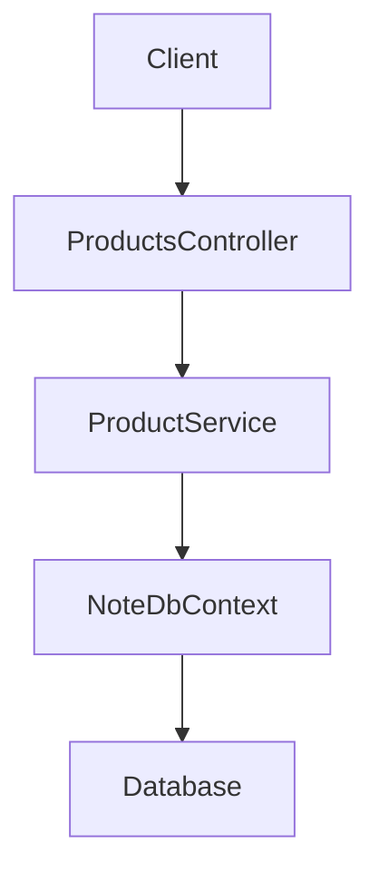
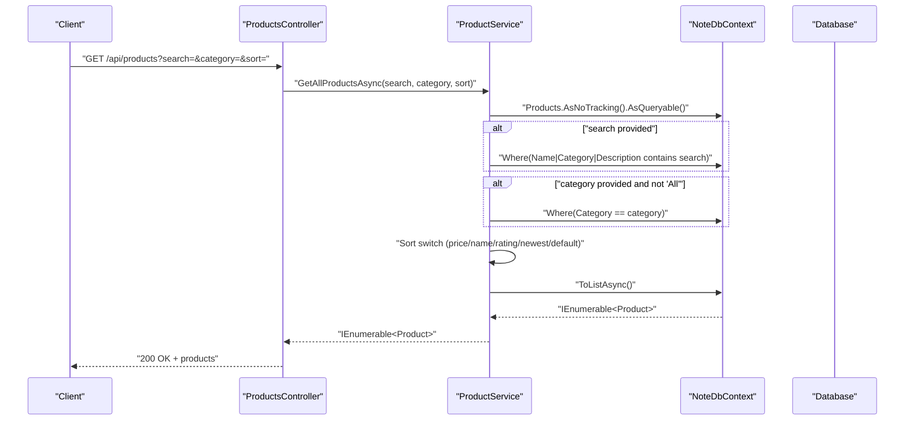
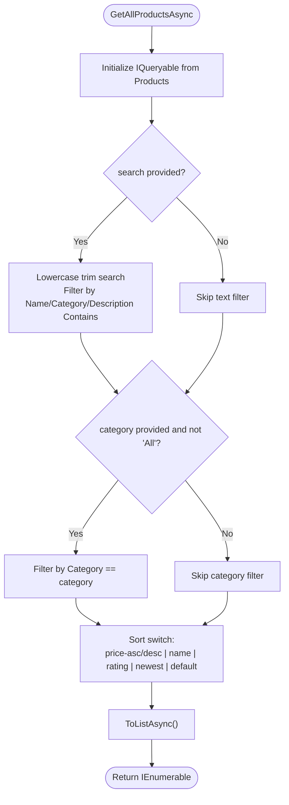
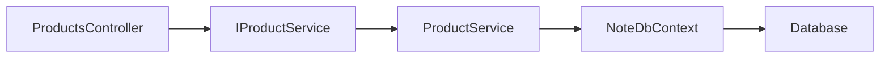

# Search and Filtering System

<cite>
**Referenced Files in This Document**
- [ProductsController.cs](file://Controllers/ProductsController.cs)
- [ProductService.cs](file://Services/ProductService.cs)
- [IProductService.cs](file://Services/IProductService.cs)
- [Product.cs](file://Models/Product.cs)
- [NoteDbContext.cs](file://Data/NoteDbContext.cs)
- [Program.cs](file://Program.cs)
- [appsettings.json](file://appsettings.json)
- [StorefrontController.cs](file://Controllers/StorefrontController.cs)
- [StorefrontConfig.cs](file://Models/StorefrontConfig.cs)
</cite>

## Table of Contents
1. [Introduction](#introduction)
2. [Project Structure](#project-structure)
3. [Core Components](#core-components)
4. [Architecture Overview](#architecture-overview)
5. [Detailed Component Analysis](#detailed-component-analysis)
6. [Dependency Analysis](#dependency-analysis)
7. [Performance Considerations](#performance-considerations)
8. [Troubleshooting Guide](#troubleshooting-guide)
9. [Conclusion](#conclusion)
10. [Appendices](#appendices)

## Introduction
This document describes the product search and filtering system implemented in the backend. It covers the HTTP endpoint for retrieving products, the query parameters supported (text search, category filtering, and sorting), the current implementation approach, and practical guidance for extending the system with advanced features such as full-text search, fuzzy matching, relevance scoring, pagination, caching, and index-backed queries.

## Project Structure
The search and filtering functionality centers around a single controller action that delegates to a service, which builds LINQ queries against the database context. Supporting models define the product entity and storefront configuration.

**Diagram sources**
- [ProductsController.cs:19-24](file://Controllers/ProductsController.cs#L19-L24)
- [ProductService.cs:16-45](file://Services/ProductService.cs#L16-L45)
- [NoteDbContext.cs:11](file://Data/NoteDbContext.cs#L11)

**Section sources**
- [ProductsController.cs:19-24](file://Controllers/ProductsController.cs#L19-L24)
- [ProductService.cs:16-45](file://Services/ProductService.cs#L16-L45)
- [NoteDbContext.cs:11](file://Data/NoteDbContext.cs#L11)

## Core Components
- ProductsController exposes GET /api/products with optional query parameters for search, category, and sort.
- ProductService implements filtering and sorting logic using LINQ over EF Core.
- Product model defines the searchable attributes (Name, Category, Description) and sortable/rankable fields (Price, AverageRating, ReviewCount, IsNew).
- NoteDbContext provides the Products DbSet used by the service.

Key behaviors:
- Text search: case-insensitive substring match across Name, Category, and Description.
- Category filter: equality match excluding a sentinel “All” value.
- Sorting: supports price asc/desc, name, rating (AverageRating desc, then ReviewCount desc), newest (IsNew desc, then Name), and defaults to name.

**Section sources**
- [ProductsController.cs:19-24](file://Controllers/ProductsController.cs#L19-L24)
- [ProductService.cs:16-45](file://Services/ProductService.cs#L16-L45)
- [Product.cs:4-20](file://Models/Product.cs#L4-L20)
- [NoteDbContext.cs:11](file://Data/NoteDbContext.cs#L11)

## Architecture Overview
The request flow for product retrieval is straightforward: the controller action reads query parameters and forwards them to the service, which constructs an IQueryable and executes it to a list.

**Diagram sources**
- [ProductsController.cs:19-24](file://Controllers/ProductsController.cs#L19-L24)
- [ProductService.cs:16-45](file://Services/ProductService.cs#L16-L45)

## Detailed Component Analysis

### ProductsController
- Exposes GET /api/products with three optional query parameters: search, category, sort.
- Delegates to IProductService.GetAllProductsAsync and returns the result.

Usage notes:
- search: free-text substring match.
- category: exact match; “All” is treated as no filter.
- sort: one of price-asc, price-desc, name, rating, newest; defaults to name.

**Section sources**
- [ProductsController.cs:19-24](file://Controllers/ProductsController.cs#L19-L24)

### ProductService
- Builds an IQueryable over Products.
- Applies filters:
  - Text search: Name, Category, and Description are checked for substring matches after trimming and lowercasing.
  - Category: equality comparison excluding “All”.
- Applies sorting via a switch expression:
  - price-asc: ascending by Price.
  - price-desc: descending by Price.
  - name: ascending by Name.
  - rating: descending by AverageRating, then descending by ReviewCount.
  - newest: descending by IsNew, then ascending by Name.
  - default: ascending by Name.

Important implementation details:
- Uses AsNoTracking() to optimize read-only queries.
- Uses ToListAsync() to materialize results.

**Diagram sources**
- [ProductService.cs:16-45](file://Services/ProductService.cs#L16-L45)

**Section sources**
- [ProductService.cs:16-45](file://Services/ProductService.cs#L16-L45)

### Product Model
- Fields used by search and sort:
  - Name, Category, Description (searchable).
  - Price (sortable).
  - AverageRating, ReviewCount (used for rating sort tie-breaker).
  - IsNew (used for newest sort).
- Additional fields (e.g., images, video) are not currently part of search logic.

**Section sources**
- [Product.cs:4-20](file://Models/Product.cs#L4-L20)

### Data Access and Context
- NoteDbContext defines the Products DbSet.
- The service uses EF Core LINQ to translate filters/sorts into SQL.

**Section sources**
- [NoteDbContext.cs:11](file://Data/NoteDbContext.cs#L11)

### Extending Search Functionality
The current implementation uses simple substring matching and in-memory ordering. The following enhancements are recommended and feasible given the existing architecture:

- Full-text search
  - Use database full-text search capabilities (e.g., PostgreSQL tsvector/tsquery) to improve relevance and performance.
  - Introduce a relevance score column or computed value and order by it.
- Fuzzy matching
  - Use Levenshtein distance or trigram similarity (PostgreSQL extensions) to support typo-tolerant search.
- Relevance scoring
  - Weight matches differently based on field (e.g., Name > Category > Description).
  - Boost exact prefix matches and recent items (IsNew).
- Pagination
  - Add skip/take parameters and return total count for client-side pagination.
- Caching
  - Cache popular queries (e.g., recent/newest) with short TTL.
  - Cache category lists and counts to reduce repeated computation.
- Indexing strategies
  - Add GIN/GiST indexes on text fields for full-text search.
  - Add B-tree indexes on sort/filter columns (Category, Price, IsNew).
- Advanced filters
  - Price range, stock availability, rating thresholds.
  - Multi-category selection and negation.
- Query optimization
  - Avoid SELECT *; only fetch needed columns.
  - Use AsNoTracking for read-heavy endpoints.
  - Minimize string transformations in SQL when possible.

[No sources needed since this section provides general guidance]

### Implementing Custom Filters
To add a new filter (e.g., price range):
- Extend the controller action signature to accept minPrice/maxPrice.
- Update the service method to accept and apply the new parameters.
- Append Where clauses to the IQueryable for the new conditions.
- Update the sorting logic if needed.

[No sources needed since this section provides general guidance]

## Dependency Analysis
The controller depends on the service interface, which depends on the data context. The service composes LINQ queries and translates them to SQL.

**Diagram sources**
- [ProductsController.cs:14](file://Controllers/ProductsController.cs#L14)
- [IProductService.cs:7](file://Services/IProductService.cs#L7)
- [ProductService.cs:11](file://Services/ProductService.cs#L11)
- [NoteDbContext.cs:11](file://Data/NoteDbContext.cs#L11)

**Section sources**
- [ProductsController.cs:14](file://Controllers/ProductsController.cs#L14)
- [IProductService.cs:7](file://Services/IProductService.cs#L7)
- [ProductService.cs:11](file://Services/ProductService.cs#L11)
- [NoteDbContext.cs:11](file://Data/NoteDbContext.cs#L11)

## Performance Considerations
Current state:
- Uses AsNoTracking() for read-only queries.
- Materializes results via ToListAsync().
- String comparisons are performed in LINQ, which may translate to LIKE or ILIKE depending on the provider.

Recommendations:
- Database-level full-text search and indexes for Name, Category, Description.
- Pagination to limit result sets.
- Caching for frequently accessed categories and popular queries.
- Avoid excessive string transformations in SQL; pre-normalize on the application side only when necessary.
- Monitor slow queries and add targeted indexes.

[No sources needed since this section provides general guidance]

## Troubleshooting Guide
Common issues and resolutions:
- Empty results with search
  - Ensure the search term is not entirely whitespace and is trimmed.
  - Verify that the target fields (Name, Category, Description) contain the expected values.
- Unexpected casing behavior
  - The implementation lowercases inputs and fields; confirm that collation and normalization align with expectations.
- Sorting anomalies
  - Rating sort uses AverageRating then ReviewCount; ensure these fields are populated.
- Missing category filter
  - “All” is treated as no filter; pass a specific category or omit the parameter.

Operational checks:
- Confirm the database connection string is valid and the database is migrated.
- Validate that the Products table exists and contains seed data.

**Section sources**
- [ProductService.cs:20-42](file://Services/ProductService.cs#L20-L42)
- [Program.cs:25-39](file://Program.cs#L25-L39)
- [appsettings.json:2-4](file://appsettings.json#L2-L4)

## Conclusion
The current search and filtering system provides a solid foundation with straightforward substring search, category filtering, and multiple sorting modes. To scale to larger catalogs and richer user experiences, adopt database-backed full-text search, fuzzy matching, relevance scoring, pagination, and caching. The existing architecture cleanly separates concerns and can accommodate these enhancements with minimal disruption.

## Appendices

### API Definition
- Endpoint: GET /api/products
- Query parameters:
  - search: string (optional)
  - category: string (optional; “All” disables filter)
  - sort: string (optional; one of price-asc, price-desc, name, rating, newest; defaults to name)
- Response: 200 OK with array of Product objects

**Section sources**
- [ProductsController.cs:19-24](file://Controllers/ProductsController.cs#L19-L24)

### Example Queries
- Basic search: GET /api/products?search=journal
- Filter by category: GET /api/products?category=Journals
- Sort by price ascending: GET /api/products?sort=price-asc
- Combined: GET /api/products?search=planner&category=Planners&sort=rating
- Newest arrivals: GET /api/products?sort=newest

[No sources needed since this section provides general guidance]

### Storefront Integration
While not part of the search engine, the storefront configuration can influence discoverability and navigation. The StorefrontController manages hero and category banners, which complement search results by guiding users to relevant categories.

**Section sources**
- [StorefrontController.cs:20-46](file://Controllers/StorefrontController.cs#L20-L46)
- [StorefrontConfig.cs:3-22](file://Models/StorefrontConfig.cs#L3-L22)