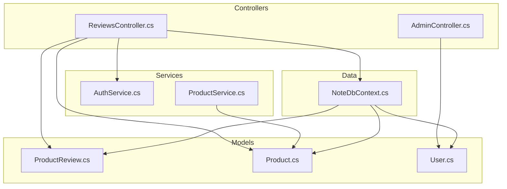
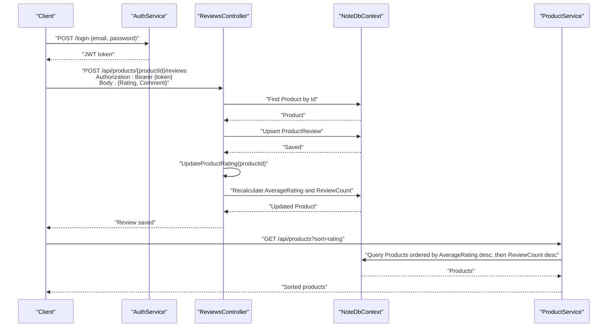
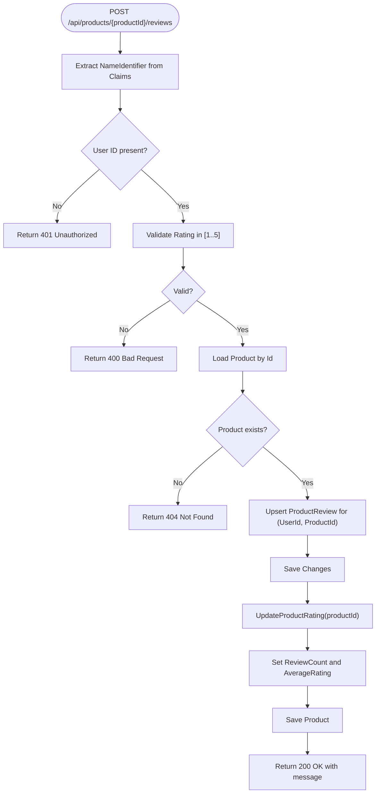
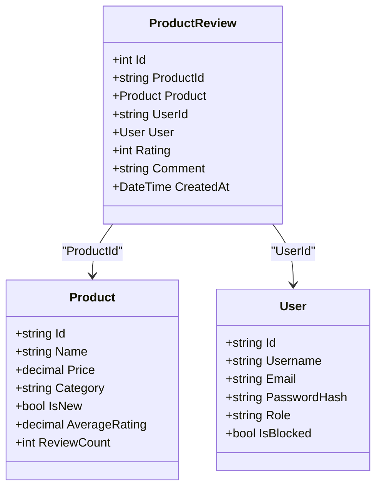
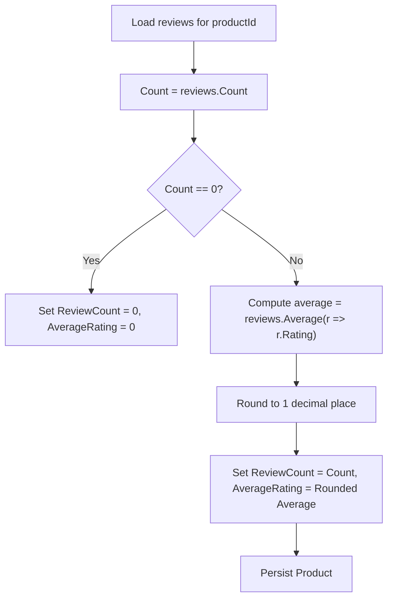
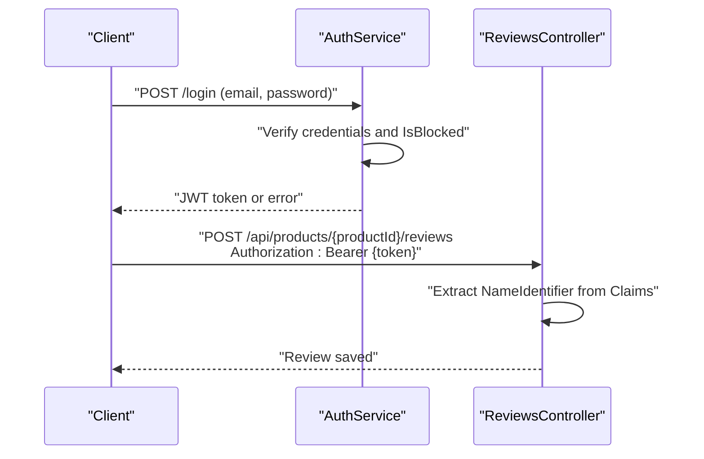
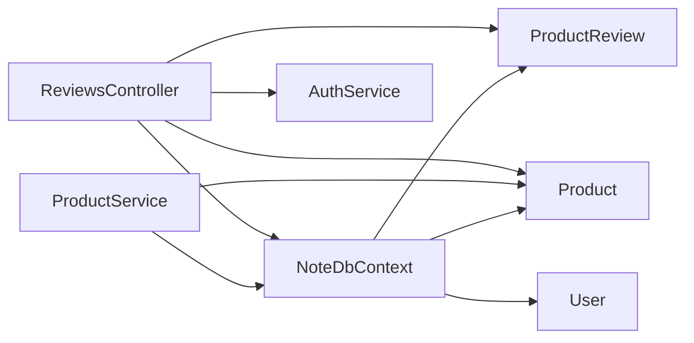

# Review & Rating System

<cite>
**Referenced Files in This Document**
- [ReviewsController.cs](file://Controllers/ReviewsController.cs)
- [ProductReview.cs](file://Models/ProductReview.cs)
- [Product.cs](file://Models/Product.cs)
- [NoteDbContext.cs](file://Data/NoteDbContext.cs)
- [AuthService.cs](file://Services/AuthService.cs)
- [ProductService.cs](file://Services/ProductService.cs)
- [AdminController.cs](file://Controllers/AdminController.cs)
- [User.cs](file://Models/User.cs)
</cite>

## Table of Contents
1. [Introduction](#introduction)
2. [Project Structure](#project-structure)
3. [Core Components](#core-components)
4. [Architecture Overview](#architecture-overview)
5. [Detailed Component Analysis](#detailed-component-analysis)
6. [Dependency Analysis](#dependency-analysis)
7. [Performance Considerations](#performance-considerations)
8. [Troubleshooting Guide](#troubleshooting-guide)
9. [Conclusion](#conclusion)

## Introduction
This document describes the customer review and rating system implemented in the backend. It covers the review submission process, rating calculation algorithms, review moderation capabilities, controller endpoints, authentication requirements, validation rules, and integration with product display systems. Practical examples illustrate how to submit reviews, manage review responses, and calculate product ratings. The document also outlines the ProductReview model, aggregation functions, and review analytics, along with spam prevention strategies, review sorting mechanisms, and integration with product display systems.

## Project Structure
The review system spans several layers:
- Controllers: expose REST endpoints for retrieving and submitting reviews
- Models: define the ProductReview entity and Product metadata used for rating aggregation
- Data: Entity Framework context with seeded data and unique constraints
- Services: authentication and product services used by controllers
- Admin: administrative endpoints for user management and blocking

**Diagram sources**
- [ReviewsController.cs:10-87](file://Controllers/ReviewsController.cs#L10-L87)
- [ProductReview.cs:1-14](file://Models/ProductReview.cs#L1-L14)
- [Product.cs:1-21](file://Models/Product.cs#L1-L21)
- [NoteDbContext.cs:7-21](file://Data/NoteDbContext.cs#L7-L21)
- [AuthService.cs:11-97](file://Services/AuthService.cs#L11-L97)
- [ProductService.cs:7-94](file://Services/ProductService.cs#L7-L94)
- [AdminController.cs:12-276](file://Controllers/AdminController.cs#L12-L276)
- [User.cs:1-12](file://Models/User.cs#L1-L12)

**Section sources**
- [ReviewsController.cs:10-87](file://Controllers/ReviewsController.cs#L10-L87)
- [ProductReview.cs:1-14](file://Models/ProductReview.cs#L1-L14)
- [Product.cs:1-21](file://Models/Product.cs#L1-L21)
- [NoteDbContext.cs:7-21](file://Data/NoteDbContext.cs#L7-L21)

## Core Components
- ReviewsController: exposes GET and POST endpoints under api/products/{productId}/reviews for listing and submitting reviews
- ProductReview model: stores review metadata including rating, comment, timestamps, and foreign keys to Product and User
- Product model: holds AverageRating and ReviewCount used for product-level aggregation
- NoteDbContext: defines ProductReview unique composite index (UserId, ProductId), seeds initial data, and exposes Product and ProductReview sets
- AuthService: handles JWT-based authentication used by ReviewsController
- ProductService: provides product listing and sorting, including rating-based ordering

**Section sources**
- [ReviewsController.cs:10-87](file://Controllers/ReviewsController.cs#L10-L87)
- [ProductReview.cs:1-14](file://Models/ProductReview.cs#L1-L14)
- [Product.cs:1-21](file://Models/Product.cs#L1-L21)
- [NoteDbContext.cs:45-47](file://Data/NoteDbContext.cs#L45-L47)
- [AuthService.cs:11-97](file://Services/AuthService.cs#L11-L97)
- [ProductService.cs:16-42](file://Services/ProductService.cs#L16-L42)

## Architecture Overview
The review system follows a layered architecture:
- Authentication: JWT tokens issued by AuthService grant access to review submission
- Authorization: ReviewsController requires [Authorize] for POST operations
- Data Access: ReviewsController uses NoteDbContext to query and persist reviews
- Aggregation: Product-level AverageRating and ReviewCount are recalculated after each review update
- Sorting: ProductService sorts products by rating and review count

**Diagram sources**
- [ReviewsController.cs:41-86](file://Controllers/ReviewsController.cs#L41-L86)
- [AuthService.cs:43-81](file://Services/AuthService.cs#L43-L81)
- [ProductService.cs:34-42](file://Services/ProductService.cs#L34-L42)
- [NoteDbContext.cs:11-18](file://Data/NoteDbContext.cs#L11-L18)

## Detailed Component Analysis

### ReviewsController
Endpoints:
- GET /api/products/{productId}/reviews
  - Retrieves all reviews for a product, ordered by CreatedAt descending
  - Includes user-provided username or defaults to "Customer" if unavailable
- POST /api/products/{productId}/reviews
  - Requires [Authorize] JWT bearer token
  - Validates Rating between 1 and 5
  - Upserts a review for the authenticated user-product pair
  - Trims Comment before saving
  - Updates product-level AverageRating and ReviewCount

Authentication and Authorization:
- Uses Claims-based identity to extract NameIdentifier for user identification
- Returns Unauthorized if user claim is missing

Validation Rules:
- Rating must be an integer between 1 and 5
- Product must exist; otherwise returns NotFound
- Comment is trimmed before persistence

Rating Calculation:
- Recalculates product.ReviewCount as the number of reviews
- Computes AverageRating as the rounded average of all ratings for the product

**Diagram sources**
- [ReviewsController.cs:41-86](file://Controllers/ReviewsController.cs#L41-L86)

**Section sources**
- [ReviewsController.cs:21-86](file://Controllers/ReviewsController.cs#L21-L86)

### ProductReview Model
Fields:
- Id: primary key
- ProductId: foreign key to Product
- Product: navigation property
- UserId: foreign key to User
- User: navigation property
- Rating: integer in [1..5]
- Comment: text field
- CreatedAt: UTC timestamp

Constraints:
- Unique composite index on (UserId, ProductId) prevents duplicate reviews per user-product pair

**Diagram sources**
- [ProductReview.cs:1-14](file://Models/ProductReview.cs#L1-L14)
- [Product.cs:1-21](file://Models/Product.cs#L1-L21)
- [User.cs:1-12](file://Models/User.cs#L1-L12)

**Section sources**
- [ProductReview.cs:1-14](file://Models/ProductReview.cs#L1-L14)
- [NoteDbContext.cs:45-47](file://Data/NoteDbContext.cs#L45-L47)

### Product Model and Aggregation
Fields used for rating aggregation:
- AverageRating: decimal representing the rounded average of all ratings
- ReviewCount: integer counting all reviews for the product

Aggregation Algorithm:
- Count all reviews for a product
- Compute average rating across all reviews
- Round to one decimal place
- Persist updated values

Sorting Mechanism:
- ProductService sorts products by rating and review count for display

**Diagram sources**
- [ReviewsController.cs:73-86](file://Controllers/ReviewsController.cs#L73-L86)
- [ProductService.cs:34-42](file://Services/ProductService.cs#L34-L42)

**Section sources**
- [Product.cs:18-19](file://Models/Product.cs#L18-L19)
- [ReviewsController.cs:73-86](file://Controllers/ReviewsController.cs#L73-L86)
- [ProductService.cs:34-42](file://Services/ProductService.cs#L34-L42)

### Authentication and Authorization
- ReviewsController POST requires [Authorize], enforcing JWT bearer authentication
- AuthService generates JWT tokens with standard claims including sub, email, name, role
- Blocked users cannot log in and therefore cannot submit reviews

**Diagram sources**
- [AuthService.cs:43-81](file://Services/AuthService.cs#L43-L81)
- [ReviewsController.cs:41-46](file://Controllers/ReviewsController.cs#L41-L46)

**Section sources**
- [AuthService.cs:43-81](file://Services/AuthService.cs#L43-L81)
- [ReviewsController.cs:41-46](file://Controllers/ReviewsController.cs#L41-L46)

### Review Moderation Features
- No dedicated review moderation endpoint exists in the current codebase
- Admin can manage users (block/unblock) via AdminController endpoints
- Blocking a user prevents login and thus review submission

Potential Enhancements:
- Add endpoints to list, moderate, or delete reviews
- Integrate comment filtering/validation
- Add review approval workflows

**Section sources**
- [AdminController.cs:250-260](file://Controllers/AdminController.cs#L250-L260)

### Review Sorting Mechanisms
- Product listing supports sorting by rating and review count
- Sorting prioritizes AverageRating desc, then ReviewCount desc

Integration with Product Display Systems:
- ProductService.GetAllProductsAsync applies rating-based sorting
- ProductReview creation triggers recalculation of AverageRating and ReviewCount

**Section sources**
- [ProductService.cs:34-42](file://Services/ProductService.cs#L34-L42)
- [ReviewsController.cs:73-86](file://Controllers/ReviewsController.cs#L73-L86)

### Practical Examples

- Submitting a review:
  - Endpoint: POST /api/products/{productId}/reviews
  - Headers: Authorization: Bearer {jwt}
  - Body: { Rating: 5, Comment: "Great product!" }
  - Behavior: Upserts review, trims comment, updates product rating

- Managing review responses:
  - Current code does not support product responses to reviews
  - Admin can block users to prevent future submissions

- Calculating product ratings:
  - Triggered automatically after each review upsert
  - Algorithm: count reviews, compute average, round to one decimal, update product

**Section sources**
- [ReviewsController.cs:41-86](file://Controllers/ReviewsController.cs#L41-L86)

## Dependency Analysis
- ReviewsController depends on NoteDbContext for data access and ProductReview/Product models
- ProductReview has foreign keys to Product and User
- NoteDbContext enforces a unique composite index on (UserId, ProductId)
- ProductService depends on NoteDbContext for product queries and sorting
- AuthService provides JWT tokens used by ReviewsController

**Diagram sources**
- [ReviewsController.cs:14-18](file://Controllers/ReviewsController.cs#L14-L18)
- [ProductReview.cs:6-9](file://Models/ProductReview.cs#L6-L9)
- [Product.cs:1-21](file://Models/Product.cs#L1-L21)
- [NoteDbContext.cs:11-18](file://Data/NoteDbContext.cs#L11-L18)
- [AuthService.cs:13-19](file://Services/AuthService.cs#L13-L19)
- [ProductService.cs:9-14](file://Services/ProductService.cs#L9-L14)

**Section sources**
- [ReviewsController.cs:14-18](file://Controllers/ReviewsController.cs#L14-L18)
- [NoteDbContext.cs:45-47](file://Data/NoteDbContext.cs#L45-L47)

## Performance Considerations
- Aggregation cost: UpdateProductRating loads all reviews for a product; for high-volume products, consider caching or periodic batch updates
- Indexing: Composite index on (UserId, ProductId) prevents duplicates and supports efficient lookups
- Sorting: Rating-based sorting in ProductService is O(n log n); ensure appropriate indexing on product fields if needed
- Authentication overhead: JWT verification occurs on each POST; keep token size minimal and avoid unnecessary claims

## Troubleshooting Guide
Common issues and resolutions:
- Unauthorized submission:
  - Ensure a valid JWT is included in Authorization header
  - Verify user is not blocked
- Invalid rating:
  - Ensure Rating is between 1 and 5
- Product not found:
  - Confirm productId exists
- Duplicate review:
  - Unique index prevents multiple reviews per user-product pair; subsequent requests update the existing review
- Slow rating recalculation:
  - Consider optimizing UpdateProductRating for high-volume scenarios

**Section sources**
- [ReviewsController.cs:41-86](file://Controllers/ReviewsController.cs#L41-L86)
- [AuthService.cs:43-56](file://Services/AuthService.cs#L43-L56)
- [NoteDbContext.cs:45-47](file://Data/NoteDbContext.cs#L45-L47)

## Conclusion
The review and rating system provides a straightforward mechanism for customers to submit reviews, with automatic product-level rating aggregation. Authentication ensures only logged-in users can submit reviews, while validation guarantees rating bounds and product existence. Sorting by rating and review count integrates seamlessly with product display. Future enhancements could include explicit review moderation endpoints, comment filtering, and response management to strengthen spam prevention and content governance.