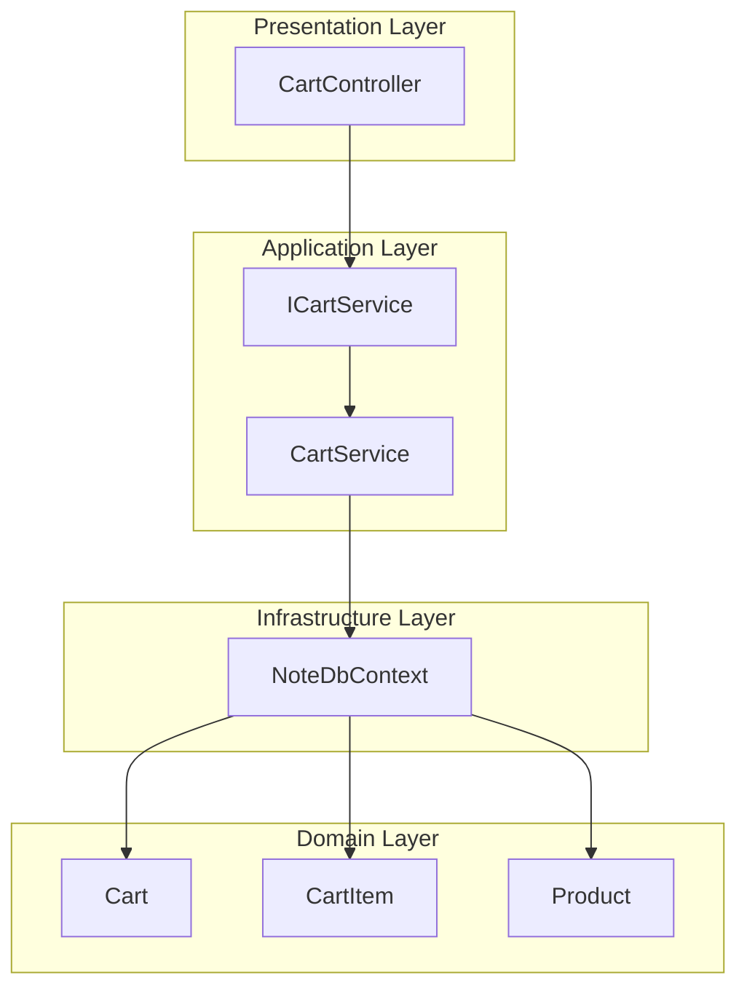
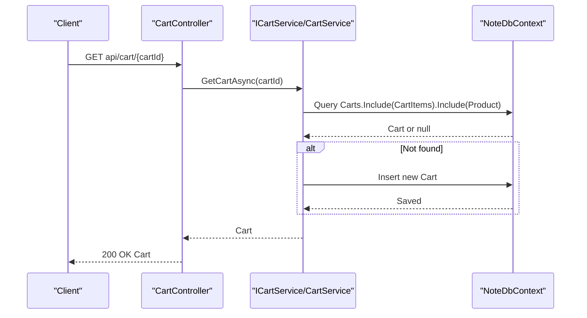
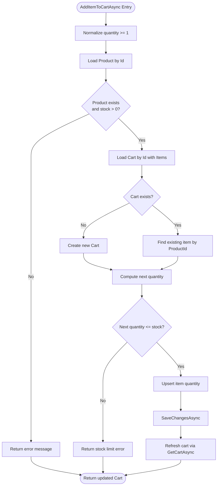
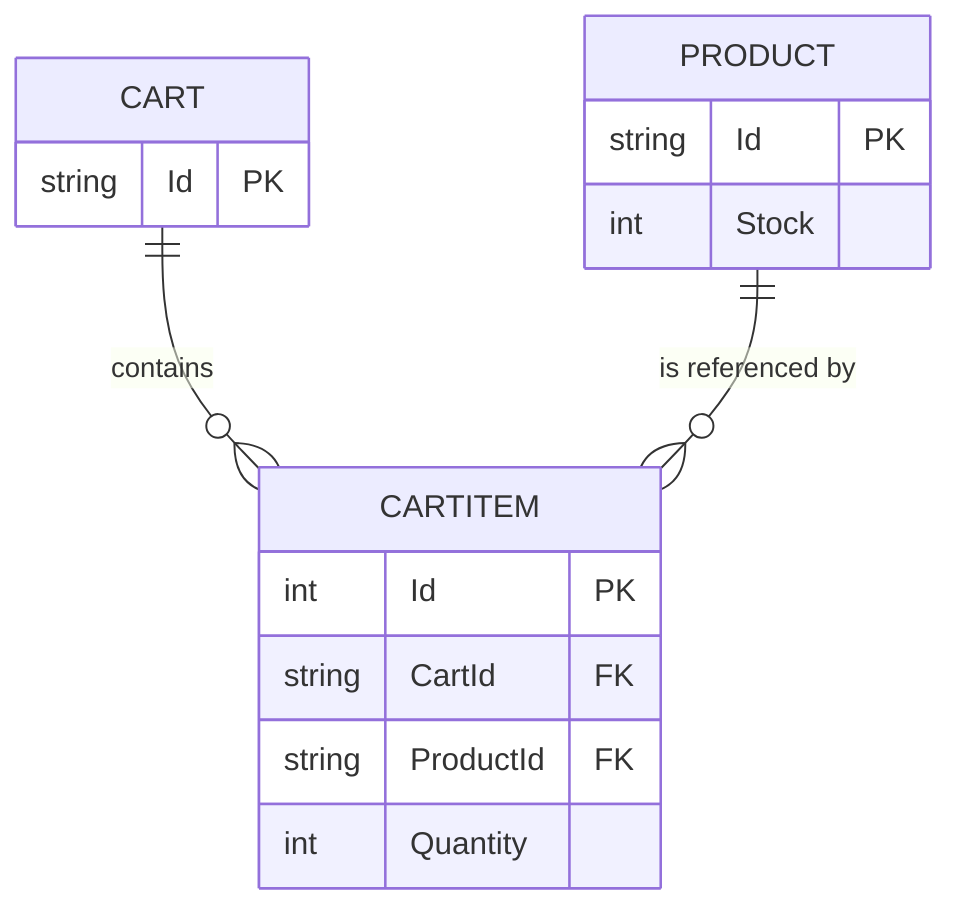
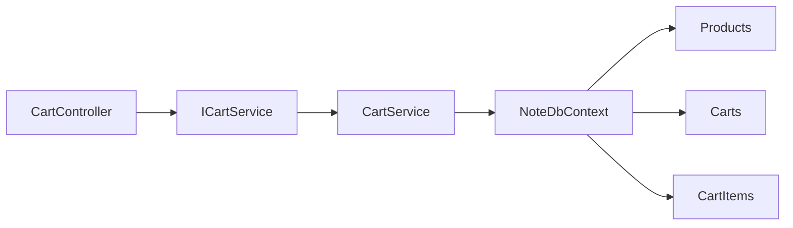

# Cart Management

<cite>
**Referenced Files in This Document**
- [CartController.cs](file://Controllers/CartController.cs)
- [CartService.cs](file://Services/CartService.cs)
- [ICartService.cs](file://Services/ICartService.cs)
- [Cart.cs](file://Models/Cart.cs)
- [CartItem.cs](file://Models/CartItem.cs)
- [Product.cs](file://Models/Product.cs)
- [NoteDbContext.cs](file://Data/NoteDbContext.cs)
- [Program.cs](file://Program.cs)
- [appsettings.json](file://appsettings.json)
</cite>

## Table of Contents
1. [Introduction](#introduction)
2. [Project Structure](#project-structure)
3. [Core Components](#core-components)
4. [Architecture Overview](#architecture-overview)
5. [Detailed Component Analysis](#detailed-component-analysis)
6. [Dependency Analysis](#dependency-analysis)
7. [Performance Considerations](#performance-considerations)
8. [Troubleshooting Guide](#troubleshooting-guide)
9. [Conclusion](#conclusion)
10. [Appendices](#appendices)

## Introduction
This document describes the cart management system, covering the complete cart lifecycle: creation, item addition with validation, quantity updates, item removal, and retrieval by ID. It explains the controller endpoints, request/response schemas, error handling, and the business logic implemented in the service layer. It also outlines session-based cart management considerations, cart expiration policies, and performance guidance for large carts.

## Project Structure
The cart system spans the following layers:
- Controllers: expose HTTP endpoints for cart operations
- Services: encapsulate business logic and persistence
- Models: define domain entities (Cart, CartItem, Product)
- Data: Entity Framework context for persistence
- Program/appsettings: application startup, DI registration, and configuration

**Diagram sources**
- [CartController.cs:18-47](file://Controllers/CartController.cs#L18-L47)
- [ICartService.cs:5-11](file://Services/ICartService.cs#L5-L11)
- [CartService.cs:7-105](file://Services/CartService.cs#L7-L105)
- [Cart.cs:5-9](file://Models/Cart.cs#L5-L9)
- [CartItem.cs:3-11](file://Models/CartItem.cs#L3-L11)
- [Product.cs:3-20](file://Models/Product.cs#L3-L20)
- [NoteDbContext.cs:7-21](file://Data/NoteDbContext.cs#L7-L21)

**Section sources**
- [CartController.cs:1-59](file://Controllers/CartController.cs#L1-L59)
- [CartService.cs:1-106](file://Services/CartService.cs#L1-L106)
- [ICartService.cs:1-12](file://Services/ICartService.cs#L1-L12)
- [Cart.cs:1-10](file://Models/Cart.cs#L1-L10)
- [CartItem.cs:1-12](file://Models/CartItem.cs#L1-L12)
- [Product.cs:1-21](file://Models/Product.cs#L1-L21)
- [NoteDbContext.cs:1-67](file://Data/NoteDbContext.cs#L1-L67)
- [Program.cs:61-67](file://Program.cs#L61-L67)

## Core Components
- CartController: Exposes REST endpoints for cart operations and returns standardized responses.
- CartService: Implements business logic for cart operations, including validation and persistence.
- ICartService: Defines the contract for cart operations.
- Cart, CartItem, Product: Domain models persisted via Entity Framework.
- NoteDbContext: EF Core context managing Cart, CartItem, and Product entities.

Key responsibilities:
- CartController: Route binding, request model binding, response formatting, and error mapping.
- CartService: Product availability checks, quantity limits, cart creation, and persistence.
- NoteDbContext: Database schema and seed data for products and coupons.

**Section sources**
- [CartController.cs:18-47](file://Controllers/CartController.cs#L18-L47)
- [CartService.cs:16-104](file://Services/CartService.cs#L16-L104)
- [ICartService.cs:5-11](file://Services/ICartService.cs#L5-L11)
- [Cart.cs:5-9](file://Models/Cart.cs#L5-L9)
- [CartItem.cs:3-11](file://Models/CartItem.cs#L3-L11)
- [Product.cs:17](file://Models/Product.cs#L17)
- [NoteDbContext.cs:11-21](file://Data/NoteDbContext.cs#L11-L21)

## Architecture Overview
The cart system follows a clean architecture pattern:
- Presentation: CartController handles HTTP requests and delegates to ICartService.
- Application: CartService enforces business rules and coordinates persistence.
- Infrastructure: NoteDbContext manages entity relations and data seeding.
- Domain: Cart, CartItem, and Product represent the core entities.

**Diagram sources**
- [CartController.cs:18-23](file://Controllers/CartController.cs#L18-L23)
- [CartService.cs:16-31](file://Services/CartService.cs#L16-L31)
- [NoteDbContext.cs:11-13](file://Data/NoteDbContext.cs#L11-L13)

## Detailed Component Analysis

### CartController Endpoints
- GET api/cart/{cartId}
  - Purpose: Retrieve a cart by its identifier.
  - Request: Path parameter cartId.
  - Response: 200 OK with Cart object; includes Items populated with Product details.
  - Error: None handled by controller; service returns null only if cart does not exist, but service creates it on demand.

- POST api/cart/{cartId}/items
  - Purpose: Add an item to the cart.
  - Request body: AddCartItemRequest with ProductId and Quantity.
  - Response: 200 OK with updated Cart.
  - Errors: 400 Bad Request with message when product not found, out of stock, or quantity exceeds stock.

- PUT api/cart/{cartId}/items/{itemId}
  - Purpose: Update the quantity of an existing cart item.
  - Request: Path parameters cartId, itemId; body UpdateCartItemRequest with Quantity.
  - Response: 200 OK with updated Cart.
  - Errors: 400 Bad Request with message when item not found or quantity exceeds stock.

- DELETE api/cart/{cartId}/items/{itemId}
  - Purpose: Remove an item from the cart.
  - Request: Path parameters cartId, itemId.
  - Response: 200 OK with updated Cart.
  - Errors: None handled by controller; deletion is idempotent.

Request/response schemas:
- AddCartItemRequest
  - ProductId: string
  - Quantity: integer
- UpdateCartItemRequest
  - Quantity: integer
- Cart
  - Id: string
  - Items: array of CartItem
- CartItem
  - Id: integer
  - CartId: string
  - ProductId: string
  - Quantity: integer
  - Product: Product (optional)
- Product
  - Id: string
  - Name: string
  - Price: decimal
  - Stock: integer

Error handling:
- Validation failures return 400 with a message string.
- Not found scenarios return 404 when the underlying resource is missing (e.g., item update).

**Section sources**
- [CartController.cs:18-47](file://Controllers/CartController.cs#L18-L47)
- [CartController.cs:49-58](file://Controllers/CartController.cs#L49-L58)
- [Cart.cs:5-9](file://Models/Cart.cs#L5-L9)
- [CartItem.cs:3-11](file://Models/CartItem.cs#L3-L11)
- [Product.cs:3-20](file://Models/Product.cs#L3-L20)

### CartService Business Logic
- GetCartAsync(cartId)
  - Behavior: Loads a cart with items and products; if not found, creates a new cart with the given Id and persists it.
  - Persistence: Uses EF Core to query and insert.

- AddItemToCartAsync(cartId, productId, quantity)
  - Validation:
    - Ensures quantity >= 1 (defaults to 1 if less).
    - Verifies product exists and is in stock.
    - Computes total quantity after addition and ensures it does not exceed product stock.
  - Persistence: Updates existing item quantity or adds a new item; saves changes; returns refreshed cart.

- UpdateItemQuantityAsync(cartId, itemId, quantity)
  - Validation:
    - Ensures quantity >= 1.
    - Confirms item belongs to the specified cart and product stock availability.
  - Persistence: Updates quantity and saves changes; returns refreshed cart.

- RemoveItemFromCartAsync(cartId, itemId)
  - Behavior: Removes the item if present; returns the refreshed cart.

**Diagram sources**
- [CartService.cs:33-73](file://Services/CartService.cs#L33-L73)
- [CartService.cs:16-31](file://Services/CartService.cs#L16-L31)

**Section sources**
- [CartService.cs:16-104](file://Services/CartService.cs#L16-L104)

### Data Model Relationships

**Diagram sources**
- [Cart.cs:7](file://Models/Cart.cs#L7)
- [CartItem.cs:6-7](file://Models/CartItem.cs#L6-L7)
- [Product.cs:5](file://Models/Product.cs#L5)

**Section sources**
- [Cart.cs:5-9](file://Models/Cart.cs#L5-L9)
- [CartItem.cs:3-11](file://Models/CartItem.cs#L3-L11)
- [Product.cs:3-20](file://Models/Product.cs#L3-L20)

## Dependency Analysis
- CartController depends on ICartService for all cart operations.
- CartService depends on NoteDbContext for data access.
- NoteDbContext exposes Products, Carts, and CartItems.
- Program.cs registers ICartService with CartService and configures EF Core.

**Diagram sources**
- [Program.cs:61-67](file://Program.cs#L61-L67)
- [CartController.cs:11-16](file://Controllers/CartController.cs#L11-L16)
- [CartService.cs:9](file://Services/CartService.cs#L9)
- [NoteDbContext.cs:11-13](file://Data/NoteDbContext.cs#L11-L13)

**Section sources**
- [Program.cs:61-67](file://Program.cs#L61-L67)
- [CartController.cs:11-16](file://Controllers/CartController.cs#L11-L16)
- [CartService.cs:9](file://Services/CartService.cs#L9)
- [NoteDbContext.cs:11-13](file://Data/NoteDbContext.cs#L11-L13)

## Performance Considerations
- Query strategy:
  - Cart retrieval includes items and product details; consider limiting fields or using projections for read-heavy scenarios.
  - Item updates load the item with product details to enforce stock limits; ensure efficient indexing on CartId and ProductId.
- Concurrency:
  - No explicit concurrency control is implemented. For high contention, consider optimistic concurrency tokens or explicit locking.
- Large carts:
  - Pagination or partial loading of items may be beneficial for very large carts.
  - Consider caching frequently accessed product metadata to reduce repeated lookups.
- Database:
  - Ensure indexes exist on CartId and ProductId in CartItem for fast lookups.
  - Batch operations are not used; frequent small writes are acceptable for typical cart sizes.

[No sources needed since this section provides general guidance]

## Troubleshooting Guide
Common issues and resolutions:
- Product not found or out of stock during add:
  - Verify ProductId correctness and that the product exists and has positive stock.
- Item not found during update:
  - Confirm the item’s CartId matches the path parameter and the item exists.
- Quantity exceeds stock:
  - Reduce quantity to match available stock or wait until restocked.
- Cart not found:
  - The service creates a cart on first access; ensure the cartId is consistent across sessions.

Operational checks:
- Database connectivity and migrations are applied at startup.
- Ensure the database connection string is configured in appsettings.

**Section sources**
- [CartService.cs:37-39](file://Services/CartService.cs#L37-L39)
- [CartService.cs:79-82](file://Services/CartService.cs#L79-L82)
- [CartService.cs:53-56](file://Services/CartService.cs#L53-L56)
- [Program.cs:104-138](file://Program.cs#L104-L138)
- [appsettings.json:2-4](file://appsettings.json#L2-L4)

## Conclusion
The cart management system provides a robust foundation for cart operations with clear separation of concerns. The controller layer offers straightforward endpoints, while the service layer enforces product availability and quantity constraints. Persistence is handled via Entity Framework with seeded product data. For production deployments, consider adding session-based cart identifiers, cart expiration policies, and performance optimizations for large carts.

[No sources needed since this section summarizes without analyzing specific files]

## Appendices

### Practical Examples and Integration Patterns
- Retrieving a cart:
  - Endpoint: GET api/cart/{cartId}
  - Use a stable cartId per user session; create a new cart on first visit if needed.
- Adding an item:
  - Endpoint: POST api/cart/{cartId}/items
  - Request body: { "ProductId": "...", "Quantity": n }
  - Handle 400 errors for invalid ProductId or stock constraints.
- Updating quantity:
  - Endpoint: PUT api/cart/{cartId}/items/{itemId}
  - Request body: { "Quantity": n }
  - Ensure itemId corresponds to the cartId.
- Removing an item:
  - Endpoint: DELETE api/cart/{cartId}/items/{itemId}
  - Idempotent operation; safe to call multiple times.

[No sources needed since this section provides general guidance]

### Session-Based Cart Management and Expiration
- Current implementation:
  - Cart identity is driven by the cartId path parameter; there is no built-in session cookie or session store.
- Recommendations:
  - Generate a unique cartId per user session and pass it in the path.
  - Optionally store cartId in a secure, HttpOnly cookie to simplify client-side handling.
  - Implement server-side expiration: mark carts as expired after a period of inactivity and prune them periodically.
  - For anonymous users, consider associating cartId with browser storage and regenerating it upon logout.

[No sources needed since this section provides general guidance]