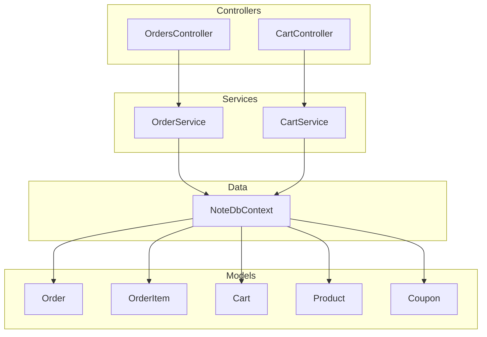
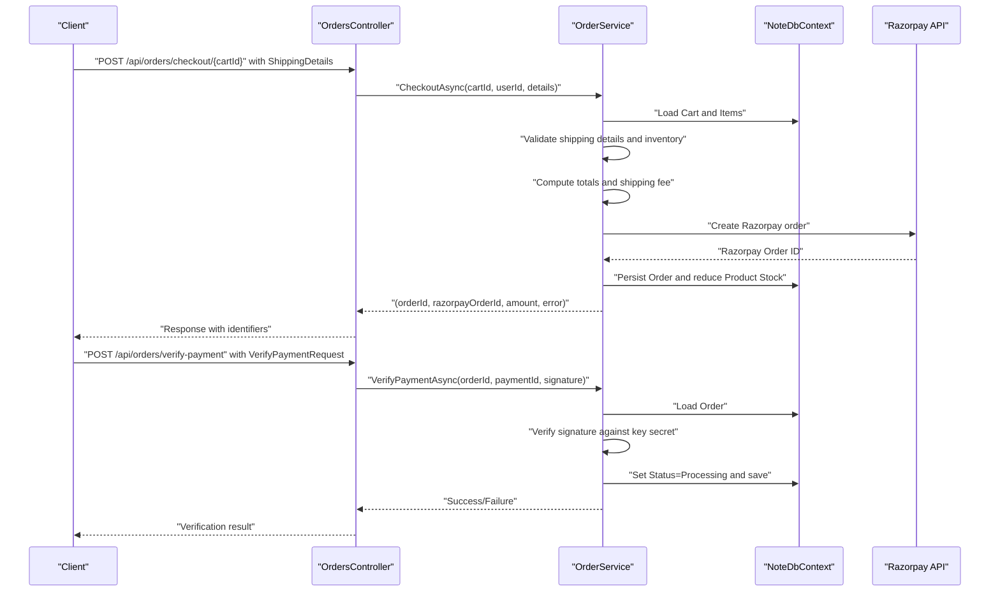
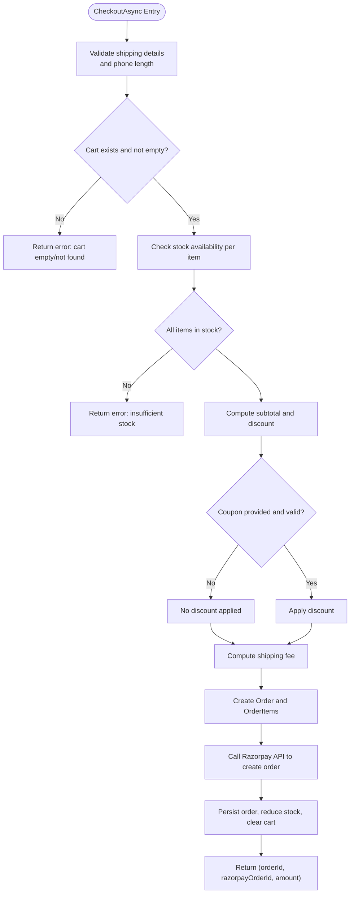
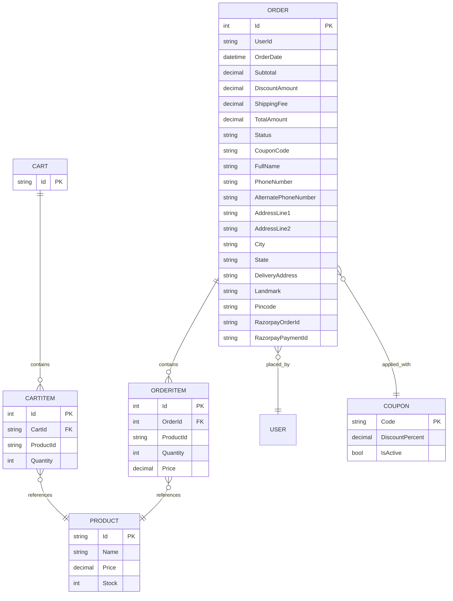
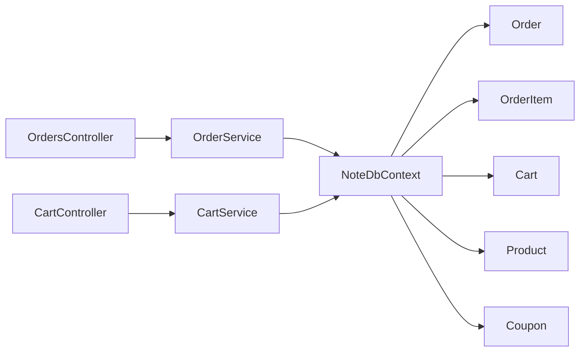

# Order Processing

<cite>
**Referenced Files in This Document**
- [OrdersController.cs](file://Controllers/OrdersController.cs)
- [OrderService.cs](file://Services/OrderService.cs)
- [IOrderService.cs](file://Services/IOrderService.cs)
- [Order.cs](file://Models/Order.cs)
- [NoteDbContext.cs](file://Data/NoteDbContext.cs)
- [Cart.cs](file://Models/Cart.cs)
- [CartService.cs](file://Services/CartService.cs)
- [CartController.cs](file://Controllers/CartController.cs)
- [Product.cs](file://Models/Product.cs)
- [Coupon.cs](file://Models/Coupon.cs)
- [Program.cs](file://Program.cs)
- [appsettings.json](file://appsettings.json)
</cite>

## Table of Contents
1. [Introduction](#introduction)
2. [Project Structure](#project-structure)
3. [Core Components](#core-components)
4. [Architecture Overview](#architecture-overview)
5. [Detailed Component Analysis](#detailed-component-analysis)
6. [Dependency Analysis](#dependency-analysis)
7. [Performance Considerations](#performance-considerations)
8. [Troubleshooting Guide](#troubleshooting-guide)
9. [Conclusion](#conclusion)
10. [Appendices](#appendices)

## Introduction
This document describes the order processing system end-to-end, covering the complete workflow from cart checkout to order fulfillment. It explains the controller endpoints, request/response schemas, business logic in the service layer, and integration with external payment processors (Razorpay). It also documents order status management, cancellation/refund handling, and order history retrieval.

## Project Structure
The order processing system spans controllers, services, models, and data access layers:
- Controllers expose HTTP endpoints for order operations.
- Services encapsulate business logic for cart-to-order conversion, inventory validation, shipping calculation, and persistence.
- Models define the order, cart, product, and coupon entities.
- Data context manages database access and seeding.

**Diagram sources**
- [OrdersController.cs:12-107](file://Controllers/OrdersController.cs#L12-L107)
- [OrderService.cs:11-269](file://Services/OrderService.cs#L11-L269)
- [CartController.cs:9-59](file://Controllers/CartController.cs#L9-L59)
- [CartService.cs:7-106](file://Services/CartService.cs#L7-L106)
- [Order.cs:3-62](file://Models/Order.cs#L3-L62)
- [Cart.cs:5-10](file://Models/Cart.cs#L5-L10)
- [Product.cs:3-21](file://Models/Product.cs#L3-L21)
- [Coupon.cs:3-9](file://Models/Coupon.cs#L3-L9)
- [NoteDbContext.cs:7-67](file://Data/NoteDbContext.cs#L7-L67)

**Section sources**
- [OrdersController.cs:12-107](file://Controllers/OrdersController.cs#L12-L107)
- [OrderService.cs:11-269](file://Services/OrderService.cs#L11-L269)
- [CartController.cs:9-59](file://Controllers/CartController.cs#L9-L59)
- [CartService.cs:7-106](file://Services/CartService.cs#L7-L106)
- [Order.cs:3-62](file://Models/Order.cs#L3-L62)
- [Cart.cs:5-10](file://Models/Cart.cs#L5-L10)
- [Product.cs:3-21](file://Models/Product.cs#L3-L21)
- [Coupon.cs:3-9](file://Models/Coupon.cs#L3-L9)
- [NoteDbContext.cs:7-67](file://Data/NoteDbContext.cs#L7-L67)

## Core Components
- OrdersController: Exposes endpoints for retrieving orders, placing orders via checkout, verifying payments, updating order status (admin), and canceling orders.
- OrderService: Implements cart-to-order conversion, shipping address validation, inventory checks, coupon application, shipping fee calculation, order persistence, and Razorpay integration.
- Order model: Represents order header, items, shipping details, totals, and payment identifiers.
- Cart and CartService: Manage shopping cart lifecycle and inventory constraints prior to checkout.
- Data context: Provides EF Core access to Orders, OrderItems, Carts, Products, Coupons, and related entities.

**Section sources**
- [OrdersController.cs:21-106](file://Controllers/OrdersController.cs#L21-L106)
- [OrderService.cs:23-268](file://Services/OrderService.cs#L23-L268)
- [Order.cs:3-62](file://Models/Order.cs#L3-L62)
- [Cart.cs:5-10](file://Models/Cart.cs#L5-L10)
- [CartService.cs:16-104](file://Services/CartService.cs#L16-L104)
- [NoteDbContext.cs:11-21](file://Data/NoteDbContext.cs#L11-L21)

## Architecture Overview
The order workflow integrates client actions with backend services and external payment providers:
- Client adds items to cart and invokes checkout with shipping details.
- Backend validates shipping details, cart contents, and inventory.
- Backend calculates totals, applies coupons, computes shipping fees, and persists the order.
- Backend creates a Razorpay order and returns identifiers to the client.
- Client completes payment via Razorpay; backend verifies signatures and updates order status.

**Diagram sources**
- [OrdersController.cs:31-71](file://Controllers/OrdersController.cs#L31-L71)
- [OrderService.cs:23-187](file://Services/OrderService.cs#L23-L187)
- [OrderService.cs:240-268](file://Services/OrderService.cs#L240-L268)
- [NoteDbContext.cs:11-21](file://Data/NoteDbContext.cs#L11-L21)

## Detailed Component Analysis

### OrdersController Endpoints
- GET /api/orders
  - Purpose: Retrieve the authenticated user’s order history.
  - Auth: Requires JWT bearer token.
  - Response: Array of orders with items and product details.
- POST /api/orders/checkout/{cartId}
  - Purpose: Convert cart to order, validate shipping details, compute totals, apply coupon, reserve inventory, and create a Razorpay order.
  - Auth: Requires JWT bearer token.
  - Request body: ShippingDetails (full name, phone, alternate phone, address parts, city, state, delivery address, landmark, pincode, optional coupon code).
  - Response: { message, orderId, razorpayOrderId, amount, currency }.
  - Errors: 400 with message if cart is empty/not found, shipping validation fails, coupon invalid, insufficient stock, or payment gateway misconfigured.
- POST /api/orders/verify-payment
  - Purpose: Verify Razorpay payment signature and update order status to Processing.
  - Auth: Requires JWT bearer token.
  - Request body: VerifyPaymentRequest { orderId, razorpayPaymentId, razorpayOrderId, razorpaySignature }.
  - Response: { message } on success.
  - Errors: 400 if any field is missing or verification fails.
- GET /api/orders/all
  - Purpose: Admin-only endpoint to retrieve all orders.
  - Auth: Requires Admin role.
  - Response: Array of orders with items and product details.
- PUT /api/orders/{id}/status
  - Purpose: Admin-only endpoint to update order status.
  - Auth: Requires Admin role.
  - Request body: UpdateOrderStatusRequest { status }.
  - Response: { message } on success.
  - Errors: 404 if order not found.
- PUT /api/orders/{id}/cancel
  - Purpose: Allow a user to cancel a pending order; restores inventory.
  - Auth: Requires JWT bearer token.
  - Response: { message } on success.
  - Errors: 400 if order is not pending or not owned by the user.

**Section sources**
- [OrdersController.cs:21-106](file://Controllers/OrdersController.cs#L21-L106)

### OrderService Business Logic
- Cart-to-order conversion
  - Loads cart with items and products.
  - Validates shipping details and phone length.
  - Ensures each item’s quantity does not exceed product stock.
  - Computes subtotal, applies coupon discount if valid, sets shipping fee based on threshold, and calculates total.
  - Creates Order entity with shipping details and OrderItem entries.
- Payment preparation with Razorpay
  - Reads RAZORPAY_KEY_ID and RAZORPAY_KEY_SECRET from configuration/environment.
  - Converts amount to paise and ensures minimum amount.
  - Calls Razorpay API to create an order and captures the Razorpay Order ID.
  - Persists order and reduces product stock.
  - Clears the cart upon successful order creation.
- Order status management
  - UpdateOrderStatusAsync: Sets status for admin-managed updates.
  - VerifyPaymentAsync: Verifies signature using HMAC-SHA256 with key secret; on success, sets status to Processing and stores payment identifier.
- Order cancellation and refund handling
  - CancelOrderAsync: Allows cancellation only for Pending orders owned by the user; restores stock and sets status to Cancelled.

**Diagram sources**
- [OrderService.cs:23-187](file://Services/OrderService.cs#L23-L187)

**Section sources**
- [OrderService.cs:23-268](file://Services/OrderService.cs#L23-L268)

### Data Models and Relationships
- Order
  - Header fields: UserId, OrderDate, Totals (Subtotal, DiscountAmount, ShippingFee, TotalAmount), Status, CouponCode.
  - Shipping details: Full name, phone, alternate phone, address parts, city, state, delivery address, landmark, pincode.
  - Items: List of OrderItem entries.
  - Payment identifiers: RazorpayOrderId, RazorpayPaymentId.
- OrderItem
  - Links Order to Product, stores quantity and price at time of purchase.
- Cart and CartItem
  - Cart holds Items referencing Product.
- Product
  - Contains Id, Name, Price, Stock, and metadata.
- Coupon
  - Contains Code, DiscountPercent, and IsActive flag.

**Diagram sources**
- [Order.cs:3-62](file://Models/Order.cs#L3-L62)
- [Cart.cs:5-10](file://Models/Cart.cs#L5-L10)
- [Product.cs:3-21](file://Models/Product.cs#L3-L21)
- [Coupon.cs:3-9](file://Models/Coupon.cs#L3-L9)

**Section sources**
- [Order.cs:3-62](file://Models/Order.cs#L3-L62)
- [Cart.cs:5-10](file://Models/Cart.cs#L5-L10)
- [Product.cs:3-21](file://Models/Product.cs#L3-L21)
- [Coupon.cs:3-9](file://Models/Coupon.cs#L3-L9)

### Cart and Inventory Validation
- CartController endpoints manage cart lifecycle:
  - GET /api/cart/{cartId}: Retrieve cart with items and product details.
  - POST /api/cart/{cartId}/items: Add item to cart with quantity validation against product stock.
  - PUT /api/cart/{cartId}/items/{itemId}: Update item quantity with stock validation.
  - DELETE /api/cart/{cartId}/items/{itemId}: Remove item from cart.
- CartService enforces:
  - Minimum quantity is 1.
  - Adding/updating respects product stock limits.
  - Cart is created lazily if not present.

**Section sources**
- [CartController.cs:18-46](file://Controllers/CartController.cs#L18-L46)
- [CartService.cs:33-104](file://Services/CartService.cs#L33-L104)

### Razorpay Integration
- Configuration
  - Requires RAZORPAY_KEY_ID and RAZORPAY_KEY_SECRET from configuration or environment variables.
  - Amount is converted to paise; minimum amount enforced.
- Order creation
  - Sends Basic Auth request to Razorpay API v1/orders with amount, currency, and receipt.
  - Captures Razorpay Order ID and attaches it to the order.
- Payment verification
  - Constructs payload from Razorpay Order ID and payment ID.
  - Computes HMAC-SHA256 signature using key secret.
  - On match, sets order status to Processing and stores payment ID.

**Section sources**
- [OrderService.cs:120-187](file://Services/OrderService.cs#L120-L187)
- [OrderService.cs:240-268](file://Services/OrderService.cs#L240-L268)
- [Program.cs:12-13](file://Program.cs#L12-L13)
- [appsettings.json:1-23](file://appsettings.json#L1-L23)

## Dependency Analysis
- Controllers depend on services for business logic.
- Services depend on the data context for persistence and on configuration for external integrations.
- Models define relationships used by EF Core.
- Cart and product models underpin inventory validation during checkout.

**Diagram sources**
- [OrdersController.cs:14-18](file://Controllers/OrdersController.cs#L14-L18)
- [OrderService.cs:17-21](file://Services/OrderService.cs#L17-L21)
- [CartController.cs:11-15](file://Controllers/CartController.cs#L11-L15)
- [CartService.cs:11-14](file://Services/CartService.cs#L11-L14)
- [NoteDbContext.cs:11-21](file://Data/NoteDbContext.cs#L11-L21)

**Section sources**
- [OrdersController.cs:14-18](file://Controllers/OrdersController.cs#L14-L18)
- [OrderService.cs:17-21](file://Services/OrderService.cs#L17-L21)
- [CartController.cs:11-15](file://Controllers/CartController.cs#L11-L15)
- [CartService.cs:11-14](file://Services/CartService.cs#L11-L14)
- [NoteDbContext.cs:11-21](file://Data/NoteDbContext.cs#L11-L21)

## Performance Considerations
- Minimize database round-trips by batching reads/writes where possible (e.g., loading cart with items and products in a single query).
- Use asynchronous operations consistently to avoid blocking threads.
- Consider caching frequently accessed product and coupon data to reduce repeated lookups.
- Validate input early to fail fast and avoid unnecessary computations.
- Ensure Razorpay API calls are retried with backoff for transient failures.

## Troubleshooting Guide
- Payment gateway configuration errors
  - Symptoms: Checkout returns error indicating payment gateway configuration is missing.
  - Causes: Missing RAZORPAY_KEY_ID or RAZORPAY_KEY_SECRET in configuration or environment.
  - Resolution: Set environment variables or configuration keys and restart the service.
- Insufficient stock
  - Symptoms: Checkout returns error indicating insufficient stock for a product.
  - Causes: Cart quantity exceeds product stock.
  - Resolution: Reduce cart quantity or wait for restocking.
- Cart not found or empty
  - Symptoms: Checkout returns error indicating cart is empty or not found.
  - Causes: CartId mismatch or cart cleared.
  - Resolution: Re-add items to the cart and retry checkout.
- Payment verification failure
  - Symptoms: Verification endpoint returns failure.
  - Causes: Missing or invalid signature fields, mismatched key secret, or tampered payload.
  - Resolution: Ensure client sends all required fields and server configuration matches the key secret.
- Order not found
  - Symptoms: Updating status or canceling returns not found.
  - Causes: Invalid order ID or unauthorized access.
  - Resolution: Confirm order ownership and existence.

**Section sources**
- [OrderService.cs:124-133](file://Services/OrderService.cs#L124-L133)
- [OrderService.cs:67-70](file://Services/OrderService.cs#L67-L70)
- [OrderService.cs:55-58](file://Services/OrderService.cs#L55-L58)
- [OrderService.cs:246-248](file://Services/OrderService.cs#L246-L248)
- [OrdersController.cs:84-88](file://Controllers/OrdersController.cs#L84-L88)
- [OrdersController.cs:99-103](file://Controllers/OrdersController.cs#L99-L103)

## Conclusion
The order processing system provides a robust workflow from cart checkout to order fulfillment, integrating shipping validation, inventory checks, coupon application, shipping fee computation, and Razorpay payment verification. Admin endpoints enable order status management, while user endpoints support order retrieval, cancellation, and payment verification. The modular design separates concerns across controllers, services, and models, enabling maintainability and extensibility.

## Appendices

### Endpoint Reference

- GET /api/orders
  - Description: Retrieve authenticated user’s order history.
  - Auth: JWT bearer token.
  - Response: Array of orders with items and product details.

- POST /api/orders/checkout/{cartId}
  - Description: Place an order from cart with shipping details.
  - Auth: JWT bearer token.
  - Request body: ShippingDetails.
  - Response: { message, orderId, razorpayOrderId, amount, currency }.

- POST /api/orders/verify-payment
  - Description: Verify Razorpay payment signature and update order status.
  - Auth: JWT bearer token.
  - Request body: VerifyPaymentRequest { orderId, razorpayPaymentId, razorpayOrderId, razorpaySignature }.
  - Response: { message }.

- GET /api/orders/all
  - Description: Admin-only endpoint to retrieve all orders.
  - Auth: Admin role.
  - Response: Array of orders with items and product details.

- PUT /api/orders/{id}/status
  - Description: Admin-only endpoint to update order status.
  - Auth: Admin role.
  - Request body: UpdateOrderStatusRequest { status }.
  - Response: { message }.

- PUT /api/orders/{id}/cancel
  - Description: Allow a user to cancel a pending order; restores inventory.
  - Auth: JWT bearer token.
  - Response: { message }.

**Section sources**
- [OrdersController.cs:21-106](file://Controllers/OrdersController.cs#L21-L106)

### Practical Examples

- Placing an order
  - Steps:
    1. Add items to cart via CartController.
    2. Call OrdersController POST /api/orders/checkout/{cartId} with ShippingDetails.
    3. Client receives orderId, razorpayOrderId, amount, and currency.
  - Notes: Ensure cart has items, shipping details are complete, and coupon code is valid if applicable.

- Verifying payment
  - Steps:
    1. Client completes payment via Razorpay.
    2. Client calls OrdersController POST /api/orders/verify-payment with VerifyPaymentRequest.
    3. Server verifies signature and updates order status to Processing.

- Updating order status (admin)
  - Steps:
    1. Admin calls PUT /api/orders/{id}/status with UpdateOrderStatusRequest { status }.
    2. Server updates order status and returns success.

- Cancelling an order
  - Steps:
    1. User calls PUT /api/orders/{id}/cancel.
    2. Server cancels only if order is pending and owned by the user; restores inventory.

**Section sources**
- [OrdersController.cs:31-106](file://Controllers/OrdersController.cs#L31-L106)
- [OrderService.cs:208-238](file://Services/OrderService.cs#L208-L238)
- [OrderService.cs:240-268](file://Services/OrderService.cs#L240-L268)