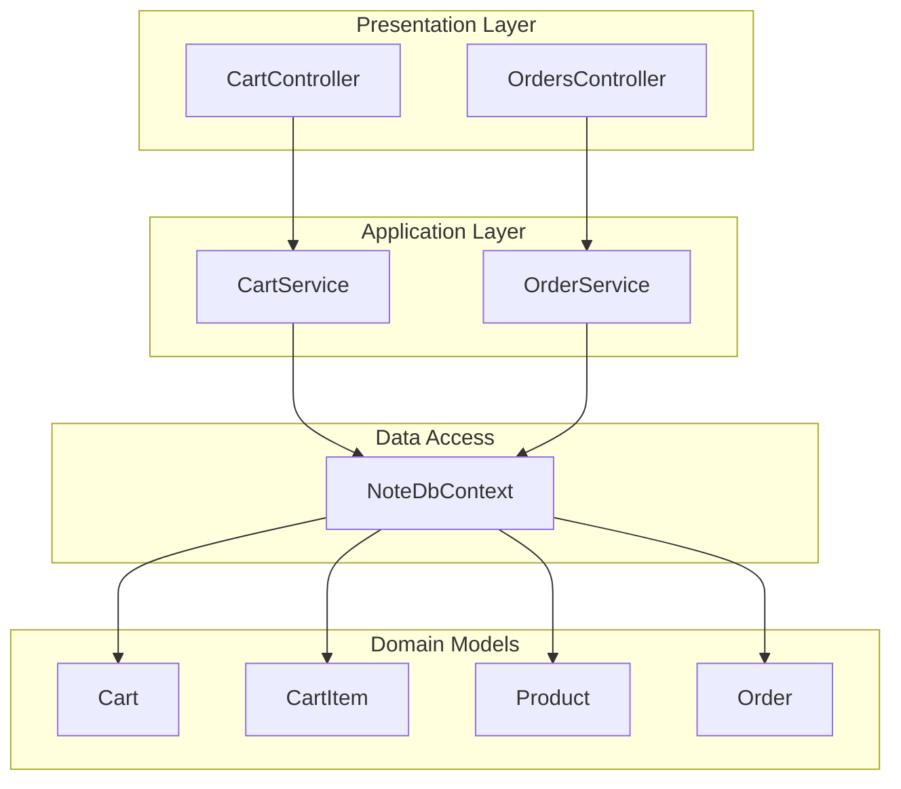
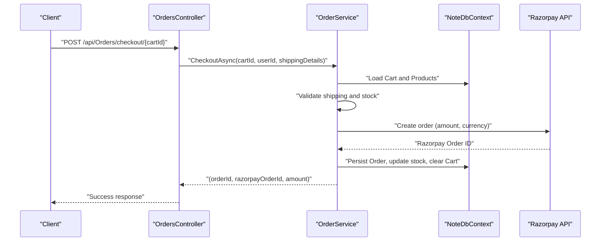
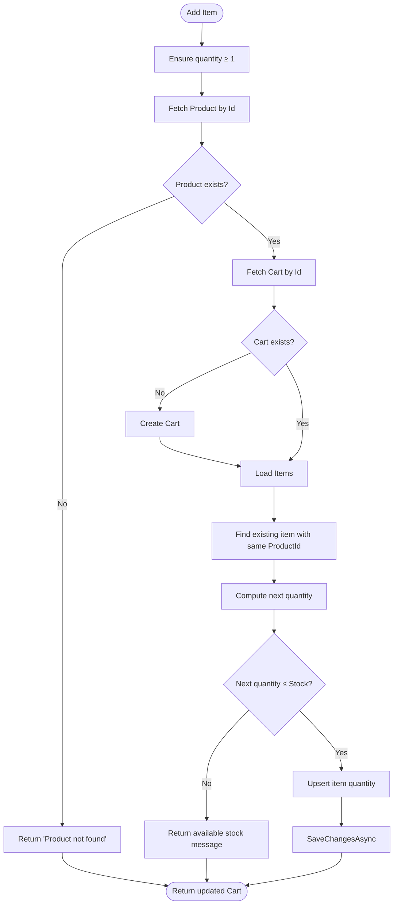
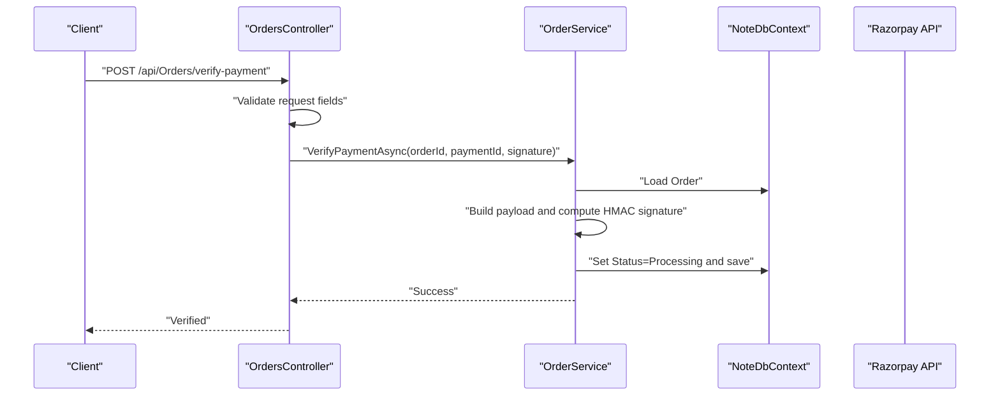
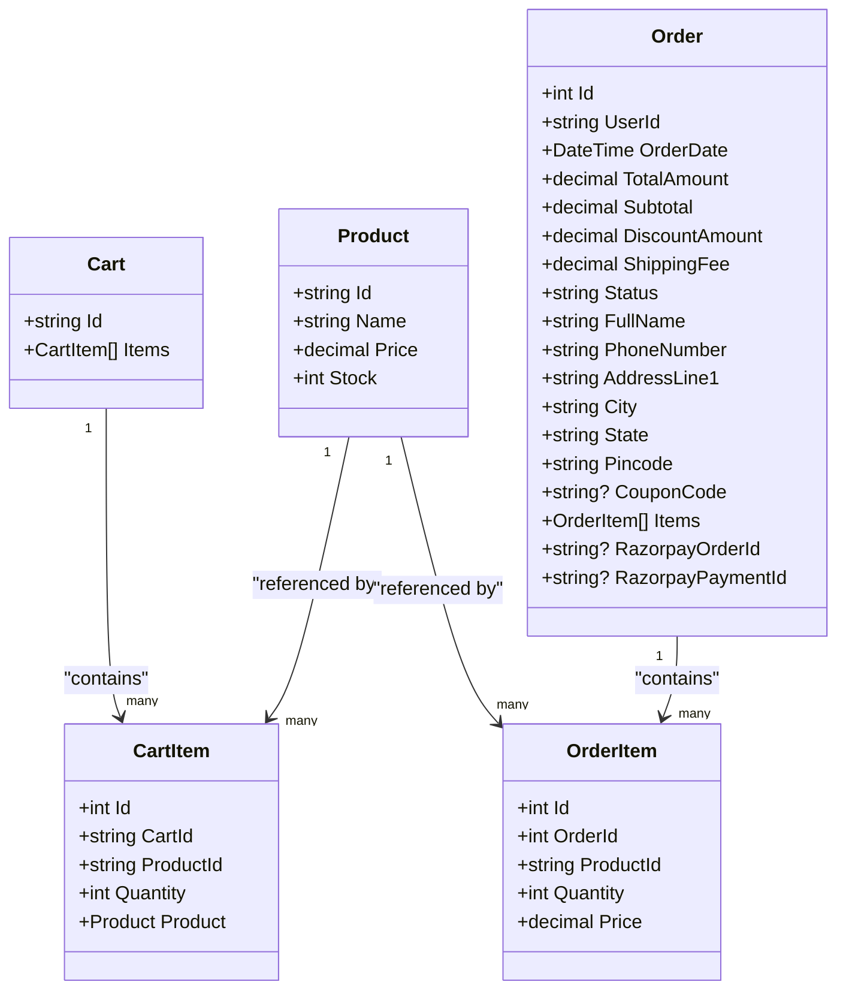
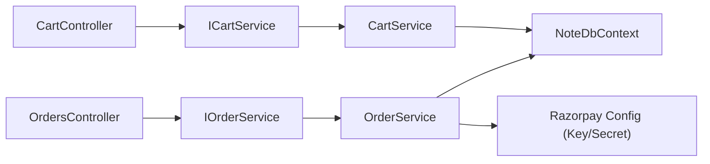

# Shopping Cart & Order Processing

<cite>
**Referenced Files in This Document**
- [Program.cs](file://Program.cs)
- [appsettings.json](file://appsettings.json)
- [Controllers/CartController.cs](file://Controllers/CartController.cs)
- [Controllers/OrdersController.cs](file://Controllers/OrdersController.cs)
- [Services/CartService.cs](file://Services/CartService.cs)
- [Services/OrderService.cs](file://Services/OrderService.cs)
- [Services/ICartService.cs](file://Services/ICartService.cs)
- [Services/IOrderService.cs](file://Services/IOrderService.cs)
- [Models/Cart.cs](file://Models/Cart.cs)
- [Models/CartItem.cs](file://Models/CartItem.cs)
- [Models/Product.cs](file://Models/Product.cs)
- [Models/Order.cs](file://Models/Order.cs)
- [Data/NoteDbContext.cs](file://Data/NoteDbContext.cs)
</cite>

## Table of Contents
1. [Introduction](#introduction)
2. [Project Structure](#project-structure)
3. [Core Components](#core-components)
4. [Architecture Overview](#architecture-overview)
5. [Detailed Component Analysis](#detailed-component-analysis)
6. [Dependency Analysis](#dependency-analysis)
7. [Performance Considerations](#performance-considerations)
8. [Troubleshooting Guide](#troubleshooting-guide)
9. [Conclusion](#conclusion)
10. [Appendices](#appendices)

## Introduction
This document explains the shopping cart and order processing system. It covers:
- Cart management: adding items, updating quantities, removing items, and cart persistence
- Order processing: checkout, payment preparation via Razorpay, order status management, and cancellation
- Controller endpoints, business logic, and data validation
- Practical examples for cart operations, placing orders, and retrieving orders
- Session and cart persistence strategies
- Integration points with external payment processors (Razorpay)

## Project Structure
The system follows a layered architecture:
- Controllers expose HTTP endpoints for cart and order operations
- Services encapsulate business logic and orchestrate data access
- Models define domain entities and DTOs
- Data context manages EF Core entity sets and migrations
- Program configures DI, authentication, CORS, and runtime initialization

**Diagram sources**
- [Controllers/CartController.cs:1-59](file://Controllers/CartController.cs#L1-L59)
- [Controllers/OrdersController.cs:1-121](file://Controllers/OrdersController.cs#L1-L121)
- [Services/CartService.cs:1-106](file://Services/CartService.cs#L1-L106)
- [Services/OrderService.cs:1-270](file://Services/OrderService.cs#L1-L270)
- [Data/NoteDbContext.cs:1-67](file://Data/NoteDbContext.cs#L1-L67)

**Section sources**
- [Program.cs:1-150](file://Program.cs#L1-L150)
- [Data/NoteDbContext.cs:1-67](file://Data/NoteDbContext.cs#L1-L67)

## Core Components
- CartController: exposes GET/POST/PUT/DELETE endpoints for cart items and validates requests
- OrdersController: handles checkout, payment verification, order retrieval, admin status updates, and cancellation
- CartService: retrieves, adds, updates, and removes items; enforces stock limits and persists changes
- OrderService: validates shipping details, computes totals, integrates with Razorpay, persists orders, and manages statuses
- Models: Cart, CartItem, Product, Order, and supporting DTOs for shipping and verification
- Data context: defines entity sets and seeds initial data

**Section sources**
- [Controllers/CartController.cs:1-59](file://Controllers/CartController.cs#L1-L59)
- [Controllers/OrdersController.cs:1-121](file://Controllers/OrdersController.cs#L1-L121)
- [Services/CartService.cs:1-106](file://Services/CartService.cs#L1-L106)
- [Services/OrderService.cs:1-270](file://Services/OrderService.cs#L1-L270)
- [Models/Cart.cs:1-10](file://Models/Cart.cs#L1-L10)
- [Models/CartItem.cs:1-12](file://Models/CartItem.cs#L1-L12)
- [Models/Product.cs:1-21](file://Models/Product.cs#L1-L21)
- [Models/Order.cs:1-62](file://Models/Order.cs#L1-L62)
- [Data/NoteDbContext.cs:1-67](file://Data/NoteDbContext.cs#L1-L67)

## Architecture Overview
The system uses REST controllers, service-layer orchestration, and EF Core for persistence. Authentication is JWT-based, and Razorpay is integrated for payment creation and verification.

**Diagram sources**
- [Controllers/OrdersController.cs:31-51](file://Controllers/OrdersController.cs#L31-L51)
- [Services/OrderService.cs:23-187](file://Services/OrderService.cs#L23-L187)
- [Data/NoteDbContext.cs:11-21](file://Data/NoteDbContext.cs#L11-L21)

## Detailed Component Analysis

### Cart Management
- Retrieve cart: GET api/Cart/{cartId}
- Add item: POST api/Cart/{cartId}/items with ProductId and Quantity
- Update quantity: PUT api/Cart/{cartId}/items/{itemId} with Quantity
- Remove item: DELETE api/Cart/{cartId}/items/{itemId}

Business logic highlights:
- Stock validation prevents overselling
- Cart is lazily created if not present
- Quantities are normalized to minimum 1
- Persistence flushes after each operation

**Diagram sources**
- [Services/CartService.cs:33-73](file://Services/CartService.cs#L33-L73)

**Section sources**
- [Controllers/CartController.cs:18-46](file://Controllers/CartController.cs#L18-L46)
- [Services/CartService.cs:16-104](file://Services/CartService.cs#L16-L104)
- [Models/Cart.cs:1-10](file://Models/Cart.cs#L1-L10)
- [Models/CartItem.cs:1-12](file://Models/CartItem.cs#L1-L12)
- [Models/Product.cs:1-21](file://Models/Product.cs#L1-L21)

### Order Processing Workflow
Endpoints:
- GET /api/Orders: list current user’s orders
- POST /api/Orders/checkout/{cartId}: place order and prepare payment
- POST /api/Orders/verify-payment: verify payment signature
- GET /api/Orders/all (Admin): list all orders
- PUT /api/Orders/{id}/status (Admin): update order status
- PUT /api/Orders/{id}/cancel: cancel a pending order

Key validations and steps:
- Shipping details required and validated (phone length, presence)
- Cart must exist and contain items
- Stock checked against each item
- Coupon applied if valid and active
- Shipping fee logic: free above threshold, otherwise fixed fee
- Razorpay order creation with amount in paise
- Payment verification using HMAC-SHA256 with shared secret
- Order status transitions: Verified payments set status to Processing

**Diagram sources**
- [Controllers/OrdersController.cs:53-71](file://Controllers/OrdersController.cs#L53-L71)
- [Services/OrderService.cs:240-268](file://Services/OrderService.cs#L240-L268)

**Section sources**
- [Controllers/OrdersController.cs:21-106](file://Controllers/OrdersController.cs#L21-L106)
- [Services/OrderService.cs:23-268](file://Services/OrderService.cs#L23-L268)
- [Models/Order.cs:1-62](file://Models/Order.cs#L1-L62)

### Data Models

**Diagram sources**
- [Models/Cart.cs:1-10](file://Models/Cart.cs#L1-L10)
- [Models/CartItem.cs:1-12](file://Models/CartItem.cs#L1-L12)
- [Models/Product.cs:1-21](file://Models/Product.cs#L1-L21)
- [Models/Order.cs:1-62](file://Models/Order.cs#L1-L62)

**Section sources**
- [Models/Cart.cs:1-10](file://Models/Cart.cs#L1-L10)
- [Models/CartItem.cs:1-12](file://Models/CartItem.cs#L1-L12)
- [Models/Product.cs:1-21](file://Models/Product.cs#L1-L21)
- [Models/Order.cs:1-62](file://Models/Order.cs#L1-L62)

### Practical Examples

- Add item to cart
  - Endpoint: POST api/Cart/{cartId}/items
  - Request body: { "productId": "...", "quantity": 1 }
  - Response: Updated Cart

- Update item quantity
  - Endpoint: PUT api/Cart/{cartId}/items/{itemId}
  - Request body: { "quantity": 2 }
  - Response: Updated Cart

- Remove item from cart
  - Endpoint: DELETE api/Cart/{cartId}/items/{itemId}
  - Response: Updated Cart

- Place an order
  - Endpoint: POST api/Orders/checkout/{cartId}
  - Request body: ShippingDetails (full name, phone, address, city, state, pincode, optional coupon)
  - Response: { orderId, razorpayOrderId, amount, currency }

- Verify payment
  - Endpoint: POST api/Orders/verify-payment
  - Request body: { orderId, razorpayPaymentId, razorpayOrderId, razorpaySignature }
  - Response: Success message

- Retrieve user orders
  - Endpoint: GET api/Orders
  - Response: Array of orders sorted by date desc

- Admin: update order status
  - Endpoint: PUT api/Orders/{id}/status
  - Request body: { "status": "..." }
  - Response: Success message

- Admin: list all orders
  - Endpoint: GET api/Orders/all
  - Response: Array of all orders

**Section sources**
- [Controllers/CartController.cs:18-46](file://Controllers/CartController.cs#L18-L46)
- [Controllers/OrdersController.cs:21-106](file://Controllers/OrdersController.cs#L21-L106)
- [Services/CartService.cs:33-104](file://Services/CartService.cs#L33-L104)
- [Services/OrderService.cs:23-268](file://Services/OrderService.cs#L23-L268)

## Dependency Analysis
- Controllers depend on services via interfaces
- Services depend on NoteDbContext for data access
- Razorpay integration is configured via environment variables
- JWT authentication is enabled globally

**Diagram sources**
- [Controllers/CartController.cs:1-59](file://Controllers/CartController.cs#L1-L59)
- [Controllers/OrdersController.cs:1-121](file://Controllers/OrdersController.cs#L1-L121)
- [Services/ICartService.cs:1-12](file://Services/ICartService.cs#L1-L12)
- [Services/IOrderService.cs:1-14](file://Services/IOrderService.cs#L1-L14)
- [Services/CartService.cs:1-106](file://Services/CartService.cs#L1-L106)
- [Services/OrderService.cs:1-270](file://Services/OrderService.cs#L1-L270)
- [Data/NoteDbContext.cs:1-67](file://Data/NoteDbContext.cs#L1-L67)

**Section sources**
- [Program.cs:61-84](file://Program.cs#L61-L84)
- [Services/OrderService.cs:121-127](file://Services/OrderService.cs#L121-L127)

## Performance Considerations
- Minimize database roundtrips by batching operations (already done via single SaveChangesAsync per operation)
- Use indexing on frequently queried columns (e.g., Products.Id, Cart.Id, Orders.UserId)
- Avoid loading unnecessary navigation properties; use projections where appropriate
- Consider caching product prices and stock levels for high-traffic scenarios
- Validate input early to fail fast and reduce unnecessary work

## Troubleshooting Guide
Common issues and resolutions:
- Payment gateway configuration missing
  - Cause: Missing RAZORPAY_KEY_ID or RAZORPAY_KEY_SECRET
  - Resolution: Set environment variables and restart the service
  - Evidence: Checkout returns configuration error

- Cart is empty or not found during checkout
  - Cause: Cart does not exist or has no items
  - Resolution: Ensure client creates and populates the cart before checkout

- Phone number validation fails
  - Cause: Length outside allowed range
  - Resolution: Ensure phone number length is between 10 and 15 digits

- Stock insufficient
  - Cause: Requested quantity exceeds available stock
  - Resolution: Reduce quantity or inform user of available stock

- Payment verification failure
  - Cause: Incorrect signature or missing secret
  - Resolution: Confirm server-side secret matches client-side signing and payload

**Section sources**
- [Services/OrderService.cs:121-133](file://Services/OrderService.cs#L121-L133)
- [Services/OrderService.cs:25-39](file://Services/OrderService.cs#L25-L39)
- [Services/OrderService.cs:67-71](file://Services/OrderService.cs#L67-L71)
- [Services/OrderService.cs:246-248](file://Services/OrderService.cs#L246-L248)
- [Services/OrderService.cs:250-267](file://Services/OrderService.cs#L250-L267)

## Conclusion
The system provides a robust cart and order processing pipeline with strong validation, stock enforcement, and Razorpay integration. Controllers expose clear endpoints, services encapsulate business logic, and EF Core manages persistence with seeded data. Administrators can manage orders, while clients can track and manage their own orders securely via JWT.

## Appendices

### Authentication and Authorization
- JWT bearer tokens are enabled for secure access
- Orders endpoints require authentication; admin-only endpoints require role claims

**Section sources**
- [Program.cs:69-84](file://Program.cs#L69-L84)
- [Controllers/OrdersController.cs:11-12](file://Controllers/OrdersController.cs#L11-L12)
- [Controllers/OrdersController.cs:72-91](file://Controllers/OrdersController.cs#L72-L91)

### Razorpay Integration Notes
- Keys are loaded from configuration/environment variables
- Orders are created with amount in paise and currency set to INR
- Payment verification uses HMAC-SHA256 with the shared secret

**Section sources**
- [Services/OrderService.cs:121-127](file://Services/OrderService.cs#L121-L127)
- [Services/OrderService.cs:139-147](file://Services/OrderService.cs#L139-L147)
- [Services/OrderService.cs:246-267](file://Services/OrderService.cs#L246-L267)

### Cart Persistence Strategy
- Cart is persisted per cartId
- Lazy creation ensures carts are only stored when needed
- After checkout, the cart is cleared and stock is reduced

**Section sources**
- [Services/CartService.cs:16-31](file://Services/CartService.cs#L16-L31)
- [Services/CartService.cs:45-49](file://Services/CartService.cs#L45-L49)
- [Services/OrderService.cs:172-175](file://Services/OrderService.cs#L172-L175)