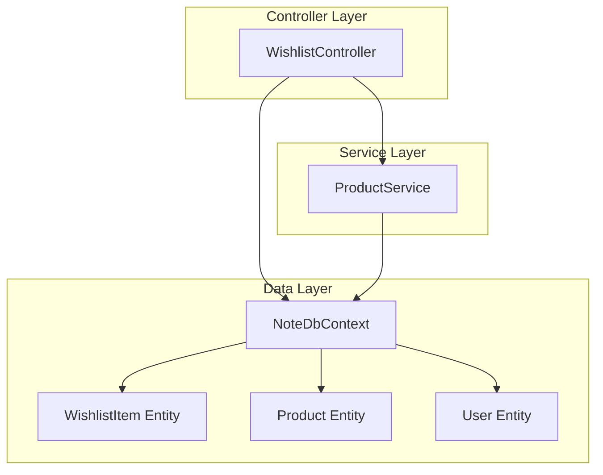
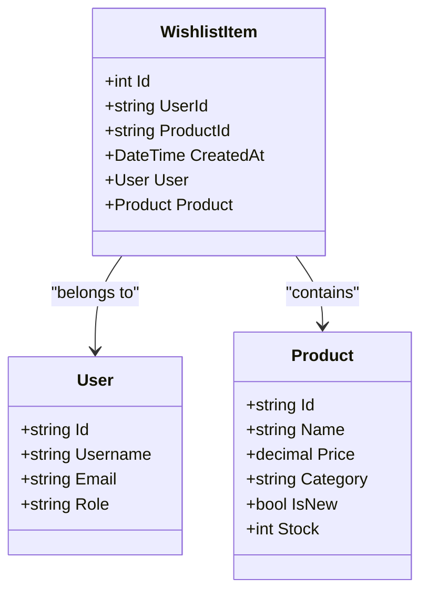
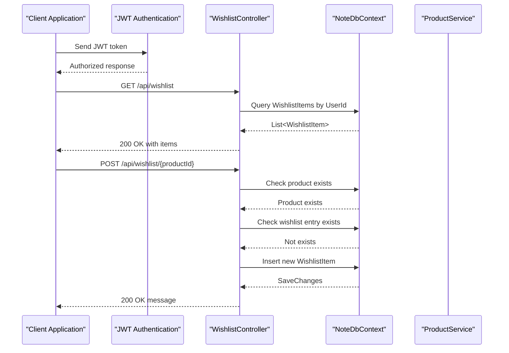
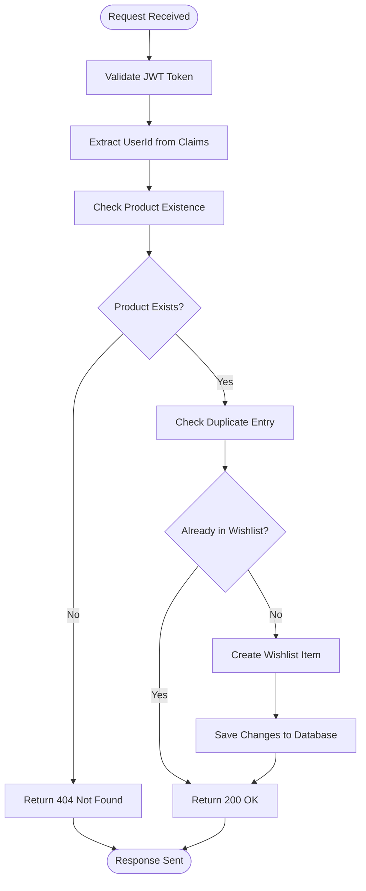
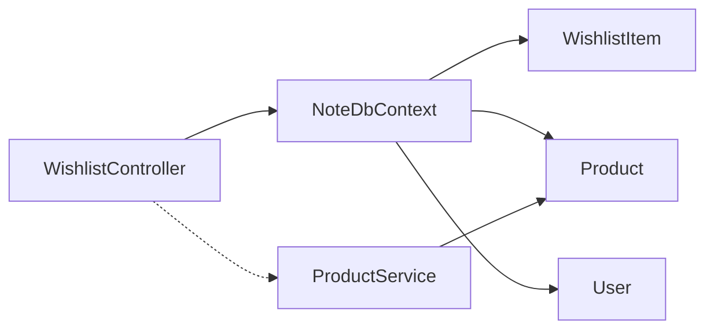

# Wishlist Management

<cite>
**Referenced Files in This Document**
- [WishlistController.cs](file://Controllers/WishlistController.cs)
- [WishlistItem.cs](file://Models/WishlistItem.cs)
- [Product.cs](file://Models/Product.cs)
- [User.cs](file://Models/User.cs)
- [NoteDbContext.cs](file://Data/NoteDbContext.cs)
- [20260427184435_InitialCreate.cs](file://Migrations/20260427184435_InitialCreate.cs)
- [Program.cs](file://Program.cs)
- [IProductService.cs](file://Services/IProductService.cs)
- [ProductService.cs](file://Services/ProductService.cs)
</cite>

## Table of Contents
1. [Introduction](#introduction)
2. [Project Structure](#project-structure)
3. [Core Components](#core-components)
4. [Architecture Overview](#architecture-overview)
5. [Detailed Component Analysis](#detailed-component-analysis)
6. [Dependency Analysis](#dependency-analysis)
7. [Performance Considerations](#performance-considerations)
8. [Troubleshooting Guide](#troubleshooting-guide)
9. [Conclusion](#conclusion)

## Introduction
This document provides comprehensive documentation for the wishlist management system, focusing on user preference handling, wishlist controller endpoints, item management functionality, and user preference persistence. It explains the WishlistItem model, user associations, and wishlist operations, while detailing integration with the product catalog, wishlist sharing capabilities, and preference synchronization across devices. Performance considerations for large wishlists and user preference analytics are also addressed.

## Project Structure
The wishlist system is implemented as part of a layered ASP.NET Core application with clear separation between controllers, models, data access, and services. The key components involved in wishlist management include:
- Controller layer: WishlistController exposes REST endpoints for managing user wishlists
- Model layer: WishlistItem represents the persisted relationship between users and products
- Data layer: NoteDbContext manages entity relationships and database schema
- Migration layer: Defines database schema and indexes for efficient queries
- Service layer: ProductService integrates with the product catalog for product validation

**Diagram sources**
- [WishlistController.cs:13-81](file://Controllers/WishlistController.cs#L13-L81)
- [NoteDbContext.cs:11-21](file://Data/NoteDbContext.cs#L11-L21)
- [ProductService.cs:7-95](file://Services/ProductService.cs#L7-L95)

**Section sources**
- [WishlistController.cs:13-81](file://Controllers/WishlistController.cs#L13-L81)
- [NoteDbContext.cs:11-21](file://Data/NoteDbContext.cs#L11-L21)
- [Program.cs:61-67](file://Program.cs#L61-L67)

## Core Components
This section documents the primary components that enable wishlist functionality, including the controller endpoints, model definitions, and database relationships.

### WishlistController Endpoints
The WishlistController provides four primary endpoints for managing user wishlists:
- GET /api/wishlist: Retrieves a user's wishlist with product details
- GET /api/wishlist/{productId}/exists: Checks if a product exists in the user's wishlist
- POST /api/wishlist/{productId}: Adds a product to the user's wishlist
- DELETE /api/wishlist/{productId}: Removes a product from the user's wishlist

Each endpoint enforces authorization using JWT bearer tokens and extracts the user identifier from claims to ensure operations are performed within the authenticated user's context.

**Section sources**
- [WishlistController.cs:22-80](file://Controllers/WishlistController.cs#L22-L80)

### WishlistItem Model
The WishlistItem model represents the persisted relationship between users and products. It includes:
- Identifier fields for UserId and ProductId
- Navigation properties to User and Product entities
- Timestamp for CreatedAt to support ordering and analytics
- Unique composite index on UserId and ProductId to prevent duplicates

**Diagram sources**
- [WishlistItem.cs:3-11](file://Models/WishlistItem.cs#L3-L11)
- [User.cs:3-11](file://Models/User.cs#L3-L11)
- [Product.cs:3-20](file://Models/Product.cs#L3-L20)

**Section sources**
- [WishlistItem.cs:3-11](file://Models/WishlistItem.cs#L3-L11)
- [NoteDbContext.cs:41-43](file://Data/NoteDbContext.cs#L41-L43)

### Database Schema and Relationships
The database schema defines the WishlistItems table with foreign keys to Users and Products, along with indexes for efficient querying:
- Composite unique index on UserId and ProductId prevents duplicate entries
- Individual index on ProductId supports product-centric queries
- Cascade delete ensures cleanup when users or products are removed

**Section sources**
- [20260427184435_InitialCreate.cs:192-221](file://Migrations/20260427184435_InitialCreate.cs#L192-L221)
- [20260427184435_InitialCreate.cs:312-321](file://Migrations/20260427184435_InitialCreate.cs#L312-L321)

## Architecture Overview
The wishlist system follows a clean architecture pattern with clear separation of concerns:
- Authentication: JWT bearer tokens secure all endpoints
- Authorization: Claims-based user identification
- Data Access: Entity Framework Core manages relationships and queries
- Product Catalog Integration: ProductService validates product existence before adding to wishlist

**Diagram sources**
- [WishlistController.cs:22-80](file://Controllers/WishlistController.cs#L22-L80)
- [NoteDbContext.cs:16-17](file://Data/NoteDbContext.cs#L16-L17)
- [ProductService.cs:47-50](file://Services/ProductService.cs#L47-L50)

## Detailed Component Analysis

### WishlistController Operations
The WishlistController implements four core operations with robust error handling and validation:

#### Get Wishlist
Retrieves all wishlist items for the authenticated user, including product details, ordered by creation date descending. Uses eager loading to minimize database round trips.

#### Exists Check
Performs a lightweight existence check to determine if a product is already in the user's wishlist, enabling UI feedback without loading full item data.

#### Add to Wishlist
Validates product existence, checks for duplicate entries, and creates a new wishlist item if none exists. Returns appropriate HTTP status codes and messages.

#### Remove from Wishlist
Finds and removes the specific wishlist item for the authenticated user, handling cases where the item may not exist.

**Diagram sources**
- [WishlistController.cs:47-64](file://Controllers/WishlistController.cs#L47-L64)

**Section sources**
- [WishlistController.cs:22-80](file://Controllers/WishlistController.cs#L22-L80)

### Product Catalog Integration
The wishlist system integrates with the product catalog through ProductService, which provides:
- Product validation before adding to wishlist
- Comprehensive product listing for administrative purposes
- Flexible filtering and sorting for product discovery

**Section sources**
- [IProductService.cs:5-12](file://Services/IProductService.cs#L5-L12)
- [ProductService.cs:16-45](file://Services/ProductService.cs#L16-L45)

### User Preference Persistence
User preferences are persisted through the WishlistItem entity, which:
- Maintains a timestamp for preference ordering
- Supports analytics through CreatedAt field
- Enables cross-device synchronization through shared UserId
- Prevents duplicates through database constraints

**Section sources**
- [WishlistItem.cs:10](file://Models/WishlistItem.cs#L10)
- [NoteDbContext.cs:41-43](file://Data/NoteDbContext.cs#L41-L43)

## Dependency Analysis
The wishlist system exhibits low coupling and high cohesion:
- Controller depends on NoteDbContext for data access
- No direct dependency on ProductService for wishlist operations
- Clear separation between wishlist management and product catalog services
- Database relationships enforce referential integrity

**Diagram sources**
- [WishlistController.cs:15-20](file://Controllers/WishlistController.cs#L15-L20)
- [NoteDbContext.cs:16-17](file://Data/NoteDbContext.cs#L16-L17)
- [ProductService.cs:9-14](file://Services/ProductService.cs#L9-L14)

**Section sources**
- [WishlistController.cs:15-20](file://Controllers/WishlistController.cs#L15-L20)
- [NoteDbContext.cs:16-17](file://Data/NoteDbContext.cs#L16-L17)

## Performance Considerations
Several factors influence wishlist performance, particularly for large datasets:

### Database Indexing Strategy
- Composite unique index on UserId and ProductId prevents duplicates and accelerates lookups
- Individual index on ProductId supports product-centric queries
- Cascade deletes ensure referential integrity without additional overhead

### Query Optimization
- Eager loading of Product details reduces N+1 query problems
- Ordering by CreatedAt provides intuitive user experience
- AsNoTracking in ProductService avoids change tracking for read-only operations

### Scalability Recommendations
- Consider pagination for users with very large wishlists
- Implement caching for frequently accessed product information
- Monitor query performance with database profiling tools
- Consider partitioning strategies for extremely large datasets

**Section sources**
- [20260427184435_InitialCreate.cs:312-321](file://Migrations/20260427184435_InitialCreate.cs#L312-L321)
- [ProductService.cs:18](file://Services/ProductService.cs#L18)

## Troubleshooting Guide
Common issues and their resolutions:

### Authentication Failures
- Verify JWT token is present in Authorization header
- Ensure token is not expired and contains valid claims
- Check JWT configuration in Program.cs

### Product Not Found Errors
- Confirm product ID format matches database records
- Verify product exists in Product table
- Check product catalog service availability

### Duplicate Entry Prevention
- Database constraints prevent duplicate wishlist entries
- Use exists endpoint to check before adding
- Handle duplicate scenarios gracefully in client applications

### Cross-Device Synchronization
- Ensure consistent UserId across devices
- Verify database connectivity for all devices
- Implement retry logic for network failures

**Section sources**
- [WishlistController.cs:25-26](file://Controllers/WishlistController.cs#L25-L26)
- [WishlistController.cs:53-54](file://Controllers/WishlistController.cs#L53-L54)
- [Program.cs:69-84](file://Program.cs#L69-L84)

## Conclusion
The wishlist management system provides a robust foundation for user preference handling with clear architectural boundaries, strong data integrity, and efficient query patterns. The implementation supports essential wishlist operations, integrates seamlessly with the product catalog, and offers scalability considerations for growing user bases. The design enables future enhancements such as wishlist sharing and advanced preference analytics while maintaining performance and reliability.